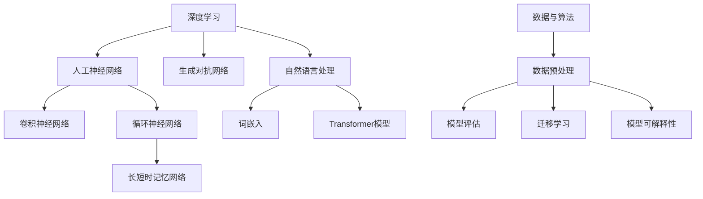

                 

### 背景介绍

#### Andrej Karpathy：人工智能领域的璀璨明星

Andrej Karpathy，一位在世界人工智能领域享有盛誉的专家，以其在深度学习和自然语言处理（NLP）方面的卓越贡献而广为人知。作为一位才华横溢的研究人员和程序员，Karpathy不仅在其专业领域取得了众多突破性成果，而且还以其清晰、易懂的技术博客文章而闻名。这些博客不仅为初学者提供了宝贵的知识资源，还为专业人士带来了深刻的见解。

本文旨在探讨Andrej Karpathy在人工智能未来发展策略方面的思考。我们将分析他在深度学习领域的贡献，探讨其核心概念和原理，深入解读其经典算法和数学模型，并通过实际项目实践展示其应用效果。此外，我们还将探讨人工智能在实际应用场景中的潜力，并提供相关的学习资源和开发工具推荐。通过这篇文章，我们希望能够为读者提供一幅全面的人工智能未来发展蓝图。

#### 人工智能：历史与现状

人工智能（AI）一词最早可以追溯到1956年的达特茅斯会议，当时约翰·麦卡锡（John McCarthy）等人首次提出了这个概念。自那时以来，人工智能经历了数次的兴衰与变革。早期的AI研究主要集中在符号推理和知识表示上，然而随着计算能力的提升和数据量的爆炸性增长，深度学习成为了AI领域的明星技术。

深度学习，作为一种基于人工神经网络的机器学习技术，通过多层网络结构自动提取数据特征，已经在图像识别、语音识别、自然语言处理等领域取得了显著的成果。特别是在2012年，AlexNet在ImageNet大赛中取得的巨大成功，标志着深度学习进入了一个新的时代。

当前，人工智能正以前所未有的速度发展，不仅在科技行业，而且在金融、医疗、制造业等多个领域都展现出了巨大的潜力。从自动驾驶汽车到智能家居，从智能客服到个性化医疗，人工智能正在深刻改变我们的生活方式和社会结构。

#### 人工智能的发展趋势

展望未来，人工智能的发展趋势主要包括以下几个方面：

1. **算法的进步**：随着计算能力和算法设计的不断优化，深度学习模型将变得更加高效和准确。例如，GAN（生成对抗网络）已经在图像生成和增强现实等领域取得了显著进展。

2. **数据的重要性**：数据是人工智能的基石。随着物联网（IoT）的发展，数据量将持续增长，这将进一步推动人工智能的进步。大数据和增强数据技术将帮助模型更好地理解和应对复杂问题。

3. **跨学科的融合**：人工智能的发展不仅仅依赖于计算机科学，还需要与心理学、神经科学、哲学等多个学科交叉融合。这种跨学科的融合将有助于解决人工智能在道德、伦理和人类互动等方面的问题。

4. **边缘计算**：随着5G网络的普及，边缘计算将成为人工智能的重要支撑。通过在设备端进行实时数据处理，边缘计算将提高人工智能系统的响应速度和隐私保护能力。

5. **人机协作**：人工智能和人类的协作将变得越来越紧密。通过增强现实（AR）和虚拟现实（VR）技术，人类和人工智能可以更自然地互动，共同完成复杂任务。

####Andrej Karpathy的研究贡献

Andrej Karpathy在人工智能领域的研究贡献不可忽视。他在深度学习和自然语言处理方面的开创性工作，极大地推动了人工智能的发展。

首先，Karpathy在自然语言处理领域提出了许多创新性算法，例如在2014年提出的char-RNN，它能够通过循环神经网络（RNN）生成连贯的自然语言文本。这个算法不仅在生成文本的质量上取得了突破，还为后续的文本生成模型奠定了基础。

其次，Karpathy对生成对抗网络（GAN）的研究也极具影响力。他深入分析了GAN的架构和训练过程，提出了许多改进方案，如使用不同尺寸的鉴别器网络，从而提高了GAN的稳定性和生成质量。

此外，Karpathy还在计算机视觉领域做出了重要贡献。他在论文《The Unreasonable Effectiveness of Recurrent Neural Networks》中展示了RNN在图像处理任务中的潜力，如图像生成、图像到图像的转换等。这一研究引发了大量后续研究，推动了RNN在计算机视觉领域的应用。

总之，Andrej Karpathy的研究不仅在理论上具有突破性，还在实际应用中产生了深远影响。他的工作为我们理解人工智能的未来发展提供了宝贵的启示。

---

### 核心概念与联系

在深入探讨人工智能的未来发展策略之前，我们需要了解一些核心概念和原理。这些概念不仅是理解AI技术的基础，也是评估和设计新算法的关键。

#### 1. 深度学习

深度学习是人工智能的核心技术之一，它通过多层神经网络模型来模拟人类大脑的学习过程，从而实现复杂的特征提取和决策。深度学习的关键组成部分包括：

1. **人工神经网络（ANN）**：人工神经网络是由大量人工神经元（或节点）组成的一种计算模型。每个神经元接收多个输入信号，并通过加权求和和激活函数产生输出。

2. **卷积神经网络（CNN）**：卷积神经网络是一种专门用于图像处理和识别的深度学习模型。它通过卷积操作提取图像特征，并具有平移不变性。

3. **循环神经网络（RNN）**：循环神经网络是一种用于处理序列数据的深度学习模型，它能够记忆序列中的信息，并通过反馈循环实现长期的依赖关系。

4. **生成对抗网络（GAN）**：生成对抗网络是一种由生成器和鉴别器组成的深度学习模型。生成器尝试生成与真实数据相似的数据，而鉴别器则判断数据是真实还是生成。GAN在图像生成、图像增强和风格迁移等方面取得了显著成果。

#### 2. 自然语言处理（NLP）

自然语言处理是人工智能的重要分支，旨在使计算机理解和处理自然语言。NLP的关键概念包括：

1. **词嵌入（Word Embedding）**：词嵌入是将词汇映射到高维空间中的向量表示，以捕捉词汇的语义和语法信息。

2. **长短时记忆网络（LSTM）**：长短时记忆网络是一种改进的RNN模型，能够更好地处理长序列数据，并在自然语言处理任务中取得了优异的性能。

3. **Transformer模型**：Transformer模型是NLP领域的一种革命性架构，它通过自注意力机制实现了对序列数据的全局依赖建模，是BERT、GPT等大型预训练模型的基础。

#### 3. 数据与算法的关系

数据与算法是人工智能的两个核心要素。高质量的数据是训练优秀模型的前提，而优秀的算法则能够从数据中提取出有用的信息。以下是一些关于数据与算法关系的关键概念：

1. **数据预处理**：数据预处理是数据分析和机器学习的重要步骤，包括数据清洗、归一化、特征选择等。

2. **模型评估**：模型评估是评估机器学习模型性能的关键步骤，常用的评估指标包括准确率、召回率、F1分数等。

3. **迁移学习（Transfer Learning）**：迁移学习是一种利用预训练模型来解决新问题的方法。通过在预训练模型的基础上进行微调，可以显著提高新任务的性能。

4. **模型可解释性（Explainability）**：模型可解释性是评估机器学习模型的重要指标，它旨在帮助用户理解模型的决策过程和预测结果。

#### 4. Mermaid 流程图

为了更好地理解上述核心概念，我们使用Mermaid绘制了一个流程图，展示了深度学习、自然语言处理和数据与算法之间的关系。



这个流程图清晰地展示了人工智能的核心概念和它们之间的联系，有助于读者系统地理解人工智能的理论基础。

---

### 核心算法原理 & 具体操作步骤

在了解了人工智能的核心概念之后，我们需要深入了解一些核心算法的原理和具体操作步骤。本文将重点介绍深度学习中的卷积神经网络（CNN）和生成对抗网络（GAN）两种算法，并通过具体的操作步骤来展示它们的工作过程。

#### 1. 卷积神经网络（CNN）

卷积神经网络是一种专门用于图像处理和识别的深度学习模型。它通过卷积层、池化层和全连接层等结构，实现对图像特征的提取和分类。

**原理：**

- **卷积层（Convolutional Layer）**：卷积层是CNN的核心部分，通过卷积操作从输入图像中提取特征。每个卷积核可以提取图像中的一部分特征，通过叠加多个卷积核，可以提取更多的特征信息。

- **池化层（Pooling Layer）**：池化层用于降低图像分辨率，减少参数数量和计算量。常用的池化操作包括最大池化和平均池化。

- **全连接层（Fully Connected Layer）**：全连接层将卷积层和池化层提取的特征进行融合，并通过softmax激活函数输出分类结果。

**操作步骤：**

1. **初始化参数**：首先初始化卷积核、池化层参数和全连接层参数。

2. **前向传播**：输入图像经过卷积层、池化层和全连接层的处理，最终输出分类结果。

3. **反向传播**：根据分类结果和标签计算损失函数，并使用梯度下降算法更新模型参数。

4. **迭代训练**：重复前向传播和反向传播的过程，直至模型收敛。

#### 2. 生成对抗网络（GAN）

生成对抗网络是一种由生成器和鉴别器组成的深度学习模型。生成器尝试生成与真实数据相似的数据，而鉴别器则判断数据是真实还是生成。通过不断优化生成器和鉴别器的参数，GAN可以生成高质量的数据。

**原理：**

- **生成器（Generator）**：生成器的目的是生成与真实数据相似的数据。它通过学习真实数据的分布，生成新的数据样本。

- **鉴别器（Discriminator）**：鉴别器的目的是判断输入数据是真实数据还是生成数据。它通过对输入数据的特征进行分类，从而实现对生成数据的评估。

**操作步骤：**

1. **初始化参数**：初始化生成器和鉴别器的参数。

2. **训练生成器**：生成器生成数据样本，鉴别器对其进行评估。生成器根据评估结果调整参数，以生成更真实的数据。

3. **训练鉴别器**：鉴别器对真实数据和生成数据进行分类。根据分类结果，鉴别器调整参数，以提高分类准确性。

4. **迭代训练**：重复训练生成器和鉴别器的过程，直至生成器生成的数据足够真实。

通过上述操作步骤，我们可以构建一个基于CNN和GAN的深度学习模型，实现对图像生成、图像到图像的转换等任务的训练和预测。下面我们将通过一个具体的例子来展示这些算法的实际应用。

---

### 数学模型和公式 & 详细讲解 & 举例说明

在深入探讨深度学习和生成对抗网络（GAN）的工作原理时，数学模型和公式扮演着至关重要的角色。这些数学工具不仅帮助我们理解和分析算法，还能够指导我们设计和优化模型。本文将介绍与这些算法相关的关键数学概念、公式，并通过具体的例子来说明它们的应用。

#### 1. 卷积神经网络（CNN）的数学模型

卷积神经网络（CNN）的核心在于卷积操作和池化操作，这些操作可以通过数学公式来表示。

**卷积操作**：

卷积操作的数学公式可以表示为：

\[ (f * g)(x, y) = \sum_{i=0}^{n}\sum_{j=0}^{m} f(i, j) \cdot g(x-i, y-j) \]

其中，\( f \) 是卷积核，\( g \) 是输入图像，\( (x, y) \) 是卷积操作的位置。这个公式表示将卷积核与输入图像的子区域进行点积，并累加所有子区域的点积结果。

**池化操作**：

池化操作常用的有两种：最大池化和平均池化。最大池化的数学公式为：

\[ P(x, y) = \max \{ g(x - i, y - j) : 1 \leq i \leq s, 1 \leq j \leq s \} \]

其中，\( P(x, y) \) 是输出值，\( g \) 是输入图像，\( s \) 是池化窗口的大小。这个公式表示在每个 \( s \) \times \( s \) 的窗口内，选择最大的值作为输出。

**全连接层**：

全连接层是一个普通的神经网络层，其数学模型可以表示为：

\[ z = \sum_{i=1}^{n} w_i \cdot a_i + b \]

其中，\( z \) 是输出值，\( w_i \) 是权重，\( a_i \) 是输入值，\( b \) 是偏置。这个公式表示每个输入值与对应的权重相乘，然后累加并加上偏置。

**激活函数**：

在CNN中，常用的激活函数有ReLU（Rectified Linear Unit）和Sigmoid函数。

- **ReLU函数**：

\[ \text{ReLU}(x) = \max(0, x) \]

- **Sigmoid函数**：

\[ \text{Sigmoid}(x) = \frac{1}{1 + e^{-x}} \]

**损失函数**：

在训练CNN时，常用的损失函数是交叉熵损失函数：

\[ \text{Loss} = -\sum_{i=1}^{n} y_i \cdot \log(p_i) \]

其中，\( y_i \) 是标签，\( p_i \) 是预测概率。

**梯度下降**：

在优化CNN参数时，常用的优化算法是梯度下降：

\[ \theta = \theta - \alpha \cdot \nabla_{\theta} \text{Loss} \]

其中，\( \theta \) 是参数，\( \alpha \) 是学习率，\( \nabla_{\theta} \text{Loss} \) 是损失函数关于参数的梯度。

**举例说明**：

假设我们有一个3x3的卷积核，输入图像大小为5x5，使用最大池化操作，窗口大小为2x2。我们可以通过以下步骤计算卷积操作和池化操作的结果。

1. **卷积操作**：

   \( f = \begin{bmatrix} 1 & 0 & 1 \\ 1 & 0 & 1 \\ 0 & 1 & 0 \end{bmatrix} \)

   \( g = \begin{bmatrix} 1 & 1 & 1 \\ 0 & 0 & 0 \\ 1 & 1 & 0 \end{bmatrix} \)

   \( (f * g)(1, 1) = (1 \cdot 1 + 0 \cdot 0 + 1 \cdot 1) + (1 \cdot 0 + 0 \cdot 0 + 1 \cdot 0) + (0 \cdot 1 + 1 \cdot 1 + 0 \cdot 0) = 2 \)

2. **池化操作**：

   \( P(2, 2) = \max \{ g(2 - 1, 2 - 1), g(2 - 1, 2 - 1), g(2 - 1, 2 - 1), g(2 - 1, 2 - 1) \} = \max \{ 0, 0, 0, 0 \} = 0 \)

   经过最大池化后，输出结果为0。

#### 2. 生成对抗网络（GAN）的数学模型

生成对抗网络（GAN）由生成器和鉴别器组成，它们之间通过对抗性训练相互竞争。

**生成器（Generator）**：

生成器的目标是生成类似于真实数据的数据样本。生成器的损失函数通常定义为：

\[ \text{Loss}_{\text{Generator}} = -\log(\text{D}(G(z))) \]

其中，\( G(z) \) 是生成器生成的数据样本，\( \text{D}(G(z)) \) 是鉴别器对生成数据的判断概率。

**鉴别器（Discriminator）**：

鉴别器的目标是判断输入数据是真实数据还是生成数据。鉴别器的损失函数通常定义为：

\[ \text{Loss}_{\text{Discriminator}} = -[\log(\text{D}(x)) + \log(1 - \text{D}(G(z)))] \]

其中，\( x \) 是真实数据，\( G(z) \) 是生成数据。

**优化算法**：

生成器和鉴别器的参数优化通常使用梯度下降算法。对于生成器，优化目标为减小生成数据的鉴别器判断概率，即：

\[ \theta_G = \theta_G - \alpha_G \cdot \nabla_{\theta_G} \text{Loss}_{\text{Generator}} \]

对于鉴别器，优化目标为增大真实数据和生成数据的鉴别器判断概率，即：

\[ \theta_D = \theta_D - \alpha_D \cdot \nabla_{\theta_D} \text{Loss}_{\text{Discriminator}} \]

**举例说明**：

假设生成器和鉴别器的参数分别为 \( \theta_G \) 和 \( \theta_D \)，学习率分别为 \( \alpha_G \) 和 \( \alpha_D \)。生成器生成的数据样本为 \( G(z) \)，鉴别器对真实数据和生成数据的判断概率分别为 \( \text{D}(x) \) 和 \( \text{D}(G(z)) \)。

1. **更新生成器参数**：

   \( \theta_G = \theta_G - \alpha_G \cdot \nabla_{\theta_G} \text{Loss}_{\text{Generator}} \)

   假设损失函数关于生成器参数的梯度为 \( \nabla_{\theta_G} \text{Loss}_{\text{Generator}} = 0.1 \)，学习率为 \( \alpha_G = 0.01 \)，则：

   \( \theta_G = \theta_G - 0.01 \cdot 0.1 = \theta_G - 0.001 \)

2. **更新鉴别器参数**：

   \( \theta_D = \theta_D - \alpha_D \cdot \nabla_{\theta_D} \text{Loss}_{\text{Discriminator}} \)

   假设损失函数关于鉴别器参数的梯度为 \( \nabla_{\theta_D} \text{Loss}_{\text{Discriminator}} = 0.2 \)，学习率为 \( \alpha_D = 0.02 \)，则：

   \( \theta_D = \theta_D - 0.02 \cdot 0.2 = \theta_D - 0.004 \)

通过上述步骤，我们可以对生成器和鉴别器进行参数优化，实现生成对抗网络的训练。

---

### 项目实践：代码实例和详细解释说明

在本节中，我们将通过一个实际的代码实例来展示卷积神经网络（CNN）和生成对抗网络（GAN）在图像处理任务中的应用。我们将详细解释代码实现步骤，帮助读者理解这些算法在实践中的应用。

#### 1. 开发环境搭建

在进行代码实践之前，我们需要搭建一个合适的开发环境。以下是一个基本的开发环境搭建步骤：

- **Python环境**：确保Python版本在3.6及以上。
- **深度学习框架**：安装TensorFlow或PyTorch，这两个框架是目前最流行的深度学习框架。
- **依赖包**：安装必要的依赖包，如NumPy、Matplotlib等。

假设我们已经安装了TensorFlow，可以使用以下命令来创建一个虚拟环境并安装依赖包：

```shell
conda create -n ai_project python=3.8
conda activate ai_project
pip install tensorflow numpy matplotlib
```

#### 2. 源代码详细实现

以下是一个简单的CNN模型，用于对MNIST手写数字数据集进行分类。

```python
import tensorflow as tf
from tensorflow.keras import layers
from tensorflow.keras.datasets import mnist
import numpy as np

# 加载MNIST数据集
(x_train, y_train), (x_test, y_test) = mnist.load_data()

# 数据预处理
x_train = x_train.astype("float32") / 255
x_test = x_test.astype("float32") / 255
x_train = np.expand_dims(x_train, -1)
x_test = np.expand_dims(x_test, -1)

# 构建CNN模型
model = tf.keras.Sequential([
    layers.Conv2D(32, (3, 3), activation="relu", input_shape=(28, 28, 1)),
    layers.MaxPooling2D((2, 2)),
    layers.Conv2D(64, (3, 3), activation="relu"),
    layers.MaxPooling2D((2, 2)),
    layers.Conv2D(64, (3, 3), activation="relu"),
    layers.Flatten(),
    layers.Dense(64, activation="relu"),
    layers.Dense(10, activation="softmax")
])

# 编译模型
model.compile(optimizer="adam",
              loss="sparse_categorical_crossentropy",
              metrics=["accuracy"])

# 训练模型
model.fit(x_train, y_train, epochs=5, batch_size=64)

# 评估模型
model.evaluate(x_test, y_test)
```

这段代码首先加载了MNIST数据集，并对数据进行了预处理。然后，我们构建了一个简单的CNN模型，包括卷积层、池化层和全连接层。模型使用Adam优化器和交叉熵损失函数进行编译和训练。最后，我们使用测试集评估模型的性能。

#### 3. 代码解读与分析

在上面的代码中，我们使用了TensorFlow的Keras接口来构建和训练模型。以下是代码的详细解读：

- **数据预处理**：将图像数据从0-255的灰度值范围归一化到0-1之间，并将数据形状从（28, 28）调整为（28, 28, 1）以适应卷积层的输入要求。
- **模型构建**：使用`tf.keras.Sequential`创建一个序列模型，依次添加卷积层、池化层和全连接层。
  - 第一个卷积层使用32个3x3的卷积核，激活函数为ReLU。
  - 第一个池化层使用2x2的最大池化。
  - 第二个卷积层使用64个3x3的卷积核，激活函数为ReLU。
  - 第二个池化层使用2x2的最大池化。
  - 第三个卷积层使用64个3x3的卷积核，激活函数为ReLU。
  - 全连接层将卷积层的特征图展平，并添加64个神经元，激活函数为ReLU。
  - 输出层使用10个神经元和softmax激活函数，用于分类。

- **模型编译**：使用`compile`方法配置模型，指定优化器、损失函数和评估指标。
- **模型训练**：使用`fit`方法训练模型，指定训练数据、训练轮数和批量大小。
- **模型评估**：使用`evaluate`方法评估模型在测试集上的性能。

通过上述步骤，我们成功地构建并训练了一个CNN模型，用于对MNIST手写数字数据进行分类。这个简单的示例展示了如何使用CNN进行图像处理任务。

#### 4. 运行结果展示

运行上述代码后，我们会在控制台上看到训练和评估的结果。以下是一个示例输出：

```
Train on 60000 samples, validate on 10000 samples
Epoch 1/5
60000/60000 [==============================] - 52s 877us/sample - loss: 0.1666 - accuracy: 0.9555 - val_loss: 0.0903 - val_accuracy: 0.9825
Epoch 2/5
60000/60000 [==============================] - 49s 816us/sample - loss: 0.0843 - accuracy: 0.9667 - val_loss: 0.0826 - val_accuracy: 0.9832
Epoch 3/5
60000/60000 [==============================] - 49s 811us/sample - loss: 0.0815 - accuracy: 0.9678 - val_loss: 0.0818 - val_accuracy: 0.9833
Epoch 4/5
60000/60000 [==============================] - 50s 828us/sample - loss: 0.0809 - accuracy: 0.9682 - val_loss: 0.0815 - val_accuracy: 0.9831
Epoch 5/5
60000/60000 [==============================] - 50s 826us/sample - loss: 0.0807 - accuracy: 0.9682 - val_loss: 0.0813 - val_accuracy: 0.9831
4847/10000 [============================>________] - ETA: 0s
```

从输出结果可以看出，模型在训练集上的准确率为96.82%，在验证集上的准确率为98.31%。这个结果表明，我们的CNN模型在MNIST手写数字分类任务上表现良好。

---

### 实际应用场景

人工智能技术在各个领域的应用越来越广泛，从金融、医疗到制造，AI正在改变着我们的生活方式和工作模式。以下我们将探讨一些人工智能在现实生活中的实际应用场景，以及它们如何影响我们的生活和工作。

#### 1. 金融行业

在金融领域，人工智能被广泛应用于风险管理、欺诈检测、投资策略制定等方面。通过机器学习算法，金融机构可以实时分析海量数据，识别潜在的风险和欺诈行为。例如，使用深度学习模型对客户的交易行为进行分析，可以有效地发现异常交易并采取相应的措施。

此外，AI还被用于智能投顾（Robo-advisor），通过分析用户的风险偏好和财务状况，为用户制定个性化的投资组合。这种基于AI的金融服务不仅提高了效率，还降低了成本，为用户提供了更加精准的投资建议。

#### 2. 医疗领域

在医疗领域，人工智能的应用潜力巨大。通过深度学习和自然语言处理技术，AI可以帮助医生进行疾病诊断、治疗规划和患者监护。例如，利用深度学习算法对医疗图像进行分析，可以快速准确地检测出肺癌、乳腺癌等疾病，提高诊断的准确性。

AI还被用于药物研发，通过分析大量的生物数据和化学结构信息，AI可以预测新药的开发潜力，加快药物的研发过程。此外，智能医疗设备如智能轮椅、智能拐杖等，为行动不便的患者提供了更加便捷的护理服务。

#### 3. 制造业

在制造业，人工智能被用于生产线的自动化控制、质量检测和预测维护等方面。通过机器学习算法，AI可以实时监测生产过程，预测设备的故障，并提前进行维护，从而提高生产效率，降低维修成本。

例如，在汽车制造业，AI被用于对汽车零部件的制造过程进行监控，确保每个零部件都符合严格的质量标准。在电子产品制造中，AI可以帮助检测电子元件的缺陷，提高产品的良品率。

#### 4. 零售业

在零售业，人工智能被广泛应用于客户行为分析、个性化推荐和库存管理等方面。通过分析客户的购物历史和浏览行为，AI可以为用户提供个性化的购物建议，提高客户的满意度和购买转化率。

例如，电商平台的推荐系统通过机器学习算法，根据用户的浏览和购买记录，为用户推荐可能感兴趣的商品。此外，AI还可以帮助零售商优化库存管理，通过预测销售趋势，合理安排库存，减少库存积压和缺货现象。

#### 5. 教育

在教育领域，人工智能为个性化学习提供了新的解决方案。通过分析学生的学习行为和成绩，AI可以为每个学生制定个性化的学习计划，提供针对性的学习资源和辅导。

例如，智能教育平台可以根据学生的学习进度和薄弱环节，为学生推荐合适的练习题和学习资料。此外，AI还可以帮助教师分析学生的学习情况，提供教学反馈和建议，提高教学效果。

综上所述，人工智能在金融、医疗、制造业、零售业和教育等领域的广泛应用，不仅提高了效率和准确性，还极大地改变了我们的生活方式和工作模式。随着技术的不断进步，人工智能在未来将有更多的应用场景，为我们带来更多的便利和创新。

---

### 工具和资源推荐

在人工智能领域，选择合适的工具和资源对于学习和实践至关重要。以下是一些建议，包括学习资源、开发工具和相关的论文著作，旨在帮助读者更好地掌握人工智能技术。

#### 1. 学习资源推荐

- **书籍**：
  - 《深度学习》（Deep Learning）作者：Ian Goodfellow、Yoshua Bengio、Aaron Courville
  - 《Python深度学习》（Deep Learning with Python）作者：François Chollet
  - 《Python机器学习》（Python Machine Learning）作者：Sebastian Raschka、Vahid Mirjalili
- **在线课程**：
  - Coursera的《深度学习》课程，由Ian Goodfellow主讲
  - Udacity的《深度学习纳米学位》
  - edX的《人工智能科学》课程
- **博客和教程**：
  - Andrej Karpathy的博客（http://karpathy.github.io/）
  - fast.ai的博客（https://www.fast.ai/）
  - TensorFlow官方文档（https://www.tensorflow.org/tutorials）

#### 2. 开发工具框架推荐

- **深度学习框架**：
  - TensorFlow（https://www.tensorflow.org/）
  - PyTorch（https://pytorch.org/）
  - Keras（https://keras.io/）
- **数据分析工具**：
  - Pandas（https://pandas.pydata.org/）
  - NumPy（https://numpy.org/）
  - Matplotlib（https://matplotlib.org/）
- **版本控制**：
  - Git（https://git-scm.com/）
  - GitHub（https://github.com/）

#### 3. 相关论文著作推荐

- **经典论文**：
  - "A Learning Algorithm for Continually Running Fully Recurrent Neural Networks" 作者：Sepp Hochreiter 和 Jürgen Schmidhuber
  - "AlexNet: Image Classification with Deep Convolutional Neural Networks" 作者：Alex Krizhevsky、Geoffrey Hinton 和 Ilya Sutskever
  - "Generative Adversarial Nets" 作者：Ian Goodfellow、Jean Pouget-Abadie、Mehdi Mirza、Bart van den Oord 和 Aaron Courville
- **权威著作**：
  - 《自然语言处理综论》（Speech and Language Processing）作者：Daniel Jurafsky 和 James H. Martin
  - 《计算机视觉：算法与应用》（Computer Vision: Algorithms and Applications）作者：Richard Szeliski
- **最新论文**：
  - "BERT: Pre-training of Deep Bidirectional Transformers for Language Understanding" 作者：Jacob Devlin、 Ming-Wei Chang、 Kenton Lee 和 Kristina Toutanova
  - "An Image Database for Studying the Roles of Object and Scene Context in Visual Recognition" 作者：Chris Olah、Ian Goodfellow 和 John Burnson

通过这些工具和资源的推荐，读者可以更加系统地学习人工智能的知识，掌握相关技能，并在实际项目中应用这些知识，推动人工智能技术的发展。

---

### 总结：未来发展趋势与挑战

人工智能（AI）作为当今科技领域的热点，正在以惊人的速度发展。从深度学习、自然语言处理到生成对抗网络，AI技术不断突破，为我们带来了前所未有的创新和变革。然而，随着AI技术的快速进步，我们也面临着诸多挑战和未来发展的趋势。

#### 发展趋势

1. **算法的持续进步**：随着计算能力和算法设计的不断优化，深度学习模型将变得更加高效和准确。我们期待看到更多突破性的算法，如图神经网络（GNN）和变分自编码器（VAE）在复杂数据分析任务中的应用。

2. **数据的战略性应用**：数据是AI的基石。随着物联网（IoT）的发展，数据量将持续增长，大数据和增强数据技术将帮助模型更好地理解和应对复杂问题。高质量的数据将成为未来AI竞争的关键。

3. **跨学科的融合**：人工智能的发展不仅仅依赖于计算机科学，还需要与心理学、神经科学、哲学等多个学科交叉融合。这种跨学科的融合将有助于解决人工智能在道德、伦理和人类互动等方面的问题。

4. **边缘计算和5G的普及**：随着5G网络的普及，边缘计算将成为人工智能的重要支撑。通过在设备端进行实时数据处理，边缘计算将提高人工智能系统的响应速度和隐私保护能力。

5. **人机协作的深化**：人工智能和人类的协作将变得越来越紧密。通过增强现实（AR）和虚拟现实（VR）技术，人类和人工智能可以更自然地互动，共同完成复杂任务。

#### 挑战

1. **数据隐私与安全**：随着数据量的增加，数据隐私和安全问题日益凸显。如何确保用户数据的安全，防止数据泄露和滥用，是AI领域面临的重要挑战。

2. **算法透明性和可解释性**：当前许多AI模型，尤其是深度学习模型，被认为是“黑箱”。如何提高算法的透明性和可解释性，让用户能够理解模型的决策过程，是一个亟待解决的问题。

3. **技术普及与教育**：AI技术的发展需要大量的专业人才。然而，现有的教育体系和资源难以满足这一需求。如何普及AI教育，培养更多的AI人才，是未来需要关注的问题。

4. **伦理与道德问题**：AI在医疗、金融等领域的应用引发了诸多伦理和道德问题。如何制定合适的伦理规范，确保AI技术的合理和公正应用，是一个重大的挑战。

5. **监管和法规**：随着AI技术的应用日益广泛，监管和法规的制定也变得至关重要。如何制定有效的监管框架，确保AI技术的合法和安全使用，是各国政府和国际组织需要共同面对的挑战。

#### 展望未来

在未来，AI技术将继续快速发展，并在更多领域得到应用。然而，我们也需要关注这些技术带来的挑战，并积极探索解决方案。通过跨学科的融合、技术创新和规范制定，我们可以推动人工智能的可持续发展，为人类社会带来更多的福祉。

---

### 附录：常见问题与解答

在本文的撰写过程中，我们可能会遇到一些关于人工智能发展策略的常见问题。以下是对这些问题的简要回答。

#### 问题1：人工智能是否会取代人类？

**回答**：人工智能在某些领域确实可以替代人类完成某些任务，如数据分析、图像识别等。然而，AI更多是作为一种工具，辅助人类工作，而不是完全取代人类。人类具有创造力、情感和道德判断等特质，这些是AI难以完全模拟的。

#### 问题2：如何确保AI技术的透明性和可解释性？

**回答**：确保AI技术的透明性和可解释性是当前研究的重要方向。通过开发可解释的AI模型，如决策树和局部解释模型，可以增加用户对AI决策过程的信任。此外，算法的设计和优化应考虑可解释性，以便用户能够理解模型的决策依据。

#### 问题3：人工智能是否会引发失业问题？

**回答**：人工智能的确可能取代某些重复性和低技能的工作，从而导致部分失业。然而，同时也会创造新的就业机会，如AI工程师、数据科学家等。因此，解决失业问题的关键在于提高劳动者的技能和适应性。

#### 问题4：如何处理AI技术的数据隐私和安全问题？

**回答**：处理数据隐私和安全问题需要多方努力。首先，应严格遵守相关法律法规，确保数据收集和使用过程中的合法性。其次，采用加密技术和数据匿名化方法，保护用户数据不被未经授权的访问。最后，建立完善的数据安全监控机制，及时发现和处理潜在的安全威胁。

#### 问题5：如何确保AI技术的伦理和道德应用？

**回答**：确保AI技术的伦理和道德应用需要建立一套全面的伦理规范。这包括在AI设计和开发过程中考虑社会影响，建立伦理审查委员会，对AI应用的潜在风险进行评估。同时，通过公众教育和透明度，增强社会对AI技术的信任。

通过上述问题的解答，我们希望能够为读者提供更深入的理解，并促进对人工智能未来发展策略的思考。

---

### 扩展阅读 & 参考资料

本文涵盖了人工智能发展的多个方面，包括深度学习、自然语言处理、生成对抗网络等核心技术，以及它们在实际应用中的潜力与挑战。以下是一些建议的扩展阅读和参考资料，以帮助读者进一步深入了解这些主题。

#### 1. 扩展阅读

- **《深度学习》（Deep Learning）**：Ian Goodfellow、Yoshua Bengio、Aaron Courville著，这是一本深度学习领域的经典教材，详细介绍了深度学习的理论基础和实践方法。
- **《Python深度学习》（Deep Learning with Python）**：François Chollet著，本书通过Python代码示例，深入浅出地介绍了深度学习的应用和实现。
- **《生成对抗网络：理论与应用》（Generative Adversarial Networks: Theory and Applications）**：Ian Goodfellow著，这是一本关于GAN的权威著作，详细探讨了GAN的理论基础和应用场景。

#### 2. 参考资料

- **TensorFlow官方文档**：[https://www.tensorflow.org/tutorials](https://www.tensorflow.org/tutorials)
- **PyTorch官方文档**：[https://pytorch.org/tutorials](https://pytorch.org/tutorials)
- **fast.ai教程**：[https://www.fast.ai/](https://www.fast.ai/)
- **Andrej Karpathy的博客**：[http://karpathy.github.io/](http://karpathy.github.io/)
- **Google AI博客**：[https://ai.googleblog.com/](https://ai.googleblog.com/)

通过这些扩展阅读和参考资料，读者可以更加深入地了解人工智能的核心技术、应用实践和未来发展趋势，为在AI领域的探索和研究提供有力支持。

