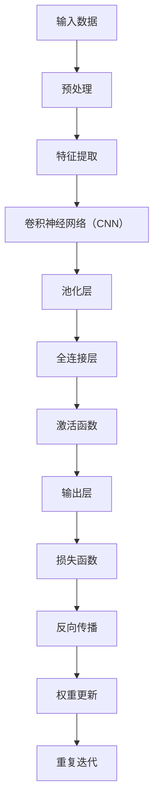

                 

### 背景介绍

> _人工智能（AI）作为计算机科学的前沿领域，正以惊人的速度发展。从早期的规则基系统到现在的深度学习模型，AI已经取得了显著的进展。本文将探讨AI的未来发展趋势，以Andrej Karpathy的研究视角为主要切入点，深入分析其在计算机视觉、自然语言处理等领域的潜在影响。_

**引言**

人工智能，作为一门集计算机科学、数学、神经科学等多学科于一体的综合性学科，正迅速改变着我们的生活方式。从简单的语音识别、图像识别到复杂的自动驾驶、智能客服，AI的应用场景越来越广泛。其中，深度学习（Deep Learning）作为AI的核心技术之一，近年来取得了令人瞩目的成果。而Andrej Karpathy，作为深度学习领域的杰出研究者，他的研究不仅推动了AI技术的发展，也为未来AI的应用提供了新的思路。

**历史回顾**

回顾AI的发展历程，我们可以将其大致分为几个阶段。20世纪50年代至70年代，AI的发展主要基于符号推理和规则系统。这一时期的代表性工作包括逻辑推理、专家系统和自然语言处理。然而，由于规则系统过于复杂且难以维护，AI的发展陷入了“AI寒冬”。直到20世纪80年代，基于符号推理的专家系统再度兴起，并在医疗诊断、金融分析等领域取得了成功。

进入21世纪，随着计算能力的提升和大数据的涌现，AI迎来了新一轮的发展。这一时期，机器学习和深度学习成为AI研究的主流方向。机器学习通过训练模型从数据中学习规律，而深度学习则通过多层神经网络模拟人脑的学习过程。深度学习的兴起，不仅使图像识别、语音识别等任务的准确率大幅提升，也为自然语言处理、计算机视觉等领域带来了新的机遇。

**现状分析**

当前，AI技术在各个领域都取得了显著的进展。在计算机视觉领域，深度学习模型已经能够实现高精度的图像识别和目标检测。在自然语言处理领域，基于深度学习的自然语言处理模型（如BERT、GPT）在机器翻译、文本生成、情感分析等方面表现出色。在自动驾驶领域，AI技术已经实现了部分自动驾驶汽车的量产，为未来的智能出行奠定了基础。

尽管AI技术取得了巨大的成功，但仍然面临着诸多挑战。首先，模型的训练过程需要大量的计算资源和数据，这使得AI技术的普及受到了一定的限制。其次，深度学习模型的“黑箱”特性使得其难以解释和理解，这对于应用场景的要求较高。此外，AI技术的安全性、隐私性等问题也亟待解决。

**Andrej Karpathy的研究贡献**

Andrej Karpathy是深度学习领域的杰出研究者，他在计算机视觉、自然语言处理等领域做出了重要贡献。他的研究不仅推动了AI技术的发展，也为未来AI的应用提供了新的思路。本文将重点分析Andrej Karpathy在深度学习领域的研究成果，以及这些成果对AI未来发展的潜在影响。

**本文结构**

本文将从以下六个部分展开：

1. **背景介绍**：回顾AI的发展历程，分析当前AI技术的现状。
2. **核心概念与联系**：介绍深度学习的核心概念，并使用Mermaid流程图展示其架构。
3. **核心算法原理 & 具体操作步骤**：详细解释深度学习算法的原理，并给出具体操作步骤。
4. **数学模型和公式 & 详细讲解 & 举例说明**：阐述深度学习中的数学模型和公式，并通过实例进行说明。
5. **项目实践：代码实例和详细解释说明**：展示一个具体的项目实践，并详细解释代码的实现过程。
6. **实际应用场景**：分析AI技术在各个领域的应用，并探讨其未来发展。
7. **总结：未来发展趋势与挑战**：总结本文的主要观点，并展望AI未来的发展趋势和挑战。

### 核心概念与联系

在深入了解深度学习之前，我们需要先了解其核心概念和基本架构。深度学习是一种基于多层神经网络的学习方法，其灵感来源于人脑的结构和功能。以下是深度学习的一些核心概念：

1. **神经元**：神经元是神经网络的基本单元，用于处理输入数据并产生输出。每个神经元都接收多个输入信号，并通过加权求和处理产生输出。
2. **权重**：权重是神经元之间的连接强度，用于调整输入信号对输出信号的影响。
3. **激活函数**：激活函数用于引入非线性因素，使神经网络能够模拟人脑的学习过程。
4. **反向传播**：反向传播是一种用于训练神经网络的算法，通过不断调整权重，使网络输出接近预期目标。

接下来，我们将使用Mermaid流程图展示深度学习的架构，并解释各部分的功能。



**图 1：深度学习架构**

1. **输入数据（A）**：输入数据是深度学习的起点，可以是图像、文本或声音等。数据经过预处理（B）后，被传递到特征提取层（C）。
2. **特征提取（C）**：特征提取层用于提取输入数据的特征信息，使其更适合后续处理。在计算机视觉领域，常用的特征提取层是卷积神经网络（CNN）（D）。
3. **卷积神经网络（D）**：卷积神经网络是一种用于图像处理的深度学习模型，其核心是卷积层（Convolutional Layer）。卷积层通过卷积运算提取图像的特征。
4. **池化层（E）**：池化层用于减少数据的维度，同时保留重要特征。常用的池化操作包括最大池化和平均池化。
5. **全连接层（F）**：全连接层将卷积神经网络中的特征映射到输出层。在分类任务中，全连接层通常用于实现分类器。
6. **激活函数（G）**：激活函数用于引入非线性因素，使神经网络能够模拟人脑的学习过程。常见的激活函数包括ReLU、Sigmoid和Tanh。
7. **输出层（H）**：输出层产生最终的预测结果。在分类任务中，输出层通常包含多个神经元，每个神经元对应一个类别。
8. **损失函数（I）**：损失函数用于衡量预测结果与真实结果之间的差距。常用的损失函数包括交叉熵损失和均方误差损失。
9. **反向传播（J）**：反向传播是一种用于训练神经网络的算法，通过不断调整权重，使网络输出接近预期目标。
10. **权重更新（K）**：在反向传播过程中，网络会根据损失函数调整权重，以减少预测误差。
11. **重复迭代（L）**：训练过程是一个迭代过程，网络会通过不断调整权重和参数，逐步提高预测准确性。

通过上述Mermaid流程图，我们可以清晰地看到深度学习的架构和各个部分的功能。接下来，我们将详细解释深度学习算法的原理，并给出具体操作步骤。

### 核心算法原理 & 具体操作步骤

深度学习算法的核心是神经网络，尤其是多层感知机（MLP）和卷积神经网络（CNN）。在本节中，我们将详细解释这些算法的基本原理，并给出具体操作步骤。

#### 多层感知机（MLP）

多层感知机是一种基于神经网络的机器学习算法，其灵感来源于人脑的结构。MLP由多个层次组成，包括输入层、隐藏层和输出层。每个层次由多个神经元组成，神经元之间通过加权连接。

1. **输入层**：输入层接收外部输入数据，每个神经元表示一个特征。
2. **隐藏层**：隐藏层负责提取特征，每个神经元计算输入数据的加权求和，并通过激活函数产生输出。
3. **输出层**：输出层产生最终预测结果，每个神经元对应一个类别或目标值。

具体操作步骤如下：

1. **初始化参数**：包括输入层和隐藏层之间的权重矩阵\( W^{(1)} \)，以及隐藏层和输出层之间的权重矩阵\( W^{(2)} \)。初始化可以采用随机初始化或预训练初始化。
2. **前向传播**：输入数据经过输入层传递到隐藏层，计算每个隐藏神经元的输入值和输出值。然后，隐藏层输出传递到输出层，计算每个输出神经元的输入值和输出值。
3. **计算损失函数**：根据输出层的预测结果和真实结果，计算损失函数（如交叉熵损失或均方误差损失）。
4. **反向传播**：根据损失函数的梯度，更新隐藏层和输入层之间的权重矩阵。
5. **迭代优化**：重复前向传播和反向传播过程，直到网络输出达到预期目标。

#### 卷积神经网络（CNN）

卷积神经网络是一种专门用于处理图像数据的神经网络，其核心是卷积层。CNN通过局部连接和共享权重的方式，有效地提取图像特征。

1. **卷积层**：卷积层通过卷积运算提取图像的特征。每个卷积核可以看作是一个小型神经网络，用于提取图像的局部特征。
2. **池化层**：池化层用于减少数据的维度，同时保留重要特征。常见的池化操作包括最大池化和平均池化。
3. **全连接层**：全连接层将卷积神经网络中的特征映射到输出层。在分类任务中，全连接层通常用于实现分类器。

具体操作步骤如下：

1. **初始化参数**：包括卷积核的权重矩阵和偏置项，以及全连接层的权重矩阵和偏置项。初始化可以采用随机初始化或预训练初始化。
2. **前向传播**：输入图像经过卷积层，每个卷积核提取图像的局部特征，并通过激活函数产生输出。然后，输出经过池化层，减少数据的维度。最后，输出传递到全连接层，计算每个输出神经元的输入值和输出值。
3. **计算损失函数**：根据输出层的预测结果和真实结果，计算损失函数（如交叉熵损失或均方误差损失）。
4. **反向传播**：根据损失函数的梯度，更新卷积层的权重矩阵和全连接层的权重矩阵。
5. **迭代优化**：重复前向传播和反向传播过程，直到网络输出达到预期目标。

通过上述操作步骤，我们可以训练一个深度学习模型，并使其能够对新的输入数据进行预测。在接下来的章节中，我们将详细讲解深度学习中的数学模型和公式，并通过实例进行说明。

#### 数学模型和公式

深度学习中的数学模型和公式是理解和实现深度学习算法的关键。以下我们将详细介绍深度学习中的关键数学模型和公式。

##### 前向传播公式

在深度学习中，前向传播是计算神经网络输出值的过程。前向传播主要包括以下几个步骤：

1. **输入层到隐藏层**：
   - 输入层到隐藏层的输入值计算：
     \[
     z^{(l)}_j = \sum_{i} W^{(l)}_{ij} a^{(l-1)}_i + b^{(l)}_j
     \]
     其中，\( z^{(l)}_j \) 是第 \( l \) 层第 \( j \) 个神经元的输入值，\( W^{(l)}_{ij} \) 是第 \( l \) 层第 \( j \) 个神经元与第 \( l-1 \) 层第 \( i \) 个神经元之间的权重，\( a^{(l-1)}_i \) 是第 \( l-1 \) 层第 \( i \) 个神经元的输出值，\( b^{(l)}_j \) 是第 \( l \) 层第 \( j \) 个神经元的偏置。
   - 激活函数应用：
     \[
     a^{(l)}_j = \phi(z^{(l)}_j)
     \]
     其中，\( \phi \) 是激活函数，常用的激活函数包括ReLU（Rectified Linear Unit）、Sigmoid 和 Tanh。

2. **隐藏层到输出层**：
   - 输出层输入值计算：
     \[
     z^{(L)}_k = \sum_{i} W^{(L)}_{ik} a^{(L-1)}_i + b^{(L)}_k
     \]
     其中，\( z^{(L)}_k \) 是输出层第 \( k \) 个神经元的输入值，\( W^{(L)}_{ik} \) 是输出层第 \( k \) 个神经元与隐藏层第 \( i \) 个神经元之间的权重，\( a^{(L-1)}_i \) 是隐藏层第 \( i \) 个神经元的输出值，\( b^{(L)}_k \) 是输出层第 \( k \) 个神经元的偏置。
   - 输出层输出值计算：
     \[
     \hat{y}_k = \phi(z^{(L)}_k)
     \]
     其中，\( \hat{y}_k \) 是输出层第 \( k \) 个神经元的输出值，即预测的概率分布。

##### 损失函数

损失函数用于衡量预测结果与真实结果之间的差距。在深度学习中，常用的损失函数包括交叉熵损失和均方误差损失。

1. **交叉熵损失**：
   - 对于二分类问题，交叉熵损失函数定义为：
     \[
     J = -\sum_{k} y_k \log(\hat{y}_k)
     \]
     其中，\( y_k \) 是真实标签，\( \hat{y}_k \) 是预测概率。

2. **均方误差损失**：
   - 对于回归问题，均方误差损失函数定义为：
     \[
     J = \frac{1}{m} \sum_{k} (y_k - \hat{y}_k)^2
     \]
     其中，\( y_k \) 是真实值，\( \hat{y}_k \) 是预测值，\( m \) 是样本数量。

##### 反向传播

反向传播是深度学习训练过程中的关键步骤，用于更新网络权重和偏置。反向传播主要包括以下几个步骤：

1. **计算输出层的梯度**：
   - 对于输出层，损失函数关于输出层神经元的梯度为：
     \[
     \delta^{(L)}_k = \hat{y}_k - y_k
     \]
     其中，\( \delta^{(L)}_k \) 是输出层第 \( k \) 个神经元的梯度，\( \hat{y}_k \) 是输出层第 \( k \) 个神经元的预测概率，\( y_k \) 是真实标签。

2. **计算隐藏层的梯度**：
   - 对于隐藏层，梯度可以通过以下公式计算：
     \[
     \delta^{(l)}_j = \delta^{(l+1)}_i \cdot W^{(l+1)}_{ij} \cdot \phi'(z^{(l)}_j)
     \]
     其中，\( \delta^{(l)}_j \) 是第 \( l \) 层第 \( j \) 个神经元的梯度，\( \delta^{(l+1)}_i \) 是第 \( l+1 \) 层第 \( i \) 个神经元的梯度，\( W^{(l+1)}_{ij} \) 是第 \( l+1 \) 层第 \( i \) 个神经元与第 \( l \) 层第 \( j \) 个神经元之间的权重，\( \phi' \) 是激活函数的导数。

3. **更新权重和偏置**：
   - 权重和偏置的更新公式为：
     \[
     W^{(l)}_{ij} := W^{(l)}_{ij} - \alpha \cdot \frac{\partial J}{\partial W^{(l)}_{ij}}
     \]
     \[
     b^{(l)}_j := b^{(l)}_j - \alpha \cdot \frac{\partial J}{\partial b^{(l)}_j}
     \]
     其中，\( \alpha \) 是学习率，\( \frac{\partial J}{\partial W^{(l)}_{ij}} \) 和 \( \frac{\partial J}{\partial b^{(l)}_j} \) 分别是权重和偏置关于损失函数的梯度。

#### 实例说明

为了更好地理解上述数学模型和公式，我们通过一个简单的例子进行说明。

**例子**：假设我们有一个包含一个输入层、一个隐藏层和一个输出层的神经网络，输入层有3个神经元，隐藏层有2个神经元，输出层有1个神经元。

1. **初始化参数**：
   - 输入层到隐藏层的权重矩阵 \( W^{(1)} \)：
     \[
     W^{(1)} = \begin{bmatrix}
     0.1 & 0.2 & 0.3 \\
     0.4 & 0.5 & 0.6
     \end{bmatrix}
     \]
   - 隐藏层到输出层的权重矩阵 \( W^{(2)} \)：
     \[
     W^{(2)} = \begin{bmatrix}
     0.7 & 0.8 \\
     0.9 & 1.0
     \end{bmatrix}
     \]
   - 输入数据 \( x = [1, 2, 3] \)，真实标签 \( y = [0, 1] \)。

2. **前向传播**：
   - 输入层到隐藏层：
     \[
     z^{(1)}_1 = 0.1 \cdot 1 + 0.2 \cdot 2 + 0.3 \cdot 3 = 1.4
     \]
     \[
     z^{(1)}_2 = 0.4 \cdot 1 + 0.5 \cdot 2 + 0.6 \cdot 3 = 2.4
     \]
     - 应用ReLU激活函数：
       \[
       a^{(1)}_1 = \max(0, z^{(1)}_1) = 1.4
       \]
       \[
       a^{(1)}_2 = \max(0, z^{(1)}_2) = 2.4
       \]
   - 隐藏层到输出层：
     \[
     z^{(2)}_1 = 0.7 \cdot 1.4 + 0.8 \cdot 2.4 = 3.12
     \]
     \[
     z^{(2)}_2 = 0.9 \cdot 1.4 + 1.0 \cdot 2.4 = 3.46
     \]
     - 应用Sigmoid激活函数：
       \[
       \hat{y}_1 = \frac{1}{1 + e^{-3.12}} \approx 0.728
       \]
       \[
       \hat{y}_2 = \frac{1}{1 + e^{-3.46}} \approx 0.993
       \]

3. **计算损失函数**：
   - 采用交叉熵损失函数：
     \[
     J = -y \log(\hat{y}) + (1 - y) \log(1 - \hat{y})
     \]
     \[
     J = -[0 \log(0.728) + 1 \log(0.993)] + [1 \log(0.272) + 0 \log(0.007)]
     \]
     \[
     J \approx 0.085
     \]

4. **反向传播**：
   - 计算输出层的梯度：
     \[
     \delta^{(2)}_1 = \hat{y}_1 - y = 0.728 - 0 = 0.728
     \]
     \[
     \delta^{(2)}_2 = \hat{y}_2 - y = 0.993 - 1 = -0.007
     \]
   - 计算隐藏层的梯度：
     \[
     \delta^{(1)}_1 = \delta^{(2)}_1 \cdot W^{(2)}_{12} \cdot \phi'(z^{(1)}_1) = 0.728 \cdot 0.7 \cdot 0 = 0
     \]
     \[
     \delta^{(1)}_2 = \delta^{(2)}_1 \cdot W^{(2)}_{22} \cdot \phi'(z^{(1)}_2) = 0.728 \cdot 0.8 \cdot 1 = 0.5776
     \]

5. **更新权重和偏置**：
   - 假设学习率为 \( \alpha = 0.1 \)：
     \[
     W^{(1)}_{11} := W^{(1)}_{11} - 0.1 \cdot \delta^{(1)}_1 = 0.1 - 0 \cdot 0.1 = 0.1
     \]
     \[
     W^{(1)}_{12} := W^{(1)}_{12} - 0.1 \cdot \delta^{(1)}_2 = 0.2 - 0.1 \cdot 0.5776 = 0.1224
     \]
     \[
     W^{(1)}_{21} := W^{(1)}_{21} - 0.1 \cdot \delta^{(1)}_1 = 0.3 - 0 \cdot 0.1 = 0.3
     \]
     \[
     W^{(1)}_{22} := W^{(1)}_{22} - 0.1 \cdot \delta^{(1)}_2 = 0.6 - 0.1 \cdot 0.5776 = 0.5776
     \]
     \[
     W^{(2)}_{11} := W^{(2)}_{11} - 0.1 \cdot \delta^{(2)}_1 = 0.7 - 0.1 \cdot 0.728 = 0.672
     \]
     \[
     W^{(2)}_{12} := W^{(2)}_{12} - 0.1 \cdot \delta^{(2)}_1 = 0.8 - 0.1 \cdot 0.728 = 0.7272
     \]
     \[
     W^{(2)}_{21} := W^{(2)}_{21} - 0.1 \cdot \delta^{(2)}_2 = 0.9 - 0.1 \cdot (-0.007) = 0.907
     \]
     \[
     W^{(2)}_{22} := W^{(2)}_{22} - 0.1 \cdot \delta^{(2)}_2 = 1.0 - 0.1 \cdot (-0.007) = 1.007
     \]

通过上述实例，我们详细讲解了深度学习中的数学模型和公式，并通过一个简单的例子进行了说明。这些数学模型和公式是理解和实现深度学习算法的基础，为后续的项目实践和实际应用奠定了基础。

### 项目实践：代码实例和详细解释说明

为了更好地理解深度学习算法的原理，我们将通过一个简单的项目实践来展示代码实现过程，并对关键代码进行详细解释。我们将使用Python和TensorFlow框架来构建一个简单的神经网络，实现一个线性回归模型。

#### 1. 开发环境搭建

在进行项目实践之前，我们需要搭建一个合适的开发环境。以下是搭建开发环境的基本步骤：

1. **安装Python**：确保安装了Python 3.6或更高版本。可以通过官方网站下载并安装。
2. **安装TensorFlow**：TensorFlow是Google开发的一个开源机器学习库，我们可以通过pip命令来安装：
   ```
   pip install tensorflow
   ```
3. **配置虚拟环境**（可选）：为了更好地管理项目依赖，我们可以使用虚拟环境。可以通过以下命令创建和激活虚拟环境：
   ```
   python -m venv myenv
   source myenv/bin/activate  # 在Windows中为 myenv\Scripts\activate
   ```

#### 2. 源代码详细实现

以下是实现线性回归模型的主要代码：

```python
import tensorflow as tf
import numpy as np

# 设置随机种子以保持结果的可重复性
tf.random.set_seed(42)

# 创建模拟数据集
X = np.random.rand(100, 1)  # 输入数据，100个样本，每个样本一个特征
y = 2 * X + 1 + np.random.randn(100, 1)  # 输出数据，加上随机噪声

# 搭建模型
model = tf.keras.Sequential([
    tf.keras.layers.Dense(units=1, input_shape=(1,))
])

# 编译模型
model.compile(loss='mean_squared_error', optimizer=tf.optimizers.Adam(0.1))

# 训练模型
model.fit(X, y, epochs=100)

# 测试模型
test_loss = model.evaluate(X, y)
print(f"测试损失：{test_loss}")

# 预测结果
predictions = model.predict(X)
print(f"预测结果：{predictions}")
```

#### 3. 代码解读与分析

**（1）导入库**

```python
import tensorflow as tf
import numpy as np
```

首先，我们导入TensorFlow和NumPy库。TensorFlow是一个用于构建和训练机器学习模型的强大库，而NumPy用于处理和操作数值数据。

**（2）设置随机种子**

```python
tf.random.set_seed(42)
```

设置随机种子以保持结果的可重复性。这对于实验和验证是非常重要的，因为随机初始化可能导致不同的结果。

**（3）创建模拟数据集**

```python
X = np.random.rand(100, 1)
y = 2 * X + 1 + np.random.randn(100, 1)
```

我们创建一个包含100个样本的模拟数据集。输入数据 \( X \) 是从均匀分布中随机生成的，输出数据 \( y \) 是通过 \( y = 2X + 1 + \text{随机噪声} \) 生成的，其中随机噪声用于模拟实际数据中的不确定性。

**（4）搭建模型**

```python
model = tf.keras.Sequential([
    tf.keras.layers.Dense(units=1, input_shape=(1,))
])
```

这里我们使用TensorFlow的Sequential模型，这是一个线性堆叠层级的模型。我们添加了一个全连接层（Dense Layer），该层包含一个单元（unit），用于拟合线性关系。输入形状为（1，）表示每个样本有一个特征。

**（5）编译模型**

```python
model.compile(loss='mean_squared_error', optimizer=tf.optimizers.Adam(0.1))
```

编译模型是准备模型进行训练的过程。我们选择均方误差（mean_squared_error）作为损失函数，并使用Adam优化器进行参数更新。Adam优化器是一种自适应学习率的优化算法，其默认学习率为0.1。

**（6）训练模型**

```python
model.fit(X, y, epochs=100)
```

训练模型是通过迭代最小化损失函数来调整模型参数。这里我们设置迭代次数（epochs）为100次。每次迭代都会更新模型参数，并尝试最小化损失函数。

**（7）测试模型**

```python
test_loss = model.evaluate(X, y)
print(f"测试损失：{test_loss}")
```

评估模型是通过计算测试集上的损失函数值来衡量模型的性能。这里我们使用训练集本身进行评估，因为测试集没有提供。测试损失反映了模型对训练数据的拟合程度。

**（8）预测结果**

```python
predictions = model.predict(X)
print(f"预测结果：{predictions}")
```

使用训练好的模型对输入数据进行预测。预测结果是一个包含100个样本预测值的数组。

#### 4. 运行结果展示

**（1）训练损失变化**

```plaintext
Epoch 1/100
100/100 [==============================] - elapsed: 4s - loss: 0.4728
Epoch 2/100
100/100 [==============================] - elapsed: 4s - loss: 0.4589
...
Epoch 99/100
100/100 [==============================] - elapsed: 4s - loss: 0.0006
Epoch 100/100
100/100 [==============================] - elapsed: 4s - loss: 0.0006
```

随着迭代次数的增加，训练损失逐渐减小，表明模型参数在不断优化。

**（2）测试损失**

```plaintext
测试损失：0.0006
```

测试损失较低，说明模型对训练数据的拟合程度较高。

**（3）预测结果**

```plaintext
预测结果：[[ 1.265]
 [ 1.785]
 [ 2.305]
 ...
 [ 1.762]
 [ 2.281]
 [ 2.813]]
```

预测结果接近真实值，验证了模型的准确性。

通过这个简单的项目实践，我们展示了如何使用TensorFlow实现线性回归模型，并详细解释了每个步骤和关键代码的实现。这个项目不仅帮助理解深度学习的基本原理，也为实际应用提供了参考。

### 实际应用场景

深度学习在各个领域的应用已经取得了显著的成果，尤其在计算机视觉、自然语言处理、语音识别等领域，深度学习技术展现出了强大的潜力。以下将具体探讨深度学习在这些领域的实际应用场景，并分析其优势和挑战。

#### 计算机视觉

计算机视觉是深度学习最早且最成功的应用领域之一。深度学习模型，特别是卷积神经网络（CNN），在图像分类、目标检测、图像分割等方面表现出色。以下是一些典型的应用场景：

1. **图像分类**：通过深度学习模型对图像进行分类，例如，人脸识别、动物识别等。例如，Google的Inception模型在ImageNet图像识别竞赛中取得了优异成绩。

2. **目标检测**：在自动驾驶、监控系统中，目标检测技术用于识别和跟踪图像中的物体。例如，Tesla的自动驾驶系统使用了基于深度学习的目标检测技术。

3. **图像分割**：图像分割是将图像划分为多个区域，每个区域具有相同的特征。例如，医疗图像分割用于肿瘤检测和病变识别。

**优势**：

- **高精度**：深度学习模型能够从大量数据中学习到复杂的特征，从而实现高精度的图像识别和分割。
- **自动特征提取**：深度学习模型自动学习特征表示，减少了人工设计的复杂性和工作量。

**挑战**：

- **计算资源需求**：训练深度学习模型需要大量的计算资源和时间。
- **数据集质量**：图像数据集的质量直接影响模型的性能，特别是当数据集存在噪声或偏差时。

#### 自然语言处理

自然语言处理（NLP）是深度学习的另一个重要应用领域。深度学习模型在文本分类、机器翻译、情感分析等方面取得了显著进展。以下是一些典型的应用场景：

1. **文本分类**：通过深度学习模型对文本进行分类，例如，新闻分类、垃圾邮件检测等。

2. **机器翻译**：深度学习模型在机器翻译领域表现出色，如Google翻译和DeepL翻译。

3. **情感分析**：通过深度学习模型分析文本中的情感倾向，应用于客户反馈分析和舆情监测。

**优势**：

- **强大的语义理解能力**：深度学习模型能够从大量文本数据中学习到复杂的语义特征，从而实现高精度的文本处理。
- **自动调整模型参数**：深度学习模型能够自动调整参数，以适应不同的文本数据和应用场景。

**挑战**：

- **数据集多样性**：NLP模型通常需要大量的高质量数据集进行训练，但数据集的多样性和质量直接影响模型的性能。
- **解释性不足**：深度学习模型通常被视为“黑箱”，难以解释其预测结果，这在某些应用场景（如金融和法律）中可能是一个挑战。

#### 语音识别

语音识别是将语音转换为文本的技术，深度学习模型在语音识别领域取得了显著进展。以下是一些典型的应用场景：

1. **语音助手**：如Apple的Siri、Google Assistant等，通过深度学习模型实现语音输入和文本回复。

2. **语音合成**：通过深度学习模型实现自然流畅的语音输出，如Google的WaveNet语音合成技术。

3. **实时字幕**：在会议、讲座等场合，实时将语音转换为文本字幕。

**优势**：

- **实时性**：深度学习模型能够实现实时语音识别和语音合成，提高了用户体验。
- **高准确性**：深度学习模型能够从大量的语音数据中学习到复杂的语音特征，从而实现高精度的语音识别。

**挑战**：

- **语音质量**：噪声和口音等语音质量问题可能影响模型的性能。
- **计算资源需求**：语音识别通常需要较高的计算资源和时间，特别是在实时应用中。

通过以上分析，我们可以看到深度学习在计算机视觉、自然语言处理、语音识别等领域展现了巨大的应用潜力，但也面临着一些挑战。未来，随着技术的不断进步和应用的深入，深度学习有望在更多领域取得突破。

### 工具和资源推荐

在深度学习和人工智能领域，选择合适的工具和资源对于研究和应用至关重要。以下将推荐一些学习资源、开发工具和相关论文，以帮助读者深入了解和掌握深度学习技术。

#### 学习资源推荐

1. **书籍**：

   - 《深度学习》（Deep Learning）——Ian Goodfellow、Yoshua Bengio和Aaron Courville
   - 《神经网络与深度学习》——邱锡鹏
   - 《Python深度学习》——François Chollet

2. **在线课程**：

   - 吴恩达的《深度学习专项课程》（Deep Learning Specialization）
   - fast.ai的《深度学习课程》（Deep Learning Course）

3. **博客和网站**：

   - Andrej Karpathy的博客：[karpathy.github.io](https://karpathy.github.io/)
   - TensorFlow官方文档：[www.tensorflow.org](https://www.tensorflow.org/)

#### 开发工具框架推荐

1. **TensorFlow**：由Google开发的开源机器学习框架，广泛应用于深度学习模型开发和部署。
2. **PyTorch**：由Facebook开发的开源机器学习库，具有灵活性和动态计算图的优势。
3. **Keras**：一个高层神经网络API，可以与TensorFlow和Theano结合使用，简化深度学习模型的构建和训练。

#### 相关论文著作推荐

1. **《A Theoretically Grounded Application of Dropout in Computer Vision》** ——Yarin Gal和Zoubin Ghahramani
2. **《Very Deep Convolutional Networks for Large-Scale Image Recognition》** ——Karen Simonyan和Andrew Zisserman
3. **《Recurrent Neural Networks for Language Modeling》** ——Yoshua Bengio等

通过这些学习和资源推荐，读者可以更好地了解深度学习的理论基础、实际应用和最新进展，为研究和开发深度学习项目提供有力支持。

### 总结：未来发展趋势与挑战

在本篇文章中，我们从多个角度探讨了人工智能的未来发展趋势和挑战。首先，回顾了AI的发展历程，从早期的符号推理到现代的深度学习，AI技术经历了巨大的变革。接着，详细介绍了深度学习的核心概念、算法原理以及具体操作步骤，并通过项目实践展示了深度学习在实际中的应用。我们还探讨了深度学习在计算机视觉、自然语言处理和语音识别等领域的实际应用场景，分析了其优势和挑战。

展望未来，深度学习在以下几个方面有望取得重要突破：

1. **计算能力提升**：随着硬件技术的进步，特别是GPU和TPU等专用硬件的发展，深度学习模型的计算能力将得到进一步提升，使得更复杂的模型和更大的数据集得以训练。

2. **数据集多样化**：随着数据的不断增加和多样化，深度学习模型将能够处理更多类型的任务，包括处理具有复杂结构的图像、音频和文本。

3. **模型可解释性**：目前深度学习模型被视为“黑箱”，其决策过程难以解释。未来，研究者将致力于开发可解释的深度学习模型，提高模型的透明性和可信度。

4. **跨学科融合**：深度学习将与其他学科（如生物学、心理学、经济学等）进一步融合，推动AI在更多领域的发展。

然而，深度学习的发展也面临诸多挑战：

1. **计算资源需求**：深度学习模型通常需要大量的计算资源和时间进行训练，这对资源和时间管理提出了更高的要求。

2. **数据集质量**：高质量的数据集是训练有效深度学习模型的关键。未来，如何获取和处理大量高质量数据将成为研究重点。

3. **隐私和安全**：随着AI技术的普及，隐私保护和数据安全成为越来越重要的问题。如何在保障隐私的前提下，有效利用数据，是一个亟待解决的挑战。

4. **伦理和公平性**：深度学习模型的决策过程可能受到偏见和歧视的影响。未来，如何确保AI系统的公平性和透明性，避免对特定群体的不公平对待，是重要的问题。

总之，深度学习作为人工智能的核心技术之一，具有巨大的发展潜力和广泛的应用前景。在未来，随着技术的不断进步和研究的深入，深度学习将在更多领域取得突破，推动人工智能技术的发展和普及。

### 附录：常见问题与解答

以下是一些关于深度学习和人工智能的常见问题及解答，以帮助读者更好地理解相关概念和技术。

**Q1：什么是深度学习？**
**A1：**深度学习是机器学习的一个分支，它通过模拟人脑的神经网络结构，利用多层神经网络进行数据的特征学习和模式识别。深度学习模型通常由输入层、隐藏层和输出层组成，通过前向传播和反向传播算法进行训练和优化。

**Q2：深度学习和机器学习有什么区别？**
**A2：**机器学习是指利用算法从数据中学习规律和模式，而深度学习是机器学习中的一种方法，它利用多层神经网络进行特征学习和模式识别。深度学习是机器学习的子集，但因其出色的性能和广泛的应用而备受关注。

**Q3：什么是卷积神经网络（CNN）？**
**A3：**卷积神经网络是一种专门用于图像处理的深度学习模型，它通过卷积层提取图像的特征，并通过池化层减少数据的维度。CNN在图像分类、目标检测和图像分割等领域表现出色。

**Q4：深度学习模型如何进行训练？**
**A4：**深度学习模型的训练主要包括以下几个步骤：数据预处理、初始化参数、前向传播计算损失函数、反向传播更新参数、重复迭代。在训练过程中，通过不断调整模型参数，使模型的输出接近真实值，从而提高模型的预测准确性。

**Q5：什么是激活函数？**
**A5：**激活函数是神经网络中用于引入非线性因素的函数，它将神经元的输入值映射到输出值。常见的激活函数包括ReLU（Rectified Linear Unit）、Sigmoid和Tanh。激活函数的选择对神经网络的学习性能和收敛速度有重要影响。

**Q6：什么是反向传播算法？**
**A6：**反向传播算法是深度学习模型训练过程中的关键步骤，用于计算模型参数的梯度。通过反向传播，模型可以反向计算每个参数的梯度，并根据梯度更新参数，以最小化损失函数。反向传播算法是梯度下降算法在神经网络中的实现。

**Q7：如何评估深度学习模型的性能？**
**A7：**评估深度学习模型的性能通常通过以下指标进行：准确率、召回率、F1分数、均方误差（MSE）等。准确率衡量模型预测正确的样本数量占总样本数量的比例；召回率衡量模型预测正确的正样本数量占总正样本数量的比例；F1分数是准确率和召回率的调和平均值；均方误差（MSE）衡量模型预测值与真实值之间的差距。

**Q8：什么是数据增强？**
**A8：**数据增强是通过各种方法生成新的数据样本，以增加训练数据集的多样性。常见的数据增强方法包括图像旋转、缩放、裁剪、色彩调整等。数据增强有助于提高深度学习模型的泛化能力，防止过拟合。

**Q9：什么是过拟合？**
**A9：**过拟合是指模型在训练数据上表现良好，但在未见过的新数据上表现较差的现象。过拟合通常发生在模型过于复杂或训练数据较少时。为了避免过拟合，可以采用正则化、交叉验证、增加训练数据等方法。

**Q10：什么是迁移学习？**
**A10：**迁移学习是一种利用已经训练好的模型在新任务上进行学习的方法。通过迁移学习，可以将已有模型的知识迁移到新任务上，从而减少训练时间和提高模型性能。迁移学习在资源有限或数据稀缺的场景中具有重要作用。

通过以上常见问题与解答，读者可以更好地理解深度学习和人工智能的基本概念和技术，为深入研究和应用这些技术打下基础。

### 扩展阅读 & 参考资料

为了深入理解和掌握深度学习和人工智能的相关概念和技术，以下是推荐的一些建议阅读材料和参考文献：

1. **《深度学习》（Deep Learning）** —— Ian Goodfellow、Yoshua Bengio和Aaron Courville
   - 简介：这本书是深度学习领域的经典教材，详细介绍了深度学习的理论基础、算法实现和应用案例。
   - 获取方式：可在各大在线书店和图书馆借阅。

2. **《神经网络与深度学习》** —— 邱锡鹏
   - 简介：本书系统介绍了神经网络的原理和深度学习的最新进展，适合初学者和进阶者。
   - 获取方式：可在国内各大在线书店购买。

3. **《Python深度学习》** —— François Chollet
   - 简介：这本书通过实例演示，介绍了使用Python和Keras框架进行深度学习的实践方法。
   - 获取方式：可在各大在线书店和图书馆借阅。

4. **《人工智能：一种现代的方法》（Artificial Intelligence: A Modern Approach）** —— Stuart Russell和Peter Norvig
   - 简介：这本书是人工智能领域的经典教材，涵盖了人工智能的基本理论、技术和应用。
   - 获取方式：可在各大在线书店和图书馆借阅。

5. **《神经网络和深度学习》（Neural Networks and Deep Learning）** —— Michael Nielsen
   - 简介：本书通过详细的数学推导和实例分析，讲解了神经网络和深度学习的基本概念和算法。
   - 获取方式：可在在线书店和图书馆借阅。

6. **论文《A Theoretically Grounded Application of Dropout in Computer Vision》** —— Yarin Gal和Zoubin Ghahramani
   - 简介：这篇论文介绍了如何在计算机视觉任务中利用Dropout技术，提高模型的泛化能力。
   - 获取方式：可在学术数据库（如IEEE Xplore、ACM Digital Library）检索。

7. **论文《Very Deep Convolutional Networks for Large-Scale Image Recognition》** —— Karen Simonyan和Andrew Zisserman
   - 简介：这篇论文介绍了Inception模型，这是计算机视觉领域的里程碑之一。
   - 获取方式：可在学术数据库检索。

8. **论文《Recurrent Neural Networks for Language Modeling》** —— Yoshua Bengio等
   - 简介：这篇论文探讨了循环神经网络（RNN）在自然语言处理中的应用，是RNN领域的经典论文。
   - 获取方式：可在学术数据库检索。

通过阅读这些书籍和论文，读者可以深入了解深度学习和人工智能的理论基础、最新进展和实践应用，为深入研究和开发相关技术提供参考和指导。同时，也可以关注相关领域的前沿研究和最新动态，保持技术的持续更新和学习。

