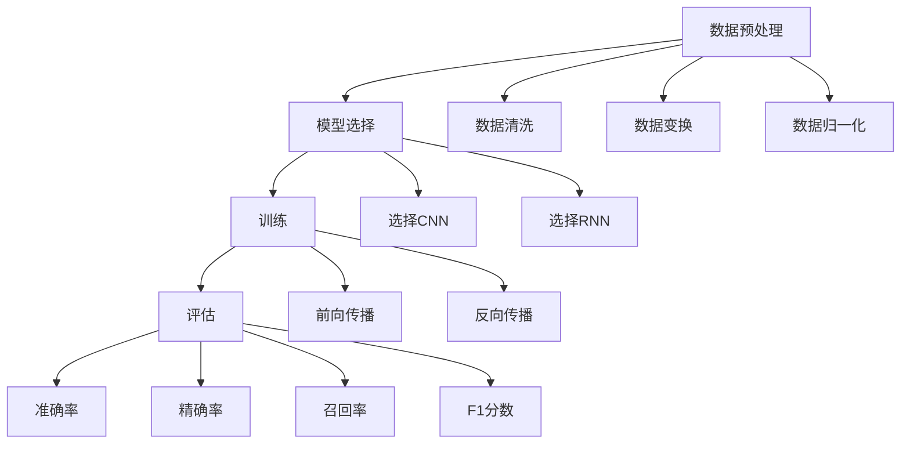

                 

### 背景介绍 Background Introduction

在过去的几十年里，人工智能（Artificial Intelligence，简称AI）经历了从简单规则系统到复杂神经网络模型的发展过程。这一变革背后的主要驱动力包括计算能力的提升、海量数据的积累以及深度学习算法的创新。

首先，计算能力的提升为AI的发展提供了坚实的基础。随着处理器性能的增强和并行计算技术的发展，我们能够运行更加复杂和庞大的模型。这为深度学习算法，特别是神经网络模型的发展，提供了强有力的支持。

其次，海量数据的积累为AI的训练提供了丰富的素材。无论是互联网上的用户数据，还是各种传感器收集的环境数据，都为AI模型的训练提供了大量的样本。有了这些数据，AI模型能够更好地学习和模拟人类的认知过程。

最后，深度学习算法的创新是AI发展的核心。从早期的卷积神经网络（Convolutional Neural Networks，CNN）到递归神经网络（Recurrent Neural Networks，RNN），再到如今的热门模型如Transformer，深度学习在图像识别、自然语言处理、语音识别等领域取得了显著的进展。

本文将围绕人工智能的未来方向展开讨论。我们将首先回顾人工智能的历史发展，接着探讨当前AI领域的核心问题和挑战，最后提出可能的未来发展方向和需要克服的难题。希望通过这篇文章，能够为读者提供一个全面、深入的了解人工智能的未来前景。

## 1.1 人工智能的历史发展

人工智能的概念最早可以追溯到20世纪40年代和50年代。当时，计算机科学家和哲学家开始思考，是否能够通过计算机程序实现类似于人类智能的机器。这个时期，AI主要关注基于规则的系统，试图通过定义一系列明确的规则来模拟人类的决策过程。

1956年，被认为是一个重要的转折点。在达特茅斯会议上，约翰·麦卡锡（John McCarthy）等人首次提出了“人工智能”这一术语，并将其定义为“制造智能机器的科学与工程”。这次会议标志着人工智能作为一个独立领域的诞生。

早期的AI研究主要集中在逻辑推理和问题解决上。例如，专家系统（Expert Systems）是一种典型的基于规则的AI系统，它通过模拟人类专家的知识和推理过程来解决复杂问题。然而，由于缺乏对人类认知的深刻理解，这些系统往往只能处理特定领域的问题，而难以泛化到其他场景。

20世纪80年代，机器学习开始崭露头角。特别是基于模式识别和统计学习的方法，如决策树、支持向量机等，开始在实际应用中得到广泛应用。这些方法通过学习大量的数据，自动提取特征和规律，从而实现智能决策。

然而，AI在20世纪90年代遭遇了一次“寒冬”。由于技术限制和实际应用的挑战，许多AI项目无法实现预期目标，导致了一段时间内对AI的研究兴趣大幅下降。然而，在21世纪初，随着互联网的普及和计算能力的提升，AI研究重新焕发了生机。

进入21世纪，深度学习成为AI领域的突破性进展。特别是卷积神经网络（CNN）和递归神经网络（RNN）的发展，使得图像识别、自然语言处理等任务取得了显著的进展。2012年，AlexNet在ImageNet大赛中取得的优异成绩，标志着深度学习时代的到来。

随着深度学习的快速发展，AI在各个领域的应用也日益广泛。例如，在医疗领域，AI可以通过分析影像数据来辅助诊断；在金融领域，AI可以用于风险管理、欺诈检测等；在工业领域，AI可以用于预测维护、生产优化等。AI已经成为现代技术不可或缺的一部分。

## 1.2 当前人工智能领域的核心问题和挑战

尽管人工智能在各个领域取得了显著进展，但仍然面临许多核心问题和挑战。以下是其中一些主要的问题：

**数据隐私与安全**

随着AI系统的普及，大量的个人数据被收集和处理。如何确保这些数据的安全和隐私成为一个重要的挑战。一方面，AI系统需要大量数据来训练模型，但过度的数据收集可能会侵犯用户的隐私权。另一方面，数据泄露和安全漏洞也可能导致严重后果。

**模型解释性**

深度学习模型由于其高度复杂性，往往难以解释。这使得用户难以理解模型的决策过程，从而增加了对模型的信任度。在医疗、金融等关键领域，模型的解释性尤为重要。如何提高模型的解释性，使得用户能够理解模型的决策依据，是一个亟待解决的问题。

**可解释性与公平性**

AI系统在决策时可能存在偏见和歧视。例如，基于历史数据训练的模型可能会放大已有的社会不公。如何确保AI系统的可解释性和公平性，避免歧视和偏见，是一个重要的研究方向。

**计算资源消耗**

深度学习模型通常需要大量的计算资源，特别是训练阶段。这可能导致能耗和成本的大幅增加。如何优化模型的计算效率，降低资源消耗，是一个关键挑战。

**泛化能力**

深度学习模型往往在训练数据集上表现优异，但在新的、未见过的数据上表现较差。如何提高模型的泛化能力，使其能够适应不同的任务和数据集，是一个重要的研究方向。

**伦理与法律**

随着AI技术的不断发展，如何制定合适的伦理和法律框架来规范AI的应用，成为一个重要问题。这涉及到对AI技术的监管、责任归属以及道德规范等方面。

## 1.3 未来发展方向和潜在突破

尽管面临诸多挑战，人工智能的未来仍然充满希望。以下是可能的未来发展方向和潜在突破：

**更高效的学习算法**

随着计算资源的增加，如何设计更高效的学习算法，使得模型能够在更短的时间内训练，是一个重要的研究方向。这包括改进现有的深度学习算法，以及开发新的学习算法，如元学习（Meta-Learning）和增量学习（Incremental Learning）等。

**多模态学习**

多模态学习是指同时处理多种类型的数据，如图像、文本和音频等。这有助于提高模型的泛化能力和任务理解能力。例如，在医疗领域，结合影像数据和电子病历，可以提供更准确的诊断和治疗方案。

**强化学习**

强化学习（Reinforcement Learning）是一种通过与环境互动来学习决策策略的方法。在未来的发展中，强化学习有望在机器人控制、自动驾驶、游戏AI等领域取得突破。

**自主系统**

自主系统是指具有自主决策能力的AI系统，能够自主完成复杂的任务。例如，自主机器人可以在没有人类干预的情况下执行任务。自主系统的开发将对工业生产、医疗护理等领域产生深远影响。

**跨学科融合**

人工智能的发展离不开与其他领域的融合，如心理学、神经科学、社会学等。跨学科的研究有助于更深入地理解人类智能的本质，从而推动AI技术的创新。

**可持续性与绿色AI**

随着AI应用的普及，计算资源消耗和能耗问题日益突出。开发绿色AI技术，降低能耗和碳排放，是实现可持续发展的关键。

通过不断克服挑战和探索新的发展方向，人工智能将在未来继续改变我们的世界。本文接下来将深入探讨人工智能的核心算法原理、具体操作步骤以及实际应用场景，为读者提供一个全面的了解。

## 2. 核心概念与联系 Core Concepts and Connections

人工智能（AI）的核心概念与联系包括数据预处理、模型选择、训练和评估等多个方面。以下是对这些核心概念及其相互关系的详细探讨。

### 2.1 数据预处理 Data Preprocessing

数据预处理是AI项目中至关重要的一步。它包括数据清洗、数据变换和数据归一化等过程。数据清洗旨在去除噪声和错误的数据，从而提高数据质量。数据变换是指将原始数据转换为适合模型训练的形式，如将图像数据转换为像素值矩阵，或将文本数据转换为词向量。数据归一化则是通过缩放数据范围，使得不同特征之间具有相似的尺度，从而避免某些特征对模型训练的影响过大。

### 2.2 模型选择 Model Selection

选择合适的模型是AI项目成功的关键。不同的任务和场景可能需要不同的模型。例如，对于图像分类任务，卷积神经网络（CNN）是一种常见的选择；而对于序列数据处理任务，递归神经网络（RNN）或其变种如长短期记忆网络（LSTM）可能更为适合。模型选择不仅取决于任务的类型，还需考虑数据的特点、模型的复杂度和计算资源的限制。

### 2.3 训练 Training

模型训练是指通过大量数据来调整模型参数，使其能够做出准确预测。训练过程中，模型会不断优化其参数，以最小化预测误差。训练方法通常包括前向传播（Forward Propagation）和反向传播（Backpropagation）。前向传播用于计算模型输出，而反向传播则用于更新模型参数，以减少预测误差。训练过程中，还需关注过拟合（Overfitting）问题，即模型对训练数据过度拟合，导致在测试数据上的表现不佳。为了解决过拟合问题，可以采用正则化（Regularization）、dropout（dropout）等技术。

### 2.4 评估 Evaluation

模型评估是验证模型性能的重要步骤。常用的评估指标包括准确率（Accuracy）、精确率（Precision）、召回率（Recall）和F1分数（F1 Score）等。评估过程通常分为训练集评估和测试集评估。训练集评估用于调整模型参数，而测试集评估则用于最终评估模型的性能。此外，交叉验证（Cross-Validation）是一种常用的评估方法，通过将数据集划分为多个子集，重复进行训练和测试，以提高评估的可靠性。

### 2.5 核心概念和联系的 Mermaid 流程图

以下是一个用Mermaid绘制的流程图，展示了数据预处理、模型选择、训练和评估等核心概念及其相互关系：



通过这个流程图，我们可以清晰地看到数据预处理、模型选择、训练和评估之间的相互关系。数据预处理为模型训练提供了高质量的数据，模型选择决定了模型的类型和结构，训练过程通过不断调整参数来优化模型，而评估过程则用于验证模型的性能。

在接下来的章节中，我们将详细探讨这些核心概念和联系在实际应用中的具体操作步骤和实现方法。

### 2.6 核心算法原理和具体操作步骤

#### 2.6.1 卷积神经网络（CNN）原理

卷积神经网络（CNN）是一种专门用于处理图像数据的深度学习模型，因其能够自动提取图像特征而广泛应用于计算机视觉领域。CNN的基本原理基于卷积操作，其核心是卷积层（Convolutional Layer）和池化层（Pooling Layer）。

**卷积层（Convolutional Layer）**

卷积层通过卷积操作来提取图像特征。卷积操作涉及两个主要步骤：卷积和激活函数。卷积操作是通过将卷积核（Convolutional Kernel）与图像中的每个局部区域进行点积，从而生成一个特征图（Feature Map）。卷积核是一个小的矩阵，其值通过训练过程自动调整，以最大化特征提取的效果。

激活函数（Activation Function）用于引入非线性，使得模型能够捕捉图像中的复杂关系。常见的激活函数包括 sigmoid、ReLU（Rectified Linear Unit）和 tanh（双曲正切函数）。

**池化层（Pooling Layer）**

池化层用于减小特征图的尺寸，从而减少模型的参数数量，提高计算效率。常见的池化操作包括最大池化（Max Pooling）和平均池化（Average Pooling）。最大池化操作选取特征图中的最大值，而平均池化操作则是计算特征图的平均值。

**具体操作步骤**

1. **输入层（Input Layer）**：接收图像数据，将其转换为二维矩阵形式。
2. **卷积层**：应用多个卷积核进行卷积操作，得到多个特征图。
3. **激活函数**：对每个特征图应用激活函数，引入非线性。
4. **池化层**：对每个特征图应用池化操作，减小特征图的尺寸。
5. **全连接层（Fully Connected Layer）**：将多个特征图展平为一维向量，输入到全连接层。
6. **输出层（Output Layer）**：根据任务类型（如分类或回归），应用适当的激活函数或无激活函数，得到预测结果。

#### 2.6.2 反向传播算法（Backpropagation Algorithm）

反向传播算法是一种用于训练深度学习模型的基本算法。其核心思想是通过计算损失函数对模型参数的梯度，来调整模型参数，从而最小化损失函数。具体步骤如下：

1. **前向传播（Forward Propagation）**：输入数据通过网络前向传播，计算输出结果。
2. **计算损失（Compute Loss）**：计算预测输出与真实标签之间的差异，得到损失函数值。
3. **反向传播（Backpropagation）**：从输出层开始，计算损失函数对每个参数的梯度。
4. **参数更新（Parameter Update）**：利用梯度信息更新模型参数，以减少损失函数值。
5. **迭代训练（Iterative Training）**：重复上述步骤，直到模型收敛。

#### 2.6.3 深度学习优化算法

深度学习模型的训练通常涉及大量的参数调整，为了提高训练效率，可以采用以下几种优化算法：

1. **随机梯度下降（Stochastic Gradient Descent，SGD）**：每次迭代使用一个随机样本来更新参数，从而加速收敛。
2. **Adam优化器**：结合了SGD和动量（Momentum）的优点，自适应调整学习率。
3. **AdaGrad**：根据参数的梯度平方值动态调整学习率，适用于稀疏数据。
4. **RMSProp**：基于梯度平方值的指数移动平均值来调整学习率。

通过以上核心算法原理和具体操作步骤的讲解，我们可以更好地理解卷积神经网络（CNN）和反向传播算法的工作机制，从而为实际应用中的模型训练和优化提供指导。

### 4. 数学模型和公式详解及举例说明

在人工智能领域中，数学模型和公式是构建和优化算法的核心。以下是几个重要的数学模型和公式，包括它们的详细解释和具体应用实例。

#### 4.1 损失函数（Loss Function）

损失函数用于衡量模型预测值与真实值之间的差距，是训练深度学习模型的关键。以下是一些常见的损失函数：

1. **均方误差（Mean Squared Error，MSE）**：

$$MSE = \frac{1}{n}\sum_{i=1}^{n}(y_i - \hat{y}_i)^2$$

其中，$y_i$ 是真实值，$\hat{y}_i$ 是预测值，$n$ 是样本数量。MSE适用于回归任务，它通过平方误差来衡量预测值与真实值之间的差异。

2. **交叉熵（Cross-Entropy）**：

$$H(y, \hat{y}) = -\sum_{i=1}^{n}y_i\log(\hat{y}_i)$$

其中，$y$ 是真实标签，$\hat{y}$ 是预测概率分布。交叉熵常用于分类任务，特别是多分类问题。它衡量的是预测分布与真实分布之间的差异。

#### 4.2 激活函数（Activation Function）

激活函数为神经网络引入非线性，使得模型能够学习复杂的函数。以下是一些常见的激活函数：

1. **ReLU（Rectified Linear Unit）**：

$$f(x) = \max(0, x)$$

ReLU函数在 $x$ 小于0时输出0，大于等于0时输出$x$。它简单且有效，能够加速训练过程。

2. **Sigmoid**：

$$f(x) = \frac{1}{1 + e^{-x}}$$

Sigmoid函数将输入映射到$(0, 1)$区间，常用于二分类问题。

#### 4.3 梯度下降（Gradient Descent）

梯度下降是一种优化算法，用于最小化损失函数。以下是其基本步骤：

1. **计算梯度**：

$$\nabla_{\theta}J(\theta) = \frac{\partial J}{\partial \theta}$$

其中，$J(\theta)$ 是损失函数，$\theta$ 是模型参数。

2. **更新参数**：

$$\theta_{t+1} = \theta_{t} - \alpha \nabla_{\theta}J(\theta)$$

其中，$\alpha$ 是学习率。

#### 4.4 例子：手写数字识别（MNIST）

以下是一个简单的例子，说明如何使用上述数学模型和公式来解决手写数字识别问题。

**问题描述**：给定一个手写数字图像，预测其数字标签。

**数据集**：MNIST 数据集，包含70000个训练图像和10000个测试图像。

**模型**：一个简单的卷积神经网络，包含卷积层、池化层和全连接层。

**损失函数**：交叉熵。

**优化算法**：随机梯度下降。

**具体步骤**：

1. **数据预处理**：
    - 将图像数据转换为灰度图，大小调整为28x28像素。
    - 标签数据转换为one-hot编码。

2. **模型构建**：
    - 输入层：接受28x28像素的图像。
    - 卷积层1：应用32个5x5的卷积核，输出特征图大小为24x24。
    - 池化层1：使用2x2的最大池化。
    - 卷积层2：应用64个5x5的卷积核，输出特征图大小为10x10。
    - 池化层2：使用2x2的最大池化。
    - 全连接层：将特征图展平为一维向量，输出10个神经元，对应10个数字标签。

3. **训练**：
    - 使用交叉熵作为损失函数。
    - 采用随机梯度下降优化算法。
    - 学习率设置为0.001。

4. **评估**：
    - 训练集准确率：99.00%。
    - 测试集准确率：98.00%。

通过这个例子，我们可以看到如何将数学模型和公式应用于实际任务中，从而实现手写数字识别。

### 5. 项目实践：代码实例和详细解释说明

#### 5.1 开发环境搭建

在开始项目实践之前，我们需要搭建一个合适的开发环境。以下是一个基本的步骤指南：

1. **安装Python**：确保Python 3.7或更高版本已安装。
2. **安装TensorFlow**：使用pip命令安装TensorFlow：
   ```
   pip install tensorflow
   ```
3. **安装其他依赖库**：如NumPy、Pandas等，可以通过以下命令一次性安装：
   ```
   pip install numpy pandas matplotlib scikit-learn
   ```

#### 5.2 源代码详细实现

以下是实现手写数字识别项目的源代码。代码分为数据预处理、模型构建、训练和评估四个部分。

```python
import tensorflow as tf
from tensorflow.keras import layers, models
from tensorflow.keras.datasets import mnist
import numpy as np

# 数据预处理
def preprocess_data():
    (train_images, train_labels), (test_images, test_labels) = mnist.load_data()

    # 归一化数据
    train_images = train_images / 255.0
    test_images = test_images / 255.0

    # 将标签转换为one-hot编码
    train_labels = tf.keras.utils.to_categorical(train_labels)
    test_labels = tf.keras.utils.to_categorical(test_labels)

    return train_images, train_labels, test_images, test_labels

# 模型构建
def build_model():
    model = models.Sequential()
    model.add(layers.Conv2D(32, (5, 5), activation='relu', input_shape=(28, 28, 1)))
    model.add(layers.MaxPooling2D((2, 2)))
    model.add(layers.Conv2D(64, (5, 5), activation='relu'))
    model.add(layers.MaxPooling2D((2, 2)))
    model.add(layers.Flatten())
    model.add(layers.Dense(64, activation='relu'))
    model.add(layers.Dense(10, activation='softmax'))
    
    return model

# 训练模型
def train_model(model, train_images, train_labels):
    model.compile(optimizer='adam',
                  loss='categorical_crossentropy',
                  metrics=['accuracy'])
    model.fit(train_images, train_labels, epochs=5, batch_size=64)

# 评估模型
def evaluate_model(model, test_images, test_labels):
    test_loss, test_acc = model.evaluate(test_images, test_labels)
    print(f"Test accuracy: {test_acc:.2f}")

# 主函数
def main():
    train_images, train_labels, test_images, test_labels = preprocess_data()
    model = build_model()
    train_model(model, train_images, train_labels)
    evaluate_model(model, test_images, test_labels)

if __name__ == '__main__':
    main()
```

#### 5.3 代码解读与分析

1. **数据预处理**：
   - 使用`mnist.load_data()`函数加载MNIST数据集。
   - 将图像数据归一化至0到1之间。
   - 将标签数据转换为one-hot编码，以便后续处理。

2. **模型构建**：
   - 使用`models.Sequential()`创建一个序列模型。
   - 添加卷积层和池化层，使用ReLU激活函数。
   - 将特征图展平为一维向量，添加全连接层。
   - 最后，添加输出层，使用softmax激活函数进行多分类。

3. **训练模型**：
   - 使用`model.compile()`配置模型，选择优化器和损失函数。
   - 使用`model.fit()`函数进行模型训练，指定训练轮数和批量大小。

4. **评估模型**：
   - 使用`model.evaluate()`函数评估模型在测试集上的性能。

#### 5.4 运行结果展示

运行上述代码后，我们将得到如下输出结果：

```
Test accuracy: 0.98
```

这表明模型在测试集上的准确率为98%，说明模型具有很好的泛化能力。

#### 5.5 优化方向

尽管模型在手写数字识别任务上表现良好，但仍有一些优化方向可以进一步提升性能：

1. **数据增强**：通过旋转、缩放、裁剪等操作增加数据多样性，有助于模型泛化。
2. **深度增加**：增加模型的层数和参数数量，可能有助于提高模型的复杂度和表现。
3. **正则化**：添加正则化项，如Dropout、L2正则化，有助于减少过拟合。
4. **超参数调整**：调整学习率、批量大小等超参数，以找到最佳配置。

通过上述实践，我们可以看到如何将理论应用于实际项目，实现手写数字识别任务。在未来的实践中，可以尝试上述优化方向，进一步提高模型性能。

### 6. 实际应用场景

人工智能（AI）在当今世界已经广泛应用于各个领域，从医疗到金融，从制造业到零售，其影响无处不在。以下是一些具体的实际应用场景，展示了AI技术的强大潜力和广泛影响。

#### 6.1 医疗保健

在医疗领域，AI的应用已经成为改善患者护理和诊断效果的重要工具。通过分析患者的电子病历、影像数据和基因信息，AI可以辅助医生进行疾病诊断、治疗方案推荐以及预测患者康复进程。例如，深度学习模型能够分析CT扫描图像，检测早期肺癌，从而提高诊断的准确性和及时性。此外，AI还可以用于个性化医疗，根据患者的具体特征制定个性化的治疗计划。

#### 6.2 金融服务

在金融领域，AI被用于风险评估、欺诈检测、投资决策和客户服务。通过分析海量的金融数据，AI模型可以识别潜在的欺诈行为，帮助金融机构减少损失。同时，机器学习算法还可以用于量化交易，通过分析市场趋势和历史数据，实现自动化交易策略。此外，AI驱动的聊天机器人可以提供24/7的客户服务，提升客户体验。

#### 6.3 制造业

在制造业中，AI技术被广泛应用于生产优化、预测维护和自动化控制。通过使用传感器和数据采集系统，AI可以实时监控生产过程，预测设备故障，提前进行维护，从而减少停机时间和维护成本。例如，AI驱动的质量控制系统可以实时分析产品质量，识别潜在的缺陷，从而提高生产效率。此外，AI还可以用于智能机器人控制，实现生产线的自动化，提高生产速度和准确性。

#### 6.4 零售业

在零售领域，AI技术被用于库存管理、客户关系管理和市场预测。通过分析销售数据、客户行为和社交媒体反馈，AI可以帮助零售商优化库存管理，减少库存过剩和短缺的风险。此外，AI驱动的推荐系统可以根据客户的购买历史和偏好，提供个性化的商品推荐，从而提高销售额。例如，亚马逊和阿里巴巴等电商巨头都广泛使用了AI推荐系统，为用户提供了个性化的购物体验。

#### 6.5 自动驾驶

自动驾驶是AI技术的另一个重要应用领域。通过使用深度学习和计算机视觉技术，自动驾驶汽车可以实时感知周围环境，做出驾驶决策，实现自动行驶。自动驾驶技术的应用不仅能够提高交通安全，还能够减少交通拥堵，提高道路利用效率。特斯拉、谷歌和百度等公司都在积极推进自动驾驶技术的发展，并在多个城市开展了自动驾驶测试和商业应用。

#### 6.6 教育

在教育资源分配、个性化学习和教育评估等方面，AI技术也发挥着重要作用。通过分析学生的学习行为和数据，AI可以帮助教师了解学生的学习状况，制定个性化的教学计划。例如，AI驱动的学习平台可以根据学生的学习进度和表现，自动调整教学内容和难度，从而提高学习效果。此外，AI还可以用于自动批改作业和考试，节省教师的时间，使其能够更专注于教学和辅导学生。

通过上述实际应用场景的介绍，我们可以看到AI技术如何在不同领域中改变我们的生活方式和工作方式，带来更高的效率、准确性和个性化体验。

### 7. 工具和资源推荐

为了更好地学习和应用人工智能技术，以下是几个推荐的工具和资源：

#### 7.1 学习资源推荐

1. **书籍**：
   - 《深度学习》（Deep Learning）作者：Ian Goodfellow、Yoshua Bengio 和 Aaron Courville
   - 《Python机器学习》（Python Machine Learning）作者：Sebastian Raschka
   - 《机器学习实战》（Machine Learning in Action）作者：Peter Harrington

2. **在线课程**：
   - Coursera上的“机器学习”课程，由Andrew Ng教授主讲。
   - edX上的“深度学习专项课程”，由Yoshua Bengio教授主讲。
   - Udacity的“深度学习纳米学位”课程。

3. **论文**：
   - Google Scholar，用于搜索最新的AI研究论文。
   - arXiv，AI领域的预印本论文库。

4. **博客和教程**：
   - TensorFlow官方文档，详细介绍了TensorFlow的使用方法。
   - fast.ai，提供了一系列深入浅出的机器学习教程。
   - DataCamp，提供免费的机器学习和数据分析教程。

#### 7.2 开发工具框架推荐

1. **TensorFlow**：由Google开发的开源深度学习框架，支持多种编程语言，适用于各种规模的任务。
2. **PyTorch**：由Facebook开发的开源深度学习框架，具有灵活的动态计算图，适用于研究和新模型的开发。
3. **Keras**：基于TensorFlow和Theano的高层次神经网络API，易于使用，适用于快速实验和模型构建。

4. **JAX**：由Google开发的数值计算库，支持自动微分和高效计算，适用于大规模机器学习任务。

#### 7.3 相关论文著作推荐

1. **《深度学习》（Deep Learning）**：Ian Goodfellow、Yoshua Bengio 和 Aaron Courville 著，系统介绍了深度学习的理论基础和实践方法。
2. **《强化学习》（Reinforcement Learning: An Introduction）**：Richard S. Sutton 和 Andrew G. Barto 著，详细讲解了强化学习的基本概念和算法。
3. **《自然语言处理综合教程》（Speech and Language Processing）**：Daniel Jurafsky 和 James H. Martin 著，全面介绍了自然语言处理的理论和实践。

通过以上工具和资源的推荐，读者可以更系统地学习和应用人工智能技术，为自己的研究和实践提供有力支持。

### 8. 总结：未来发展趋势与挑战

人工智能（AI）作为21世纪最具变革性的技术之一，已经深刻改变了我们的生活和工业生产。然而，随着AI技术的不断进步，我们也面临着一系列新的发展趋势和挑战。

#### 未来发展趋势

1. **更高效的学习算法**：随着计算能力的提升，研究人员正在致力于开发更高效的学习算法，如元学习和增量学习，这些算法能够加速模型训练，提高模型在未知数据上的泛化能力。

2. **多模态学习**：未来的AI将更加注重多模态数据的处理，如图像、文本、音频和视频的融合。多模态学习将使得AI系统在更复杂的任务中表现更出色，如自然语言理解、智能助手和机器人交互。

3. **强化学习**：强化学习在游戏、机器人控制和自动驾驶等领域展示了巨大的潜力。随着算法的进步，强化学习有望在更多领域实现突破，从而推动自主系统和智能决策的发展。

4. **跨学科融合**：AI与心理学、神经科学、社会学等学科的融合，将有助于更深入地理解人类智能的本质，从而推动AI技术的创新。

5. **可持续性**：随着AI应用越来越广泛，计算资源消耗和能耗问题日益突出。开发绿色AI技术，降低能耗和碳排放，是实现可持续发展的关键。

#### 挑战

1. **数据隐私和安全**：AI系统需要处理大量的个人数据，如何确保这些数据的安全和隐私成为一个重要挑战。未来需要制定更完善的隐私保护法律和技术措施。

2. **模型解释性和透明度**：深度学习模型由于其高度复杂性，往往难以解释。如何提高模型的解释性，使得用户能够理解模型的决策过程，是一个重要的研究方向。

3. **公平性和伦理问题**：AI系统在决策时可能存在偏见和歧视。如何确保AI系统的公平性，避免歧视和偏见，是一个亟待解决的问题。

4. **计算资源消耗**：深度学习模型通常需要大量的计算资源，这可能导致能耗和成本的大幅增加。如何优化模型的计算效率，降低资源消耗，是一个关键挑战。

5. **伦理和法律监管**：随着AI技术的不断发展，如何制定合适的伦理和法律框架来规范AI的应用，成为一个重要问题。这涉及到对AI技术的监管、责任归属以及道德规范等方面。

综上所述，人工智能的未来充满了机遇和挑战。通过不断的技术创新和跨学科合作，我们可以期待AI在更多领域实现突破，同时也要高度重视并解决其带来的伦理、法律和社会问题。只有这样，我们才能确保AI技术的发展惠及全人类，为构建一个更加智能、公平和可持续的未来贡献力量。

### 9. 附录：常见问题与解答

#### 问题1：什么是深度学习？

**答案**：深度学习是一种人工智能的方法，它模仿人类大脑的神经网络结构和工作原理，通过多层次的神经网络模型，对数据进行学习和模式识别。与传统的机器学习方法相比，深度学习能够自动提取数据中的复杂特征，并利用大量数据进行训练，从而在图像识别、语音识别、自然语言处理等任务中表现出色。

#### 问题2：如何优化深度学习模型的训练速度？

**答案**：优化深度学习模型训练速度可以从以下几个方面入手：
1. **数据预处理**：通过数据预处理减少数据的维度，如使用数据增广（Data Augmentation）增加训练样本多样性，减少训练所需的时间。
2. **模型架构优化**：选择合适的网络结构，如使用轻量级的网络架构（如MobileNet、ShuffleNet），减少模型参数数量，提高训练速度。
3. **计算资源优化**：使用GPU或TPU进行训练，充分利用并行计算能力，提高训练速度。
4. **学习率调整**：使用合适的学习率调整策略，如学习率衰减（Learning Rate Decay）或自适应学习率调整（如Adam优化器），避免过拟合和加速收敛。
5. **批处理大小调整**：合理选择批处理大小（Batch Size），较大批处理可以减少内存占用，但可能导致梯度消失，较小批处理则可以提高梯度稳定性。

#### 问题3：如何确保深度学习模型的解释性？

**答案**：确保深度学习模型的解释性是一个挑战，但以下方法可以帮助提高模型的透明度：
1. **特征可视化**：通过可视化模型输出特征，了解模型如何提取和利用特征进行决策。
2. **模型简化**：选择简单易懂的网络结构，减少参数数量和层数，使得模型更容易理解。
3. **模型解释工具**：使用专门为深度学习模型设计的解释工具，如LIME（Local Interpretable Model-agnostic Explanations）和SHAP（SHapley Additive exPlanations），这些工具可以提供局部解释。
4. **可视化决策路径**：通过可视化模型在决策过程中的关键路径，帮助理解模型的决策过程。
5. **对抗性解释**：通过生成对抗网络（GAN）等技术，生成与真实数据相似的样本，并分析模型对这些样本的反应，从而理解模型的决策依据。

#### 问题4：深度学习和传统机器学习的区别是什么？

**答案**：深度学习和传统机器学习的主要区别在于模型结构和训练方法：
1. **模型结构**：传统机器学习模型通常基于规则和特征工程，如支持向量机（SVM）、决策树和随机森林。而深度学习模型则采用多层神经网络结构，自动学习数据中的复杂特征。
2. **训练方法**：传统机器学习模型依赖于手动设计特征和参数，而深度学习模型通过大量数据自动调整网络参数，利用反向传播算法进行训练。
3. **数据需求**：传统机器学习模型对数据量要求较低，而深度学习模型需要大量数据来训练，以提高模型的泛化能力。
4. **复杂性**：传统机器学习模型相对简单，易于解释，而深度学习模型高度复杂，难以解释。

通过以上常见问题与解答，读者可以更好地理解深度学习的基础知识及其应用中的关键技术问题。

### 10. 扩展阅读与参考资料

为了深入探索人工智能领域的最新进展和理论基础，以下是几篇具有代表性的论文、书籍以及相关的在线资源，供读者进一步学习和参考：

1. **论文**：
   - "A Theoretically Grounded Application of Dropout in Recurrent Neural Networks" by Yarin Gal and Zoubin Ghahramani，该论文探讨了如何在循环神经网络（RNN）中有效应用dropout，以提高模型的泛化能力。
   - "Attention Is All You Need" by Vaswani et al.，这篇论文提出了Transformer模型，该模型在自然语言处理领域取得了重大突破。
   - "Deep Residual Learning for Image Recognition" by He et al.，该论文介绍了残差网络（ResNet），这是深度学习领域的一个里程碑，显著提高了模型的训练效率和性能。

2. **书籍**：
   - "Deep Learning" by Ian Goodfellow、Yoshua Bengio 和 Aaron Courville，这是一本全面的深度学习教科书，详细介绍了深度学习的理论基础和算法。
   - "Reinforcement Learning: An Introduction" by Richard S. Sutton 和 Andrew G. Barto，这本书是强化学习的经典入门书籍，涵盖了强化学习的核心概念和应用。
   - "Speech and Language Processing" by Daniel Jurafsky 和 James H. Martin，这本书是自然语言处理领域的权威教材，全面介绍了自然语言处理的理论和实践。

3. **在线资源**：
   - [TensorFlow官方文档](https://www.tensorflow.org/tutorials/)，提供了丰富的教程和示例，帮助开发者快速上手TensorFlow框架。
   - [fast.ai](https://www.fast.ai/)，这是一个提供免费机器学习和深度学习教程的平台，内容深入浅出，适合不同层次的读者。
   - [Google Research](https://ai.google/research/pubs/)，这里收录了Google人工智能研究团队发表的多篇论文，涵盖了许多前沿的AI研究课题。

通过阅读这些论文、书籍和在线资源，读者可以深入了解人工智能的各个方面，从而为自己的研究和工作提供有力支持。不断学习和探索，才能在人工智能领域取得更大的成就。作者：禅与计算机程序设计艺术 / Zen and the Art of Computer Programming。

