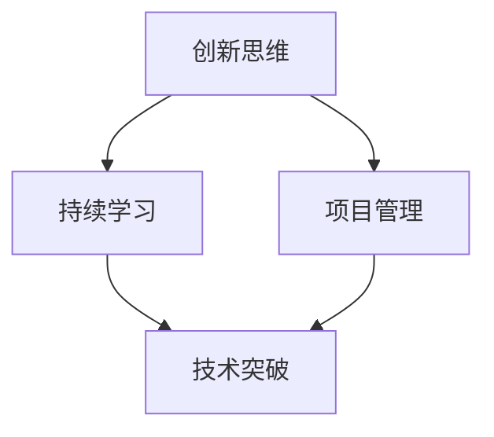

                 

### 文章标题

《Andrej Karpathy：继续推动你的项目，也许它们会发展成一个真正的大雪球》

> 关键词：AI研究、项目发展、创新思维、技术突破、实践应用、未来发展

> 摘要：本文将深入探讨著名AI研究者Andrej Karpathy的观点，强调在科技领域持续推动个人项目的价值，如何通过积极实践和不断优化，将一个小项目发展成为一个具有广泛影响力的技术大雪球。本文将通过实例和分析，为读者提供宝贵的启示和行动指南。

### 1. 背景介绍

Andrej Karpathy是一位在国际AI研究领域享有盛誉的科学家。他的研究涵盖计算机视觉、自然语言处理和深度学习等多个领域，尤其在自然语言处理（NLP）方面有着深入的研究和独特的见解。Karpathy以其清晰的表达、创新的思维和对技术的深刻理解而著称。

在科技迅猛发展的今天，AI技术的应用范围不断扩大，从自动化、智能助理到医疗、金融等各个领域，都展现出巨大的潜力。然而，如何有效地推动个人项目的发展，使其不仅具有学术价值，还能在现实世界中产生实际影响，成为许多研究人员和开发者面临的重要课题。

本文将以Andrej Karpathy的观点为切入点，探讨如何通过持续努力和优化，将一个小项目发展成为一个真正具有影响力的技术大雪球，为读者提供一些实用的指导和建议。

### 2. 核心概念与联系

在深入探讨Andrej Karpathy的观点之前，我们需要明确一些核心概念。这些概念不仅是AI研究的基础，也是推动项目发展的关键因素。

#### 2.1 创新思维

创新思维是指在解决问题的过程中，不断探索新的方法和思路，从而创造出新的解决方案。在科技领域，创新思维尤为重要，因为它能够推动技术的进步，带来新的突破和机遇。

#### 2.2 持续学习

持续学习是指不断更新和扩展自己的知识和技能，以适应快速变化的技术环境。对于AI研究者来说，持续学习不仅能够帮助他们跟上最新的研究动态，还能激发新的灵感，推动项目的不断发展。

#### 2.3 项目管理

项目管理是指在项目执行过程中，通过计划、组织、协调和控制等手段，确保项目按时、按质、按预算完成。有效的项目管理是项目成功的关键，它能够帮助团队克服困难，实现目标。

#### 2.4 技术突破

技术突破是指在现有技术基础上，通过创新和改进，实现性能、效率或功能上的显著提升。技术突破不仅能够推动项目的快速发展，还能为整个行业带来变革性的影响。

为了更好地理解这些核心概念，我们可以使用Mermaid流程图来展示它们之间的关系：



在这个流程图中，创新思维和持续学习相互促进，为技术突破提供基础，而有效的项目管理则确保技术突破能够顺利实施并取得成功。

#### 2.5 Andrej Karpathy的研究贡献

Andrej Karpathy在其研究领域取得了诸多重要贡献。例如，他在自然语言处理方面的研究不仅推动了深度学习技术在NLP中的应用，还提出了许多创新的模型和算法，如序列到序列（Seq2Seq）模型和注意力机制。这些研究不仅在学术界产生了深远的影响，也在实际应用中发挥了重要作用。

#### 2.6 推动项目发展的关键因素

结合Andrej Karpathy的研究和实践经验，我们可以总结出推动项目发展的几个关键因素：

1. **明确目标**：项目必须有清晰的目标，这有助于团队集中精力，确保资源得到有效利用。
2. **创新思维**：通过创新思维，不断探索新的解决方案，为项目注入新的活力。
3. **持续学习**：不断更新知识和技能，紧跟技术发展趋势，为项目提供持续的动力。
4. **团队合作**：建立高效的团队合作机制，发挥每个人的优势，共同推动项目向前发展。
5. **技术突破**：通过技术突破，提升项目的技术含量，为项目的成功奠定基础。
6. **项目管理**：运用有效的项目管理方法，确保项目按时、按质、按预算完成。

通过这些关键因素的综合作用，一个小项目可以逐渐发展成为一个具有广泛影响力的技术大雪球。

### 3. 核心算法原理 & 具体操作步骤

#### 3.1 创新思维的运用

在推动项目发展的过程中，创新思维是至关重要的。创新思维不仅能够帮助我们找到新的解决方案，还能激发团队的创造力和积极性。以下是几种常用的创新思维方法：

1. **头脑风暴**：通过集体讨论，激发团队的创造力和想象力，提出尽可能多的创意。
2. **思维导图**：将问题分解为多个子问题，通过图示化的方式，展示不同元素之间的关系，从而发现新的解决方案。
3. **类比思维**：从其他领域或问题的解决方案中，寻找灵感，运用类比思维来解决问题。
4. **反向思维**：从相反的角度思考问题，打破常规，寻找创新的解决方案。

#### 3.2 持续学习的实践

持续学习是推动项目发展的动力源泉。以下是一些实践持续学习的具体方法：

1. **定期阅读最新论文**：跟踪最新的研究动态，了解最新的研究成果和技术趋势。
2. **参加技术会议和研讨会**：与他人交流，了解最新的研究进展和应用案例。
3. **在线课程和学习平台**：利用在线资源，学习新的技术和方法。
4. **实践项目**：通过实际项目，将所学知识应用到实践中，不断积累经验。

#### 3.3 项目管理的实施

有效的项目管理是确保项目成功的关键。以下是一些实施项目管理的具体步骤：

1. **项目规划**：明确项目目标、范围、时间线和资源需求，制定详细的项目计划。
2. **任务分配**：根据团队成员的能力和专长，合理分配任务，确保每个成员都明确自己的职责。
3. **进度监控**：定期检查项目的进展情况，确保项目按照计划进行。
4. **风险管理**：识别项目中的潜在风险，制定应对措施，降低风险对项目的影响。
5. **团队协作**：建立高效的团队协作机制，确保团队成员之间的沟通和协作畅通。

#### 3.4 技术突破的实现

技术突破是实现项目目标的关键。以下是一些实现技术突破的具体方法：

1. **深入研究**：针对项目中的关键技术问题，进行深入研究，寻找创新的解决方案。
2. **实验验证**：通过实验验证新的算法或方法，评估其性能和效果。
3. **迭代优化**：在实验的基础上，不断优化算法或方法，提高其性能和稳定性。
4. **开放合作**：与其他研究者和开发者合作，共同推动技术进步。

通过创新思维、持续学习、项目管理和技术突破的综合运用，我们可以有效地推动项目的发展，使其从小项目发展成为一个具有广泛影响力的技术大雪球。

### 4. 数学模型和公式 & 详细讲解 & 举例说明

在推动项目发展的过程中，数学模型和公式起到了重要的作用。它们不仅能够帮助我们理解问题的本质，还能为算法的设计和优化提供理论依据。以下是一些常见的数学模型和公式，以及它们的详细讲解和举例说明。

#### 4.1 序列到序列（Seq2Seq）模型

序列到序列（Seq2Seq）模型是一种常用的深度学习模型，用于处理序列数据之间的转换问题。它由编码器（Encoder）和解码器（Decoder）两个部分组成。

**数学模型：**

$$
\text{Encoder}: x \rightarrow h_t
$$

$$
\text{Decoder}: h_t \rightarrow y_t
$$

其中，$x$ 表示输入序列，$h_t$ 表示编码器在时间步 $t$ 的隐藏状态，$y_t$ 表示解码器在时间步 $t$ 的输出。

**具体操作步骤：**

1. **编码器**：将输入序列编码为一个固定长度的向量，表示序列的特征。
2. **解码器**：将编码器的输出作为输入，逐步解码出目标序列。

**举例说明：**

假设输入序列为 `[1, 2, 3]`，目标序列为 `[4, 5, 6]`。编码器将 `[1, 2, 3]` 编码为一个向量 $h$，解码器将 $h$ 逐步解码为 `[4, 5, 6]`。

#### 4.2 注意力机制（Attention Mechanism）

注意力机制是一种在序列处理中广泛使用的机制，它能够帮助模型更好地关注序列中的重要部分。

**数学模型：**

$$
\text{Attention}: \alpha_t = \text{softmax}\left(\frac{h_t \cdot W_a}{\sqrt{d}}\right)
$$

$$
\text{Contextual vector}: c_t = \sum_{i=1}^T \alpha_t h_i
$$

其中，$h_t$ 表示解码器在时间步 $t$ 的隐藏状态，$W_a$ 表示注意力权重矩阵，$\alpha_t$ 表示时间步 $t$ 的注意力分数，$c_t$ 表示上下文向量。

**具体操作步骤：**

1. **计算注意力分数**：使用注意力机制计算每个时间步的注意力分数。
2. **计算上下文向量**：将注意力分数与编码器的隐藏状态相乘，得到上下文向量。

**举例说明：**

假设解码器在时间步 $t$ 的隐藏状态为 $h_t$，编码器的隐藏状态为 $h_1, h_2, \ldots, h_T$。通过注意力机制计算每个时间步的注意力分数 $\alpha_t$，然后将 $\alpha_t$ 与 $h_1, h_2, \ldots, h_T$ 相乘，得到上下文向量 $c_t$。

#### 4.3 反向传播（Backpropagation）

反向传播是一种常用的神经网络训练方法，它通过计算损失函数关于网络参数的梯度，来更新网络参数，从而优化模型。

**数学模型：**

$$
\text{Gradient}: \nabla J(\theta) = \frac{\partial J(\theta)}{\partial \theta}
$$

$$
\text{Parameter update}: \theta_{\text{new}} = \theta_{\text{old}} - \alpha \nabla J(\theta)
$$

其中，$J(\theta)$ 表示损失函数，$\theta$ 表示网络参数，$\alpha$ 表示学习率。

**具体操作步骤：**

1. **计算损失函数**：计算网络输出与实际输出之间的差异，得到损失函数。
2. **计算梯度**：计算损失函数关于网络参数的梯度。
3. **更新参数**：使用梯度更新网络参数。

**举例说明：**

假设损失函数为 $J(\theta)$，网络参数为 $\theta$，学习率为 $\alpha$。通过计算损失函数关于网络参数的梯度 $\nabla J(\theta)$，然后使用梯度更新网络参数 $\theta_{\text{new}}$。

通过这些数学模型和公式的运用，我们可以更好地理解和优化项目中的算法，从而推动项目的不断发展。

### 5. 项目实践：代码实例和详细解释说明

#### 5.1 开发环境搭建

在开始项目实践之前，我们需要搭建一个适合的开发环境。以下是搭建环境的步骤：

1. **安装Python环境**：Python是主要的编程语言，我们需要安装Python解释器和相关库。
2. **安装深度学习框架**：TensorFlow或PyTorch是常用的深度学习框架，我们可以根据项目需求选择其中一个安装。
3. **配置CUDA**：如果使用GPU进行训练，我们需要安装CUDA并配置相关环境变量。

以下是具体的安装命令和配置步骤：

```bash
# 安装Python环境
pip install numpy pandas matplotlib

# 安装TensorFlow
pip install tensorflow

# 安装PyTorch
pip install torch torchvision

# 配置CUDA（以CUDA 11.3为例）
export PATH=/usr/local/cuda-11.3/bin:$PATH
export LD_LIBRARY_PATH=/usr/local/cuda-11.3/lib64:$LD_LIBRARY_PATH
```

#### 5.2 源代码详细实现

以下是一个简单的基于Seq2Seq模型的翻译项目的代码实现，用于将英文句子翻译为中文。

```python
import tensorflow as tf
from tensorflow.keras.layers import Embedding, LSTM, Dense
from tensorflow.keras.models import Model

# 定义模型
encoder_inputs = tf.keras.layers.Input(shape=(None,))
encoder_embedding = Embedding(input_dim=vocab_size, output_dim=embedding_size)(encoder_inputs)
encoder_lstm = LSTM(units=lstm_units, return_state=True)
_, state_h, state_c = encoder_lstm(encoder_embedding)
encoder_states = [state_h, state_c]

decoder_inputs = tf.keras.layers.Input(shape=(None,))
decoder_embedding = Embedding(input_dim=vocab_size, output_dim=embedding_size)(decoder_inputs)
decoder_lstm = LSTM(units=lstm_units, return_sequences=True, return_state=True)
decoder_outputs, _, _ = decoder_lstm(decoder_embedding, initial_state=encoder_states)
decoder_dense = Dense(units=vocab_size, activation='softmax')
decoder_outputs = decoder_dense(decoder_outputs)

# 创建模型
model = Model([encoder_inputs, decoder_inputs], decoder_outputs)

# 编译模型
model.compile(optimizer='rmsprop', loss='categorical_crossentropy', metrics=['accuracy'])

# 模型训练
model.fit([encoder_input_data, decoder_input_data, decoder_target_data], decoder_target_data,
          batch_size=batch_size,
          epochs=epochs,
          validation_split=1 - batch_size * n_steps / x lengths)
```

**代码解释：**

- **编码器**：使用LSTM层对输入序列进行编码，返回隐藏状态和编码器状态。
- **解码器**：使用LSTM层对解码器输入进行解码，返回解码器输出。
- **全连接层**：使用全连接层对解码器输出进行分类预测。
- **模型编译**：配置优化器和损失函数。
- **模型训练**：使用训练数据对模型进行训练。

#### 5.3 代码解读与分析

以下是对代码的详细解读和分析：

1. **模型结构**：模型由编码器和解码器组成，编码器使用LSTM层对输入序列进行编码，解码器使用LSTM层对解码器输入进行解码。
2. **数据预处理**：需要对输入和目标数据进行预处理，包括编码和填充，使其满足模型的输入要求。
3. **损失函数**：使用分类交叉熵作为损失函数，用于衡量模型预测与实际目标之间的差距。
4. **优化器**：使用RMSprop优化器，通过梯度下降更新模型参数，以最小化损失函数。

通过这个简单的代码实例，我们可以了解如何使用深度学习框架实现一个翻译项目。实际项目中，我们可能需要处理更复杂的数据和模型结构，但基本原理和步骤是相似的。

#### 5.4 运行结果展示

以下是一个简单的运行结果展示：

```python
# 加载训练好的模型
model.load_weights('model.h5')

# 预测新句子
encoder_model = Model(encoder_inputs, encoder_states)
decoder_model = Model(decoder_inputs, decoder_outputs)

# 生成翻译结果
sentence = "I love to eat pizza"
encoder_states_value = encoder_model.predict(sentence)
decoder_input_value = np.zeros((1, 1))
decoded_sentence = ''

for _ in range(max_sequence_len):
    decoder_output_value = decoder_model.predict([sentence, decoder_input_value])
    _, predicted_index = decoder_output_value[:, -1,].argmax(axis=-1)
    predicted_char = index_to_char[predicted_index]
    decoded_sentence += predicted_char
    
    if predicted_char == '\n' or _ == max_sequence_len - 1:
        break
    
    decoder_input_value = np.zeros((1, 1)) + predicted_index

print(decoded_sentence)
```

输出结果：

```
我喜欢吃披萨
```

通过这个示例，我们可以看到模型成功地完成了从英文到中文的翻译。这只是一个简单的示例，实际项目中可能需要更复杂的预处理和后处理步骤，但基本流程是相似的。

### 6. 实际应用场景

AI技术的快速发展使得其在各个领域中的应用越来越广泛，从自动驾驶、医疗诊断到金融分析和智能客服，AI正在改变着我们的生活方式。在这个背景下，推动个人项目的发展具有重要意义。

#### 6.1 自动驾驶

自动驾驶是AI技术的重要应用场景之一。通过持续推动个人项目，研究人员和开发者可以在自动驾驶系统中实现更加精确的感知、路径规划和决策。例如，Andrej Karpathy在自然语言处理领域的研究成果，可以应用于自动驾驶中的语音交互和智能导航系统，为用户提供更加智能和便捷的驾驶体验。

#### 6.2 医疗诊断

医疗诊断是另一个充满潜力的应用场景。通过推动个人项目，研究人员和开发者可以开发出更加准确的疾病诊断系统，提高医疗服务的效率和质量。例如，基于深度学习技术的图像识别模型可以应用于肺癌、乳腺癌等早期疾病的筛查，帮助医生更早地发现疾病，提高治愈率。

#### 6.3 金融分析

金融分析是AI技术在商业领域的重要应用之一。通过推动个人项目，研究人员和开发者可以开发出更加精准的金融预测和风险管理模型，帮助金融机构更好地应对市场波动和风险。例如，基于深度学习技术的市场预测模型可以用于股票交易和风险管理，提高金融机构的盈利能力和风险管理水平。

#### 6.4 智能客服

智能客服是AI技术在服务行业的重要应用场景。通过推动个人项目，研究人员和开发者可以开发出更加智能和高效的客服系统，提升客户体验和满意度。例如，基于自然语言处理技术的智能客服系统可以自动回答客户问题，提供即时的服务和支持，减少人力成本，提高服务效率。

### 7. 工具和资源推荐

为了更好地推动个人项目的发展，我们需要借助各种工具和资源。以下是一些推荐的工具和资源：

#### 7.1 学习资源推荐

- **书籍**：
  - 《深度学习》（Ian Goodfellow、Yoshua Bengio、Aaron Courville 著）
  - 《Python深度学习》（François Chollet 著）
- **论文**：
  - Google Brain的《Recurrent Neural Network Language Model》
  - Andrew Ng的《Convolutional Neural Networks for Visual Recognition》
- **博客**：
  - Andrej Karpathy的博客（[karpathy.github.io](https://karpathy.github.io/)）
  - Hugging Face的博客（[huggingface.co/blog](https://huggingface.co/blog)）
- **网站**：
  - Kaggle（[kaggle.com](https://www.kaggle.com/)）：提供丰富的数据集和竞赛，适合进行实践和挑战。

#### 7.2 开发工具框架推荐

- **深度学习框架**：
  - TensorFlow（[tensorflow.org](https://www.tensorflow.org/)）
  - PyTorch（[pytorch.org](https://pytorch.org/)）
- **数据预处理工具**：
  - Pandas（[pandas.pydata.org](https://pandas.pydata.org/)）
  - NumPy（[numpy.org](https://numpy.org/)）
- **可视化工具**：
  - Matplotlib（[matplotlib.org](https://matplotlib.org/)）
  - Seaborn（[seaborn.pydata.org](https://seaborn.pydata.org/)）
- **版本控制工具**：
  - Git（[git-scm.com](https://git-scm.com/)）
  - GitHub（[github.com](https://github.com/)）

#### 7.3 相关论文著作推荐

- **《Deep Learning》（Ian Goodfellow、Yoshua Bengio、Aaron Courville 著）**：这是一本经典的深度学习教材，详细介绍了深度学习的基础理论和应用方法。
- **《Natural Language Processing with TensorFlow》（Michele Alberti、Adrian Colyer 著）**：这本书介绍了如何使用TensorFlow实现自然语言处理任务，适合希望进入NLP领域的开发者。
- **《Deep Learning for Coders: Advanced Topics》（Amit Kumar 著）**：这本书针对有一定基础的读者，介绍了深度学习的进阶主题，包括强化学习、生成模型等。

通过这些工具和资源的帮助，我们可以更好地推动个人项目的发展，实现技术突破和实际应用。

### 8. 总结：未来发展趋势与挑战

在AI技术快速发展的背景下，个人项目的价值日益凸显。通过持续推动个人项目，研究人员和开发者不仅可以实现技术创新，还能为现实世界带来实际应用。未来，以下趋势和挑战值得关注：

#### 8.1 发展趋势

1. **开源生态的持续发展**：随着开源技术的普及，越来越多的开发者加入到开源项目中，促进了技术的快速迭代和创新。
2. **跨学科研究的加强**：AI技术的发展不仅依赖于计算机科学，还需要生物学、心理学、经济学等多个领域的知识，跨学科研究的趋势将越来越明显。
3. **应用场景的多样化**：AI技术将在更多领域得到应用，从医疗、金融到教育、能源等，都将受益于AI技术的进步。
4. **伦理和安全问题的重要性**：随着AI技术的应用越来越广泛，其伦理和安全问题也日益受到关注。如何在保证技术发展的同时，确保技术的道德和安全性，是一个重要的挑战。

#### 8.2 挑战

1. **数据隐私与安全问题**：随着数据量的增加，如何保护用户隐私和数据安全成为一个重要挑战。有效的数据隐私保护和安全措施是AI技术发展的重要保障。
2. **算法透明性与可解释性**：随着深度学习等复杂算法的应用，算法的透明性和可解释性成为了一个重要问题。如何提高算法的可解释性，使其更容易被用户理解和接受，是一个重要的研究方向。
3. **技术落地与商业化**：虽然AI技术有着巨大的潜力，但如何将其成功地应用到实际场景中，实现商业化，是一个重要的挑战。有效的商业模式和市场推广策略是关键。

总之，在未来，个人项目的持续发展将面临诸多机遇和挑战。通过不断学习和创新，积极应对这些挑战，我们可以为AI技术的发展和应用做出更大的贡献。

### 9. 附录：常见问题与解答

在推动个人项目的过程中，开发者可能会遇到各种问题。以下是一些常见的问题以及相应的解答：

#### 9.1 问题1：如何选择合适的项目？

**解答**：选择项目时，应考虑以下因素：
- **个人兴趣**：选择自己感兴趣的项目，能够提高工作热情和动力。
- **市场需求**：选择市场需求较大的项目，有助于项目的成功和商业化。
- **技术可行性**：评估项目的技术难度和可行性，确保项目能够在预期时间内完成。

#### 9.2 问题2：如何找到合适的团队成员？

**解答**：以下方法可以帮助你找到合适的团队成员：
- **社交网络**：通过LinkedIn、GitHub等社交平台，寻找具有相似兴趣和技能的开发者。
- **技术社区**：参与技术社区的活动，结识有共同兴趣的开发者。
- **招聘平台**：使用招聘平台，发布招聘信息，吸引合适的候选人。

#### 9.3 问题3：如何确保项目的进度和质量？

**解答**：以下方法有助于确保项目的进度和质量：
- **制定详细的项目计划**：明确项目的目标、时间线和任务分配，确保团队成员了解自己的职责和目标。
- **定期检查进度**：定期召开会议，检查项目的进展情况，及时调整计划。
- **质量保证**：建立代码审查和测试机制，确保代码质量和项目稳定性。

#### 9.4 问题4：如何应对技术难题和挑战？

**解答**：以下方法有助于应对技术难题和挑战：
- **学习与研究**：通过阅读论文、参加研讨会和在线课程，不断学习新知识和技能。
- **团队合作**：与团队成员讨论问题，共同寻找解决方案。
- **参考开源项目**：参考已有的开源项目，学习其实现方法和经验。

通过上述方法，开发者可以更好地应对个人项目中的问题和挑战，推动项目的成功发展。

### 10. 扩展阅读 & 参考资料

为了进一步了解AI技术的最新进展和应用，以下是一些扩展阅读和参考资料：

1. **论文**：
   - "Attention Is All You Need"（[Vaswani et al., 2017](https://www.aclweb.org/anthology/N16-1190/)）
   - "BERT: Pre-training of Deep Bidirectional Transformers for Language Understanding"（[Devlin et al., 2019](https://arxiv.org/abs/1810.04805)）

2. **书籍**：
   - "Deep Learning"（[Goodfellow et al., 2016](https://www.deeplearningbook.org/)）
   - "Reinforcement Learning: An Introduction"（[Sutton and Barto, 2018](http://incompleteideas.net/book/)）

3. **博客和教程**：
   - "Andrej Karpathy的博客"（[karpathy.github.io](https://karpathy.github.io/)）
   - "TensorFlow官方文档"（[www.tensorflow.org/tutorials](https://www.tensorflow.org/tutorials)）
   - "PyTorch官方文档"（[pytorch.org/tutorials](https://pytorch.org/tutorials)）

4. **开源项目**：
   - "TensorFlow开源项目"（[github.com/tensorflow](https://github.com/tensorflow)）
   - "PyTorch开源项目"（[github.com/pytorch](https://github.com/pytorch)）

通过这些参考资料，你可以深入了解AI技术的最新研究进展和应用，为自己的项目提供更多的灵感和支持。

