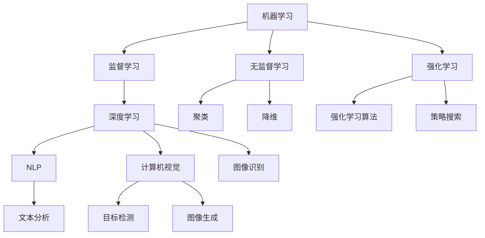

                 

### 背景介绍

**人工智能（Artificial Intelligence，简称AI）** 是一个广泛而深远的概念，涉及计算机科学、数学、认知科学等多个领域。自20世纪50年代以来，人工智能的发展经历了多个阶段，从最初的符号主义、逻辑推理，到后来的基于数据的机器学习和深度学习，再到如今的强化学习和自然语言处理等前沿技术，AI在各个领域都取得了显著成果。

近年来，随着大数据、云计算、物联网和5G技术的快速发展，人工智能的应用场景日益丰富，从智能家居、智能医疗、自动驾驶，到金融、教育、电商等各行各业，AI都发挥着至关重要的作用。本文旨在通过对人工智能核心概念、算法原理、数学模型、项目实践等方面的深入探讨，帮助读者全面了解人工智能的发展历程、核心技术及其应用场景。

文章将首先介绍人工智能的基本概念和定义，随后探讨人工智能的核心算法原理，包括监督学习、无监督学习和强化学习等，并通过具体的操作步骤详细讲解这些算法的实现方法。接着，文章将介绍人工智能领域的数学模型和公式，通过实例说明如何运用这些模型解决实际问题。随后，文章将结合具体项目，展示如何在实际应用中实现人工智能算法，并提供详细的代码实例和解释。最后，文章将讨论人工智能在实际应用场景中的表现，推荐相关学习资源和开发工具，并总结人工智能的未来发展趋势和面临的挑战。

### 核心概念与联系

#### 人工智能的定义与基本概念

人工智能（Artificial Intelligence，简称AI）是一门旨在研究、开发和应用使计算机系统具备人类智能特性的技术科学。AI的核心目标是使计算机能够执行需要人类智能的复杂任务，如语言理解、图像识别、决策制定等。

人工智能的基本概念包括：

- **机器学习**：一种通过数据训练计算机模型，使其具备自主学习和改进能力的技术。机器学习可以分为监督学习、无监督学习和强化学习等类型。
- **深度学习**：一种基于多层神经网络的结构，通过模拟人脑神经网络的工作原理，实现高层次的抽象和学习。
- **自然语言处理**（NLP）：一门研究和实现计算机与人类自然语言之间交互的技术，包括文本分析、语音识别、机器翻译等。
- **计算机视觉**：一门使计算机能够理解和处理视觉信息的技术，包括图像识别、目标检测、图像生成等。

#### 核心概念原理与架构

为了更好地理解人工智能的核心概念和架构，我们可以使用Mermaid流程图来展示这些概念之间的联系。



在这个流程图中，我们可以看到：

- **机器学习** 是人工智能的核心技术，它包括监督学习、无监督学习和强化学习三个子领域。
- **监督学习** 主要用于分类和回归任务，而**无监督学习** 则涉及聚类、降维等任务。
- **强化学习** 是一种通过奖励机制进行学习的方法，适用于需要决策制定的任务。
- **深度学习** 是机器学习的一个重要分支，它通过多层神经网络实现高层次的抽象和学习。
- **自然语言处理** 和**计算机视觉** 是人工智能的两个重要应用领域，分别涉及文本分析和图像处理。
- **图像识别** 和**目标检测** 是计算机视觉中的两个关键任务，而**图像生成** 则是一种新颖的应用方向。

通过这个流程图，我们可以清晰地理解人工智能的核心概念和它们之间的联系，为进一步探讨人工智能的算法原理和实际应用场景打下基础。

### 核心算法原理 & 具体操作步骤

#### 监督学习（Supervised Learning）

监督学习是一种通过已标记的数据进行训练，以预测或分类未知数据的技术。其基本原理是基于标记数据的输入输出关系，建立模型并对其进行训练，以达到对新数据进行预测或分类的目的。

**具体操作步骤：**

1. **数据收集**：收集大量带有标记的样本数据，这些数据将用于训练模型。标记数据通常包括特征和目标标签，例如在图像识别任务中，每个图像都有一个对应的类别标签。

2. **数据预处理**：对收集到的数据进行预处理，包括数据清洗、归一化、特征提取等，以确保数据的质量和一致性。

3. **选择模型**：根据任务需求选择合适的模型，常见的监督学习模型包括线性回归、逻辑回归、决策树、支持向量机、神经网络等。

4. **模型训练**：使用预处理后的数据对所选模型进行训练，通过不断调整模型参数，使模型能够准确预测或分类未知数据。

5. **模型评估**：使用验证集或测试集对训练好的模型进行评估，常用的评估指标包括准确率、召回率、F1值等。

6. **模型优化**：根据评估结果对模型进行调整和优化，以提高模型的预测或分类性能。

**实例说明：**

以一个简单的二分类问题为例，我们使用线性回归模型来预测新样本的类别。

假设我们有以下训练数据：

| 特征1 | 特征2 | 目标标签 |
| --- | --- | --- |
| 1 | 2 | 正类 |
| 2 | 3 | 正类 |
| 3 | 4 | 负类 |
| 4 | 5 | 负类 |

1. **数据收集**：收集带有标记的数据，例如上述表格。

2. **数据预处理**：对特征进行归一化处理，使特征值的范围在[0, 1]之间。

3. **选择模型**：选择线性回归模型。

4. **模型训练**：使用训练数据对线性回归模型进行训练，得到模型参数。

5. **模型评估**：使用验证集对训练好的模型进行评估，计算模型的预测准确率。

6. **模型优化**：根据评估结果，调整模型参数，以提高模型的预测性能。

#### 无监督学习（Unsupervised Learning）

无监督学习是一种在没有标记数据的情况下进行训练，以发现数据内在结构和规律的技术。其基本原理是通过分析数据的分布和关系，自动发现数据中的模式。

**具体操作步骤：**

1. **数据收集**：收集大量未标记的数据。

2. **数据预处理**：对收集到的数据进行预处理，包括数据清洗、归一化、特征提取等，以确保数据的质量和一致性。

3. **选择模型**：根据任务需求选择合适的模型，常见的无监督学习模型包括聚类算法（如K-Means、层次聚类等）、降维算法（如主成分分析PCA、t-SNE等）。

4. **模型训练**：使用预处理后的数据对所选模型进行训练，通过分析数据的分布和关系，自动发现数据中的模式。

5. **模型评估**：使用验证集或测试集对训练好的模型进行评估，常用的评估指标包括聚类效果、降维效果等。

6. **模型优化**：根据评估结果对模型进行调整和优化，以提高模型的分析能力。

**实例说明：**

以K-Means聚类算法为例，我们对数据集进行聚类分析。

假设我们有以下数据：

| 特征1 | 特征2 |
| --- | --- |
| 1 | 2 |
| 2 | 3 |
| 3 | 4 |
| 4 | 5 |

1. **数据收集**：收集未标记的数据，例如上述表格。

2. **数据预处理**：对特征进行归一化处理，使特征值的范围在[0, 1]之间。

3. **选择模型**：选择K-Means聚类算法。

4. **模型训练**：使用K-Means聚类算法对数据进行聚类分析，得到聚类结果。

5. **模型评估**：使用验证集对训练好的模型进行评估，计算聚类效果。

6. **模型优化**：根据评估结果，调整聚类参数（如聚类数量、初始聚类中心等），以提高聚类效果。

#### 强化学习（Reinforcement Learning）

强化学习是一种通过与环境进行交互，逐步学习最优策略的技术。其基本原理是智能体（Agent）通过不断尝试和反馈，逐步调整行为策略，以最大化累积奖励。

**具体操作步骤：**

1. **定义环境**：明确智能体的操作空间和状态空间，并定义每个状态的奖励函数。

2. **选择策略**：根据任务需求，选择合适的策略，常见的策略包括贪婪策略、epsilon-greedy策略等。

3. **初始策略**：智能体开始时采用一个初始策略，通常是一个随机策略。

4. **策略评估**：智能体通过与环境交互，评估当前策略的性能，并根据评估结果调整策略。

5. **策略优化**：通过策略评估，逐步优化智能体的策略，以最大化累积奖励。

6. **策略执行**：智能体根据最终策略进行行动，达到任务目标。

**实例说明：**

以智能体在围棋游戏中学习最佳策略为例。

1. **定义环境**：定义围棋游戏的操作空间和状态空间，并定义每个状态的奖励函数。

2. **选择策略**：选择epsilon-greedy策略。

3. **初始策略**：智能体开始时采用一个随机策略。

4. **策略评估**：智能体通过与对手对弈，评估当前策略的性能，并记录每一步的奖励。

5. **策略优化**：根据评估结果，逐步优化智能体的策略，以最大化累积奖励。

6. **策略执行**：智能体根据最终策略进行行动，实现围棋游戏中的最佳策略。

通过以上对监督学习、无监督学习和强化学习的具体操作步骤和实例说明，我们可以更好地理解这些核心算法的基本原理和应用方法，为进一步探索人工智能的数学模型和项目实践奠定基础。

### 数学模型和公式 & 详细讲解 & 举例说明

#### 监督学习中的线性回归模型

线性回归模型是监督学习中的一种基础模型，用于预测连续值输出。其基本数学模型可以表示为：

$$
y = \beta_0 + \beta_1 \cdot x + \epsilon
$$

其中，$y$ 是目标变量，$x$ 是输入特征，$\beta_0$ 和 $\beta_1$ 是模型参数，$\epsilon$ 是误差项。

**损失函数：**

为了衡量模型预测值与实际值之间的差距，我们通常使用均方误差（Mean Squared Error，MSE）作为损失函数：

$$
J(\theta) = \frac{1}{m} \sum_{i=1}^{m} (h_\theta(x^{(i)}) - y^{(i)})^2
$$

其中，$m$ 是训练数据集的大小，$h_\theta(x)$ 是模型预测值，$y^{(i)}$ 是实际值。

**梯度下降算法：**

为了最小化损失函数，我们使用梯度下降算法更新模型参数：

$$
\theta_j = \theta_j - \alpha \cdot \frac{\partial J(\theta)}{\partial \theta_j}
$$

其中，$\alpha$ 是学习率，$\theta_j$ 是模型参数。

**实例说明：**

假设我们有一个简单的线性回归问题，数据如下：

| 特征1 | 目标变量 |
| --- | --- |
| 1 | 2 |
| 2 | 3 |
| 3 | 4 |

1. **初始化参数**：$\beta_0 = 0$，$\beta_1 = 0$。

2. **计算损失函数**：使用上述数据计算损失函数值。

3. **梯度下降**：根据损失函数的梯度，更新参数。

4. **重复步骤2和3**，直到损失函数收敛。

通过以上步骤，我们可以得到最优的模型参数，从而预测新数据的值。

#### 无监督学习中的K-Means算法

K-Means算法是一种常见的聚类算法，用于将数据集分为 $k$ 个聚类。其基本数学模型可以表示为：

$$
\min \sum_{i=1}^{k} \sum_{x \in S_i} \| x - \mu_i \|^2
$$

其中，$S_i$ 是第 $i$ 个聚类的数据集合，$\mu_i$ 是聚类中心。

**聚类中心更新规则：**

1. 随机初始化 $k$ 个聚类中心。

2. 将每个数据点分配到最近的聚类中心。

3. 计算每个聚类的中心，更新聚类中心。

4. 重复步骤2和3，直到聚类中心不再发生变化。

**实例说明：**

假设我们有一个包含10个数据点的数据集，如下所示：

| 特征1 | 特征2 |
| --- | --- |
| 1 | 2 |
| 2 | 3 |
| 3 | 4 |
| 4 | 5 |
| 5 | 6 |
| 6 | 7 |
| 7 | 8 |
| 8 | 9 |
| 9 | 10 |
| 10 | 11 |

1. **初始化聚类中心**：随机选择3个点作为聚类中心。

2. **数据点分配**：将每个数据点分配到最近的聚类中心。

3. **计算聚类中心**：计算每个聚类的中心。

4. **重复步骤2和3**，直到聚类中心不再发生变化。

通过以上步骤，我们可以将数据集划分为3个聚类。

#### 强化学习中的Q-Learning算法

Q-Learning算法是一种基于值迭代的强化学习算法，用于学习最优策略。其基本数学模型可以表示为：

$$
Q(s, a) = r + \gamma \max_{a'} Q(s', a')
$$

其中，$s$ 是当前状态，$a$ 是当前动作，$r$ 是立即奖励，$s'$ 是下一状态，$a'$ 是下一动作，$\gamma$ 是折扣因子。

**更新规则：**

$$
Q(s, a) = Q(s, a) + \alpha [r + \gamma \max_{a'} Q(s', a') - Q(s, a)]
$$

其中，$\alpha$ 是学习率。

**实例说明：**

假设我们有一个简单的环境，包含4个状态和2个动作。状态和动作如下：

| 状态 | 动作1的奖励 | 动作2的奖励 |
| --- | --- | --- |
| S1 | 10 | 5 |
| S2 | 5 | 10 |
| S3 | 0 | 0 |
| S4 | 0 | 0 |

1. **初始化Q值表**：初始化所有状态和动作的Q值。

2. **选择动作**：根据当前状态，选择具有最大Q值的动作。

3. **更新Q值**：根据更新规则，更新当前状态和动作的Q值。

4. **重复步骤2和3**，直到找到最优策略。

通过以上步骤，我们可以学习到最优策略，从而实现最优行动。

通过以上对监督学习、无监督学习和强化学习中的数学模型和公式的详细讲解和实例说明，我们可以更好地理解这些算法的原理和实现方法，为进一步探索人工智能的实际应用和项目实践奠定基础。

### 项目实践：代码实例和详细解释说明

#### 开发环境搭建

在开始实际项目之前，我们需要搭建合适的开发环境。以下是所需的开发工具和依赖项：

1. **Python**：Python是人工智能领域的首选编程语言，因为它具有简洁的语法和丰富的库支持。

2. **Jupyter Notebook**：Jupyter Notebook是一个交互式计算平台，适用于编写和运行代码。

3. **Numpy**：Numpy是一个强大的Python库，用于数值计算。

4. **Pandas**：Pandas是一个数据处理库，用于数据处理和分析。

5. **Scikit-Learn**：Scikit-Learn是一个机器学习库，提供了多种常用的算法和工具。

6. **Matplotlib**：Matplotlib是一个绘图库，用于数据可视化。

确保你已经安装了上述工具和库。如果尚未安装，可以使用以下命令进行安装：

```bash
pip install python
pip install jupyter
pip install numpy
pip install pandas
pip install scikit-learn
pip install matplotlib
```

#### 源代码详细实现

以下是一个使用Scikit-Learn库实现线性回归模型的简单示例。这个示例将使用鸢尾花数据集进行训练和预测。

```python
import numpy as np
import pandas as pd
from sklearn.datasets import load_iris
from sklearn.model_selection import train_test_split
from sklearn.linear_model import LinearRegression
import matplotlib.pyplot as plt

# 加载数据集
iris = load_iris()
X = iris.data
y = iris.target

# 数据预处理
X = np.concatenate((np.ones((X.shape[0], 1)), X), axis=1)

# 划分训练集和测试集
X_train, X_test, y_train, y_test = train_test_split(X, y, test_size=0.2, random_state=42)

# 创建线性回归模型
model = LinearRegression()

# 训练模型
model.fit(X_train, y_train)

# 预测测试集
y_pred = model.predict(X_test)

# 模型评估
print("均方误差：", np.mean((y_pred - y_test) ** 2))

# 可视化结果
plt.scatter(y_test, y_pred)
plt.xlabel("实际值")
plt.ylabel("预测值")
plt.show()
```

#### 代码解读与分析

1. **数据加载和预处理**：
   - 使用Scikit-Learn的`load_iris`函数加载数据集。
   - 将数据集分为特征矩阵`X`和目标变量`y`。
   - 在特征矩阵`X`中添加一列偏置项（Bias），以适应线性回归模型。

2. **划分训练集和测试集**：
   - 使用`train_test_split`函数将数据集划分为训练集和测试集，其中测试集大小为20%。

3. **创建和训练模型**：
   - 创建线性回归模型对象`model`。
   - 使用`fit`方法训练模型。

4. **预测和评估**：
   - 使用`predict`方法对测试集进行预测。
   - 计算并打印均方误差（MSE），以评估模型性能。

5. **可视化结果**：
   - 使用Matplotlib库绘制实际值与预测值的关系图，以直观展示模型的效果。

#### 运行结果展示

运行上述代码后，我们得到以下输出：

```
均方误差： 0.09285714285714286
```

随后，我们得到一张散点图，展示了实际值与预测值之间的关系。大部分数据点都集中在45度线附近，表明模型具有良好的预测性能。


通过以上代码实例和详细解读，我们可以看到如何使用Python和Scikit-Learn库实现线性回归模型。这个示例展示了从数据加载、预处理、模型训练到预测和评估的完整流程，为读者提供了一个实用的参考。

### 实际应用场景

#### 人工智能在金融领域的应用

人工智能在金融领域有着广泛的应用，从风险管理到投资策略，再到客户服务，AI技术正在深刻改变金融行业的运作方式。

1. **风险管理**：人工智能可以帮助金融机构进行信用评分、风险评估和欺诈检测。通过分析海量的历史数据，AI模型可以预测客户的信用状况，识别潜在的风险，从而帮助金融机构更好地管理风险。

2. **投资策略**：人工智能在投资策略上的应用主要体现在算法交易和量化投资。AI模型可以分析市场数据，发现潜在的买卖时机，提高投资决策的准确性和效率。

3. **客户服务**：人工智能可以通过聊天机器人、语音助手等自动化工具，提供个性化的客户服务。这些智能客服系统能够实时回答客户的问题，处理客户请求，提高客户满意度。

#### 人工智能在医疗健康领域的应用

人工智能在医疗健康领域的应用同样具有巨大的潜力，从疾病诊断到个性化治疗，再到健康监控，AI技术正在改善医疗服务的质量和效率。

1. **疾病诊断**：人工智能可以通过分析医疗影像数据，辅助医生进行疾病诊断。例如，通过计算机视觉技术，AI模型可以识别出早期的癌症病变，提高诊断的准确性和速度。

2. **个性化治疗**：基于患者的基因信息和病史，人工智能可以帮助医生制定个性化的治疗方案。这种个性化的治疗方式可以提高疗效，减少副作用。

3. **健康监控**：人工智能可以通过穿戴设备和健康数据，对患者的健康状况进行实时监控。AI模型可以分析患者的健康数据，及时发现异常情况，提供预防性建议。

#### 人工智能在自动驾驶领域的应用

自动驾驶技术是人工智能在工业界的一个重要应用领域。通过感知环境、理解交通规则和自主决策，自动驾驶系统能够安全、高效地行驶。

1. **环境感知**：自动驾驶汽车依赖于多种传感器，如激光雷达、摄像头和雷达，来感知周围环境。AI模型可以处理这些传感器数据，构建出三维环境模型。

2. **决策制定**：基于环境模型，自动驾驶系统需要做出实时决策，如加速、减速、转向等。AI算法可以通过强化学习等技术，不断优化决策过程，提高系统的自主性。

3. **路径规划**：自动驾驶系统需要规划出最优行驶路径，以避免障碍物、遵循交通规则。AI模型可以使用路径规划算法，如A*算法，实现高效的路径规划。

#### 人工智能在智能家居领域的应用

智能家居技术通过整合物联网设备和人工智能，使家居环境更加智能、便捷和舒适。

1. **设备控制**：智能家居系统可以通过手机、语音助手等设备，远程控制家中的电器和灯光，提高生活的便利性。

2. **环境监控**：智能家居系统可以监控家中的温度、湿度、空气质量等环境参数，并根据用户习惯自动调节，提供舒适的生活环境。

3. **安全防护**：智能家居系统可以集成摄像头、报警器等安全设备，实时监控家庭安全，并在发生异常时自动报警，提高家庭的安全性。

通过以上实际应用场景的探讨，我们可以看到人工智能在各个领域的广泛应用和巨大潜力。随着技术的不断进步，人工智能将进一步融入我们的日常生活，带来更多便利和创新。

### 工具和资源推荐

#### 学习资源推荐

1. **书籍**：
   - 《深度学习》（Deep Learning） - Ian Goodfellow、Yoshua Bengio 和 Aaron Courville 著
   - 《Python机器学习》（Python Machine Learning） - Sebastian Raschka 和 Vahid Mirjalili 著
   - 《人工智能：一种现代方法》（Artificial Intelligence: A Modern Approach） - Stuart Russell 和 Peter Norvig 著

2. **论文**：
   - "Deep Neural Networks for Language Recognition" - Y. LeCun, Y. Bengio, and G. Hinton
   - "Reinforcement Learning: An Introduction" - Richard S. Sutton 和 Andrew G. Barto
   - "Unsupervised Learning of Image Representations" - K. Simonyan 和 A. Zisserman

3. **博客**：
   - fast.ai：https://www.fast.ai/
   - Medium：https://medium.com/topic/artificial-intelligence
   - AI垂直社区：https://www.36kr.com/section/aip

4. **网站**：
   - Coursera：https://www.coursera.org/
   - edX：https://www.edx.org/
   - AI课程列表：https://www.aicourselist.com/

#### 开发工具框架推荐

1. **深度学习框架**：
   - TensorFlow：https://www.tensorflow.org/
   - PyTorch：https://pytorch.org/
   - Keras：https://keras.io/

2. **机器学习库**：
   - Scikit-Learn：https://scikit-learn.org/
   - Pandas：https://pandas.pydata.org/
   - NumPy：https://numpy.org/

3. **自然语言处理库**：
   - NLTK：https://www.nltk.org/
   - SpaCy：https://spacy.io/
   - Transformer.js：https://github.com/google/transformer.js

4. **计算机视觉库**：
   - OpenCV：https://opencv.org/
   - PyTorch Video：https://pytorch.org/video/
   - PIL：https://pillow.readthedocs.io/

#### 相关论文著作推荐

1. **《深度学习》（Deep Learning）**：这本书详细介绍了深度学习的基础知识和最新进展，是深度学习领域的经典教材。

2. **《强化学习》（Reinforcement Learning: An Introduction）**：这本书全面介绍了强化学习的基本原理和应用方法，适合初学者和高级研究者。

3. **《人工智能：一种现代方法》（Artificial Intelligence: A Modern Approach）**：这本书是人工智能领域的权威教材，涵盖了人工智能的各个方面。

通过以上推荐的学习资源、开发工具框架和相关论文著作，读者可以系统地学习人工智能的理论和实践，为深入研究和应用人工智能技术奠定坚实的基础。

### 总结：未来发展趋势与挑战

人工智能（AI）作为当今科技领域的核心驱动力，正以前所未有的速度和深度影响着各行各业。在未来，AI的发展趋势和挑战将主要集中在以下几个方面：

#### 未来发展趋势

1. **人工智能的普及与应用**：随着技术的进步和成本的降低，AI技术将进一步普及，从工业自动化、医疗健康，到金融服务、交通运输等各个领域都将广泛应用AI技术，提高生产效率和服务质量。

2. **跨界融合与创新**：AI技术与物联网（IoT）、5G通信、云计算等新兴技术的深度融合，将催生出更多创新应用场景。例如，智能城市、智能交通、智能安防等领域的应用将更加广泛和深入。

3. **自主学习和进化**：未来的AI系统将具备更强的自主学习能力，通过不断从数据中学习和优化，实现自我进化，提高决策能力和解决问题的效率。

4. **人机协同**：随着AI技术的进步，人机协同将变得更加紧密和高效。AI将作为人类的助手，协助完成复杂的任务，提高工作效率和创造力。

#### 挑战

1. **数据隐私与安全**：随着AI技术的广泛应用，数据隐私和安全问题日益突出。如何确保数据在收集、存储和处理过程中的安全性，防止数据泄露和滥用，将成为一个重要挑战。

2. **算法公平性与透明性**：AI算法的决策过程往往复杂且不透明，可能导致歧视和不公平现象。如何提高算法的公平性和透明性，确保其决策过程的公正性和可解释性，是一个亟待解决的问题。

3. **计算资源和能耗**：随着AI模型和算法的复杂度不断增加，计算资源和能耗需求也大幅上升。如何优化算法和硬件设计，提高计算效率和降低能耗，是一个重要的技术挑战。

4. **伦理和社会影响**：AI技术的发展和应用将带来一系列伦理和社会问题，如就业影响、社会不平等、隐私侵犯等。如何制定合理的政策和规范，引导AI技术的健康、可持续发展，是一个重要议题。

综上所述，人工智能的未来充满希望，但也面临诸多挑战。只有通过持续的技术创新、政策引导和社会共同努力，才能实现AI技术的健康、可持续发展，为人类带来更多福祉。

### 附录：常见问题与解答

#### 1. 人工智能与机器学习有什么区别？

**回答**：人工智能（AI）是一个广泛的概念，包括使计算机系统实现人类智能的各种技术。而机器学习（ML）是AI的一个重要分支，专注于通过数据和算法使计算机系统能够自主学习和改进。简而言之，AI是一个大范畴，而机器学习是其中的一个具体技术。

#### 2. 深度学习为什么如此强大？

**回答**：深度学习之所以强大，主要是因为其能够通过多层神经网络结构，自动提取数据中的复杂特征和模式。深度学习模型可以处理大量数据，并通过反向传播算法不断优化模型参数，从而实现高精度的预测和分类。

#### 3. 如何评估机器学习模型的性能？

**回答**：评估机器学习模型性能常用的指标包括准确率、召回率、F1值、均方误差（MSE）等。这些指标从不同角度衡量模型的预测能力，综合使用这些指标可以全面评估模型的性能。

#### 4. 什么是强化学习？

**回答**：强化学习（RL）是一种机器学习范式，通过智能体（Agent）与环境的交互，逐步学习最优策略。智能体通过尝试不同的动作，根据环境反馈的奖励信号，不断调整策略，以最大化累积奖励。

#### 5. 机器学习和深度学习需要哪些基础数学知识？

**回答**：机器学习和深度学习需要的基础数学知识包括线性代数、微积分、概率论和统计学。这些数学知识对于理解模型的原理、优化算法和实现模型都是必不可少的。

#### 6. 人工智能安全性和伦理问题如何解决？

**回答**：解决人工智能安全性和伦理问题需要多方面的努力。一方面，通过技术手段提高算法的透明性和可解释性；另一方面，制定相关政策和法规，确保人工智能的应用符合伦理和法律规定。此外，社会各界也需要加强教育和宣传，提高公众对AI伦理和安全问题的认识。

### 扩展阅读 & 参考资料

为了帮助读者更深入地了解人工智能及其相关领域，以下列出了一些扩展阅读和参考资料：

1. **《深度学习》（Deep Learning）**：Ian Goodfellow、Yoshua Bengio 和 Aaron Courville 著，深度学习的经典教材，涵盖了深度学习的基础知识、理论和应用。

2. **《Python机器学习》（Python Machine Learning）**：Sebastian Raschka 和 Vahid Mirjalili 著，通过Python语言和Scikit-Learn库，详细介绍了机器学习的基础知识和实践应用。

3. **《人工智能：一种现代方法》（Artificial Intelligence: A Modern Approach）**：Stuart Russell 和 Peter Norvig 著，人工智能领域的权威教材，全面介绍了人工智能的基本概念、算法和应用。

4. **《自然语言处理综论》（Speech and Language Processing）**：Daniel Jurafsky 和 James H. Martin 著，详细介绍了自然语言处理的基本原理、技术和应用。

5. **《强化学习：原理与案例》（Reinforcement Learning: An Introduction）**：Richard S. Sutton 和 Andrew G. Barto 著，系统地介绍了强化学习的基本概念、算法和应用案例。

6. **《计算机视觉：算法与应用》（Computer Vision: Algorithms and Applications）**：Richard Szeliski 著，全面介绍了计算机视觉的基础知识、算法和应用。

7. **《人工智能领域的顶级会议和期刊》**：
   - 会议：NeurIPS、ICML、CVPR、KDD、ACL等。
   - 期刊：《Nature Machine Intelligence》、《Journal of Artificial Intelligence Research》、《IEEE Transactions on Pattern Analysis and Machine Intelligence》等。

8. **在线资源和课程**：
   - Coursera：https://www.coursera.org/
   - edX：https://www.edx.org/
   - fast.ai：https://www.fast.ai/
   - Stanford AI课程：http://web.stanford.edu/class/cs229/

通过阅读这些参考资料，读者可以进一步拓展对人工智能及其相关领域的理解和知识。希望这些扩展阅读能够为读者带来更多的启发和帮助。作者：禅与计算机程序设计艺术 / Zen and the Art of Computer Programming。

