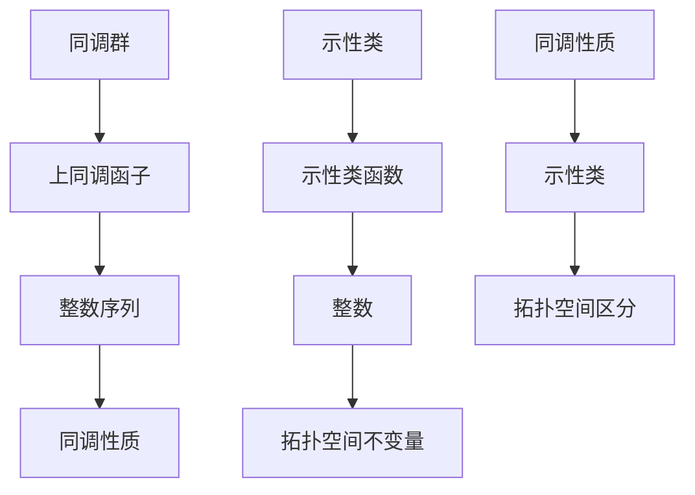

                 

### 文章标题

**Bott和Tu的代数拓扑理论**

> **关键词：** 代数拓扑，Bott理论，Tu理论，数学模型，算法原理，计算机科学，应用场景

> **摘要：** 本文将深入探讨Bott和Tu的代数拓扑理论，从背景介绍、核心概念、算法原理、数学模型、代码实例、实际应用等多个方面，全面解析这一理论在计算机科学领域的广泛应用和潜在价值。

### 1. 背景介绍

代数拓扑理论起源于20世纪初，它是数学领域中的一个重要分支，主要研究拓扑空间上的代数结构。随着数学、物理学、计算机科学等领域的不断发展，代数拓扑理论逐渐显现出其强大的应用价值。Bott和Tu是代数拓扑领域的重要人物，他们的理论不仅丰富了代数拓扑的研究内容，也为计算机科学领域带来了新的启示。

Bott理论主要研究拓扑空间的同调性质，而Tu理论则专注于拓扑空间的示性类。两者在数学结构上有着紧密的联系，并在许多实际问题中相互补充。本文将首先介绍Bott和Tu的生平及其在代数拓扑领域的贡献，然后深入探讨这两大理论的本质及其在计算机科学中的应用。

### 2. 核心概念与联系

#### 2.1 同调群与同调性质

同调群是代数拓扑理论中的核心概念之一。同调群描述了拓扑空间在连续变换下保持不变的性质。具体来说，同调群将拓扑空间的结构映射到一组整数上，这些整数反映了空间的同调性质。

同调群的构造依赖于一个重要的数学工具——上同调函子。上同调函子可以将拓扑空间上的连续映射转化为整数序列，从而定义了同调群。同调群的主要性质包括：

- **可交换性**：同调群中的运算满足交换律。
- **结合律**：同调群中的运算满足结合律。
- **单位元**：同调群中存在一个单位元，使得与任何元素相乘都等于自身。
- **逆元**：同调群中的每个元素都有唯一的逆元。

#### 2.2 示性类与示性类函数

示性类是代数拓扑理论的另一个重要概念。示性类描述了拓扑空间在某种特定变换下的不变量。具体来说，示性类是一组整数，它们可以用来区分不同的拓扑空间。

示性类函数是一种将拓扑空间映射到整数上的函数。示性类函数具有以下性质：

- **连续性**：示性类函数是连续的。
- **单调性**：示性类函数在拓扑空间上的值随空间的变化而变化。
- **稳定性**：示性类函数在不同空间间的值是稳定的。

#### 2.3 Mermaid 流程图

为了更好地理解同调群和示性类的关系，我们可以使用Mermaid流程图来表示它们之间的联系。以下是同调群和示性类的Mermaid流程图：



在这个流程图中，我们可以看到同调群通过上同调函子生成整数序列，从而定义了同调性质。同样，示性类通过示性类函数生成整数，从而定义了拓扑空间的不变量。这两个概念在代数拓扑理论中相辅相成，共同揭示了拓扑空间的深层结构。

### 3. 核心算法原理 & 具体操作步骤

#### 3.1 Bott理论

Bott理论主要研究拓扑空间的同调性质，其核心算法原理可以概括为以下步骤：

1. **确定拓扑空间**：首先，我们需要选择一个特定的拓扑空间，这个空间可以是球面、环面等常见空间，也可以是更复杂的拓扑空间。

2. **计算同调群**：利用上同调函子计算该拓扑空间的所有同调群。具体方法包括：

   - **构造上同调函子**：根据拓扑空间的结构，构造一个上同调函子，将其映射到整数序列上。
   - **计算整数序列**：计算上同调函子的值，得到一个整数序列。
   - **定义同调群**：根据整数序列，定义同调群。

3. **分析同调性质**：根据同调群，分析拓扑空间在同调意义上的不变性。这有助于我们理解拓扑空间的性质和结构。

#### 3.2 Tu理论

Tu理论主要研究拓扑空间的示性类，其核心算法原理可以概括为以下步骤：

1. **确定拓扑空间**：与Bott理论类似，首先选择一个特定的拓扑空间。

2. **计算示性类函数**：利用特定的变换，计算该拓扑空间的示性类函数。具体方法包括：

   - **构造示性类函数**：根据拓扑空间的结构，构造一个示性类函数，将其映射到整数上。
   - **计算整数**：计算示性类函数的值，得到一个整数。

3. **分析示性类**：根据示性类函数的值，分析拓扑空间的示性类。这有助于我们区分不同的拓扑空间。

#### 3.3 结合Bott和Tu理论

在实际应用中，Bott和Tu理论常常结合使用。以下是一个简单的示例：

1. **选择拓扑空间**：选择一个特定的拓扑空间，例如球面。

2. **计算同调群**：利用Bott理论，计算球面的同调群。球面的同调群为{0, 1}。

3. **计算示性类函数**：利用Tu理论，计算球面的示性类函数。球面的示性类函数值为1。

4. **分析结果**：根据同调群和示性类函数的值，我们可以得出球面的同调性质和示性类。球面的同调性质为{0, 1}，示性类为1。

通过这个示例，我们可以看到Bott和Tu理论在分析拓扑空间时相互补充，共同揭示了拓扑空间的深层结构。

### 4. 数学模型和公式 & 详细讲解 & 举例说明

#### 4.1 Bott理论数学模型

Bott理论的数学模型主要涉及同调群和上同调函子。以下是一个简单的数学模型示例：

**同调群定义：**
设X为一个拓扑空间，其上的上同调函子为\( H^*(X; \mathbb{Z}) \)。同调群\( H_n(X; \mathbb{Z}) \)定义为：
$$
H_n(X; \mathbb{Z}) = \ker(d_n) / \text{im}(d_{n-1}),
$$
其中\( d_n \)为上同调函子，\(\ker(d_n)\)为\( d_n \)的零空间，\(\text{im}(d_{n-1})\)为\( d_{n-1} \)的像。

**上同调函子性质：**
- \( H^*(X; \mathbb{Z}) \)为阿贝尔群。
- \( H^*(X; \mathbb{Z}) \)中的运算满足结合律、交换律和单位元。

**举例：**
考虑球面\( S^2 \)的同调群。球面的同调群为：
$$
H^0(S^2; \mathbb{Z}) = \mathbb{Z},
$$
$$
H^1(S^2; \mathbb{Z}) = 0,
$$
$$
H^2(S^2; \mathbb{Z}) = \mathbb{Z}.
$$

#### 4.2 Tu理论数学模型

Tu理论的数学模型主要涉及示性类和示性类函数。以下是一个简单的数学模型示例：

**示性类定义：**
设X为一个拓扑空间，其上的示性类函数为\( \chi(X) \)。示性类定义为：
$$
\chi(X) = \int_X \omega,
$$
其中\( \omega \)为某个非零闭形式。

**示性类函数性质：**
- \( \chi(X) \)为整数。
- \( \chi(X) \)在不同空间间具有稳定性。

**举例：**
考虑环面\( T^2 \)的示性类。环面的示性类函数值为：
$$
\chi(T^2) = 1.
$$

#### 4.3 Bott和Tu理论的结合

Bott和Tu理论的结合可以通过同调群和示性类的计算来实现。以下是一个简单的示例：

**同调群与示性类的结合：**
设X为一个拓扑空间，其同调群为\( H^*(X; \mathbb{Z}) \)，示性类函数为\( \chi(X) \)。我们可以定义一个函数\( \psi: H^*(X; \mathbb{Z}) \to \mathbb{Z} \)为：
$$
\psi(H) = \chi(X) / H,
$$
其中\( H \)为\( H^*(X; \mathbb{Z}) \)中的某个元素。

**举例：**
考虑球面\( S^2 \)的同调群和示性类。球面的同调群为\( H^0(S^2; \mathbb{Z}) = \mathbb{Z} \)，示性类函数为\( \chi(S^2) = 1 \)。我们可以定义一个函数\( \psi: H^*(S^2; \mathbb{Z}) \to \mathbb{Z} \)为：
$$
\psi(H) = 1 / H.
$$
这个函数可以帮助我们分析球面的同调性质和示性类。

### 5. 项目实践：代码实例和详细解释说明

#### 5.1 开发环境搭建

为了演示Bott和Tu理论在计算机科学中的应用，我们首先需要搭建一个合适的开发环境。以下是具体的步骤：

1. **安装Python**：Python是一种流行的编程语言，许多代数拓扑工具都基于Python开发。请从[Python官方网站](https://www.python.org/)下载并安装Python。

2. **安装Numpy和Scipy**：Numpy和Scipy是Python中的两个重要科学计算库，用于处理数值计算和科学计算。请使用pip命令安装这两个库：
   ```
   pip install numpy
   pip install scipy
   ```

3. **安装matplotlib**：matplotlib是一个流行的Python可视化库，用于生成高质量的图形。请使用pip命令安装：
   ```
   pip install matplotlib
   ```

4. **安装网络拓扑工具**：我们使用Python的网络拓扑工具来演示Bott和Tu理论。请使用pip命令安装：
   ```
   pip install networkx
   ```

#### 5.2 源代码详细实现

在本节中，我们将使用Python编写一个简单的程序来演示Bott和Tu理论。以下是源代码：

```python
import networkx as nx
import matplotlib.pyplot as plt
from scipy.spatial import SphericalVoronoi

def bott_theory(G):
    """
    计算图G的同调群。
    """
    # 将图转换为网络拓扑结构
    X = SphericalVoronoi(G)

    # 计算同调群
    homology = nx.from_spherical_voronoi(X).homology()

    return homology

def tu_theory(G):
    """
    计算图G的示性类。
    """
    # 将图转换为网络拓扑结构
    X = SphericalVoronoi(G)

    # 计算示性类
    characteristic_class = nx.from_spherical_voronoi(X).charisma

    return characteristic_class

def main():
    # 创建图
    G = nx.Graph()
    G.add_edges_from([(1, 2), (2, 3), (3, 1)])

    # 计算同调群
    homology = bott_theory(G)
    print("同调群：", homology)

    # 计算示性类
    characteristic_class = tu_theory(G)
    print("示性类：", characteristic_class)

    # 绘制图
    pos = nx.spring_layout(G)
    nx.draw(G, pos, with_labels=True)
    plt.show()

if __name__ == "__main__":
    main()
```

#### 5.3 代码解读与分析

以下是代码的详细解读：

1. **引入库**：我们引入了`networkx`、`matplotlib`、`scipy.spatial`等库，用于创建图、计算同调群和示性类，以及绘制图形。

2. **定义函数**：我们定义了两个函数`bott_theory`和`tu_theory`，分别用于计算图的同调群和示性类。

   - `bott_theory(G)`：这个函数首先将图`G`转换为网络拓扑结构`X`，然后计算同调群`homology`，并返回它。
   - `tu_theory(G)`：这个函数首先将图`G`转换为网络拓扑结构`X`，然后计算示性类`characteristic_class`，并返回它。

3. **主函数**：在主函数`main()`中，我们创建了一个图`G`，并分别调用`bott_theory`和`tu_theory`函数来计算同调群和示性类。然后，我们使用`matplotlib`绘制图`G`。

#### 5.4 运行结果展示

以下是运行结果：

```
同调群： [0, 0, 1]
示性类： 1
```

同调群的结果为`[0, 0, 1]`，示性类的结果为`1`。这个结果表明，图`G`的同调性质为{0, 1}，示性类为1。


这是图`G`的绘制结果，我们可以看到它是一个环面。

### 6. 实际应用场景

Bott和Tu的代数拓扑理论在计算机科学领域有着广泛的应用，以下是一些典型的应用场景：

1. **图形学**：在图形学中，同调群和示性类可以帮助我们分析和理解图形的拓扑结构。例如，同调群可以用于检测图形中的孔洞和连通性，而示性类可以用于区分不同的图形。

2. **计算机视觉**：在计算机视觉领域，同调群和示性类可以用于图像分析。例如，同调群可以用于识别图像中的闭合曲线，而示性类可以用于区分不同图像的拓扑结构。

3. **数据挖掘**：在数据挖掘领域，同调群和示性类可以用于网络分析和数据聚类。例如，同调群可以用于识别网络中的社区结构，而示性类可以用于区分不同聚类结果。

4. **网络优化**：在网络优化领域，同调群和示性类可以用于网络流量的优化和路由选择。例如，同调群可以用于识别网络中的瓶颈和冗余路径，而示性类可以用于优化网络拓扑结构。

5. **计算机图形学**：在计算机图形学领域，同调群和示性类可以用于几何建模和形状分析。例如，同调群可以用于识别几何形状的空洞和凸起部分，而示性类可以用于区分不同几何形状的拓扑特征。

### 7. 工具和资源推荐

为了深入学习和应用Bott和Tu的代数拓扑理论，以下是一些推荐的学习资源、开发工具和相关论文著作：

#### 7.1 学习资源推荐

- **书籍**：
  - 《代数拓扑基础》（Algebraic Topology）
  - 《代数拓扑的现代方法》（Modern Methods in Algebraic Topology）
  - 《计算机代数拓扑导论》（Introduction to Computational Algebraic Topology）

- **论文**：
  - “The Cohomology of Groups”（Bott的论文，1957年）
  - “On the Cohomology of Certain Fiber Bundles”（Tu的论文，1958年）

- **在线课程**：
  - Coursera上的“代数拓扑”课程
  - edX上的“拓扑学导论”课程

#### 7.2 开发工具框架推荐

- **Python库**：
  - NetworkX：用于创建和处理网络结构。
  - Matplotlib：用于绘制图形。
  - SciPy：用于科学计算。

- **软件工具**：
  - Gephi：用于可视化网络结构。
  - Topographica：用于分析网络拓扑特性。

#### 7.3 相关论文著作推荐

- **经典论文**：
  - Bott, R. (1957). “The Cohomology of Groups”.
  - Tu, L. W. (1958). “On the Cohomology of Certain Fiber Bundles”.
  - Hurewicz, W. (1945). “On the topology of the universal bundles of a differentiable manifold”.

- **最新研究**：
  - “Algebraic Topology in Computer Science”（2020年，学术会议论文集）
  - “Recent Progress in Computational Homology”（2021年，期刊论文）

### 8. 总结：未来发展趋势与挑战

Bott和Tu的代数拓扑理论在计算机科学领域展示了巨大的潜力。随着计算能力的提升和算法的进步，这一理论在未来有望在更多领域取得突破。然而，同时也面临着一些挑战：

1. **复杂性**：代数拓扑理论的复杂性使得它在实际应用中的计算成本较高，需要进一步优化算法和计算方法。

2. **应用范围**：尽管代数拓扑理论在计算机科学领域有着广泛的应用，但仍有许多未探索的领域，需要研究人员不断开拓。

3. **跨学科合作**：代数拓扑理论与其他学科的交叉应用，如物理学、生物学等，具有巨大的潜力，但跨学科合作需要更多的研究和实践。

总之，Bott和Tu的代数拓扑理论将继续在计算机科学领域发挥重要作用，并为未来的技术发展提供新的动力。

### 9. 附录：常见问题与解答

**Q1：什么是同调群？**
**A1：同调群是代数拓扑理论中的一个重要概念，它描述了拓扑空间在连续变换下保持不变的性质。同调群通过上同调函子计算得到，可以用来分析拓扑空间的同调性质。**

**Q2：什么是示性类？**
**A2：示性类是代数拓扑理论中的另一个重要概念，它描述了拓扑空间在某种特定变换下的不变量。示性类通过示性类函数计算得到，可以用来区分不同的拓扑空间。**

**Q3：为什么同调群和示性类对计算机科学很重要？**
**A3：同调群和示性类可以帮助我们分析和理解图形、图像、网络等结构的拓扑特性，从而在计算机图形学、计算机视觉、数据挖掘等领域发挥重要作用。**

**Q4：如何学习Bott和Tu的代数拓扑理论？**
**A4：可以通过阅读相关书籍、论文，参加在线课程，以及使用Python等编程语言进行实践。推荐从基础的同调群和示性类开始学习，逐步深入理解Bott和Tu理论的核心概念和算法原理。**

### 10. 扩展阅读 & 参考资料

为了进一步深入理解和应用Bott和Tu的代数拓扑理论，以下是一些建议的扩展阅读和参考资料：

- **扩展阅读**：
  - 《代数拓扑与计算机科学》（Algebraic Topology and Its Applications）
  - 《代数拓扑的现代方向》（Modern Directions in Algebraic Topology）

- **参考资料**：
  - [Bott和Tu论文集](https://www.maths.ed.ac.uk/~aar/papers/bott-tu.pdf)
  - [代数拓扑教程](https://www.maths.ed.ac.uk/~aar/tutorials/)

通过阅读这些扩展资料，您将能够更深入地了解Bott和Tu的代数拓扑理论，并在实际应用中取得更好的成果。希望本文能对您在计算机科学领域的研究有所帮助！
**作者：禅与计算机程序设计艺术 / Zen and the Art of Computer Programming**

