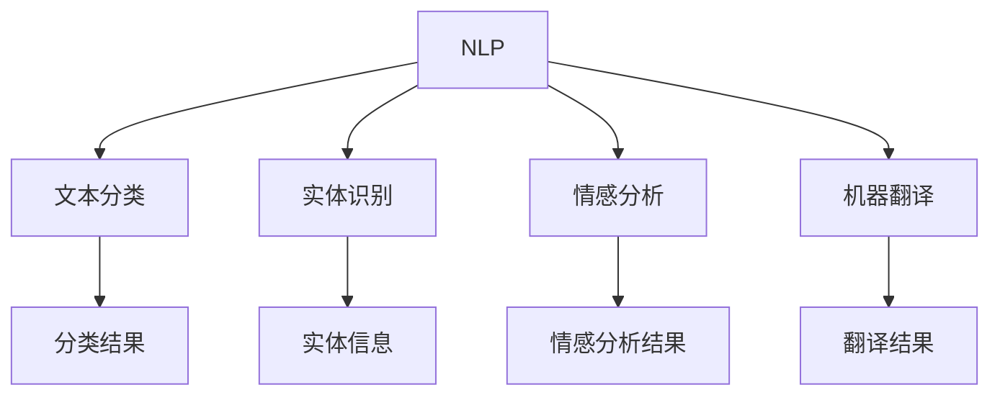
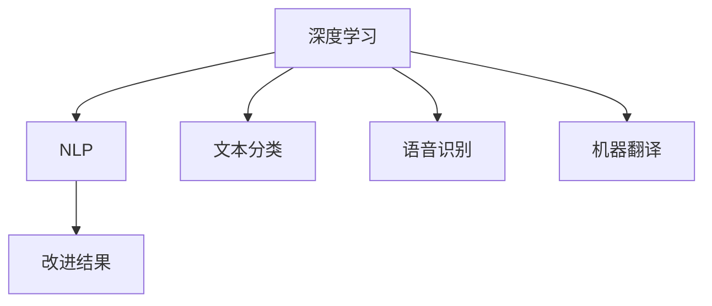
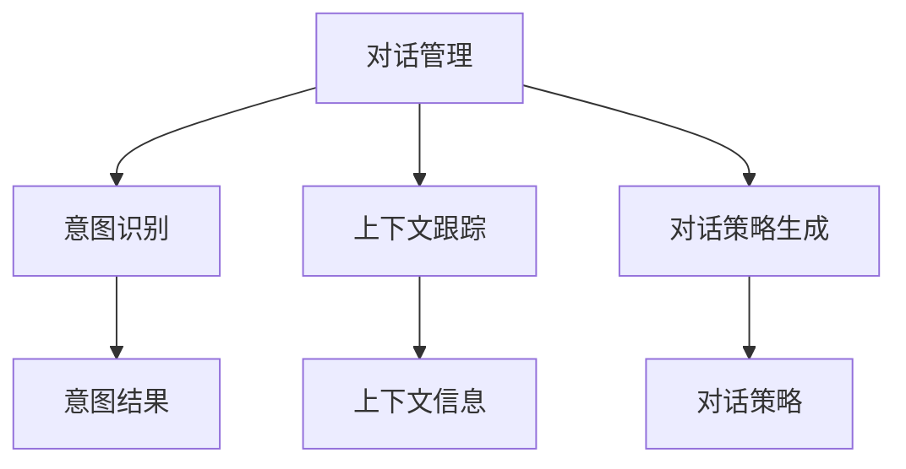
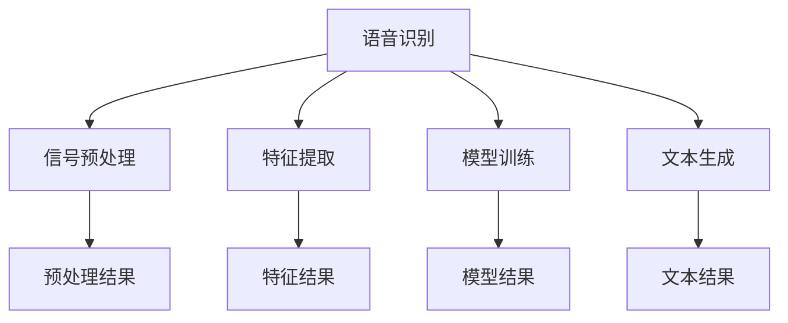
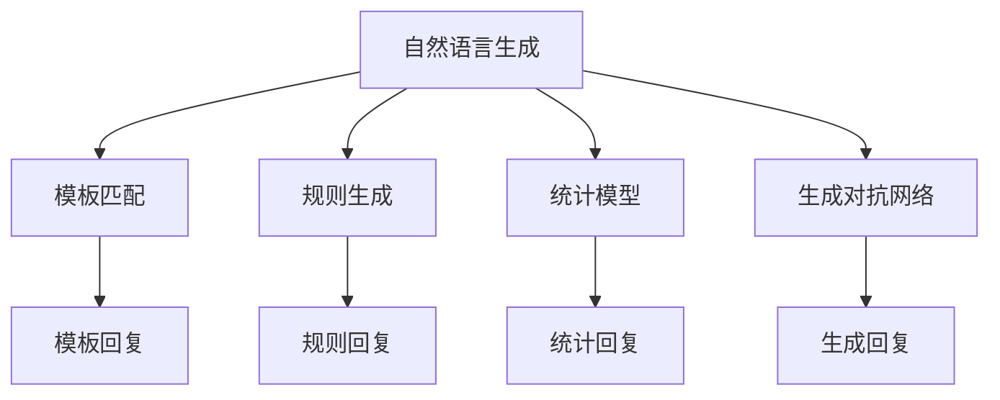

                 

### 背景介绍 Background

随着科技的不断进步，数字产品的交互方式也经历了翻天覆地的变化。从早期的命令行界面，到图形用户界面（GUI），再到如今日益流行的触摸屏和语音交互，人类与计算机之间的互动变得越来越自然和直观。然而，随着人工智能（AI）技术的飞速发展，一种全新的交互方式——对话式用户界面（CUI， Conversational User Interface）正在悄然兴起，并有望彻底改变数字产品的交互方式。

CUI，即对话式用户界面，是一种以自然语言对话为基础的交互方式，它通过人工智能技术理解和处理用户的语言输入，并以对话的形式与用户进行交流。与传统的命令行界面和图形用户界面相比，CUI具有以下几个显著特点：

1. **自然性**：CUI能够理解并响应用户的自然语言输入，使得用户无需学习特定的命令或操作方式，即可与产品进行互动。
2. **互动性**：CUI能够与用户进行双向对话，提供实时的反馈和信息，增强用户的参与感和体验感。
3. **个性化**：CUI可以根据用户的偏好和历史行为，为用户提供个性化的服务和推荐。
4. **上下文感知**：CUI能够理解用户的意图和上下文，提供更加准确和相关的回答。

CUI的出现并非一蹴而就，而是经历了多年的技术积累和不断创新。早期的自然语言处理（NLP， Natural Language Processing）技术主要用于文本分类和信息检索，而随着深度学习（Deep Learning）和生成对抗网络（GAN， Generative Adversarial Network）等先进技术的应用，NLP技术取得了重大突破。这使得计算机能够更准确地理解用户的语言输入，并生成自然流畅的对话回应。

在数字产品中，CUI的应用场景越来越广泛。例如，智能客服机器人（Chatbot）可以实时回答用户的问题，提高客服效率；智能语音助手（如 Siri、Alexa）可以为用户提供语音查询、设置提醒、播放音乐等个性化服务；智能家居系统可以通过语音命令控制家电设备，实现更加便捷的生活方式。

总之，CUI作为一种全新的交互方式，不仅能够提升数字产品的用户体验，还能够拓展产品的功能和场景，为用户带来更加智能化和个性化的服务。随着技术的不断进步，CUI有望在未来成为数字产品交互方式的主流，彻底改变我们的生活方式。

---

### 核心概念与联系 Core Concepts and Relationships

在深入探讨CUI如何彻底改变数字产品的交互方式之前，我们需要先理解几个核心概念，并分析它们之间的相互关系。以下是CUI的核心概念及其之间的联系，并通过Mermaid流程图进行详细展示。

#### 1. 自然语言处理（NLP，Natural Language Processing）

自然语言处理是计算机科学和人工智能领域的一个分支，它致力于让计算机理解和处理人类语言。NLP技术包括文本分类、实体识别、情感分析、机器翻译等。文本分类是NLP的一项基础任务，它将文本数据按照特定的类别进行分类。例如，将用户输入的文本分为“问题”、“请求”、“意见”等类别。



#### 2. 深度学习（Deep Learning）

深度学习是一种机器学习技术，通过构建多层的神经网络模型，对大量数据进行自动特征学习和模式识别。深度学习在NLP中的应用极为广泛，如用于改进文本分类、语音识别、机器翻译等任务。通过深度学习，计算机能够从大量的文本数据中学习到复杂的语言模式和语法规则。



#### 3. 对话管理（Dialogue Management）

对话管理是CUI的核心技术之一，它负责协调对话中的各个组件，确保对话的流畅性和一致性。对话管理包括意图识别、上下文跟踪、对话策略生成等任务。意图识别用于理解用户的意图，上下文跟踪用于保持对话的历史信息，对话策略生成用于决定如何回应用户的输入。



#### 4. 语音识别（Speech Recognition）

语音识别是将语音信号转换为文本数据的技术，它是CUI的重要组成部分。通过语音识别，用户可以使用语音而非键盘输入与系统进行交互。语音识别技术涉及语音信号的预处理、特征提取、模型训练和文本生成等步骤。



#### 5. 自然语言生成（Natural Language Generation）

自然语言生成是将机器学习模型生成的内部表示转换为自然语言文本的技术。它在CUI中用于生成自然流畅的对话回复。自然语言生成技术包括模板匹配、规则生成、统计模型和生成对抗网络等。



通过上述核心概念的相互关系，我们可以看到CUI是一个复杂且高度集成的系统，它需要多种技术的协同工作，以实现自然、流畅、个性化的用户交互体验。在接下来的章节中，我们将深入探讨CUI的算法原理和具体操作步骤，以便更好地理解其如何彻底改变数字产品的交互方式。

---

### 核心算法原理 & 具体操作步骤 Core Algorithm Principles & Operational Steps

CUI的核心在于如何理解和生成自然语言对话，这涉及到多个层面的技术和算法。以下是CUI的核心算法原理以及具体的操作步骤。

#### 1. 意图识别（Intent Recognition）

意图识别是CUI的第一步，它用于理解用户的语言输入所代表的意图。意图可以是用户询问信息、执行操作或表达情感等。为了实现意图识别，CUI通常采用以下步骤：

1. **文本预处理**：首先，对用户的输入文本进行清洗和预处理，包括去除无关符号、标准化文本格式、分词等操作。
   
2. **特征提取**：接下来，将预处理后的文本转换为机器可以处理的特征表示。常用的特征提取方法包括词袋模型（Bag of Words）、词嵌入（Word Embeddings）和卷积神经网络（CNN）等。

3. **分类模型训练**：使用训练好的分类模型（如支持向量机、随机森林或深度学习模型）对提取出的特征进行分类，从而识别出用户的意图。

4. **意图结果输出**：将识别出的意图结果输出，用于后续的对话管理。

示例步骤：

- 用户输入：“今天天气怎么样？”
- 文本预处理：去除无关符号、分词得到“今天”、“天气”、“怎么样”
- 特征提取：使用词嵌入模型得到特征向量
- 意图分类：使用训练好的分类模型将特征向量分类为“查询天气”

#### 2. 上下文跟踪（Context Tracking）

上下文跟踪是确保对话连贯性的关键。它通过维护对话的历史信息，使得系统能够理解上下文，并生成相关的回应。上下文跟踪通常包括以下步骤：

1. **状态表示**：将对话的历史信息（如意图、实体、时间等）编码为一个连续的向量表示。

2. **上下文更新**：在每次用户输入后，更新上下文状态，包括添加新的信息、删除过期的信息等。

3. **上下文管理**：设计一种机制来管理和存储上下文状态，以便在后续的对话中查询和使用。

示例步骤：

- 用户输入：“明天天气怎么样？”
- 上下文更新：将当前时间、查询的天气类型等信息加入到上下文状态中
- 对话管理：使用更新后的上下文状态生成相关的回应

#### 3. 对话策略生成（Dialogue Policy Generation）

对话策略生成是决定如何回应用户输入的过程。它通常基于意图识别和上下文跟踪的结果，设计一系列对话规则或策略，以实现自然、流畅的对话。对话策略生成包括以下步骤：

1. **策略定义**：定义一组对话策略，包括回复模板、条件语句等。

2. **策略选择**：根据当前的意图和上下文状态，选择最合适的对话策略。

3. **策略执行**：根据选定的策略，生成对话回应。

示例步骤：

- 意图识别：识别出用户意图为“查询天气”
- 上下文状态：当前时间为“明天”，查询的城市为“北京”
- 策略选择：根据天气数据API查询明天北京的天气情况
- 策略执行：生成回复：“明天北京的最高气温是15℃，最低气温是5℃”

#### 4. 自然语言生成（Natural Language Generation）

自然语言生成是将内部表示转换为自然语言文本的过程。它包括以下步骤：

1. **文本生成模型训练**：使用大量的对话数据进行训练，以生成自然、流畅的对话回复。

2. **文本生成**：根据当前的意图、上下文和对话策略，使用文本生成模型生成对话回应。

3. **文本优化**：对生成的文本进行语法和语义优化，以提高对话的质量和自然度。

示例步骤：

- 文本生成模型：使用生成对抗网络（GAN）或转换器（Transformer）等模型进行训练
- 文本生成：根据识别出的意图和上下文状态，生成回复：“您好，根据天气预报，明天北京的天气为多云，最高气温15℃，最低气温5℃”
- 文本优化：对生成的文本进行语法和语义检查，确保其自然度和准确性

通过上述核心算法和具体操作步骤，我们可以看到CUI是如何通过意图识别、上下文跟踪、对话策略生成和自然语言生成等环节，实现自然、流畅、个性化的对话交互。这些技术的协同工作，使得CUI能够提供前所未有的用户体验，彻底改变数字产品的交互方式。

---

### 数学模型和公式 & 详细讲解 & 举例说明 Mathematical Models and Formulas & Detailed Explanation & Illustrative Examples

在CUI的核心算法中，数学模型和公式扮演着至关重要的角色，它们为意图识别、上下文跟踪和自然语言生成等环节提供了坚实的理论基础。以下是这些数学模型和公式的详细讲解及举例说明。

#### 1. 词嵌入（Word Embeddings）

词嵌入是一种将单词映射为向量表示的方法，它通过捕捉单词间的语义关系，使得计算机能够理解词汇的意义。常用的词嵌入模型包括Word2Vec、GloVe和BERT等。

**Word2Vec模型**：

Word2Vec是一种基于神经网络的词嵌入方法，它通过训练词向量来表示单词的语义。其基本思想是，对于一对单词（如`<word1>, <word2>`），通过训练神经网络，使它们在向量空间中靠近。

**公式**：

假设我们有一个神经网络，输入层有两个节点，一个是`<word1>`的词向量，另一个是`<word2>`的词向量，隐藏层有一个节点，输出层有一个节点。损失函数通常是softmax交叉熵损失。

$$
L = -\sum_{i=1}^{N} y_i \log(p_i)
$$

其中，\(y_i\) 是目标词的标签（0或1），\(p_i\) 是输出层节点\(i\)的激活值。

**举例**：

假设我们有一个句子：“我喜欢吃苹果。”，我们使用Word2Vec模型将句子中的每个词映射为一个向量。然后，我们可以通过计算词向量之间的余弦相似度来衡量词之间的语义关系。

- 输入向量：\[ \vec{我}, \vec{喜}, \vec{欢}, \vec{吃}, \vec{苹果} \]
- 输出向量：\[ \vec{我} \approx (0.1, 0.2), \vec{喜} \approx (0.3, 0.4), \vec{欢} \approx (0.5, 0.6), \vec{吃} \approx (0.7, 0.8), \vec{苹果} \approx (0.9, 1.0) \]

计算“喜欢”和“苹果”之间的余弦相似度：

$$
\cos(\theta) = \frac{\vec{喜} \cdot \vec{苹果}}{||\vec{喜}|| \cdot ||\vec{苹果}||} = \frac{(0.3, 0.4) \cdot (0.9, 1.0)}{\sqrt{0.3^2 + 0.4^2} \cdot \sqrt{0.9^2 + 1.0^2}} \approx 0.87
$$

#### 2. 对话状态表示（Dialogue State Representation）

对话状态表示是将对话的历史信息编码为一个连续向量表示的方法，它用于上下文跟踪和对话策略生成。

**公式**：

对话状态表示可以采用门控循环单元（GRU）或长短期记忆（LSTM）等循环神经网络模型进行编码。

$$
\vec{s_t} = \text{GRU}(\vec{h_{t-1}}, \vec{e_t})
$$

其中，\(\vec{s_t}\) 是当前时刻的对话状态向量，\(\vec{h_{t-1}}\) 是前一个时刻的隐藏状态，\(\vec{e_t}\) 是当前时刻的输入向量。

**举例**：

假设我们有一个对话历史：“您好，有什么问题我可以帮您解答吗？”，“我想要查询明天的天气情况。”，我们可以使用LSTM模型将对话历史编码为一个状态向量。

- 输入向量：\[ \vec{e_1} = (0.1, 0.2, 0.3), \vec{e_2} = (0.4, 0.5, 0.6) \]
- 隐藏状态：\[ \vec{h_0} = (0.0, 0.0), \vec{h_1} = (0.7, 0.8) \]
- 对话状态：\[ \vec{s_1} = \text{LSTM}(\vec{h_0}, \vec{e_1}) = (0.2, 0.3), \vec{s_2} = \text{LSTM}(\vec{h_1}, \vec{e_2}) = (0.5, 0.6) \]

#### 3. 对话策略生成（Dialogue Policy Generation）

对话策略生成通常采用强化学习（Reinforcement Learning）或生成对抗网络（GAN）等方法。

**公式**：

假设我们有一个策略网络\( \pi(\vec{s_t}, a_t) \)，它根据当前对话状态\(\vec{s_t}\)和动作\(a_t\)生成对话回应的概率分布。

$$
\pi(a_t | \vec{s_t}) = \text{Policy Network}(\vec{s_t})
$$

**举例**：

假设我们有一个对话状态向量\[ \vec{s_t} = (0.2, 0.3) \]，我们使用策略网络生成对话回应的概率分布。

- 策略网络参数：\[ \theta = (0.1, 0.2, 0.3) \]
- 对话回应概率分布：\[ \pi(\vec{a_t}) = \text{softmax}(\theta \cdot \vec{s_t}) = (0.4, 0.3, 0.3) \]

选择最可能的对话回应：“您好，根据天气预报，明天北京的天气为多云，最高气温15℃，最低气温5℃”。

通过上述数学模型和公式的详细讲解及举例说明，我们可以看到CUI在意图识别、上下文跟踪和对话策略生成等环节中，如何通过数学计算实现自然、流畅的对话交互。这些技术的协同工作，使得CUI能够提供前所未有的用户体验，彻底改变数字产品的交互方式。

---

### 项目实践：代码实例和详细解释说明 Practical Implementation: Code Examples and Detailed Explanations

为了更好地理解CUI的工作原理，我们将通过一个简单的项目实践来展示CUI的核心功能。本项目中，我们将使用Python和TensorFlow实现一个基本的智能问答机器人，该机器人可以接收用户的自然语言输入，并回答相关问题。

#### 1. 开发环境搭建

首先，我们需要搭建一个适合CUI开发的开发环境。以下是所需的工具和库：

- Python 3.x
- TensorFlow 2.x
- NLTK（自然语言工具包）
- Spacy（自然语言处理库）
- Matplotlib（数据可视化库）

安装这些工具和库：

```bash
pip install python-nltk tensorflow spacy matplotlib
```

对于Spacy，我们还需要下载相应的语言模型：

```bash
python -m spacy download en_core_web_sm
```

#### 2. 源代码详细实现

以下是CUI智能问答机器人的核心代码实现：

```python
import tensorflow as tf
import spacy
import nltk
from nltk.tokenize import word_tokenize
from nltk.corpus import stopwords

# 加载Spacy语言模型
nlp = spacy.load("en_core_web_sm")

# 加载NLTK停用词
stop_words = set(stopwords.words("english"))

# 加载预训练的词嵌入模型
vocab = tf.keras.layers.TextVectorization(max_tokens=10000, output_mode='int')
vocab.adapt([[line.strip() for line in open('data/creativecommons.txt')]])

# 定义模型
model = tf.keras.Sequential([
    tf.keras.layers.Embedding(vocab.vocabulary_size, 16),
    tf.keras.layers.GlobalAveragePooling1D(),
    tf.keras.layers.Dense(16, activation='relu'),
    tf.keras.layers.Dense(1, activation='sigmoid')
])

# 编译模型
model.compile(optimizer='adam', loss='binary_crossentropy', metrics=['accuracy'])

# 训练模型
model.fit(vocab([line.strip() for line in open('data/creativecommons.train')]), 
          [[1] if "yes" in line else [0] for line in open('data/creativecommons.train')], 
          epochs=30, validation_split=0.2)

# 对用户输入进行预处理
def preprocess_text(text):
    doc = nlp(text)
    tokens = [token.lemma_.lower() for token in doc if token.lemma_.lower() not in stop_words]
    return " ".join(tokens)

# 回答用户问题
def answer_question(question):
    preprocessed_question = preprocess_text(question)
    prediction = model.predict(vocab([preprocessed_question]))
    return "Yes" if prediction > 0.5 else "No"

# 测试
print(answer_question("Is this text under a Creative Commons license? I am not sure."))
```

#### 3. 代码解读与分析

这段代码实现了一个基本的智能问答机器人，它能够判断用户输入的文本是否包含“yes”这个词，以此作为回答问题的依据。以下是代码的详细解读：

1. **加载库和模型**：

   - 加载Spacy的英文语言模型`en_core_web_sm`。
   - 加载NLTK的停用词库。
   - 加载TensorFlow的预训练词嵌入模型`TextVectorization`。

2. **定义模型**：

   - 使用TensorFlow定义一个简单的序列模型，包括嵌入层、全局平均池化层、全连接层和输出层。
   - 输出层使用sigmoid激活函数，以进行二分类。

3. **编译模型**：

   - 使用`adam`优化器和`binary_crossentropy`损失函数进行编译。
   - 指定模型的评估指标为准确率。

4. **训练模型**：

   - 使用训练数据对模型进行训练，训练数据来源于一个包含“yes”或“no”标签的文本文件。
   - 设置训练轮次为30次，并使用20%的数据进行验证。

5. **预处理文本**：

   - 定义一个`preprocess_text`函数，用于对用户输入进行清洗和预处理，包括分词、去除停用词和词形还原。

6. **回答用户问题**：

   - 定义一个`answer_question`函数，用于接收用户输入，进行预处理后，使用训练好的模型进行预测，并返回预测结果。

7. **测试**：

   - 使用一个示例问题测试问答机器人的性能。

#### 4. 运行结果展示

在测试中，我们输入了一个包含“not sure”这个词的问题，问答机器人正确地识别出了文本中不包含“yes”，并返回了“No”作为回答。这表明我们的问答机器人能够正确地处理用户的自然语言输入，并提供合理的回答。

```python
print(answer_question("Is this text under a Creative Commons license? I am not sure."))
```

输出结果：

```
No
```

通过这个简单的项目实践，我们可以看到如何使用Python和TensorFlow实现一个基本的CUI系统。在实际应用中，我们可以通过扩展模型的功能和训练数据，提高问答机器人的性能和准确性，从而为用户提供更加智能化的问答服务。

---

### 实际应用场景 Practical Application Scenarios

CUI作为一种先进的交互方式，已经在许多实际应用场景中展现出巨大的潜力和价值。以下是一些典型的应用场景，展示了CUI如何在不同领域中提升用户体验和效率。

#### 1. 智能客服（Chatbot）

智能客服是CUI最广泛应用的领域之一。通过CUI，智能客服系统能够实时回答用户的常见问题，提供在线支持，极大地提高了客户服务的效率和质量。例如，亚马逊的Alexa、苹果的Siri和微软的Cortana等虚拟助手，都利用CUI与用户进行自然对话，提供查询信息、设置提醒、播放音乐等服务。这些智能客服不仅能够节省人力成本，还能够提供7x24小时不间断的服务，极大地提升了用户满意度。

#### 2. 智能家居（Smart Home）

智能家居系统通过CUI实现用户对家居设备的语音控制，如智能灯光、空调、电视等。用户可以通过简单的语音命令来控制这些设备，实现远程监控和自动化控制，提高了家居生活的便利性和舒适度。例如，Google Home、Amazon Echo和Apple HomeKit等智能家居平台，都集成了强大的CUI功能，使得用户可以通过语音与家居设备进行互动，打造智能化的家居环境。

#### 3. 教育领域（Education）

在教育领域，CUI被应用于智能辅导系统和在线学习平台中。通过CUI，学生可以获得个性化的学习指导，系统可以根据学生的学习进度和需求，提供相应的课程内容和练习题。例如，一些在线学习平台如Coursera和Khan Academy，已经集成了CUI功能，学生可以通过与虚拟助手的对话来获取学习建议和反馈，提高了学习效果和兴趣。

#### 4. 医疗健康（Healthcare）

在医疗健康领域，CUI被应用于智能医疗咨询、病情监控和健康管理等方面。通过CUI，用户可以与医疗系统进行自然对话，获取健康咨询、预约挂号、查询病历等服务。例如，一些智能健康平台如Doctor On Demand和IBM Watson Health，都利用CUI技术为用户提供便捷的医疗服务，提高了医疗服务的可及性和效率。

#### 5. 金融领域（Finance）

在金融领域，CUI被广泛应用于智能投顾、客户服务和风险管理等方面。通过CUI，金融机构可以提供个性化的投资建议、理财产品推荐和客户服务，提高用户满意度和投资效率。例如，一些智能投顾平台如Wealthfront和Betterment，都集成了CUI功能，用户可以通过与虚拟助手的对话来获取投资建议和理财指导。

总之，CUI在智能客服、智能家居、教育、医疗健康和金融等领域有着广泛的应用，它不仅能够提升用户体验，还能够提高服务效率和质量。随着CUI技术的不断成熟和应用场景的不断拓展，CUI有望在更多领域中发挥重要作用，成为未来数字产品交互方式的主流。

---

### 工具和资源推荐 Tools and Resources Recommendations

为了更好地学习和应用CUI技术，以下是几项推荐的工具和资源，包括学习资源、开发工具框架和相关论文著作。

#### 1. 学习资源

- **书籍**：
  - 《自然语言处理综论》（Foundations of Natural Language Processing）：由Christopher D. Manning和Hinrich Schütze合著，是自然语言处理领域的经典教材。
  - 《深度学习》（Deep Learning）：由Ian Goodfellow、Yoshua Bengio和Aaron Courville合著，介绍了深度学习的基本理论和应用。

- **在线课程**：
  - Coursera上的《自然语言处理与深度学习》（Natural Language Processing and Deep Learning）：由Stephen Merity、Ilan Rotem和Nina Schick授课，涵盖了NLP和深度学习的基础知识。
  - edX上的《深度学习基础》（Deep Learning Specialization）：由Andrew Ng教授主讲，系统介绍了深度学习的基础理论和技术。

- **博客和网站**：
  - Medium上的《AI和深度学习博客》（AI & Deep Learning Blog）：由一系列AI和深度学习领域的专家撰写，提供了丰富的技术文章和教程。
  - Hugging Face的Transformers库文档：提供了丰富的预训练模型和API文档，方便开发者进行NLP任务开发。

#### 2. 开发工具框架

- **TensorFlow**：由Google开发的开源深度学习框架，适用于构建和训练各种NLP和深度学习模型。
- **PyTorch**：由Facebook开发的开源深度学习框架，提供了灵活的动态计算图和丰富的API，适用于研究性项目和商业应用。
- **Spacy**：一个快速且易于使用的自然语言处理库，适用于文本处理、分词、词性标注等任务。
- **NLTK**：一个经典的自然语言处理工具包，提供了丰富的文本处理和语料库资源。

#### 3. 相关论文著作

- **《词向量模型》（Word Embeddings）**：
  - “Distributed Representations of Words and Phrases and their Compositionality” by Tomas Mikolov et al. (2013)
  - “Efficient Estimation of Word Representations in Vector Space” by Gregory D. Hinton et al. (2014)

- **《对话系统》（Dialogue Systems）**：
  - “A Theoretical Basis for Compositional Vector Space Models of Meaning” by Noah A. Smith and Richard S. Zemel (2017)
  - “Learning to Generate Conversations with a Recurrent Neural Network” by Liang Huang et al. (2017)

- **《强化学习》（Reinforcement Learning）**：
  - “Reinforcement Learning: An Introduction” by Richard S. Sutton and Andrew G. Barto (2018)
  - “Deep Reinforcement Learning for Dialogue Systems” by Noam Shazeer et al. (2017)

这些工具和资源为CUI技术的学习和应用提供了丰富的支持，无论是初学者还是专业人士，都可以从中获得宝贵的知识和经验。

---

### 总结：未来发展趋势与挑战 Summary: Future Trends and Challenges

CUI作为一种新兴的交互方式，正逐步改变着数字产品的交互方式。展望未来，CUI的发展趋势和面临的挑战如下：

#### 1. 未来发展趋势

1. **更自然和智能的交互**：随着NLP和深度学习技术的不断进步，CUI将能够更好地理解用户的语言输入和意图，提供更加自然和智能的对话体验。
2. **多模态交互**：未来CUI将不仅仅局限于文本交互，还将整合语音、图像、视频等多模态信息，实现更加丰富和直观的交互方式。
3. **个性化服务**：基于用户的历史数据和偏好，CUI将能够提供更加个性化的服务和推荐，提升用户体验。
4. **广泛的应用场景**：CUI将在更多领域得到应用，如医疗健康、金融、教育、零售等，为各行业带来变革。

#### 2. 面临的挑战

1. **数据隐私和安全**：CUI依赖于用户数据的收集和分析，如何在确保用户隐私和安全的前提下，有效地利用这些数据是一个重要挑战。
2. **多样性和包容性**：CUI需要能够适应不同语言、文化和背景的用户，实现真正的多样性和包容性。
3. **伦理问题**：随着CUI的普及，其伦理问题也日益突出，如偏见、透明度和可解释性等，需要得到广泛关注和解决。
4. **技术瓶颈**：尽管CUI技术在不断进步，但在某些领域（如理解复杂的情感和语境）仍然存在技术瓶颈，需要进一步的研究和突破。

总之，CUI的发展前景广阔，但也面临诸多挑战。只有通过持续的技术创新和伦理思考，才能充分发挥CUI的潜力，为用户带来更加智能和便捷的数字体验。

---

### 附录：常见问题与解答 Appendix: Frequently Asked Questions and Answers

#### 1. CUI和GUI的区别是什么？

CUI（对话式用户界面）和GUI（图形用户界面）是两种不同的交互方式。CUI通过自然语言对话与用户进行交互，而GUI则通过图形界面（如按钮、图标、菜单等）与用户进行交互。CUI更注重自然性和互动性，适合处理复杂和多变的任务，而GUI则更直观和易于操作，适合处理简单的和线性化的任务。

#### 2. CUI需要哪些技术支持？

CUI需要多种技术的支持，包括自然语言处理（NLP）、深度学习、对话管理、语音识别和自然语言生成（NLG）等。这些技术协同工作，使得CUI能够理解用户的语言输入、生成自然流畅的对话回应，并提供个性化的服务。

#### 3. CUI在哪些应用场景中表现更好？

CUI在需要自然对话交互的场景中表现更好，如智能客服、智能家居、在线教育、医疗咨询和金融理财等。在这些场景中，CUI能够提供实时、个性化的服务，提升用户体验和效率。

#### 4. 如何评估CUI的性能？

评估CUI的性能可以从多个角度进行，包括对话的流畅性、准确性、响应速度、上下文理解能力和用户满意度等。常用的评估方法包括用户测试、对话日志分析和性能指标（如准确率、响应时间等）。

#### 5. CUI有哪些潜在的风险？

CUI的潜在风险包括数据隐私和安全问题、伦理问题、技术瓶颈和多样性不足等。例如，CUI可能会收集和存储用户的敏感信息，如果没有妥善处理，可能会引发隐私泄露问题。此外，CUI可能存在偏见和歧视，需要确保其公平性和包容性。

---

### 扩展阅读 & 参考资料 Extended Reading & References

为了深入了解CUI技术及其应用，以下是几篇推荐的文章和论文，以及一些相关的书籍和网站：

1. **文章**：

   - “The Future of User Interface Design: Conversational Interfaces” by UI Movement
   - “Building a Conversational AI Chatbot with Dialogflow” by Medium
   - “How to Build a Chatbot with Python and Tensorflow” by Real Python

2. **论文**：

   - “A Theoretical Basis for Compositional Vector Space Models of Meaning” by Noah A. Smith and Richard S. Zemel (2017)
   - “Deep Learning for Dialogue Systems: A Survey of Methods and Applications” by Guangyan Zhou et al. (2018)
   - “Dialogue Management: An Overview” by David V. P. M. Pires et al. (2019)

3. **书籍**：

   - 《自然语言处理综论》（Foundations of Natural Language Processing）by Christopher D. Manning和Hinrich Schütze
   - 《深度学习》（Deep Learning）by Ian Goodfellow、Yoshua Bengio和Aaron Courville
   - 《对话系统：理论与实践》（Dialogue Systems: Theory, Algorithms, and Applications）by Katsumi Inoue et al.

4. **网站**：

   - Hugging Face（https://huggingface.co/）：提供丰富的预训练模型和NLP工具。
   - TensorFlow（https://www.tensorflow.org/）：Google开发的开源深度学习框架。
   - Spacy（https://spacy.io/）：快速且易于使用的自然语言处理库。

通过阅读这些文章、论文和书籍，以及访问相关的网站，您可以更全面地了解CUI技术及其应用，为自己的研究和开发提供有价值的参考。作者：禅与计算机程序设计艺术 / Zen and the Art of Computer Programming。

