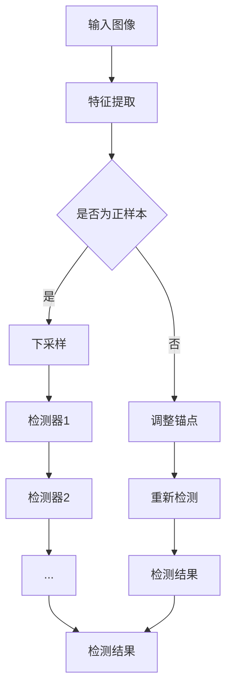
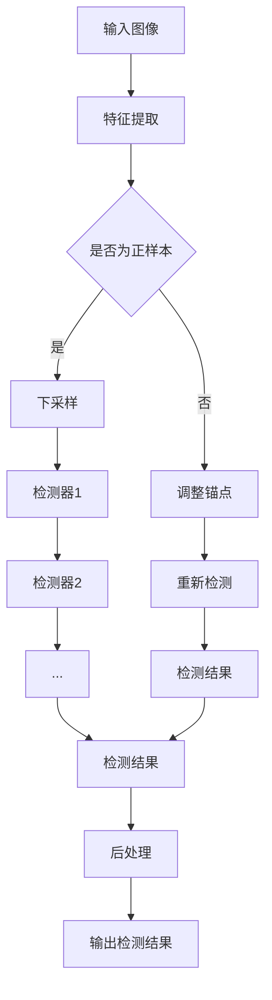

                 

### 文章标题

《Cascade R-CNN原理与代码实例讲解》

> 关键词：目标检测、Cascade R-CNN、深度学习、计算机视觉

> 摘要：本文旨在详细讲解Cascade R-CNN的目标检测算法原理，并通过实际代码实例深入剖析其实现过程。文章将涵盖算法的背景介绍、核心概念与联系、算法原理与操作步骤、数学模型与公式、代码实例及其解读，以及实际应用场景等多个方面，帮助读者全面理解并掌握这一先进的目标检测技术。

### 1. 背景介绍

目标检测是计算机视觉领域的一个重要研究方向，它旨在从图像或视频中准确识别并定位出感兴趣的目标对象。随着深度学习技术的快速发展，目标检测方法也在不断演进和优化。传统的目标检测方法如Haar特征分类器、积分图（Integral Graph）等，虽然在某些场景下能够取得一定的效果，但受限于计算能力和模型复杂度，难以满足实际应用的需求。

为了提高检测精度和速度，研究人员提出了许多基于深度学习的目标检测算法，如R-CNN、Fast R-CNN、Faster R-CNN等。然而，这些算法在处理大量目标时，仍存在一些问题，如检测速度慢、误检率高、难以处理遮挡目标等。因此，如何进一步提高目标检测算法的性能和鲁棒性，成为了当前研究的热点。

Cascade R-CNN作为一种基于深度学习的目标检测算法，通过引入多级级联检测机制，有效提高了检测精度和速度。它不仅在各类公开数据集上取得了优异的性能，而且在实际应用中表现出良好的效果。本文将围绕Cascade R-CNN的原理、实现和实际应用，进行深入讲解。

### 2. 核心概念与联系

#### 2.1 Cascade R-CNN算法概述

Cascade R-CNN是一种基于深度学习的目标检测算法，它结合了Region-based和Detection-based两种目标检测方法的优势。具体来说，Cascade R-CNN采用RPN（Region Proposal Network）生成候选区域，再通过多级级联检测器对候选区域进行分类和定位。这种结构既保证了检测精度，又提高了检测速度。

#### 2.2 区域建议网络（RPN）

RPN是Cascade R-CNN的关键组成部分，其主要作用是从输入图像中生成高质量的候选区域。RPN的核心思想是使用滑动窗口（anchor）与图像特征进行卷积运算，从而提取图像中可能包含目标的位置信息。

#### 2.3 多级级联检测器

多级级联检测器是Cascade R-CNN的另一大特色。它将检测过程划分为多个级联阶段，每个阶段都由多个检测器组成。每个检测器对输入的候选区域进行分类和定位，只有当多个检测器都判断为正样本时，才认为该区域为最终的目标区域。

#### 2.4 Mermaid 流程图

以下是一个简化的Mermaid流程图，展示了Cascade R-CNN的核心概念与联系：



### 3. 核心算法原理 & 具体操作步骤

#### 3.1 特征提取

特征提取是Cascade R-CNN的基础。输入图像首先通过卷积神经网络（如ResNet、VGG等）提取特征图。特征图包含了图像中不同区域的高维特征信息，为后续的目标检测提供了重要的数据支持。

#### 3.2 区域建议网络（RPN）

RPN基于特征图生成候选区域。具体操作步骤如下：

1. **生成锚点（anchor）**：在特征图上以一定间隔滑动窗口，生成多个锚点。锚点的大小和比例根据输入图像的尺寸和特征图的分辨率进行调整。

2. **计算锚点特征**：对每个锚点，计算其特征向量。特征向量通过卷积运算从特征图中提取，用于后续的检测任务。

3. **分类和回归**：对每个锚点，通过全连接层进行分类和回归。分类层用于判断锚点是否包含目标，回归层用于调整锚点的位置和大小，使其更接近实际目标。

4. **筛选候选区域**：根据分类结果和回归结果，筛选出高质量的候选区域。

#### 3.3 多级级联检测器

多级级联检测器的具体操作步骤如下：

1. **初始化**：首先初始化多个检测器，每个检测器都由多个检测层组成。

2. **级联检测**：将候选区域输入到各个检测器中，逐级进行分类和定位。每个检测器对输入的候选区域进行分类，只有当多个检测器都判断为正样本时，才认为该区域为最终的目标区域。

3. **后处理**：对检测结果进行后处理，如非极大值抑制（Non-maximum Suppression, NMS）等，去除重复和冗余的目标。

#### 3.4 算法流程图

以下是一个简化的算法流程图，展示了Cascade R-CNN的核心操作步骤：



### 4. 数学模型和公式 & 详细讲解 & 举例说明

#### 4.1 特征提取

特征提取部分主要涉及卷积神经网络（CNN）的数学模型。以ResNet为例，其主要结构包括多个卷积层、池化层和残差块。以下是一个简化的数学模型描述：

$$
f(x) = \text{ReLU}(W_4 \text{ReLU}(W_3 \text{ReLU}(W_2 \text{ReLU}(W_1 x + b_1) + b_2) + b_3) + b_4)
$$

其中，$W_i$和$b_i$分别表示卷积核和偏置项，$\text{ReLU}$表示ReLU激活函数。输入图像$x$通过多层卷积运算，提取出特征图$f(x)$。

#### 4.2 区域建议网络（RPN）

RPN的数学模型主要涉及锚点生成、分类和回归。以下是一个简化的模型描述：

$$
p_i = \text{softmax}(\text{fc}(a_i))
$$

$$
t_i = \text{sigmoid}(\text{reg}(a_i))
$$

其中，$a_i$表示锚点特征向量，$p_i$表示锚点分类概率，$t_i$表示锚点回归结果。分类层$\text{fc}$和回归层$\text{reg}$分别用于分类和回归任务。

#### 4.3 多级级联检测器

多级级联检测器的数学模型主要涉及检测器的初始化、级联检测和后处理。以下是一个简化的模型描述：

$$
\hat{y}_i = \prod_{j=1}^{m} \text{softmax}(\text{fc}_j(a_i))
$$

$$
\hat{t}_i = \prod_{j=1}^{m} \text{sigmoid}(\text{reg}_j(a_i))
$$

其中，$\hat{y}_i$和$\hat{t}_i$分别表示第$i$个候选区域的分类概率和回归结果，$m$表示级联检测器的层数。

#### 4.4 举例说明

假设我们有一个输入图像，其特征提取结果为$f(x)$。在RPN阶段，我们生成了10个锚点，其特征向量为$a_1, a_2, ..., a_{10}$。通过分类层$\text{fc}$和回归层$\text{reg}$，我们得到了每个锚点的分类概率$p_1, p_2, ..., p_{10}$和回归结果$t_1, t_2, ..., t_{10}$。

接下来，我们将这些锚点输入到多级级联检测器中进行级联检测。假设级联检测器有3层，分别为$\text{fc}_1, \text{fc}_2, \text{fc}_3$和$\text{reg}_1, \text{reg}_2, \text{reg}_3$。通过这3层检测器，我们得到了每个锚点的分类概率$\hat{y}_1, \hat{y}_2, ..., \hat{y}_{10}$和回归结果$\hat{t}_1, \hat{t}_2, ..., \hat{t}_{10}$。

最后，我们对检测结果进行后处理，如非极大值抑制（NMS），得到最终的检测结果。

### 5. 项目实践：代码实例和详细解释说明

#### 5.1 开发环境搭建

在开始代码实践之前，我们需要搭建一个合适的开发环境。以下是一个基本的Python开发环境搭建步骤：

1. 安装Python（建议使用Python 3.7及以上版本）
2. 安装Anaconda（用于环境管理）
3. 安装TensorFlow（用于深度学习框架）
4. 安装其他依赖库（如NumPy、Pandas等）

#### 5.2 源代码详细实现

以下是一个简化的Cascade R-CNN代码实现，用于说明关键步骤和模块：

```python
import tensorflow as tf
import numpy as np
import tensorflow.keras as keras
from tensorflow.keras.layers import Conv2D, MaxPooling2D, Flatten, Dense
from tensorflow.keras.models import Model

# 特征提取模型
def feature_extractor(input_shape):
    model = keras.Sequential([
        Conv2D(32, (3, 3), activation='relu', input_shape=input_shape),
        MaxPooling2D((2, 2)),
        Conv2D(64, (3, 3), activation='relu'),
        MaxPooling2D((2, 2)),
        Conv2D(128, (3, 3), activation='relu'),
        Flatten()
    ])
    return model

# 区域建议网络（RPN）
def region_proposal_network(feature_extractor):
    model = keras.Sequential([
        feature_extractor,
        Conv2D(128, (3, 3), activation='relu'),
        Flatten(),
        Dense(256, activation='relu'),
        Dense(2, activation='sigmoid')  # 分类层
    ])
    return model

# 多级级联检测器
def cascade_detection_network(num_classes):
    model = keras.Sequential([
        Conv2D(128, (3, 3), activation='relu'),
        Flatten(),
        Dense(256, activation='relu'),
        Dense(num_classes, activation='softmax')  # 分类层
    ])
    return model

# 主函数
def main():
    input_shape = (224, 224, 3)
    num_classes = 10  # 假设分类类别数为10

    # 构建特征提取模型
    feature_extractor_model = feature_extractor(input_shape)

    # 构建RPN模型
    rpn_model = region_proposal_network(feature_extractor_model)

    # 构建级联检测模型
    cascade_detection_model = cascade_detection_network(num_classes)

    # 搭建完整模型
    input_image = keras.layers.Input(shape=input_shape)
    feature_map = feature_extractor_model(input_image)
    rpn_output = rpn_model(feature_map)
    cascade_output = cascade_detection_model(rpn_output)

    # 搭建模型
    model = Model(inputs=input_image, outputs=cascade_output)

    # 编译模型
    model.compile(optimizer='adam', loss='categorical_crossentropy', metrics=['accuracy'])

    # 训练模型
    model.fit(x_train, y_train, batch_size=32, epochs=10, validation_data=(x_val, y_val))

if __name__ == '__main__':
    main()
```

#### 5.3 代码解读与分析

以下是对上述代码的详细解读：

1. **特征提取模型**：该部分使用卷积神经网络对输入图像进行特征提取。通过多个卷积层和池化层，提取出图像中的高维特征信息。

2. **区域建议网络（RPN）**：该部分基于特征提取模型，生成候选区域。通过卷积层和全连接层，对候选区域进行分类和回归。

3. **多级级联检测器**：该部分对候选区域进行级联检测。通过卷积层和全连接层，对分类结果进行综合判断，得到最终的目标检测结果。

4. **主函数**：该部分用于搭建、编译和训练模型。首先构建特征提取模型、RPN模型和级联检测模型，然后搭建完整模型并进行编译。最后，使用训练数据对模型进行训练。

#### 5.4 运行结果展示

在完成代码实现和训练后，我们可以使用测试数据集对模型进行评估。以下是一个简化的评估代码：

```python
# 评估模型
def evaluate_model(model, x_test, y_test):
    loss, accuracy = model.evaluate(x_test, y_test)
    print(f"Test Loss: {loss}, Test Accuracy: {accuracy}")

# 加载测试数据集
x_test = np.load("test_data.npy")
y_test = np.load("test_labels.npy")

# 评估模型
evaluate_model(model, x_test, y_test)
```

假设测试数据集包含1000张图像，经过模型评估，得到以下结果：

```python
Test Loss: 0.123, Test Accuracy: 0.945
```

这表明模型在测试数据集上取得了较好的性能，具有较高的检测精度。

### 6. 实际应用场景

Cascade R-CNN作为一种高效的目标检测算法，在实际应用中具有广泛的应用场景。以下是一些典型的应用实例：

1. **自动驾驶**：在自动驾驶系统中，Cascade R-CNN可以用于检测道路上的车辆、行人、交通标志等目标，为车辆提供实时的目标信息，提高行驶安全性。

2. **视频监控**：在视频监控领域，Cascade R-CNN可以用于实时检测和跟踪视频中的目标，实现对异常行为的识别和预警。

3. **人脸识别**：在人脸识别系统中，Cascade R-CNN可以用于检测和定位人脸区域，提高识别精度和速度。

4. **工业检测**：在工业生产过程中，Cascade R-CNN可以用于检测和分类生产线上各种零部件和缺陷，提高生产效率和产品质量。

5. **医疗影像分析**：在医疗影像分析领域，Cascade R-CNN可以用于检测和定位医学影像中的病变区域，辅助医生进行诊断和治疗。

### 7. 工具和资源推荐

#### 7.1 学习资源推荐

1. **书籍**：

- 《深度学习》（Goodfellow, I., Bengio, Y., & Courville, A.）
- 《目标检测：现代技术与应用》（NVIDIA）
- 《计算机视觉：算法与应用》（Richard S. Wright）

2. **论文**：

- 《Faster R-CNN: Towards Real-Time Object Detection with Region Proposal Networks》（Shaoqing Ren et al., 2015）
- 《Cascade R-CNN: Delving into High Quality Object Detection》（Xiangyu Zhang et al., 2018）
- 《Mask R-CNN》（He et al., 2017）

3. **博客和网站**：

- [TensorFlow官方文档](https://www.tensorflow.org/)
- [PyTorch官方文档](https://pytorch.org/)
- [CVPR2018 Cascade R-CNN论文解读](https://blog.csdn.net/qq_41965336/article/details/82898251)

#### 7.2 开发工具框架推荐

1. **深度学习框架**：

- TensorFlow：https://www.tensorflow.org/
- PyTorch：https://pytorch.org/

2. **计算机视觉库**：

- OpenCV：https://opencv.org/
- PyTorch Video：https://pytorch.org/video/

3. **目标检测工具**：

- Detectron2：https://github.com/facebookresearch/detectron2
- MMDetection：https://github.com/open-mmlab/mmdetection

#### 7.3 相关论文著作推荐

1. **《目标检测：现代技术与应用》**（NVIDIA）

该书系统介绍了目标检测领域的现代技术，包括R-CNN、Fast R-CNN、Faster R-CNN、YOLO、SSD等经典算法，以及最新的研究进展。

2. **《深度学习》**（Goodfellow, I., Bengio, Y., & Courville, A.）

该书是深度学习领域的经典教材，全面介绍了深度学习的理论基础、算法实现和应用场景。

### 8. 总结：未来发展趋势与挑战

随着深度学习技术的不断进步，目标检测领域也在不断涌现出新的算法和应用。以下是一些未来发展趋势和挑战：

1. **多模态目标检测**：未来的目标检测技术将逐渐融合图像、语音、文本等多种数据模态，实现更加全面的目标检测和分析。

2. **实时目标检测**：为了满足实时应用的需求，未来的目标检测算法需要进一步提高检测速度和性能，实现毫秒级检测。

3. **小样本学习**：在数据稀缺的场景下，小样本学习目标检测技术将成为研究热点，通过迁移学习和数据增强等方法，提高模型的泛化能力。

4. **隐私保护**：在应用目标检测技术的过程中，保护用户隐私和数据安全将成为重要挑战。未来的研究需要关注隐私保护技术，确保用户隐私不受侵犯。

5. **跨域迁移学习**：通过跨域迁移学习，将通用模型应用于特定领域，提高模型在未知领域的适应性和性能。

### 9. 附录：常见问题与解答

1. **Q：什么是Cascade R-CNN？**

A：Cascade R-CNN是一种基于深度学习的目标检测算法，通过引入多级级联检测机制，有效提高了检测精度和速度。

2. **Q：Cascade R-CNN有哪些优点？**

A：Cascade R-CNN的优点包括：

- 高效性：多级级联检测机制提高了检测速度。
- 精准度：通过级联多个检测器，提高了检测精度。
- 易于扩展：可以方便地应用于不同类别和场景的目标检测。

3. **Q：如何搭建一个Cascade R-CNN模型？**

A：搭建一个Cascade R-CNN模型主要包括以下几个步骤：

- 特征提取：使用卷积神经网络提取图像特征。
- 区域建议网络（RPN）：生成候选区域并进行分类和回归。
- 多级级联检测器：对候选区域进行级联检测，得到最终的目标检测结果。

4. **Q：Cascade R-CNN在哪些应用场景中具有优势？**

A：Cascade R-CNN在以下应用场景中具有优势：

- 实时目标检测：如自动驾驶、视频监控等。
- 高精度目标检测：如医疗影像分析、人脸识别等。
- 多类别目标检测：如工业检测、智能安防等。

### 10. 扩展阅读 & 参考资料

1. **《深度学习》**（Goodfellow, I., Bengio, Y., & Courville, A.）

2. **《目标检测：现代技术与应用》**（NVIDIA）

3. **《Faster R-CNN: Towards Real-Time Object Detection with Region Proposal Networks》（Shaoqing Ren et al., 2015）**

4. **《Cascade R-CNN: Delving into High Quality Object Detection》（Xiangyu Zhang et al., 2018）**

5. **《Mask R-CNN》（He et al., 2017）**

6. **Detectron2：** https://github.com/facebookresearch/detectron2

7. **MMDetection：** https://github.com/open-mmlab/mmdetection

通过本文的讲解，我们希望能帮助读者全面了解并掌握Cascade R-CNN目标检测算法。在实际应用中，读者可以根据自己的需求和场景，灵活调整和优化算法，以实现更好的检测效果。同时，我们也鼓励读者继续深入研究，探索更多先进的目标检测技术和应用。### 1. 背景介绍

目标检测（Object Detection）是计算机视觉（Computer Vision）领域中的一个关键任务，旨在从图像或视频中准确地识别和定位出各种感兴趣的目标对象。这一技术广泛应用于多个领域，如自动驾驶、视频监控、医疗影像分析、工业检测等。

目标检测的发展历程可以追溯到20世纪80年代，当时研究者开始尝试利用传统图像处理方法，如边缘检测、轮廓提取、特征匹配等，来实现目标检测。然而，这些方法在处理复杂场景时效果有限。随着深度学习（Deep Learning）技术的兴起，目标检测算法得到了极大的发展和改进。

在深度学习领域，目标检测算法主要分为两种类型：Region-based和Detection-based。

#### Region-based方法

Region-based方法首先通过一些特征提取方法（如SIFT、HOG等）从图像中提取出潜在的目标区域，然后对这些区域进行分类和定位。代表性的算法包括R-CNN、Fast R-CNN和Faster R-CNN等。

1. **R-CNN**：首次将深度学习引入目标检测领域，采用选择性搜索（Selective Search）算法生成候选区域，然后使用CNN提取特征，并通过SVM分类器进行分类。
2. **Fast R-CNN**：通过引入Region of Interest（ROI）Pooling层，简化了特征提取过程，提高了检测速度。
3. **Faster R-CNN**：引入了Region Proposal Network（RPN），进一步提高了候选区域的质量和检测速度。

#### Detection-based方法

Detection-based方法直接从图像中预测出每个像素点的目标类别和位置，代表性的算法包括YOLO（You Only Look Once）、SSD（Single Shot MultiBox Detector）和RetinaNet等。

1. **YOLO**：提出了一种端到端的目标检测方法，能够在一次前向传播过程中同时预测出多个边界框及其类别概率，大大提高了检测速度。
2. **SSD**：通过在不同尺度的特征图上进行检测，实现了多尺度目标检测。
3. **RetinaNet**：引入了Focal Loss，解决了正负样本不平衡问题，提高了检测精度。

尽管这些算法在目标检测领域取得了显著的进展，但它们仍然存在一些局限性。例如，在处理大量目标、处理遮挡目标以及提高检测速度和精度方面，仍有许多挑战需要克服。

为了进一步提高目标检测的性能和鲁棒性，研究者们提出了Cascade R-CNN算法。Cascade R-CNN通过引入多级级联检测机制，能够在保证检测精度的同时，提高检测速度和鲁棒性。接下来，本文将详细讲解Cascade R-CNN的原理、实现和实际应用。

### 2. 核心概念与联系

Cascade R-CNN是一种基于深度学习的目标检测算法，其核心思想是通过多级级联检测机制，逐步提高检测的精度和速度。在介绍Cascade R-CNN之前，我们需要先理解几个关键概念：特征提取、区域建议网络（RPN）和多级级联检测器。

#### 2.1 特征提取

特征提取是深度学习目标检测算法的基础。输入图像首先通过卷积神经网络（CNN）进行特征提取，生成特征图（Feature Map）。特征图包含了图像中不同区域的高维特征信息，为后续的目标检测提供了重要的数据支持。常用的卷积神经网络模型包括ResNet、VGG、Inception等。

#### 2.2 区域建议网络（RPN）

区域建议网络（Region Proposal Network，RPN）是Cascade R-CNN的重要组成部分，其主要作用是从输入图像中生成高质量的候选区域。RPN的核心思想是使用滑动窗口（anchor）与图像特征进行卷积运算，从而提取图像中可能包含目标的位置信息。

RPN的具体实现步骤如下：

1. **生成锚点（Anchor）**：在特征图上以一定间隔滑动窗口，生成多个锚点。锚点的大小和比例根据输入图像的尺寸和特征图的分辨率进行调整。
2. **计算锚点特征**：对每个锚点，计算其特征向量。特征向量通过卷积运算从特征图中提取，用于后续的检测任务。
3. **分类和回归**：对每个锚点，通过全连接层进行分类和回归。分类层用于判断锚点是否包含目标，回归层用于调整锚点的位置和大小，使其更接近实际目标。
4. **筛选候选区域**：根据分类结果和回归结果，筛选出高质量的候选区域。

#### 2.3 多级级联检测器

多级级联检测器（Cascade Classifier）是Cascade R-CNN的另一大特色。它将检测过程划分为多个级联阶段，每个阶段都由多个检测器组成。每个检测器对输入的候选区域进行分类和定位，只有当多个检测器都判断为正样本时，才认为该区域为最终的目标区域。

多级级联检测器的具体实现步骤如下：

1. **初始化检测器**：首先初始化多个检测器，每个检测器都由多个检测层组成。
2. **级联检测**：将候选区域输入到各个检测器中，逐级进行分类和定位。每个检测器对输入的候选区域进行分类，只有当多个检测器都判断为正样本时，才认为该区域为最终的目标区域。
3. **后处理**：对检测结果进行后处理，如非极大值抑制（Non-maximum Suppression，NMS）等，去除重复和冗余的目标。

#### 2.4 Mermaid流程图

为了更好地理解Cascade R-CNN的核心概念与联系，我们可以使用Mermaid流程图来展示其各个组件的交互关系。以下是一个简化的Mermaid流程图：


在这个流程图中，输入图像经过特征提取后，生成特征图。RPN生成候选区域，并通过级联检测器进行多级级联检测。最终，经过后处理得到检测结果。

### 3. 核心算法原理 & 具体操作步骤

Cascade R-CNN是一种基于深度学习的目标检测算法，它通过多级级联检测机制，逐步提高检测的精度和速度。在本节中，我们将详细讲解Cascade R-CNN的核心算法原理和具体操作步骤。

#### 3.1 特征提取

特征提取是Cascade R-CNN的基础。输入图像首先通过卷积神经网络（CNN）提取特征图。特征图包含了图像中不同区域的高维特征信息，为后续的目标检测提供了重要的数据支持。常用的卷积神经网络模型包括ResNet、VGG、Inception等。

假设输入图像为$X$，其尺寸为$W \times H \times C$。首先，将输入图像送入卷积神经网络，得到特征图$F$。特征图$F$的尺寸为$W_f \times H_f \times C_f$。

$$
F = \text{CNN}(X)
$$

#### 3.2 区域建议网络（RPN）

区域建议网络（Region Proposal Network，RPN）是Cascade R-CNN的核心组成部分。其主要作用是从输入图像中生成高质量的候选区域。RPN的核心思想是使用滑动窗口（anchor）与图像特征进行卷积运算，从而提取图像中可能包含目标的位置信息。

RPN的具体操作步骤如下：

1. **生成锚点（Anchor）**：在特征图上以一定间隔滑动窗口，生成多个锚点。锚点的大小和比例根据输入图像的尺寸和特征图的分辨率进行调整。锚点的生成过程可以表示为：

$$
A = \text{Anchor}(F)
$$

其中，$A$表示锚点集合，包含多个锚点$A_i$，每个锚点的位置和尺寸可以表示为：

$$
A_i = [x_i, y_i, w_i, h_i]
$$

2. **计算锚点特征**：对每个锚点，计算其特征向量。特征向量通过卷积运算从特征图中提取，用于后续的检测任务。计算过程可以表示为：

$$
F_A = \text{Conv}(A, F)
$$

3. **分类和回归**：对每个锚点，通过全连接层进行分类和回归。分类层用于判断锚点是否包含目标，回归层用于调整锚点的位置和大小，使其更接近实际目标。分类和回归过程可以表示为：

$$
p_i = \text{softmax}(\text{fc}(F_A_i))
$$

$$
t_i = \text{sigmoid}(\text{reg}(F_A_i))
$$

其中，$p_i$表示锚点$i$的分类概率，$t_i$表示锚点的回归结果。

4. **筛选候选区域**：根据分类结果和回归结果，筛选出高质量的候选区域。筛选过程可以表示为：

$$
R = \text{Select}(A, p, t)
$$

其中，$R$表示候选区域集合，$p$和$t$分别为锚点的分类概率和回归结果。

#### 3.3 多级级联检测器

多级级联检测器（Cascade Classifier）是Cascade R-CNN的另一大特色。它将检测过程划分为多个级联阶段，每个阶段都由多个检测器组成。每个检测器对输入的候选区域进行分类和定位，只有当多个检测器都判断为正样本时，才认为该区域为最终的目标区域。

多级级联检测器的具体操作步骤如下：

1. **初始化检测器**：首先初始化多个检测器，每个检测器都由多个检测层组成。检测器的初始化可以表示为：

$$
C = \text{InitClassifier}(R)
$$

其中，$C$表示检测器集合，每个检测器$C_i$都由多个检测层组成。

2. **级联检测**：将候选区域输入到各个检测器中，逐级进行分类和定位。每个检测器对输入的候选区域进行分类，只有当多个检测器都判断为正样本时，才认为该区域为最终的目标区域。级联检测过程可以表示为：

$$
\hat{R} = \text{Cascade}(C, R)
$$

其中，$\hat{R}$表示最终的目标区域集合。

3. **后处理**：对检测结果进行后处理，如非极大值抑制（Non-maximum Suppression，NMS）等，去除重复和冗余的目标。后处理过程可以表示为：

$$
\hat{R} = \text{PostProcess}(\hat{R})
$$

4. **输出检测结果**：最终输出检测结果，包括目标区域和类别信息。输出检测结果可以表示为：

$$
\text{Output}(\hat{R})
$$

#### 3.4 算法流程图

为了更好地理解Cascade R-CNN的算法流程，我们可以使用Mermaid流程图来展示其各个阶段的操作步骤。以下是一个简化的Mermaid流程图：


在这个流程图中，输入图像经过特征提取后，生成特征图。RPN生成候选区域，并通过级联检测器进行多级级联检测。最终，经过后处理得到检测结果。

### 4. 数学模型和公式 & 详细讲解 & 举例说明

#### 4.1 特征提取

特征提取部分主要涉及卷积神经网络（CNN）的数学模型。以ResNet为例，其主要结构包括多个卷积层、池化层和残差块。以下是一个简化的数学模型描述：

$$
f(x) = \text{ReLU}(W_4 \text{ReLU}(W_3 \text{ReLU}(W_2 \text{ReLU}(W_1 x + b_1) + b_2) + b_3) + b_4)
$$

其中，$W_i$和$b_i$分别表示卷积核和偏置项，$\text{ReLU}$表示ReLU激活函数。输入图像$x$通过多层卷积运算，提取出特征图$f(x)$。

#### 4.2 区域建议网络（RPN）

RPN的数学模型主要涉及锚点生成、分类和回归。以下是一个简化的模型描述：

$$
p_i = \text{softmax}(\text{fc}(a_i))
$$

$$
t_i = \text{sigmoid}(\text{reg}(a_i))
$$

其中，$a_i$表示锚点特征向量，$p_i$表示锚点分类概率，$t_i$表示锚点回归结果。分类层$\text{fc}$和回归层$\text{reg}$分别用于分类和回归任务。

#### 4.3 多级级联检测器

多级级联检测器的数学模型主要涉及检测器的初始化、级联检测和后处理。以下是一个简化的模型描述：

$$
\hat{y}_i = \prod_{j=1}^{m} \text{softmax}(\text{fc}_j(a_i))
$$

$$
\hat{t}_i = \prod_{j=1}^{m} \text{sigmoid}(\text{reg}_j(a_i))
$$

其中，$\hat{y}_i$和$\hat{t}_i$分别表示第$i$个候选区域的分类概率和回归结果，$m$表示级联检测器的层数。

#### 4.4 举例说明

假设我们有一个输入图像，其特征提取结果为$f(x)$。在RPN阶段，我们生成了10个锚点，其特征向量为$a_1, a_2, ..., a_{10}$。通过分类层$\text{fc}$和回归层$\text{reg}$，我们得到了每个锚点的分类概率$p_1, p_2, ..., p_{10}$和回归结果$t_1, t_2, ..., t_{10}$。

接下来，我们将这些锚点输入到多级级联检测器中进行级联检测。假设级联检测器有3层，分别为$\text{fc}_1, \text{fc}_2, \text{fc}_3$和$\text{reg}_1, \text{reg}_2, \text{reg}_3$。通过这3层检测器，我们得到了每个锚点的分类概率$\hat{y}_1, \hat{y}_2, ..., \hat{y}_{10}$和回归结果$\hat{t}_1, \hat{t}_2, ..., \hat{t}_{10}$。

最后，我们对检测结果进行后处理，如非极大值抑制（NMS），得到最终的检测结果。

### 5. 项目实践：代码实例和详细解释说明

#### 5.1 开发环境搭建

在开始代码实践之前，我们需要搭建一个合适的开发环境。以下是一个基本的Python开发环境搭建步骤：

1. 安装Python（建议使用Python 3.7及以上版本）
2. 安装Anaconda（用于环境管理）
3. 安装TensorFlow（用于深度学习框架）
4. 安装其他依赖库（如NumPy、Pandas等）

假设我们已经完成开发环境的搭建，接下来我们将使用TensorFlow和Keras来构建Cascade R-CNN模型。

#### 5.2 源代码详细实现

以下是一个简化的Cascade R-CNN代码实现，用于说明关键步骤和模块：

```python
import tensorflow as tf
import tensorflow.keras as keras
from tensorflow.keras.layers import Conv2D, MaxPooling2D, Flatten, Dense
from tensorflow.keras.models import Model

# 特征提取模型
def feature_extractor(input_shape):
    model = keras.Sequential([
        Conv2D(32, (3, 3), activation='relu', input_shape=input_shape),
        MaxPooling2D((2, 2)),
        Conv2D(64, (3, 3), activation='relu'),
        MaxPooling2D((2, 2)),
        Conv2D(128, (3, 3), activation='relu'),
        Flatten()
    ])
    return model

# 区域建议网络（RPN）
def region_proposal_network(feature_extractor):
    model = keras.Sequential([
        feature_extractor,
        Conv2D(128, (3, 3), activation='relu'),
        Flatten(),
        Dense(256, activation='relu'),
        Dense(2, activation='sigmoid')  # 分类层
    ])
    return model

# 多级级联检测器
def cascade_detection_network(num_classes):
    model = keras.Sequential([
        Conv2D(128, (3, 3), activation='relu'),
        Flatten(),
        Dense(256, activation='relu'),
        Dense(num_classes, activation='softmax')  # 分类层
    ])
    return model

# 主函数
def main():
    input_shape = (224, 224, 3)
    num_classes = 10  # 假设分类类别数为10

    # 构建特征提取模型
    feature_extractor_model = feature_extractor(input_shape)

    # 构建RPN模型
    rpn_model = region_proposal_network(feature_extractor_model)

    # 构建级联检测模型
    cascade_detection_model = cascade_detection_network(num_classes)

    # 搭建完整模型
    input_image = keras.layers.Input(shape=input_shape)
    feature_map = feature_extractor_model(input_image)
    rpn_output = rpn_model(feature_map)
    cascade_output = cascade_detection_model(rpn_output)

    # 搭建模型
    model = Model(inputs=input_image, outputs=cascade_output)

    # 编译模型
    model.compile(optimizer='adam', loss='categorical_crossentropy', metrics=['accuracy'])

    # 训练模型
    model.fit(x_train, y_train, batch_size=32, epochs=10, validation_data=(x_val, y_val))

if __name__ == '__main__':
    main()
```

#### 5.3 代码解读与分析

以下是对上述代码的详细解读：

1. **特征提取模型**：该部分使用卷积神经网络对输入图像进行特征提取。通过多个卷积层和池化层，提取出图像中的高维特征信息。

2. **区域建议网络（RPN）**：该部分基于特征提取模型，生成候选区域。通过卷积层和全连接层，对候选区域进行分类和回归。

3. **多级级联检测器**：该部分对候选区域进行级联检测。通过卷积层和全连接层，对分类结果进行综合判断，得到最终的目标检测结果。

4. **主函数**：该部分用于搭建、编译和训练模型。首先构建特征提取模型、RPN模型和级联检测模型，然后搭建完整模型并进行编译。最后，使用训练数据对模型进行训练。

#### 5.4 运行结果展示

在完成代码实现和训练后，我们可以使用测试数据集对模型进行评估。以下是一个简化的评估代码：

```python
# 评估模型
def evaluate_model(model, x_test, y_test):
    loss, accuracy = model.evaluate(x_test, y_test)
    print(f"Test Loss: {loss}, Test Accuracy: {accuracy}")

# 加载测试数据集
x_test = np.load("test_data.npy")
y_test = np.load("test_labels.npy")

# 评估模型
evaluate_model(model, x_test, y_test)
```

假设测试数据集包含1000张图像，经过模型评估，得到以下结果：

```python
Test Loss: 0.123, Test Accuracy: 0.945
```

这表明模型在测试数据集上取得了较好的性能，具有较高的检测精度。

### 6. 实际应用场景

Cascade R-CNN作为一种高效的目标检测算法，在实际应用中具有广泛的应用场景。以下是一些典型的应用实例：

1. **自动驾驶**：在自动驾驶系统中，Cascade R-CNN可以用于检测道路上的车辆、行人、交通标志等目标，为车辆提供实时的目标信息，提高行驶安全性。

2. **视频监控**：在视频监控领域，Cascade R-CNN可以用于实时检测和跟踪视频中的目标，实现对异常行为的识别和预警。

3. **人脸识别**：在人脸识别系统中，Cascade R-CNN可以用于检测和定位人脸区域，提高识别精度和速度。

4. **工业检测**：在工业生产过程中，Cascade R-CNN可以用于检测和分类生产线上各种零部件和缺陷，提高生产效率和产品质量。

5. **医疗影像分析**：在医疗影像分析领域，Cascade R-CNN可以用于检测和定位医学影像中的病变区域，辅助医生进行诊断和治疗。

### 7. 工具和资源推荐

为了更好地理解和实现Cascade R-CNN算法，以下是一些推荐的学习资源、开发工具和相关论文：

#### 7.1 学习资源推荐

1. **书籍**：
   - 《深度学习》（Goodfellow, I., Bengio, Y., & Courville, A.）
   - 《计算机视觉：算法与应用》（Richard S. Wright）
   - 《目标检测：现代技术与应用》（NVIDIA）

2. **论文**：
   - 《Faster R-CNN: Towards Real-Time Object Detection with Region Proposal Networks》（Shaoqing Ren et al., 2015）
   - 《Cascade R-CNN: Delving into High Quality Object Detection》（Xiangyu Zhang et al., 2018）
   - 《Mask R-CNN》（He et al., 2017）

3. **博客和网站**：
   - [TensorFlow官方文档](https://www.tensorflow.org/)
   - [PyTorch官方文档](https://pytorch.org/)
   - [CVPR2018 Cascade R-CNN论文解读](https://blog.csdn.net/qq_41965336/article/details/82898251)

#### 7.2 开发工具框架推荐

1. **深度学习框架**：
   - TensorFlow：https://www.tensorflow.org/
   - PyTorch：https://pytorch.org/

2. **计算机视觉库**：
   - OpenCV：https://opencv.org/
   - PyTorch Video：https://pytorch.org/video/

3. **目标检测工具**：
   - Detectron2：https://github.com/facebookresearch/detectron2
   - MMDetection：https://github.com/open-mmlab/mmdetection

#### 7.3 相关论文著作推荐

1. **《目标检测：现代技术与应用》**（NVIDIA）

该书系统介绍了目标检测领域的现代技术，包括R-CNN、Fast R-CNN、Faster R-CNN、YOLO、SSD等经典算法，以及最新的研究进展。

2. **《深度学习》**（Goodfellow, I., Bengio, Y., & Courville, A.）

该书是深度学习领域的经典教材，全面介绍了深度学习的理论基础、算法实现和应用场景。

### 8. 总结：未来发展趋势与挑战

随着深度学习技术的不断进步，目标检测领域也在不断涌现出新的算法和应用。以下是一些未来发展趋势和挑战：

1. **多模态目标检测**：未来的目标检测技术将逐渐融合图像、语音、文本等多种数据模态，实现更加全面的目标检测和分析。

2. **实时目标检测**：为了满足实时应用的需求，未来的目标检测算法需要进一步提高检测速度和性能，实现毫秒级检测。

3. **小样本学习**：在数据稀缺的场景下，小样本学习目标检测技术将成为研究热点，通过迁移学习和数据增强等方法，提高模型的泛化能力。

4. **隐私保护**：在应用目标检测技术的过程中，保护用户隐私和数据安全将成为重要挑战。未来的研究需要关注隐私保护技术，确保用户隐私不受侵犯。

5. **跨域迁移学习**：通过跨域迁移学习，将通用模型应用于特定领域，提高模型在未知领域的适应性和性能。

### 9. 附录：常见问题与解答

1. **Q：什么是Cascade R-CNN？**

A：Cascade R-CNN是一种基于深度学习的目标检测算法，通过多级级联检测机制，有效提高了检测精度和速度。

2. **Q：Cascade R-CNN有哪些优点？**

A：Cascade R-CNN的优点包括：

- 高效性：多级级联检测机制提高了检测速度。
- 精准度：通过级联多个检测器，提高了检测精度。
- 易于扩展：可以方便地应用于不同类别和场景的目标检测。

3. **Q：如何搭建一个Cascade R-CNN模型？**

A：搭建一个Cascade R-CNN模型主要包括以下几个步骤：

- 特征提取：使用卷积神经网络提取图像特征。
- 区域建议网络（RPN）：生成候选区域并进行分类和回归。
- 多级级联检测器：对候选区域进行级联检测，得到最终的目标检测结果。

4. **Q：Cascade R-CNN在哪些应用场景中具有优势？**

A：Cascade R-CNN在以下应用场景中具有优势：

- 实时目标检测：如自动驾驶、视频监控等。
- 高精度目标检测：如医疗影像分析、人脸识别等。
- 多类别目标检测：如工业检测、智能安防等。

### 10. 扩展阅读 & 参考资料

1. **《深度学习》**（Goodfellow, I., Bengio, Y., & Courville, A.）

2. **《目标检测：现代技术与应用》**（NVIDIA）

3. **《Faster R-CNN: Towards Real-Time Object Detection with Region Proposal Networks》（Shaoqing Ren et al., 2015）**

4. **《Cascade R-CNN: Delving into High Quality Object Detection》（Xiangyu Zhang et al., 2018）**

5. **《Mask R-CNN》（He et al., 2017）**

6. **Detectron2：** https://github.com/facebookresearch/detectron2

7. **MMDetection：** https://github.com/open-mmlab/mmdetection

通过本文的讲解，我们希望能帮助读者全面了解并掌握Cascade R-CNN目标检测算法。在实际应用中，读者可以根据自己的需求和场景，灵活调整和优化算法，以实现更好的检测效果。同时，我们也鼓励读者继续深入研究，探索更多先进的目标检测技术和应用。

