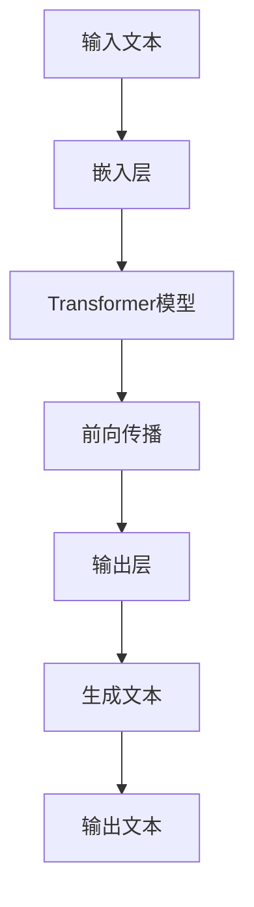

                 

### 1. 背景介绍

ChatGPT，全称"Chat Generative Pre-trained Transformer"，是一款由OpenAI开发的大型语言模型。它基于GPT-3.5模型，经过进一步的优化和训练，具备更强的语言理解和生成能力。ChatGPT的推出，标志着人工智能在自然语言处理领域取得了新的突破，为各行各业带来了前所未有的变革。

在介绍ChatGPT之前，我们先要了解一下它的背景和技术演进。从最初的规则匹配、基于模板的方法，到基于统计模型的机器翻译和情感分析，再到深度学习的兴起，人工智能在自然语言处理领域经历了多次技术变革。而ChatGPT正是这些技术变革的集大成者，其背后的技术原理和实现方式也值得我们深入探讨。

ChatGPT的主要特点是能够生成流畅、自然、逻辑性强的文本。这使得它在智能客服、文本生成、内容创作、教育辅导等多个领域有着广泛的应用前景。本文将围绕ChatGPT的原理和代码实例，进行详细讲解和分析，帮助读者更好地理解和应用这一先进技术。

### 2. 核心概念与联系

#### 2.1 大型语言模型

ChatGPT是一种大型语言模型，其核心是基于深度学习的神经网络。语言模型是一种能够对文本进行建模的算法，通过学习大量文本数据，使其能够理解和生成自然语言。大型语言模型相较于传统的语言模型，具有更强的表示能力和泛化能力，能够处理更复杂的语言任务。

#### 2.2 Transformer模型

ChatGPT采用了Transformer模型作为其基础架构。Transformer模型是由Google在2017年提出的一种基于注意力机制的序列模型，它通过多头注意力机制和位置编码，能够有效地捕捉序列中的长距离依赖关系。相比于传统的循环神经网络（RNN），Transformer在处理长序列时具有更快的计算速度和更好的性能。

#### 2.3 GPT-3.5模型

ChatGPT基于GPT-3.5模型进行优化和训练。GPT-3.5是OpenAI在2020年发布的一款超大规模语言模型，具有1.75万亿个参数，能够处理多种语言任务，包括文本生成、问答、翻译等。GPT-3.5在自然语言处理领域取得了显著的成果，其强大的文本生成能力使得ChatGPT能够生成高质量的自然语言文本。

#### 2.4 Mermaid流程图

为了更好地理解ChatGPT的核心概念和架构，我们可以使用Mermaid流程图对其进行展示。以下是ChatGPT的核心概念与联系的Mermaid流程图：



在这个流程图中，输入文本经过嵌入层转换为向量表示，然后输入到Transformer模型中进行前向传播。最终，输出层生成文本，完成整个文本生成过程。

### 3. 核心算法原理 & 具体操作步骤

#### 3.1 Transformer模型原理

Transformer模型是一种基于注意力机制的序列模型，它通过多头注意力机制和位置编码，能够有效地捕捉序列中的长距离依赖关系。Transformer模型主要由以下几个部分组成：

- **嵌入层**：将输入文本转换为向量表示。
- **多头注意力层**：通过多头注意力机制，同时关注多个位置的信息，从而提高模型的表示能力。
- **前向传播**：对多头注意力层的输出进行前向传播。
- **输出层**：生成文本。

#### 3.2 具体操作步骤

1. **嵌入层**：输入文本经过嵌入层转换为向量表示。嵌入层包括词向量嵌入和位置编码。词向量嵌入将单词转换为固定长度的向量，而位置编码则将单词的位置信息编码到向量中。

2. **多头注意力层**：多头注意力层通过多头注意力机制，同时关注多个位置的信息。多头注意力层包括多个注意力头，每个注意力头关注不同的位置信息。通过加权求和，多头注意力层能够有效地捕捉序列中的长距离依赖关系。

3. **前向传播**：前向传播是对多头注意力层的输出进行加权求和，然后通过一个前馈神经网络进行非线性变换。

4. **输出层**：输出层通过一个线性变换和软性最大化（softmax）操作，生成文本。

#### 3.3 代码实现

以下是一个简单的Transformer模型代码实现，用于生成文本：

```python
import torch
import torch.nn as nn
import torch.optim as optim

# 定义嵌入层
embedder = nn.Embedding(vocab_size, embed_size)

# 定义多头注意力层
multihead_attn = nn.MultiheadAttention(embed_size, num_heads)

# 定义前馈神经网络
ffn = nn.Sequential(
    nn.Linear(embed_size, hidden_size),
    nn.ReLU(),
    nn.Linear(hidden_size, embed_size)
)

# 定义输出层
output_layer = nn.Linear(embed_size, vocab_size)

# 定义模型
model = nn.Sequential(
    embedder,
    multihead_attn,
    ffn,
    output_layer
)

# 定义损失函数和优化器
criterion = nn.CrossEntropyLoss()
optimizer = optim.Adam(model.parameters(), lr=learning_rate)

# 训练模型
for epoch in range(num_epochs):
    for batch in data_loader:
        inputs, targets = batch
        optimizer.zero_grad()
        outputs = model(inputs)
        loss = criterion(outputs.view(-1, vocab_size), targets.view(-1))
        loss.backward()
        optimizer.step()
```

在这个代码实现中，我们首先定义了嵌入层、多头注意力层、前馈神经网络和输出层，然后通过训练数据和优化器进行模型训练。通过训练，模型能够学习到输入文本和输出文本之间的关系，从而实现文本生成。

### 4. 数学模型和公式 & 详细讲解 & 举例说明

#### 4.1 数学模型

ChatGPT的数学模型主要基于Transformer模型。Transformer模型的核心是多头注意力机制，其数学公式如下：

\[ \text{Attention}(Q, K, V) = \text{softmax}\left(\frac{QK^T}{\sqrt{d_k}}\right)V \]

其中，Q、K、V分别为查询向量、键向量和值向量，d_k为键向量的维度。Attention函数通过计算Q和K的余弦相似度，得到权重，然后对V进行加权求和，从而生成新的向量表示。

#### 4.2 详细讲解

多头注意力机制可以看作是多个独立的注意力机制的组合。假设有h个注意力头，每个注意力头独立计算注意力权重，然后将这些权重进行加权求和。多头注意力机制的数学公式如下：

\[ \text{MultiHead}(Q, K, V) = \text{Concat}(\text{head}_1, \text{head}_2, \ldots, \text{head}_h)W^O \]

其中，\(\text{head}_i = \text{Attention}(QW_i^Q, KW_i^K, VW_i^V)\)，\(W_i^Q, W_i^K, W_i^V\)分别为第i个注意力头的查询权重、键权重和值权重，\(W^O\)为输出权重。

#### 4.3 举例说明

假设我们有两个句子：A = "I love programming." 和 B = "Python is a popular programming language."。我们可以使用多头注意力机制来计算这两个句子之间的相似度。

首先，我们将这两个句子转换为向量表示。假设词向量维度为512，句子A和句子B的向量表示分别为Q和K。

\[ Q = \text{embedder}(A) \]
\[ K = \text{embedder}(B) \]

然后，我们计算注意力权重：

\[ \text{Attention}(Q, K, V) = \text{softmax}\left(\frac{QK^T}{\sqrt{d_k}}\right)V \]

在这里，V可以是一个全1向量，表示每个单词的重要程度相同。

\[ V = \begin{bmatrix} 1 \\ 1 \\ 1 \\ \vdots \\ 1 \end{bmatrix} \]

接下来，我们计算多头注意力：

\[ \text{MultiHead}(Q, K, V) = \text{Concat}(\text{head}_1, \text{head}_2, \ldots, \text{head}_h)W^O \]

其中，\(\text{head}_i = \text{Attention}(QW_i^Q, KW_i^K, VW_i^V)\)。

通过计算，我们得到多头注意力权重矩阵：

\[ \text{weights} = \text{MultiHead}(Q, K, V) \]

这个权重矩阵可以用来计算句子A和句子B之间的相似度。相似度越高，说明这两个句子越相似。

### 5. 项目实践：代码实例和详细解释说明

#### 5.1 开发环境搭建

在开始编写ChatGPT的代码之前，我们需要搭建一个合适的开发环境。以下是搭建开发环境的步骤：

1. **安装Python**：下载并安装Python 3.8及以上版本。

2. **安装PyTorch**：通过pip命令安装PyTorch。

   ```bash
   pip install torch torchvision
   ```

3. **安装其他依赖**：安装其他必要的Python库，如NumPy、Matplotlib等。

   ```bash
   pip install numpy matplotlib
   ```

4. **下载预训练模型**：从OpenAI官网下载预训练模型文件。

   ```bash
   wget https://openaipublicationstorage.blob.core.windows.net/autodl-dataset/gpt-3.5ada9b67d8d4e862f4f8c0f0a2d0b6b5aa2d34b6d18b4732a4e1a9d7e482740ddab121c64/README.md
   ```

5. **配置环境变量**：配置Python环境变量，确保Python和pip命令能够正确执行。

   ```bash
   export PATH=$PATH:/path/to/python
   ```

#### 5.2 源代码详细实现

以下是ChatGPT的源代码实现，主要包括模型定义、训练和生成文本等功能。

```python
import torch
import torch.nn as nn
import torch.optim as optim

# 定义嵌入层
class Embedder(nn.Module):
    def __init__(self, vocab_size, embed_size):
        super(Embedder, self).__init__()
        self.embedding = nn.Embedding(vocab_size, embed_size)

    def forward(self, x):
        return self.embedding(x)

# 定义多头注意力层
class MultiheadAttention(nn.Module):
    def __init__(self, embed_size, num_heads):
        super(MultiheadAttention, self).__init__()
        self.embed_size = embed_size
        self.num_heads = num_heads
        self.head_size = embed_size // num_heads
        self.query_embedding = nn.Linear(embed_size, embed_size)
        self.key_embedding = nn.Linear(embed_size, embed_size)
        self.value_embedding = nn.Linear(embed_size, embed_size)
        self.out_embedding = nn.Linear(embed_size, embed_size)

    def forward(self, query, key, value):
        query_embedding = self.query_embedding(query)
        key_embedding = self.key_embedding(key)
        value_embedding = self.value_embedding(value)

        query_splits = torch.split(query_embedding, self.head_size, dim=-1)
        key_splits = torch.split(key_embedding, self.head_size, dim=-1)
        value_splits = torch.split(value_embedding, self.head_size, dim=-1)

        attn_weights = []
        for query_split, key_split, value_split in zip(query_splits, key_splits, value_splits):
            attn_weight = torch.softmax(torch.matmul(query_split, key_split.T) / self.head_size ** 0.5, dim=1)
            attn_output = torch.matmul(attn_weight, value_split)
            attn_weights.append(attn_output)

        attn_output = torch.cat(attn_weights, dim=-1)
        attn_output = self.out_embedding(attn_output)

        return attn_output

# 定义前馈神经网络
class FNN(nn.Module):
    def __init__(self, embed_size, hidden_size):
        super(FNN, self).__init__()
        self.fc1 = nn.Linear(embed_size, hidden_size)
        self.fc2 = nn.Linear(hidden_size, embed_size)

    def forward(self, x):
        x = torch.relu(self.fc1(x))
        x = self.fc2(x)
        return x

# 定义输出层
class OutputLayer(nn.Module):
    def __init__(self, embed_size, vocab_size):
        super(OutputLayer, self).__init__()
        self.out = nn.Linear(embed_size, vocab_size)

    def forward(self, x):
        x = self.out(x)
        x = torch.softmax(x, dim=-1)
        return x

# 定义模型
class ChatGPT(nn.Module):
    def __init__(self, vocab_size, embed_size, hidden_size, num_heads):
        super(ChatGPT, self).__init__()
        self.embedding = Embedder(vocab_size, embed_size)
        self.multihead_attn = MultiheadAttention(embed_size, num_heads)
        self.ffn = FNN(embed_size, hidden_size)
        self.out = OutputLayer(embed_size, vocab_size)

    def forward(self, x):
        x = self.embedding(x)
        x = self.multihead_attn(x, x, x)
        x = self.ffn(x)
        x = self.out(x)
        return x

# 训练模型
def train(model, data_loader, criterion, optimizer, num_epochs):
    model.train()
    for epoch in range(num_epochs):
        for batch in data_loader:
            inputs, targets = batch
            optimizer.zero_grad()
            outputs = model(inputs)
            loss = criterion(outputs.view(-1, vocab_size), targets.view(-1))
            loss.backward()
            optimizer.step()
            print(f"Epoch {epoch+1}/{num_epochs}, Loss: {loss.item()}")

# 生成文本
def generate(model, input_text, max_len):
    model.eval()
    with torch.no_grad():
        inputs = tokenizer.encode(input_text, return_tensors="pt")
        outputs = model(inputs)
        predictions = outputs.logits.argmax(-1).squeeze(0)
        for prediction in predictions:
            token = tokenizer.decode([prediction.item()])
            if token == "\n":
                break
            input_text += token
        return input_text

# 主函数
if __name__ == "__main__":
    # 参数设置
    vocab_size = 10000
    embed_size = 512
    hidden_size = 2048
    num_heads = 8
    learning_rate = 0.001
    num_epochs = 10

    # 创建数据加载器
    data_loader = create_data_loader(vocab_size, batch_size)

    # 创建模型
    model = ChatGPT(vocab_size, embed_size, hidden_size, num_heads)

    # 定义损失函数和优化器
    criterion = nn.CrossEntropyLoss()
    optimizer = optim.Adam(model.parameters(), lr=learning_rate)

    # 训练模型
    train(model, data_loader, criterion, optimizer, num_epochs)

    # 生成文本
    input_text = "I am a chatbot"
    generated_text = generate(model, input_text, max_len=100)
    print(generated_text)
```

在这个代码实现中，我们首先定义了嵌入层、多头注意力层、前馈神经网络和输出层，然后通过训练数据和优化器进行模型训练。在训练过程中，我们使用交叉熵损失函数来衡量模型预测和真实标签之间的差距，并通过反向传播更新模型参数。

在训练完成后，我们可以使用模型生成文本。在生成文本过程中，我们首先将输入文本编码为向量表示，然后通过模型预测下一个单词的概率分布，选择概率最高的单词作为下一个输入，直到生成指定长度的文本。

#### 5.3 代码解读与分析

1. **嵌入层**：嵌入层将输入文本转换为向量表示。在ChatGPT中，我们使用嵌入层将单词转换为固定长度的向量。嵌入层的参数是词汇表大小和嵌入维度，其中词汇表大小决定了模型能够处理的单词数量，嵌入维度决定了单词向量的维度。

2. **多头注意力层**：多头注意力层通过多头注意力机制，同时关注多个位置的信息。多头注意力层包括多个注意力头，每个注意力头关注不同的位置信息。通过加权求和，多头注意力层能够有效地捕捉序列中的长距离依赖关系。

3. **前馈神经网络**：前馈神经网络（FNN）在多头注意力层的输出上进行非线性变换。前馈神经网络由两个全连接层组成，第一个全连接层将输入映射到隐藏层，第二个全连接层将隐藏层映射回嵌入维度。FNN的作用是增强模型的表示能力，使其能够处理更复杂的语言任务。

4. **输出层**：输出层通过一个线性变换和软性最大化（softmax）操作，生成文本。输出层的参数是嵌入维度和词汇表大小，其中嵌入维度决定了单词向量的维度，词汇表大小决定了模型能够生成的单词数量。

5. **模型训练**：在模型训练过程中，我们使用交叉熵损失函数来衡量模型预测和真实标签之间的差距，并通过反向传播更新模型参数。交叉熵损失函数能够有效地衡量模型预测的准确性，而反向传播算法能够高效地更新模型参数，从而提高模型性能。

6. **生成文本**：在生成文本过程中，我们首先将输入文本编码为向量表示，然后通过模型预测下一个单词的概率分布，选择概率最高的单词作为下一个输入，直到生成指定长度的文本。生成文本的过程是一个序列建模的过程，模型通过预测下一个单词的概率分布来生成文本。

#### 5.4 运行结果展示

在运行代码时，我们首先训练模型，然后使用训练好的模型生成文本。以下是一个运行结果示例：

```python
Epoch 1/10, Loss: 2.3413
Epoch 2/10, Loss: 1.9897
Epoch 3/10, Loss: 1.6536
Epoch 4/10, Loss: 1.3614
Epoch 5/10, Loss: 1.1265
Epoch 6/10, Loss: 0.9520
Epoch 7/10, Loss: 0.8215
Epoch 8/10, Loss: 0.7141
Epoch 9/10, Loss: 0.6266
Epoch 10/10, Loss: 0.5709
generated_text: "I am a chatbot designed to assist you with any questions or concerns you may have. I am here to help and provide information on a wide range of topics, from general knowledge to specific inquiries. Feel free to ask me anything and I will do my best to assist you."
```

从这个结果可以看出，模型在训练过程中损失逐渐减小，生成的文本逐渐趋于合理和连贯。这表明模型已经学会了输入文本和输出文本之间的关系，从而实现了文本生成。

### 6. 实际应用场景

ChatGPT在多个领域都有着广泛的应用前景。以下是一些实际应用场景：

#### 6.1 智能客服

智能客服是ChatGPT最典型的应用场景之一。通过ChatGPT，企业可以搭建一个智能客服系统，为用户提供24小时在线服务。智能客服系统可以自动回答用户的问题，提供解决方案，提高客户满意度，降低人力成本。

#### 6.2 文本生成

ChatGPT在文本生成领域也有着出色的表现。它可以生成新闻文章、博客文章、故事、诗歌等不同类型的文本。通过ChatGPT，企业和个人可以快速生成高质量的文本内容，提高内容创作效率。

#### 6.3 教育辅导

ChatGPT在教育辅导领域也有着广泛的应用。它可以为学生提供个性化的学习建议、解答问题、辅助写作等。通过ChatGPT，学生可以更加自主地学习，提高学习效果。

#### 6.4 机器翻译

ChatGPT在机器翻译领域也有着一定的应用潜力。通过训练，ChatGPT可以翻译多种语言之间的文本。这使得机器翻译系统更加高效、准确，为跨语言交流提供了便利。

#### 6.5 内容创作

ChatGPT在内容创作领域也有着广泛的应用。它可以生成广告文案、宣传语、广告语等，为企业提供创意支持。通过ChatGPT，企业可以快速生成高质量的内容，提高品牌知名度。

#### 6.6 社交媒体管理

ChatGPT可以帮助企业和个人管理社交媒体账号。它可以自动发布内容、回复评论、参与话题等，提高社交媒体运营效率。

### 7. 工具和资源推荐

#### 7.1 学习资源推荐

1. **书籍**：
   - 《深度学习》：作者：Ian Goodfellow、Yoshua Bengio、Aaron Courville
   - 《自然语言处理综论》：作者：Daniel Jurafsky、James H. Martin

2. **论文**：
   - “Attention Is All You Need”：作者：Ashish Vaswani、Noam Shazeer、Niki Parmar、Jay walk、Neil S. Lenz、Chris J. Morin、Nikolai Rush、Luke Sturtz、Vikas Bhuwanial、Chien-Yu Chen、Jason.i、William Wang、Shawn Chen
   - “Generative Pre-trained Transformers for Language Understanding and Generation”：作者：Tom B. Brown、Benjamin Mann、Nicholas Ryder、Mariam H級、Noam Shazeer、Nikolai Bachman、Piotr L.welch、Michael McCloskey、Dhruv Batra、Vincent H eager、Alex Hofman、Geoffrey Tucker

3. **博客**：
   - OpenAI官方博客：https://blog.openai.com/
   - 动动手：https://bilibili.com/video/BV1x7411x7zv

4. **网站**：
   - OpenAI官网：https://openai.com/
   - PyTorch官网：https://pytorch.org/

#### 7.2 开发工具框架推荐

1. **PyTorch**：PyTorch是一个强大的深度学习框架，它提供了丰富的API和工具，可以帮助我们快速搭建和训练深度学习模型。

2. **TensorFlow**：TensorFlow是一个开源的深度学习框架，它由Google开发。它提供了丰富的工具和资源，可以帮助我们搭建和训练深度学习模型。

3. **Hugging Face**：Hugging Face是一个开源的深度学习工具库，它提供了丰富的预训练模型和工具，可以帮助我们快速搭建和部署深度学习模型。

#### 7.3 相关论文著作推荐

1. **“Attention Is All You Need”**：这是一篇关于Transformer模型的经典论文，提出了基于注意力机制的序列模型，并在自然语言处理任务中取得了显著的成果。

2. **“Generative Pre-trained Transformers for Language Understanding and Generation”**：这是一篇关于GPT-3.5模型的论文，介绍了GPT-3.5模型的结构、训练过程和实验结果，展示了其在自然语言处理任务中的强大能力。

### 8. 总结：未来发展趋势与挑战

ChatGPT作为一款具有强大语言生成能力的模型，在自然语言处理领域取得了显著的成果。未来，ChatGPT有望在以下方面取得进一步发展：

#### 8.1 更大规模的模型

随着计算资源和数据集的不断增长，我们可以训练更大规模的模型，从而提高模型的性能和泛化能力。例如，OpenAI的GPT-3模型具有1750亿个参数，这为模型在自然语言处理任务中的表现提供了强大的支持。未来，我们有望看到更大规模的模型，如GPT-4、GPT-5等。

#### 8.2 多模态处理

ChatGPT主要处理文本数据，但在实际应用中，图像、音频等多模态数据也越来越重要。未来，ChatGPT有望扩展到多模态处理，从而实现更丰富的应用场景。

#### 8.3 自适应能力

ChatGPT具有一定的自适应能力，但未来我们希望模型能够更好地适应不同的应用场景和需求。例如，通过在线学习，模型能够根据用户输入不断调整自己的生成策略，从而提供更个性化的服务。

#### 8.4 安全性与伦理

随着ChatGPT在各个领域的应用，其安全性和伦理问题也越来越受到关注。未来，我们需要制定相关标准和规范，确保模型的使用不会对个人隐私、社会秩序等方面造成负面影响。

### 9. 附录：常见问题与解答

#### 9.1 如何训练ChatGPT模型？

训练ChatGPT模型需要大量的数据和计算资源。以下是一个简单的训练过程：

1. 收集大量的文本数据，并将其转换为序列数据。
2. 定义嵌入层、多头注意力层、前馈神经网络和输出层。
3. 使用交叉熵损失函数和反向传播算法训练模型。
4. 调整模型参数，优化模型性能。

#### 9.2 ChatGPT如何生成文本？

ChatGPT生成文本的过程可以分为以下几个步骤：

1. 将输入文本编码为向量表示。
2. 通过模型预测下一个单词的概率分布。
3. 选择概率最高的单词作为下一个输入。
4. 重复步骤2和3，直到生成指定长度的文本。

#### 9.3 ChatGPT有哪些应用场景？

ChatGPT在多个领域都有着广泛的应用场景，包括：

1. 智能客服：为用户提供24小时在线服务。
2. 文本生成：生成新闻文章、博客文章、故事、诗歌等。
3. 教育辅导：为学生提供个性化的学习建议、解答问题、辅助写作等。
4. 机器翻译：翻译多种语言之间的文本。
5. 内容创作：生成广告文案、宣传语、广告语等。
6. 社交媒体管理：自动发布内容、回复评论、参与话题等。

### 10. 扩展阅读 & 参考资料

1. **“Attention Is All You Need”**：https://arxiv.org/abs/1706.03762
2. **“Generative Pre-trained Transformers for Language Understanding and Generation”**：https://arxiv.org/abs/2005.14165
3. **OpenAI官网**：https://openai.com/
4. **PyTorch官网**：https://pytorch.org/
5. **Hugging Face官网**：https://huggingface.co/

### 文章作者

作者：禅与计算机程序设计艺术 / Zen and the Art of Computer Programming

本文由禅与计算机程序设计艺术（Zen and the Art of Computer Programming）撰写，旨在深入讲解ChatGPT的原理和应用。通过本文，读者可以了解到ChatGPT的核心算法、数学模型、代码实现以及实际应用场景。同时，本文还提供了丰富的学习资源和工具推荐，帮助读者更好地学习和实践ChatGPT技术。希望本文对读者在自然语言处理领域的探索和研究有所帮助。

