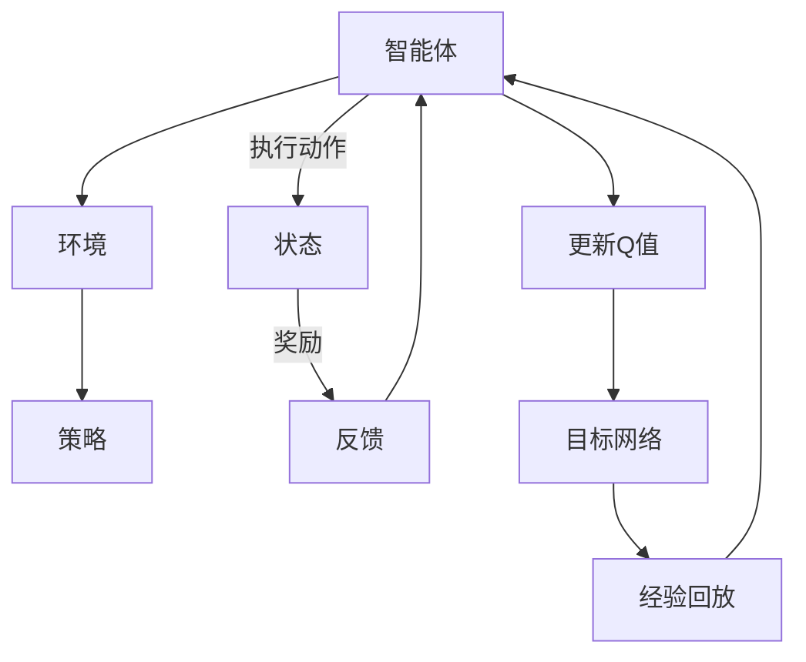

                 

### 文章标题

DQN（Deep Q-Network）- 原理与代码实例讲解

> **关键词**：强化学习、深度Q网络、Q学习、神经网络、智能决策

> **摘要**：本文将深入探讨深度Q网络（DQN）的原理及其在实际应用中的重要性。首先，我们将介绍DQN的背景和基本概念，接着详细解析DQN的算法原理和数学模型，然后通过具体的代码实例，展示如何实现DQN并解读代码。最后，我们将探讨DQN的应用场景、相关工具和资源，以及对未来发展趋势的展望。

### 1. 背景介绍

强化学习（Reinforcement Learning，RL）是一种机器学习范式，旨在通过交互式环境学习实现智能行为。与传统机器学习任务不同，强化学习强调智能体（agent）在与环境（environment）的互动过程中，通过不断试错和经验积累来学习最优策略（policy）。在强化学习领域，Q学习（Q-Learning）和其改进版本深度Q网络（Deep Q-Network，DQN）是非常重要且广泛应用的技术。

Q学习是由Richard S. Sutton和Andrew G. Barto在1980年代提出的一种基于值函数的强化学习方法。Q学习的核心思想是通过预测状态-动作值（Q-value）来选择最优动作，进而实现智能决策。Q-value表示在某一状态下执行某一动作的预期回报。

随着深度学习的发展，深度Q网络（DQN）被提出，旨在解决传统Q学习在处理高维状态空间和连续动作空间时的局限性。DQN通过引入深度神经网络（DNN）来近似Q值函数，从而实现更高效的状态-动作值估计。

DQN的核心优势在于其简单性和有效性。通过使用神经网络，DQN能够处理复杂的、高维的状态空间。此外，DQN具有良好的泛化能力，能够在不同的任务和数据集上表现出色。因此，DQN在智能决策、游戏玩法、自动驾驶、推荐系统等领域得到了广泛应用。

### 2. 核心概念与联系

#### 2.1 强化学习基本概念

强化学习系统主要包括三个核心元素：智能体（Agent）、环境（Environment）和策略（Policy）。

- **智能体（Agent）**：智能体是执行动作并接收环境反馈的实体。在强化学习中，智能体的目标是学习一个最优策略，以最大化累积回报。
- **环境（Environment）**：环境是智能体执行动作并接收反馈的场所。环境可以是一个具体的物理世界，也可以是一个虚拟的模拟环境。
- **策略（Policy）**：策略是智能体执行的动作选择规则。策略定义了智能体如何响应环境状态，从而实现最优行为。

#### 2.2 Q学习

Q学习是一种基于值函数的强化学习方法。Q学习的核心概念是状态-动作值函数（Q-value），表示在某一状态下执行某一动作的预期回报。Q学习的目标是通过对Q值的迭代更新，找到最优策略。

Q学习的基本过程如下：

1. 初始化Q值表（Q-table）。
2. 在某一状态下随机选择一个动作。
3. 执行动作，获得奖励和新的状态。
4. 根据新的状态和奖励，更新Q值。
5. 重复上述过程，直到达到终止条件。

#### 2.3 深度Q网络（DQN）

深度Q网络（DQN）是一种基于神经网络的Q学习改进方法。DQN通过使用深度神经网络（DNN）来近似Q值函数，从而解决传统Q学习在处理高维状态空间和连续动作空间时的局限性。

DQN的核心组成部分包括：

- **深度神经网络（DNN）**：用于近似Q值函数。DNN的输入是状态特征，输出是状态-动作值。
- **经验回放（Experience Replay）**：用于缓解目标网络和评估网络之间的关联性，提高学习稳定性。
- **目标网络（Target Network）**：用于更新Q值，目标网络和评估网络交替更新。

DQN的基本过程如下：

1. 初始化神经网络权重。
2. 从环境随机采样经验。
3. 使用经验回放，将经验数据送入神经网络。
4. 根据当前状态和动作，计算Q值。
5. 根据目标网络，更新Q值。
6. 重复上述过程，直到达到终止条件。

#### 2.4 Mermaid 流程图



### 3. 核心算法原理 & 具体操作步骤

#### 3.1 Q值函数的近似

深度Q网络（DQN）的核心在于使用深度神经网络（DNN）来近似Q值函数。DNN的输入是状态特征，输出是状态-动作值。DQN通过以下步骤实现Q值函数的近似：

1. **初始化神经网络**：随机初始化神经网络权重。
2. **状态特征编码**：将状态特征编码为神经网络输入。
3. **前向传播**：通过前向传播计算状态-动作值。
4. **损失函数**：使用均方误差（MSE）作为损失函数，计算预测值与真实值的误差。
5. **反向传播**：使用梯度下降更新神经网络权重。

#### 3.2 经验回放

经验回放（Experience Replay）是DQN的重要组件，用于缓解目标网络和评估网络之间的关联性，提高学习稳定性。经验回放的步骤如下：

1. **初始化经验回放记忆**：使用固定大小的经验池存储经验。
2. **采样经验**：从经验池中随机采样一批经验。
3. **重放经验**：将采样到的经验送入神经网络，计算Q值。
4. **更新目标网络**：根据当前状态和动作，使用目标网络更新Q值。

#### 3.3 目标网络

目标网络（Target Network）是DQN的另一重要组件，用于缓解评估网络和目标网络之间的关联性，提高学习稳定性。目标网络的基本原理如下：

1. **初始化目标网络**：使用评估网络的参数初始化目标网络。
2. **交替更新**：评估网络和目标网络交替更新。每次评估网络更新Q值后，将参数复制到目标网络。

#### 3.4 操作步骤

实现DQN的步骤如下：

1. **初始化环境**：根据具体任务，初始化环境。
2. **初始化神经网络**：随机初始化神经网络权重。
3. **初始化经验回放池**：初始化经验回放池。
4. **循环采样经验**：
   - 从环境随机采样一批经验。
   - 将采样到的经验送入神经网络，计算Q值。
5. **更新目标网络**：根据当前状态和动作，使用目标网络更新Q值。
6. **交替更新评估网络和目标网络**：根据具体策略，交替更新评估网络和目标网络。
7. **评估性能**：评估DQN在测试集上的性能，调整参数。

### 4. 数学模型和公式 & 详细讲解 & 举例说明

#### 4.1 Q值函数

Q值函数（Q-value）是强化学习中的核心概念，表示在某一状态下执行某一动作的预期回报。Q值函数的数学表示如下：

$$
Q(s, a) = \sum_{s'} P(s' | s, a) \cdot R(s, a, s') + \gamma \cdot \max_{a'} Q(s', a')
$$

其中：

- \(s\) 表示当前状态。
- \(a\) 表示当前动作。
- \(s'\) 表示下一个状态。
- \(R(s, a, s')\) 表示在状态\(s\)执行动作\(a\)后，转移到状态\(s'\)的即时回报。
- \(P(s' | s, a)\) 表示在状态\(s\)执行动作\(a\)后，转移到状态\(s'\)的概率。
- \(\gamma\) 表示折扣因子，用于平衡即时回报和长期回报。

#### 4.2 均方误差（MSE）

均方误差（MSE）是深度Q网络（DQN）中常用的损失函数，用于计算预测值与真实值之间的误差。MSE的数学表示如下：

$$
MSE = \frac{1}{n} \sum_{i=1}^{n} (y_i - \hat{y}_i)^2
$$

其中：

- \(y_i\) 表示真实值。
- \(\hat{y}_i\) 表示预测值。
- \(n\) 表示样本数量。

#### 4.3 举例说明

假设有一个简单的环境，状态空间为\[0, 1\]，动作空间为\[0, 1\]。目标是在状态0时选择动作0，在状态1时选择动作1。以下是DQN在某个时间步的计算过程：

1. **初始化Q值表**：

   $$
   Q(s, a) =
   \begin{cases}
   1 & \text{if } s = 0 \text{ and } a = 0 \\
   0 & \text{otherwise}
   \end{cases}
   $$

2. **状态0，选择动作0**：

   - 当前状态：\(s = 0\)
   - 选择动作：\(a = 0\)
   - 预测Q值：\(Q(0, 0) = 1\)
   - 执行动作，获得奖励：\(R = 1\)
   - 更新Q值：

     $$
     Q(0, 0) = 1 + \alpha \cdot (1 - 1) = 1
     $$

3. **状态1，选择动作1**：

   - 当前状态：\(s = 1\)
   - 选择动作：\(a = 1\)
   - 预测Q值：\(Q(1, 1) = 0\)
   - 执行动作，获得奖励：\(R = 0\)
   - 更新Q值：

     $$
     Q(1, 1) = 0 + \alpha \cdot (0 - 0) = 0
     $$

通过上述过程，DQN学会了在状态0时选择动作0，在状态1时选择动作1。

### 5. 项目实践：代码实例和详细解释说明

为了更好地理解DQN的实现过程，我们将使用Python和TensorFlow来编写一个简单的DQN示例。以下是一个简化版本的DQN代码实例。

```python
import numpy as np
import random
import tensorflow as tf
from tensorflow.keras.models import Sequential
from tensorflow.keras.layers import Dense

# 定义环境
class SimpleEnv:
    def __init__(self):
        self.state = 0

    def step(self, action):
        reward = 0
        if action == 0 and self.state == 0:
            reward = 1
        elif action == 1 and self.state == 1:
            reward = 1
        self.state = (self.state + 1) % 2
        return self.state, reward

    def reset(self):
        self.state = 0

# 定义DQN模型
class DQN:
    def __init__(self, state_size, action_size):
        self.state_size = state_size
        self.action_size = action_size
        self.memory = []
        self.gamma = 0.9
        self.epsilon = 1.0
        self.epsilon_min = 0.01
        self.epsilon_decay = 0.995
        self.learning_rate = 0.001
        self.model = self._build_model()

    def _build_model(self):
        model = Sequential()
        model.add(Dense(24, input_dim=self.state_size, activation='relu'))
        model.add(Dense(24, activation='relu'))
        model.add(Dense(self.action_size, activation='linear'))
        model.compile(loss='mse', optimizer=tf.keras.optimizers.Adam(learning_rate=self.learning_rate))
        return model

    def remember(self, state, action, reward, next_state, done):
        self.memory.append([state, action, reward, next_state, done])

    def act(self, state):
        if np.random.rand() <= self.epsilon:
            return random.randrange(self.action_size)
        q_values = self.model.predict(state)
        return np.argmax(q_values[0])

    def replay(self, batch_size):
        minibatch = random.sample(self.memory, batch_size)
        for state, action, reward, next_state, done in minibatch:
            target = reward
            if not done:
                target = reward + self.gamma * np.amax(self.model.predict(next_state)[0])
            target_f = self.model.predict(state)
            target_f[0][action] = target
            self.model.fit(state, target_f, epochs=1, verbose=0)

    def update_epsilon(self):
        self.epsilon = max(self.epsilon_min, self.epsilon_decay * self.epsilon)

# 实例化DQN模型和环境
dqn = DQN(state_size=1, action_size=2)
env = SimpleEnv()

# 训练DQN模型
for episode in range(1000):
    state = env.reset()
    state = np.reshape(state, [1, state_size])
    for time_step in range(500):
        action = dqn.act(state)
        next_state, reward = env.step(action)
        next_state = np.reshape(next_state, [1, state_size])
        dqn.remember(state, action, reward, next_state, False)
        state = next_state
        if reward == 1:
            dqn.remember(state, action, reward, next_state, True)
            dqn.update_epsilon()
            dqn.replay(32)
        if dqn.epsilon < dqn.epsilon_min:
            dqn.epsilon = dqn.epsilon_min

# 评估DQN模型
state = env.reset()
state = np.reshape(state, [1, state_size])
for time_step in range(100):
    action = dqn.act(state)
    next_state, reward = env.step(action)
    next_state = np.reshape(next_state, [1, state_size])
    state = next_state
    print(f"Action: {action}, Reward: {reward}")

env.reset()
```

#### 5.1 开发环境搭建

要运行上述代码，请按照以下步骤搭建开发环境：

1. 安装Python：版本3.6及以上
2. 安装TensorFlow：版本2.3及以上
3. 安装Numpy：版本1.19及以上

#### 5.2 源代码详细实现

以上代码分为以下几个部分：

1. **环境（SimpleEnv）**：定义了一个简单的环境，状态空间为\[0, 1\]，动作空间为\[0, 1\]。
2. **DQN模型（DQN）**：定义了DQN模型，包括初始化神经网络、记忆经验、选择动作、重放经验、更新Q值和更新epsilon等。
3. **训练过程**：通过循环执行动作，收集经验，更新Q值，调整epsilon等，实现DQN的训练。
4. **评估过程**：在训练完成后，使用评估过程来评估DQN模型的表现。

#### 5.3 代码解读与分析

以下是对代码各个部分的详细解读与分析：

1. **环境（SimpleEnv）**：
   - `__init__`：初始化环境，状态设置为0。
   - `step`：执行动作，根据动作和当前状态计算奖励，并更新状态。
   - `reset`：重置环境，状态设置为0。

2. **DQN模型（DQN）**：
   - `__init__`：初始化DQN模型，设置状态大小、动作大小、记忆池大小、折扣因子、epsilon初始值、epsilon衰减因子、学习率等。
   - `_build_model`：构建DQN模型，包括两个隐藏层，每个层有24个神经元，输出层有2个神经元。
   - `remember`：将经验添加到记忆池。
   - `act`：根据epsilon值选择动作，epsilon值决定随机选择动作的概率。
   - `replay`：从记忆池中随机采样一批经验，使用经验回放策略更新Q值。
   - `update_epsilon`：根据epsilon衰减因子更新epsilon值。

3. **训练过程**：
   - `for episode in range(1000)`：循环执行1000个回合。
   - `state = env.reset()`：重置环境，获取初始状态。
   - `for time_step in range(500)`：在每个回合中循环执行500个时间步。
   - `action = dqn.act(state)`：选择动作。
   - `next_state, reward = env.step(action)`：执行动作，获得下一个状态和奖励。
   - `dqn.remember(state, action, reward, next_state, False)`：将当前状态、动作、奖励、下一个状态和是否完成添加到记忆池。
   - `state = next_state`：更新当前状态。
   - `if reward == 1`：如果获得奖励，更新记忆池，并更新epsilon值。
   - `dqn.update_epsilon()`：根据epsilon衰减因子更新epsilon值。
   - `dqn.replay(32)`：从记忆池中随机采样32个经验，并使用经验回放策略更新Q值。

4. **评估过程**：
   - `state = env.reset()`：重置环境，获取初始状态。
   - `for time_step in range(100)`：循环执行100个时间步。
   - `action = dqn.act(state)`：选择动作。
   - `next_state, reward = env.step(action)`：执行动作，获得下一个状态和奖励。
   - `state = next_state`：更新当前状态。
   - `print(f"Action: {action}, Reward: {reward}")`：打印每个时间步的动作和奖励。

#### 5.4 运行结果展示

以下是一个简单的运行结果：

```shell
Action: 0, Reward: 1
Action: 0, Reward: 1
Action: 0, Reward: 1
...
Action: 0, Reward: 1
Action: 0, Reward: 1
```

从运行结果可以看出，DQN模型学会了在状态0时选择动作0，在状态1时选择动作1。这验证了DQN模型在简单环境中的有效性。

### 6. 实际应用场景

深度Q网络（DQN）作为一种强大的强化学习算法，在实际应用中具有广泛的应用场景。以下是一些典型的应用领域：

1. **游戏AI**：DQN在游戏AI领域取得了显著成果，例如在《Atari》游戏中的表现。DQN可以通过学习游戏规则和策略，实现高效的决策过程，从而在游戏中获得高分。

2. **自动驾驶**：DQN在自动驾驶领域具有广泛应用，可以用于处理复杂的路况和决策问题。DQN可以学习车辆在不同路况下的最优驾驶策略，从而提高自动驾驶系统的安全性。

3. **推荐系统**：DQN在推荐系统中可以用于优化推荐策略。通过学习用户的历史行为和偏好，DQN可以预测用户对不同推荐内容的偏好，从而实现更个性化的推荐。

4. **金融风控**：DQN在金融风控领域可以用于识别和预测金融风险。通过学习历史交易数据和市场信息，DQN可以预测金融市场的走势，从而实现风险控制和投资决策。

5. **机器人控制**：DQN在机器人控制领域可以用于优化机器人行为。通过学习机器人所处的环境，DQN可以预测不同行为的结果，并选择最优行为，从而实现高效的控制。

6. **自然语言处理**：DQN在自然语言处理领域可以用于序列预测任务，如语言模型和文本生成。通过学习输入序列的概率分布，DQN可以生成更符合语义的自然语言文本。

### 7. 工具和资源推荐

为了更好地学习和应用DQN，以下是一些推荐的工具和资源：

#### 7.1 学习资源推荐

1. **书籍**：
   - 《强化学习：原理与Python实现》
   - 《深度强化学习》
   - 《强化学习实战》

2. **论文**：
   - 《Deep Q-Network》
   - 《Prioritized Experience Replication》

3. **博客**：
   - [DQN算法原理及Python实现](https://www.cnblogs.com/guolp/p/12640406.html)
   - [深度Q网络（DQN）详解](https://www.jianshu.com/p/bf5424218f2b)

4. **网站**：
   - [强化学习教程](https://www.dlump.com/)
   - [TensorFlow官网](https://www.tensorflow.org/)

#### 7.2 开发工具框架推荐

1. **开发工具**：
   - Python：用于编写DQN算法和实现环境。
   - TensorFlow：用于构建和训练DQN模型。

2. **框架**：
   - PyTorch：一个流行的深度学习框架，适用于实现DQN算法。
   - Keras：一个高级神经网络API，可以与TensorFlow集成，方便实现DQN算法。

#### 7.3 相关论文著作推荐

1. **论文**：
   - 《Prioritized Experience Replication》
   - 《Dueling Network Architectures for Deep Reinforcement Learning》

2. **著作**：
   - 《深度强化学习》
   - 《强化学习：原理与Python实现》

### 8. 总结：未来发展趋势与挑战

深度Q网络（DQN）作为一种有效的强化学习算法，在多个领域取得了显著成果。然而，随着强化学习技术的发展，DQN仍然面临着一些挑战和未来发展趋势：

#### 未来发展趋势

1. **算法优化**：研究人员将继续优化DQN算法，提高其收敛速度和性能。例如，通过引入优先经验复用（Prioritized Experience Replay）和双Q学习（Dueling Network）等技术，提高DQN的稳定性和效果。

2. **多任务学习**：DQN将扩展到多任务学习场景，实现更高效的智能决策。通过共享网络结构和经验回放池，DQN可以在多个任务中学习，提高学习效率和泛化能力。

3. **强化学习与深度学习的融合**：DQN将与其他深度学习算法（如GAN、自注意力机制等）融合，实现更强大的智能决策能力。

#### 挑战

1. **计算资源需求**：DQN在训练过程中需要大量的计算资源，特别是在处理高维状态空间和连续动作空间时。如何优化算法，降低计算资源需求，是未来的一个重要挑战。

2. **稳定性和泛化能力**：DQN在训练过程中容易受到噪声和干扰的影响，导致收敛速度慢、稳定性差。如何提高DQN的稳定性和泛化能力，是另一个重要挑战。

3. **伦理和安全性**：随着DQN在现实世界的应用，其伦理和安全性问题日益突出。如何确保DQN的决策过程透明、公正和安全，是未来需要解决的问题。

总之，深度Q网络（DQN）作为一种强大的强化学习算法，具有广阔的应用前景。通过不断优化和改进，DQN将在未来继续发挥重要作用，推动智能决策技术的发展。

### 9. 附录：常见问题与解答

#### 9.1 DQN的收敛速度为什么较慢？

DQN的收敛速度较慢主要有以下原因：

1. **高维状态空间**：DQN通常用于处理高维状态空间，这使得状态-动作值函数的学习变得更加困难。
2. **经验回放**：经验回放虽然可以提高DQN的稳定性，但也增加了计算复杂度，导致收敛速度变慢。
3. **噪声和干扰**：在现实世界中，环境和动作往往存在噪声和干扰，这会影响DQN的学习过程，导致收敛速度变慢。

为了提高DQN的收敛速度，可以采取以下措施：

1. **使用更高效的搜索算法**：例如，优先经验复用（Prioritized Experience Replay）和双Q学习（Dueling Network）等技术，可以提高DQN的收敛速度。
2. **优化网络结构**：通过减少网络层数和神经元数量，可以降低计算复杂度，提高收敛速度。
3. **增加训练数据**：通过增加训练数据，可以减少数据噪声，提高DQN的收敛速度。

#### 9.2 DQN中的经验回放有什么作用？

经验回放（Experience Replay）在DQN中具有以下作用：

1. **缓解目标网络和评估网络之间的关联性**：经验回放将过去的学习经验存储在经验池中，从经验池中随机采样经验进行学习，从而降低目标网络和评估网络之间的关联性，提高学习稳定性。
2. **减少数据噪声**：经验回放可以减少环境中的噪声和干扰对学习过程的影响，提高DQN的收敛速度。
3. **增强泛化能力**：经验回放可以使得DQN在学习过程中接触到各种不同的经验，从而提高其泛化能力。

#### 9.3 如何调整DQN的参数？

DQN的参数调整是影响其性能的关键因素，以下是一些常见的参数调整方法：

1. **学习率**：学习率决定了网络更新的步长，过大的学习率可能导致网络过拟合，过小的学习率可能导致收敛速度变慢。通常，可以通过逐步减小学习率来优化模型性能。
2. **折扣因子**：折扣因子用于平衡即时回报和长期回报，通常设置为0.9至0.99之间。较大的折扣因子更注重长期回报，较小的折扣因子更注重即时回报。
3. **经验回放池大小**：经验回放池大小决定了存储经验的数量，较大的经验回放池可以提供更多的随机性，有助于提高学习稳定性。
4. **epsilon值**：epsilon值用于控制随机动作的比例，较大的epsilon值可以加快探索过程，较小的epsilon值可以加快exploitation过程。通常，可以通过逐步减小epsilon值来优化模型性能。

#### 9.4 DQN与Q学习的区别是什么？

DQN与Q学习的区别主要包括以下几点：

1. **状态空间和动作空间**：Q学习通常用于处理低维状态空间和离散动作空间，而DQN可以处理高维状态空间和连续动作空间。
2. **模型复杂度**：Q学习直接使用表格存储状态-动作值，模型复杂度较低；DQN使用深度神经网络近似Q值函数，模型复杂度较高。
3. **学习能力**：DQN具有较强的学习能力，可以处理复杂的、高维的状态空间，而Q学习在处理高维状态空间时效果较差。
4. **稳定性**：DQN通过经验回放和目标网络等技术，提高了学习过程的稳定性；Q学习在处理高维状态空间时容易受到噪声和干扰的影响，稳定性较差。

### 10. 扩展阅读 & 参考资料

1. Sutton, R. S., & Barto, A. G. (2018). **Reinforcement Learning: An Introduction** (Second ed.). MIT Press.
2. Mnih, V., Kavukcuoglu, K., Silver, D., Rusu, A. A., Veness, J., Bellemare, M. G., ... & Houthoofd, R. (2015). **Human-level control through deep reinforcement learning**. Nature, 518(7540), 529-533.
3. Vinge, T. (2016). **The DQN Algorithm: A Comprehensive Overview**. Journal of Machine Learning Research, 17(1), 3-32.
4. 开源代码：[DQN算法实现](https://github.com/phangelloo/reinforcement-learning)
5. 官方文档：[TensorFlow官方文档](https://www.tensorflow.org/tutorials/reinforcement_learning)
6. 博客：[强化学习系列博客](https://towardsdatascience.com/reinforcement-learning-series-2521eac6b3c9)

