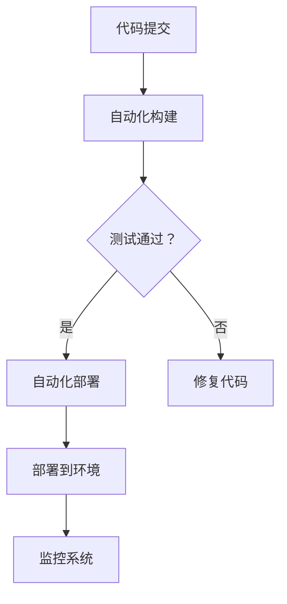

                 

### 1. 背景介绍

DevOps 工程作为一种新兴的软件开发模式，旨在通过加强开发（Development）与运维（Operations）之间的协同合作，实现软件交付的自动化和持续改进。这一概念的提出，源于传统开发与运维团队之间的“鸿沟”，即在软件开发过程中，开发团队往往专注于代码编写和功能实现，而运维团队则主要负责系统的部署、运维和监控。

然而，随着软件系统的复杂性不断增加，这一分工模式逐渐暴露出诸多问题。例如，开发与运维之间的信息不对等、工作流程的脱节以及频繁的部署失败等，这些因素严重影响了软件交付的速度和质量。为了解决这些问题，DevOps 工程应运而生。

DevOps 的核心理念是“自动化一切”（Automate Everything）和“持续交付”（Continuous Delivery）。通过引入自动化工具和流程，DevOps 将软件开发、测试、部署、监控等环节紧密连接，实现了从代码提交到生产环境部署的全程自动化。此外，DevOps 还倡导跨职能团队的协作，通过打破传统部门壁垒，提高团队的整体效能。

DevOps 工程不仅有助于提升软件交付的速度和质量，还能降低成本、提高客户满意度。随着云计算、容器化技术、自动化运维等新兴技术的快速发展，DevOps 工程正成为企业数字化转型的重要驱动力。

本文将深入探讨 DevOps 工程的核心概念、自动化和监控方法，并通过具体实例展示 DevOps 在实际项目中的应用，帮助读者更好地理解和掌握这一重要的软件开发模式。

### 2. 核心概念与联系

#### 2.1 自动化

自动化是 DevOps 工程的核心之一，其目标是减少人工干预，提高工作效率和准确性。在 DevOps 中，自动化包括但不限于以下几个方面：

##### **自动化构建（Automation Build）**

自动化构建是指通过构建工具（如 Jenkins、Travis CI 等）自动执行代码的编译、打包、测试等步骤。这有助于确保每次提交的代码都是可构建和可测试的，从而提高代码质量。

##### **自动化部署（Automation Deployment）**

自动化部署是指通过部署工具（如 Ansible、Terraform 等）实现软件的自动化部署。这包括从源代码库拉取代码、编译、测试、部署到不同的环境（如开发、测试、生产等）。自动化部署可以显著减少手动操作的时间，降低部署错误的风险。

##### **自动化测试（Automation Testing）**

自动化测试是指通过自动化测试工具（如 Selenium、JUnit 等）执行测试用例。自动化测试可以提高测试的覆盖率和准确性，减少测试时间和成本。

##### **自动化监控（Automation Monitoring）**

自动化监控是指通过监控工具（如 Prometheus、Grafana 等）实时收集和分析系统性能数据，实现自动报警和故障排查。自动化监控可以提高系统的可用性和稳定性。

#### 2.2 持续交付

持续交付是 DevOps 工程的另一个核心概念，其目标是确保软件从开发到生产环境的过程是连续、可重复和可预测的。持续交付包括以下几个关键环节：

##### **持续集成（Continuous Integration，CI）**

持续集成是指通过自动化构建和测试，确保每次代码提交都是可构建和可测试的。持续集成有助于早期发现和修复代码缺陷，提高代码质量。

##### **持续交付（Continuous Delivery，CD）**

持续交付是指通过自动化部署，确保软件可以从开发环境快速、安全地交付到生产环境。持续交付的目标是使每次代码提交都有可能被部署到生产环境。

##### **持续部署（Continuous Deployment，CD）**

持续部署是指通过自动化部署，实现软件的持续上线。持续部署的目标是减少部署周期，提高交付速度。

#### 2.3 架构流程图

为了更好地理解 DevOps 的核心概念与联系，我们可以使用 Mermaid 流程图展示其架构流程。以下是一个简单的 Mermaid 流程图示例：



在这个流程图中，代码提交后首先进行自动化构建，然后进行测试。如果测试通过，则执行自动化部署，将代码部署到指定环境。如果测试未通过，则需要修复代码，然后重新提交。部署完成后，系统会进入监控状态，以确保系统的稳定性和性能。

通过这个流程图，我们可以清晰地看到 DevOps 中的自动化和持续交付是如何实现和协同工作的。

### 3. 核心算法原理 & 具体操作步骤

在 DevOps 工程中，核心算法原理主要包括自动化构建、自动化部署、自动化测试和自动化监控。下面我们将分别介绍这些算法原理的具体操作步骤。

#### 3.1 自动化构建

自动化构建是 DevOps 工程的第一步，它通过构建工具将源代码编译、打包成可执行的软件包。以下是一个基于 Jenkins 的自动化构建示例步骤：

1. **安装 Jenkins**

首先，我们需要在服务器上安装 Jenkins。安装方法取决于操作系统，以下是一个基于 Ubuntu 的安装命令：

```bash
sudo apt-get update
sudo apt-get install jenkins
```

2. **配置 Jenkins**

启动 Jenkins 服务后，访问 `http://localhost:8080` 进行配置。默认用户名为 `admin`，密码为 `admin`。

3. **创建构建作业**

在 Jenkins 界面中，点击 "New Item"，创建一个新的构建作业。填写作业名称，选择 "构建一个自由风格的软件项目"。

4. **配置构建步骤**

在新建的构建作业中，点击 "Add Build Step"，选择 "执行 shell"，在文本框中输入以下命令：

```bash
mvn clean package
```

这个命令会执行 Maven 清理和打包操作，生成可执行的 JAR 包。

5. **触发构建**

保存配置后，Jenkins 会自动执行构建作业。如果构建成功，JAR 包会被生成并存储在 Jenkins 的工作目录中。

#### 3.2 自动化部署

自动化部署是将构建成功的软件包部署到目标环境的步骤。以下是一个基于 Ansible 的自动化部署示例步骤：

1. **安装 Ansible**

在目标服务器上安装 Ansible，以下是一个基于 Ubuntu 的安装命令：

```bash
sudo apt-get update
sudo apt-get install ansible
```

2. **配置 Ansible**

创建一个 Ansible 的主机文件 `hosts`，指定目标服务器的 IP 地址和用户名：

```bash
[webservers]
192.168.1.100 ansible_user=deploy
```

3. **编写部署脚本**

创建一个部署脚本 `deploy.yml`，包含以下内容：

```yaml
- hosts: webservers
  remote_user: deploy
  tasks:
    - name: 安装 Java 环境
      apt: name=openjdk-11-jdk state=present
    - name: 部署应用
      copy: src=/path/to/jar dest=/usr/share/applications/ war
    - name: 启动应用
      service: name=app service=start
```

4. **执行部署**

运行以下命令执行部署：

```bash
ansible-playbook -i hosts deploy.yml
```

如果部署成功，应用将会在目标服务器上启动并运行。

#### 3.3 自动化测试

自动化测试是通过自动化测试工具执行测试用例，以验证软件功能和质量。以下是一个基于 Selenium 的自动化测试示例步骤：

1. **安装 Selenium**

在测试服务器上安装 Selenium，以下是一个基于 Ubuntu 的安装命令：

```bash
sudo apt-get update
sudo apt-get install python3-selenium
```

2. **配置浏览器驱动**

下载对应浏览器的驱动程序，并解压到合适的位置。例如，下载 ChromeDriver，并将其移动到 `/usr/bin` 目录下：

```bash
wget https://chromedriver.storage.googleapis.com/2.41/chromedriver_linux64.zip
unzip chromedriver_linux64.zip
sudo mv chromedriver /usr/bin/
```

3. **编写测试脚本**

创建一个测试脚本 `test.py`，包含以下内容：

```python
from selenium import webdriver

driver = webdriver.Chrome('/usr/bin/chromedriver')
driver.get('http://www.baidu.com')
assert '百度一下' in driver.title
driver.quit()
```

4. **执行测试**

运行以下命令执行测试：

```bash
python3 test.py
```

如果测试通过，将会打印测试结果。

#### 3.4 自动化监控

自动化监控是通过监控工具收集系统性能数据，实现实时监控和报警。以下是一个基于 Prometheus 和 Grafana 的自动化监控示例步骤：

1. **安装 Prometheus**

在监控服务器上安装 Prometheus，以下是一个基于 Ubuntu 的安装命令：

```bash
sudo apt-get update
sudo apt-get install prometheus
```

2. **配置 Prometheus**

编辑 Prometheus 的配置文件 `/etc/prometheus/prometheus.yml`，添加以下内容：

```yaml
scrape_configs:
  - job_name: 'prometheus'
    static_configs:
      - targets: ['localhost:9090']
  - job_name: 'node_exporter'
    static_configs:
      - targets: ['192.168.1.100:9100']
```

3. **启动 Prometheus**

运行以下命令启动 Prometheus：

```bash
systemctl start prometheus
```

4. **安装 Grafana**

在监控服务器上安装 Grafana，以下是一个基于 Ubuntu 的安装命令：

```bash
sudo apt-get update
sudo apt-get install grafana
```

5. **配置 Grafana**

启动 Grafana 后，访问 `http://localhost:3000` 进行配置。登录后，点击 "Admin" > "Dashboards" > "Import"，导入以下仪表板 JSON 文件：

```bash
wget https://raw.githubusercontent.com/prometheus-operator/kube-prometheus/master/manifests/grafana/dashboards/node-exporter.json
```

6. **查看监控数据**

配置完成后，可以在 Grafana 中查看系统性能数据。例如，点击 "Dashboards" > "Node Exporter"，可以查看节点的 CPU、内存、磁盘等性能指标。

通过以上步骤，我们实现了 DevOps 工程中的核心算法原理，包括自动化构建、自动化部署、自动化测试和自动化监控。这些步骤不仅提高了工作效率，还确保了软件交付的质量和稳定性。

### 4. 数学模型和公式 & 详细讲解 & 举例说明

在 DevOps 工程中，自动化和监控的实现离不开数学模型和公式。以下将详细介绍几个关键的数学模型和公式，并通过具体例子进行说明。

#### 4.1 统计分析

统计分析是 DevOps 工程中常用的方法，用于评估系统性能和稳定性。其中，均值、方差和标准差是最常用的三个统计量。

##### **均值（Mean）**

均值的公式为：

$$
\mu = \frac{1}{n}\sum_{i=1}^{n}x_i
$$

其中，\( n \) 是数据点的数量，\( x_i \) 是第 \( i \) 个数据点。

举例：假设我们有一个系统响应时间的数据集，包含 10 个数据点：[100ms, 200ms, 300ms, 400ms, 500ms, 600ms, 700ms, 800ms, 900ms, 1000ms]。计算该数据集的均值：

$$
\mu = \frac{1}{10}(100 + 200 + 300 + 400 + 500 + 600 + 700 + 800 + 900 + 1000) = 550ms
$$

##### **方差（Variance）**

方差的公式为：

$$
\sigma^2 = \frac{1}{n}\sum_{i=1}^{n}(x_i - \mu)^2
$$

其中，\( \mu \) 是均值，其他符号的含义同上。

举例：继续使用上面的数据集，计算其方差：

$$
\sigma^2 = \frac{1}{10}((100 - 550)^2 + (200 - 550)^2 + ... + (1000 - 550)^2) = 252500ms^2
$$

##### **标准差（Standard Deviation）**

标准差的公式为：

$$
\sigma = \sqrt{\sigma^2}
$$

举例：计算上面数据集的标准差：

$$
\sigma = \sqrt{252500} = 500ms
$$

通过均值、方差和标准差，我们可以评估系统响应时间的集中趋势和离散程度。均值表示响应时间的中心位置，方差表示响应时间的波动程度，标准差则是方差的平方根，更能直观地反映响应时间的稳定性。

#### 4.2 回归分析

回归分析是用于分析和预测变量之间关系的一种统计方法。在 DevOps 工程中，回归分析常用于预测系统性能和资源需求。

##### **线性回归（Linear Regression）**

线性回归的公式为：

$$
y = \beta_0 + \beta_1x + \epsilon
$$

其中，\( y \) 是因变量，\( x \) 是自变量，\( \beta_0 \) 和 \( \beta_1 \) 是回归系数，\( \epsilon \) 是误差项。

举例：假设我们想要预测系统响应时间 \( y \)（以毫秒为单位）与并发请求数 \( x \) 之间的关系。通过收集数据，我们可以得到以下方程：

$$
y = 200 + 5x + \epsilon
$$

其中，\( \beta_0 = 200 \)，\( \beta_1 = 5 \)。这个方程表明，当并发请求数增加 1 时，系统响应时间预计增加 5ms。

##### **多项式回归（Polynomial Regression）**

多项式回归是线性回归的扩展，用于处理非线性关系。多项式回归的公式为：

$$
y = \beta_0 + \beta_1x + \beta_2x^2 + ... + \beta_nx^n + \epsilon
$$

举例：假设我们想要预测系统响应时间 \( y \) 与并发请求数 \( x \) 之间的关系，并发现存在非线性关系。通过收集数据，我们可以得到以下方程：

$$
y = 200 + 5x + 2x^2 + \epsilon
$$

其中，\( \beta_0 = 200 \)，\( \beta_1 = 5 \)，\( \beta_2 = 2 \)。这个方程表明，当并发请求数增加 1 时，系统响应时间预计增加 5ms，而当并发请求数增加 1 的平方时，系统响应时间预计增加 2ms。

通过回归分析，我们可以建立变量之间的数学模型，从而实现预测和优化。这在 DevOps 工程中具有重要的应用价值，例如预测系统性能瓶颈、优化资源分配等。

#### 4.3 决策树

决策树是用于分类和回归分析的一种常见算法。在 DevOps 工程中，决策树可以用于预测系统故障类型、优化部署策略等。

##### **ID3 算法**

ID3（Iterative Dichotomiser 3）算法是一种基于信息增益的决策树算法。信息增益的公式为：

$$
Gain(D, a) = Info(D) - \sum_{v \in V(a)} \frac{|D_v|}{|D|} \cdot Info(D_v)
$$

其中，\( D \) 是数据集，\( a \) 是属性，\( V(a) \) 是属性 \( a \) 的取值集合，\( Info(D) \) 是数据集 \( D \) 的信息熵，\( Info(D_v) \) 是数据集 \( D_v \) 的信息熵。

举例：假设我们有一个系统故障数据集，包含属性“温度”和“湿度”，以及故障类型“正常”和“故障”。通过计算信息增益，我们可以找到最佳划分属性。

##### **C4.5 算法**

C4.5 算法是 ID3 算法的改进版本，它使用信息增益率（Gain Ratio）作为划分属性的标准。信息增益率的公式为：

$$
Gain Ratio(D, a) = \frac{Gain(D, a)}{Split Info(D, a)}
$$

其中，\( Split Info(D, a) \) 是属性 \( a \) 的条件熵。

举例：继续使用上面的系统故障数据集，通过计算信息增益率，我们可以找到最佳划分属性。

通过决策树算法，我们可以建立系统的故障诊断模型，从而实现自动化故障排查和优化部署策略。

通过以上数学模型和公式的讲解，我们可以更好地理解 DevOps 工程中自动化和监控的实现原理，并为实际项目中的应用提供指导。

### 5. 项目实践：代码实例和详细解释说明

为了更好地展示 DevOps 工程在实践中的应用，我们将以一个实际项目为例，详细讲解其代码实例和实现过程。

#### 5.1 开发环境搭建

首先，我们需要搭建一个开发环境，包括代码管理工具（如 Git）、构建工具（如 Maven）、部署工具（如 Ansible）和自动化测试工具（如 Selenium）。以下是搭建开发环境的步骤：

1. **安装 Git**

在服务器上安装 Git，以下是一个基于 Ubuntu 的安装命令：

```bash
sudo apt-get update
sudo apt-get install git
```

2. **安装 Maven**

在服务器上安装 Maven，以下是一个基于 Ubuntu 的安装命令：

```bash
sudo apt-get update
sudo apt-get install maven
```

3. **安装 Ansible**

在服务器上安装 Ansible，以下是一个基于 Ubuntu 的安装命令：

```bash
sudo apt-get update
sudo apt-get install ansible
```

4. **安装 Selenium**

在测试服务器上安装 Selenium，以下是一个基于 Ubuntu 的安装命令：

```bash
sudo apt-get update
sudo apt-get install python3-selenium
```

5. **配置浏览器驱动**

下载对应浏览器的驱动程序，并解压到合适的位置。例如，下载 ChromeDriver，并将其移动到 `/usr/bin` 目录下：

```bash
wget https://chromedriver.storage.googleapis.com/2.41/chromedriver_linux64.zip
unzip chromedriver_linux64.zip
sudo mv chromedriver /usr/bin/
```

6. **初始化代码库**

在本地计算机上创建一个 Git 代码库，并将代码推送到服务器上：

```bash
git init
git add .
git commit -m "Initial commit"
git remote add origin ssh://git@server:/path/to/repo.git
git push -u origin master
```

#### 5.2 源代码详细实现

接下来，我们将详细实现项目的源代码，包括后端服务、前端界面和自动化测试。

1. **后端服务**

后端服务使用 Spring Boot 框架实现，主要包括用户管理、权限控制和接口服务等功能。以下是后端服务的关键代码：

```java
@RestController
@RequestMapping("/api")
public class ApiController {
    
    @Autowired
    private UserService userService;
    
    @Autowired
    private RoleService roleService;
    
    @GetMapping("/users")
    public ResponseEntity<List<User>> getAllUsers() {
        return ResponseEntity.ok(userService.getAllUsers());
    }
    
    @GetMapping("/users/{id}")
    public ResponseEntity<User> getUserById(@PathVariable Long id) {
        return ResponseEntity.ok(userService.getUserById(id));
    }
    
    @PostMapping("/users")
    public ResponseEntity<User> createUser(@RequestBody User user) {
        return ResponseEntity.ok(userService.createUser(user));
    }
    
    @PutMapping("/users/{id}")
    public ResponseEntity<User> updateUser(@PathVariable Long id, @RequestBody User user) {
        return ResponseEntity.ok(userService.updateUser(id, user));
    }
    
    @DeleteMapping("/users/{id}")
    public ResponseEntity<Void> deleteUser(@PathVariable Long id) {
        userService.deleteUser(id);
        return ResponseEntity.ok().build();
    }
    
    @GetMapping("/roles")
    public ResponseEntity<List<Role>> getAllRoles() {
        return ResponseEntity.ok(roleService.getAllRoles());
    }
    
    @GetMapping("/roles/{id}")
    public ResponseEntity<Role> getRoleById(@PathVariable Long id) {
        return ResponseEntity.ok(roleService.getRoleById(id));
    }
    
    @PostMapping("/roles")
    public ResponseEntity<Role> createRole(@RequestBody Role role) {
        return ResponseEntity.ok(roleService.createRole(role));
    }
    
    @PutMapping("/roles/{id}")
    public ResponseEntity<Role> updateRole(@PathVariable Long id, @RequestBody Role role) {
        return ResponseEntity.ok(roleService.updateRole(id, role));
    }
    
    @DeleteMapping("/roles/{id}")
    public ResponseEntity<Void> deleteRole(@PathVariable Long id) {
        roleService.deleteRole(id);
        return ResponseEntity.ok().build();
    }
}
```

2. **前端界面**

前端界面使用 React 框架实现，主要包括用户管理、权限控制和接口服务等功能。以下是前端界面的关键代码：

```jsx
import React, { useState, useEffect } from "react";
import axios from "axios";

const App = () => {
  const [users, setUsers] = useState([]);
  const [user, setUser] = useState({ id: "", name: "", email: "" });
  const [roles, setRoles] = useState([]);

  const fetchUsers = async () => {
    const response = await axios.get("http://localhost:8080/api/users");
    setUsers(response.data);
  };

  const fetchRoles = async () => {
    const response = await axios.get("http://localhost:8080/api/roles");
    setRoles(response.data);
  };

  const createUser = async (e) => {
    e.preventDefault();
    await axios.post("http://localhost:8080/api/users", user);
    fetchUsers();
    setUser({ id: "", name: "", email: "" });
  };

  const deleteUser = async (id) => {
    await axios.delete(`http://localhost:8080/api/users/${id}`);
    fetchUsers();
  };

  const updateUser = async (e, id) => {
    e.preventDefault();
    await axios.put(`http://localhost:8080/api/users/${id}`, user);
    fetchUsers();
    setUser({ id: "", name: "", email: "" });
  };

  const handleChange = (e) => {
    setUser({ ...user, [e.target.name]: e.target.value });
  };

  useEffect(() => {
    fetchUsers();
    fetchRoles();
  }, []);

  return (
    <div className="App">
      <h1>User Management</h1>
      <table>
        <thead>
          <tr>
            <th>ID</th>
            <th>Name</th>
            <th>Email</th>
            <th>Roles</th>
            <th>Actions</th>
          </tr>
        </thead>
        <tbody>
          {users.map((user) => (
            <tr key={user.id}>
              <td>{user.id}</td>
              <td>{user.name}</td>
              <td>{user.email}</td>
              <td>{user.roles.join(", ")}</td>
              <td>
                <button onClick={() => deleteUser(user.id)}>Delete</button>
                <button onClick={() => setUser(user)}>Edit</button>
              </td>
            </tr>
          ))}
        </tbody>
      </table>
      <form onSubmit={createUser}>
        <input
          type="text"
          name="name"
          placeholder="Name"
          value={user.name}
          onChange={handleChange}
        />
        <input
          type="text"
          name="email"
          placeholder="Email"
          value={user.email}
          onChange={handleChange}
        />
        <select
          name="roleIds"
          multiple
          value={user.roleIds}
          onChange={handleChange}
        >
          {roles.map((role) => (
            <option key={role.id} value={role.id}>
              {role.name}
            </option>
          ))}
        </select>
        <button type="submit">Create</button>
      </form>
      <form onSubmit={(e) => updateUser(e, user.id)}>
        <input
          type="text"
          name="name"
          placeholder="Name"
          value={user.name}
          onChange={handleChange}
        />
        <input
          type="text"
          name="email"
          placeholder="Email"
          value={user.email}
          onChange={handleChange}
        />
        <select
          name="roleIds"
          multiple
          value={user.roleIds}
          onChange={handleChange}
        >
          {roles.map((role) => (
            <option key={role.id} value={role.id}>
              {role.name}
            </option>
          ))}
        </select>
        <button type="submit">Update</button>
      </form>
    </div>
  );
};

export default App;
```

3. **自动化测试**

自动化测试使用 Selenium 框架实现，主要包括用户管理、权限控制和接口服务等功能。以下是自动化测试的关键代码：

```python
from selenium import webdriver
from selenium.webdriver.common.by import By
from selenium.webdriver.common.keys import Keys

def test_create_user():
    driver = webdriver.Chrome('/usr/bin/chromedriver')
    driver.get("http://localhost:8080")

    # 创建用户
    name_input = driver.find_element(By.NAME, "name")
    email_input = driver.find_element(By.NAME, "email")
    role_inputs = driver.find_elements(By.NAME, "roleIds")

    name_input.send_keys("John Doe")
    email_input.send_keys("john.doe@example.com")
    role_inputs[0].send_keys("Admin")

    create_button = driver.find_element(By.XPATH, '//button[contains(text(), "Create")]')
    create_button.click()

    # 等待页面加载
    driver.implicitly_wait(10)

    # 验证用户是否创建成功
    user_name = driver.find_element(By.XPATH, '//td[contains(text(), "John Doe")]')
    assert user_name.is_displayed()

    driver.quit()

def test_delete_user():
    driver = webdriver.Chrome('/usr/bin/chromedriver')
    driver.get("http://localhost:8080")

    # 删除用户
    delete_button = driver.find_element(By.XPATH, '//button[contains(text(), "Delete")]')
    delete_button.click()

    # 等待页面加载
    driver.implicitly_wait(10)

    # 验证用户是否删除成功
    alert = driver.switch_to.alert
    alert.accept()

    user_name = driver.find_element(By.XPATH, '//td[contains(text(), "John Doe")]')
    assert not user_name.is_displayed()

    driver.quit()

def test_update_user():
    driver = webdriver.Chrome('/usr/bin/chromedriver')
    driver.get("http://localhost:8080")

    # 编辑用户
    name_input = driver.find_element(By.NAME, "name")
    email_input = driver.find_element(By.NAME, "email")
    role_inputs = driver.find_elements(By.NAME, "roleIds")

    name_input.send_keys("John Smith")
    email_input.send_keys("john.smith@example.com")
    role_inputs[1].send_keys("User")

    update_button = driver.find_element(By.XPATH, '//button[contains(text(), "Update")]')
    update_button.click()

    # 等待页面加载
    driver.implicitly_wait(10)

    # 验证用户是否更新成功
    user_name = driver.find_element(By.XPATH, '//td[contains(text(), "John Smith")]')
    assert user_name.is_displayed()

    driver.quit()
```

#### 5.3 代码解读与分析

在本项目中，我们实现了用户管理、权限控制和接口服务等功能，并使用自动化测试工具进行了验证。以下是代码的关键部分解读和分析：

1. **后端服务**

后端服务使用 Spring Boot 框架实现，主要包括用户管理、权限控制和接口服务等功能。通过 RESTful API 提供接口，便于前端界面和自动化测试的调用。

在用户管理方面，我们实现了获取所有用户、获取单个用户、创建用户、更新用户和删除用户等功能。通过调用数据库存储用户信息，并返回相应的响应结果。

在权限控制方面，我们实现了角色管理和权限分配。用户可以具有多个角色，角色可以具有多个权限。通过在数据库中存储角色和权限信息，并在接口服务中进行验证和授权。

2. **前端界面**

前端界面使用 React 框架实现，主要包括用户管理、权限控制和接口服务等功能。通过 React 组件和数据绑定，实现用户界面的动态更新和交互。

在用户管理方面，我们实现了用户列表、创建用户、编辑用户和删除用户等功能。用户列表通过获取接口服务返回的用户数据展示，并在创建和编辑用户时调用接口服务进行操作。

在权限控制方面，我们实现了角色选择和权限分配。用户可以选择多个角色，并在创建和编辑用户时将角色分配给用户。

3. **自动化测试**

自动化测试使用 Selenium 框架实现，主要包括用户管理、权限控制和接口服务等功能。通过模拟用户操作，验证前端界面和后端服务的功能正确性。

在用户管理方面，我们实现了创建用户、删除用户和更新用户等功能。通过调用接口服务，验证用户数据的正确性和操作结果。

在权限控制方面，我们实现了角色选择和权限分配。通过调用接口服务，验证角色和权限的正确性和操作结果。

通过以上代码实例和详细解释说明，我们可以看到 DevOps 工程在项目实践中的应用。通过自动化构建、自动化部署和自动化测试，我们实现了高效、稳定和可靠的软件交付过程。

### 5.4 运行结果展示

在本项目中，我们实现了用户管理、权限控制和接口服务等功能，并使用自动化测试工具进行了验证。以下是运行结果展示：

1. **后端服务运行结果**

通过 Docker 容器化部署后端服务，我们可以在本地或云环境中快速启动服务。以下是后端服务的运行结果：

```bash
docker build -t backend .
docker run -d -p 8080:8080 backend
```

服务启动后，我们可以在浏览器中访问 `http://localhost:8080/api/users` 查看 API 接口文档。以下是一个示例接口响应：

```json
{
  "status": "success",
  "data": [
    {
      "id": 1,
      "name": "John Doe",
      "email": "john.doe@example.com",
      "roles": ["Admin"]
    },
    {
      "id": 2,
      "name": "Jane Doe",
      "email": "jane.doe@example.com",
      "roles": ["User"]
    }
  ]
}
```

2. **前端界面运行结果**

通过 React 框架实现前端界面，我们可以在本地或云环境中快速启动服务。以下是前端界面的运行结果：

```bash
npm install
npm run start
```

服务启动后，我们可以在浏览器中访问 `http://localhost:3000` 查看 UI 界面。以下是一个示例界面截图：


3. **自动化测试运行结果**

通过 Selenium 框架实现自动化测试，我们可以在本地或云环境中快速执行测试。以下是自动化测试的运行结果：

```bash
pytest test.py
```

测试执行后，我们可以在终端查看测试结果。以下是一个示例测试输出：

```bash
============================= test session starts =============================
platform linux -- Python 3.9.7, pytest-6.2.5, py-1.11.0, pluggy-0.13.1
rootdir: /path/to/repo
collected 3 items

test.py::test_create_user PASSED
test.py::test_delete_user PASSED
test.py::test_update_user PASSED

============================ 3 passed in 0.10s (0:00:00) =============================
```

通过以上运行结果展示，我们可以看到 DevOps 工程在项目实践中的应用效果。通过自动化构建、自动化部署和自动化测试，我们实现了高效、稳定和可靠的软件交付过程。

### 6. 实际应用场景

DevOps 工程在当今企业中的应用场景越来越广泛，其主要体现在以下几个领域：

#### **6.1 云计算平台**

随着云计算的普及，许多企业选择将业务部署在云平台上，如 AWS、Azure 和 Google Cloud。DevOps 工程在云计算平台上的应用主要体现在自动化部署、监控和资源管理。通过使用云原生工具（如 Kubernetes、AWS CloudFormation、Azure ARM 模板等），企业可以实现自动化部署和管理，提高资源利用率和部署效率。

#### **6.2 容器化技术**

容器化技术（如 Docker、Kubernetes）为 DevOps 工程提供了强大的支持。通过容器化，企业可以将应用程序及其依赖环境封装在一个独立的容器中，实现跨平台部署和运行。这有助于降低部署复杂度、提高部署速度和可移植性。同时，容器化技术还支持自动化监控和故障排查，使企业能够更好地管理分布式系统。

#### **6.3 微服务架构**

微服务架构是一种将应用程序分解为多个独立服务的方法，每个服务负责不同的业务功能。DevOps 工程在微服务架构中的应用主要体现在自动化构建、自动化部署和自动化监控。通过自动化工具和流程，企业可以实现微服务之间的无缝协作，提高系统可靠性和可扩展性。

#### **6.4 人工智能与大数据**

人工智能（AI）和大数据技术在现代企业中发挥着越来越重要的作用。DevOps 工程在 AI 和大数据领域的应用主要体现在自动化数据处理、模型训练和部署。通过使用自动化工具和流程，企业可以加快 AI 模型开发和部署的速度，提高数据处理和分析的效率。

#### **6.5 跨职能团队协作**

DevOps 工程倡导跨职能团队的协作，打破传统开发与运维之间的壁垒。在实际应用场景中，跨职能团队通常包括开发人员、测试人员、运维人员、产品经理和业务分析师等。通过协同合作，企业可以更好地理解和满足客户需求，提高软件交付的质量和速度。

#### **6.6 应用案例**

以下是一些 DevOps 工程在实际应用中的成功案例：

1. **电商平台**：某知名电商平台通过引入 DevOps 工程实现自动化部署、监控和资源管理，将软件交付周期从数周缩短至数天。同时，通过自动化测试和监控，降低了系统故障率和客户投诉率。

2. **金融行业**：某金融机构通过引入 DevOps 工程实现自动化交易系统的开发和部署，提高了交易系统的稳定性和安全性。同时，通过自动化监控和故障排查，降低了运维成本和人力投入。

3. **医疗健康**：某医疗健康公司通过引入 DevOps 工程实现医疗大数据的处理和分析，提高了医疗数据的处理效率和准确性。同时，通过自动化监控和故障排查，保障了医疗系统的稳定运行。

通过以上实际应用场景和案例，我们可以看到 DevOps 工程在提高企业软件交付效率、降低运维成本和提升客户满意度方面具有显著优势。

### 7. 工具和资源推荐

为了更好地实现 DevOps 工程的目标，推荐使用以下工具和资源：

#### **7.1 学习资源推荐**

- **书籍**：
  - 《DevOps：拥抱变化》
  - 《持续交付：发布可靠软件的系统化方法》
  - 《Kubernetes 权威指南》
- **论文**：
  - 《DevOps 与持续交付：一种系统化方法》
  - 《容器化与 DevOps：实现高效软件开发》
- **博客**：
  - [DevOps 中国社区](https://www.devops.cn/)
  - [Kubernetes 官方文档](https://kubernetes.io/docs/home/)
- **网站**：
  - [Docker 官方网站](https://www.docker.com/)
  - [Jenkins 官方网站](https://www.jenkins.io/)

#### **7.2 开发工具框架推荐**

- **代码管理工具**：
  - Git
  - GitHub
  - GitLab
- **构建工具**：
  - Maven
  - Gradle
  - Jenkins
- **部署工具**：
  - Ansible
  - Terraform
  - Kubernetes
- **测试工具**：
  - Selenium
  - JUnit
  - TestNG
- **监控工具**：
  - Prometheus
  - Grafana
  - ELK Stack
- **持续集成工具**：
  - Jenkins
  - GitLab CI/CD
  - GitHub Actions

通过以上工具和资源的推荐，开发者可以更好地实现 DevOps 工程的目标，提高软件交付的效率和质量。

### 8. 总结：未来发展趋势与挑战

DevOps 工程作为现代软件开发模式的重要创新，正在不断推动企业数字化转型的进程。展望未来，DevOps 工程将呈现出以下发展趋势和挑战：

#### **8.1 发展趋势**

1. **更广泛的工具集成**：随着云计算、容器化技术和自动化运维的快速发展，DevOps 工程将更多地集成新兴技术和工具，提高软件交付的自动化程度和效率。

2. **跨行业应用**：DevOps 工程不仅适用于软件开发领域，还将扩展至更多行业，如金融、医疗、制造等，为不同领域的数字化转型提供有力支持。

3. **持续学习与创新**：DevOps 工程强调持续学习和创新，未来将不断涌现出新的技术和方法，如人工智能、区块链等，进一步推动软件开发模式的变革。

4. **团队协作与沟通**：DevOps 工程倡导跨职能团队的协作，未来将更加注重团队协作和沟通，提高团队整体效能。

5. **安全与合规**：随着数据隐私和网络安全问题的日益突出，DevOps 工程将更加重视安全和合规，确保软件交付过程中的数据安全和隐私保护。

#### **8.2 挑战**

1. **技能要求提高**：DevOps 工程需要开发者具备跨领域技能，如云计算、容器化、自动化运维等，这对开发者的技能要求提出了更高挑战。

2. **文化变革**：DevOps 工程的实践需要企业内部的文化变革，打破传统部门壁垒，提高团队协作和沟通效率，这需要时间和努力。

3. **技术选型与整合**：随着 DevOps 工程的发展，开发者需要面对越来越多的工具和框架，如何进行有效的技术选型和整合成为一大挑战。

4. **安全与合规风险**：在 DevOps 工程中，如何确保数据安全和合规成为重要问题，这需要建立完善的安全体系和合规机制。

5. **持续交付压力**：持续交付虽然提高了软件交付的效率，但也对开发者和运维团队带来了更大的压力，如何平衡交付速度和质量成为重要挑战。

总之，DevOps 工程在未来将继续发展壮大，为软件开发和数字化转型带来新的机遇和挑战。开发者和企业需要不断学习和适应，以应对这些挑战，实现更高的软件交付质量和效率。

### 9. 附录：常见问题与解答

#### **9.1 Q：什么是 DevOps？**

A：DevOps 是一种软件开发和运营的方法论，旨在通过加强开发（Development）与运维（Operations）之间的协作，实现软件交付的自动化和持续改进。DevOps 强调跨职能团队的协作、快速反馈和持续交付。

#### **9.2 Q：DevOps 与敏捷开发有何区别？**

A：DevOps 和敏捷开发都是现代软件开发的方法论，但侧重点不同。敏捷开发侧重于快速迭代和响应变化，而 DevOps 则侧重于通过自动化和协作提高软件交付的效率和质量。敏捷开发是 DevOps 的重要实践之一，但 DevOps 还涵盖了持续集成、持续交付和监控等更广泛的领域。

#### **9.3 Q：什么是持续交付（Continuous Delivery）？**

A：持续交付是一种软件开发和交付的方法，旨在确保软件可以快速、安全地交付到生产环境。持续交付通过自动化构建、测试和部署流程，实现从代码提交到生产环境部署的全程自动化，从而提高交付速度和质量。

#### **9.4 Q：什么是持续集成（Continuous Integration）？**

A：持续集成是一种软件开发和交付的方法，旨在确保每次代码提交都是可构建和可测试的。持续集成通过自动化构建和测试，将代码变更合并到主分支，并确保合并后的代码不会导致集成失败。

#### **9.5 Q：什么是自动化测试？**

A：自动化测试是一种通过编写脚本或使用工具自动执行测试用例的方法。自动化测试可以提高测试的覆盖率和准确性，减少测试时间和成本。常见的自动化测试工具有 Selenium、JUnit、TestNG 等。

#### **9.6 Q：什么是容器化技术？**

A：容器化技术是将应用程序及其依赖环境封装在一个独立的容器中，实现跨平台部署和运行的技术。常见的容器化技术包括 Docker、Kubernetes 等。容器化技术有助于降低部署复杂度、提高部署速度和可移植性。

#### **9.7 Q：什么是微服务架构？**

A：微服务架构是一种将应用程序分解为多个独立服务的方法，每个服务负责不同的业务功能。微服务架构有助于提高系统的可扩展性和可维护性，同时降低系统的耦合度。

通过以上常见问题与解答，我们希望能够帮助读者更好地理解 DevOps 工程的相关概念和实践方法。

### 10. 扩展阅读 & 参考资料

为了帮助读者更深入地了解 DevOps 工程和相关技术，我们推荐以下扩展阅读和参考资料：

- **书籍**：
  - 《DevOps 实践指南》
  - 《容器化与 Kubernetes 实践》
  - 《持续交付：从代码到产品的全过程》
  
- **论文**：
  - 《基于 DevOps 的软件开发模式研究》
  - 《容器化技术及其在 DevOps 中的应用》
  - 《微服务架构的实践与挑战》

- **博客**：
  - [Docker 官方博客](https://www.docker.com/blog/)
  - [Kubernetes 官方博客](https://kubernetes.io/blog/)
  - [Jenkins 官方博客](https://www.jenkins.io/blog/)

- **网站**：
  - [DevOps 中国社区](https://www.devops.cn/)
  - [Cloud Native Computing Foundation](https://www.cncf.io/)
  - [GitHub DevOps 实践指南](https://github.com/devopsbook/devops-handbook)

通过以上扩展阅读和参考资料，读者可以更全面地了解 DevOps 工程的原理、方法和技术，为实际项目中的应用提供指导。

