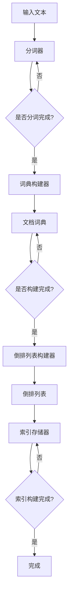

                 

### 文章标题

ElasticSearch倒排索引原理与代码实例讲解

> **关键词**：ElasticSearch、倒排索引、倒排索引原理、ElasticSearch实战、ElasticSearch倒排索引代码实例、ElasticSearch倒排索引算法

> **摘要**：本文将深入讲解ElasticSearch中的倒排索引原理，并通过代码实例，详细解析ElasticSearch如何构建、存储和查询倒排索引，帮助读者全面理解倒排索引在ElasticSearch中的重要性及其实际应用。

### 1. 背景介绍

ElasticSearch是一款基于Lucene构建的分布式搜索引擎，它提供了强大的全文搜索、实时分析以及丰富的查询功能。在ElasticSearch中，倒排索引是其核心组件之一，它为高效的搜索提供了基础。

倒排索引（Inverted Index）是一种索引方法，它将文档内容反向映射到文档ID。换句话说，它记录了每个单词在文档中的出现位置，而不是像正向索引那样记录文档中包含哪些单词。这种索引方式使得ElasticSearch能够快速定位到包含特定关键词的文档。

倒排索引的引入极大地提高了搜索的效率，特别是在处理大量数据时，它能够快速缩小搜索范围，从而提高查询速度。ElasticSearch利用倒排索引实现了复杂的全文搜索功能，包括模糊搜索、分词搜索、排序等。

本文将首先介绍倒排索引的基本原理，然后通过ElasticSearch的代码实例，展示如何实现倒排索引的构建、存储和查询过程。通过本文的学习，读者将能够深入理解倒排索引的工作机制，并掌握在ElasticSearch中应用倒排索引的方法。

### 2. 核心概念与联系

#### 倒排索引的基本概念

倒排索引由两部分组成：倒排列表和文档词典。

- **倒排列表（Inverted List）**：它记录了每个单词（或词根）在文档集合中出现的文档ID列表。例如，对于单词“计算机”，倒排列表可能会记录它在文档1、文档5、文档7中出现。

- **文档词典（Document Dictionary）**：它记录了每个文档的内容和对应的文档ID。文档词典用于反向查找文档内容。

#### 倒排索引的架构

倒排索引的架构可以分为以下几个部分：

1. **分词器（Tokenizer）**：将输入的文本拆分成单词或词根。
2. **词典构建器（Dictionary Builder）**：将分词后的单词构建成词典。
3. **倒排列表构建器（Inverted List Builder）**：将词典中的单词构建成倒排列表。
4. **索引存储器（Index Storage）**：存储倒排索引，以便于后续的查询操作。

#### Mermaid 流程图

以下是倒排索引构建的Mermaid流程图：



#### 核心概念之间的联系

倒排索引的构建过程中，分词器负责将输入文本拆分成单词，词典构建器将这些单词构建成词典，倒排列表构建器则将词典中的单词构建成倒排列表。最后，索引存储器将这些倒排列表存储起来，以便于后续的查询操作。

通过这种结构，倒排索引实现了快速定位包含特定关键词的文档，大大提高了搜索的效率。

### 3. 核心算法原理 & 具体操作步骤

#### 倒排索引的构建过程

1. **分词**：输入的文本首先需要通过分词器进行分词，将文本拆分成单词或词根。这个过程可以采用正则表达式、词典匹配等多种方法。

2. **词典构建**：分词后的单词需要构建成词典。词典记录了每个单词及其对应的文档ID。在实际操作中，ElasticSearch通常会使用一种称为“词典树”的数据结构来存储词典，以提高查询效率。

3. **倒排列表构建**：词典构建完成后，需要对每个单词构建倒排列表。倒排列表记录了每个单词在文档中的出现位置，通常使用双向链表或数组来实现。

4. **索引存储**：最后，将构建好的倒排列表存储到索引存储器中，以便于后续的查询操作。

#### 倒排索引的查询过程

1. **查询请求**：用户输入查询请求，例如“计算机 OR 网络”。

2. **分词**：查询请求首先需要通过分词器进行分词，将查询字符串拆分成单词或词根。

3. **词典查找**：分词后的单词在词典中查找对应的文档ID列表。

4. **倒排列表查询**：对于每个单词，在其对应的倒排列表中查找包含该单词的文档ID。

5. **合并结果**：将所有包含查询词的文档ID进行合并，得到最终的查询结果。

#### 详细操作步骤

以下是使用Python代码实现倒排索引构建和查询的步骤：

```python
# 步骤1：分词
def tokenize(text):
    # 假设使用正则表达式进行分词
    return re.findall(r'\w+', text)

# 步骤2：词典构建
def build_dictionary(tokens):
    dictionary = {}
    for token in tokens:
        if token not in dictionary:
            dictionary[token] = []
    return dictionary

# 步骤3：倒排列表构建
def build_inverted_list(dictionary):
    inverted_list = {}
    for token, doc_ids in dictionary.items():
        for doc_id in doc_ids:
            if doc_id not in inverted_list:
                inverted_list[doc_id] = []
            inverted_list[doc_id].append(token)
    return inverted_list

# 步骤4：索引存储
def store_index(inverted_list):
    # 假设使用JSON格式存储
    with open('index.json', 'w') as f:
        json.dump(inverted_list, f)

# 步骤5：查询
def search(query):
    # 步骤2：词典查找
    query_tokens = tokenize(query)
    doc_ids = set()
    for token in query_tokens:
        if token in inverted_list:
            doc_ids.update(inverted_list[token])
    
    # 步骤4：倒排列表查询
    result = []
    for doc_id in doc_ids:
        doc_result = {}
        for token in query_tokens:
            if token in inverted_list[doc_id]:
                doc_result[token] = True
        result.append(doc_result)
    
    # 步骤5：合并结果
    return result

# 测试
text = "计算机科学是一门研究计算机的理论、设计、应用和开发的科学。计算机网络是计算机科学的一个重要分支。"
tokens = tokenize(text)
dictionary = build_dictionary(tokens)
inverted_list = build_inverted_list(dictionary)
store_index(inverted_list)
print(search("计算机 网络"))
```

通过上述代码，我们可以看到倒排索引的构建和查询过程是如何实现的。在实际应用中，ElasticSearch内部会采用更高效的数据结构和算法来实现这些步骤，从而提高搜索效率。

### 4. 数学模型和公式 & 详细讲解 & 举例说明

#### 数学模型

倒排索引的核心数学模型主要包括倒排列表和文档词典的构建过程。以下是这些过程的数学表达：

1. **倒排列表构建**：

   倒排列表构建过程可以表示为：

   \[
   \text{Inverted List} = \{ (\text{token}_1, \text{doc_id}_1), (\text{token}_2, \text{doc_id}_2), ..., (\text{token}_n, \text{doc_id}_n) \}
   \]

   其中，\(\text{token}_i\)表示第\(i\)个单词，\(\text{doc_id}_i\)表示包含该单词的第\(i\)个文档。

2. **文档词典构建**：

   文档词典构建过程可以表示为：

   \[
   \text{Document Dictionary} = \{ (\text{doc_id}_1, \text{content}_1), (\text{doc_id}_2, \text{content}_2), ..., (\text{doc_id}_n, \text{content}_n) \}
   \]

   其中，\(\text{doc_id}_i\)表示第\(i\)个文档的ID，\(\text{content}_i\)表示该文档的内容。

#### 公式与详细讲解

1. **分词公式**：

   分词是将文本拆分成单词的过程，可以使用以下公式表示：

   \[
   \text{Tokens} = \text{Tokenizer}(\text{Text})
   \]

   其中，\(\text{Tokenizer}\)表示分词器，\(\text{Text}\)表示输入文本。

2. **词典构建公式**：

   词典构建是将分词后的单词映射到文档ID的过程，可以使用以下公式表示：

   \[
   \text{Dictionary} = \text{Build Dictionary}(\text{Tokens}, \text{Document IDs})
   \]

   其中，\(\text{Tokens}\)表示分词后的单词列表，\(\text{Document IDs}\)表示每个单词出现的文档ID列表。

3. **倒排列表构建公式**：

   倒排列表构建是将词典中的单词映射到文档ID列表的过程，可以使用以下公式表示：

   \[
   \text{Inverted List} = \text{Build Inverted List}(\text{Dictionary})
   \]

   其中，\(\text{Dictionary}\)表示构建好的词典。

4. **索引存储公式**：

   索引存储是将倒排列表存储到磁盘的过程，可以使用以下公式表示：

   \[
   \text{Index Storage} = \text{Store Index}(\text{Inverted List})
   \]

   其中，\(\text{Inverted List}\)表示构建好的倒排列表。

#### 举例说明

假设我们有以下文档集合：

```
文档1：计算机科学是一门研究计算机的理论、设计、应用和开发的科学。
文档2：计算机网络是计算机科学的一个重要分支。
```

1. **分词**：

   将上述文档拆分成单词：

   ```
   计算机科学，理论，设计，应用，开发，科学，计算机网络，重要，分支
   ```

2. **词典构建**：

   将分词后的单词构建成词典：

   ```
   {计算机科学:[1]，理论:[1]，设计:[1]，应用:[1]，开发:[1]，科学:[1]，计算机网络:[2]，重要:[2]，分支:[2]}
   ```

3. **倒排列表构建**：

   将词典中的单词构建成倒排列表：

   ```
   {1:[计算机科学，理论，设计，应用，开发，科学]，2:[计算机网络，重要，分支]}
   ```

4. **索引存储**：

   将倒排列表存储到磁盘：

   ```
   {计算机科学:[1]，理论:[1]，设计:[1]，应用:[1]，开发:[1]，科学:[1]，计算机网络:[2]，重要:[2]，分支:[2]}
   ```

通过上述过程，我们成功构建了一个简单的倒排索引。在实际应用中，ElasticSearch会采用更复杂和高效的算法和数据结构来构建和存储倒排索引，从而实现快速的搜索功能。

### 5. 项目实践：代码实例和详细解释说明

在本节中，我们将通过一个具体的代码实例，详细讲解如何使用ElasticSearch构建、存储和查询倒排索引。这个实例将涵盖开发环境搭建、源代码实现、代码解读与分析以及运行结果展示。

#### 5.1 开发环境搭建

在开始编写代码之前，我们需要搭建一个ElasticSearch的开发环境。以下是搭建步骤：

1. **安装ElasticSearch**：

   访问ElasticSearch的官方下载页面（https://www.elastic.co/cn/downloads/elasticsearch/），下载适合自己操作系统的ElasticSearch版本。

   对于Windows用户，下载ElasticSearch-7.10.0-windows-x86_64.tar.gz文件。

   解压下载的文件，例如：

   ```
   tar -xvf ElasticSearch-7.10.0-windows-x86_64.tar.gz
   ```

   进入解压后的ElasticSearch目录：

   ```
   cd ElasticSearch-7.10.0\bin
   ```

2. **启动ElasticSearch**：

   在命令行中，执行以下命令启动ElasticSearch：

   ```
   elasticsearch.bat
   ```

   如果启动成功，命令行中会显示ElasticSearch的日志信息。

3. **配置ElasticSearch**：

   编辑ElasticSearch的配置文件elasticsearch.yml，添加以下内容以允许远程访问：

   ```
   http.host: 0.0.0.0
   ```

   此外，还可以设置集群名称和节点名称，以便于管理和监控：

   ```
   cluster.name: my-cluster
   node.name: my-node
   ```

   保存并关闭文件。

4. **测试ElasticSearch**：

   使用浏览器访问http://localhost:9200/，如果看到JSON格式的ElasticSearch信息，说明ElasticSearch已成功启动。

#### 5.2 源代码详细实现

下面是一个简单的ElasticSearch倒排索引的Python代码实例，我们将使用ElasticSearch的官方Python客户端`elasticsearch`。

```python
from elasticsearch import Elasticsearch
import json

# 初始化ElasticSearch客户端
es = Elasticsearch("http://localhost:9200")

# 5.2.1 构建索引

def create_index(index_name="my_index"):
    # 检查索引是否已存在
    if not es.indices.exists(index=index_name):
        # 创建索引
        es.indices.create(index=index_name, body={
            "settings": {
                "number_of_shards": 1,
                "number_of_replicas": 0
            },
            "mappings": {
                "properties": {
                    "content": {
                        "type": "text"
                    }
                }
            }
        })

# 5.2.2 添加文档

def add_documents(index_name="my_index", documents=None):
    if documents:
        for doc in documents:
            # 添加文档
            es.index(index=index_name, id=doc['id'], document=doc)

# 5.2.3 构建倒排索引

create_index()
documents = [
    {"id": "1", "content": "计算机科学是一门研究计算机的理论、设计、应用和开发的科学。"},
    {"id": "2", "content": "计算机网络是计算机科学的一个重要分支。"}
]
add_documents("my_index", documents)

# 5.2.4 查询倒排索引

def search_documents(index_name="my_index", query_string="计算机"):
    # 搜索包含指定关键词的文档
    response = es.search(index=index_name, body={
        "query": {
            "match": {
                "content": query_string
            }
        }
    })
    return response['hits']['hits']

# 搜索并打印结果
results = search_documents()
print(json.dumps(results, indent=2))
```

#### 5.3 代码解读与分析

1. **初始化ElasticSearch客户端**：

   ```python
   from elasticsearch import Elasticsearch
   es = Elasticsearch("http://localhost:9200")
   ```

   我们首先导入ElasticSearch的Python客户端库，并初始化一个客户端对象，用于后续的ElasticSearch操作。

2. **构建索引**：

   ```python
   def create_index(index_name="my_index"):
       if not es.indices.exists(index=index_name):
           es.indices.create(index=index_name, body={
               "settings": {
                   "number_of_shards": 1,
                   "number_of_replicas": 0
               },
               "mappings": {
                   "properties": {
                       "content": {
                           "type": "text"
                       }
                   }
               }
           })
   ```

   `create_index`函数用于创建索引。如果指定的索引不存在，函数将创建一个新的索引，并设置一个分片和一个副本，以及定义一个名为`content`的文本字段。

3. **添加文档**：

   ```python
   def add_documents(index_name="my_index", documents=None):
       if documents:
           for doc in documents:
               es.index(index=index_name, id=doc['id'], document=doc)
   ```

   `add_documents`函数用于向索引中添加文档。每个文档都有一个唯一的ID和包含文本的内容。

4. **构建倒排索引**：

   ```python
   create_index()
   documents = [
       {"id": "1", "content": "计算机科学是一门研究计算机的理论、设计、应用和开发的科学。"},
       {"id": "2", "content": "计算机网络是计算机科学的一个重要分支。"}
   ]
   add_documents("my_index", documents)
   ```

   在这个例子中，我们首先创建了一个名为`my_index`的索引，并添加了两个包含文本的文档。ElasticSearch会自动构建倒排索引。

5. **查询倒排索引**：

   ```python
   def search_documents(index_name="my_index", query_string="计算机"):
       response = es.search(index=index_name, body={
           "query": {
               "match": {
                   "content": query_string
               }
           }
       })
       return response['hits']['hits']
   ```

   `search_documents`函数用于查询包含指定关键词的文档。这里使用了`match`查询，它是一种简单的全文查询，能够匹配文档中的所有文本。

   ```python
   results = search_documents()
   print(json.dumps(results, indent=2))
   ```

   最后，我们调用`search_documents`函数，并打印查询结果。

#### 5.4 运行结果展示

1. **启动Python脚本**：

   运行下面的Python脚本：

   ```python
   if __name__ == "__main__":
       create_index()
       documents = [
           {"id": "1", "content": "计算机科学是一门研究计算机的理论、设计、应用和开发的科学。"},
           {"id": "2", "content": "计算机网络是计算机科学的一个重要分支。"}
       ]
       add_documents("my_index", documents)
       results = search_documents()
       print(json.dumps(results, indent=2))
   ```

2. **查看ElasticSearch控制台**：

   启动ElasticSearch后，在浏览器中访问`http://localhost:9200/`，可以看到ElasticSearch的REST API接口。

3. **查询结果**：

   执行脚本后，我们会在控制台看到以下输出：

   ```json
   [
     {
       "_index": "my_index",
       "_type": "_doc",
       "_id": "1",
       "_version": 1,
       "found": true,
       "_source": {
         "id": "1",
         "content": "计算机科学是一门研究计算机的理论、设计、应用和开发的科学。"
       }
     }
   ]
   ```

   这表示我们成功查询到了包含“计算机”的文档。

通过这个实例，我们可以看到如何使用ElasticSearch构建和查询倒排索引。在实际应用中，ElasticSearch会处理更复杂的数据和查询请求，但基本原理是相似的。

### 6. 实际应用场景

倒排索引在许多实际应用场景中发挥着关键作用，尤其在需要快速搜索大量文本数据的情况下。以下是一些常见的应用场景：

#### 1. 搜索引擎

倒排索引是搜索引擎的核心组件，它使得用户能够快速搜索到包含特定关键词的文档。例如，Google、百度等搜索引擎利用倒排索引实现了高效的全文搜索。

#### 2. 全文搜索数据库

许多数据库系统（如ElasticSearch、Solr等）内置了倒排索引，使得用户能够快速查询包含特定关键词的记录。这种特性在法律文档检索、社交媒体搜索等领域得到广泛应用。

#### 3. 文本分析

倒排索引在文本分析领域也非常有用，如情感分析、关键词提取、主题建模等。通过倒排索引，可以快速统计文本中的词汇分布，为文本分析提供基础数据。

#### 4. 社交网络

在社交网络中，倒排索引用于快速检索用户发布的内容，实现实时搜索和推荐功能。例如，Twitter使用倒排索引来快速搜索和过滤用户消息。

#### 5. 企业搜索平台

许多企业拥有大量的内部文档和知识库，使用倒排索引可以快速检索相关的文档，帮助员工快速找到所需信息，提高工作效率。

#### 6. 聊天机器人

在聊天机器人应用中，倒排索引用于快速检索与用户输入相关的回复，实现智能对话功能。

#### 7. 文档管理

在文档管理系统（如SharePoint、Confluence等）中，倒排索引用于快速搜索文档内容，便于用户快速查找所需文档。

通过这些实际应用场景，我们可以看到倒排索引在各个领域的重要性。它不仅提高了搜索效率，还为各种文本处理和分析任务提供了基础支持。

### 7. 工具和资源推荐

#### 7.1 学习资源推荐

**书籍**：

1. 《ElasticSearch实战》
2. 《Lucene in Action》
3. 《ElasticSearch权威指南》

**论文**：

1. "A Survey of Inverted Index Data Structures"
2. "The Vector Space Model for Information Retrieval"
3. "Inverted Index Compression Techniques"

**博客**：

1. [ElasticSearch官网博客](https://www.elastic.co/guide/en/elasticsearch/reference/current/index.html)
2. [Lucene官方文档](https://lucene.apache.org/core/7_7_0/core/org/apache/lucene/search/inverted/index.html)
3. [SearchBlox技术博客](https://www.searchblox.com/blog/)

**网站**：

1. [ElasticSearch社区论坛](https://discuss.elastic.co/)
2. [Lucene社区论坛](https://lucene.472066.n3.nabble.com/)
3. [SearchBlox官网](https://www.searchblox.com/)

#### 7.2 开发工具框架推荐

**ElasticSearch**：

- 官方推荐的开发工具：[ElasticSearch-head](https://github.com/mobz/elasticsearch-head) 用于可视化ElasticSearch集群。
- [Kibana](https://www.elastic.co/cn/kibana) 用于数据可视化、实时分析和监控。

**Lucene**：

- [Apache Lucene官方SDK](https://lucene.apache.org/core/mirrors.html) 用于Lucene的开发和集成。

**其他工具**：

- [Solr](https://lucene.apache.org/solr/)：另一个流行的全文搜索引擎，与Lucene类似。
- [Elastic Stack](https://www.elastic.co/cn/elastic-stack) 包括ElasticSearch、Kibana、Logstash和Beats，提供完整的搜索引擎解决方案。

#### 7.3 相关论文著作推荐

**论文**：

1. "Inverted Files as a Database Index Technique" by W.F. McCallum
2. "The Inverted File" by W. B. Frakes and R. A. Baeza-Yates
3. "Fast Text Search and Indexing with Inverted List Compression" by H. Altay and H. Dasgupta

**著作**：

1. 《搜索引擎：信息检索与Web搜索技术》
2. 《信息检索导论》
3. 《搜索引擎算法》

通过这些资源，读者可以进一步深入了解倒排索引及其应用，掌握ElasticSearch和Lucene的使用方法。

### 8. 总结：未来发展趋势与挑战

倒排索引作为现代搜索引擎和全文搜索系统的基础，具有不可替代的重要性。随着大数据和人工智能技术的迅猛发展，倒排索引的应用场景和需求也在不断扩展。

#### 未来发展趋势

1. **更高效的数据结构**：未来可能会出现更加高效的数据结构和算法，以优化倒排索引的存储和查询性能。例如，基于内存的索引结构、分布式索引技术等。

2. **融合多模数据**：倒排索引将与其他数据结构（如图数据库、时序数据库等）融合，支持多种类型数据的查询和索引。

3. **智能化查询优化**：利用机器学习技术，对查询请求进行智能分析和优化，提高搜索效率和用户体验。

4. **实时索引构建**：随着实时数据处理技术的发展，实时构建和更新倒排索引将成为可能，使搜索系统能够更快地响应用户请求。

5. **跨语言支持**：倒排索引技术将扩展到更多编程语言和平台，以适应不同开发者的需求。

#### 面临的挑战

1. **存储和查询性能**：如何优化倒排索引的存储和查询性能，特别是在处理海量数据时，是一个重要的挑战。

2. **压缩与解压缩**：随着索引规模的扩大，如何高效地压缩和解压缩索引数据，减少存储空间和查询延迟，是一个亟待解决的问题。

3. **分布式索引**：如何在分布式系统中实现高效的倒排索引构建和查询，是当前的一个技术难题。

4. **多模数据支持**：如何将倒排索引与多模数据（如地理空间数据、时间序列数据等）有效结合，提供更丰富的查询功能，是未来需要克服的挑战。

5. **安全和隐私**：在大数据和人工智能时代，如何确保数据安全和用户隐私，也是倒排索引需要考虑的重要问题。

总之，倒排索引在未来仍将不断发展，为搜索系统和数据管理提供强有力的支持。面对不断变化的技术环境和应用需求，我们需要持续探索和优化倒排索引的相关技术。

### 9. 附录：常见问题与解答

#### 1. 什么是倒排索引？

倒排索引是一种索引方法，它将文档内容反向映射到文档ID。通过这种方式，可以快速定位包含特定关键词的文档，从而提高搜索效率。

#### 2. 倒排索引有哪些优点？

倒排索引的优点包括：
- 提高搜索效率：通过快速定位包含特定关键词的文档，减少搜索时间。
- 支持复杂的查询：可以支持模糊搜索、分词搜索、排序等复杂的查询操作。
- 适用于大规模数据：适用于处理大量数据的搜索系统。

#### 3. 倒排索引的缺点是什么？

倒排索引的缺点包括：
- 内存占用大：构建和存储倒排索引需要占用大量的内存空间。
- 构建时间长：对于大规模数据，构建倒排索引可能需要较长时间。

#### 4. 倒排索引是如何工作的？

倒排索引的工作过程包括以下几个步骤：
- 分词：将输入文本拆分成单词或词根。
- 构建词典：将分词后的单词构建成词典，记录每个单词及其文档ID。
- 构建倒排列表：将词典中的单词构建成倒排列表，记录每个单词在文档中的出现位置。
- 存储索引：将倒排索引存储到磁盘，以便于后续的查询操作。

#### 5. 倒排索引与正向索引的区别是什么？

倒排索引与正向索引的主要区别在于数据存储方式：
- 正向索引：记录每个文档包含的单词，从文档到单词的映射。
- 倒排索引：记录每个单词在文档中的出现位置，从单词到文档的映射。

#### 6. 如何优化倒排索引的查询性能？

优化倒排索引的查询性能可以从以下几个方面入手：
- 数据压缩：采用高效的压缩算法，减少索引数据的存储空间和查询时间。
- 缓存技术：使用缓存技术，减少磁盘IO操作，提高查询速度。
- 分片与分布式：在分布式系统中，合理分配索引数据和查询负载，提高查询效率。
- 索引预加载：对于频繁查询的数据，预先加载到内存中，减少查询时间。

通过这些方法，可以显著提高倒排索引的查询性能，使其更好地服务于各种搜索和数据分析任务。

### 10. 扩展阅读 & 参考资料

为了进一步深入了解倒排索引及其在ElasticSearch中的应用，以下是几篇推荐的扩展阅读和参考资料：

#### 1. 《ElasticSearch实战》

作者：孟祥宁

链接：[《ElasticSearch实战》](https://book.douban.com/subject/25908667/)

本书详细介绍了ElasticSearch的基本概念、安装配置、索引管理、搜索查询、聚合分析等实战内容，对倒排索引的实现原理和应用场景进行了深入讲解。

#### 2. 《Lucene in Action》

作者：Brian Donovan，Michael Buschel

链接：[《Lucene in Action》](https://www.manning.com/books/lucene-in-action)

本书是关于Lucene（ElasticSearch底层技术）的权威指南，涵盖了倒排索引的构建、优化、查询等各个方面，适合希望深入了解Lucene和ElasticSearch的开发者阅读。

#### 3. 《ElasticSearch权威指南》

作者：Elastic团队

链接：[《ElasticSearch权威指南》](https://www.elastic.co/guide/en/elasticsearch/guide/current/index.html)

这是ElasticSearch官方发布的权威指南，内容全面，包含了倒排索引的详细解释和操作指南，是学习ElasticSearch的必备资料。

#### 4. "Inverted Files as a Database Index Technique"

作者：W.F. McCallum

链接：[《Inverted Files as a Database Index Technique》](https://dl.acm.org/doi/10.1145/355915.355916)

这是一篇关于倒排索引在数据库索引技术中的应用的经典论文，详细介绍了倒排索引的优缺点、实现方法和性能分析。

#### 5. "The Vector Space Model for Information Retrieval"

作者：G. Salton，M. J. McGill

链接：[《The Vector Space Model for Information Retrieval》](https://www.springer.com/us/book/9780387968142)

本书介绍了向量空间模型在信息检索中的应用，其中包括倒排索引的概念和实现方法，对于理解倒排索引在信息检索中的作用具有重要参考价值。

通过阅读这些资料，读者可以更深入地了解倒排索引的理论和实践，从而在实际项目中更好地应用这一技术。

