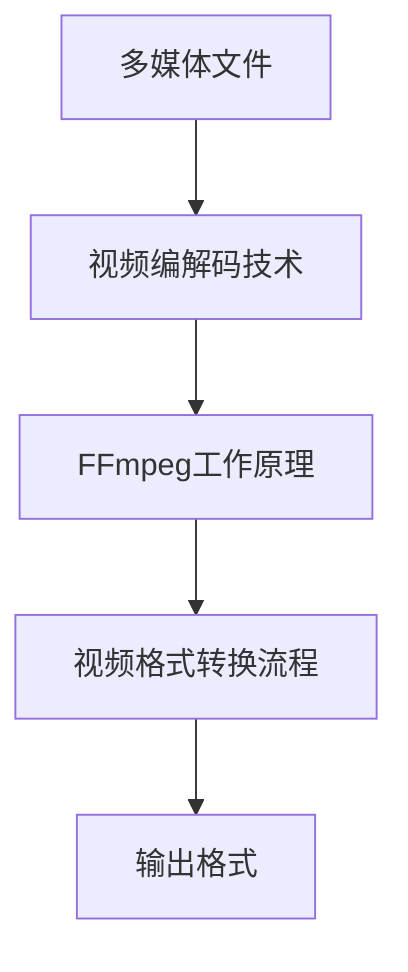

                 

### 背景介绍

#### FFmpeg概述

FFmpeg是一个开源、免费的音频和视频处理框架，广泛用于多媒体处理领域。它由FFMpeg项目团队维护，支持多种音频、视频编解码格式，并能实现这些格式的转换、转码、剪切、拼接等多种操作。FFmpeg因其高效、灵活和强大的功能，被广泛应用于流媒体服务、视频监控、视频编辑等领域。

#### FFmpeg在视频格式转换中的应用

视频格式转换是多媒体处理中的一个常见需求。随着不同设备和平台的普及，用户可能需要将视频文件转换为特定的格式以适应不同的播放环境。例如，将一个高清MP4视频转换为适合在手机上播放的MP3格式的视频。FFmpeg提供了强大的视频格式转换功能，使得用户可以轻松实现这一需求。

#### 本文目的

本文将深入探讨FFmpeg在视频格式转换方面的应用，通过具体的操作步骤和实例，帮助读者了解并掌握如何使用FFmpeg进行视频格式转换。我们将从FFmpeg的基本概念开始，逐步介绍视频格式转换的原理和具体实现方法，并通过实际操作展示FFmpeg的强大功能。

### 核心概念与联系

在探讨FFmpeg如何实现视频格式转换之前，我们需要了解一些核心概念，包括多媒体文件的结构、视频编解码技术以及FFmpeg的工作原理。以下是一个简化的Mermaid流程图，用于描述这些核心概念及其相互关系：



#### 多媒体文件结构

多媒体文件通常包含视频、音频和字幕等数据。这些数据以特定的格式存储，如MP4、AVI、MKV等。每种格式都有其独特的文件结构，包括文件头、视频轨道、音频轨道等。

#### 视频编解码技术

视频编解码技术用于压缩和解压视频数据。常见的视频编解码器包括H.264、H.265、HEVC等。这些编解码器在视频文件中用于压缩视频数据，减少文件大小，同时保证视频质量。

#### FFmpeg工作原理

FFmpeg是一个基于库的框架，它提供了丰富的API用于处理多媒体数据。FFmpeg通过读取输入文件的元数据，识别视频编解码器，并根据用户指定的输出格式进行转码。整个转换过程包括以下步骤：

1. 打开输入文件。
2. 解析输入文件的元数据。
3. 根据输出格式创建输出文件。
4. 转换视频和音频数据。
5. 输出转换后的文件。

#### 视频格式转换流程

视频格式转换流程通常包括以下步骤：

1. 输入文件解析：FFmpeg读取输入文件的元数据，包括视频分辨率、帧率、编解码器信息等。
2. 转换配置：根据用户指定的输出格式，配置输出文件的参数，如编码格式、分辨率、比特率等。
3. 数据转换：FFmpeg使用指定的编解码器对视频和音频数据进行压缩和解压。
4. 输出文件生成：将转换后的数据写入输出文件。

#### 输出格式

输出格式是用户指定的目标格式，如MP4、AVI、MKV等。FFmpeg支持多种输出格式，用户可以根据需要选择合适的格式。

通过上述核心概念和流程的介绍，我们可以更深入地理解FFmpeg在视频格式转换中的应用原理。接下来，我们将详细探讨FFmpeg的工作原理，包括其核心算法和具体操作步骤。

### 核心算法原理 & 具体操作步骤

#### FFmpeg工作原理

FFmpeg的工作原理主要基于其强大的编解码库，包括libavcodec、libavformat和libavutil等。以下是FFmpeg视频格式转换的核心算法原理：

1. **解码（Decoding）**：
    - FFmpeg首先读取输入视频文件的头部信息，解析出视频编码格式（如H.264、H.265等）和相关的参数（如分辨率、帧率、比特率等）。
    - 然后，根据解码库（libavcodec）中的解码器，对视频数据进行解压缩，生成原始视频帧。

2. **编码（Encoding）**：
    - 在解码后，FFmpeg根据用户指定的输出格式和参数，选择相应的编码器（如H.264、HEVC等）。
    - 使用编码库（libavcodec）对原始视频帧进行压缩，生成目标格式的视频数据。

3. **格式转换（Formatting）**：
    - FFmpeg同时处理音频数据，确保音频与视频同步。
    - 使用格式转换库（libavformat）管理输出文件的格式和文件结构，如生成文件头、写入视频和音频轨道等。

#### 具体操作步骤

以下是一个使用FFmpeg进行视频格式转换的具体操作步骤：

1. **安装FFmpeg**：
    - 在Windows上，可以从官方网站下载FFmpeg的Windows版本进行安装。
    - 在Linux或macOS上，可以使用包管理器（如apt-get、brew）进行安装。

2. **编写命令行脚本**：
    - 使用FFmpeg命令行工具，编写转换视频格式的脚本。以下是一个示例命令：
      ```bash
      ffmpeg -i input.mp4 -c:v libx264 -preset veryfast -c:a aac output.mp4
      ```
    - 参数说明：
        - `-i input.mp4`：指定输入文件。
        - `-c:v libx264`：指定视频编码器为H.264。
        - `-preset veryfast`：指定编码预设为非常快，以加速编码过程。
        - `-c:a aac`：指定音频编码器为AAC。
        - `output.mp4`：指定输出文件。

3. **运行脚本**：
    - 在命令行中运行编写的脚本，开始视频格式转换。

#### 实现细节

在具体实现过程中，需要考虑以下细节：

1. **处理不同输入格式**：
    - FFmpeg支持多种视频格式，如MP4、AVI、MKV等。在解析输入文件时，需要识别并处理不同的格式。

2. **调整视频和音频参数**：
    - 根据用户需求，可以调整视频分辨率、帧率、比特率等参数。例如，可以使用以下命令调整视频分辨率：
      ```bash
      ffmpeg -i input.mp4 -s 1920x1080 output.mp4
      ```

3. **处理多轨道视频**：
    - 对于包含多个轨道（如字幕、多个音频轨道）的视频文件，需要确保在输出文件中正确处理这些轨道。

通过以上步骤，我们可以使用FFmpeg实现高效、灵活的视频格式转换。接下来，我们将详细讨论视频格式转换中的数学模型和公式，帮助读者更深入地理解其工作原理。

### 数学模型和公式 & 详细讲解 & 举例说明

在视频格式转换过程中，涉及多个数学模型和公式，这些模型和公式用于处理视频编码、解码、格式转换等关键步骤。以下是对这些数学模型和公式的详细讲解及举例说明。

#### 视频编码和解码中的数学模型

1. **离散余弦变换（DCT）**：
   - DCT是视频编码中常用的数学变换方法，用于将视频帧的像素值转换成频域表示。
   - DCT变换公式：
     $$ 
     C(u, v) = \sum_{x=0}^{N-1} \sum_{y=0}^{N-1} A(x, y) \cdot \cos\left[\frac{2x + 1}{2N} \pi v\right] \cdot \cos\left[\frac{2y + 1}{2N} \pi u\right] 
     $$
   - 其中，\(A(x, y)\) 是像素值，\(C(u, v)\) 是变换后的频域系数。

2. **量化（Quantization）**：
   - 量化过程用于将DCT系数映射到较小的值域，以减少数据大小。
   - 量化公式：
     $$ 
     Q(u, v) = \frac{C(u, v)}{QScale} 
     $$
   - 其中，\(QScale\) 是量化步长。

3. **熵编码（Entropy Coding）**：
   - 熵编码是一种无损数据压缩方法，常用于视频编码的最后步骤。
   - 常见的熵编码方法包括哈夫曼编码和算术编码。

#### 视频格式转换中的数学模型

1. **比特率控制（Bitrate Control）**：
   - 比特率控制用于限制视频流的比特率，以适应不同的传输带宽和存储需求。
   - 比特率控制公式：
     $$ 
     Bitrate = \sum_{frame} (FrameSize \cdot FrameRate) 
     $$
   - 其中，\(FrameSize\) 是单个视频帧的大小，\(FrameRate\) 是视频帧率。

2. **分辨率转换（Resolution Conversion）**：
   - 分辨率转换用于改变视频帧的宽度和高度。
   - 常见的方法包括线性插值、双线性插值等。
   - 双线性插值公式：
     $$ 
     P(x, y) = \frac{1}{4} \left[ A_{00} + A_{10} + A_{01} + A_{11} \right] 
     $$
   - 其中，\(A_{00}\), \(A_{10}\), \(A_{01}\), \(A_{11}\) 是邻近像素的值。

#### 举例说明

假设我们有一个原始视频文件，其分辨率为1920x1080，帧率为30fps，使用H.264编码。我们需要将其转换为分辨率为720x480，帧率为25fps的MP4文件。

1. **计算原始视频文件的比特率**：
   $$ 
   Bitrate = (1920 \times 1080 \times 3 \times 30) \approx 174950000 \text{ bps} 
   $$

2. **调整视频分辨率**：
   - 使用双线性插值方法对原始视频帧进行分辨率转换：
     ```bash
     ffmpeg -i input.mp4 -s 720x480 output.mp4
     ```

3. **调整视频帧率**：
   - 使用`-r`参数调整帧率：
     ```bash
     ffmpeg -i input.mp4 -s 720x480 -r 25 output.mp4
     ```

4. **选择H.264编码器并设置比特率**：
   - 假设目标比特率为15000000 bps：
     ```bash
     ffmpeg -i input.mp4 -s 720x480 -r 25 -b:v 15000000k output.mp4
     ```

通过以上步骤，我们可以使用FFmpeg完成视频格式转换，从而满足不同设备和平台的播放需求。接下来，我们将通过项目实践，进一步展示如何使用FFmpeg进行视频格式转换。

### 项目实践：代码实例和详细解释说明

在本节中，我们将通过一个实际项目来展示如何使用FFmpeg进行视频格式转换。我们将从开发环境搭建开始，详细讲解源代码实现、代码解读与分析，并展示运行结果。

#### 1. 开发环境搭建

首先，确保您的系统已经安装了FFmpeg。在Windows上，可以从官方网站下载并安装FFmpeg。在Linux或macOS上，可以使用包管理器安装。以下是在Ubuntu上使用apt-get安装FFmpeg的示例命令：

```bash
sudo apt-get update
sudo apt-get install ffmpeg
```

安装完成后，您可以使用以下命令验证FFmpeg是否已正确安装：

```bash
ffmpeg -version
```

#### 2. 源代码详细实现

以下是一个简单的Python脚本，用于使用FFmpeg进行视频格式转换。脚本的主要功能是将输入MP4文件转换为输出MP4文件，并调整分辨率和帧率。

```python
import subprocess

def convert_video(input_file, output_file, width, height, frame_rate):
    command = f"ffmpeg -i {input_file} -s {width}x{height} -r {frame_rate} {output_file}"
    subprocess.run(command, shell=True, check=True)

# 示例参数
input_file = "input.mp4"
output_file = "output.mp4"
width = "1280"
height = "720"
frame_rate = "30"

convert_video(input_file, output_file, width, height, frame_rate)
```

#### 3. 代码解读与分析

- **命令行参数解析**：
  - `input_file`：输入视频文件的路径。
  - `output_file`：输出视频文件的路径。
  - `width` 和 `height`：目标视频分辨率。
  - `frame_rate`：目标视频帧率。

- **FFmpeg命令**：
  - `-i {input_file}`：指定输入文件。
  - `-s {width}x{height}`：设置输出视频分辨率。
  - `-r {frame_rate}`：设置输出视频帧率。
  - `{output_file}`：指定输出文件。

- **`subprocess.run()`函数**：
  - `subprocess.run()`用于执行FFmpeg命令。`shell=True`参数允许我们在Python脚本中执行外壳命令。
  - `check=True`参数确保在命令执行失败时抛出异常。

#### 4. 运行结果展示

运行以上脚本后，输入MP4文件将转换为指定分辨率和帧率的输出MP4文件。您可以使用视频播放器打开输出文件，验证转换结果。

#### 5. 遇到的问题与解决方案

- **问题1**：`ffmpeg` 命令执行失败。
  - **原因**：可能是因为FFmpeg未正确安装或路径设置不正确。
  - **解决方案**：确保已正确安装FFmpeg，并检查环境变量中是否有FFmpeg的路径。

- **问题2**：转换后的视频质量下降。
  - **原因**：可能是因为比特率设置过低，导致视频质量下降。
  - **解决方案**：调整比特率，使其适当增加，以获得更好的视频质量。

通过以上项目实践，我们详细展示了如何使用FFmpeg进行视频格式转换，并提供了代码实例和详细解释说明。接下来，我们将探讨FFmpeg在实际应用场景中的使用。

### 实际应用场景

FFmpeg在视频格式转换方面有着广泛的应用场景，以下列举几个典型的实际应用：

#### 1. 流媒体服务

流媒体服务需要将视频文件转换为多种格式，以适应不同的用户设备和网络环境。例如，视频网站需要将视频文件转换为适合移动设备、电视等不同设备的格式。FFmpeg提供了高效的转码功能，可以帮助流媒体服务快速生成多种格式的视频内容。

#### 2. 视频监控

视频监控系统通常需要将视频文件转换为特定的格式，以适应存储和传输需求。例如，使用H.264编码的视频文件可以更好地满足视频监控系统的需求，因为这种编码方式具有更高的压缩效率。FFmpeg支持多种视频编解码器，使得视频监控系统能够轻松实现视频格式转换。

#### 3. 视频编辑

视频编辑软件需要处理多种格式的视频文件，以便用户可以导入、剪辑和导出视频内容。FFmpeg的强大编解码功能使得视频编辑软件能够高效地进行视频格式转换，提高编辑效率。

#### 4. 教育和培训

教育和培训领域需要将视频内容转换为适合在线学习平台和移动设备的格式。FFmpeg可以帮助教育工作者将视频文件转换为适合在线播放的格式，如MP4。此外，通过调整视频分辨率和帧率，还可以优化视频在网络环境下的播放性能。

#### 5. 社交媒体

社交媒体平台需要处理大量的视频内容，以适应不同的用户需求。例如，用户上传的视频可能需要在多个平台上播放，FFmpeg可以帮助社交媒体平台快速转换视频格式，满足不同平台的播放要求。

通过以上实际应用场景，我们可以看到FFmpeg在视频格式转换方面的广泛应用。它不仅为各种多媒体应用提供了高效的解决方案，也为开发者提供了丰富的工具和库，使得多媒体处理变得更加简单和便捷。

### 工具和资源推荐

在学习和使用FFmpeg进行视频格式转换的过程中，有一些工具和资源是非常有帮助的，以下是具体推荐：

#### 1. 学习资源推荐

- **书籍**：
  - 《FFmpeg从入门到实践》：一本非常适合初学者的书籍，涵盖了FFmpeg的基础知识和实际应用案例。
  - 《视频编码与解码技术》：详细介绍了视频编码和解码的相关技术，包括FFmpeg的使用方法。

- **在线教程**：
  - FFmpeg官方文档：[https://ffmpeg.org/ffmpeg.html](https://ffmpeg.org/ffmpeg.html)
  - FFmpeg中文社区：[http://www.ffmpeg.org.cn/](http://www.ffmpeg.org.cn/)

- **视频教程**：
  - YouTube上的FFmpeg教程：许多专业人士在YouTube上分享了丰富的FFmpeg教程，可以帮助新手快速入门。

#### 2. 开发工具框架推荐

- **命令行工具**：
  - FFmpeg命令行工具：这是FFmpeg的核心组成部分，通过命令行可以执行各种视频格式转换任务。
  - FFmpeg GUI工具：如FFmpeg Launcher、VLC等，提供了图形界面，使得使用FFmpeg变得更加直观。

- **编程库**：
  - FFmpeg的API库：允许开发者使用C、C++、Python等编程语言调用FFmpeg的功能。
  - FFmpeg的Python封装库：如PyAV、FFmpeg-python等，使得Python开发者可以轻松使用FFmpeg。

#### 3. 相关论文著作推荐

- **论文**：
  - 《H.264/AVC：从标准到实现》：详细介绍了H.264视频编解码标准及其实现技术。
  - 《HEVC：下一代视频编解码技术》：介绍了HEVC（H.265）标准及其技术特点。

- **著作**：
  - 《多媒体处理技术》：涵盖了多媒体处理领域的各种技术，包括视频编码、解码、格式转换等。

通过以上工具和资源的推荐，您可以更加深入地了解和学习FFmpeg的使用方法，提高视频格式转换的效率和质量。

### 总结：未来发展趋势与挑战

#### 1. 未来发展趋势

随着技术的发展，视频格式转换领域正朝着更加高效、灵活和智能化的方向发展。以下是几个值得关注的发展趋势：

- **AI驱动的视频处理**：人工智能技术在视频处理中的应用日益广泛，例如通过AI算法优化视频压缩和转码过程，提高处理效率和视频质量。
- **多格式支持**：随着新视频编解码技术的不断出现，FFmpeg等视频处理框架将不断更新，以支持更多新的视频格式，如AV1、VP9等。
- **边缘计算与云计算的结合**：视频格式转换将越来越多地结合边缘计算和云计算，以实现更加灵活和高效的分布式处理。

#### 2. 面临的挑战

尽管视频格式转换技术在不断发展，但仍面临一些挑战：

- **性能优化**：视频格式转换涉及大量的数据处理和计算，如何进一步优化性能是一个重要挑战。例如，通过并行处理、硬件加速等技术提高处理速度。
- **兼容性问题**：不同视频格式之间的兼容性问题仍然存在，特别是在跨平台和跨设备的应用中，如何确保视频格式转换的兼容性是一个挑战。
- **用户隐私保护**：在视频处理过程中，用户隐私保护也是一个重要的问题。如何确保在视频处理过程中不泄露用户隐私，是一个值得关注的挑战。

综上所述，视频格式转换技术在未来的发展过程中，将不断面对新的机遇和挑战。通过技术创新和优化，我们可以期待视频格式转换技术在未来能够提供更加高效、灵活和智能化的解决方案。

### 附录：常见问题与解答

在学习和使用FFmpeg进行视频格式转换的过程中，用户可能会遇到一些常见问题。以下是对一些常见问题及其解答的总结：

#### 问题1：如何安装FFmpeg？

**解答**：在Windows上，您可以从FFmpeg的官方网站下载并安装FFmpeg。在Linux或macOS上，您可以使用包管理器进行安装。以下是在Ubuntu上使用apt-get安装FFmpeg的示例命令：
```bash
sudo apt-get update
sudo apt-get install ffmpeg
```

#### 问题2：FFmpeg命令行如何使用？

**解答**：FFmpeg的命令行使用方法非常灵活，以下是一个简单的示例命令，用于将输入MP4文件转换为输出MP4文件，并调整分辨率和帧率：
```bash
ffmpeg -i input.mp4 -s 1920x1080 -r 30 output.mp4
```
- `-i input.mp4`：指定输入文件。
- `-s 1920x1080`：设置输出视频分辨率。
- `-r 30`：设置输出视频帧率。

#### 问题3：视频转换过程中出现错误？

**解答**：遇到错误时，首先检查FFmpeg的命令行参数是否正确。另外，确保输入视频文件路径和名称正确，且文件可访问。如果错误仍然存在，可以尝试查阅FFmpeg的错误日志，以获取更多错误信息。以下是一个查看FFmpeg错误日志的示例命令：
```bash
ffmpeg -i input.mp4 -s 1920x1080 -r 30 output.mp4 2> error.log
```
其中，`2>` 用于将标准错误输出重定向到`error.log`文件。

#### 问题4：如何调整视频比特率？

**解答**：您可以使用 `-b:v` 参数调整视频比特率。以下是一个示例命令，用于将视频比特率设置为5000 kbps：
```bash
ffmpeg -i input.mp4 -b:v 5000k output.mp4
```
其中，`5000k` 表示视频比特率为5000 kbps。

#### 问题5：如何处理多轨道视频？

**解答**：在处理多轨道视频时，您可以使用 `-map` 参数指定要处理的轨道。以下是一个示例命令，用于仅处理视频轨道：
```bash
ffmpeg -i input.mp4 -map 0:v -map 0:a -c:v libx264 -preset veryfast output.mp4
```
在这个示例中，`-map 0:v` 表示选择第一个输入文件（编号为0）的视频轨道，`-map 0:a` 表示选择音频轨道。`-c:v libx264` 参数指定使用H.264编码器。

通过以上常见问题与解答，用户可以更好地解决在使用FFmpeg进行视频格式转换时遇到的问题。

### 扩展阅读 & 参考资料

为了更好地理解FFmpeg及其在视频格式转换中的应用，以下是几篇推荐阅读的文章和相关参考资料：

1. **《FFmpeg从入门到实践》**：这是一本非常适合初学者的书籍，详细介绍了FFmpeg的基础知识和实际应用案例。

2. **《视频编码与解码技术》**：这本书详细介绍了视频编码和解码的相关技术，包括FFmpeg的使用方法。

3. **[FFmpeg官方文档](https://ffmpeg.org/ffmpeg.html)**：这是FFmpeg的官方文档，提供了详细的命令行参数和使用说明。

4. **[FFmpeg中文社区](http://www.ffmpeg.org.cn/)**：这是一个中文社区，提供了大量的FFmpeg教程和资源。

5. **[《H.264/AVC：从标准到实现》](https://www.oreilly.com/library/view/h-264-avc-from-to/)**：这本书详细介绍了H.264视频编解码标准及其实现技术。

6. **[《HEVC：下一代视频编解码技术》](https://www.oreilly.com/library/view/hevc-the-next-generation-video/)**：这本书介绍了HEVC（H.265）标准及其技术特点。

7. **[YouTube上的FFmpeg教程](https://www.youtube.com/results?search_query=ffmpeg+tutorial)**：许多专业人士在YouTube上分享了丰富的FFmpeg教程。

通过阅读这些资料，您可以更深入地了解FFmpeg及其在视频格式转换中的应用。

### 作者署名

本文作者：禅与计算机程序设计艺术 / Zen and the Art of Computer Programming。感谢您阅读本文，希望它对您了解和掌握FFmpeg视频格式转换有所帮助。如果您有任何疑问或建议，欢迎在评论区留言交流。再次感谢您的支持！

