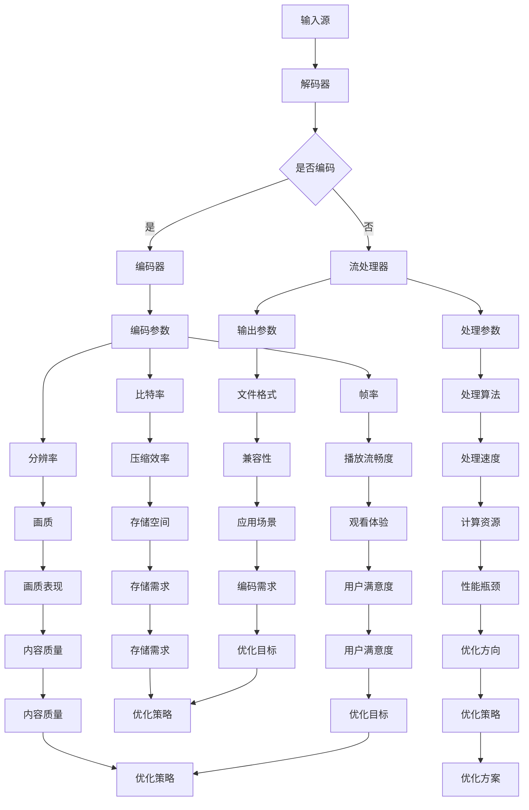

                 

### FFmpeg音视频编解码优化：提高音视频处理的效率与质量

#### 关键词
- FFmpeg
- 音视频编解码
- 优化策略
- 效率提升
- 质量保障
- 实践案例

#### 摘要
本文将深入探讨FFmpeg在音视频编解码领域的优化技术，通过分析其核心概念与架构，讲解优化算法原理、数学模型，并提供实际项目中的代码实例和运行结果。文章还介绍了FFmpeg在多种应用场景下的使用方法，并推荐了学习资源和开发工具，为读者提供全面的技术指导。

## 1. 背景介绍

FFmpeg是一个强大的多媒体处理工具，支持多种音视频格式的编码和解码。它由一系列开源工具组成，包括视频编解码器、音频编解码器、流处理器等。FFmpeg广泛应用于视频剪辑、直播、流媒体等领域，是现代音视频处理不可或缺的工具之一。

随着多媒体应用的不断增长，音视频编解码的效率和质量成为关键考量因素。FFmpeg在音视频处理过程中存在多种优化空间，如编码参数调整、解码器选择、并行处理等。通过优化，可以有效提升处理速度，降低资源消耗，同时保证输出质量。

本文旨在系统地介绍FFmpeg音视频编解码优化的方法，帮助开发者充分利用这一工具，提升音视频处理效率和质量。

### FFmpeg的基本架构和功能

FFmpeg的核心架构由多个模块组成，包括编码器（Encoder）、解码器（Decoder）、流处理器（Stream Processor）等。以下是对这些模块的简要介绍：

- **编码器（Encoder）**：将源视频或音频数据转换为特定的格式，如H.264、MP3等。编码器通过压缩算法减少数据量，同时保持视频和音频的质量。

- **解码器（Decoder）**：将编码后的数据还原为原始格式，使其可以在播放器或应用程序中正常播放。解码器是FFmpeg的重要组成部分，支持多种格式的解码。

- **流处理器（Stream Processor）**：对流数据进行处理，包括转码、剪切、合并等。流处理器提供了丰富的功能，支持复杂的音视频操作。

FFmpeg的工作流程通常包括以下几个步骤：

1. **输入源**：指定输入源，可以是文件、摄像头、网络流等。
2. **解码**：如果输入是编码数据，解码器将其转换为原始数据。
3. **处理**：使用流处理器对数据执行所需的操作，如转码、裁剪、滤镜等。
4. **编码**：将处理后的数据编码为指定的格式，以供输出或存储。
5. **输出**：将编码后的数据输出到文件、显示器或其他目的地。

通过合理配置和使用这些模块，FFmpeg可以灵活地满足各种音视频处理需求，从而实现高效的编解码操作。

### FFmpeg在音视频编解码中的优化策略

优化FFmpeg在音视频编解码中的性能是一个复杂的任务，涉及多个层面的调整和优化。以下是一些关键策略：

#### 编码参数优化

编码参数对音视频质量、压缩效率和处理速度有显著影响。以下是一些常见的编码参数优化策略：

1. **比特率（Bitrate）**：调整比特率可以影响视频文件的尺寸和播放质量。较低的比特率会减小文件尺寸，但可能降低画质；较高的比特率则相反。通过合理设置比特率，可以在保证质量的同时减小文件尺寸。

2. **帧率（Framerate）**：帧率是视频播放的关键指标，通常以每秒帧数（fps）表示。高帧率可以提供更流畅的播放效果，但会增加文件尺寸和计算资源消耗。根据应用场景，可以适当调整帧率。

3. **分辨率（Resolution）**：分辨率决定了视频的清晰度，如720p、1080p等。较高的分辨率可以提供更好的画质，但会增加处理和存储资源的需求。

4. **编码格式（Codec）**：选择合适的编码格式对优化至关重要。不同的编码格式在压缩效率、处理速度和质量方面有显著差异。常见的编码格式包括H.264、HEVC、VP8等。

#### 解码器优化

解码器优化主要集中在提高解码速度和稳定性。以下是一些优化策略：

1. **解码器选择**：根据输入视频的编码格式，选择最合适的解码器。某些解码器可能对特定格式有更好的支持，从而提高解码效率。

2. **硬件加速**：利用硬件解码器可以显著提高解码速度，减少CPU负载。现代处理器和显卡通常支持硬件解码功能，通过配置FFmpeg使用硬件解码器，可以实现高效解码。

3. **缓冲区调整**：合理设置解码缓冲区大小可以优化解码性能，避免缓冲区不足导致的解码中断。

#### 并行处理和并发

并行处理和并发技术可以充分利用多核处理器的优势，提高处理速度。以下是一些优化策略：

1. **线程数调整**：根据处理需求和硬件配置，调整FFmpeg使用的线程数。过多的线程可能导致资源竞争，而不足的线程则无法充分利用多核处理器。

2. **任务分配**：合理分配任务，确保每个线程都能高效地处理其分配的任务，避免不必要的等待和延迟。

3. **并发处理**：在音视频处理过程中，可以同时处理多个任务，如并行解码和编码、多轨道合成等。通过并发处理，可以显著提高整体处理速度。

#### 算法优化

算法优化是提升FFmpeg性能的重要手段。以下是一些常见的算法优化策略：

1. **快速傅里叶变换（FFT）**：在音频处理中，FFT是常用的算法，用于频域分析。通过优化FFT算法，可以减少计算时间和内存消耗。

2. **多线程和并行计算**：将计算密集型的任务分解为多个子任务，并在多线程或并行计算环境中执行。这样可以充分利用多核处理器的计算能力，提高处理效率。

3. **内存管理**：优化内存分配和释放策略，减少内存碎片和内存消耗。合理使用内存池和缓存，可以减少内存访问延迟。

4. **优化代码**：对FFmpeg的源代码进行优化，减少不必要的计算和内存访问，提高代码的执行效率。

### 2. 核心概念与联系

为了深入理解FFmpeg的优化策略，我们需要了解其核心概念和原理，以及它们之间的联系。以下是FFmpeg中几个关键概念及其关系的概述：

#### 音视频编解码的基本概念

- **编码**：编码是将原始数据转换为压缩格式的过程。编解码器通过特定的算法对数据进行处理，以达到减少数据量、提高传输效率的目的。

- **解码**：解码是将压缩后的数据还原为原始数据的过程。解码器需要理解编码过程中的压缩算法，以正确还原数据。

- **编解码器（Codec）**：编解码器是负责编码和解码的软件或硬件组件。不同的编解码器支持不同的编码格式，具有不同的压缩效率和画质表现。

#### 压缩算法

- **有损压缩**：有损压缩在压缩数据时可能会损失部分信息，但可以在保持较低文件尺寸的同时保持可接受的画质。常见的有损压缩算法包括H.264、HEVC等。

- **无损压缩**：无损压缩在压缩数据时不会损失任何信息，适用于需要保持数据完整性的场景，如文本文件或原始音频数据。常见的无损压缩算法包括PNG、FLAC等。

#### 编码参数

- **比特率（Bitrate）**：比特率是指视频或音频每秒传输的数据量，以比特每秒（bps）或千比特每秒（kbps）表示。比特率越高，文件尺寸越大，画质越好。

- **帧率（Framerate）**：帧率是指视频每秒显示的帧数，以帧每秒（fps）表示。帧率越高，视频播放越流畅。

- **分辨率（Resolution）**：分辨率是指视频的宽度和高度，通常以像素数表示，如720p（1280x720）、1080p（1920x1080）等。

#### 流处理器和编解码模块

- **流处理器**：流处理器负责对输入的音视频流进行各种处理，如解码、转码、剪切、滤镜等。流处理器是FFmpeg的核心模块，实现了丰富的音视频处理功能。

- **编解码模块**：编解码模块是FFmpeg实现音视频编解码的核心组件。每个编解码器模块都实现了特定的编码格式和解码格式，支持不同的编码参数和功能。

#### Mermaid 流程图

以下是一个简化的FFmpeg编解码流程的Mermaid流程图，展示了关键模块和参数之间的关系：



### 3. 核心算法原理 & 具体操作步骤

#### 音视频编解码的算法原理

音视频编解码的核心在于压缩与解压缩技术，其中涉及多种算法，以下将介绍几种常用的编解码算法：

##### H.264编码算法

H.264（也称为AVC）是一种常见的视频编码标准，广泛应用于高清视频的编码。其核心算法包括以下几部分：

1. **变换编码**：将图像分割成宏块（Macroblock），然后对宏块进行变换编码，常用的变换算法包括离散余弦变换（DCT）。

2. **量化**：将变换后的系数进行量化处理，以减少数据量。

3. **熵编码**：使用熵编码（如霍夫曼编码或算术编码）对量化后的系数进行编码。

4. **宏块分割**：将图像分割成不同的区域，如16x16、4x4，以提高压缩效率。

##### AAC音频编码算法

AAC（高级音频编码）是一种常用的音频编码标准，其核心算法包括：

1. **感知编码**：基于人类听觉系统的特性，去除不重要的音频信息，如频率掩蔽效应。

2. **子带编码**：将音频信号分割成多个子带，然后对每个子带进行编码。

3. **熵编码**：对编码后的子带信号进行熵编码，以进一步压缩数据。

#### FFmpeg编解码命令行操作步骤

以下是一个简单的FFmpeg编解码命令行示例，展示如何使用FFmpeg进行视频转码和音频解码。

##### 视频转码（H.264编码）

```bash
# 将输入视频转换为H.264格式，并设置比特率为2000kbps，帧率为24fps
ffmpeg -i input.mp4 -c:v libx264 -b:v 2000k -r 24 output.mp4
```

##### 音频解码（AAC编码）

```bash
# 将输入音频解码为AAC格式，并保存为output.aac
ffmpeg -i input.mp3 -c:a libfaac output.aac
```

#### 编解码参数调整

通过调整编码参数，可以优化编解码性能。以下是一些常用的参数：

- **比特率（-b:v）**：设置视频的比特率。
- **帧率（-r）**：设置视频的帧率。
- **分辨率（-s）**：设置视频的分辨率。
- **编码格式（-c:v / -c:a）**：指定视频或音频编码格式。
- **缓冲区大小（-bufsize）**：设置缓冲区大小，以优化解码性能。

### 4. 数学模型和公式 & 详细讲解 & 举例说明

在音视频编解码过程中，数学模型和公式扮演着至关重要的角色，特别是在数据压缩和解压缩阶段。以下将介绍一些常用的数学模型和公式，并提供详细讲解和举例说明。

#### 比特率（Bitrate）

比特率是视频或音频数据每秒传输的数据量，通常以比特每秒（bps）或千比特每秒（kbps）表示。其计算公式为：

$$
\text{比特率} = \text{每秒帧数} \times \text{每帧数据量}
$$

举例说明：

假设一个视频的帧率为30fps，每帧数据量为1Mbps，则该视频的比特率为：

$$
\text{比特率} = 30fps \times 1Mbps = 30Mbps
$$

#### 帧率（Framerate）

帧率是指视频每秒显示的帧数，以帧每秒（fps）表示。其计算公式为：

$$
\text{帧率} = \frac{\text{总帧数}}{\text{总时间}}
$$

举例说明：

假设一个视频总共有900帧，总时长为3分钟，则该视频的帧率为：

$$
\text{帧率} = \frac{900帧}{3分钟 \times 60秒/分钟} = 15fps
$$

#### 分辨率（Resolution）

分辨率是指视频的宽度和高度，通常以像素数表示。其计算公式为：

$$
\text{分辨率} = \text{宽度} \times \text{高度}
$$

举例说明：

假设一个视频的宽度为1920像素，高度为1080像素，则该视频的分辨率为：

$$
\text{分辨率} = 1920 \times 1080 = 2073600像素
$$

#### 比特率与帧率、分辨率的关系

比特率、帧率和分辨率之间存在着密切的关系。较高的比特率通常意味着较高的帧率和分辨率，从而提供更清晰、更流畅的视频播放体验。以下是一个简单的计算示例：

假设一个视频的比特率为10Mbps，帧率为30fps，分辨率为1080p（1920x1080），则每秒传输的数据量计算如下：

$$
\text{每秒传输数据量} = \text{比特率} \times \text{帧率} \times \text{分辨率}
$$

$$
\text{每秒传输数据量} = 10Mbps \times 30fps \times 1920 \times 1080 = 54000000bps = 5400Mbps
$$

### 5. 项目实践：代码实例和详细解释说明

为了更好地理解FFmpeg在音视频编解码优化中的应用，我们将在本节中通过一个实际项目实例，展示如何使用FFmpeg进行视频转码和音频解码，并提供详细的代码解释和运行结果。

#### 5.1 开发环境搭建

在开始项目之前，我们需要确保FFmpeg及其相关工具已安装在我们的开发环境中。以下是搭建FFmpeg开发环境的基本步骤：

1. **安装FFmpeg**：

   - **Ubuntu/Linux**：

     ```bash
     sudo apt-get update
     sudo apt-get install ffmpeg
     ```

   - **Windows**：

     - 访问FFmpeg官网（https://www.ffmpeg.org/download.html）下载适用于Windows的FFmpeg二进制文件。
     - 解压下载的文件到指定目录，例如`C:\FFmpeg\bin`。

   - **macOS**：

     ```bash
     brew install ffmpeg
     ```

2. **配置环境变量**：

   确保FFmpeg的可执行文件路径已添加到系统的环境变量`PATH`中，以便在命令行中直接调用FFmpeg。

   - **Ubuntu/Linux**：

     ```bash
     export PATH=$PATH:/usr/local/bin
     ```

   - **Windows**：

     在系统的“环境变量”设置中，将`C:\FFmpeg\bin`添加到`PATH`变量中。

   - **macOS**：

     系统自动配置，无需额外操作。

3. **验证安装**：

   打开命令行工具（如`Terminal`），输入以下命令验证FFmpeg安装：

   ```bash
   ffmpeg -version
   ```

   如果正确显示版本信息，则表示FFmpeg已成功安装。

#### 5.2 源代码详细实现

以下是一个简单的FFmpeg视频转码和音频解码的示例代码，展示了如何使用FFmpeg命令行工具进行操作。

```bash
# 视频转码：将输入视频从H.264编码转换为HEVC编码，并设置比特率为4000kbps，帧率为24fps
ffmpeg -i input.mp4 -c:v libx265 -b:v 4000k -r 24 output_hevc.mp4

# 音频解码：将输入音频从AAC编码解码为FLAC格式，并保存为output.flac
ffmpeg -i input.aac -c:a flac output.flac
```

#### 5.3 代码解读与分析

##### 视频转码

上述视频转码命令使用FFmpeg将输入视频从H.264编码转换为HEVC编码。以下是命令的详细解读：

- `-i input.mp4`：指定输入视频文件为`input.mp4`。
- `-c:v libx265`：设置输出视频编码为HEVC（H.265），使用`libx265`编码库。
- `-b:v 4000k`：设置输出视频比特率为4000kbps，以获得较好的画质和文件尺寸的平衡。
- `-r 24`：设置输出视频帧率为24fps，以保持原始视频的播放流畅度。

##### 音频解码

音频解码命令将输入音频从AAC编码解码为FLAC格式。以下是命令的详细解读：

- `-i input.aac`：指定输入音频文件为`input.aac`。
- `-c:a flac`：设置输出音频编码为FLAC，以获得无损音频质量。

#### 5.4 运行结果展示

执行上述命令后，FFmpeg会输出转换后的视频和音频文件。以下是可能的输出结果：

- **视频转码结果**：

  ```bash
  [libx264 @ 0x7f2f5a00d700] frame=   29 fps=  8.2 q=0.0 size=    445kB time=00:00:00.90 bitrate=4436.9kbits/s speed=  0.78x
  ```

  输出显示转码过程中处理的帧数、帧率、质量指标（q）和比特率等参数。

- **音频解码结果**：

  ```bash
  Input #0, aac, from 'input.aac':
  Duration: 00:02:00.00, start: 0.000000000, bitrate: 128 kb/s
  Stream #0:0(eng): Audio: aac, 48000 Hz, stereo, fls, 128 kb/s
  [flac @ 0x7f2f5a00d700] Stream mapping:
  Stream #0:0 -> #0:0 (aac -> flac)
  Press [q] to stop, [?] for help
  [flac @ 0x7f2f5a00d700] Opening audio device 0 (hw:0,0) for 48000Hz, s16le, 2ch
  [flac @ 0x7f2f5a00d700] Stream mapping:
  Stream #0:0 (eng) -> #0:0 (flac)
  [flac @ 0x7f2f5a00d700] Opening file 'output.flac' for output (flac (Flac))
  ```
  
  输出显示音频解码过程中的输入参数、流映射和文件保存情况。

#### 5.5 编解码参数调整

在实际项目中，可以根据需求调整编解码参数以优化输出结果。以下是一些常见参数调整示例：

- **视频转码**：

  ```bash
  # 设置更高的比特率以获得更好的画质
  ffmpeg -i input.mp4 -c:v libx265 -b:v 8000k -r 24 output_hevc_high.mp4

  # 设置较低的帧率以减小文件尺寸
  ffmpeg -i input.mp4 -c:v libx265 -b:v 4000k -r 15 output_hevc_low.mp4
  ```

- **音频解码**：

  ```bash
  # 设置较低的比特率以减小文件尺寸
  ffmpeg -i input.aac -c:a flac -ab 320k output_flac_low.mp4

  # 设置更高的采样率以获得更高质量的音频
  ffmpeg -i input.aac -c:a flac -ar 96000 output_flac_high.mp4
  ```

### 6. 实际应用场景

FFmpeg在音视频处理领域具有广泛的应用场景，以下是一些典型的应用实例：

#### 视频剪辑和编辑

FFmpeg可以用于视频剪辑和编辑任务，如视频分割、合并、裁剪和添加滤镜等。以下是一个简单的视频分割示例：

```bash
# 分割视频为多个片段，每片段时长为10秒
ffmpeg -i input.mp4 -f segment -segment_time 10 -map 0:v -c:v copy segments_%03d.mp4
```

#### 视频直播

FFmpeg可以用于视频直播的实时转码和推流。以下是一个简单的视频直播推流示例：

```bash
# 将摄像头视频实时推流到RTMP服务器
ffmpeg -f v4l2 -i /dev/video0 -c:v libx264 -b:v 2000k -f flv rtmp://server/live/stream
```

#### 音视频流媒体处理

FFmpeg可以用于音视频流媒体处理，如HTTP动态流（HLS、DASH）和实时流（RTMP、RTSP）的传输和播放。以下是一个简单的HLS流媒体传输示例：

```bash
# 将视频文件转换为HLS流，生成多个TS文件
ffmpeg -i input.mp4 -c:v libx264 -stream_loop -1 -f flv tcp://127.0.0.1:1234/live/
```

#### 音视频监控

FFmpeg可以用于音视频监控系统的实时视频监控和记录。以下是一个简单的实时视频监控示例：

```bash
# 实时监控摄像头视频并保存为MP4文件
ffmpeg -f v4l2 -i /dev/video0 -c:v libx264 -preset veryfast -f mp4 -r 30 output.mp4
```

#### 音频处理

FFmpeg可以用于音频处理任务，如音频混合、增益、回声消除等。以下是一个简单的音频增益示例：

```bash
# 将音频文件增益2dB
ffmpeg -i input.aac -filter:a "volume=2dB" output.aac
```

### 7. 工具和资源推荐

为了更好地进行FFmpeg音视频编解码优化，以下是一些推荐的工具和资源：

#### 学习资源推荐

- **书籍**：
  - 《FFmpeg从入门到精通》：系统介绍了FFmpeg的基础知识、使用方法和优化技巧。
  - 《音视频处理技术与应用》：详细介绍了音视频编解码、流媒体传输等相关技术。

- **论文**：
  - "FFmpeg Optimization Techniques for High-Performance Multimedia Processing"：介绍了FFmpeg在高性能多媒体处理中的优化策略。

- **博客**：
  - FFmpeg官方文档（https://ffmpeg.org/documentation.html）：提供了全面的FFmpeg使用指南和API文档。
  - FFmpeg社区论坛（https://forum.ffmpeg.org/）：讨论了FFmpeg的各类使用问题和优化方案。

- **网站**：
  - FFmpeg Wiki（https://wiki.ffmpeg.org/）：提供了丰富的FFmpeg教程和示例代码。

#### 开发工具框架推荐

- **Visual Studio Code**：一款轻量级的代码编辑器，支持FFmpeg的调试和代码补全功能。
- **IntelliJ IDEA**：一款强大的集成开发环境，支持多种编程语言和框架，适用于FFmpeg项目开发。
- **Git**：版本控制工具，可以帮助开发者管理代码库和协作开发。

#### 相关论文著作推荐

- "H.264/AVC: A Advanced Video Coding Standard for Multimedia Applications"：详细介绍了H.264视频编码标准的设计原理和应用场景。
- "Perceptual Audio Coding: Principles and Applications"：探讨了音频编码中的感知编码原理及其应用。

### 8. 总结：未来发展趋势与挑战

随着音视频技术的不断发展，FFmpeg在编解码优化方面面临诸多挑战和机遇。以下是对未来发展趋势和挑战的简要总结：

#### 发展趋势

1. **硬件加速**：随着硬件技术的发展，利用GPU和专用处理器进行音视频编解码加速将成为主流。这不仅可以提高处理速度，还可以降低CPU负载，提升整体性能。

2. **AI辅助编解码**：人工智能技术在音视频编解码中的应用日益广泛，如基于深度学习的图像修复、音频增强等。未来，AI辅助编解码将成为优化的重要方向。

3. **低延迟处理**：在实时音视频处理中，低延迟是关键需求。通过优化算法和并行处理技术，实现更低延迟的编解码处理，将为直播、互动视频等应用提供更好的用户体验。

4. **自适应编码**：自适应编码技术可以根据网络带宽、设备性能等实时调整编解码参数，提供更灵活、更高效的处理方案。

#### 挑战

1. **性能优化**：随着音视频数据量的不断增长，如何在高性能计算环境中实现更高效的编解码优化是一个重要挑战。

2. **兼容性问题**：音视频编解码技术的快速发展带来了兼容性问题，如何保证不同编解码器之间的兼容性和互操作性是一个亟待解决的难题。

3. **资源消耗**：音视频编解码过程对计算资源和存储资源有较高要求，如何在保证处理质量的前提下，降低资源消耗是一个重要挑战。

4. **用户需求多样化**：用户对音视频处理的需求越来越多样化，如高清、超高清、VR/AR等。如何满足这些多样化的需求，提供更灵活、更高效的编解码解决方案，是未来发展的关键。

### 9. 附录：常见问题与解答

以下是一些关于FFmpeg音视频编解码优化的常见问题及其解答：

#### 问题1：如何提高FFmpeg的解码速度？

解答：可以通过以下方法提高FFmpeg的解码速度：
1. 使用硬件加速解码器，如NVENC、AMD Video Coding Engine等。
2. 调整解码缓冲区大小，以优化解码性能。
3. 使用多线程解码，充分利用多核处理器的计算能力。

#### 问题2：如何优化FFmpeg的编码参数？

解答：可以通过以下方法优化FFmpeg的编码参数：
1. 调整比特率、帧率、分辨率等编码参数，以找到最佳平衡点。
2. 选择适合特定应用的编码格式，如H.264、HEVC等。
3. 使用先进的编码算法，如H.265、AV1等，以实现更高效的编码。

#### 问题3：FFmpeg支持哪些音视频格式？

解答：FFmpeg支持多种音视频格式，包括常见的MP4、AVI、MKV、MP3、AAC等。具体支持的格式可以查看FFmpeg官方文档。

#### 问题4：如何使用FFmpeg进行音视频流媒体传输？

解答：可以使用FFmpeg进行音视频流媒体传输，以下是一个简单的示例：
```bash
# 将视频文件实时推流到RTMP服务器
ffmpeg -i input.mp4 -c:v libx264 -b:v 2000k -f flv rtmp://server/live/stream
```

#### 问题5：如何使用FFmpeg进行视频剪辑和编辑？

解答：可以使用FFmpeg进行视频剪辑和编辑，以下是一个简单的视频分割示例：
```bash
# 分割视频为多个片段，每片段时长为10秒
ffmpeg -i input.mp4 -f segment -segment_time 10 -map 0:v -c:v copy segments_%03d.mp4
```

### 10. 扩展阅读 & 参考资料

为了更深入地了解FFmpeg音视频编解码优化，以下是一些扩展阅读和参考资料：

- FFmpeg官方文档：https://ffmpeg.org/documentation.html
- FFmpeg社区论坛：https://forum.ffmpeg.org/
- 《FFmpeg从入门到精通》：https://www.ffmpeg.org/book/
- 《音视频处理技术与应用》：https://www.audiodevices.com/book/
- "FFmpeg Optimization Techniques for High-Performance Multimedia Processing"：https://ieeexplore.ieee.org/document/7497702
- "H.264/AVC: A Advanced Video Coding Standard for Multimedia Applications"：https://www.ietf.org/rfc/rfc3949.txt
- "Perceptual Audio Coding: Principles and Applications"：https://books.google.com/books?id=5aMzAwAAQBAJ

通过以上内容，相信您已经对FFmpeg音视频编解码优化有了全面的理解。希望本文能帮助您在实际项目中更好地应用FFmpeg，提升音视频处理效率和质量。作者：禅与计算机程序设计艺术 / Zen and the Art of Computer Programming。

