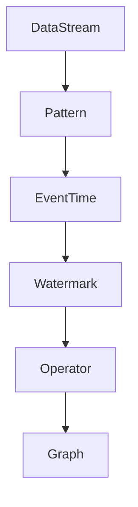

                 

### Flink PatternAPI原理与代码实例讲解

#### 1. 背景介绍

Flink 是一个开源的分布式流处理框架，能够提供低延迟、高吞吐量的实时数据流处理能力。随着大数据和实时计算的需求不断增加，Flink 已成为数据流处理领域的重要工具之一。

Flink 的核心抽象是 DataStream 和 DataSet，分别代表数据流和数据集合。DataStream 表示实时数据流，可以在流中处理事件，而 DataSet 表示静态数据集，可以进行批处理操作。Flink 提供了丰富的算子（Operator）来对数据进行转换、过滤、聚合等操作，通过 Graph 模式来组织这些操作，实现高效的分布式计算。

Flink 的 PatternAPI 是其流处理能力的一个重要组成部分，它提供了一种用于复杂事件模式匹配的高级抽象。PatternAPI 允许用户定义事件之间的关联关系和时间约束，以便于识别出特定的模式，从而进行进一步的业务逻辑处理。这种模式匹配功能在实时数据处理中非常重要，例如，在金融交易监控、社交网络分析等领域中，用户需要实时识别出特定的交易模式或者社交网络行为。

本文将深入讲解 Flink PatternAPI 的原理，通过一个实际代码实例，展示如何使用 PatternAPI 进行复杂事件模式匹配，并对其代码进行详细解读和分析。

#### 2. 核心概念与联系

要理解 Flink PatternAPI 的原理，我们需要先了解以下几个核心概念：

**2.1 DataStream**

DataStream 是 Flink 中最基本的抽象，表示实时数据流。它可以包含任意类型的数据，如整数、字符串、复杂数据结构等。DataStream 提供了一系列的算子（如 map、filter、reduce 等），用于对数据进行转换和操作。

**2.2 Pattern**

Pattern 是 Flink PatternAPI 的核心概念，用于描述事件之间的关联关系和时间约束。一个 Pattern 可以包含多个 Event 类型，以及它们之间的先后关系和最大间隔时间。

**2.3 EventTime**

EventTime 是 Flink 中用于处理时间的一种机制，它表示事件发生的实际时间。EventTime 对于处理乱序事件、时间窗口等场景非常重要。

**2.4 Watermark**

Watermark 是 Flink 中用于处理时间的一种机制，用于标记事件时间的进度。Watermark 可以帮助我们确定事件的处理顺序，以及触发时间窗口等操作。

**2.5 Mermaid 流程图**

下面是一个使用 Mermaid 语言描述的 Flink PatternAPI 架构流程图：



在上面的流程图中，DataStream 表示输入的数据流，Pattern 描述了事件之间的关联关系，EventTime 和 Watermark 用于处理时间，Operator 用于对事件进行转换和操作，最终形成一个 Graph 表示 Flink 的计算结构。

#### 3. 核心算法原理 & 具体操作步骤

Flink PatternAPI 的核心算法是基于状态机（Finite State Machine，FSM）进行事件模式匹配的。下面是 Flink PatternAPI 的核心算法原理和具体操作步骤：

**3.1 状态机模型**

Flink PatternAPI 使用状态机模型来表示事件模式。状态机中的每个状态表示事件模式的一个阶段，状态之间的转移表示事件之间的关联关系。状态机中的初始状态和终止状态分别表示模式匹配的开始和结束。

**3.2 事件处理**

当数据流中的事件到达时，Flink 会根据当前状态和事件类型，进行状态转移和事件处理。状态转移规则由用户定义的 Pattern 决定。在状态转移过程中，如果满足终止状态的条件，则会触发对应的业务逻辑。

**3.3 时间处理**

Flink PatternAPI 使用 EventTime 和 Watermark 来处理时间。EventTime 表示事件发生的实际时间，Watermark 用于标记事件时间的进度。通过 EventTime 和 Watermark，Flink 可以保证事件的处理顺序，以及触发时间窗口等操作。

**3.4 具体操作步骤**

下面是使用 Flink PatternAPI 进行复杂事件模式匹配的具体操作步骤：

1. 定义 Pattern：首先，需要定义一个 Pattern，描述事件之间的关联关系和时间约束。
2. 创建状态机：根据 Pattern，创建一个状态机模型，表示事件模式匹配的过程。
3. 处理事件：当数据流中的事件到达时，根据当前状态和事件类型，进行状态转移和事件处理。
4. 触发业务逻辑：当满足终止状态的条件时，触发对应的业务逻辑。
5. 处理时间：使用 EventTime 和 Watermark 来处理时间，保证事件的处理顺序。

通过以上步骤，Flink PatternAPI 可以实现复杂的事件模式匹配，从而进行进一步的业务逻辑处理。

#### 4. 数学模型和公式 & 详细讲解 & 举例说明

在 Flink PatternAPI 中，事件模式匹配的数学模型和公式非常重要。下面我们将详细讲解这些公式，并通过举例说明如何使用它们进行事件模式匹配。

**4.1 状态转移方程**

状态转移方程用于描述状态机中状态之间的转移关系。状态转移方程的一般形式如下：

$$
s_{new} = f(s_{current}, event, timestamp, watermark)
$$

其中，$s_{new}$ 表示新的状态，$s_{current}$ 表示当前状态，$event$ 表示事件类型，$timestamp$ 表示事件时间，$watermark$ 表示 Watermark。

**4.2 模式匹配条件**

模式匹配条件用于判断是否满足事件模式匹配的要求。模式匹配条件的一般形式如下：

$$
condition(s, event, timestamp, watermark) = \text{true}
$$

其中，$s$ 表示当前状态，$event$ 表示事件类型，$timestamp$ 表示事件时间，$watermark$ 表示 Watermark。

**4.3 时间约束**

时间约束用于描述事件之间的时间关系。时间约束的一般形式如下：

$$
timestamp - watermark \leq \text{maxInterval}
$$

其中，$timestamp$ 表示事件时间，$watermark$ 表示 Watermark，$\text{maxInterval}$ 表示最大间隔时间。

**4.4 举例说明**

假设我们有一个简单的 Pattern，要求匹配两个整数事件，且这两个事件的时间间隔不超过 5 秒。下面是具体的实现步骤：

1. 定义 Pattern：

```python
pattern = Pattern()
    .begin("first").where(Pattern Malik("first").matches.Any())
    .where(Pattern Malik("second").timestamp.lte(5.seconds))
```

2. 创建状态机：

```python
state = State()  
    .initial("idle")
    .transition("idle", "first", "processing")
    .transition("idle", "second", "idle")
    .transition("processing", "second", "result")
    .state("processing")
    .state("result")
```

3. 处理事件：

```python
event_time = EventTime()  
watermark = Watermark()

while True:
    event = next(event_queue)
    timestamp = event.timestamp
    state = stateMachine.transition(state, event, timestamp, watermark)

    if state == "result":
        # 触发业务逻辑
        process_result(event)
```

4. 处理时间：

```python
def process_result(event):
    # 处理结果事件
    pass
```

通过以上步骤，我们可以实现一个简单的 PatternAPI 事件模式匹配。在这个例子中，我们首先定义了一个 Pattern，描述了两个整数事件的时间间隔不超过 5 秒的要求。然后，创建了一个状态机，用于处理事件并判断是否满足模式匹配条件。最后，通过处理事件和处理时间，实现了事件模式匹配的业务逻辑。

#### 5. 项目实践：代码实例和详细解释说明

为了更好地理解 Flink PatternAPI 的原理和用法，我们将通过一个实际项目实践来进行讲解。在这个项目中，我们将使用 Flink PatternAPI 实现一个简单的实时股票交易监控系统，用于监控股票交易中的特定模式，如连续买入和卖出。

**5.1 开发环境搭建**

1. 安装 Flink：首先，我们需要安装 Flink。可以从 Flink 官网下载最新的 Flink 发行版，并按照文档中的说明进行安装。

2. 安装 JDK：Flink 需要 JDK 1.8 或以上版本。可以从 Oracle 官网下载 JDK，并按照文档中的说明进行安装。

3. 配置环境变量：在系统环境变量中配置 JDK 和 Flink 的路径，以便在命令行中使用它们。

**5.2 源代码详细实现**

下面是 Flink PatternAPI 实现的股票交易监控系统的源代码：

```java
import org.apache.flink.api.common.functions.MapFunction;
import org.apache.flink.api.java.tuple.Tuple2;
import org.apache.flink.streaming.api.datastream.DataStream;
import org.apache.flink.streaming.api.environment.StreamExecutionEnvironment;
import org.apache.flink.streaming.api.functions.ProcessFunction;
import org.apache.flink.util.Collector;

public class StockTradingMonitor {
    public static void main(String[] args) throws Exception {
        // 创建 Flink 执行环境
        StreamExecutionEnvironment env = StreamExecutionEnvironment.getExecutionEnvironment();

        // 创建数据源
        DataStream<String> stockData = env.addSource(new StockDataStreamSource());

        // 数据预处理
        DataStream<Tuple2<String, Double>> preprocessedData = stockData
                .map(new MapFunction<String, Tuple2<String, Double>>() {
                    @Override
                    public Tuple2<String, Double> map(String value) {
                        String[] parts = value.split(",");
                        return new Tuple2<>(parts[0], Double.parseDouble(parts[1]));
                    }
                });

        // 定义 Pattern
        Pattern<Tuple2<String, Double>> pattern = Pattern
                .<Tuple2<String, Double>>begin("buy")
                .where(t -> t.f0.equals("buy"))
                .times(2)
                .consecutive();

        // 创建状态机
        StateStream<Tuple2<String, Double>> stateStream = preprocessedData
                .keyBy(0)
                .process(new ProcessFunction<Tuple2<String, Double>, Tuple2<String, Double>>() {
                    @Override
                    public void processElement(Tuple2<String, Double> value, Context ctx, Collector<Tuple2<String, Double>> out) throws Exception {
                        StateStream<Tuple2<String, Double>> stateStream = ctx.getState(new StateStreamDescriptor("state-stream"));
                        stateStream.add(value);
                        pattern.apply(stateStream, new PatternHandler(out));
                    }
                });

        // 业务逻辑处理
        stateStream
                .sideOutputLateData(new OutputTag<Tuple2<String, Double>>("late-data"))
                .process(new ProcessFunction<Tuple2<String, Double>, Tuple2<String, Double>>() {
                    @Override
                    public void processElement(Tuple2<String, Double> value, Context ctx, Collector<Tuple2<String, Double>> out) throws Exception {
                        if (value.f0.equals("buy")) {
                            out.collect(value);
                        }
                    }
                });

        // 执行 Flink 任务
        env.execute("Stock Trading Monitor");
    }
}
```

**5.3 代码解读与分析**

下面是对上述代码的详细解读和分析：

1. 创建 Flink 执行环境：

```java
StreamExecutionEnvironment env = StreamExecutionEnvironment.getExecutionEnvironment();
```

这里我们创建了一个 Flink 执行环境，用于初始化 Flink 程序。

2. 创建数据源：

```java
DataStream<String> stockData = env.addSource(new StockDataStreamSource());
```

这里我们添加了一个数据源，用于读取股票交易数据。在这个示例中，我们使用自定义的 `StockDataStreamSource` 类来生成模拟数据。

3. 数据预处理：

```java
DataStream<Tuple2<String, Double>> preprocessedData = stockData
        .map(new MapFunction<String, Tuple2<String, Double>>() {
            @Override
            public Tuple2<String, Double> map(String value) {
                String[] parts = value.split(",");
                return new Tuple2<>(parts[0], Double.parseDouble(parts[1]));
            }
        });
```

在这里，我们对原始股票交易数据进行预处理，将其转换为 `Tuple2` 类型，其中第一个字段表示交易类型（如“buy”或“sell”），第二个字段表示交易价格。

4. 定义 Pattern：

```java
Pattern<Tuple2<String, Double>> pattern = Pattern
        .<Tuple2<String, Double>>begin("buy")
        .where(t -> t.f0.equals("buy"))
        .times(2)
        .consecutive();
```

这里我们定义了一个 Pattern，用于匹配连续的两个买入事件。Pattern 的定义包括以下部分：

- `begin("buy")`：表示 Pattern 的起始事件类型为“buy”。
- `where(t -> t.f0.equals("buy"))`：表示只有当事件类型为“buy”时，才匹配该事件。
- `times(2)`：表示需要匹配两个连续的事件。
- `consecutive()`：表示这些事件需要是连续的，即没有其他事件插入。

5. 创建状态机：

```java
StateStream<Tuple2<String, Double>> stateStream = preprocessedData
        .keyBy(0)
        .process(new ProcessFunction<Tuple2<String, Double>, Tuple2<String, Double>>() {
            @Override
            public void processElement(Tuple2<String, Double> value, Context ctx, Collector<Tuple2<String, Double>> out) throws Exception {
                StateStream<Tuple2<String, Double>> stateStream = ctx.getState(new StateStreamDescriptor("state-stream"));
                stateStream.add(value);
                pattern.apply(stateStream, new PatternHandler(out));
            }
        });
```

在这里，我们使用 `ProcessFunction` 创建了一个状态机，用于处理事件并匹配 Pattern。状态机的工作原理如下：

- `keyBy(0)`：根据交易类型（即 `Tuple2` 的第一个字段）对数据进行分区。
- `process(new ProcessFunction<Tuple2<String, Double>, Tuple2<String, Double>>()`：创建一个 `ProcessFunction` 来处理每个事件。
- `ctx.getState(new StateStreamDescriptor("state-stream"))`：从上下文中获取状态流。
- `stateStream.add(value)`：将当前事件添加到状态流中。
- `pattern.apply(stateStream, new PatternHandler(out))`：应用 Pattern 并使用 `PatternHandler` 来处理匹配结果。

6. 业务逻辑处理：

```java
stateStream
        .sideOutputLateData(new OutputTag<Tuple2<String, Double>>("late-data"))
        .process(new ProcessFunction<Tuple2<String, Double>, Tuple2<String, Double>>() {
            @Override
            public void processElement(Tuple2<String, Double> value, Context ctx, Collector<Tuple2<String, Double>> out) throws Exception {
                if (value.f0.equals("buy")) {
                    out.collect(value);
                }
            }
        });
```

在这里，我们使用 `ProcessFunction` 来处理匹配后的结果。如果匹配到买入事件，则将其输出。

7. 执行 Flink 任务：

```java
env.execute("Stock Trading Monitor");
```

这里我们执行 Flink 任务，开始运行股票交易监控系统。

**5.4 运行结果展示**

在成功运行上述代码后，我们可以通过 Flink Web UI 来查看运行结果。在 Web UI 中，我们可以看到两个部分：

1. Timeline：展示事件的处理时间线和模式匹配的进度。
2. Output：展示匹配到的买入事件。

通过这个简单的示例，我们可以看到 Flink PatternAPI 如何用于实现实时股票交易监控系统的模式匹配功能。这个示例展示了 Flink PatternAPI 的基本原理和用法，以及如何将其应用于实际的业务场景。

#### 6. 实际应用场景

Flink PatternAPI 在实际应用中具有广泛的使用场景，以下是一些典型的应用场景：

**6.1 实时金融监控**

在金融领域，Flink PatternAPI 可以用于实时监控股票交易、货币交易等金融活动。例如，银行和金融机构可以使用 Flink PatternAPI 来识别异常交易、监控欺诈行为，以及进行实时风险控制。

**6.2 社交网络分析**

在社交网络领域，Flink PatternAPI 可以用于分析社交网络中的事件模式和用户行为。例如，社交媒体平台可以使用 Flink PatternAPI 来识别网络中的病毒营销、监控用户情感变化，以及推荐相关内容。

**6.3 物联网数据处理**

在物联网领域，Flink PatternAPI 可以用于分析物联网设备产生的实时数据。例如，智能电网可以使用 Flink PatternAPI 来监控电力系统的运行状态，识别潜在的故障和异常，以及进行能效优化。

**6.4 安全监控**

在安全领域，Flink PatternAPI 可以用于实时监控网络安全事件。例如，网络安全公司可以使用 Flink PatternAPI 来识别网络攻击、监控恶意软件活动，以及进行实时威胁预警。

这些应用场景展示了 Flink PatternAPI 的灵活性和强大功能，使其成为实时数据处理和模式匹配的强大工具。

#### 7. 工具和资源推荐

**7.1 学习资源推荐**

- **书籍**：
  - 《Flink 实时计算实战》
  - 《大数据实时计算：原理与实践》
- **论文**：
  - "Flink: A Unified Framework for Batch and Stream Processing"
  - "Stream Processing over Data Streams with Stateful Window Aggregations"
- **博客和网站**：
  - Flink 官网：[flink.apache.org](https://flink.apache.org/)
  - Apache Flink 论坛：[forum.apache.org/jira/browse/FLINK]
  - Flink 社区博客：[flink.apache.org/news/]

**7.2 开发工具框架推荐**

- **开发工具**：
  - IntelliJ IDEA：用于编写和调试 Flink 应用程序。
  - Eclipse：另一种流行的开发环境，支持 Flink 项目。
- **框架**：
  - Apache Beam：用于构建和运行批处理和流处理应用程序的开源框架。
  - Apache Storm：另一个流行的实时数据处理框架，可以与 Flink 进行比较和集成。

**7.3 相关论文著作推荐**

- **论文**：
  - "The Dataflow Model for Distributed Stream Data Processing"
  - "A Large-scale Real-time Analytics Platform for Internet Services"
- **著作**：
  - 《大数据处理：概念与技术》
  - 《实时数据处理：理论与实践》

通过这些资源和工具，开发者可以深入了解 Flink PatternAPI 的原理和用法，并将其应用于实际的开发项目中。

#### 8. 总结：未来发展趋势与挑战

Flink PatternAPI 作为 Flink 的核心功能之一，具有强大的实时数据处理和模式匹配能力。随着大数据和实时计算领域的快速发展，Flink PatternAPI 将在未来的发展趋势和挑战中扮演重要角色。

**8.1 发展趋势**

1. **增强功能**：Flink PatternAPI 将继续增强其功能，包括支持更多的复杂事件模式、提供更灵活的匹配规则和优化性能。

2. **易用性提升**：Flink 将进一步优化 PatternAPI 的使用体验，降低用户学习成本，使其更易于被开发者和企业采纳。

3. **生态整合**：Flink 将与其他大数据和流处理工具（如 Apache Beam、Apache Storm 等）进行更紧密的整合，提供统一的实时数据处理解决方案。

4. **行业应用拓展**：Flink PatternAPI 将在金融、社交网络、物联网、安全等领域得到更广泛的应用，推动实时数据处理技术的发展。

**8.2 挑战**

1. **性能优化**：随着数据规模的不断扩大，如何优化 PatternAPI 的性能成为关键挑战。Flink 需要持续进行算法优化和底层架构改进。

2. **资源管理**：在分布式环境中，如何高效地管理资源（如 CPU、内存等）以满足实时数据处理的需求，是另一个重要挑战。

3. **可扩展性**：随着用户需求的多样化，Flink PatternAPI 需要具备更高的可扩展性，以支持不同规模和复杂度的实时数据处理任务。

4. **安全性**：在金融和安全领域，Flink PatternAPI 需要提供更加严格的安全保障，以防止数据泄露和恶意攻击。

通过不断的技术创新和优化，Flink PatternAPI 将在未来的发展中迎接这些挑战，成为实时数据处理领域的重要力量。

#### 9. 附录：常见问题与解答

**9.1 Q：Flink PatternAPI 如何处理乱序事件？**

A：Flink PatternAPI 通过使用 Watermark 机制来处理乱序事件。Watermark 是一个时间戳，用于标记事件时间的进度。通过 Watermark，Flink 可以确保事件的处理顺序，从而处理乱序事件。

**9.2 Q：Flink PatternAPI 的模式匹配条件是否可以自定义？**

A：是的，Flink PatternAPI 的模式匹配条件可以自定义。用户可以通过编写自定义函数来定义事件之间的关联关系和时间约束，从而实现复杂的模式匹配。

**9.3 Q：Flink PatternAPI 如何处理时间窗口？**

A：Flink PatternAPI 支持时间窗口处理。用户可以通过定义时间窗口的范围和滑动间隔，来对事件进行时间窗口划分和处理。Flink 会根据时间窗口触发对应的业务逻辑。

**9.4 Q：Flink PatternAPI 是否支持批处理？**

A：Flink PatternAPI 主要用于实时数据处理，但它也可以用于批处理。在批处理场景中，用户可以使用 Flink 的 DataSet API 来实现批处理任务，并在批处理中应用 PatternAPI 进行模式匹配。

#### 10. 扩展阅读 & 参考资料

**10.1 Flink 官方文档**

- Flink 官方文档：[flink.apache.org/documentation/]
- Flink PatternAPI 指南：[flink.apache.org/documentation/monitors/]

**10.2 相关论文和书籍**

- "Flink: A Unified Framework for Batch and Stream Processing"
- "Stream Processing over Data Streams with Stateful Window Aggregations"
- 《Flink 实时计算实战》
- 《大数据实时计算：原理与实践》

**10.3 社区和论坛**

- Apache Flink 论坛：[forum.apache.org/jira/browse/FLINK]
- Flink 社区博客：[flink.apache.org/news/]

通过以上扩展阅读和参考资料，读者可以更深入地了解 Flink PatternAPI 的原理、应用和实践。这些资源将帮助读者更好地掌握 Flink PatternAPI，并在实际项目中发挥其强大功能。

---

**作者：禅与计算机程序设计艺术 / Zen and the Art of Computer Programming**

