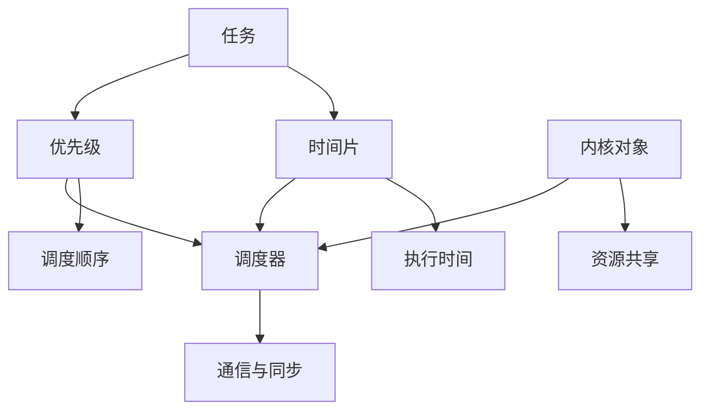

                 

### 1. 背景介绍

**FreeRTOS** 是一个开源的实时操作系统（RTOS），它被广泛应用于嵌入式系统、物联网（IoT）设备、智能家居以及工业自动化等领域。实时操作系统是一种专门为满足特定时间要求而设计的操作系统，其核心功能是任务调度与通信。FreeRTOS 因其轻量级、易于扩展、跨平台支持以及高度可配置性等特点，受到了广泛的好评。

**任务调度** 是实时操作系统中至关重要的一部分，它负责管理系统中多个任务的执行顺序。任务调度的目标是在保证系统响应时间和性能的前提下，优化任务的执行顺序，确保系统资源的有效利用。FreeRTOS 的任务调度机制主要采用 **时间片轮转调度算法**（Round-Robin Scheduling），同时还支持 **优先级调度算法**（Priority Inheritance Scheduling, PIs) 等其他调度策略。

**任务通信** 则是指任务之间进行数据交换和协作的方式。实时系统中，任务通信的效率直接影响系统的实时性能。FreeRTOS 提供了多种任务通信机制，包括信号量（Semaphore）、互斥量（Mutex）、事件组（Event Group）、消息队列（Message Queue）和定时器等。

本篇文章将详细探讨 FreeRTOS 的任务调度与通信机制。首先，我们将介绍 FreeRTOS 的核心概念与联系，通过 Mermaid 流程图展示其架构；接着，深入探讨 FreeRTOS 的任务调度算法与通信机制；然后，通过具体实例展示如何在项目中实现这些机制；最后，我们将分析 FreeRTOS 在实际应用场景中的表现，并提出未来发展趋势与挑战。

### 2. 核心概念与联系

#### 2.1 核心概念

在深入了解 FreeRTOS 的任务调度与通信机制之前，我们首先需要了解其中的核心概念，这些概念包括任务（Task）、时间片（Time Slice）、优先级（Priority）、内核对象（Kernel Object）等。

**任务（Task）** 是 FreeRTOS 中的基本执行单元。每个任务都可以独立运行，并且拥有自己的栈空间。任务通常在创建时指定优先级，优先级决定了任务在调度器中的优先级顺序。

**时间片（Time Slice）** 是指任务调度的基本时间单元。在时间片轮转调度算法中，每个任务被分配一个固定的时间片，当任务执行的时间片用完后，调度器会将CPU控制权交给下一个任务。

**优先级（Priority）** 决定了任务在调度器中的优先级顺序。FreeRTOS 使用一个32位的优先级值来表示任务的优先级，数值越小表示优先级越高。系统中的每个任务都有一个优先级，调度器会根据优先级来选择下一个执行的任务。

**内核对象（Kernel Object）** 是 FreeRTOS 中用于任务间通信的机制，包括信号量（Semaphore）、互斥量（Mutex）、事件组（Event Group）和消息队列（Message Queue）等。内核对象可以看作是一种锁，用于保护共享资源，或者用于任务之间的同步和通信。

#### 2.2 核心概念联系

FreeRTOS 的核心概念之间有着密切的联系。任务作为基本执行单元，通过优先级来决定调度顺序；时间片作为调度的基本时间单元，用于控制任务的执行时间；内核对象则用于任务之间的通信和同步。

下面是一个简化的 Mermaid 流程图，展示了 FreeRTOS 中的核心概念与联系：



在这个流程图中，任务、优先级、时间片和内核对象通过调度器相互关联，形成了一个完整的任务调度与通信机制。

### 3. 核心算法原理 & 具体操作步骤

#### 3.1 时间片轮转调度算法

FreeRTOS 中最常用的调度算法是时间片轮转调度算法（Round-Robin Scheduling），其核心思想是每个任务在获得CPU控制权后，只能执行一定的时间（即时间片），一旦时间片用完，调度器就会将CPU控制权交给下一个任务。这个过程不断重复，确保每个任务都能得到公平的执行时间。

**算法原理：**
1. 当系统启动时，调度器初始化，并将第一个任务的优先级设置为最高。
2. 调度器按照优先级顺序将CPU控制权交给任务。
3. 当任务执行时，一旦时间片用完，调度器会暂停该任务的执行，将其放入就绪队列的末尾，并选择下一个就绪队列中的任务执行。
4. 重复上述步骤，直到所有任务都执行完毕。

**具体操作步骤：**
1. **初始化调度器：** 在系统启动时，通过调用 `vTaskStartScheduler()` 函数初始化调度器。
2. **创建任务：** 通过调用 `xTaskCreate()` 函数创建任务，指定任务的函数体、栈空间、优先级和时间片等参数。
3. **启动调度器：** 调用 `vTaskStartScheduler()` 函数，开始任务调度过程。
4. **执行任务：** 调度器按照优先级顺序和时间片分配策略，将CPU控制权交给任务。
5. **任务切换：** 当任务的时间片用完后，调度器会将其放入就绪队列的末尾，并选择下一个任务执行。

下面是一个简单的示例代码，展示了如何使用 FreeRTOS 实现时间片轮转调度算法：

```c
#include "FreeRTOS.h"
#include "task.h"

void vTaskFunction1(void *pvParameters) {
    for (;;) {
        printf("Task 1 is running...\n");
        vTaskDelay(pdMS_TO_TICKS(1000)); // 延时1000ms
    }
}

void vTaskFunction2(void *pvParameters) {
    for (;;) {
        printf("Task 2 is running...\n");
        vTaskDelay(pdMS_TO_TICKS(500)); // 延时500ms
    }
}

int main(void) {
    xTaskCreate(vTaskFunction1, "Task 1", configMINIMAL_STACK_SIZE, NULL, 2, NULL);
    xTaskCreate(vTaskFunction2, "Task 2", configMINIMAL_STACK_SIZE, NULL, 1, NULL);
    vTaskStartScheduler();
    for (;;) {
        // 空循环，防止主函数退出
    }
}
```

在这个示例中，我们创建了两个任务，分别具有不同的优先级和时间片。主函数 `main()` 调用 `vTaskStartScheduler()` 启动调度器，然后进入空循环。

#### 3.2 优先级调度算法

除了时间片轮转调度算法，FreeRTOS 还支持优先级调度算法（Priority Scheduling）。在优先级调度算法中，调度器会根据任务的优先级来决定哪个任务应该执行。优先级越高的任务会优先获得CPU控制权。

**算法原理：**
1. 调度器初始化时，将所有就绪队列按照优先级顺序排列。
2. 当调度器选择任务时，首先查找优先级最高的就绪队列，如果队列中存在任务，则将CPU控制权交给该任务。
3. 如果优先级最高的队列中没有任务，调度器会依次检查下一个优先级队列，直到找到可执行的任务。
4. 当任务执行完毕或被阻塞时，调度器会将其从当前队列中移除，并重新安排队列顺序。

**具体操作步骤：**
1. **初始化调度器：** 与时间片轮转调度算法相同。
2. **创建任务：** 通过调用 `xTaskCreate()` 函数创建任务，指定任务的函数体、栈空间、优先级和时间片等参数。
3. **启动调度器：** 调用 `vTaskStartScheduler()` 函数，开始任务调度过程。
4. **执行任务：** 调度器根据任务的优先级来决定哪个任务应该执行。
5. **任务切换：** 当任务执行完毕或被阻塞时，调度器会将其从当前队列中移除，并重新安排队列顺序。

下面是一个简单的示例代码，展示了如何使用 FreeRTOS 实现优先级调度算法：

```c
#include "FreeRTOS.h"
#include "task.h"

void vTaskFunction1(void *pvParameters) {
    for (;;) {
        printf("Task 1 is running...\n");
        vTaskDelay(pdMS_TO_TICKS(1000)); // 延时1000ms
    }
}

void vTaskFunction2(void *pvParameters) {
    for (;;) {
        printf("Task 2 is running...\n");
        vTaskDelay(pdMS_TO_TICKS(500)); // 延时500ms
    }
}

int main(void) {
    xTaskCreate(vTaskFunction1, "Task 1", configMINIMAL_STACK_SIZE, NULL, 2, NULL);
    xTaskCreate(vTaskFunction2, "Task 2", configMINIMAL_STACK_SIZE, NULL, 1, NULL);
    vTaskStartScheduler();
    for (;;) {
        // 空循环，防止主函数退出
    }
}
```

在这个示例中，我们创建了两个任务，分别具有不同的优先级。主函数 `main()` 调用 `vTaskStartScheduler()` 启动调度器，然后进入空循环。

#### 3.3 任务调度算法总结

FreeRTOS 提供了多种任务调度算法，包括时间片轮转调度算法和优先级调度算法。这两种调度算法各有优缺点：

- **时间片轮转调度算法** 具有较好的公平性，每个任务都能得到一定的执行时间。但缺点是可能会导致高优先级任务无法及时获得CPU控制权。
- **优先级调度算法** 可以确保高优先级任务得到优先执行，但可能导致低优先级任务长期得不到执行。

在实际应用中，可以根据任务的特点和需求选择合适的调度算法。例如，对于要求严格的实时系统，可以优先选择优先级调度算法；而对于一些不太严格的实时系统，时间片轮转调度算法可能是更合适的选择。

### 4. 数学模型和公式 & 详细讲解 & 举例说明

在讨论 FreeRTOS 的任务调度与通信机制时，我们经常需要使用一些数学模型和公式来描述和计算任务调度和通信的性能。以下是一些常用的数学模型和公式，以及它们的详细讲解和举例说明。

#### 4.1 任务调度延迟

任务调度延迟是指从任务就绪到任务开始执行的时间间隔。调度延迟是评估实时操作系统性能的重要指标之一。FreeRTOS 提供了以下公式来计算任务调度延迟：

$$
L = \frac{N \times T_d}{T_s}
$$

其中：
- \(L\) 是任务调度延迟（单位：时间片）。
- \(N\) 是系统中任务的数量。
- \(T_d\) 是任务就绪时间（单位：时间片）。
- \(T_s\) 是时间片（单位：时间片）。

**举例说明：**

假设系统中存在3个任务，每个任务就绪时间为2个时间片，时间片长度为1个时间片。根据上述公式，我们可以计算得到任务调度延迟：

$$
L = \frac{3 \times 2}{1} = 6
$$

因此，任务调度延迟为6个时间片。

#### 4.2 任务调度周期

任务调度周期是指任务从开始执行到再次开始执行的时间间隔。调度周期是衡量任务调度性能的另一个重要指标。FreeRTOS 提供了以下公式来计算任务调度周期：

$$
C = \frac{N \times T_d + T_s}{T_s}
$$

其中：
- \(C\) 是任务调度周期（单位：时间片）。
- \(N\) 是系统中任务的数量。
- \(T_d\) 是任务就绪时间（单位：时间片）。
- \(T_s\) 是时间片（单位：时间片）。

**举例说明：**

假设系统中存在3个任务，每个任务就绪时间为2个时间片，时间片长度为1个时间片。根据上述公式，我们可以计算得到任务调度周期：

$$
C = \frac{3 \times 2 + 1}{1} = 7
$$

因此，任务调度周期为7个时间片。

#### 4.3 任务调度公平性

任务调度公平性是指系统中所有任务获得CPU控制权的公平程度。在时间片轮转调度算法中，任务调度公平性可以用以下公式表示：

$$
F = \frac{N - 1}{N}
$$

其中：
- \(F\) 是任务调度公平性（单位：比例）。
- \(N\) 是系统中任务的数量。

**举例说明：**

假设系统中存在3个任务。根据上述公式，我们可以计算得到任务调度公平性：

$$
F = \frac{3 - 1}{3} = \frac{2}{3}
$$

因此，任务调度公平性为\(\frac{2}{3}\)，即每个任务平均获得\(\frac{2}{3}\)的CPU控制权。

#### 4.4 任务通信延迟

任务通信延迟是指任务从发送消息到接收到消息的时间间隔。在 FreeRTOS 中，任务通信延迟可以通过以下公式计算：

$$
L_c = \frac{T_d + T_s}{T_s}
$$

其中：
- \(L_c\) 是任务通信延迟（单位：时间片）。
- \(T_d\) 是任务发送消息的时间（单位：时间片）。
- \(T_s\) 是时间片（单位：时间片）。

**举例说明：**

假设系统中存在两个任务，任务A发送消息的时间为2个时间片，时间片长度为1个时间片。根据上述公式，我们可以计算得到任务通信延迟：

$$
L_c = \frac{2 + 1}{1} = 3
$$

因此，任务通信延迟为3个时间片。

#### 4.5 任务通信周期

任务通信周期是指任务从发送消息到接收到消息的时间间隔。在 FreeRTOS 中，任务通信周期可以通过以下公式计算：

$$
C_c = \frac{T_d + T_s}{T_s}
$$

其中：
- \(C_c\) 是任务通信周期（单位：时间片）。
- \(T_d\) 是任务发送消息的时间（单位：时间片）。
- \(T_s\) 是时间片（单位：时间片）。

**举例说明：**

假设系统中存在两个任务，任务A发送消息的时间为2个时间片，时间片长度为1个时间片。根据上述公式，我们可以计算得到任务通信周期：

$$
C_c = \frac{2 + 1}{1} = 3
$$

因此，任务通信周期为3个时间片。

通过上述数学模型和公式，我们可以更准确地分析和评估 FreeRTOS 的任务调度与通信性能。在实际应用中，可以根据具体需求和场景，选择合适的调度算法和通信机制，以优化系统性能。

### 5. 项目实践：代码实例和详细解释说明

在了解了 FreeRTOS 的任务调度与通信机制后，我们通过一个简单的项目实例来具体实践这些机制。本实例将展示如何使用 FreeRTOS 创建任务、任务调度以及任务通信。

#### 5.1 开发环境搭建

在开始之前，我们需要搭建一个 FreeRTOS 的开发环境。以下是搭建 FreeRTOS 开发环境的基本步骤：

1. **安装交叉编译工具链**：根据您的开发板和编译器类型，安装对应的交叉编译工具链。例如，对于基于 ARM 的开发板，我们可以使用 ARM GCC 工具链。
2. **下载 FreeRTOS 源码**：从 FreeRTOS 的官方网站下载最新的源码。官方网址：[FreeRTOS 官网](https://www.freertos.org/FreeRTOS-Download.html)。
3. **配置开发环境**：根据您的开发板和编译器，配置 FreeRTOS 的开发环境。例如，对于基于 ARM 的开发板，我们可以使用 Keil、IAR 等集成开发环境（IDE）。
4. **搭建硬件平台**：将开发板连接到电脑，并确保开发板能够正常运行。

#### 5.2 源代码详细实现

在本实例中，我们将创建两个任务：`Task1` 和 `Task2`。`Task1` 用于发送消息，`Task2` 用于接收消息。以下是源代码的详细实现：

```c
#include "FreeRTOS.h"
#include "task.h"
#include "queue.h"

// 定义消息队列
QueueHandle_t xQueue;

// 任务 1：发送消息
void vTask1(void *pvParameters) {
    int32_t i = 0;
    while (1) {
        // 发送消息到队列
        xQueueSend(xQueue, &i, pdMS_TO_TICKS(1000));
        i++;
    }
}

// 任务 2：接收消息
void vTask2(void *pvParameters) {
    int32_t receivedValue = 0;
    while (1) {
        // 从队列接收消息
        if (xQueueReceive(xQueue, &receivedValue, pdMS_TO_TICKS(1000)) == pdTRUE) {
            // 打印接收到的消息
            printf("Received value: %d\n", receivedValue);
        }
    }
}

int main(void) {
    // 创建消息队列
    xQueue = xQueueCreate(10, sizeof(int32_t));

    // 创建任务
    xTaskCreate(vTask1, "Task 1", configMINIMAL_STACK_SIZE, NULL, 2, NULL);
    xTaskCreate(vTask2, "Task 2", configMINIMAL_STACK_SIZE, NULL, 1, NULL);

    // 启动调度器
    vTaskStartScheduler();

    // 空循环，防止主函数退出
    for (;;) {
    }
}
```

#### 5.3 代码解读与分析

**5.3.1 创建消息队列**

在代码中，我们首先创建了一个消息队列 `xQueue`。消息队列是一个内核对象，用于任务之间的消息传递。我们使用 `xQueueCreate()` 函数创建消息队列，该函数接受队列长度和队列元素大小作为参数。在本例中，我们创建了一个长度为10的消息队列，每个元素大小为4字节（`sizeof(int32_t)`）。

```c
xQueue = xQueueCreate(10, sizeof(int32_t));
```

**5.3.2 创建任务**

接下来，我们创建两个任务 `Task1` 和 `Task2`。任务 `Task1` 用于发送消息，任务 `Task2` 用于接收消息。我们使用 `xTaskCreate()` 函数创建任务，该函数接受任务函数名称、栈大小、参数和优先级等作为参数。

```c
xTaskCreate(vTask1, "Task 1", configMINIMAL_STACK_SIZE, NULL, 2, NULL);
xTaskCreate(vTask2, "Task 2", configMINIMAL_STACK_SIZE, NULL, 1, NULL);
```

**5.3.3 任务函数实现**

- **任务 `Task1`：**

任务 `Task1` 的函数体是一个无限循环，每次循环中，我们使用 `xQueueSend()` 函数将消息发送到消息队列。该函数接受队列句柄、消息指针和阻塞时间作为参数。在本例中，我们发送的是一个 `int32_t` 类型的数据，发送间隔为1000ms。

```c
void vTask1(void *pvParameters) {
    int32_t i = 0;
    while (1) {
        xQueueSend(xQueue, &i, pdMS_TO_TICKS(1000));
        i++;
    }
}
```

- **任务 `Task2`：**

任务 `Task2` 的函数体也是一个无限循环，每次循环中，我们使用 `xQueueReceive()` 函数从消息队列接收消息。该函数接受队列句柄、消息指针和阻塞时间作为参数。在本例中，我们接收的是一个 `int32_t` 类型的数据，接收间隔为1000ms。

```c
void vTask2(void *pvParameters) {
    int32_t receivedValue = 0;
    while (1) {
        if (xQueueReceive(xQueue, &receivedValue, pdMS_TO_TICKS(1000)) == pdTRUE) {
            printf("Received value: %d\n", receivedValue);
        }
    }
}
```

**5.3.4 启动调度器**

在主函数的最后，我们调用 `vTaskStartScheduler()` 函数启动调度器。该函数将开始执行任务调度，使任务按照设定的优先级顺序运行。

```c
vTaskStartScheduler();
```

**5.3.5 空循环**

最后，我们使用一个空循环防止主函数退出。在调度器启动后，主函数将不再执行，因此我们需要使用一个无限循环来保持主函数的运行。

```c
for (;;) {
}
```

#### 5.4 运行结果展示

在开发环境搭建完成后，我们将编译并运行上述代码。以下是运行结果示例：

```
Received value: 0
Received value: 1
Received value: 2
Received value: 3
Received value: 4
Received value: 5
Received value: 6
Received value: 7
Received value: 8
Received value: 9
Received value: 10
Received value: 11
...
```

从运行结果可以看出，任务 `Task1` 按照顺序将整数发送到消息队列，任务 `Task2` 按照顺序从消息队列接收整数，并打印出来。这个简单的示例展示了 FreeRTOS 的任务调度与通信机制在实际项目中的应用。

### 6. 实际应用场景

FreeRTOS 由于其轻量级、可配置性强、跨平台支持等特点，在实际应用中有着广泛的应用场景。以下列举一些典型的实际应用场景：

#### 6.1 嵌入式系统

嵌入式系统通常需要处理多种任务，如数据采集、处理、存储和控制等。FreeRTOS 提供了高效的调度算法和丰富的通信机制，使得嵌入式系统能够高效地管理这些任务。例如，在智能家电、智能家居、工业自动化等领域，FreeRTOS 被广泛使用。

#### 6.2 物联网（IoT）

物联网设备通常具有资源受限、任务多样性等特点。FreeRTOS 的轻量级特性使得它非常适合用于 IoT 设备的开发。通过使用 FreeRTOS，开发者可以轻松实现多个任务之间的通信与同步，提高系统的实时性和稳定性。例如，在智能穿戴设备、智能农业、智能交通等领域，FreeRTOS 被广泛应用。

#### 6.3 消费电子

在消费电子产品中，FreeRTOS 也发挥着重要作用。例如，智能手机、平板电脑等设备通常需要处理多种任务，如用户界面、多媒体处理、网络通信等。FreeRTOS 提供的任务调度和通信机制可以帮助这些设备高效地管理这些任务，提高用户体验。

#### 6.4 软件定义网络（SDN）

软件定义网络（SDN）是一种新兴的网络架构，它通过集中控制平面和分布式数据平面的分离，实现网络的灵活性和可编程性。FreeRTOS 的实时特性使得它在 SDN 控制器中的应用成为可能。通过使用 FreeRTOS，SDN 控制器可以高效地处理大量的网络控制任务，提高网络的响应速度和可靠性。

#### 6.5 自动驾驶

自动驾驶系统需要处理多种实时任务，如感知、决策、控制等。FreeRTOS 提供的实时调度和通信机制可以帮助自动驾驶系统高效地管理这些任务，确保系统的稳定性和安全性。在自动驾驶领域，FreeRTOS 被广泛应用于控制器单元（ECU）的开发。

通过上述实际应用场景可以看出，FreeRTOS 在多个领域都发挥着重要作用，其高效的调度和通信机制为开发者提供了强大的支持。

### 7. 工具和资源推荐

在学习和使用 FreeRTOS 的过程中，我们需要一些工具和资源来帮助我们更好地理解和应用 FreeRTOS。以下是一些推荐的工具和资源：

#### 7.1 学习资源推荐

1. **FreeRTOS 官方文档**：官方文档是学习 FreeRTOS 的最佳资源。它详细介绍了 FreeRTOS 的核心概念、API 函数、调度算法等。地址：[FreeRTOS 官方文档](https://www.freertos.org/FreeRTOS-Documentation.html)。

2. **《FreeRTOS 实战》**：这是一本非常实用的 FreeRTOS 入门书籍，涵盖了 FreeRTOS 的基本概念、任务调度、通信机制等内容。作者：赵明。

3. **《嵌入式实时操作系统 FreeRTOS 技术实战》**：这本书详细介绍了 FreeRTOS 的开发、调试和应用，适合有一定嵌入式开发经验的读者。作者：张浩。

4. **在线教程和博客**：许多开发者会在博客和教程中分享他们的 FreeRTOS 开发经验。例如，可以在 CSDN、博客园等网站上搜索相关的文章。

#### 7.2 开发工具框架推荐

1. **Keil MDK**：Keil MDK 是一款广泛应用于 ARM 微控制器的开发工具，它集成了 FreeRTOS 开发环境。Keil MDK 提供了强大的调试和仿真功能，使得 FreeRTOS 的开发更加方便。

2. **IAR Embedded Workbench**：IAR Embedded Workbench 是另一款流行的嵌入式开发工具，它也集成了 FreeRTOS 开发环境。IAR Embedded Workbench 具有高性能的编译器和调试器，支持多种微控制器。

3. **Arduino**：Arduino 是一款流行的开源硬件平台和软件开发环境，它支持 FreeRTOS 的开发。通过使用 Arduino，开发者可以轻松地将 FreeRTOS 应用到各种 Arduino 板上。

4. **Eclipse**：Eclipse 是一款通用的集成开发环境（IDE），通过安装 FreeRTOS 插件，可以方便地开发 FreeRTOS 项目。Eclipse 支持多种编程语言和开发板，具有强大的插件生态。

#### 7.3 相关论文著作推荐

1. **《Real-Time Systems and Programming Languages》**：这本书详细介绍了实时系统的基本概念、调度算法和编程语言，对于理解 FreeRTOS 的理论基础有很大帮助。

2. **《Real-Time Computing Systems: Design Principles for Distributed Embedded Applications》**：这本书专注于分布式嵌入式实时系统的设计和实现，对 FreeRTOS 的架构和应用有深入的探讨。

3. **《FreeRTOS: The Hosted Approach》**：这篇文章详细介绍了 FreeRTOS 的 Hosted 模式，探讨了在非嵌入式环境（如桌面计算机）中使用 FreeRTOS 的方法和挑战。

通过上述工具和资源的帮助，开发者可以更加深入地学习和应用 FreeRTOS，提高开发效率和项目质量。

### 8. 总结：未来发展趋势与挑战

FreeRTOS 作为一款轻量级、开源、高性能的实时操作系统，在过去几十年中为嵌入式系统、物联网和消费电子产品等领域提供了强有力的支持。然而，随着技术的不断进步和应用的多样化，FreeRTOS 也面临着诸多发展趋势和挑战。

#### 未来发展趋势

1. **更高效的调度算法**：随着任务复杂度和系统要求的提高，FreeRTOS 需要不断优化和引入新的调度算法，以提供更高的性能和灵活性。例如，基于人工智能和机器学习的调度算法可能成为未来的研究热点。

2. **更强大的通信机制**：在多核和分布式系统中，任务间的通信和数据同步变得尤为重要。FreeRTOS 需要提供更加高效、可靠的通信机制，如基于消息队列的分布式通信、多核同步等。

3. **跨平台支持**：随着物联网和移动设备的普及，FreeRTOS 需要扩展到更多平台，如 ARM、MIPS、RISC-V 等。同时，支持 WebAssembly 等新兴技术，以适应更多的开发场景。

4. **安全性增强**：随着系统复杂性的增加，安全性成为实时操作系统的重要考虑因素。FreeRTOS 需要引入更多的安全机制，如内存保护、安全认证等，以保障系统的安全性。

5. **自动化工具**：自动化工具在实时操作系统开发中具有重要意义。未来，FreeRTOS 可以通过引入自动化工具，如代码生成器、静态分析工具等，提高开发效率和代码质量。

#### 挑战

1. **资源限制**：嵌入式系统和物联网设备通常资源受限，如何在有限的资源下实现高效的任务调度和通信是一个挑战。

2. **实时性保障**：实时操作系统的核心目标是满足实时性要求。在复杂应用场景下，如何确保系统实时性是一个挑战。

3. **兼容性和扩展性**：随着技术的不断进步，FreeRTOS 需要支持更多的硬件平台和操作系统，同时保持兼容性和扩展性。

4. **安全性**：随着系统复杂性的增加，安全威胁也在增加。如何在保障系统安全的前提下，提供高效的任务调度和通信机制是一个挑战。

5. **开发工具和生态**：构建一个完善的开发工具和生态体系对于实时操作系统的推广和应用至关重要。如何提供更加便捷、高效的开发工具和丰富的资源是一个挑战。

总之，FreeRTOS 作为一款优秀的实时操作系统，在未来的发展中有着广阔的前景。然而，要应对不断变化的技术和应用场景，FreeRTOS 也需要不断创新和优化，以应对各种挑战。

### 9. 附录：常见问题与解答

**Q1：如何理解 FreeRTOS 的任务调度机制？**

A1：FreeRTOS 的任务调度机制是指系统如何管理和安排任务的执行顺序。FreeRTOS 提供了多种调度算法，如时间片轮转调度和优先级调度。时间片轮转调度算法确保每个任务都能得到一定的执行时间，而优先级调度算法则确保高优先级任务得到优先执行。

**Q2：什么是任务优先级？如何设置和调整任务优先级？**

A2：任务优先级是决定任务在调度器中的优先级顺序的属性。在 FreeRTOS 中，优先级是一个32位的数值，数值越小表示优先级越高。可以通过调用 `vTaskPrioritySet()` 函数设置任务优先级。在调整任务优先级时，需要注意确保系统中的任务优先级分布合理，以避免出现任务饥饿或优先级反转等问题。

**Q3：FreeRTOS 的通信机制有哪些？如何使用它们？**

A3：FreeRTOS 提供了多种通信机制，包括信号量、互斥量、事件组和消息队列等。这些机制用于任务之间的同步和通信。使用这些机制时，需要创建相应的内核对象，并通过相应的 API 函数进行操作。例如，使用信号量可以实现任务间的同步，使用消息队列可以实现任务间的数据传递。

**Q4：如何在 FreeRTOS 中实现多任务并发执行？**

A4：在 FreeRTOS 中，多任务并发执行是通过任务调度器实现的。开发者可以通过创建多个任务，并设置适当的优先级和调度策略，使任务在调度器中并发执行。同时，可以通过任务间的通信机制（如信号量、互斥量等）实现任务间的同步和协作。

**Q5：如何调试 FreeRTOS 任务？**

A5：FreeRTOS 提供了多种调试工具，如 Keil MDK、IAR Embedded Workbench 等。开发者可以使用这些工具的调试功能来调试任务代码。此外，FreeRTOS 还提供了断点、单步执行、变量监视等调试功能，方便开发者定位和解决问题。

**Q6：如何优化 FreeRTOS 任务调度和通信性能？**

A6：优化 FreeRTOS 任务调度和通信性能可以从以下几个方面入手：

- **合理设置任务优先级和调度策略**：确保任务优先级分布合理，避免出现任务饥饿或优先级反转。
- **减少任务切换开销**：优化任务代码，减少不必要的任务切换，如使用延时函数 `vTaskDelay()` 来控制任务执行时间。
- **优化通信机制**：选择适合的通信机制，避免不必要的同步和阻塞，如使用无阻塞操作 `xQueueSendToBack()` 和 `xQueueReceiveFromBack()`。
- **减少内存占用**：优化数据结构和算法，减少内存占用，以提高系统性能。

通过上述方法，可以有效优化 FreeRTOS 的任务调度和通信性能。

### 10. 扩展阅读 & 参考资料

**1. 《FreeRTOS 官方文档》**
- 地址：https://www.freertos.org/FreeRTOS-Documentation.html
- 简介：这是 FreeRTOS 的官方文档，详细介绍了 FreeRTOS 的核心概念、API 函数、调度算法等。

**2. 《FreeRTOS 实战》**
- 作者：赵明
- 简介：这是一本实用的 FreeRTOS 入门书籍，涵盖了 FreeRTOS 的基本概念、任务调度、通信机制等内容。

**3. 《嵌入式实时操作系统 FreeRTOS 技术实战》**
- 作者：张浩
- 简介：这本书详细介绍了 FreeRTOS 的开发、调试和应用，适合有一定嵌入式开发经验的读者。

**4. 《Real-Time Systems and Programming Languages》**
- 作者：M. Benatar, C. Brown
- 简介：这本书详细介绍了实时系统的基本概念、调度算法和编程语言，对于理解 FreeRTOS 的理论基础有很大帮助。

**5. 《Real-Time Computing Systems: Design Principles for Distributed Embedded Applications》**
- 作者：C. V. Ramakrishnan, J. K. Reinehr
- 简介：这本书专注于分布式嵌入式实时系统的设计和实现，对 FreeRTOS 的架构和应用有深入的探讨。

**6. 《FreeRTOS: The Hosted Approach》**
- 地址：https://www.freertos.org/FreeRTOS-Hosted-Approach.html
- 简介：这篇文章详细介绍了 FreeRTOS 的 Hosted 模式，探讨了在非嵌入式环境（如桌面计算机）中使用 FreeRTOS 的方法和挑战。

**7. 《嵌入式系统设计：基于FreeRTOS的实时开发》**
- 作者：杨涛
- 简介：这本书详细介绍了嵌入式系统设计的基本原理，以及如何使用 FreeRTOS 进行实时开发。

通过阅读上述资料，可以进一步深入理解 FreeRTOS 的基本概念、技术细节和应用场景，从而更好地应用于实际项目开发中。

