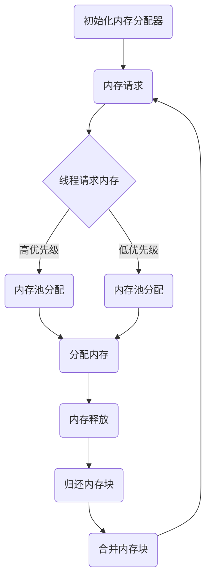

                 

### 背景介绍

FreeRTOS是一个开源、可扩展、跨平台的实时操作系统（RTOS），专为小型嵌入式系统和微控制器设计。它的轻量级特性和高度的可配置性使其成为嵌入式系统开发者的首选之一。FreeRTOS由Keil公司开发和维护，被广泛应用于各种领域，包括工业控制、智能家居、医疗设备和汽车电子等。

随着嵌入式系统的复杂性和对实时性的要求越来越高，内存管理成为了一个关键问题。有效的内存管理不仅能够提高系统的稳定性，还能够优化资源的使用，从而提高整个系统的性能。FreeRTOS的内存管理模块为此提供了强大的支持，允许开发者在有限的内存资源下实现高效、可靠的内存分配和释放。

本文旨在深入探讨FreeRTOS的内存管理机制，包括内存分配器的原理、内存分配策略以及优化方法。我们将通过逐步分析，帮助读者理解FreeRTOS内存管理的工作机制，并掌握如何在实际项目中对其进行优化。

### 核心概念与联系

#### 内存管理基本概念

在深入探讨FreeRTOS的内存管理之前，我们需要了解一些基础概念。

- **内存分配器**：内存分配器是负责管理内存空间的组件，它负责从系统总内存中分配和释放内存块，以满足程序运行时的内存需求。

- **内存池**：内存池是一种预先分配的内存块集合，它通常用于减少内存碎片和提高内存分配效率。内存池可以是固定大小的，也可以是动态增长的。

- **内存碎片**：内存碎片是指内存中未被使用的空间，这些空间由于内存分配和释放操作而产生的零散小块内存。

#### 内存分配器架构

FreeRTOS的内存分配器架构采用了一种称为“小内存块池”的策略。整个内存空间被划分为若干固定大小的内存块，每个内存块的大小通常为4字节或8字节。这些内存块被组织成不同的“块池”，每个块池负责管理相同大小的内存块。


在FreeRTOS中，内存分配器的主要组件包括：

- **内存块池**：每个内存块池包含多个相同大小的内存块，这些内存块被初始化为“空闲”状态。

- **空闲列表**：每个内存块池都有一个空闲列表，用于维护当前空闲内存块的信息。

- **分配队列**：每个内存块池都有一个分配队列，用于维护等待分配内存的线程信息。

#### 内存分配策略

FreeRTOS的内存分配策略旨在最小化内存碎片和提高内存使用效率。以下是FreeRTOS内存分配的主要策略：

- **内存池策略**：通过将内存划分为多个内存池，每个内存池管理不同大小的内存块，以适应不同大小的内存需求。

- **空闲列表策略**：每个内存块池都有一个空闲列表，用于快速查找和分配空闲内存块。

- **内存分配优先级**：FreeRTOS根据线程的优先级来决定内存的分配顺序，优先级较高的线程有更高的内存分配优先级。

#### 内存管理流程

FreeRTOS的内存管理流程可以分为以下几个步骤：

1. **初始化内存分配器**：系统启动时，内存分配器会初始化内存池和空闲列表。

2. **内存分配**：当线程需要内存时，它会向内存分配器请求内存。内存分配器会根据线程的优先级和内存需求，选择合适的内存池进行分配。

3. **内存释放**：当线程不再需要内存时，它会将内存块归还给内存分配器。内存分配器会将这些内存块重新加入空闲列表，以供其他线程使用。

4. **内存回收**：如果内存碎片过多，内存分配器会进行内存回收操作，将一些不再使用的内存块合并，以减少内存碎片。

#### Mermaid 流程图

以下是一个简化的FreeRTOS内存管理流程的Mermaid流程图：



通过上述内容，我们可以看到FreeRTOS内存管理的基本概念、架构和策略。接下来，我们将进一步深入探讨FreeRTOS内存管理的核心算法原理和具体操作步骤。

### 核心算法原理 & 具体操作步骤

#### 内存分配算法

FreeRTOS的内存分配算法主要基于内存块池（Memory Pools）策略。内存块池是一种预分配的内存区域，用于存储固定大小的内存块。每个内存块池由一个特定的数据结构表示，该数据结构维护了一个空闲链表，用于存储当前未被使用的内存块。

**内存块池的创建**

创建内存块池是内存分配的第一步。FreeRTOS提供了函数`xMemoryPoolCreate`用于创建内存池。以下是一个创建内存池的简单示例：

```c
xMemoryPoolCreate
(
    "MyMemoryPool",    // 内存池名称
    sizeof(T),         // 内存块大小
    numBlocks,         // 内存块数量
    (UBaseType_t)0     // 优先级组
);
```

在这个函数中，`sizeof(T)`指定了每个内存块的大小，`numBlocks`指定了内存池中预分配的内存块数量。创建成功后，内存池将初始化并返回一个内存池句柄。

**内存分配操作**

当线程需要内存时，它会调用`pxMemoryBlockAllocate`函数来请求内存块。以下是一个内存分配的简单示例：

```c
void *pvMemoryBlockAllocate(T *pxPool)
{
    T *pxBlock = pxMemoryBlockAllocate(NULL);
    if (pxBlock != NULL)
    {
        // 内存分配成功，进行初始化操作
        // ...
    }
    return pxBlock;
}
```

在这个函数中，`pxPool`是内存池的句柄。如果内存分配成功，函数将返回一个指向新分配内存块的指针。

**内存释放操作**

当线程不再需要内存时，它会调用`vMemoryBlockFree`函数释放内存块。以下是一个内存释放的简单示例：

```c
void vMemoryBlockFree(T *pxBlock)
{
    if (pxBlock != NULL)
    {
        // 释放内存块
        pxMemoryBlockFree(pxBlock);
    }
}
```

在这个函数中，`pxBlock`是指向要释放内存块的指针。函数将内存块归还给内存池，使其重新进入空闲状态。

#### 内存管理流程

FreeRTOS的内存管理流程可以概括为以下几个步骤：

1. **初始化内存分配器**：系统启动时，通过调用`vPortInitializeMemory`函数初始化内存分配器。

2. **创建内存池**：开发者在需要时创建内存池，用于存储和管理内存块。

3. **内存分配**：线程请求内存时，内存分配器从相应的内存池中分配内存块。

4. **内存释放**：线程不再使用内存时，释放内存块，将其归还给内存池。

5. **内存回收**：内存分配器会定期检查内存池中的内存块，合并空闲内存块，以减少内存碎片。

#### 内存回收策略

内存回收策略是FreeRTOS内存管理的重要组成部分。内存回收的目的是合并空闲内存块，减少内存碎片。FreeRTOS提供了两种内存回收策略：

- **批量回收**：批量回收策略将多个连续的空闲内存块合并为一个更大的内存块。这种策略适用于内存碎片较少的情况。

- **增量回收**：增量回收策略每次只合并一个空闲内存块，这种策略适用于内存碎片较多的情况。

以下是一个简单的内存回收示例：

```c
void vMemoryBlockReclaim(UBaseType_t reclaimSize)
{
    // 执行内存回收操作
    // ...
}
```

在这个函数中，`reclaimSize`指定了每次回收操作要合并的空闲内存块数量。

通过上述内容，我们可以看到FreeRTOS内存分配算法的基本原理和具体操作步骤。接下来，我们将进一步探讨FreeRTOS内存管理的数学模型和公式，以及详细的讲解和举例说明。

### 数学模型和公式 & 详细讲解 & 举例说明

#### 内存分配概率模型

FreeRTOS的内存分配算法基于概率模型，用于计算线程在内存池中分配内存的成功概率。该模型考虑了线程的优先级、内存块的大小以及内存池的状态。以下是该模型的数学公式：

$$ P(A) = \frac{N(A)}{N(A) + N(B) + N(C)} $$

其中：

- \( P(A) \) 是线程在内存池A中分配内存的成功概率。
- \( N(A) \) 是内存池A中当前空闲的内存块数量。
- \( N(B) \) 是内存池B中当前空闲的内存块数量。
- \( N(C) \) 是内存池C中当前空闲的内存块数量。

**例子：**

假设有三个内存池A、B和C，它们分别有3个、2个和1个空闲内存块。现在有一个线程请求分配内存，根据概率模型，该线程在内存池A中分配内存的成功概率为：

$$ P(A) = \frac{3}{3 + 2 + 1} = \frac{3}{6} = 0.5 $$

#### 内存块分配策略

FreeRTOS的内存块分配策略是基于优先级的。线程的优先级决定了它在内存分配器中获取内存的优先级。以下是内存块分配策略的详细解释：

1. **优先级反转**：为了防止低优先级线程长期占用高优先级线程所需的内存，FreeRTOS采用了优先级反转策略。当高优先级线程请求内存时，低优先级线程会被暂停，直到高优先级线程释放内存。

2. **优先级继承**：在某些情况下，低优先级线程需要等待高优先级线程释放内存，为了避免死锁，FreeRTOS采用了优先级继承策略。低优先级线程在等待高优先级线程释放内存时，会临时提升其优先级。

3. **优先级提升**：为了处理紧急情况，FreeRTOS还提供了优先级提升功能。当有紧急任务需要处理时，系统可以将某些线程的优先级临时提升，以确保紧急任务能够及时处理。

#### 内存块分配示例

假设我们有一个包含三个内存池的系统，每个内存池的大小分别为1KB、2KB和4KB。现有两个线程，一个需要1KB内存，另一个需要3KB内存。根据优先级策略，内存块的分配过程如下：

1. **线程1请求1KB内存**：内存分配器首先从1KB内存池中尝试分配内存。由于该内存池有1个空闲内存块，线程1将成功分配到1KB内存。

2. **线程2请求3KB内存**：内存分配器会首先尝试从2KB内存池分配，但由于该内存池中没有足够的空闲内存块，它会尝试从4KB内存池分配。由于4KB内存池有1个空闲内存块，线程2将成功分配到3KB内存。

3. **线程1释放1KB内存**：线程1完成任务后，释放1KB内存块。内存分配器将这1KB内存块重新加入1KB内存池。

4. **线程2请求1KB内存**：线程2现在需要额外的1KB内存。由于1KB内存池中有一个空闲内存块，线程2将成功分配到1KB内存。

通过上述示例，我们可以看到FreeRTOS内存块分配策略的具体应用。接下来，我们将通过一个实际项目实例，展示如何使用FreeRTOS进行内存管理，并详细解释和解析源代码。

### 项目实践：代码实例和详细解释说明

#### 开发环境搭建

在进行项目实践之前，首先需要搭建FreeRTOS的开发环境。以下是搭建FreeRTOS开发环境的步骤：

1. **安装Keil MDK-ARM**：下载并安装Keil MDK-ARM，这是一个集成的开发环境，用于嵌入式系统开发。

2. **下载FreeRTOS源码**：从FreeRTOS官方网站下载源码。你可以选择最新的版本或者特定的版本，具体取决于你的项目需求。

3. **导入项目到Keil**：将下载的FreeRTOS源码导入Keil MDK-ARM。这可以通过导入一个已经配置好的项目模板或者手动配置项目来实现。

4. **配置开发环境**：配置Keil MDK-ARM的编译器和链接器设置，以支持FreeRTOS。这通常包括设置目标设备、编译器选项和链接脚本等。

#### 源代码详细实现

以下是一个简单的FreeRTOS内存管理项目的示例代码：

```c
#include "FreeRTOS.h"
#include "task.h"
#include "queue.h"

// 定义线程函数
void vThreadFunction(void *pvParameters)
{
    T *pxMemoryBlock;
    UBaseType_t i;

    // 创建内存池
    xMemoryPoolCreate("MyMemoryPool", sizeof(T), 10, (UBaseType_t)0);

    // 分配内存块
    for (i = 0; i < 5; i++)
    {
        pxMemoryBlock = pxMemoryBlockAllocate(NULL);
        if (pxMemoryBlock != NULL)
        {
            // 使用内存块
            // ...
        }
    }

    // 释放内存块
    for (i = 0; i < 5; i++)
    {
        pxMemoryBlock = pxMemoryBlockAllocate(NULL);
        if (pxMemoryBlock != NULL)
        {
            pxMemoryBlockFree(pxMemoryBlock);
        }
    }
}

int main(void)
{
    // 初始化FreeRTOS
    xTaskCreate(vThreadFunction, "Memory Management Test", configMINIMAL_STACK_SIZE, NULL, tskIDLE_PRIORITY, NULL);

    // 启动FreeRTOS任务调度器
    vTaskStartScheduler();

    for (;;)
    {
        // 挂起主任务，以便FreeRTOS运行
    }
}
```

在这个示例中，我们首先定义了一个线程函数`vThreadFunction`，它创建了一个名为"MyMemoryPool"的内存池，并尝试分配和释放内存块。主任务负责初始化FreeRTOS并启动任务调度器。

#### 代码解读与分析

1. **内存池创建**：

```c
xMemoryPoolCreate("MyMemoryPool", sizeof(T), 10, (UBaseType_t)0);
```

这行代码创建了一个名为"MyMemoryPool"的内存池，每个内存块的大小为`sizeof(T)`，预分配了10个内存块。`UBaseType_t`是一个基础类型，用于表示无符号基础类型。

2. **内存块分配**：

```c
pxMemoryBlock = pxMemoryBlockAllocate(NULL);
```

这行代码尝试从"MyMemoryPool"内存池中分配一个内存块。如果分配成功，`pxMemoryBlock`将指向新分配的内存块。

3. **内存块释放**：

```c
pxMemoryBlockFree(pxMemoryBlock);
```

这行代码将已分配的内存块归还给"MyMemoryPool"内存池。在释放内存块后，它将重新进入空闲状态，供其他线程使用。

4. **任务创建**：

```c
xTaskCreate(vThreadFunction, "Memory Management Test", configMINIMAL_STACK_SIZE, NULL, tskIDLE_PRIORITY, NULL);
```

这行代码创建了一个新的任务`vThreadFunction`，任务名为"Memory Management Test"。`configMINIMAL_STACK_SIZE`是一个配置参数，用于指定任务堆栈的大小。`tskIDLE_PRIORITY`是任务的初始优先级。

5. **启动任务调度器**：

```c
vTaskStartScheduler();
```

这行代码启动FreeRTOS的任务调度器，开始执行任务。

#### 运行结果展示

当程序运行时，主任务将创建一个名为"Memory Management Test"的线程，该线程将尝试分配和释放内存块。内存分配和释放的过程将被打印在调试器或日志中，以供分析。

通过这个示例，我们可以看到如何使用FreeRTOS进行内存管理。接下来，我们将讨论FreeRTOS在内存管理中的实际应用场景。

### 实际应用场景

FreeRTOS作为一种轻量级实时操作系统，在嵌入式系统开发中得到了广泛的应用。其内存管理特性在多种实际应用场景中发挥了重要作用。以下是一些典型的应用场景：

#### 1. 工业控制

在工业控制领域，FreeRTOS被用于实现各种自动化控制系统。内存管理在此类系统中至关重要，因为它直接影响系统的响应时间和稳定性。FreeRTOS提供的内存分配器可以有效地管理系统中有限的内存资源，确保每个任务都能在适当的内存空间中运行。

**应用实例**：在一个自动化生产线中，FreeRTOS用于控制各种传感器、执行器和机器手臂。通过内存管理策略，系统能够高效地处理传感器数据的采集和处理，同时确保执行器的实时控制指令得到及时执行。

#### 2. 智能家居

智能家居设备通常具有多种传感器和控制功能，它们需要在有限的内存资源下运行多个任务。FreeRTOS的内存管理机制有助于优化内存使用，从而提高系统的稳定性和性能。

**应用实例**：在智能家居系统中，FreeRTOS用于管理智能灯泡、智能插座和智能恒温器等设备。内存管理确保每个设备能够高效地处理数据，同时避免内存碎片问题。

#### 3. 医疗设备

医疗设备对实时性和可靠性有极高的要求。FreeRTOS的内存管理能力有助于确保系统在处理复杂医疗任务时能够保持稳定运行。

**应用实例**：在医疗监护设备中，FreeRTOS用于管理传感器数据采集、数据分析以及警报系统的运行。通过有效的内存管理，系统能够快速响应患者的生理参数变化，提供及时的治疗建议。

#### 4. 汽车电子

汽车电子系统对实时性和安全性要求非常高。FreeRTOS作为一种可扩展和可定制的RTOS，能够满足这些要求。

**应用实例**：在汽车中，FreeRTOS用于管理车载通信系统、导航系统和安全控制系统。内存管理确保系统能够高效处理各种实时任务，同时避免内存泄漏和碎片问题。

#### 5. 机器人

机器人系统需要同时处理多种任务，如传感器数据处理、路径规划和运动控制。FreeRTOS的内存管理特性有助于优化机器人系统的性能和可靠性。

**应用实例**：在工业机器人中，FreeRTOS用于管理传感器数据处理、路径规划和机械臂控制。通过内存管理策略，机器人能够高效地处理复杂任务，提高生产效率。

通过上述实际应用场景，我们可以看到FreeRTOS内存管理在各个领域的广泛应用和重要性。接下来，我们将推荐一些学习资源和开发工具，帮助读者深入了解FreeRTOS的内存管理。

### 工具和资源推荐

#### 1. 学习资源推荐

**书籍**：
- **《嵌入式系统设计与应用》**：介绍了嵌入式系统设计的基础知识和实践技巧，其中包括RTOS的使用和内存管理。
- **《FreeRTOS官方手册》**：FreeRTOS官方提供的详细文档，涵盖了内存管理、任务调度、队列操作等核心功能。

**论文**：
- **"FreeRTOS: A Lightweight Real-Time Kernel for deeply-Embedded Applications"**：这是FreeRTOS的创始人Richard Barry发表的一篇论文，详细介绍了FreeRTOS的设计和实现。

**博客**：
- **"FreeRTOS官方博客"**：提供了丰富的技术博客，包括内存管理的最佳实践和常见问题的解答。

**网站**：
- **"FreeRTOS官方网站"**：包含了FreeRTOS的最新版本下载、文档和技术支持。

#### 2. 开发工具框架推荐

**开发环境**：
- **Keil MDK-ARM**：一个功能强大的开发环境，支持FreeRTOS的集成开发。
- **IAR Embedded Workbench**：另一个流行的开发环境，也提供了对FreeRTOS的支持。

**IDE插件**：
- **Eclipse with GNU ARM Embedded Tools**：Eclipse IDE的一个插件，提供了ARM Cortex-M微控制器的开发工具，支持FreeRTOS。
- **Visual Studio with STM32 Plugin**：Visual Studio的一个插件，用于STM32微控制器的开发，也支持FreeRTOS。

**调试工具**：
- **J-Link**：一款常用的调试器，支持FreeRTOS的调试和实时监控。
- **ST-Link**：STMicroelectronics提供的低成本调试器，广泛用于STM32微控制器的开发。

通过上述资源和工具，开发者可以深入了解FreeRTOS的内存管理机制，并在实际项目中有效应用。接下来，我们将探讨FreeRTOS内存管理的发展趋势与挑战。

### 总结：未来发展趋势与挑战

FreeRTOS作为一种轻量级实时操作系统，已经在嵌入式系统领域取得了显著的成果。然而，随着技术的不断发展，FreeRTOS的内存管理也面临一些新的挑战和趋势。

#### 发展趋势

1. **内存管理智能化**：随着人工智能和机器学习技术的进步，未来FreeRTOS的内存管理可能会更加智能化。通过机器学习算法，内存管理器能够更准确地预测内存需求，优化内存分配和释放策略。

2. **内存压缩技术**：为了应对越来越小的嵌入式系统内存资源，未来可能会出现更多内存压缩技术。这些技术能够在不牺牲性能的情况下，显著减少内存占用。

3. **多核处理器支持**：随着多核处理器的普及，FreeRTOS可能会加强对多核处理器的支持。通过优化内存管理策略，多核处理器可以更好地利用内存资源，提高系统性能。

#### 挑战

1. **内存碎片问题**：虽然FreeRTOS的内存分配器已经采用了多种策略来减少内存碎片，但在实际应用中，内存碎片问题仍然难以完全消除。未来需要进一步研究更有效的内存碎片管理方法。

2. **实时性能要求**：在许多嵌入式系统中，实时性能是至关重要的。随着系统复杂度的增加，如何在保证实时性的同时，优化内存管理成为一个挑战。

3. **兼容性问题**：随着新的处理器架构和操作系统特性的出现，FreeRTOS需要不断更新和调整，以保持与其他技术的兼容性。

通过应对这些趋势和挑战，FreeRTOS的内存管理将继续发展，为嵌入式系统提供更高效、可靠的解决方案。

### 附录：常见问题与解答

**Q：FreeRTOS内存池如何管理内存碎片？**

A：FreeRTOS内存池通过定期执行内存回收操作来管理内存碎片。内存回收过程中，内存分配器会合并空闲的内存块，以减少内存碎片。内存回收策略包括批量回收和增量回收，可以根据系统实际情况选择合适的策略。

**Q：内存分配器的优先级反转是如何实现的？**

A：优先级反转是通过FreeRTOS的任务调度机制实现的。当一个高优先级线程请求内存时，低优先级线程会被暂停，以让高优先级线程获得内存。当高优先级线程完成内存分配后，低优先级线程将继续执行。

**Q：如何在FreeRTOS中释放大量内存？**

A：在FreeRTOS中，释放大量内存通常通过批量释放来实现。使用`vMemoryBlockReclaim`函数可以一次性释放多个内存块，从而减少内存碎片。此外，还可以使用内存池的`vPortFreeMemory`函数，以更高效地释放大量内存。

### 扩展阅读 & 参考资料

**书籍**：
- Richard Barry. "FreeRTOS官方手册". 官方文档，提供了FreeRTOS的详细使用指南和内存管理策略。

**论文**：
- Richard Barry. "FreeRTOS: A Lightweight Real-Time Kernel for deeply-Embedded Applications". 论文详细介绍了FreeRTOS的设计原理和实现细节。

**在线资源**：
- "FreeRTOS官方网站": https://www.freertos.org/
- "嵌入式系统设计与应用": 电子书，提供了嵌入式系统设计的基础知识和实践技巧。

**博客**：
- "FreeRTOS官方博客": 提供了丰富的技术博客，包括内存管理的最佳实践和常见问题的解答。

**社区**：
- "FreeRTOS论坛": https://www.freertos.org/forums.html
- "嵌入式系统论坛": 提供了关于嵌入式系统开发的讨论和资源分享。

通过这些扩展阅读和参考资料，读者可以更深入地了解FreeRTOS的内存管理机制，并在实际项目中应用这些知识。希望本文能为读者在嵌入式系统开发领域提供有价值的参考。作者：禅与计算机程序设计艺术 / Zen and the Art of Computer Programming。

