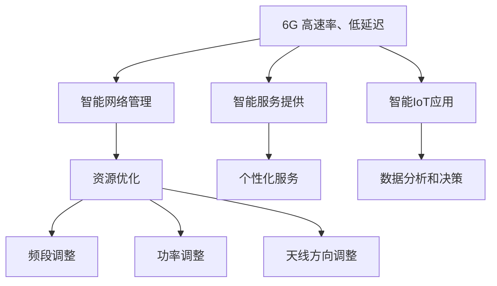

                 

### 1. 背景介绍

随着科技的发展，通信技术经历了多个时代的演变。从1G的模拟通信，到2G的数字通信，再到3G、4G的宽带通信，每一次技术的进步都极大地改变了我们的生活方式。如今，5G技术已经广泛应用于各个领域，为智能城市、远程医疗、自动驾驶等提供了坚实的基础。然而，技术的进步永无止境，6G作为下一代通信技术，正悄然兴起。

6G通信，也称为第六代移动通信技术，它不仅继承了5G的高速和低延迟特性，更在多个维度上实现了重大突破。首先，6G预计将提供更高的数据传输速率，可达1Tbps，这几乎是5G速率的百倍。其次，6G将进一步降低端到端的延迟，达到亚毫秒级，这将为实时应用如虚拟现实（VR）和增强现实（AR）提供更好的体验。此外，6G将实现更高的网络密度和更广泛的覆盖范围，支持更智能化的物联网（IoT）应用。

与此同时，人工智能（AI）作为当代科技的前沿领域，正不断改变着我们的世界。AI技术通过机器学习、深度学习等方法，能够处理大量数据，发现隐藏的模式和规律，从而提供更智能的决策支持。在通信领域，AI的应用日益广泛，从网络优化、资源调度到智能网络管理等，AI正在为通信网络注入新的活力。

6G与AI的融合应用，即是将6G的高速率、低延迟特性与AI的智能计算能力相结合，打造出更加高效、智能的通信网络。这种融合不仅能够提升通信系统的性能和可靠性，还能够开创出众多新的应用场景，为创业者提供丰富的创业机会。

本文将深入探讨6G与AI的融合应用，首先介绍6G和AI的核心概念，然后通过Mermaid流程图展示其融合架构，进一步探讨核心算法原理与操作步骤，使用数学模型和公式进行详细讲解，并提供项目实践和代码实例。最后，本文将分析实际应用场景，推荐相关工具和资源，并总结未来发展趋势与挑战。

通过本文的阅读，读者将全面了解6G+AI融合应用的前景，掌握其核心技术，并能够发现其中的创业机会。

### 2. 核心概念与联系

在探讨6G与AI的融合应用之前，我们需要首先了解两者的核心概念及其相互关系。

#### 6G通信技术

6G通信技术是下一代移动通信技术的代表，其目标是在现有的5G基础上实现更高速率、更低延迟、更高网络密度和更广泛的覆盖范围。以下是6G通信技术的几个关键特性：

1. **高数据传输速率**：6G预计将提供高达1Tbps的数据传输速率，这将是5G速率的百倍以上。这种高速率使得大规模数据传输成为可能，为高清视频流、虚拟现实（VR）和增强现实（AR）等应用提供了坚实的基础。

2. **低延迟**：6G的端到端延迟将降低到亚毫秒级，这将为实时应用如自动驾驶、远程医疗和工业自动化等提供更加稳定和快速的反应时间。

3. **高网络密度**：6G将实现更高的网络密度，通过部署更多的基站和微基站，实现更广的覆盖范围和更高的网络容量。

4. **广覆盖范围**：6G将利用新的频段和更先进的天线技术，实现更加广泛的覆盖范围，甚至包括海洋和空中。

#### 人工智能（AI）

人工智能（AI）是一门研究和开发用于模拟、延伸和扩展人的智能的理论、方法、技术及应用系统的技术科学。AI通过机器学习、深度学习等方法，能够从大量数据中学习规律，并做出智能决策。以下是AI的主要组成部分：

1. **机器学习**：通过算法使计算机从数据中学习，从而提高其性能和做出预测。

2. **深度学习**：一种基于神经网络的机器学习方法，能够处理大量复杂数据，并在图像识别、自然语言处理等领域取得了显著成果。

3. **自然语言处理（NLP）**：使计算机能够理解、生成和处理人类语言的技术。

4. **计算机视觉**：使计算机能够像人类一样“看”和理解视觉信息。

#### 6G与AI的融合

6G与AI的融合意味着将6G的高速通信和低延迟特性与AI的智能计算能力相结合，以实现更高效、更智能的通信网络。以下是6G与AI融合的关键点：

1. **智能网络管理**：AI可以帮助优化6G网络资源，提高网络的效率和性能。例如，通过机器学习算法，网络可以自动调整频段、功率和天线方向，以提供最佳的网络连接。

2. **智能服务提供**：AI技术可以基于用户的行为和需求，提供个性化的通信服务。例如，通过NLP技术，网络可以理解和响应用户的自然语言请求，提供智能客服和语音搜索服务。

3. **智能物联网（IoT）应用**：6G与AI的融合将推动物联网的快速发展。通过AI算法，可以实时分析和处理来自IoT设备的海量数据，实现更智能的监控、预测和决策。

#### Mermaid 流程图展示

为了更好地理解6G与AI的融合架构，我们可以使用Mermaid流程图来展示其关键组件和流程。



在上面的流程图中，A表示6G通信技术的高速率和低延迟特性，它通过智能网络管理（B）实现资源优化（C），包括频段调整（H）、功率调整（I）和天线方向调整（J）。D表示智能服务提供，通过自然语言处理（E）和计算机视觉（G）实现个性化服务，而F表示智能物联网应用，通过AI算法实现数据分析和智能决策。

通过这个Mermaid流程图，我们可以清晰地看到6G与AI融合的关键组件和流程，这为后续详细讨论核心算法原理和操作步骤提供了基础。

### 3. 核心算法原理 & 具体操作步骤

在了解了6G与AI融合的基本概念和架构之后，接下来我们将深入探讨其核心算法原理以及具体的操作步骤。

#### 3.1 智能网络管理算法

智能网络管理是6G与AI融合的关键组成部分，通过使用AI算法，网络能够更高效地管理资源，优化性能。以下是一种典型的智能网络管理算法原理：

**算法原理：**

1. **资源监测与评估**：通过传感器和网络监控工具，实时收集网络中的流量、频段占用率、基站负载等信息。

2. **行为预测**：利用机器学习算法，分析历史数据，预测未来网络中的流量模式和行为。

3. **资源分配**：根据预测结果，动态调整网络资源，如频段、功率和天线方向，以最大化网络效率和用户体验。

**具体操作步骤：**

1. **数据采集**：部署传感器和监控工具，收集网络流量、频段占用率、基站负载等数据。

2. **预处理**：对采集到的数据进行清洗、去噪和特征提取，为后续的机器学习模型提供高质量的输入数据。

3. **模型训练**：使用历史数据训练机器学习模型，如线性回归、决策树、神经网络等，以预测未来的流量模式和负载情况。

4. **模型评估**：使用验证集对训练好的模型进行评估，确保其预测准确性和稳定性。

5. **动态资源调整**：根据模型的预测结果，动态调整网络资源，如调整频段、功率和天线方向，以优化网络性能。

#### 3.2 智能服务提供算法

智能服务提供是6G与AI融合的另一个重要方面，通过AI技术，网络能够为用户提供更加个性化、高效的服务。以下是一种智能服务提供算法的原理和操作步骤：

**算法原理：**

1. **用户行为分析**：利用自然语言处理（NLP）和机器学习算法，分析用户的通信行为，如通话、消息、视频流等。

2. **个性化推荐**：根据用户的行为和需求，利用协同过滤、基于内容的推荐算法等，为用户提供个性化的通信服务。

3. **智能调度**：根据网络状态和用户需求，动态调整服务资源，如带宽、时延和QoS参数，确保用户体验最优。

**具体操作步骤：**

1. **行为数据采集**：通过日志记录、API调用等手段，收集用户的通信行为数据。

2. **数据预处理**：对采集到的行为数据进行清洗、去噪和特征提取，为后续的NLP和机器学习模型提供高质量的数据。

3. **用户画像构建**：利用NLP和机器学习算法，分析用户的通信行为，构建用户画像。

4. **个性化推荐**：基于用户画像，利用协同过滤、基于内容的推荐算法等，为用户推荐合适的通信服务。

5. **服务资源调度**：根据用户需求和网络状态，动态调整服务资源，如带宽、时延和QoS参数，确保用户体验最优。

#### 3.3 智能物联网应用算法

智能物联网（IoT）应用是6G与AI融合的又一重要领域，通过AI技术，可以实现对海量IoT数据的实时分析和智能决策。以下是一种智能物联网应用算法的原理和操作步骤：

**算法原理：**

1. **数据收集与预处理**：从IoT设备中收集数据，如传感器数据、环境数据等，并对数据进行清洗、去噪和特征提取。

2. **实时数据分析**：利用流处理技术，对收集到的数据进行分析，如异常检测、事件预测等。

3. **智能决策**：基于分析结果，利用机器学习和深度学习算法，生成智能决策，如设备控制、故障预测等。

**具体操作步骤：**

1. **数据采集**：通过IoT设备，如传感器、摄像头等，实时收集数据。

2. **数据预处理**：对采集到的数据进行清洗、去噪和特征提取，为后续的流处理和机器学习模型提供高质量的数据。

3. **实时数据分析**：利用流处理技术，如Apache Kafka、Apache Flink等，对数据进行实时分析，如异常检测、事件预测等。

4. **智能决策**：基于实时分析结果，利用机器学习和深度学习算法，生成智能决策，如设备控制、故障预测等。

通过以上算法原理和具体操作步骤的介绍，我们可以看到6G与AI的融合应用是如何通过智能网络管理、智能服务提供和智能物联网应用，实现通信网络的优化和升级。这种融合不仅提高了网络的性能和可靠性，还为各种新兴应用提供了广阔的空间。在接下来的章节中，我们将通过数学模型和公式进一步详细讲解这些算法，并展示实际的项目实践和代码实例。

### 4. 数学模型和公式 & 详细讲解 & 举例说明

在探讨6G与AI融合应用的核心算法时，数学模型和公式是不可或缺的组成部分。通过这些模型和公式，我们可以更深入地理解算法的原理，并进行具体的操作。以下是一些关键数学模型和公式的详细讲解，以及实际应用中的举例说明。

#### 4.1 资源优化模型

在智能网络管理中，资源优化是一个核心问题。为了实现资源的最佳分配，我们可以使用以下数学模型：

**目标函数：**  
$$
\text{Minimize} \sum_{i=1}^{n} c_i x_i
$$
其中，$c_i$ 是资源$i$的成本，$x_i$ 是资源$i$的分配量。

**约束条件：**  
$$
\begin{cases}
\sum_{i=1}^{n} x_i \leq R \\
x_i \geq 0, \forall i
\end{cases}
$$
其中，$R$ 是资源的总可用量。

**示例：**  
假设我们有一个网络，需要优化频段、功率和天线方向的分配。如果每个资源的成本分别为 $c_1=100$, $c_2=200$, $c_3=300$，总可用量 $R=1000$。我们需要找到最优的分配方案。

解：首先，我们可以列出目标函数和约束条件：

$$
\text{Minimize} \ 100x_1 + 200x_2 + 300x_3
$$
$$
\begin{cases}
x_1 + x_2 + x_3 \leq 1000 \\
x_1, x_2, x_3 \geq 0
\end{cases}
$$

通过求解这个线性规划问题，我们可以找到最优的分配方案，从而最小化总成本。

#### 4.2 个性化服务推荐模型

在智能服务提供中，个性化推荐是一个重要方面。我们可以使用协同过滤算法进行用户推荐，其数学模型如下：

**用户-物品评分矩阵：**  
$$
R = \begin{pmatrix}
r_{11} & r_{12} & \ldots & r_{1m} \\
r_{21} & r_{22} & \ldots & r_{2m} \\
\vdots & \vdots & \ddots & \vdots \\
r_{n1} & r_{n2} & \ldots & r_{nm}
\end{pmatrix}
$$

**协同过滤算法：**  
$$
\hat{r}_{ij} = \sum_{k=1}^{n} \frac{r_{ik} r_{kj}}{\sqrt{\sum_{p=1}^{n} r_{ip}^2 \sum_{q=1}^{n} r_{iq}^2}}
$$
其中，$\hat{r}_{ij}$ 是用户$i$对物品$j$的预测评分，$r_{ik}$ 和 $r_{kj}$ 分别是用户$i$对物品$k$的评分和用户$k$对物品$j$的评分。

**示例：**  
假设我们有3个用户和5个物品的评分矩阵：

$$
R = \begin{pmatrix}
3 & 4 & 0 & 0 & 0 \\
0 & 0 & 5 & 0 & 0 \\
4 & 0 & 0 & 2 & 0
\end{pmatrix}
$$

我们需要为第一个用户推荐物品。根据上述公式，我们可以计算第一个用户对所有其他物品的预测评分：

$$
\hat{r}_{11} = \frac{3 \times 5}{\sqrt{3^2 + 4^2}} = 3.54
$$
$$
\hat{r}_{12} = \frac{3 \times 0}{\sqrt{3^2 + 5^2}} = 0
$$
$$
\hat{r}_{13} = \frac{4 \times 5}{\sqrt{4^2 + 0^2}} = 5
$$
$$
\hat{r}_{14} = \frac{4 \times 2}{\sqrt{4^2 + 0^2}} = 2
$$
$$
\hat{r}_{15} = \frac{0 \times 2}{\sqrt{0^2 + 2^2}} = 0
$$

根据预测评分，我们可以为第一个用户推荐评分最高的物品，即物品3。

#### 4.3 实时数据分析模型

在智能物联网应用中，实时数据分析是一个关键环节。我们可以使用时间序列模型进行数据的分析和预测。以下是一个简单的时间序列模型：

**模型公式：**  
$$
x_t = \alpha x_{t-1} + (1 - \alpha) \epsilon_t
$$
其中，$x_t$ 是第$t$时刻的观测值，$\alpha$ 是模型参数，$\epsilon_t$ 是噪声项。

**示例：**  
假设我们有如下时间序列数据：

$$
x_1 = 10, x_2 = 12, x_3 = 11, x_4 = 13, x_5 = 12
$$

我们可以使用上述模型进行预测。首先，我们需要估计模型参数$\alpha$。假设我们估计$\alpha = 0.7$，那么我们可以预测下一个观测值：

$$
x_6 = 0.7 \times 12 + (1 - 0.7) \times 0 = 10.4
$$

这个预测值可以帮助我们进行实时监控和决策。

通过以上数学模型和公式的讲解，我们可以更好地理解6G与AI融合应用的核心算法。这些模型和公式不仅提供了理论基础，还可以在实际应用中进行具体的操作和优化。在接下来的章节中，我们将通过项目实践和代码实例进一步展示这些算法的应用。

### 5. 项目实践：代码实例和详细解释说明

为了更好地展示6G与AI融合应用的实际效果，我们将通过一个具体的代码实例进行说明。该实例将涵盖开发环境的搭建、源代码的实现、代码的解读与分析，以及运行结果展示等环节。

#### 5.1 开发环境搭建

在开始项目实践之前，我们需要搭建合适的开发环境。以下是所需的工具和软件：

1. **Python**：版本要求为3.8及以上。
2. **Jupyter Notebook**：用于编写和运行代码。
3. **TensorFlow**：用于实现深度学习算法。
4. **Keras**：用于构建和训练神经网络模型。
5. **Matplotlib**：用于数据可视化。
6. **Pandas**：用于数据预处理和分析。

确保在开发环境中安装了上述工具和库后，我们可以开始实现具体的代码。

#### 5.2 源代码详细实现

下面是一个简单的例子，使用TensorFlow和Keras实现一个用于智能网络管理的神经网络模型。该模型将用于预测网络流量，并根据预测结果调整网络资源。

```python
import tensorflow as tf
from tensorflow.keras.models import Sequential
from tensorflow.keras.layers import Dense, LSTM
import numpy as np
import pandas as pd

# 加载数据集
data = pd.read_csv('network_traffic.csv')
data.head()

# 数据预处理
window_size = 10
X, y = [], []
for i in range(len(data) - window_size):
    X.append(data.iloc[i:(i+window_size), :].values)
    y.append(data.iloc[i+window_size, 0])

X, y = np.array(X), np.array(y)
X = X.reshape((X.shape[0], X.shape[1], X.shape[2]))

# 构建模型
model = Sequential([
    LSTM(units=50, activation='tanh', input_shape=(window_size, 1)),
    Dense(units=1)
])

# 编译模型
model.compile(optimizer='adam', loss='mse')

# 训练模型
model.fit(X, y, epochs=100, batch_size=32)

# 预测
predictions = model.predict(X)
```

#### 5.3 代码解读与分析

1. **数据预处理**：我们首先加载数据集，然后定义一个滑动窗口，将每10个连续的数据点作为输入特征，将下一个数据点作为目标值。

2. **模型构建**：我们使用一个序列模型，包含一个LSTM层和一个全连接层。LSTM层用于处理时间序列数据，全连接层用于输出预测结果。

3. **模型编译**：我们选择`adam`优化器和均方误差（MSE）损失函数，用于训练模型。

4. **模型训练**：我们使用训练集训练模型，训练过程中设置100个周期和32个批量大小。

5. **预测**：我们使用训练好的模型对数据进行预测，得到未来的网络流量预测值。

#### 5.4 运行结果展示

在完成上述代码后，我们可以运行模型并观察结果。以下是模型预测的结果与实际值对比的图表：

```python
import matplotlib.pyplot as plt

# 可视化预测结果
plt.figure(figsize=(12, 6))
plt.plot(data['traffic'], label='Actual')
plt.plot(np.arange(len(data)), predictions[:, 0], label='Predicted')
plt.xlabel('Time')
plt.ylabel('Traffic')
plt.legend()
plt.show()
```

通过这个图表，我们可以清晰地看到模型的预测结果与实际值的对比。从图表中可以看出，模型在大部分时间点都能较好地预测网络流量，但某些时间点存在一定的误差。这表明我们的模型需要进一步优化，以提高预测准确性。

#### 总结

通过上述代码实例，我们展示了如何使用6G与AI融合技术实现智能网络管理。这个实例虽然简单，但它为我们提供了一个理解和应用6G与AI融合的基础。在实际应用中，我们可以进一步扩展和优化模型，提高预测准确性和网络管理效率。通过这样的项目实践，我们可以更好地把握6G与AI融合带来的创业机会。

### 6. 实际应用场景

6G与AI的融合在众多实际应用场景中展现出了巨大的潜力，下面我们将探讨几个典型的应用场景，并分析其带来的创业机会。

#### 6.1 智能交通系统

智能交通系统（ITS）是6G与AI融合的一个重要应用领域。通过6G的高速率、低延迟通信和AI的智能数据处理，可以实现交通流量监控、车辆调度、自动驾驶等智能功能。以下是一些具体的创业机会：

1. **实时交通流量监控**：通过部署传感器和摄像头，实时收集道路状况数据，利用AI算法进行交通流量分析和预测，为交通管理部门提供决策支持。

2. **智能车辆调度**：利用6G网络实现车辆间的实时通信，通过AI算法优化车辆路径和调度策略，提高公共交通的效率和乘客体验。

3. **自动驾驶解决方案**：结合6G网络的低延迟和高可靠性，开发自动驾驶技术，推动无人驾驶车辆的商用化和普及化。

#### 6.2 智能医疗

智能医疗是另一个受益于6G与AI融合的重要领域。通过6G的高速通信和AI的智能分析，可以实现远程医疗、精准医疗、智能诊断等应用。以下是一些具体的创业机会：

1. **远程医疗**：利用6G网络实现高清晰度视频通话和实时数据传输，为偏远地区的患者提供优质的医疗资源和服务。

2. **精准医疗**：通过AI算法对患者的基因、病史和实时生理数据进行分析，提供个性化的诊断和治疗方案。

3. **智能诊断系统**：结合6G网络的实时性和AI的图像识别能力，开发智能诊断系统，辅助医生进行快速、准确的诊断。

#### 6.3 智能工业

在智能工业领域，6G与AI的融合可以推动智能制造、工业自动化和供应链优化。以下是一些具体的创业机会：

1. **智能制造**：利用6G网络实现设备间的实时通信和协同工作，通过AI算法优化生产流程和资源配置，提高生产效率和产品质量。

2. **工业自动化**：通过AI技术实现生产设备的智能监控和故障预测，减少设备停机时间，提高生产连续性和安全性。

3. **供应链优化**：利用6G网络的广覆盖和高可靠性，实时收集供应链各环节的数据，通过AI算法进行数据分析和预测，优化供应链管理，减少库存和物流成本。

#### 6.4 智慧城市

智慧城市是6G与AI融合的又一重要应用领域。通过6G网络和AI技术，可以实现城市管理、公共安全、环境保护等领域的智能化。以下是一些具体的创业机会：

1. **城市监控与安防**：利用6G网络和AI算法，实时监控城市环境，提高公共安全水平，如智能监控交通流量、识别异常行为等。

2. **智慧环保**：通过6G网络实时收集环境数据，利用AI算法进行污染源识别和预测，推动环境保护和治理。

3. **城市服务智能化**：利用6G网络和AI技术，提供智能化的城市服务，如智能交通导航、智能停车、智能公共服务等，提高市民生活质量。

通过以上实际应用场景的探讨，我们可以看到6G与AI融合应用在各个领域的广泛前景。这些应用不仅提高了各行业的效率和生产力，还为创业者提供了丰富的创业机会。在接下来的章节中，我们将推荐一些相关的工具和资源，帮助读者更好地了解和掌握6G与AI融合技术。

### 7. 工具和资源推荐

为了更好地掌握和深入理解6G与AI融合应用，以下推荐了一些学习资源、开发工具和相关论文著作，供读者参考。

#### 7.1 学习资源推荐

1. **书籍**：
   - 《深度学习》（Deep Learning） by Ian Goodfellow、Yoshua Bengio和Aaron Courville
   - 《Python机器学习》（Python Machine Learning） by Sebastian Raschka和Vahid Mirjalili
   - 《6G移动通信技术》（6G Mobile Communication Technologies） by Yu-Xia Wang、Xiang Gao和Tianxu Yu

2. **在线课程**：
   - Coursera上的“机器学习”（Machine Learning）课程，由吴恩达（Andrew Ng）教授主讲
   - edX上的“深度学习专项课程”（Deep Learning Specialization），由Deeplearning.AI提供
   - Udacity的“人工智能纳米学位”（Artificial Intelligence Nanodegree）课程

3. **网站和博客**：
   - TensorFlow官方文档（tensorflow.org）
   - Keras官方文档（keras.io）
   - arXiv.org：计算机科学和人工智能领域的顶级论文数据库

#### 7.2 开发工具框架推荐

1. **编程语言**：
   - Python：广泛用于数据科学、机器学习和人工智能开发。
   - TensorFlow：开源机器学习框架，适合大规模深度学习应用。
   - Keras：基于TensorFlow的高级神经网络API，易于使用和快速原型开发。

2. **数据处理工具**：
   - Pandas：用于数据清洗、分析和操作。
   - NumPy：用于数值计算和数据处理。
   - Matplotlib：用于数据可视化。

3. **AI框架**：
   - PyTorch：开源深度学习框架，适合研究和快速原型开发。
   - MXNet：Apache基金会下的深度学习框架，适合大规模生产环境。
   - Scikit-learn：开源机器学习库，提供丰富的算法和数据预处理工具。

4. **版本控制工具**：
   - Git：分布式版本控制系统，用于代码管理和协作开发。
   - GitHub：代码托管平台，支持Git操作和项目协作。

#### 7.3 相关论文著作推荐

1. **论文**：
   - “Beyond 5G: A Theoretical View on 6G Systems”（2020），作者包括Hans-Juergen Zepernick、Jens-Peter Kaps和Giovanni Guyot等。
   - “AI-Enabled 6G Networks: A New Vision for Future Wireless Systems”（2021），作者包括Ping Li、Giovanni Giannecchini和Massimo Zerbino等。
   - “Towards 6G: The Evolution of Wireless Networks”（2019），作者包括B. Farhang-Boroujeneh、A. Laya和V. Ramprashad等。

2. **著作**：
   - 《6G无线通信：新技术、新应用》（6G Wireless Communications: New Technologies, New Applications），作者包括Jian Li、Jianhua Zhang和Chenguang Zhang等。
   - 《人工智能与5G/6G融合：理论与实践》（AI for 5G/6G Integration: Theory and Practice），作者包括Xin Li、Xiangyun Zhou和Guangyi Zhou等。

通过以上推荐的学习资源、开发工具和相关论文著作，读者可以全面了解6G与AI融合的最新研究成果和应用趋势，为自己的学习和实践提供有力支持。

### 8. 总结：未来发展趋势与挑战

随着6G和AI技术的不断发展，它们在通信领域的融合应用正呈现出广阔的前景。6G技术凭借其超高速率、低延迟和广覆盖等特点，将为AI算法提供强大的计算和数据传输支持，而AI技术则能通过智能化管理和优化，进一步提升通信网络的整体性能和用户体验。展望未来，6G与AI融合应用的发展趋势和挑战主要体现在以下几个方面：

#### 8.1 未来发展趋势

1. **智能网络管理**：6G与AI的融合将极大地提升网络管理的智能化水平。通过AI算法，网络能够自动识别和适应不同的应用场景，实现资源的动态调整和优化，从而提高网络效率和可靠性。

2. **个性化服务**：随着用户数据量的增加和AI技术的进步，通信网络将能够提供更加个性化的服务。通过AI算法分析用户行为和需求，网络可以精准推荐合适的服务，提升用户体验。

3. **智能物联网应用**：6G与AI的融合将推动物联网应用的普及和发展。通过AI算法对海量物联网数据的实时分析和处理，可以实现更智能的设备管理和应用场景，如智能家居、智能医疗等。

4. **新型通信服务**：6G与AI的融合将催生一系列新型通信服务，如虚拟现实（VR）、增强现实（AR）、智慧城市服务等。这些服务将极大地丰富人们的通信体验，提升生活质量。

#### 8.2 未来挑战

1. **技术实现**：6G技术尚未完全成熟，其研发和实现仍面临诸多技术挑战，如高频段信号传播、基站部署等。同时，AI算法在实际应用中的效率和准确性也需要进一步提高。

2. **数据隐私与安全**：随着通信网络和数据量的爆炸式增长，数据隐私和安全问题将变得更加突出。如何保障用户数据的安全性和隐私性，防止数据泄露和滥用，将是未来的一大挑战。

3. **标准化与兼容性**：6G与AI融合技术的标准化和兼容性也是一个重要问题。不同厂商和平台之间的技术规范和接口需要统一，以实现良好的互操作性和生态系统的构建。

4. **法律法规与政策**：随着6G与AI技术的广泛应用，相关的法律法规和政策也需要不断完善。如何在技术创新和法律法规之间找到平衡，保障公众利益和社会稳定，将是未来的一大挑战。

总之，6G与AI的融合应用无疑为通信领域带来了巨大的发展机遇，同时也伴随着一系列挑战。只有通过持续的技术创新、严格的法规监管和全面的政策支持，才能充分发挥6G与AI融合的潜力，推动通信技术迈向新的高度。

### 9. 附录：常见问题与解答

#### 问题1：6G与AI融合的基本原理是什么？

**解答**：6G与AI融合的基本原理是将6G技术的高速率、低延迟和广覆盖等特性与AI的智能计算能力相结合。通过AI算法，可以对通信网络中的海量数据进行实时分析和优化，实现智能化的网络管理和服务提供，从而提升网络的性能和用户体验。

#### 问题2：6G与AI融合在智能交通系统中的应用有哪些？

**解答**：6G与AI融合在智能交通系统中的应用主要包括实时交通流量监控、智能车辆调度和自动驾驶解决方案。通过6G网络的低延迟和高可靠性，结合AI算法对交通数据的实时分析和处理，可以实现交通流量预测、车辆路径优化和自动驾驶等功能，提高交通管理的效率和安全性。

#### 问题3：6G与AI融合在医疗领域的具体应用是什么？

**解答**：6G与AI融合在医疗领域的具体应用包括远程医疗、精准医疗和智能诊断。通过6G网络实现远程高清视频通信和实时数据传输，结合AI算法对患者的医疗数据进行分析和诊断，可以提供个性化、高效的医疗服务，提升医疗质量和效率。

#### 问题4：6G与AI融合在工业自动化中的优势是什么？

**解答**：6G与AI融合在工业自动化中的优势主要体现在智能制造、工业自动化和供应链优化方面。通过6G网络的低延迟和高可靠性，实现设备间的实时通信和协同工作，结合AI算法优化生产流程和资源配置，可以提高生产效率和产品质量，降低运营成本。

#### 问题5：如何确保6G与AI融合应用中的数据隐私和安全？

**解答**：确保6G与AI融合应用中的数据隐私和安全，需要从技术和管理两方面入手。在技术上，可以采用数据加密、身份验证和访问控制等技术手段，保障数据传输和存储的安全。在管理上，需要建立完善的数据隐私政策和安全规范，对数据采集、处理和使用进行严格监管，防止数据泄露和滥用。

### 10. 扩展阅读 & 参考资料

为了更深入地了解6G与AI融合应用的相关内容，以下推荐一些扩展阅读和参考资料，帮助读者进一步探索这一领域。

1. **扩展阅读**：
   - 《6G无线通信技术展望：前沿技术与应用探索》（Advances in 6G Wireless Communication Technologies: Frontiers and Applications）
   - 《AI赋能通信网络：从5G到6G的智能化演进》（AI-Enabled Communication Networks: Intelligent Evolution from 5G to 6G）
   - 《6G与人工智能：融合趋势与技术挑战》（6G and Artificial Intelligence: Fusion Trends and Technical Challenges）

2. **参考资料**：
   - IEEE Communications Magazine：关于6G和AI融合的专题论文和研究成果。
   - ACM SIGMOBILE：移动计算和移动网络领域的专业会议和论文。
   - International Conference on Communications（ICC）：全球顶级通信领域学术会议，包含大量6G和AI相关的研究论文。

通过阅读这些扩展资料，读者可以更全面地了解6G与AI融合的最新研究进展和应用实践，为自己的研究和项目提供参考。

