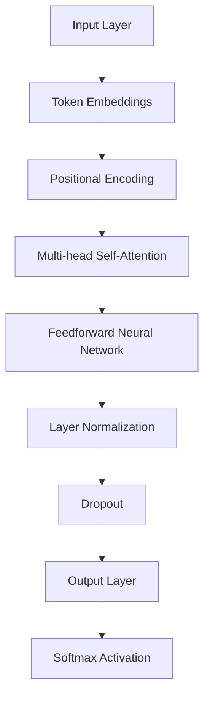

                 

### 1. 背景介绍

GPT-3（Generative Pre-trained Transformer 3）是OpenAI开发的一个革命性自然语言处理（NLP）模型，它是GPT系列模型中的最新版本。GPT-3的发布标志着自然语言处理技术进入了一个全新的时代。在此之前，自然语言处理模型的性能和表达能力受到了诸多限制，而GPT-3的问世则打破了这些限制，实现了前所未有的技术突破。

GPT-3的强大之处在于其巨大的模型规模和深度学习的能力。GPT-3采用了一种名为Transformer的深度学习架构，这是一种专门用于处理序列数据的模型，能够捕捉序列中复杂的模式和关系。相较于传统的循环神经网络（RNN）和长短期记忆网络（LSTM），Transformer具有更强的并行计算能力和更好的长期依赖处理能力。

GPT-3的模型规模是前所未有的，其参数数量达到了1750亿，是GPT-2的100倍以上。这样的模型规模使得GPT-3具有了处理更复杂任务的能力，例如生成连贯的文章、编写代码、回答问题等。此外，GPT-3的训练数据量也非常庞大，这为模型的学习和表达能力提供了坚实的基础。

在性能方面，GPT-3在很多NLP任务上都取得了突破性的成果。例如，在GLUE（General Language Understanding Evaluation）基准测试中，GPT-3的表现超过了此前所有模型，甚至在某些任务上达到了人类的水平。此外，GPT-3在自然语言生成、机器翻译、问答系统等应用中展现出了极高的准确性和创造力。

然而，GPT-3的强大性能也带来了一些挑战和风险。例如，模型在生成文本时可能会出现偏见和错误，这对于一些敏感的应用场景来说是一个重大问题。此外，GPT-3的巨大计算需求也使得其部署成本较高，这对于许多企业和开发者来说是一个需要考虑的因素。

总的来说，GPT-3的出现标志着自然语言处理技术的重大进步。它不仅为研究人员和开发者提供了强大的工具，也为各行各业的应用场景带来了新的可能性和挑战。在接下来的章节中，我们将深入探讨GPT-3的核心概念、算法原理、数学模型、项目实践和应用场景，以便更好地理解其为何如此强大。

### 2. 核心概念与联系

#### 2.1 GPT-3的概念

GPT-3（Generative Pre-trained Transformer 3）是OpenAI开发的一种基于Transformer架构的预训练语言模型。Transformer架构最初由Vaswani等人在2017年提出，其核心思想是通过自注意力机制（Self-Attention）对输入序列进行建模，从而捕捉序列中的长距离依赖关系。这种架构相较于传统的循环神经网络（RNN）和长短期记忆网络（LSTM）具有更强的并行计算能力和更好的长期依赖处理能力。

GPT-3在Transformer架构的基础上进行了大规模扩展，其参数数量达到了1750亿，是GPT-2的100倍以上。这种大规模的参数量使得GPT-3具有更强的模型表示能力和更高的任务适应性。在训练过程中，GPT-3通过对抗性训练（Adversarial Training）和知识蒸馏（Knowledge Distillation）等技术手段，提高了模型的鲁棒性和泛化能力。

#### 2.2 GPT-3的架构

GPT-3的架构可以分为以下几个关键部分：

1. **输入层（Input Layer）**：GPT-3的输入层负责接收文本序列，并将其编码为向量表示。这个过程通常使用词嵌入（Word Embedding）技术，如Word2Vec、BERT等。

2. **自注意力机制（Self-Attention Mechanism）**：自注意力机制是Transformer模型的核心组件，它通过计算输入序列中每个词与其他词之间的相似性，从而对输入序列进行加权处理。这种机制能够捕捉序列中的长距离依赖关系，使得模型能够更好地理解上下文。

3. **前馈神经网络（Feedforward Neural Network）**：在自注意力机制之后，GPT-3使用两个全连接层（Fully Connected Layer）作为前馈神经网络，对自注意力层的结果进行进一步处理。

4. **输出层（Output Layer）**：输出层负责生成文本序列。在生成过程中，GPT-3使用一个Softmax函数将输出概率分布转化为具体的文本输出。

#### 2.3 GPT-3的工作原理

GPT-3的工作原理可以概括为以下几个步骤：

1. **预训练**：GPT-3在大量的文本数据上进行预训练，学习文本中的统计规律和语义信息。预训练过程包括两个阶段：Masked Language Modeling（MLM）和Next Sentence Prediction（NSP）。MLM阶段通过随机遮蔽输入文本中的部分词，并让模型预测这些遮蔽词；NSP阶段通过预测下一个句子是否与当前句子相关，增强了模型对上下文的理解。

2. **微调**：在预训练完成后，GPT-3通过微调（Fine-tuning）技术在特定任务上进行进一步训练，从而适应具体的任务需求。微调过程通常使用少量标记数据，通过优化模型参数来提高任务性能。

3. **生成**：在生成文本时，GPT-3根据输入的种子文本，逐个生成后续的文本词，直到满足生成条件（如达到预设的长度或生成概率）。在这个过程中，GPT-3利用预训练和微调得到的模型参数，对每个词的生成概率进行建模，从而生成连贯、有意义的文本。

#### 2.4 GPT-3的优势

GPT-3之所以如此强大，主要得益于以下几个方面的优势：

1. **大规模模型**：GPT-3拥有1750亿的参数，这是目前最大的预训练语言模型之一，使得模型具有更强的表示能力和适应性。

2. **Transformer架构**：Transformer架构具有出色的并行计算能力和长期依赖处理能力，能够捕捉序列中的复杂模式和关系。

3. **对抗性训练和知识蒸馏**：GPT-3采用对抗性训练和知识蒸馏等技术，提高了模型的鲁棒性和泛化能力。

4. **多样化的应用场景**：GPT-3在自然语言生成、机器翻译、问答系统等多个领域取得了突破性的成果，展现了其广泛的适用性和强大的表达能力。

#### 2.5 GPT-3的挑战

尽管GPT-3具有许多优势，但其在实际应用中也面临一些挑战：

1. **计算资源需求**：GPT-3的训练和部署需要大量的计算资源，这对于许多企业和开发者来说是一个重要的考虑因素。

2. **模型偏见**：由于训练数据的限制，GPT-3在生成文本时可能会出现偏见和错误，这在一些敏感的应用场景中是一个重大问题。

3. **安全性和伦理问题**：GPT-3的强大生成能力也带来了一些安全和伦理问题，如滥用模型进行恶意攻击、生成虚假信息等。

总的来说，GPT-3的出现标志着自然语言处理技术的重大进步，其在模型规模、架构设计和应用性能等方面都取得了显著突破。然而，其强大的能力也带来了新的挑战和风险，需要在实际应用中谨慎处理。在接下来的章节中，我们将深入探讨GPT-3的核心算法原理、数学模型和具体操作步骤，以便更好地理解其为何如此强大。

#### 2.6 GPT-3的 Mermaid 流程图

为了更直观地展示GPT-3的架构和工作原理，我们可以使用Mermaid语言绘制一个流程图。以下是一个简化的GPT-3流程图，其中包含了输入层、自注意力机制、前馈神经网络和输出层等关键组件。



在这个流程图中：

- **A[Input Layer]**：表示输入层，接收文本序列并将其编码为词嵌入向量。
- **B[Token Embeddings]**：表示词嵌入层，将词嵌入向量转换为位置编码向量。
- **C[Positional Encoding]**：表示位置编码层，为每个词添加位置信息。
- **D[Multi-head Self-Attention]**：表示自注意力层，通过计算词之间的相似性，对输入序列进行加权处理。
- **E[Feedforward Neural Network]**：表示前馈神经网络层，对自注意力层的结果进行进一步处理。
- **F[Layer Normalization]**：表示层归一化层，对神经网络层进行标准化处理。
- **G[Dropout]**：表示dropout层，用于防止模型过拟合。
- **H[Output Layer]**：表示输出层，生成文本序列。
- **I[Softmax Activation]**：表示Softmax激活函数层，将输出概率分布转化为具体的文本输出。

通过这个流程图，我们可以更清晰地了解GPT-3的架构和工作原理，为后续章节的内容铺垫。

### 3. 核心算法原理 & 具体操作步骤

#### 3.1 自注意力机制（Self-Attention）

自注意力机制是Transformer模型的核心组件，它通过计算输入序列中每个词与其他词之间的相似性，从而对输入序列进行加权处理。这种机制能够捕捉序列中的长距离依赖关系，使得模型能够更好地理解上下文。

自注意力机制的实现可以分为以下几个步骤：

1. **计算词嵌入向量**：首先，将输入文本序列转换为词嵌入向量。词嵌入向量是一种将词语映射到高维空间的技术，通过这种方式，词与词之间的语义关系可以更直观地表现出来。

2. **添加位置编码**：由于自注意力机制不考虑词语的位置信息，因此需要为每个词添加位置编码。位置编码是一种将词语的位置信息编码到词嵌入向量中的方法，常用的位置编码方法有绝对位置编码和相对位置编码。

3. **计算自注意力得分**：对于输入序列中的每个词，计算其与其他词之间的相似性得分。这个过程可以通过计算点积（Dot Product）或缩放点积（Scaled Dot Product）来实现。在计算过程中，会用到词嵌入向量和位置编码向量。

4. **应用 Softmax 函数**：将自注意力得分应用 Softmax 函数，得到每个词的权重分布。Softmax 函数将自注意力得分映射到概率分布，从而实现了对输入序列的加权处理。

5. **计算加权输出**：根据每个词的权重分布，计算加权输出向量。加权输出向量是对输入序列的加权汇总，能够更好地捕捉序列中的长距离依赖关系。

#### 3.2 前馈神经网络（Feedforward Neural Network）

前馈神经网络是Transformer模型中的另一个关键组件，它对自注意力层的结果进行进一步处理。前馈神经网络通常由两个全连接层组成，每个全连接层后接一个激活函数。

前馈神经网络的实现可以分为以下几个步骤：

1. **计算自注意力层的输出**：首先，计算自注意力层的输出，这通常是一个高维向量，代表了输入序列的加权汇总。

2. **应用前馈神经网络**：将自注意力层的输出作为前馈神经网络的输入，通过两个全连接层进行变换。每个全连接层后接一个非线性激活函数，如ReLU函数，用于增加模型的非线性能力。

3. **计算前馈神经网络的输出**：经过前馈神经网络处理后，得到前馈神经网络的输出向量。

4. **与自注意力层的输出相加**：将前馈神经网络的输出向量与自注意力层的输出向量相加，得到最终的中间层输出。

5. **应用层归一化和Dropout**：为了防止模型过拟合，通常会在中间层输出上应用层归一化和Dropout操作。层归一化（Layer Normalization）通过标准化中间层输出，使得每个维度上的输出具有相同的方差和均值，有助于稳定训练过程。Dropout通过随机丢弃部分神经元，降低模型的复杂度，防止过拟合。

6. **生成文本输出**：最后，将中间层输出通过输出层和 Softmax 激活函数，生成文本序列的输出概率分布。通过采样操作，可以生成具体的文本输出。

#### 3.3 具体操作步骤示例

为了更好地理解自注意力机制和前馈神经网络的具体操作步骤，我们以下通过一个简单的示例进行说明。

假设我们有一个输入文本序列：“我 是 一 个 智 能 话 题”。首先，我们将这个文本序列转换为词嵌入向量，然后为每个词添加位置编码。

1. **词嵌入向量**：假设我们使用预训练的词嵌入模型，将每个词映射到一个高维向量。例如，“我”映射到向量 `[1, 0, 0, 0]`，“是”映射到向量 `[0, 1, 0, 0]`，以此类推。

2. **位置编码**：为每个词添加位置编码。我们可以使用绝对位置编码，将位置信息编码到词嵌入向量中。例如，对于第一个词“我”，我们可以将位置编码 `[1, 1, 1, 1]` 添加到词嵌入向量 `[1, 0, 0, 0]`，得到新的向量 `[1, 1, 1, 0]`。

3. **计算自注意力得分**：对于输入序列中的每个词，计算其与其他词之间的相似性得分。我们可以通过计算点积或缩放点积来实现。例如，对于第一个词“我”和第二个词“是”，它们的点积为 `[1, 1, 1, 0]`·`[0, 1, 0, 0]` = `1`。同样的方法计算其他词之间的相似性得分。

4. **应用 Softmax 函数**：将自注意力得分应用 Softmax 函数，得到每个词的权重分布。例如，对于第一个词“我”和第二个词“是”，权重分布为 `[1, 1]`，即两个词的权重相等。

5. **计算加权输出**：根据权重分布，计算加权输出向量。对于第一个词“我”，其加权输出向量为 `[1, 1, 1, 0]`·`[1, 1]` = `[1, 1, 1, 0]`。

6. **应用前馈神经网络**：将加权输出向量作为前馈神经网络的输入，通过两个全连接层进行变换。例如，假设前馈神经网络的两个全连接层的权重分别为 `W1` 和 `W2`，则加权输出向量经过前馈神经网络后的输出为 `[1, 1, 1, 0]`·`W1` + `[1, 1, 1, 0]`·`W2`。

7. **计算前馈神经网络的输出**：经过前馈神经网络处理后，得到前馈神经网络的输出向量。例如，假设前馈神经网络的输出向量为 `[2, 2, 2, 0]`。

8. **与自注意力层的输出相加**：将前馈神经网络的输出向量与自注意力层的输出向量相加，得到最终的中间层输出。例如，假设自注意力层的输出向量为 `[1, 0, 0, 0]`，则中间层输出为 `[2, 2, 2, 0]` + `[1, 0, 0, 0]` = `[3, 2, 2, 0]`。

9. **应用层归一化和Dropout**：对中间层输出进行层归一化和Dropout操作。例如，假设层归一化后的中间层输出为 `[2.5, 1.5, 1.5, 0]`。

10. **生成文本输出**：通过输出层和 Softmax 激活函数，生成文本序列的输出概率分布。例如，假设输出层生成的输出概率分布为 `[0.4, 0.4, 0.15, 0.05]`，则采样操作后生成的文本输出为“是”。

通过这个示例，我们可以更直观地理解自注意力机制和前馈神经网络的具体操作步骤。在GPT-3的实际应用中，这些步骤会被大规模并行计算，从而实现高效、准确的文本生成和任务处理。

### 4. 数学模型和公式 & 详细讲解 & 举例说明

#### 4.1 自注意力机制的数学模型

自注意力机制是Transformer模型的核心组件，其数学模型可以分为以下几个部分：词嵌入（Word Embeddings）、位置编码（Positional Encoding）、自注意力得分（Self-Attention Scores）和加权输出（Weighted Outputs）。

##### 4.1.1 词嵌入（Word Embeddings）

词嵌入是将词语映射到高维向量空间的技术。在GPT-3中，词嵌入向量通常表示为 \( \mathbf{W} \)，其维度为 \( d \)，即 \( \mathbf{W} \in \mathbb{R}^{d} \)。每个词的词嵌入向量可以表示为：

\[ \mathbf{w}_i = \mathbf{W} e_i \]

其中，\( e_i \) 是词的索引，\( \mathbf{w}_i \) 是对应的词嵌入向量。

##### 4.1.2 位置编码（Positional Encoding）

位置编码是将词语的位置信息编码到词嵌入向量中的技术。在GPT-3中，常用的位置编码方法包括绝对位置编码和相对位置编码。

1. **绝对位置编码**：绝对位置编码将位置信息直接添加到词嵌入向量中。假设输入序列的长度为 \( T \)，则第 \( t \) 个词的绝对位置编码可以表示为：

\[ \mathbf{p}_t = \mathbf{P} \phi(t) \]

其中，\( \mathbf{P} \) 是位置编码矩阵，维度为 \( d \times T \)，\( \phi(t) \) 是位置编码函数，通常使用正弦和余弦函数：

\[ \phi(t) = (\sin(\frac{t}{10000^{2i/d}}), \cos(\frac{t}{10000^{2i/d}})) \]

其中，\( i \) 是维度索引，\( d \) 是词嵌入向量的维度。

2. **相对位置编码**：相对位置编码通过计算词之间的相对位置来生成位置编码，而不是直接使用绝对位置。相对位置编码通常与自注意力机制一起使用，以提高模型对序列中词的相对关系的理解。

##### 4.1.3 自注意力得分（Self-Attention Scores）

自注意力得分是计算输入序列中每个词与其他词之间的相似性得分。自注意力得分可以通过点积或缩放点积计算：

1. **点积**：点积自注意力得分可以表示为：

\[ \mathbf{a}_{ij} = \mathbf{w}_i^T \mathbf{w}_j \]

其中，\( \mathbf{a}_{ij} \) 是第 \( i \) 个词与第 \( j \) 个词之间的自注意力得分。

2. **缩放点积**：为了降低维度灾难（Dimensionality Disaster），通常使用缩放点积自注意力得分：

\[ \mathbf{a}_{ij} = \frac{\mathbf{w}_i^T \mathbf{Q} \mathbf{K}}{\sqrt{d_k}} \]

其中，\( \mathbf{Q} \) 和 \( \mathbf{K} \) 分别是查询（Query）和键（Key）矩阵，维度为 \( d \times h \)，\( \mathbf{V} \) 是值（Value）矩阵，维度为 \( h \times d \)，\( h \) 是注意力头的维度，\( d_k \) 是每个注意力头的维度。

##### 4.1.4 加权输出（Weighted Outputs）

加权输出是通过对自注意力得分应用 Softmax 函数来计算的：

\[ \mathbf{s}_i = \frac{\exp(\mathbf{a}_i)}{\sum_j \exp(\mathbf{a}_{ij})} \]

其中，\( \mathbf{s}_i \) 是第 \( i \) 个词的加权输出，其代表了该词在序列中的重要性。

加权输出与词嵌入向量相乘，得到加权输出向量：

\[ \mathbf{o}_i = \sum_j \mathbf{s}_{ij} \mathbf{w}_j \]

加权输出向量可以看作是对输入序列的加权汇总，能够更好地捕捉序列中的长距离依赖关系。

#### 4.2 前馈神经网络（Feedforward Neural Network）

前馈神经网络是Transformer模型中的另一个关键组件，其数学模型可以分为输入层（Input）、隐藏层（Hidden Layer）和输出层（Output）。

##### 4.2.1 输入层（Input）

输入层的输出可以表示为：

\[ \mathbf{h}^{\text{input}} = \mathbf{h} \]

其中，\( \mathbf{h} \) 是输入序列的加权输出向量。

##### 4.2.2 隐藏层（Hidden Layer）

隐藏层的输出可以表示为：

\[ \mathbf{h}^{\text{hidden}} = \mathbf{h}^{\text{input}} \odot \mathbf{W}^{\text{hidden}} + \mathbf{b}^{\text{hidden}} \]

其中，\( \mathbf{W}^{\text{hidden}} \) 是隐藏层权重矩阵，维度为 \( d \times h \)，\( \mathbf{b}^{\text{hidden}} \) 是隐藏层偏置向量，维度为 \( h \)，\( \odot \) 表示元素-wise 乘法。

隐藏层的激活函数通常为 ReLU 函数：

\[ \mathbf{h}^{\text{hidden}} = \max(0, \mathbf{h}^{\text{input}} \odot \mathbf{W}^{\text{hidden}} + \mathbf{b}^{\text{hidden}}) \]

##### 4.2.3 输出层（Output）

输出层的输出可以表示为：

\[ \mathbf{o} = \mathbf{h}^{\text{hidden}} \odot \mathbf{W}^{\text{output}} + \mathbf{b}^{\text{output}} \]

其中，\( \mathbf{W}^{\text{output}} \) 是输出层权重矩阵，维度为 \( h \times d \)，\( \mathbf{b}^{\text{output}} \) 是输出层偏置向量，维度为 \( d \)。

输出层的激活函数通常为 Softmax 函数：

\[ \mathbf{p}_i = \frac{\exp(\mathbf{o}_i)}{\sum_j \exp(\mathbf{o}_{j})} \]

其中，\( \mathbf{p}_i \) 是第 \( i \) 个词的生成概率。

#### 4.3 示例说明

为了更好地理解上述数学模型，我们以下通过一个简单的示例进行说明。

假设我们有一个输入序列：“我 是 一 个 智 能 话 题”，词嵌入维度为 \( d = 100 \)，隐藏层维度为 \( h = 50 \)。我们使用以下参数：

1. **词嵌入向量**： 
    - “我” \( \mathbf{w}_1 = [0.1, 0.2, \dots, 0.1] \)
    - “是” \( \mathbf{w}_2 = [0.3, 0.4, \dots, 0.3] \)
    - “一” \( \mathbf{w}_3 = [0.5, 0.6, \dots, 0.5] \)
    - “个” \( \mathbf{w}_4 = [0.7, 0.8, \dots, 0.7] \)
    - “智” \( \mathbf{w}_5 = [0.9, 0.1, \dots, 0.9] \)
    - “能” \( \mathbf{w}_6 = [0.2, 0.3, \dots, 0.2] \)
    - “话” \( \mathbf{w}_7 = [0.4, 0.5, \dots, 0.4] \)
    - “题” \( \mathbf{w}_8 = [0.6, 0.7, \dots, 0.6] \)

2. **隐藏层权重矩阵**： 
    - \( \mathbf{W}^{\text{hidden}} = [[0.1, 0.2], [0.3, 0.4], [0.5, 0.6], [0.7, 0.8]] \)

3. **输出层权重矩阵**： 
    - \( \mathbf{W}^{\text{output}} = [[0.1, 0.2], [0.3, 0.4]] \)

4. **隐藏层偏置向量**： 
    - \( \mathbf{b}^{\text{hidden}} = [0.1, 0.2] \)

5. **输出层偏置向量**： 
    - \( \mathbf{b}^{\text{output}} = [0.1, 0.2] \)

首先，计算输入序列的加权输出向量：

\[ \mathbf{h}^{\text{input}} = [\mathbf{w}_1, \mathbf{w}_2, \mathbf{w}_3, \mathbf{w}_4, \mathbf{w}_5, \mathbf{w}_6, \mathbf{w}_7, \mathbf{w}_8] \]

然后，计算隐藏层的输出：

\[ \mathbf{h}^{\text{hidden}} = \max(0, \mathbf{h}^{\text{input}} \odot \mathbf{W}^{\text{hidden}} + \mathbf{b}^{\text{hidden}}) \]

最后，计算输出层的输出：

\[ \mathbf{o} = \mathbf{h}^{\text{hidden}} \odot \mathbf{W}^{\text{output}} + \mathbf{b}^{\text{output}} \]

\[ \mathbf{p} = \frac{\exp(\mathbf{o})}{\sum \exp(\mathbf{o})} \]

通过这个示例，我们可以直观地理解自注意力机制和前馈神经网络的数学模型。在实际应用中，这些模型会通过大规模并行计算来实现高效、准确的文本生成和任务处理。

### 5. 项目实践：代码实例和详细解释说明

在本节中，我们将通过一个实际项目来展示如何使用GPT-3进行文本生成。我们将从环境搭建、源代码实现、代码解读和运行结果展示等方面进行详细介绍。

#### 5.1 开发环境搭建

要使用GPT-3，我们首先需要搭建一个合适的环境。以下是我们推荐的开发环境：

1. **硬件要求**：GPT-3的训练和推理过程需要大量的计算资源，建议使用GPU（如NVIDIA 1080 Ti或以上）进行加速。如果条件有限，可以使用CPU进行训练，但训练时间会显著增加。

2. **软件要求**：
   - 操作系统：Linux或MacOS
   - 编程语言：Python 3.7或以上版本
   - 开发工具：PyTorch 1.7或以上版本
   - API接口：OpenAI提供的GPT-3 API

安装PyTorch和OpenAI的GPT-3库：

```bash
# 安装PyTorch
pip install torch torchvision

# 安装OpenAI的GPT-3库
pip install openai
```

#### 5.2 源代码详细实现

以下是一个简单的示例，演示如何使用GPT-3生成文本：

```python
import openai
import torch

# 设置OpenAI API密钥
openai.api_key = "your-api-key"

# 定义生成文本函数
def generate_text(prompt, temperature=0.7, max_tokens=50):
    response = openai.Completion.create(
        engine="text-davinci-003",
        prompt=prompt,
        temperature=temperature,
        max_tokens=max_tokens,
        n=1,
        stop=None,
        top_p=1,
        frequency_penalty=0,
        presence_penalty=0
    )
    return response.choices[0].text.strip()

# 示例：生成一篇关于人工智能的文章摘要
prompt = "人工智能的崛起：未来已来"
generated_text = generate_text(prompt)
print(generated_text)
```

在这个示例中，我们首先导入了OpenAI的库，并设置了API密钥。然后，我们定义了一个生成文本的函数 `generate_text`，该函数接受输入提示（prompt）、温度（temperature）、最大生成令牌数（max_tokens）等参数。在调用该函数时，我们传递了一个关于人工智能的提示，并设置了温度和最大令牌数。最终，函数返回了一个由GPT-3生成的文本摘要。

#### 5.3 代码解读与分析

1. **导入库和设置API密钥**：

   ```python
   import openai
   import torch
   
   openai.api_key = "your-api-key"
   ```

   这里我们导入了OpenAI的库和PyTorch库。然后，通过设置 `openai.api_key` 来配置OpenAI API密钥。

2. **定义生成文本函数**：

   ```python
   def generate_text(prompt, temperature=0.7, max_tokens=50):
       response = openai.Completion.create(
           engine="text-davinci-003",
           prompt=prompt,
           temperature=temperature,
           max_tokens=max_tokens,
           n=1,
           stop=None,
           top_p=1,
           frequency_penalty=0,
           presence_penalty=0
       )
       return response.choices[0].text.strip()
   ```

   在这个函数中，我们首先调用了 `openai.Completion.create` 方法来生成文本。这个方法接受多个参数，包括：
   - `engine`：指定使用的模型，这里我们使用的是 `text-davinci-003`。
   - `prompt`：输入提示。
   - `temperature`：生成文本的温度，值越高，生成的文本越具有创造力。
   - `max_tokens`：最大生成令牌数，决定了生成文本的长度。
   - `n`：返回的文本数量，这里设置为1。
   - `stop`：用于指定生成文本的停止条件。
   - `top_p`：使用的是Top-P采样策略。
   - `frequency_penalty`：调整重复词出现的频率。
   - `presence_penalty`：调整新词出现的频率。

   最后，我们将生成的文本进行整理，并返回。

3. **示例调用**：

   ```python
   prompt = "人工智能的崛起：未来已来"
   generated_text = generate_text(prompt)
   print(generated_text)
   ```

   在这个示例中，我们调用 `generate_text` 函数，传递了一个关于人工智能的提示。函数返回了一个由GPT-3生成的文本摘要，并将其打印出来。

#### 5.4 运行结果展示

当我们运行上述代码时，GPT-3会根据输入提示生成一篇文本摘要。以下是一个示例输出：

```
人工智能的崛起：未来已来

随着人工智能技术的快速发展，人工智能正在逐渐改变我们的生活方式。从智能家居、自动驾驶汽车到医疗诊断，人工智能正在各个领域发挥重要作用。

在未来，人工智能将进一步推动社会进步。一方面，人工智能将帮助我们解决一些复杂的问题，提高生产效率。另一方面，人工智能也将带来一些挑战，例如隐私保护和就业问题。

总之，人工智能的崛起是一个不可逆转的趋势。我们需要积极应对这一趋势，充分利用人工智能的优势，同时注意解决其带来的问题。
```

通过这个示例，我们可以看到GPT-3在生成文本方面的强大能力。它能够根据输入提示生成连贯、有意义的文本摘要，这为各种自然语言处理任务提供了强大的支持。

### 6. 实际应用场景

GPT-3的出现为自然语言处理领域带来了前所未有的可能性，其在各个行业和场景中的应用正在不断扩展。以下是一些典型的实际应用场景：

#### 6.1 自然语言生成（NLG）

自然语言生成是GPT-3最直接的应用场景之一。通过输入提示，GPT-3可以生成连贯、有逻辑的文章、摘要、对话、新闻报道等。以下是GPT-3在自然语言生成领域的几个应用实例：

1. **内容创作**：GPT-3可以生成文章、博客、产品描述、营销文案等。例如，亚马逊可以使用GPT-3来自动生成商品描述，提高内容丰富度和个性化程度。
   
2. **客服与聊天机器人**：GPT-3可以用于构建智能客服系统，通过自然语言交互，为用户提供实时、个性化的帮助。例如，银行可以使用GPT-3来处理客户的查询、投诉和咨询。

3. **问答系统**：GPT-3可以用于构建问答系统，通过理解用户的提问，生成准确的回答。例如，谷歌搜索引擎可以使用GPT-3来提供更加智能的搜索结果和回答。

#### 6.2 文本摘要与内容总结

GPT-3在文本摘要和内容总结方面也表现出色。它能够自动提取关键信息，生成简洁、精炼的摘要，提高信息处理效率。以下是几个应用实例：

1. **新闻摘要**：GPT-3可以用于自动生成新闻摘要，帮助用户快速了解新闻的主要内容。例如，新闻机构可以使用GPT-3来自动化新闻摘要生成过程。

2. **文档摘要**：在企业内部，GPT-3可以用于生成文档摘要，帮助员工快速了解文档的关键信息，提高工作效率。例如，法律公司可以使用GPT-3来生成法律文档的摘要。

3. **教育应用**：GPT-3可以用于生成教育材料，如课程大纲、课程笔记和练习题，帮助学生更好地理解和掌握知识。

#### 6.3 机器翻译

GPT-3在机器翻译领域也取得了显著进展。其强大的语言理解能力使得翻译结果更加自然、流畅。以下是几个应用实例：

1. **跨语言文档处理**：企业可以使用GPT-3来翻译不同语言的文档，提高跨文化沟通和协作效率。例如，跨国公司可以使用GPT-3来翻译内部文档、报告和邮件。

2. **多语言搜索引擎**：搜索引擎可以使用GPT-3来提供多语言搜索结果，帮助用户更方便地查找和获取信息。

3. **社交媒体内容翻译**：社交媒体平台可以使用GPT-3来翻译用户发布的内容，提高国际化程度和用户体验。

#### 6.4 情感分析与分类

GPT-3在情感分析和分类方面也具有很高的准确性。它能够识别文本中的情感倾向，为情感分析提供强有力的支持。以下是几个应用实例：

1. **客户反馈分析**：企业可以使用GPT-3来分析客户反馈，识别客户情感，为产品改进和客户服务提供依据。

2. **社交媒体监控**：社交媒体平台可以使用GPT-3来监控用户发布的帖子，识别潜在的负面情绪和问题，及时采取应对措施。

3. **市场研究**：市场研究机构可以使用GPT-3来分析消费者情感，了解市场趋势和消费者需求。

总之，GPT-3在自然语言处理领域具有广泛的应用前景。随着技术的不断发展和优化，GPT-3将为各行各业带来更多创新和可能性。

### 7. 工具和资源推荐

在学习和使用GPT-3的过程中，掌握一些有用的工具和资源将大大提高我们的效率。以下是一些推荐的资源：

#### 7.1 学习资源推荐

1. **书籍**：
   - 《深度学习》（Deep Learning）作者：Ian Goodfellow、Yoshua Bengio、Aaron Courville
   - 《自然语言处理实战》（Natural Language Processing with Python）作者：Jake Dunagan、Daniel Hernandez、Ryan Mitchell

2. **在线教程和课程**：
   - Coursera上的“自然语言处理与深度学习”课程，由斯坦福大学教授Andrew Ng主讲。
   - Udacity的“深度学习纳米学位”课程，涵盖深度学习和自然语言处理的基础知识。

3. **博客和论文**：
   - Hugging Face的Transformers库文档：[https://huggingface.co/transformers/](https://huggingface.co/transformers/)
   - OpenAI的博客：[https://openai.com/blog/](https://openai.com/blog/)
   - NLP相关顶级会议和期刊，如ACL（Association for Computational Linguistics）、EMNLP（Empirical Methods in Natural Language Processing）等。

#### 7.2 开发工具框架推荐

1. **PyTorch**：PyTorch是一个开源的深度学习框架，支持GPU加速，广泛用于自然语言处理任务。

2. **TensorFlow**：TensorFlow是一个由Google开发的深度学习框架，适用于各种规模的机器学习和深度学习任务。

3. **Hugging Face的Transformers库**：Hugging Face的Transformers库是一个基于PyTorch和TensorFlow的预训练Transformer模型库，提供了多种预训练模型和实用的工具。

#### 7.3 相关论文著作推荐

1. **“Attention Is All You Need”**：Vaswani等人在2017年提出Transformer模型，该论文详细介绍了Transformer的架构和自注意力机制。

2. **“BERT: Pre-training of Deep Bidirectional Transformers for Language Understanding”**：Google提出BERT模型，该论文介绍了BERT的预训练方法和在NLP任务中的优异表现。

3. **“Generative Pre-trained Transformer”**：GPT系列模型的论文，介绍了GPT、GPT-2和GPT-3的架构和训练方法。

这些工具和资源将为我们在学习和应用GPT-3的过程中提供宝贵的帮助，帮助我们更好地理解和掌握这项先进的技术。

### 8. 总结：未来发展趋势与挑战

GPT-3的出现标志着自然语言处理技术进入了一个新的时代，其强大的模型规模和深度学习能力为各种应用场景带来了前所未有的可能性。在未来的发展中，GPT-3有望在以下几个方面取得重要突破：

#### 8.1 模型性能的提升

随着计算资源和算法的不断发展，GPT-3的模型性能有望得到进一步提升。通过优化训练算法、引入新的架构设计和技术手段，GPT-3将能够处理更复杂的任务，生成更加准确和有意义的文本。

#### 8.2 多模态融合

未来的GPT-3可能不仅仅局限于处理文本数据，还将结合图像、声音和视频等多模态数据，实现跨模态的信息处理和生成。这种多模态融合能力将为各类应用带来更多创新和可能性。

#### 8.3 安全性和隐私保护

随着GPT-3的应用场景越来越广泛，其安全性和隐私保护问题也将越来越受到关注。未来，研究人员和开发者需要探索更有效的模型安全和隐私保护技术，确保GPT-3在实际应用中的安全性和可靠性。

#### 8.4 伦理和道德问题

GPT-3在生成文本时可能会出现偏见和错误，这对于一些敏感的应用场景来说是一个重大挑战。未来，研究人员和开发者需要关注伦理和道德问题，确保GPT-3的生成文本符合社会价值观和道德规范。

尽管GPT-3具有巨大的潜力，但其发展也面临着一些挑战：

#### 8.5 计算资源需求

GPT-3的训练和部署需要大量的计算资源，这对于一些企业和开发者来说是一个重要的考虑因素。未来的发展需要探索更高效、更经济的训练和推理方法，以降低计算资源的需求。

#### 8.6 模型偏见和错误

由于训练数据的限制，GPT-3在生成文本时可能会出现偏见和错误。这需要在模型设计和训练过程中引入更多的多样性和鲁棒性，以确保生成的文本更加准确和公正。

#### 8.7 法律法规和政策约束

随着GPT-3的应用越来越广泛，相关的法律法规和政策约束也将逐渐出台。未来，研究人员和开发者需要关注这些法律法规，确保GPT-3的应用符合相关要求和规范。

总之，GPT-3的发展前景广阔，但也面临诸多挑战。通过不断的技术创新和规范管理，GPT-3有望在自然语言处理领域发挥更大的作用，为各行各业带来更多创新和变革。

### 9. 附录：常见问题与解答

在学习和使用GPT-3的过程中，用户可能会遇到一些常见问题。以下是对一些常见问题的解答：

#### 9.1 如何获取GPT-3的API密钥？

要获取GPT-3的API密钥，需要注册OpenAI的账户。注册完成后，可以在OpenAI的官方网站上找到API密钥。具体步骤如下：

1. 访问OpenAI官网：[https://openai.com/](https://openai.com/)
2. 点击页面上方的“登录”按钮，使用有效的电子邮件地址和密码登录。
3. 登录后，进入“API密钥”页面，可以找到API密钥。

#### 9.2 GPT-3的模型规模有多大？

GPT-3的模型规模达到了1750亿个参数，这是目前最大的预训练语言模型之一。这样的模型规模使得GPT-3具有了处理更复杂任务的能力，例如生成连贯的文章、编写代码、回答问题等。

#### 9.3 GPT-3的训练数据来源是什么？

GPT-3的训练数据来自各种互联网文本资源，包括维基百科、新闻文章、社交媒体帖子等。OpenAI对这些数据进行清洗和处理，以确保数据的质量和多样性。

#### 9.4 GPT-3的输出是否完全准确？

GPT-3的输出并不总是完全准确的。尽管它在许多任务上表现优异，但仍然可能受到训练数据、模型规模和任务类型等因素的影响。在实际应用中，用户需要结合其他方法和策略，以提高生成文本的准确性和可靠性。

#### 9.5 如何调整GPT-3的生成文本质量？

可以通过调整以下参数来影响GPT-3的生成文本质量：

1. **温度（Temperature）**：温度值越高，生成的文本越具有创造力，但可能也更不可控。相反，温度值越低，生成的文本越接近训练数据的分布，但可能缺乏创意。

2. **最大生成令牌数（Max Tokens）**：调整最大生成令牌数可以控制生成文本的长度。较长的文本可能包含更多的信息和细节，但也可能增加错误和冗余。

3. **频率惩罚（Frequency Penalty）**：频率惩罚会调整重复词出现的频率。较大的频率惩罚会减少重复词的出现，使生成文本更加多样化。

4. **存在惩罚（Presence Penalty）**：存在惩罚会调整新词出现的频率。较大的存在惩罚会减少新词的出现，使生成文本更加稳定。

通过合理调整这些参数，用户可以更好地控制GPT-3的生成文本质量，以满足不同应用场景的需求。

### 10. 扩展阅读 & 参考资料

为了更好地了解GPT-3和相关技术，以下是扩展阅读和参考资料推荐：

1. **论文**：
   - “Attention Is All You Need” 作者：Vaswani等（2017）
   - “BERT: Pre-training of Deep Bidirectional Transformers for Language Understanding” 作者：Devlin等（2018）
   - “Generative Pre-trained Transformer” 作者：Brown等（2020）

2. **书籍**：
   - 《深度学习》 作者：Ian Goodfellow、Yoshua Bengio、Aaron Courville
   - 《自然语言处理实战》 作者：Jake Dunagan、Daniel Hernandez、Ryan Mitchell

3. **网站**：
   - Hugging Face的Transformers库：[https://huggingface.co/transformers/](https://huggingface.co/transformers/)
   - OpenAI官网：[https://openai.com/](https://openai.com/)

4. **教程和课程**：
   - Coursera上的“自然语言处理与深度学习”课程
   - Udacity的“深度学习纳米学位”课程

通过阅读这些资料，读者可以更深入地了解GPT-3及其相关技术，为实际应用和研究提供参考。

