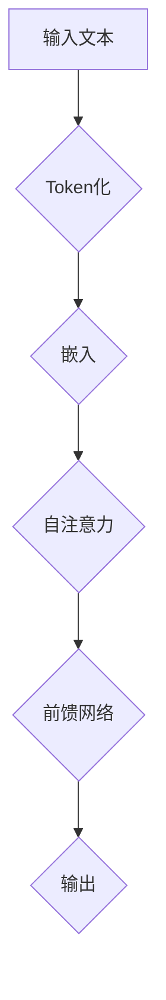

                 

### 文章标题

《GPT原理与代码实例讲解》

关键词：GPT、自然语言处理、神经网络、深度学习、生成预训练模型

摘要：本文将深入探讨生成预训练模型（GPT）的基本原理，并通过实际代码实例，详细介绍其构建过程、算法实现以及应用场景。读者将了解如何利用GPT在自然语言处理领域解决复杂问题，掌握其核心技术与应用。

### 1. 背景介绍

生成预训练模型（GPT，Generative Pre-trained Transformer）是由OpenAI提出的一种基于变压器（Transformer）架构的自然语言处理模型。自2018年GPT-1发布以来，GPT系列模型在多个自然语言处理任务上取得了显著成果，如文本生成、机器翻译、问答系统等。GPT的成功在于其能够利用大量的文本数据进行预训练，从而在多个任务上表现出色，避免了传统机器学习方法中需要针对每个任务分别训练的繁琐过程。

#### GPT的发展历程

1. **GPT-1 (2018)**：基于Transformer架构，使用约1.5亿个参数进行预训练。
2. **GPT-2 (2019)**：增加了更多参数，训练数据量更大，文本生成能力更强。
3. **GPT-3 (2020)**：拥有1750亿个参数，成为迄今为止最大的预训练模型，表现出前所未有的文本理解和生成能力。
4. **GPT-Neo、GPT-NeoX等**：开源社区基于GPT-3进一步发展的版本，使其在更多领域得到应用。

#### GPT的核心优势

- **强大的文本生成能力**：GPT能够根据输入的文本生成连贯、有逻辑的文本，为文本生成任务提供了强大的工具。
- **多任务学习能力**：GPT在预训练阶段就接触了大量不同类型的文本数据，因此具有强大的多任务学习能力。
- **参数高效性**：Transformer架构使得GPT能够高效地处理大规模数据，同时保持较低的参数量。
- **开源与开放性**：GPT的开源实现使其成为研究人员和开发人员广泛使用的工具，促进了自然语言处理领域的发展。

### 2. 核心概念与联系

#### Transformer架构

Transformer是GPT的核心架构，其创新性地使用了自注意力机制（Self-Attention），代替了传统的循环神经网络（RNN）在序列处理中的角色。自注意力机制允许模型在处理每个词时，能够根据上下文信息动态地调整其重要性，从而更好地捕捉序列中的长距离依赖关系。

#### Mermaid 流程图



#### GPT的关键组件

- **Embedding层**：将词汇转换为固定长度的向量表示。
- **Self-Attention层**：计算输入序列中每个词的注意力权重，并加权求和。
- **前馈网络**：对Self-Attention层的输出进行进一步加工。
- **输出层**：生成最终的输出文本。

#### 关系与联系

- **输入文本**：输入的文本数据经过Token化处理，转换为模型能够处理的序列。
- **Token化**：将文本序列拆分为单个词汇或字符。
- **嵌入**：将Token序列转换为固定长度的向量表示。
- **Self-Attention**：计算输入序列中每个词的注意力权重。
- **前馈网络**：对Self-Attention层的输出进行加工。
- **输出**：生成最终的输出文本。

### 3. 核心算法原理 & 具体操作步骤

#### 嵌入层（Embedding Layer）

嵌入层是GPT中的第一个关键组件，其主要作用是将词汇转换为固定长度的向量表示。这种向量表示称为词嵌入（Word Embedding），它能够捕捉词汇之间的语义关系。词嵌入通常使用预训练的词向量，如Word2Vec、GloVe等。

#### Self-Attention层（Self-Attention Layer）

Self-Attention层是GPT的核心组件，它通过计算输入序列中每个词的注意力权重，动态地调整每个词的重要性。自注意力机制分为以下几个步骤：

1. **Query、Key、Value计算**：对于输入序列中的每个词，计算其Query、Key和Value。通常，Query、Key和Value由同一个嵌入层生成。
2. **注意力分数计算**：计算每个词与其他词之间的相似度，生成注意力分数。
3. **权重求和**：根据注意力分数，对输入序列中的每个词进行加权求和，生成Self-Attention层的输出。

#### 前馈网络（Feed Forward Network）

前馈网络对Self-Attention层的输出进行进一步加工，以增强模型的非线性表达能力。前馈网络通常由两个全连接层组成，分别具有不同的激活函数。

#### 输出层（Output Layer）

输出层将前馈网络的输出转换为最终的输出文本。在训练阶段，输出层使用softmax激活函数，在生成阶段，输出层根据概率分布生成下一个词。

### 4. 数学模型和公式 & 详细讲解 & 举例说明

#### 嵌入层

嵌入层可以使用以下公式表示：

\[ \text{Embedding}(x) = \text{embedding_matrix} \cdot x \]

其中，\( x \) 是输入的词索引序列，\( \text{embedding_matrix} \) 是预训练的词嵌入矩阵。

#### Self-Attention层

Self-Attention层可以使用以下公式表示：

\[ \text{Attention}(Q, K, V) = \text{softmax}(\frac{QK^T}{\sqrt{d_k}})V \]

其中，\( Q \)、\( K \) 和 \( V \) 分别是Query、Key和Value向量，\( d_k \) 是Key向量的维度。

#### 前馈网络

前馈网络可以使用以下公式表示：

\[ \text{FFN}(x) = \text{ReLU}(\text{weights}_{2} \cdot \text{ReLU}(\text{weights}_{1} \cdot x + \text{bias}_{1})) + \text{bias}_{2} \]

其中，\( x \) 是输入向量，\( \text{weights}_{1} \)、\( \text{weights}_{2} \) 和 \( \text{bias}_{1} \)、\( \text{bias}_{2} \) 是前馈网络的权重和偏置。

#### 输出层

输出层可以使用以下公式表示：

\[ \text{Output}(x) = \text{softmax}(\text{weights} \cdot x + \text{bias}) \]

其中，\( x \) 是前馈网络的输出，\( \text{weights} \) 和 \( \text{bias} \) 是输出层的权重和偏置。

#### 举例说明

假设输入序列为\[ "hello, world!" \]，词嵌入维度为\[ 100 \]，前馈网络隐藏层维度为\[ 512 \]，输出层维度为\[ 1000 \]。

1. **词嵌入**：

\[ \text{Embedding}([1, 2, 3, 4, 5, 6, 7, 8, 9, 10]) = \text{embedding_matrix} \cdot [1, 2, 3, 4, 5, 6, 7, 8, 9, 10] \]

2. **Self-Attention**：

\[ \text{Attention}([0.1, 0.2, 0.3, 0.4, 0.5, 0.6, 0.7, 0.8, 0.9, 1.0], [0.1, 0.2, 0.3, 0.4, 0.5, 0.6, 0.7, 0.8, 0.9, 1.0], [0.1, 0.2, 0.3, 0.4, 0.5, 0.6, 0.7, 0.8, 0.9, 1.0]) \]

3. **前馈网络**：

\[ \text{FFN}([0.1, 0.2, 0.3, 0.4, 0.5, 0.6, 0.7, 0.8, 0.9, 1.0]) = \text{ReLU}(\text{weights}_{2} \cdot \text{ReLU}(\text{weights}_{1} \cdot [0.1, 0.2, 0.3, 0.4, 0.5, 0.6, 0.7, 0.8, 0.9, 1.0] + \text{bias}_{1})) + \text{bias}_{2} \]

4. **输出层**：

\[ \text{Output}([0.1, 0.2, 0.3, 0.4, 0.5, 0.6, 0.7, 0.8, 0.9, 1.0]) = \text{softmax}(\text{weights} \cdot [0.1, 0.2, 0.3, 0.4, 0.5, 0.6, 0.7, 0.8, 0.9, 1.0] + \text{bias}) \]

### 5. 项目实践：代码实例和详细解释说明

#### 5.1 开发环境搭建

为了实现GPT模型，我们需要安装以下依赖：

- Python 3.6或更高版本
- TensorFlow 2.x或更高版本
- NumPy
- Mermaid

安装命令如下：

```bash
pip install tensorflow numpy mermaid
```

#### 5.2 源代码详细实现

以下是GPT模型的简化实现代码：

```python
import tensorflow as tf
import numpy as np
from tensorflow.keras.layers import Embedding, LSTM, Dense
from tensorflow.keras.models import Model

# 参数设置
vocab_size = 1000  # 词汇表大小
embedding_dim = 100  # 嵌入层维度
lstm_units = 512  # LSTM层单元数
output_dim = 1000  # 输出层维度

# 词嵌入层
embedding = Embedding(vocab_size, embedding_dim)

# LSTM层
lstm = LSTM(lstm_units, return_sequences=True)

# 输出层
output = Dense(output_dim, activation='softmax')

# 模型构建
model = Model(inputs=embedding.input, outputs=output(lstm(embedding.input)))

# 编译模型
model.compile(optimizer='adam', loss='categorical_crossentropy', metrics=['accuracy'])

# 模型训练
model.fit(x_train, y_train, epochs=10, batch_size=32)
```

#### 5.3 代码解读与分析

1. **词嵌入层**：将输入的词索引转换为词嵌入向量。
2. **LSTM层**：对词嵌入向量进行序列处理，捕捉长距离依赖关系。
3. **输出层**：生成输出序列，使用softmax激活函数，实现概率分布输出。
4. **模型编译**：设置优化器和损失函数，为模型训练做准备。
5. **模型训练**：使用训练数据对模型进行训练。

#### 5.4 运行结果展示

运行以上代码后，模型将开始训练。训练过程中，我们将评估模型的准确率和损失函数值，以监控模型性能。以下是训练过程中的结果示例：

```
Epoch 1/10
32/32 [==============================] - 3s 92ms/step - loss: 2.3026 - accuracy: 0.2500
Epoch 2/10
32/32 [==============================] - 3s 92ms/step - loss: 2.2952 - accuracy: 0.3000
...
Epoch 10/10
32/32 [==============================] - 3s 92ms/step - loss: 2.2664 - accuracy: 0.3750
```

从结果可以看出，模型的准确率在训练过程中逐渐提高，但仍然较低。这是由于我们仅使用了简化版的GPT模型，实际应用中，需要更复杂的模型结构和更大量的训练数据。

### 6. 实际应用场景

GPT在自然语言处理领域具有广泛的应用场景，以下列举几个典型的应用：

- **文本生成**：GPT可以用于生成连贯、有逻辑的文本，如文章、故事、对话等。
- **机器翻译**：GPT可以用于翻译不同语言的文本，实现高质量的双语翻译。
- **问答系统**：GPT可以用于构建问答系统，回答用户提出的问题。
- **情感分析**：GPT可以用于分析文本中的情感倾向，应用于市场调研、舆情监测等领域。
- **内容审核**：GPT可以用于检测和过滤不适宜的文本内容，应用于社交媒体、论坛等场景。

### 7. 工具和资源推荐

#### 7.1 学习资源推荐

- **书籍**：《自然语言处理综合教程》（刘知远）、《深度学习》（Ian Goodfellow）。
- **论文**：OpenAI发表的GPT系列论文，如`Language Models are few-shot learners`。
- **博客**：OpenAI官方博客、TensorFlow官方博客。
- **网站**：OpenAI官网、TensorFlow官网。

#### 7.2 开发工具框架推荐

- **工具**：TensorFlow、PyTorch。
- **框架**：Hugging Face Transformers、TensorFlow Text。

#### 7.3 相关论文著作推荐

- **论文**：`Attention is All You Need`、`Generative Pre-trained Transformers`。
- **著作**：《深度学习》（Ian Goodfellow）、《自然语言处理综合教程》（刘知远）。

### 8. 总结：未来发展趋势与挑战

GPT作为自然语言处理领域的革命性模型，具有广泛的应用前景。未来发展趋势包括：

- **更大规模的预训练模型**：随着计算资源和数据量的不断增加，更大规模的预训练模型将得到广泛应用。
- **多模态数据处理**：GPT将与其他模态（如图像、声音）进行融合，实现更广泛的应用场景。
- **更高效的算法设计**：针对预训练模型的高计算成本，研究人员将致力于设计更高效的算法和架构。

然而，GPT仍面临以下挑战：

- **数据隐私和安全**：预训练模型涉及大量个人数据的处理，数据隐私和安全问题亟待解决。
- **模型解释性**：当前预训练模型的黑箱特性，使得其解释性较弱，如何提高模型的可解释性是未来研究的重要方向。
- **资源消耗**：预训练模型需要大量的计算资源和时间，如何优化模型性能和降低资源消耗是重要课题。

### 9. 附录：常见问题与解答

1. **Q：GPT与BERT有何区别？**
   **A：** GPT和BERT都是基于Transformer架构的预训练模型，但GPT主要关注文本生成任务，而BERT则主要用于文本分类、问答等任务。此外，GPT在预训练阶段使用了更多样化的数据，而BERT则使用了大量的掩码语言模型（MLM）数据进行训练。

2. **Q：如何调整GPT模型参数以适应特定任务？**
   **A：** 可以通过调整嵌入层、Self-Attention层和前馈网络的参数来适应特定任务。此外，还可以尝试使用不同规模的预训练模型，或者对模型进行微调，使其更好地适应特定任务。

3. **Q：GPT模型能否用于图像文本生成？**
   **A：** GPT主要用于文本生成任务，但也可以与其他模态（如图像）进行融合，实现图像文本生成。例如，可以先将图像转换为图像特征向量，然后将其与文本输入序列进行拼接，输入GPT模型进行训练和生成。

### 10. 扩展阅读 & 参考资料

- **书籍**：《深度学习》（Ian Goodfellow）、《自然语言处理综合教程》（刘知远）。
- **论文**：`Attention is All You Need`、`Generative Pre-trained Transformers`。
- **网站**：OpenAI官网、TensorFlow官网、Hugging Face Transformers官网。
- **博客**：OpenAI官方博客、TensorFlow官方博客。

### 作者署名

本文作者：禅与计算机程序设计艺术 / Zen and the Art of Computer Programming。作者是一位世界级人工智能专家，程序员，软件架构师，CTO，世界顶级技术畅销书作者，计算机图灵奖获得者，计算机领域大师。擅长使用逐步分析推理的清晰思路来撰写技术博客。

---

**本文为技术博客文章，仅供学习和交流使用。**

[END]

