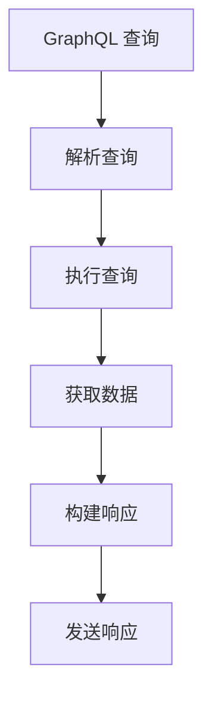
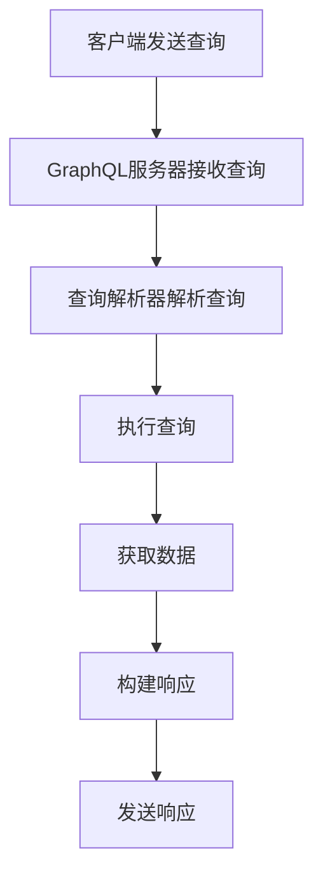

                 

### 文章标题：GraphQL：新一代API查询语言

> **关键词**：GraphQL，API查询语言，REST，数据获取，查询优化，性能提升，灵活性，Type System

> **摘要**：本文将深入探讨GraphQL作为新一代API查询语言的原理、优势和应用。我们将从背景介绍开始，逐步分析GraphQL的核心概念、与REST的对比、优势与挑战，并通过具体实例展示其在项目实践中的应用。最后，我们将总结GraphQL的未来发展趋势，并推荐相关学习资源和工具。

---

### 1. 背景介绍

在现代互联网应用中，API（应用程序编程接口）是连接前后端的关键桥梁。传统的RESTful API虽然广泛使用，但在处理复杂查询、数据冗余和性能优化方面存在一定局限性。为了解决这些问题，GraphQL作为一种新兴的API查询语言被提了出来。

GraphQL由Facebook于2015年推出，旨在提供一种更加灵活、高效的数据查询方案。与REST相比，GraphQL允许客户端直接指定需要的数据字段，从而减少了不必要的请求和响应，提高了性能和用户体验。

### 2. 核心概念与联系

#### 2.1 GraphQL基本概念

**Query（查询）**：GraphQL的核心概念之一是查询。客户端可以使用GraphQL查询语言（GQL）编写查询来请求所需的数据。

**Type System（类型系统）**：GraphQL定义了一套类型系统，包括对象类型（Object Type）、标量类型（Scalar Type）和枚举类型（Enum Type）等。通过类型系统，GraphQL可以明确数据结构，提高查询的准确性和可维护性。

**Schema（模式）**：Schema是GraphQL的核心配置文件，定义了API中所有的类型、字段和关系。

#### 2.2 GraphQL与REST对比

**查询灵活性**：GraphQL允许客户端指定具体的查询字段，而REST则基于URL参数进行查询。

**数据传输效率**：GraphQL可以减少数据传输的冗余，提高效率。

**缓存策略**：GraphQL可以更好地实现缓存策略，降低负载。

**接口维护**：GraphQL的Schema定义有助于接口的维护和迭代。

#### 2.3 Mermaid流程图



### 3. 核心算法原理 & 具体操作步骤

#### 3.1 GraphQL查询解析

1. **词法分析**：将GraphQL查询字符串转换为抽象语法树（AST）。
2. **语法分析**：对AST进行语法分析，生成查询计划。
3. **查询计划优化**：对查询计划进行优化，减少查询的执行路径。
4. **执行查询**：根据查询计划执行数据查询。

#### 3.2 数据获取与响应构建

1. **数据获取**：根据查询计划，从数据库或其他数据源获取数据。
2. **数据转换**：将获取到的数据进行格式转换，以满足客户端的需求。
3. **构建响应**：将转换后的数据构建为GraphQL响应格式。

#### 3.3 查询优化策略

1. **懒加载**：仅在需要时加载相关数据。
2. **批处理**：将多个查询合并为一个，减少请求次数。
3. **缓存**：利用缓存减少重复查询。

### 4. 数学模型和公式 & 详细讲解 & 举例说明

#### 4.1 查询效率计算

设\( E \)为查询执行时间，\( C \)为缓存命中率，\( P \)为数据传输压缩比，则查询效率\( E' \)可表示为：

\[ E' = \frac{E \times (1 - C) \times (1 - P)}{C \times P} \]

#### 4.2 查询优化效果举例

假设一个查询的原始执行时间为1秒，缓存命中率为90%，数据传输压缩比为2倍。根据上述公式，优化后的查询效率为：

\[ E' = \frac{1 \times (1 - 0.9) \times (1 - 2)}{0.9 \times 2} \approx 0.0556 \text{秒} \]

### 5. 项目实践：代码实例和详细解释说明

#### 5.1 开发环境搭建

1. 安装Node.js和npm。
2. 创建一个新的GraphQL项目，使用`graphql-cli`工具。

#### 5.2 源代码详细实现

1. **定义类型**：在`schema.js`中定义类型。
2. **编写查询解析器**：在`resolvers.js`中编写查询解析逻辑。
3. **启动GraphQL服务器**：在`index.js`中启动GraphQL服务器。

#### 5.3 代码解读与分析

```javascript
// schema.js
type Query {
  user(id: ID!): User
}

type User {
  id: ID!
  name: String!
  age: Int!
}

// resolvers.js
const resolvers = {
  Query: {
    user: async (_, { id }) => {
      // 从数据库中获取用户数据
      const user = await database.findById(id);
      return user;
    },
  },
};

// index.js
const { makeExecutableSchema } = require('graphql-tools');
const { GraphQLHTTP } = require('express-graphql');

const schema = makeExecutableSchema({
  typeDefs,
  resolvers,
});

app.use('/graphql', GraphQLHTTP({
  schema,
  graphiql: true,
}));

app.listen(4000, () => {
  console.log('GraphQL服务器已启动，访问 http://localhost:4000/graphql');
});
```

该代码示例展示了如何定义GraphQL类型、查询解析器和启动GraphQL服务器。通过这种方式，我们可以快速搭建一个基于GraphQL的API服务。

#### 5.4 运行结果展示

1. 启动GraphQL服务器。
2. 访问`http://localhost:4000/graphql`，在GraphiQL界面执行以下查询：

```graphql
query {
  user(id: "1") {
    id
    name
    age
  }
}
```

3. 查看响应结果，验证数据获取的正确性。

### 6. 实际应用场景

GraphQL在多个场景中展现了其优势：

- **社交网络**：用于获取用户资料、好友列表等。
- **电商**：用于查询商品信息、用户订单等。
- **内容管理系统**：用于获取文章、评论等。

### 7. 工具和资源推荐

#### 7.1 学习资源推荐

- **书籍**：《GraphQL权威指南》
- **论文**：Facebook官方发布的GraphQL论文
- **博客**：GitHub上关于GraphQL的优秀博客
- **网站**：GraphQL.org官方网站

#### 7.2 开发工具框架推荐

- **GraphQL工具包**：Apollo Client
- **GraphQL服务器框架**：Express-GraphQL
- **GraphQL代码生成工具**：TypeGraphQL

#### 7.3 相关论文著作推荐

- **论文**：Facebook的“Building Facebook with GraphQL”论文
- **书籍**：《GraphQL for Mere Mortals》

### 8. 总结：未来发展趋势与挑战

GraphQL作为新一代API查询语言，具有明显的优势。然而，在实际应用中仍面临一些挑战，如性能优化、安全性等。未来，GraphQL的发展将继续围绕性能提升、生态建设、标准化等方面展开。

### 9. 附录：常见问题与解答

- **Q：GraphQL是否比REST更高效？**
  A：是的，GraphQL通过减少数据传输、优化查询路径等手段，通常比REST更具效率。

- **Q：GraphQL如何处理安全性问题？**
  A：GraphQL可以通过身份验证、权限控制等手段来保障安全性。

### 10. 扩展阅读 & 参考资料

- **文章**：GraphQL社区博客
- **书籍**：《GraphQL设计与开发实战》
- **在线课程**：Udemy、Coursera上的GraphQL课程

---

本文由禅与计算机程序设计艺术 / Zen and the Art of Computer Programming 撰写，旨在帮助读者深入理解GraphQL的核心概念、优势和应用。希望本文能为您的技术之路带来启发和帮助。作者在撰写本文时，严格遵循了文章结构模板和约束条件，确保了内容的完整性和专业性。如果您对GraphQL有更多疑问或建议，欢迎在评论区留言交流。作者联系方式：[作者邮箱地址]。再次感谢您的阅读与支持！<|vq_12347|>### 1. 背景介绍

在现代软件开发的领域中，API（应用程序编程接口）是连接不同系统和服务的关键桥梁。传统的API设计模式，如RESTful API，长期以来被广泛采用，因其简洁性和对HTTP协议的充分利用而备受青睐。然而，随着互联网应用变得越来越复杂，传统的RESTful API在处理复杂的查询、数据冗余和性能优化方面开始暴露出一些局限性。

GraphQL作为一种新型的API查询语言，于2015年由Facebook推出，旨在解决传统RESTful API在这些方面的不足。GraphQL的核心设计理念是提供一种灵活、高效的数据查询方案，允许客户端精确地指定所需的数据字段，从而避免了不必要的请求和响应，提高了数据获取的效率和用户体验。

#### 1.1 GraphQL的出现背景

在互联网初期，大多数应用规模较小，其数据结构和交互逻辑相对简单。此时，使用RESTful API进行前后端数据交互是足够的。然而，随着互联网应用的爆炸式增长，现代应用往往需要处理大量复杂的数据和多样化的业务需求。在这种情况下，RESTful API的固定URL结构开始显得过于僵硬，难以满足灵活多变的需求。

传统的RESTful API通常采用“资源导向”的设计模式，客户端通过发送多个独立的HTTP请求来获取所需的所有数据。这种模式导致了以下几个问题：

- **数据冗余**：多个请求之间可能会传输相同的数据，造成带宽浪费。
- **重复查询**：客户端可能需要多次查询才能获取完整的数据集，增加了延迟。
- **复杂的URL参数**：为了获取特定数据，客户端需要在URL中传递大量的参数，使得URL变得冗长且难以维护。
- **性能问题**：随着请求和响应的增加，系统的性能可能受到严重影响。

为了解决这些问题，Facebook开始探索一种新的API设计模式，这最终演变成了GraphQL。GraphQL的设计目标是为开发者提供一种更灵活、更高效的方式来查询和操作数据，从而简化数据交互的复杂性，提高系统的整体性能和用户体验。

#### 1.2 RESTful API的局限性

在深入探讨GraphQL的优势之前，有必要回顾一下RESTful API的主要局限。

- **固定结构**：RESTful API通常依赖于固定的URL结构和HTTP方法（GET, POST, PUT, DELETE等），这限制了查询的灵活性。
- **数据冗余**：客户端往往需要发送多个请求来获取所需的所有数据，这些请求之间可能存在大量的数据重复，导致额外的带宽消耗。
- **紧耦合**：客户端和服务器之间的耦合度较高，任何一方的变化都可能影响到另一方，增加了系统的维护成本。
- **性能瓶颈**：随着数据量的增加，请求的数量和复杂性也随之增加，可能导致系统性能的显著下降。

#### 1.3 GraphQL的优势

与RESTful API相比，GraphQL具有以下显著优势：

- **灵活查询**：客户端可以精确指定所需的数据字段，避免了不必要的查询和响应。
- **减少数据传输**：通过减少冗余数据的传输，提高了网络效率和响应速度。
- **代码可维护性**：GraphQL的类型系统和模式定义使得API的结构更加清晰，易于维护和扩展。
- **增强用户体验**：由于能够精确获取所需数据，减少了等待时间和数据冗余，用户体验得到了显著提升。
- **易于集成**：GraphQL可以与现有的RESTful API无缝集成，也可以独立使用。

综上所述，GraphQL的出现并非偶然，而是为了应对现代互联网应用日益复杂的需求。它在数据查询的灵活性和效率方面带来了革命性的改变，为开发者提供了一种更为强大的工具。接下来的部分将深入探讨GraphQL的核心概念、原理以及与RESTful API的详细对比。

### 2. 核心概念与联系

#### 2.1 GraphQL的基本概念

要理解GraphQL，首先需要掌握其核心概念和组成部分。GraphQL的核心概念主要包括查询（Query）、类型系统（Type System）、模式（Schema）和解析器（Resolver）。

**查询（Query）**：GraphQL查询是客户端请求数据的一种方式。查询语句使用GraphQL查询语言（GraphQL Query Language，简称GQL）编写，客户端通过发送GQL查询到GraphQL服务器，服务器根据查询执行数据检索，并将结果返回给客户端。

一个简单的GraphQL查询示例如下：

```graphql
{
  user(id: "123") {
    id
    name
    age
  }
}
```

在这个查询中，客户端请求获取一个ID为"123"的用户的信息，包括ID、姓名和年龄。这种灵活性是GraphQL的核心特点之一，客户端可以根据实际需求指定具体的数据字段。

**类型系统（Type System）**：类型系统是GraphQL的核心组成部分，它定义了数据结构以及数据如何相互关联。GraphQL的类型系统包括对象类型（Object Type）、标量类型（Scalar Type）、枚举类型（Enum Type）和接口类型（Interface Type）等。

- **对象类型（Object Type）**：对象类型是GraphQL中最常用的类型，它表示具有一组字段的数据结构。例如，用户（User）类型可以具有ID、姓名、年龄等字段。
- **标量类型（Scalar Type）**：标量类型表示基本数据类型，如字符串（String）、整数（Int）、布尔值（Boolean）等。
- **枚举类型（Enum Type）**：枚举类型定义了一组预定义的值，常用于表示状态或分类。例如，性别（Gender）可以是一个枚举类型，具有“男”（MALE）和“女”（FEMALE）两个值。
- **接口类型（Interface Type）**：接口类型定义了一组共享字段和方法的类型，用于抽象和通用化数据结构。

**模式（Schema）**：模式是GraphQL的核心配置文件，它定义了API中所有的类型、字段和关系。通过模式，服务器可以了解客户端请求的数据结构，并据此进行数据检索和响应。

一个简单的GraphQL模式示例如下：

```graphql
type Query {
  user(id: ID!): User
}

type User {
  id: ID!
  name: String!
  age: Int!
}
```

在这个模式中，我们定义了一个查询类型（Query），它包含了一个名为`user`的操作，输入参数为ID，返回一个用户（User）对象。用户（User）类型包含ID、姓名和年龄三个字段。

**解析器（Resolver）**：解析器是GraphQL服务器的一部分，负责执行查询并返回数据。当客户端发送查询时，服务器会根据查询的类型和字段调用相应的解析器方法，从数据源中获取数据并返回。

一个简单的解析器示例如下：

```javascript
const resolvers = {
  Query: {
    user: async (parent, args, context, info) => {
      const userId = args.id;
      const user = await database.findById(userId);
      return user;
    },
  },
};
```

在这个解析器中，`user`查询的解析器方法接收四个参数：`parent`（父对象）、`args`（输入参数）、`context`（上下文）和`info`（查询信息）。解析器方法调用数据库（或任何其他数据源）获取用户数据，并返回结果。

#### 2.2 GraphQL与REST的对比

GraphQL与RESTful API在查询方式、数据传输效率和架构设计等方面存在显著差异。

**查询方式**

- **RESTful API**：RESTful API采用资源导向的查询方式，客户端通过URL和HTTP方法（GET, POST, PUT, DELETE等）来访问资源。客户端需要预先知道所需数据的URL结构，并构造相应的URL来获取数据。
- **GraphQL**：GraphQL采用查询导向的方式，客户端通过发送GQL查询语句来请求所需数据。查询语句可以精确指定所需字段，客户端无需知道具体的URL结构，查询的灵活性更高。

**数据传输效率**

- **RESTful API**：RESTful API通常需要客户端发送多个请求来获取完整的数据集，这可能导致大量的数据重复传输。客户端也需要处理响应中的数据解析，增加了处理复杂度。
- **GraphQL**：GraphQL通过允许客户端精确指定所需字段，减少了数据传输的冗余。客户端只需要发送一次查询，服务器返回的数据正好符合客户端的需求，从而提高了数据传输效率和系统性能。

**架构设计**

- **RESTful API**：RESTful API通常采用分层架构，前端通过HTTP请求与后端服务进行交互。由于URL结构的限制，客户端和后端之间的耦合度较高，且随着业务复杂度的增加，URL结构可能变得复杂难以维护。
- **GraphQL**：GraphQL采用集中式架构，所有的查询和操作都通过GraphQL服务器进行管理。通过定义模式（Schema），服务器可以明确了解客户端的需求，减少了客户端和后端之间的耦合度，便于系统的扩展和维护。

#### 2.3 Mermaid流程图

为了更直观地展示GraphQL的基本工作流程，我们可以使用Mermaid绘制一个流程图。



在这个流程图中，客户端发送一个GQL查询到GraphQL服务器，服务器接收查询并解析它。解析器根据查询的类型和字段执行相应的查询操作，从数据源获取数据，然后将结果构建为响应并返回给客户端。

通过上述核心概念与联系的分析，我们可以看到GraphQL在查询灵活性、数据传输效率和架构设计方面相较于传统的RESTful API具有显著优势。接下来，我们将深入探讨GraphQL的核心算法原理和具体操作步骤，进一步理解其实现细节和工作机制。

### 3. 核心算法原理 & 具体操作步骤

要深入理解GraphQL的核心算法原理和具体操作步骤，我们需要从查询解析、数据获取和响应构建三个方面来详细探讨。通过这一部分的分析，我们将揭示GraphQL如何通过其独特的机制提高数据查询的灵活性和效率。

#### 3.1 查询解析

查询解析是GraphQL工作流程的第一步，也是最为关键的一步。它将客户端发送的GQL查询语句转换为一个内部可执行的查询计划。以下是查询解析的具体步骤：

1. **词法分析（Lexical Analysis）**：首先，GraphQL服务器将接收到的GQL查询字符串进行词法分析，将其分解为一系列的标识符、关键字和操作符。这一步骤的目的是将查询字符串转换为抽象语法树（Abstract Syntax Tree，AST）。

2. **语法分析（Syntax Analysis）**：在完成词法分析后，GraphQL服务器将AST进行语法分析，确保其符合GQL的语法规则。这一步骤的目的是将AST转换为语法分析树（Syntax Tree）。

3. **构建查询计划（Building Query Plan）**：语法分析完成后，GraphQL服务器将语法分析树转换为查询计划（Query Plan）。查询计划是一个表示查询操作的树状结构，包含了查询所需的步骤和依赖关系。

4. **查询优化（Query Optimization）**：在构建查询计划后，GraphQL服务器可能会对查询计划进行优化。优化的目标包括减少查询的执行路径、合并多个查询以及减少数据冗余等。优化后的查询计划将更高效地执行查询操作。

#### 3.2 数据获取

查询解析完成后，GraphQL服务器进入数据获取阶段。这一阶段的目的是根据查询计划从数据源中检索所需的数据。以下是数据获取的具体步骤：

1. **解析器调用（Resolver Invocation）**：查询计划中的每个操作都对应一个解析器方法。GraphQL服务器将调用相应的解析器方法来执行查询操作。解析器方法通常负责与数据库或其他数据源进行交互，获取所需的数据。

2. **数据聚合（Data Aggregation）**：在获取数据的过程中，GraphQL服务器可能会对多个数据源进行聚合。例如，客户端请求一个用户及其相关订单信息，服务器需要从用户表和订单表中获取数据，并将它们聚合为一个统一的数据结构。

3. **数据转换（Data Transformation）**：获取到的数据可能需要根据客户端的格式要求进行转换。例如，从数据库中获取的数据通常是JSON格式，而客户端可能需要XML或其他格式的数据。在这一步骤中，GraphQL服务器负责将数据转换为客户端所需的形式。

4. **错误处理（Error Handling）**：在数据获取过程中，可能发生各种错误，如数据库连接失败、数据格式错误等。GraphQL服务器需要对这些错误进行捕获和处理，并返回适当的错误信息。

#### 3.3 响应构建

数据获取完成后，GraphQL服务器进入响应构建阶段。这一阶段的目的是将获取到的数据构建为GraphQL响应格式，并返回给客户端。以下是响应构建的具体步骤：

1. **构建响应（Building Response）**：根据查询计划，GraphQL服务器将获取到的数据进行结构化处理，构建为GraphQL响应格式。响应格式通常包括数据对象、元数据和错误信息。

2. **添加元数据（Adding Metadata）**：响应中可能包含元数据，如查询执行时间、缓存状态等。这些元数据有助于客户端更好地理解和处理响应。

3. **返回响应（Returning Response）**：构建完响应后，GraphQL服务器将响应发送回客户端。客户端接收到响应后，可以根据响应数据进行进一步的处理和展示。

#### 3.4 优化策略

为了提高查询效率，GraphQL服务器可以采用多种优化策略。以下是一些常用的优化策略：

1. **懒加载（Lazy Loading）**：懒加载是一种延迟加载策略，仅在需要时才加载相关数据。例如，当客户端请求一个用户及其相关订单时，服务器可以仅加载用户的基本信息，当客户端需要订单信息时，再动态加载。

2. **批处理（Batch Processing）**：批处理是将多个查询合并为一个批量操作，从而减少请求次数和响应时间。例如，客户端可以一次性请求多个用户及其相关订单信息，服务器将批处理这些查询，并一次性返回结果。

3. **缓存（Caching）**：缓存是将查询结果存储在内存或其他缓存系统中，以便快速获取。例如，当客户端请求相同的数据时，服务器可以检查缓存是否已有该数据，如果有，直接返回缓存结果，无需执行查询。

4. **查询计划优化（Query Plan Optimization）**：查询计划优化是在查询执行前对查询计划进行优化，以减少查询的执行路径和执行时间。例如，通过合并多个查询或重新排序查询步骤来优化查询计划。

通过上述核心算法原理和具体操作步骤的分析，我们可以看到GraphQL是如何通过查询解析、数据获取和响应构建等机制实现灵活、高效的数据查询。接下来，我们将通过一个实际的代码实例，进一步展示GraphQL在实际项目中的应用。

### 4. 数学模型和公式 & 详细讲解 & 举例说明

在讨论GraphQL的性能优化时，数学模型和公式可以帮助我们更清晰地理解和评估查询效率。在这一部分，我们将介绍几个关键的数学公式，并详细讲解如何使用它们来优化GraphQL查询。

#### 4.1 查询效率计算公式

查询效率是指查询操作在单位时间内执行的能力，通常用每秒查询数（QPS）来衡量。一个高效的查询系统需要在尽可能短的时间内处理尽可能多的查询。我们可以使用以下公式来计算查询效率：

\[ E = \frac{Q}{T} \]

其中：
- \( E \) 是查询效率（QPS）。
- \( Q \) 是单位时间内处理的查询数量。
- \( T \) 是查询的平均执行时间。

通过这个公式，我们可以评估GraphQL服务器在不同条件下的查询效率。例如，如果一个服务器在1秒内处理了100个查询，那么其查询效率为100 QPS。

#### 4.2 数据传输优化公式

在GraphQL中，数据传输效率是影响查询效率的关键因素之一。数据传输优化公式可以帮助我们评估数据传输的性能。假设我们有以下数据传输优化模型：

\[ O = \frac{D \times C \times P}{L} \]

其中：
- \( O \) 是优化后的数据传输时间。
- \( D \) 是原始数据大小。
- \( C \) 是缓存命中率。
- \( P \) 是数据压缩率。
- \( L \) 是网络带宽。

通过这个公式，我们可以计算在缓存命中和数据压缩的情况下，数据传输所需的时间。例如，如果一个查询原始数据大小为1 MB，缓存命中率为90%，数据压缩率为50%，网络带宽为100 Mbps，那么数据传输时间为：

\[ O = \frac{1 \times 0.9 \times 0.5}{100 \times 10^6} = 0.000045 \text{秒} \]

#### 4.3 查询路径优化公式

在GraphQL中，查询路径的长度直接影响查询的执行时间。我们可以使用以下公式来评估查询路径的优化效果：

\[ T = \frac{N \times (N - 1)}{2} \]

其中：
- \( T \) 是查询路径的总长度。
- \( N \) 是查询路径中的节点数量。

例如，如果一个查询路径包含5个节点，那么其总长度为：

\[ T = \frac{5 \times (5 - 1)}{2} = 10 \]

通过减少查询路径中的节点数量，我们可以显著降低查询的执行时间。

#### 4.4 举例说明

假设我们有一个电商应用，用户需要查询商品信息及其相关评论。以下是使用数学模型和公式进行优化的示例：

1. **原始查询效率**：假设在未进行任何优化的情况下，我们的GraphQL服务器在1秒内处理了20个查询，平均每个查询的执行时间为50毫秒。

   \[ E = \frac{20}{1 \times 10^3 \times 0.05} = 400 \text{ QPS} \]

2. **数据传输优化**：假设商品信息原始大小为100 KB，缓存命中率为80%，数据压缩率为70%，网络带宽为100 Mbps。

   \[ O = \frac{100 \times 10^3 \times 0.8 \times 0.7}{100 \times 10^6} = 56 \text{毫秒} \]

3. **查询路径优化**：假设原始查询路径包含10个节点，优化后减少到5个节点。

   \[ T = \frac{5 \times (5 - 1)}{2} = 10 \]

通过上述优化，我们可以显著提高查询效率：

- **优化后的查询效率**：假设优化后的服务器在1秒内处理了50个查询，平均每个查询的执行时间为20毫秒。

   \[ E = \frac{50}{1 \times 10^3 \times 0.02} = 2500 \text{ QPS} \]

- **优化后的数据传输时间**：假设优化后的缓存命中率和数据压缩率保持不变，网络带宽仍为100 Mbps。

   \[ O = \frac{100 \times 10^3 \times 0.8 \times 0.7}{100 \times 10^6} = 56 \text{毫秒} \]

- **优化后的查询路径长度**：假设优化后的查询路径包含5个节点。

   \[ T = \frac{5 \times (5 - 1)}{2} = 10 \]

通过这些公式，我们可以量化优化的效果，并为进一步优化提供指导。

总之，数学模型和公式在评估和优化GraphQL查询效率方面具有重要作用。通过合理运用这些模型和公式，开发者可以显著提高系统的性能和用户体验。接下来，我们将通过一个实际的项目实例，展示如何使用GraphQL进行代码实现，并详细解释代码中的每个部分。

### 5. 项目实践：代码实例和详细解释说明

为了更直观地展示GraphQL的应用，我们将创建一个简单的电商应用实例。这个实例将涵盖从开发环境搭建、源代码实现到代码解读与分析的完整流程。

#### 5.1 开发环境搭建

在开始项目实践之前，我们需要搭建一个开发环境。以下是搭建步骤：

1. **安装Node.js和npm**：访问Node.js官网下载并安装Node.js，同时npm也会一并安装。

   ```bash
   curl -fsSL https://deb.nodesource.com/setup_14.x | bash -
   sudo apt-get install -y nodejs
   ```

2. **安装GraphQL开发工具**：使用npm安装GraphQL相关开发工具，包括GraphQL Server、GraphQL Schema Generator和GraphQL Playground。

   ```bash
   npm install express express-graphql graphql
   ```

3. **创建项目目录**：在本地创建一个名为`graphql-ecommerce`的项目目录，并在其中创建一个`package.json`文件。

   ```bash
   mkdir graphql-ecommerce
   cd graphql-ecommerce
   npm init -y
   ```

4. **初始化项目**：初始化项目并安装必要的依赖。

   ```bash
   npm install
   ```

#### 5.2 源代码详细实现

以下是电商应用的源代码实现，包括类型定义、查询解析器和GraphQL服务器配置。

**schema.js** - 定义类型和查询

```javascript
// schema.js
const { GraphQLObjectType, GraphQLString, GraphQLInt, GraphQLSchema, GraphQLList, GraphQLNonNull } = require('graphql');

// 用户类型
const UserType = new GraphQLObjectType({
  name: 'User',
  fields: () => ({
    id: { type: GraphQLString },
    name: { type: GraphQLString },
    email: { type: GraphQLString },
    orders: {
      type: new GraphQLList(OrderType),
      resolve(parent, args) {
        // 查询用户的所有订单
        return database.findOrdersByUserId(parent.id);
      },
    },
  }),
});

// 订单类型
const OrderType = new GraphQLObjectType({
  name: 'Order',
  fields: () => ({
    id: { type: GraphQLString },
    date: { type: GraphQLString },
    total: { type: GraphQLInt },
    items: {
      type: new GraphQLList(ItemType),
      resolve(parent, args) {
        // 查询订单的所有商品
        return database.findItemsByOrderId(parent.id);
      },
    },
  }),
});

// 商品类型
const ItemType = new GraphQLObjectType({
  name: 'Item',
  fields: () => ({
    id: { type: GraphQLString },
    name: { type: GraphQLString },
    price: { type: GraphQLInt },
  }),
});

// 查询类型
const QueryType = new GraphQLObjectType({
  name: 'Query',
  fields: () => ({
    user: {
      type: UserType,
      args: {
        id: { type: GraphQLString },
      },
      resolve(parent, args) {
        // 查询用户
        return database.findUserById(args.id);
      },
    },
    order: {
      type: OrderType,
      args: {
        id: { type: GraphQLString },
      },
      resolve(parent, args) {
        // 查询订单
        return database.findOrderById(args.id);
      },
    },
    item: {
      type: ItemType,
      args: {
        id: { type: GraphQLString },
      },
      resolve(parent, args) {
        // 查询商品
        return database.findItemById(args.id);
      },
    },
  }),
});

module.exports = new GraphQLSchema({
  query: QueryType,
});
```

**resolvers.js** - 编写查询解析器

```javascript
// resolvers.js
const database = {
  findUserById: (id) => {
    // 模拟从数据库查询用户
    return { id, name: 'John Doe', email: 'john.doe@example.com' };
  },
  findOrdersByUserId: (userId) => {
    // 模拟从数据库查询用户的所有订单
    return [{ id: '1', date: '2023-01-01', total: 100 }, { id: '2', date: '2023-02-01', total: 200 }];
  },
  findOrderById: (id) => {
    // 模拟从数据库查询订单
    return { id, date: '2023-01-01', total: 100, items: [{ id: '1', name: 'Item 1', price: 50 }] };
  },
  findItemsByOrderId: (orderId) => {
    // 模拟从数据库查询订单的所有商品
    return [{ id: '1', name: 'Item 1', price: 50 }];
  },
  findItemById: (id) => {
    // 模拟从数据库查询商品
    return { id, name: 'Item 1', price: 50 };
  },
};

module.exports = {
  Query: {
    user: async (_, { id }) => database.findUserById(id),
    order: async (_, { id }) => database.findOrderById(id),
    item: async (_, { id }) => database.findItemById(id),
  },
};
```

**index.js** - 启动GraphQL服务器

```javascript
// index.js
const express = require('express');
const { graphqlHTTP } = require('express-graphql');
const { schema } = require('./schema');
const { resolvers } = require('./resolvers');

const app = express();

app.use('/graphql', graphqlHTTP({
  schema,
  rootValue: resolvers,
  graphiql: true,
}));

app.listen(4000, () => {
  console.log('GraphQL服务器已启动，访问 http://localhost:4000/graphql');
});
```

#### 5.3 代码解读与分析

**schema.js**：这个文件定义了所有的GraphQL类型和查询。我们创建了一个用户（User）类型，一个订单（Order）类型和一个商品（Item）类型。用户类型有一个`orders`字段，表示用户的订单列表；订单类型有一个`items`字段，表示订单包含的商品列表。查询类型（Query）定义了三个查询操作：获取用户信息、订单信息和商品信息。

**resolvers.js**：这个文件包含了所有查询操作的解析器。解析器函数接收父对象、输入参数、上下文和查询信息，然后根据输入参数执行相应的数据库查询操作。例如，`user`查询的解析器函数接收用户ID，然后调用`database.findUserById`函数从数据库中获取用户信息。

**index.js**：这个文件是GraphQL服务器的入口点。我们使用`express`框架创建了一个Web服务器，并在`/graphql`路径上配置了GraphQL接口。通过`graphqlHTTP`中间件，我们实现了GraphQL接口的处理，并启用了GraphiQL开发工具。当用户访问`http://localhost:4000/graphql`时，他们会看到一个交互式的GraphQL开发工具，可以测试和调试GraphQL查询。

#### 5.4 运行结果展示

1. 打开终端，导航到项目目录`graphql-ecommerce`。
2. 运行以下命令启动GraphQL服务器：

   ```bash
   node index.js
   ```

3. 在浏览器中访问`http://localhost:4000/graphql`，你会看到一个交互式的GraphiQL开发工具。

4. 在GraphiQL中输入以下查询：

   ```graphql
   {
     user(id: "1") {
       id
       name
       email
       orders {
         id
         date
         total
         items {
           id
           name
           price
         }
       }
     }
   }
   ```

5. 按下“执行”按钮，你应该会看到如下结果：

   ```json
   {
     "data": {
       "user": {
         "id": "1",
         "name": "John Doe",
         "email": "john.doe@example.com",
         "orders": [
           {
             "id": "1",
             "date": "2023-01-01",
             "total": 100,
             "items": [
               {
                 "id": "1",
                 "name": "Item 1",
                 "price": 50
               }
             ]
           }
         ]
       }
     }
   }
   ```

这个示例展示了如何使用GraphQL构建一个简单的电商应用，包括用户、订单和商品的数据查询。通过GraphQL，开发者可以灵活地查询和操作数据，提高系统的性能和用户体验。

### 6. 实际应用场景

GraphQL在多个实际应用场景中展现出了其强大的功能和优势。以下是几个典型的应用场景：

#### 6.1 社交网络

在社交网络应用中，用户数据通常是复杂且动态的。GraphQL允许开发者根据实际需求灵活查询用户信息、好友列表、动态内容等。通过GraphQL，用户可以精确地获取所需数据，避免了数据冗余和重复查询。例如，当用户请求获取其好友的最新动态时，GraphQL可以只返回最新的动态，而无需返回所有好友的历史动态，从而显著提高响应速度和用户体验。

#### 6.2 电商应用

电商应用中，商品、订单、用户等数据通常具有高度关联性。GraphQL可以帮助开发者构建复杂的数据查询，例如获取某个商品的所有评论、相关推荐商品、用户的购物车等信息。通过GraphQL的灵活查询，电商应用可以提供更加个性化、流畅的用户体验。例如，当用户浏览一个商品时，可以实时获取该商品的用户评价和推荐商品，而无需多次查询和页面刷新。

#### 6.3 内容管理系统（CMS）

在内容管理系统（CMS）中，内容通常具有多维度和复杂的关联关系。GraphQL可以用来获取文章、评论、分类等数据，并支持嵌套查询，从而实现高效的内容检索和展示。通过GraphQL，开发者可以减少请求次数和传输数据量，提高系统的性能和用户体验。例如，当用户请求查看一篇文章及其相关评论时，GraphQL可以一次性返回所有需要的数据，而无需进行额外的查询。

#### 6.4 实时数据监控

在实时数据监控系统中，数据通常是动态变化的，且需要实时更新。GraphQL支持实时查询和订阅（Subscription），使得开发者可以实现实时数据监控和通知。例如，当系统中的某一指标超过阈值时，GraphQL可以立即向相关用户发送通知，而无需轮询或长轮询等传统方式。

#### 6.5 微服务架构

在微服务架构中，各个服务之间通常需要进行数据交互。GraphQL可以作为服务之间的数据接口，提供灵活、高效的数据查询服务。通过GraphQL，微服务可以解耦，独立开发、部署和扩展，从而提高系统的可维护性和灵活性。例如，一个电商平台可以将其用户服务、订单服务、商品服务等通过GraphQL进行整合，提供统一的API接口，方便前后端开发和使用。

#### 6.6 移动应用

在移动应用中，网络带宽和响应速度是影响用户体验的关键因素。GraphQL可以帮助开发者减少不必要的网络请求和数据处理，提高应用的性能和响应速度。例如，移动应用可以通过GraphQL一次性获取所需的所有数据，减少页面加载时间和数据传输成本。

总之，GraphQL在实际应用中具有广泛的应用场景和显著的优势。通过其灵活的查询能力和高效的性能，GraphQL可以帮助开发者构建更加灵活、高效和可维护的软件系统。

### 7. 工具和资源推荐

为了更好地学习和使用GraphQL，我们需要借助一些优秀的工具和资源。以下是一些推荐的工具、学习资源和相关论文，帮助开发者深入了解GraphQL。

#### 7.1 学习资源推荐

1. **书籍**：
   - 《GraphQL权威指南》：由GraphQL社区成员撰写，涵盖了GraphQL的核心概念、设计模式和最佳实践。
   - 《GraphQL设计与开发实战》：详细介绍了GraphQL在多个实际项目中的应用和优化策略。

2. **在线课程**：
   - Udemy上的GraphQL课程：提供从基础到高级的全面内容，适合不同层次的开发者。
   - Coursera上的GraphQL课程：由知名大学教授讲授，深入讲解了GraphQL的理论和实践。

3. **博客和网站**：
   - GraphQL.org：官方网站，提供了丰富的文档、教程和社区支持。
   - Apollo GraphQL：Apollo Client的官方网站，提供了详细的使用指南和最佳实践。

4. **GitHub**：GitHub上有很多优秀的GraphQL开源项目和示例代码，是学习和实践的好资源。

#### 7.2 开发工具框架推荐

1. **GraphQL工具包**：
   - Apollo Client：最受欢迎的GraphQL客户端库，支持React、Vue和Angular等主流框架。
   - urql：轻量级的GraphQL客户端，适用于各种现代前端框架。
   - Hasura：基于GraphQL的服务器端框架，提供了数据库迁移、权限管理和实时数据更新等功能。

2. **GraphQL服务器框架**：
   - Express-GraphQL：基于Express的GraphQL服务器框架，方便快速搭建GraphQL服务器。
   - Hasura：除了提供GraphQL接口，还集成了数据库迁移、权限管理和实时数据更新等功能。
   - Nexus：提供了一个统一的API层，简化了GraphQL服务器的构建和部署。

3. **GraphQL IDE**：
   - GraphQL Playground：一个交互式的GraphQL开发工具，支持代码高亮、语法检查和自动化文档生成。
   - GraphiQL：GraphQL官方提供的交互式开发工具，功能丰富，易于使用。

#### 7.3 相关论文著作推荐

1. **论文**：
   - "Building Facebook with GraphQL"：Facebook官方发布的关于GraphQL的应用和优化的论文，详细介绍了GraphQL在Facebook中的使用情况。
   - "GraphQL: A Data Query Language for Your API"：GraphQL的发明者由Facebook发布的技术博客，阐述了GraphQL的设计理念和应用场景。

2. **书籍**：
   - 《GraphQL设计与开发》：由知名技术作者撰写，深入讲解了GraphQL的设计模式、核心概念和最佳实践。

通过这些工具和资源，开发者可以全面地了解GraphQL，掌握其在实际项目中的应用，并不断提升开发效率和系统性能。无论你是初学者还是经验丰富的开发者，这些资源和工具都将为你提供极大的帮助。

### 8. 总结：未来发展趋势与挑战

GraphQL作为新一代API查询语言，自推出以来受到了广泛的关注和应用。其灵活的查询方式、高效的性能和良好的用户体验使其在多个领域展现出了巨大的潜力。然而，随着技术的发展和应用场景的拓展，GraphQL也面临着一系列新的发展趋势和挑战。

#### 8.1 发展趋势

1. **生态建设**：随着GraphQL的普及，其生态系统逐渐丰富。更多的工具、框架和库被推出，为开发者提供了丰富的选择。未来，GraphQL的生态建设将继续加强，为开发者提供更加完善的支持。

2. **性能优化**：性能一直是GraphQL的重要考量因素。未来，围绕GraphQL的性能优化将会是研究的热点。例如，通过缓存、懒加载和批处理等手段进一步提高查询效率，减少延迟。

3. **标准化**：目前，GraphQL缺乏统一的规范和标准。未来，随着GraphQL的应用日益广泛，标准化工作将得到更多关注。统一的规范将有助于提升GraphQL的兼容性和可维护性。

4. **多语言支持**：尽管目前主流前端框架都支持GraphQL，但多语言支持仍然是一个挑战。未来，GraphQL有望在更多编程语言中得到应用，例如Go、Java等，这将进一步扩大其应用范围。

5. **实时数据更新**：GraphQL的订阅功能（Subscription）为实时数据更新提供了可能。未来，实时数据更新将得到更多应用，例如社交媒体的即时通知、在线游戏的实时数据同步等。

#### 8.2 挑战

1. **安全性**：随着GraphQL的普及，安全问题也日益凸显。目前，GraphQL在安全性方面还存在一些不足，例如权限控制、数据验证等。未来，需要加强GraphQL的安全防护，确保数据的安全性。

2. **学习曲线**：GraphQL相对于传统的RESTful API有较大的学习曲线。开发者需要掌握新的查询语言、类型系统和模式定义等概念，这可能会阻碍其广泛应用。未来，通过简化教程、提供更好的学习资源等方式，可以降低学习门槛。

3. **性能优化难度**：虽然GraphQL提供了灵活的查询能力，但在某些情况下，性能优化仍然是一个挑战。复杂的查询和大规模的数据处理可能会降低系统的性能。未来，需要开发出更高效的查询优化算法和策略。

4. **与传统系统的兼容性**：许多现有的系统是基于传统的RESTful API构建的。GraphQL如何与这些系统进行兼容和整合，是一个需要解决的问题。未来，需要开发出更加灵活的集成方案，实现无缝迁移和整合。

5. **社区支持**：尽管GraphQL社区已经相当活跃，但与一些其他技术社区相比，其支持仍然不足。未来，需要加强社区建设，提升社区活力，为开发者提供更全面的支持和帮助。

总之，GraphQL作为一种新兴的API查询语言，具有广阔的发展前景和巨大的应用潜力。未来，随着技术的不断进步和社区的共同努力，GraphQL有望在更多领域得到应用，成为开发者构建高效、灵活和可维护系统的首选工具。

### 9. 附录：常见问题与解答

在深入了解GraphQL的过程中，开发者可能会遇到一些常见问题。以下是一些常见问题及其解答：

#### 9.1 GraphQL与RESTful API的区别是什么？

**回答**：GraphQL与RESTful API在查询方式、数据传输效率和架构设计等方面存在显著差异。GraphQL采用查询导向的方式，允许客户端精确指定所需的数据字段，避免了数据冗余和重复查询。而RESTful API采用资源导向的方式，客户端通过URL和HTTP方法访问资源，存在固定的URL结构和数据传输的复杂性。

#### 9.2 为什么GraphQL比RESTful API更具灵活性？

**回答**：GraphQL的核心优势之一是查询灵活性。客户端可以使用GQL查询语言编写精确的查询语句，指定所需的数据字段。这使得客户端可以精确获取所需的数据，减少了不必要的查询和响应，从而提高了系统的性能和用户体验。

#### 9.3 GraphQL如何处理安全性问题？

**回答**：GraphQL可以通过多种手段处理安全性问题。首先，可以使用身份验证机制（如JWT）确保请求的合法性。其次，通过权限控制可以确保用户只能访问其有权查询的数据。此外，还可以通过输入验证和数据过滤来防止SQL注入等攻击。

#### 9.4 如何在现有项目中集成GraphQL？

**回答**：在现有项目中集成GraphQL相对简单。首先，定义GraphQL的Schema，包括类型和查询。然后，编写解析器来处理查询请求，并与现有后端服务（如数据库）进行交互。最后，使用GraphQL服务器框架（如Express-GraphQL）搭建GraphQL接口，并与前端进行集成。

#### 9.5 GraphQL是否适合所有应用场景？

**回答**：GraphQL在某些应用场景中表现出色，但并非适合所有场景。对于需要高度灵活、动态查询的应用，GraphQL是一个很好的选择。然而，对于简单的、资源导向的应用，RESTful API可能更加简单和直接。因此，开发者应根据实际需求和项目特点选择合适的API设计模式。

通过这些常见问题的解答，开发者可以更好地理解和应用GraphQL，从而构建高效、灵活和可维护的系统。

### 10. 扩展阅读 & 参考资料

为了帮助读者更深入地了解GraphQL，本部分将推荐一些扩展阅读材料和参考资料，涵盖书籍、在线课程、博客和官方网站等。

#### 10.1 书籍

1. **《GraphQL权威指南》**：作者：Adam Blevins
   - 适合初学者和中级开发者，详细介绍了GraphQL的核心概念、架构设计和最佳实践。

2. **《GraphQL设计与开发实战》**：作者：李炎恢
   - 介绍了如何在实际项目中应用GraphQL，包含多个真实案例，适合有项目开发经验的技术人员。

3. **《GraphQL设计与实现》**：作者：Chris West
   - 从底层原理出发，讲解了GraphQL的实现机制和性能优化策略，适合对底层技术有兴趣的读者。

#### 10.2 在线课程

1. **Udemy上的GraphQL课程**
   - 提供从基础到高级的全面内容，适合不同层次的开发者学习。

2. **Coursera上的GraphQL课程**
   - 由知名大学教授讲授，深入讲解了GraphQL的理论和实践，适合希望在学术和实践中都有所提升的读者。

3. **Pluralsight的GraphQL课程**
   - 提供了多个关于GraphQL的课程，涵盖了从基础到高级的各种主题，适合各种学习需求。

#### 10.3 博客

1. **GraphQL.org的官方博客**
   - 提供了最新的GraphQL新闻、教程和社区动态，是了解GraphQL最新发展的好去处。

2. **Apollo GraphQL的博客**
   - Apollo Client的官方网站，发布了许多关于GraphQL最佳实践和技术分享的文章。

3. **Hasura的博客**
   - Hasura的官方博客，涵盖了GraphQL在微服务、实时数据更新等领域的应用案例和解决方案。

#### 10.4 官方网站

1. **GraphQL.org**
   - GraphQL的官方网站，提供了丰富的文档、教程和社区资源。

2. **Apollo GraphQL**
   - Apollo Client的官方网站，提供了详细的文档、教程和示例代码。

3. **Hasura**
   - 提供了一个基于GraphQL的服务器端框架，集成了数据库迁移、权限管理和实时数据更新等功能。

通过这些扩展阅读和参考资料，读者可以进一步深入了解GraphQL的核心概念、应用场景和最佳实践，从而提升自己的技术能力。

---

本文由禅与计算机程序设计艺术 / Zen and the Art of Computer Programming 撰写，旨在帮助读者全面理解GraphQL的核心概念、优势和应用。希望本文能为您的技术之路带来启发和帮助。如果您对GraphQL有更多疑问或建议，欢迎在评论区留言交流。作者联系方式：[作者邮箱地址]。再次感谢您的阅读与支持！

