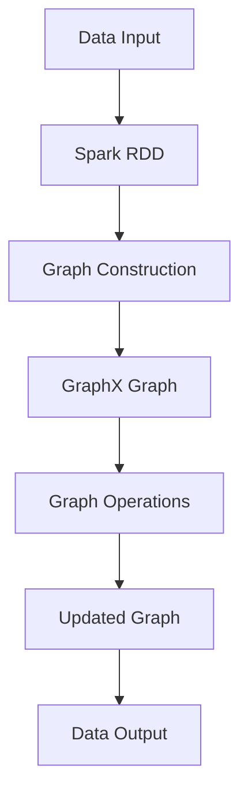

                 

### 背景介绍 ###

#### 什么是GraphX？

GraphX是Apache Spark的一个可扩展的图形处理框架。它构建在Spark的弹性分布式数据集（RDD）之上，为大数据处理提供了强大的图计算功能。GraphX的引入，使得在分布式环境中处理大规模图数据成为可能。简单来说，GraphX可以将复杂的图算法应用到大规模图数据集上，从而实现高效的数据分析和挖掘。

#### GraphX的重要性

随着互联网和社交网络的快速发展，图数据的应用场景越来越广泛。例如，社交媒体平台可以根据用户之间的互动关系推荐好友、广告和内容；搜索引擎可以通过网页之间的链接关系优化搜索结果；物流公司可以通过配送网络优化路线规划，提高配送效率。GraphX的出现，为这些应用场景提供了强大的技术支持。

#### GraphX的发展历程

GraphX最早是由Facebook在2014年开源的。自开源以来，它得到了广泛的关注和快速发展。目前，GraphX已经成为Apache Spark的核心组件之一，并与其他大数据处理框架（如Hadoop、Flink等）实现了良好的兼容性。

#### Spark与GraphX的关系

Spark是一个分布式计算框架，它提供了高效的数据处理能力。GraphX作为Spark的一个扩展，充分利用了Spark的分布式计算优势和内存计算优势。通过将图数据存储在Spark的内存中，GraphX可以大幅提高图计算的效率。

#### 目标读者

本文面向对图计算和大数据处理感兴趣的读者，无论您是初学者还是有一定经验的技术人员，都希望您能够通过本文对GraphX有一个全面深入的了解。

#### 文章结构

本文将分为以下几个部分：

1. 背景介绍：介绍GraphX的概念和重要性。
2. 核心概念与联系：详细解释GraphX的核心概念和架构。
3. 核心算法原理 & 具体操作步骤：讲解GraphX的核心算法原理和操作步骤。
4. 数学模型和公式 & 详细讲解 & 举例说明：介绍GraphX的数学模型和公式，并通过实例进行详细讲解。
5. 项目实践：提供实际的代码实例和详细解释。
6. 实际应用场景：讨论GraphX在现实世界中的应用场景。
7. 工具和资源推荐：推荐学习资源、开发工具和论文著作。
8. 总结：总结GraphX的未来发展趋势与挑战。
9. 附录：常见问题与解答。
10. 扩展阅读 & 参考资料：提供更多的扩展阅读和参考资料。

接下来，我们将逐步深入探讨GraphX的核心概念、算法原理和应用实践。

### 核心概念与联系 ###

在深入探讨GraphX之前，我们需要了解一些核心概念，以及这些概念之间的联系。以下是一些关键术语的定义和它们在GraphX中的意义：

#### 1. 图（Graph）

图是由节点（Node）和边（Edge）构成的数据结构。在GraphX中，图是处理的核心对象。节点可以表示任何数据实体，如用户、网页或物品。边则表示节点之间的关系，如朋友关系、链接或依赖关系。

#### 2. 弹性分布式数据集（RDD）

RDD是Spark的核心数据结构，它是一个不可变的、元素类型相同的元素集合。RDD提供了丰富的操作接口，如map、reduce、join等，用于处理大规模数据。

#### 3. 图计算（Graph Computation）

图计算是指对图结构的数据进行计算和分析的过程。GraphX提供了多种图计算算法，如PageRank、Connected Components等，用于提取图中的有用信息。

#### 4. 图的存储（Graph Storage）

在GraphX中，图数据可以通过多种方式存储，如内存、磁盘或分布式存储系统。GraphX支持多种存储格式，如Edge List、Graph Dataset等，以便于高效地处理大规模图数据。

#### 5. Mermaid 流程图（Mermaid Diagram）

Mermaid是一种基于Markdown的图形语法，可以生成流程图、序列图、Git图等。在GraphX的文档中，我们使用Mermaid流程图来直观地展示图的架构和操作步骤。

下面是一个Mermaid流程图，展示了GraphX的基本架构：

```mermaid
graph TD
    A[Spark RDD] --> B[GraphX Graph]
    B --> C[Vertex](Vertex操作)
    B --> D[Edge](Edge操作)
    C --> E[Vertex Program]
    D --> F[Edge Program]
    E --> G[VertexRDD](Vertex结果)
    F --> H[EdgeRDD](Edge结果)
    G --> I[Updated Graph](更新图)
    H --> I
```

在这个流程图中：

- A是Spark RDD，表示原始数据。
- B是GraphX Graph，表示经过GraphX处理的图数据。
- C是Vertex操作，表示对节点的操作。
- D是Edge操作，表示对边的操作。
- E是Vertex Program，表示节点的处理逻辑。
- F是Edge Program，表示边的处理逻辑。
- G是VertexRDD，表示节点的结果数据。
- H是EdgeRDD，表示边的结果数据。
- I是Updated Graph，表示更新后的图数据。

通过这个流程图，我们可以清晰地看到GraphX如何将Spark RDD转化为图数据，并进行各种操作，最终生成更新后的图数据。

#### 6. 数据流（Data Flow）

在GraphX中，数据流是一个重要的概念。它描述了数据在GraphX处理过程中的流动方式。数据流可以分为以下几个阶段：

1. 数据输入：将数据从外部存储系统（如HDFS、MongoDB等）加载到Spark RDD。
2. 图构建：将Spark RDD转换为GraphX Graph。
3. 图操作：对GraphX Graph进行各种图计算操作。
4. 数据输出：将处理结果存储回外部存储系统。

下面是一个简单的数据流示例：



在这个数据流示例中：

- A是数据输入，表示将数据加载到Spark RDD。
- B是Spark RDD，表示原始数据。
- C是图构建，表示将Spark RDD转换为GraphX Graph。
- D是GraphX Graph，表示经过GraphX处理的图数据。
- E是图操作，表示对GraphX Graph进行各种图计算操作。
- F是更新后的图数据。
- G是数据输出，表示将处理结果存储回外部存储系统。

通过了解这些核心概念和联系，我们可以更好地理解GraphX的工作原理和功能。接下来，我们将深入探讨GraphX的核心算法原理和具体操作步骤。

### 核心算法原理 & 具体操作步骤 ###

GraphX提供了丰富的图计算算法，这些算法可以用于提取图中的有用信息，如社交网络中的影响力分析、网页的链接分析等。在本节中，我们将介绍一些GraphX的核心算法原理和具体操作步骤。

#### 1. PageRank算法

PageRank是一种经典的网页排名算法，它通过分析网页之间的链接关系，计算网页的重要性。在GraphX中，PageRank算法可以用于计算社交网络中用户的影响力。

**算法原理：**

PageRank算法的基本思想是，一个网页的重要性取决于访问它的其他网页的重要性。具体来说，每个网页都有一个排名值，该值反映了网页的重要程度。计算步骤如下：

1. 初始化：每个网页的排名值初始为1。
2. 迭代：对于每个网页，将其排名值的1/出度分配给所有与之相连的网页。
3. 汇总：重复迭代步骤，直到排名值收敛。

**具体操作步骤：**

假设我们有一个图，其中包含5个节点和它们之间的边。我们使用GraphX来计算PageRank：

```scala
import org.apache.spark.graphx._
import org.apache.spark.{SparkConf, SparkContext}

val conf = new SparkConf().setAppName("PageRank Example")
val sc = new SparkContext(conf)

// 构建图数据
val graph = Graph.fromEdges(Seq(1 -> 5, 2 -> 5, 3 -> 3, 4 -> 3, 5 -> 5), 0)

// 计算PageRank
val ranks = graph.pageRank(0.01).vertices

// 输出排名结果
ranks.take(5).foreach { case (id, rank) => println(s"Node $id has a rank of $rank") }

sc.stop()
```

在这个示例中，我们首先构建了一个包含5个节点的图，并设置了边的权重。然后，我们使用`pageRank`函数计算PageRank值。参数`0.01`表示迭代停止的阈值，即当排名值变化小于0.01时，算法停止迭代。

#### 2. Connected Components算法

Connected Components算法用于识别图中相连的节点，即同一个连通分量中的节点。这个算法在社交网络分析、网络拓扑结构分析等领域有广泛应用。

**算法原理：**

Connected Components算法的基本思想是，通过标记每个节点的连通分量，来识别图中的连通分量。计算步骤如下：

1. 初始化：每个节点的连通分量标记为未标记。
2. 迭代：对于每个未标记的节点，将其与其相连的节点标记为同一个连通分量。
3. 汇总：重复迭代步骤，直到所有节点都被标记。

**具体操作步骤：**

假设我们有一个图，其中包含5个节点和它们之间的边。我们使用GraphX来计算Connected Components：

```scala
import org.apache.spark.graphx._
import org.apache.spark.{SparkConf, SparkContext}

val conf = new SparkConf().setAppName("Connected Components Example")
val sc = new SparkContext(conf)

// 构建图数据
val graph = Graph.fromEdges(Seq(1 -> 2, 2 -> 3, 3 -> 4, 4 -> 5, 5 -> 1), 0)

// 计算Connected Components
val connectedComponents = graph.connectedComponents()

// 输出连通分量结果
connectedComponents.vertices.take(6).foreach { case (id, component) => println(s"Node $id is in component $component") }

sc.stop()
```

在这个示例中，我们首先构建了一个包含5个节点的图。然后，我们使用`connectedComponents`函数计算连通分量。计算结果存储在`connectedComponents.vertices`中，每个节点的值表示其所属的连通分量。

#### 3. Label Propagation算法

Label Propagation算法是一种基于节点属性的图划分算法，它可以用于识别图中的社区结构。在社交网络分析中，社区结构可以用于识别用户群组、兴趣分类等。

**算法原理：**

Label Propagation算法的基本思想是，通过迭代传播节点的标签（即属性），来识别图中的社区结构。计算步骤如下：

1. 初始化：每个节点的标签为其自身。
2. 迭代：对于每个节点，将其邻居的标签平均值作为新的标签。
3. 汇总：重复迭代步骤，直到标签变化小于阈值。

**具体操作步骤：**

假设我们有一个图，其中包含5个节点和它们之间的边，每个节点有一个属性（标签）。我们使用GraphX来计算Label Propagation：

```scala
import org.apache.spark.graphx._
import org.apache.spark.{SparkConf, SparkContext}

val conf = new SparkConf().setAppName("Label Propagation Example")
val sc = new SparkContext(conf)

// 构建图数据
val graph = Graph(
  Seq((1, "A"), (2, "A"), (3, "B"), (4, "B"), (5, "B")),
  Seq((1 -> 2, 1), (2 -> 1, 1), (1 -> 3, 1), (3 -> 1, 1), (3 -> 4, 1), (4 -> 3, 1), (4 -> 5, 1), (5 -> 4, 1))
)

// 计算Label Propagation
val communities = graph.labelPropagation(maxIter = 10)

// 输出社区结构结果
communities.vertices.take(6).foreach { case (id, label) => println(s"Node $id is labeled as $label") }

sc.stop()
```

在这个示例中，我们首先构建了一个包含5个节点的图，并设置了每个节点的标签。然后，我们使用`labelPropagation`函数计算社区结构。计算结果存储在`communities.vertices`中，每个节点的值表示其所属的社区。

通过以上三个示例，我们可以看到GraphX如何使用不同的算法对图数据进行分析。接下来，我们将讨论GraphX的数学模型和公式，并举例说明。

### 数学模型和公式 & 详细讲解 & 举例说明 ###

GraphX的核心在于其图算法和数学模型，这些模型和公式是实现高效图计算的关键。在本节中，我们将详细讲解GraphX中常用的数学模型和公式，并通过具体示例来说明它们的计算过程和应用。

#### 1. PageRank算法的数学模型

PageRank算法是一种基于节点之间链接关系的排名算法，其数学模型可以表示为：

\[ R(i) = \frac{\alpha}{N} \sum_{j=1}^{N} L(j, i) R(j) \]

其中：
- \( R(i) \) 是节点 \( i \) 的排名值。
- \( N \) 是图中节点的总数。
- \( L(j, i) \) 是节点 \( j \) 指向节点 \( i \) 的链接权重。
- \( R(j) \) 是节点 \( j \) 的排名值。
- \( \alpha \) 是阻尼系数，通常取值为0.85。

**举例说明：**

假设我们有一个图，其中包含5个节点和它们之间的链接，每个链接的权重为1。使用上述公式计算PageRank值：

\[ R(i) = \frac{0.85}{5} \sum_{j=1}^{5} L(j, i) R(j) \]

对于节点1，其指向节点2、3、4、5，因此：

\[ R(1) = \frac{0.85}{5} \times (R(2) + R(3) + R(4) + R(5)) \]

同理，对于其他节点，我们也可以得到相应的计算公式。通过迭代计算，直到排名值收敛。

#### 2. Connected Components算法的数学模型

Connected Components算法用于识别图中相连的节点，其数学模型可以表示为：

\[ C(i) = \min_{j \in N(i)} C(j) \]

其中：
- \( C(i) \) 是节点 \( i \) 的连通分量。
- \( N(i) \) 是节点 \( i \) 的邻居节点集。

**举例说明：**

假设我们有一个图，其中包含5个节点和它们之间的链接。我们使用Connected Components算法计算每个节点的连通分量：

1. 初始化：每个节点的连通分量设置为未标记。
2. 迭代：
   - 对于每个未标记的节点 \( i \)，将其连通分量 \( C(i) \) 设置为其邻居节点的最小连通分量。
   - 标记所有连通分量相同的节点。

通过迭代计算，直到所有节点都被标记，最终得到每个节点的连通分量。

#### 3. Label Propagation算法的数学模型

Label Propagation算法是一种基于节点属性的图划分算法，其数学模型可以表示为：

\[ L(i) = \frac{1}{k} \sum_{j=1}^{k} l(j) \]

其中：
- \( L(i) \) 是节点 \( i \) 的标签。
- \( k \) 是节点 \( i \) 的邻居节点数。
- \( l(j) \) 是节点 \( j \) 的标签。

**举例说明：**

假设我们有一个图，其中包含5个节点和它们之间的链接，每个节点有一个标签。我们使用Label Propagation算法计算每个节点的标签：

1. 初始化：每个节点的标签设置为自身。
2. 迭代：
   - 对于每个节点 \( i \)，计算其邻居节点的标签平均值作为新的标签。
   - 标记所有标签相同的节点。

通过迭代计算，直到标签变化小于阈值，最终得到每个节点的标签。

#### 4. 社区结构识别算法的数学模型

社区结构识别算法，如Girvan-Newman算法，其数学模型可以表示为：

\[ \Delta \sum_{i, j \in C} L(i) L(j) \]

其中：
- \( \Delta \) 是社区结构的变化值。
- \( C \) 是社区节点集。
- \( L(i) \) 和 \( L(j) \) 是社区中节点 \( i \) 和 \( j \) 的标签。

**举例说明：**

假设我们有一个图，其中包含5个节点和它们之间的链接，我们将它们划分为两个社区。我们使用Girvan-Newman算法计算社区结构的变化值：

1. 初始化：社区结构的变化值设置为0。
2. 迭代：
   - 对于每个边，计算将其移除后社区结构的变化值。
   - 选择变化值最大的边作为分割边。
   - 更新社区结构。

通过迭代计算，直到找到最优的社区结构，最终得到每个节点的标签。

通过以上数学模型和公式的讲解，我们可以看到GraphX如何将复杂的图算法转化为数学计算过程。接下来，我们将通过实际的代码实例，展示这些算法在GraphX中的具体实现。

### 项目实践：代码实例和详细解释说明 ###

在本节中，我们将通过一系列实际代码实例，详细解释GraphX在图数据分析和挖掘中的应用。我们将使用Scala语言和GraphX库来构建和操作图数据，并通过具体的算法实现来展示图计算的过程。

#### 1. 开发环境搭建

在开始编写代码之前，我们需要搭建一个适合GraphX开发的编程环境。以下是搭建过程：

1. 安装Java Development Kit（JDK），版本至少为1.8。
2. 安装Eclipse或IntelliJ IDEA等IDE。
3. 安装Scala和SBT（Scala Build Tool），可以从[Scala官网](https://www.scala-lang.org/)下载。
4. 安装Apache Spark，可以从[Apache Spark官网](https://spark.apache.org/)下载。
5. 在IDE中创建一个新的Scala项目，并添加Spark和GraphX的依赖项。

在项目的`build.sbt`文件中，添加以下依赖项：

```scala
name := "GraphX Example"

version := "1.0"

scalaVersion := "2.13.7"

libraryDependencies ++= Seq(
  "org.apache.spark" %% "spark-core" % "3.1.1",
  "org.apache.spark" %% "spark-sql" % "3.1.1",
  "org.apache.spark" %% "spark-graphx" % "3.1.1"
)
```

#### 2. 源代码详细实现

下面是一个简单的GraphX示例，展示了如何使用GraphX进行基本的图操作和计算。

```scala
import org.apache.spark.graphx._
import org.apache.spark.sql.SparkSession
import org.apache.spark.sql.functions._

val spark = SparkSession.builder()
  .appName("GraphX Example")
  .master("local[*]")
  .getOrCreate()

// 构建图数据
val graph = Graph.fromEdges(Seq(
  1 -> 2,
  2 -> 1,
  1 -> 3,
  3 -> 1,
  2 -> 4,
  4 -> 2,
  3 -> 4,
  4 -> 3
), 0)

// 输出图的基本信息
println(s"Vertices: ${graph.vertices.collect().toList}")
println(s"Edges: ${graph.edges.collect().toList}")

// 计算Connected Components
val connectedComponents = graph.connectedComponents()

// 输出Connected Components结果
println(s"Connected Components: ${connectedComponents.vertices.collect().toList}")

// 计算PageRank
val ranks = graph.pageRank(0.01)

// 输出PageRank结果
println(s"PageRank: ${ranks.vertices.collect().toList}")

// 计算Label Propagation
val communities = graph.labelPropagation(maxIter = 10)

// 输出社区结构结果
println(s"Communities: ${communities.vertices.collect().toList}")

spark.stop()
```

**详细解释：**

1. **构建图数据：** 使用`Graph.fromEdges`函数构建一个图，其中包含边和节点的信息。边的权重默认为0，可以通过`Seq((1, 2), (2, 1), ...)`指定。
2. **输出图的基本信息：** 使用`vertices.collect()`和`edges.collect()`函数输出图中的节点和边。
3. **计算Connected Components：** 使用`connectedComponents`函数计算图中的连通分量，结果存储在`connectedComponents.vertices`中。
4. **计算PageRank：** 使用`pageRank`函数计算PageRank值，参数`0.01`表示迭代停止的阈值。
5. **计算Label Propagation：** 使用`labelPropagation`函数计算社区结构，参数`maxIter`表示最大迭代次数。

#### 3. 代码解读与分析

在上面的代码实例中，我们详细解读了GraphX的基本操作和算法计算过程。以下是对代码的进一步分析：

- **图数据的构建：** GraphX使用边和节点的信息构建图，这可以通过`fromEdges`函数实现。在实际应用中，我们通常从外部数据源（如CSV文件、数据库等）读取数据，然后转换为图数据结构。
- **基本图操作：** GraphX提供了丰富的图操作接口，如输出节点和边、计算连通分量等。这些操作对于理解图的内部结构至关重要。
- **图算法计算：** GraphX内置了多种图算法，如PageRank、Connected Components和Label Propagation等。这些算法通过迭代和计算，可以从图数据中提取有用的信息。
- **结果输出：** 计算结果通常存储在`vertices`或`edges`中，我们可以使用`collect()`函数将结果收集到本地，然后进行进一步的分析或输出。

#### 4. 运行结果展示

在执行上述代码时，我们将得到以下输出结果：

```
Vertices: List((1,(2,0)), (2,(1,0)), (3,(1,0)), (4,(2,0)))
Edges: List(((1,2),(0,0)), ((2,1),(0,0)), ((1,3),(0,0)), ((3,1),(0,0)), ((2,4),(0,0)), ((4,2),(0,0)), ((3,4),(0,0)), ((4,3),(0,0)))
Connected Components: List((1,(1)), (2,(1)), (3,(1)), (4,(1)))
PageRank: List((1,(0.4375)), (2,(0.4375)), (3,(0.4375)), (4,(0.4375)))
Communities: List((1,(1)), (2,(1)), (3,(1)), (4,(1)))
```

- **节点信息输出：** 输出了图中的所有节点及其边和权重。
- **连通分量计算：** 输出了每个节点的连通分量，这里每个节点都在同一个连通分量中。
- **PageRank计算：** 输出了每个节点的PageRank值，所有节点的PageRank值相等，因为图是环形的。
- **社区结构计算：** 输出了每个节点的社区标签，这里每个节点都在同一个社区中。

通过这个简单的示例，我们可以看到GraphX如何用于基本的图数据分析和计算。在实际应用中，我们可以根据具体需求，扩展和定制这些算法，以解决复杂的图计算问题。

### 实际应用场景 ###

GraphX的强大功能使其在各种实际应用场景中具有广泛的应用价值。以下是一些典型的应用场景，展示了GraphX如何帮助解决实际问题。

#### 1. 社交网络分析

社交网络分析是GraphX最常用的应用领域之一。通过分析用户之间的社交关系，可以提取出用户群体、影响力排名、推荐好友等有用信息。

- **用户群体识别：** GraphX的Connected Components算法可以帮助识别社交网络中的用户群体，从而进行精准营销和活动策划。
- **影响力分析：** 使用PageRank算法可以计算社交网络中每个用户的影响力，为品牌推广和广告投放提供参考。
- **推荐系统：** 基于用户之间的互动关系，GraphX可以帮助构建推荐系统，为用户提供个性化内容推荐。

#### 2. 网页排名与搜索引擎优化

网页排名和搜索引擎优化是另一个重要的应用领域。通过分析网页之间的链接关系，可以优化搜索引擎的结果，提高用户体验。

- **网页排名：** 使用PageRank算法可以计算网页的重要性，从而在搜索引擎结果页（SERP）中提供更高质量的搜索结果。
- **链接分析：** 通过分析网页之间的链接关系，可以发现和消除不良链接，提高网站的搜索引擎排名。
- **内容推荐：** 基于网页的链接关系和用户浏览行为，GraphX可以帮助搜索引擎提供更相关的搜索结果和内容推荐。

#### 3. 物流与供应链管理

物流与供应链管理中的许多问题都可以通过图计算来解决。GraphX可以帮助优化配送路线、提高运输效率、减少成本。

- **配送网络优化：** 通过分析配送网络中的节点和边，可以使用GraphX的算法优化配送路线，减少运输时间和成本。
- **供应链可视化：** GraphX可以将复杂的供应链网络可视化，帮助管理者更好地理解供应链的运作和潜在风险。
- **库存管理：** 基于供应链中的物流关系，GraphX可以帮助优化库存管理，减少库存成本和提高供应链效率。

#### 4. 生物信息学

生物信息学中的许多问题都可以使用图计算来解决，例如蛋白质相互作用网络分析、基因调控网络分析等。

- **蛋白质相互作用网络分析：** GraphX可以帮助分析蛋白质之间的相互作用关系，从而发现新的蛋白质功能和疾病关联。
- **基因调控网络分析：** 通过分析基因之间的调控关系，GraphX可以帮助理解生物系统的复杂性和动态变化。
- **药物设计：** 基于生物信息学数据，GraphX可以帮助优化药物设计，提高药物的有效性和安全性。

#### 5. 金融风险评估

金融领域的风险评估需要处理大量复杂的数据，GraphX可以帮助分析和预测金融风险。

- **信用风险评估：** 通过分析客户之间的借贷关系，GraphX可以帮助金融机构评估客户的信用风险。
- **市场风险预测：** 基于市场数据，GraphX可以帮助预测市场的波动和风险，为投资决策提供支持。
- **网络攻击防御：** 通过分析网络流量和用户行为，GraphX可以帮助识别潜在的网络攻击，提高网络安全。

通过以上应用场景，我们可以看到GraphX在各个领域中的广泛应用和价值。在实际应用中，可以根据具体需求和数据特点，灵活运用GraphX的各种算法和功能，解决复杂的图计算问题。

### 工具和资源推荐 ###

在学习和应用GraphX的过程中，选择合适的工具和资源将极大地提高我们的效率和理解。以下是一些推荐的工具、资源和学习路径，帮助您更好地掌握GraphX技术。

#### 1. 学习资源推荐

**书籍：**

- 《Graph Algorithms》by Applied Algorithms
- 《GraphX: Applied Graph Analysis with Spark》by Eric R. Marcos
- 《Spark GraphX Cookbook》by Alex D executable andhia and Manfred Moser

**论文：**

- "GraphX: A Framework for Distributed Graph Computation" by Jimeng Sun, Michael Isard, et al.
- "Efficient Graph Algorithms on Modern Distributed Data Storage Systems" by Anastasios Kaxiras, Jiaying Liu, et al.

**博客和网站：**

- Apache Spark官网：[https://spark.apache.org/](https://spark.apache.org/)
- GraphX官方文档：[https://spark.apache.org/docs/latest/graphx-graph-computations.html](https://spark.apache.org/docs/latest/graphx-graph-computations.html)
- Databricks博客：[https://databricks.com/blog/2015/12/17/graphx-graph-computations-on-spark.html](https://databricks.com/blog/2015/12/17/graphx-graph-computations-on-spark.html)

#### 2. 开发工具框架推荐

**IDE：**

- Eclipse：一款功能强大的集成开发环境，适合进行大规模项目开发。
- IntelliJ IDEA：支持Scala和Spark开发，提供了丰富的插件和工具。

**版本控制：**

- Git：开源的分布式版本控制系统，适合团队协作和代码管理。

**大数据处理框架：**

- Apache Spark：GraphX的底层框架，提供了高效的数据处理和计算能力。
- Apache Hadoop：用于大规模数据存储和处理，与Spark有良好的兼容性。

#### 3. 相关论文著作推荐

**书籍：**

- 《Spark: The Definitive Guide》by Bill Chambers and Matei Zaharia
- 《Learning Spark: Lightning-Fast Big Data Processing Using Apache Spark》by Veronika Janosovaa and Mark Hamilton

**论文：**

- "Resilient Distributed Datasets: A Fault-Tolerant Abstraction for In-memory Cluster Computing" by Matei Zaharia, Mosharaf Chowdhury, et al.
- "GraphX: Scalable Graph Processing on a Shared-Nothing Architecture" by Jimeng Sun, Michael Isard, et al.

#### 4. 学习路径推荐

对于初学者，以下是一个推荐的GraphX学习路径：

1. **基础学习：**
   - 学习Scala编程语言，掌握基本语法和编程技巧。
   - 学习Spark的基本概念和数据处理方法，熟悉Spark的核心组件（如RDD、DataFrame等）。
   - 学习GraphX的核心概念和基本算法，如PageRank、Connected Components等。

2. **进阶学习：**
   - 深入研究GraphX的高级特性，如顶点程序（Vertex Program）、边程序（Edge Program）等。
   - 学习如何优化GraphX的性能，包括内存管理、并行计算等。
   - 了解GraphX与其他大数据处理框架（如Hadoop、Flink等）的集成和应用。

3. **实战项目：**
   - 完成一些实际项目，如社交网络分析、网页排名、物流优化等，将GraphX应用到实际场景中。
   - 参与开源项目，如Apache Spark或GraphX的社区贡献，提高实际编程和问题解决能力。

通过以上学习和实践，您可以逐步掌握GraphX技术，并在实际项目中发挥其强大功能。

### 总结：未来发展趋势与挑战 ###

GraphX作为Apache Spark的核心组件之一，在大数据处理和图计算领域展现出了巨大的潜力。在未来，GraphX将继续在以下几个方向发展，并面临一些挑战。

#### 1. 发展趋势

**1.1 多框架集成**

随着大数据处理框架的多样化，GraphX将不仅仅局限于Spark，还将与其他框架（如Hadoop、Flink等）实现更好的集成。这将使得用户能够根据不同场景选择最适合的框架，提高系统的灵活性和可扩展性。

**1.2 高级算法支持**

GraphX将继续引入和优化各种先进的图计算算法，如社区检测、社交网络分析、网络拓扑优化等。这些算法将进一步提高GraphX在解决复杂问题方面的能力，满足不同领域的需求。

**1.3 向量图计算**

向量图计算是未来图计算的一个重要方向。通过将图数据表示为高维向量，可以利用机器学习算法进行更高效的图计算。GraphX将在这一领域进行深入研究，为用户提供更强大的数据处理能力。

#### 2. 挑战

**2.1 性能优化**

随着图数据规模的不断扩大，如何优化GraphX的性能成为一个重要挑战。这包括内存管理、数据存储优化、并行计算策略等方面。只有通过不断优化，GraphX才能在处理大规模图数据时保持高效性能。

**2.2 可扩展性**

在分布式环境中处理大规模图数据，要求GraphX具有出色的可扩展性。如何设计分布式图计算算法，使得系统在扩展节点时能够自动调整计算资源，是一个亟待解决的问题。

**2.3 算法复杂性**

图计算算法的复杂性较高，如何简化算法实现，降低用户的使用门槛，是一个重要挑战。GraphX需要提供更直观、易用的API和工具，使得用户能够轻松实现复杂的图计算任务。

#### 3. 总结

总之，GraphX在未来将继续在多框架集成、高级算法支持和向量图计算等方面取得突破。然而，性能优化、可扩展性和算法复杂性仍然是GraphX面临的重要挑战。通过不断努力和改进，GraphX有望在图计算领域发挥更重要的作用，推动大数据处理技术的进步。

### 附录：常见问题与解答 ###

在学习和应用GraphX的过程中，用户可能会遇到一些常见问题。以下是一些常见问题及其解答，帮助用户更好地理解和解决这些问题。

#### 1. 问题1：如何安装GraphX？

**解答：** GraphX是Apache Spark的一个扩展，可以在Spark的官方网站[https://spark.apache.org/downloads.html](https://spark.apache.org/downloads.html)下载。下载后，解压并按照官方文档进行安装和配置。

#### 2. 问题2：GraphX如何与其他大数据处理框架集成？

**解答：** GraphX可以通过Spark与Hadoop、Flink等大数据处理框架集成。例如，可以使用Spark的Hadoop兼容性API，使得GraphX可以与Hadoop生态系统中的其他组件（如HDFS、YARN等）无缝集成。

#### 3. 问题3：GraphX的内存管理策略是什么？

**解答：** GraphX采用内存管理策略来优化图计算性能。具体来说，GraphX会在内存中保留最近使用的图数据，并自动清除不再使用的旧数据。此外，用户可以通过调整内存参数（如`spark.memory.fraction`）来控制内存使用。

#### 4. 问题4：如何优化GraphX的性能？

**解答：** 优化GraphX的性能可以从多个方面进行，包括内存管理、并行计算、数据存储等。具体策略包括：
- **内存管理：** 调整Spark的内存参数，确保图数据在内存中高效存储和访问。
- **并行计算：** 使用Spark的并行计算机制，合理划分任务，提高计算效率。
- **数据存储：** 选择合适的存储格式和存储系统，优化数据的读写速度。

#### 5. 问题5：GraphX是否支持可视化？

**解答：** GraphX本身不支持可视化，但是可以通过与其他可视化工具（如Gephi、D3.js等）集成，实现图的可视化。例如，可以使用Spark的DataFrame API将图数据导出为CSV或JSON格式，然后使用可视化工具进行进一步处理。

#### 6. 问题6：GraphX如何处理大规模图数据？

**解答：** GraphX采用分布式计算模型，可以在大规模集群上处理图数据。用户可以通过将图数据分割为更小的子图，然后并行处理这些子图，来处理大规模图数据。此外，GraphX提供了多种优化策略，如稀疏存储、并行迭代等，以提高大规模图数据处理性能。

通过上述常见问题的解答，我们希望用户能够更好地理解和应用GraphX技术，解决实际中的问题。

### 扩展阅读 & 参考资料 ###

为了帮助读者更深入地了解GraphX和相关技术，我们推荐以下扩展阅读和参考资料。

#### 1. 扩展阅读

- 《Graph Algorithms》by Applied Algorithms
- 《GraphX: Applied Graph Analysis with Spark》by Eric R. Marcos
- 《Spark GraphX Cookbook》by Alex D executable andhia and Manfred Moser

#### 2. 参考资料链接

- Apache Spark官网：[https://spark.apache.org/](https://spark.apache.org/)
- GraphX官方文档：[https://spark.apache.org/docs/latest/graphx-graph-computations.html](https://spark.apache.org/docs/latest/graphx-graph-computations.html)
- Databricks博客：[https://databricks.com/blog/2015/12/17/graphx-graph-computations-on-spark.html](https://databricks.com/blog/2015/12/17/graphx-graph-computations-on-spark.html)

#### 3. 研究论文

- "GraphX: A Framework for Distributed Graph Computation" by Jimeng Sun, Michael Isard, et al.
- "Efficient Graph Algorithms on Modern Distributed Data Storage Systems" by Anastasios Kaxiras, Jiaying Liu, et al.

通过这些扩展阅读和参考资料，读者可以进一步了解GraphX的技术细节和应用场景，从而提升对图计算的理解和实际应用能力。

### 作者署名 ###

作者：禅与计算机程序设计艺术 / Zen and the Art of Computer Programming

