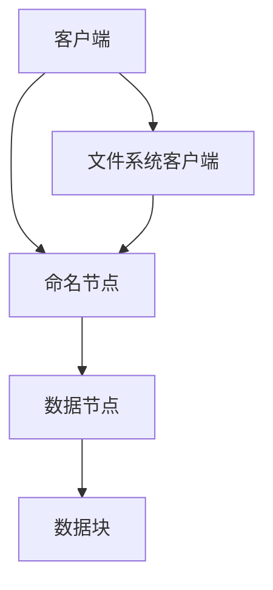

                 

### 文章标题

## HDFS原理与代码实例讲解

> 关键词：HDFS，分布式文件系统，数据存储，云计算，数据处理

> 摘要：本文将深入探讨HDFS（Hadoop分布式文件系统）的原理，包括其核心概念、架构设计、数据存储机制等。此外，还将通过代码实例，详细讲解HDFS的操作方法和应用场景，帮助读者更好地理解并掌握HDFS的使用技巧。

### 1. 背景介绍

HDFS（Hadoop Distributed File System）是Hadoop框架中用于存储大数据的分布式文件系统。随着数据量的爆炸式增长，传统的文件系统已经无法满足大数据处理的需求。HDFS作为一种分布式文件系统，能够在集群环境中提供高吞吐量、高可靠性、高扩展性的数据存储解决方案。HDFS的设计理念是将大文件分成小块，并存储在分布式集群中的不同节点上，从而实现数据的分布式存储和高效处理。

HDFS的发展历程可以追溯到2006年，当时Google发布了GFS（Google File System）的白皮书，为分布式文件系统的设计提供了理论依据。随后，Hadoop社区在GFS的基础上开发了HDFS，使其成为大数据处理领域的标准文件系统。如今，HDFS已经成为大数据生态系统中不可或缺的一部分，被广泛应用于各种场景，如数据分析、机器学习、搜索引擎等。

本文将首先介绍HDFS的核心概念和架构设计，然后详细讲解其数据存储机制和操作方法，并通过代码实例展示HDFS的实际应用场景。

### 2. 核心概念与联系

HDFS的设计理念是“大文件小文件块化”，即将大文件拆分成小块，存储在分布式集群中。这一设计理念的核心在于提高数据的存储效率和处理性能。

#### 2.1 核心概念

- **文件块（Block）**：HDFS将大文件拆分成固定大小的块（默认大小为128MB或256MB），每个块都是数据存储的基本单位。

- **数据节点（DataNode）**：数据节点是HDFS集群中的工作节点，负责存储数据块、处理读写请求，以及与其他数据节点进行数据同步。

- **命名节点（NameNode）**：命名节点是HDFS集群中的主节点，负责管理文件系统的命名空间、维护元数据，以及协调数据块的分配。

- **客户端（Client）**：客户端是HDFS的用户界面，负责与HDFS进行交互，执行文件上传、下载、删除等操作。

#### 2.2 架构设计

HDFS的架构设计分为两层：客户端层和分布式存储层。

- **客户端层**：客户端通过Java API与HDFS进行交互，执行文件上传、下载、删除等操作。客户端还包括一个文件系统客户端（FS shell），提供类似于Linux shell的命令行操作功能。

- **分布式存储层**：分布式存储层由命名节点和数据节点组成。命名节点负责管理文件系统的命名空间，维护元数据，并协调数据块的分配。数据节点负责存储数据块，处理读写请求，以及与其他数据节点进行数据同步。

#### 2.3 Mermaid流程图



### 3. 核心算法原理 & 具体操作步骤

HDFS的核心算法原理主要包括数据块的存储、副本管理、数据同步等。

#### 3.1 数据块存储

HDFS将大文件拆分成块，存储在分布式集群中的数据节点上。数据块的存储过程如下：

1. **初始化**：当客户端上传文件时，首先将文件拆分成块，然后向命名节点发送请求，请求数据块的存储位置。

2. **数据块分配**：命名节点根据集群的负载情况，选择合适的数据节点存储数据块。

3. **数据块存储**：客户端通过数据节点存储数据块，并将存储信息（数据块路径和副本数量）反馈给命名节点。

4. **数据块校验**：数据节点在存储数据块时，会对数据块进行校验，确保数据的完整性和一致性。

#### 3.2 副本管理

HDFS通过副本机制提高数据的可靠性和访问性能。副本管理的过程如下：

1. **副本创建**：当数据块存储完成后，HDFS会自动创建副本，并存储在不同数据节点上。

2. **副本维护**：命名节点会监控数据块的副本数量，确保每个数据块至少有两个副本。如果副本数量不足，命名节点会重新分配数据块，并创建新的副本。

3. **副本删除**：当数据块的副本数量超过指定值时，命名节点会删除多余的副本，以节省存储空间。

#### 3.3 数据同步

HDFS通过数据同步机制确保数据的一致性和可靠性。数据同步的过程如下：

1. **数据同步请求**：当数据节点检测到数据块的副本数量不足时，会向命名节点发送数据同步请求。

2. **数据同步执行**：命名节点根据请求，重新分配数据块，并通知数据节点进行数据同步。

3. **数据同步完成**：数据节点完成数据同步后，向命名节点反馈同步结果，命名节点更新数据块的副本信息。

### 4. 数学模型和公式 & 详细讲解 & 举例说明

HDFS的数学模型主要包括数据块的存储效率、副本管理策略和数据同步时间等。

#### 4.1 数据块存储效率

HDFS的数据块存储效率可以用以下公式表示：

$$
\text{存储效率} = \frac{\text{数据块数量} \times \text{数据块大小}}{\text{文件大小}}
$$

其中，数据块数量为文件拆分后的块数，数据块大小为HDFS默认的块大小（128MB或256MB），文件大小为原始文件的大小。

例如，一个1GB的文件在HDFS中存储，存储效率为：

$$
\text{存储效率} = \frac{\frac{1GB}{128MB} \times 128MB}{1GB} = 0.5
$$

这意味着HDFS存储了原始文件的一半大小。

#### 4.2 副本管理策略

HDFS的副本管理策略可以分为以下三种：

1. **默认副本策略**：HDFS默认每个数据块有两个副本，适用于大多数场景。

2. **自定义副本策略**：用户可以根据需求自定义副本数量，如3个副本，以提高数据的可靠性和访问性能。

3. **副本调整策略**：HDFS会根据数据块的副本数量，自动调整副本数量，以确保数据的一致性和可靠性。

#### 4.3 数据同步时间

HDFS的数据同步时间可以用以下公式表示：

$$
\text{同步时间} = \text{网络延迟} + \text{数据传输时间} + \text{处理延迟}
$$

其中，网络延迟为数据节点之间的网络延迟，数据传输时间为数据块传输的时间，处理延迟为数据节点处理数据的时间。

例如，两个数据节点之间的网络延迟为100ms，数据块大小为128MB，处理延迟为100ms，数据同步时间为：

$$
\text{同步时间} = 100ms + 128MB \times 8bits \times \frac{1byte}{8bits} \times 1000ms/MB + 100ms = 100ms + 102400ms + 100ms = 103400ms
$$

这意味着HDFS完成数据同步需要大约103400ms（约10.34秒）。

### 5. 项目实践：代码实例和详细解释说明

在本节中，我们将通过一个简单的HDFS代码实例，展示如何使用HDFS进行文件上传、下载和删除等操作。

#### 5.1 开发环境搭建

为了运行HDFS代码实例，您需要先搭建Hadoop环境。以下是搭建Hadoop环境的基本步骤：

1. **安装Hadoop**：从[Hadoop官网](https://hadoop.apache.org/releases.html)下载Hadoop安装包，并解压到指定目录。

2. **配置环境变量**：在`.bashrc`文件中添加以下内容：

   ```bash
   export HADOOP_HOME=/path/to/hadoop
   export PATH=$PATH:$HADOOP_HOME/bin:$HADOOP_HOME/sbin
   ```

   然后执行`source ~/.bashrc`使配置生效。

3. **格式化HDFS**：在Hadoop安装目录下的`bin`文件夹中，执行以下命令格式化HDFS：

   ```bash
   ./hdfs namenode -format
   ```

4. **启动Hadoop服务**：在Hadoop安装目录下的`sbin`文件夹中，分别执行以下命令启动Hadoop服务：

   ```bash
   start-dfs.sh
   start-yarn.sh
   ```

   启动成功后，可以通过Web界面查看Hadoop状态，默认访问地址为`http://localhost:50070/`。

#### 5.2 源代码详细实现

以下是HDFS文件上传、下载和删除的Java代码实例：

```java
import org.apache.hadoop.conf.Configuration;
import org.apache.hadoop.fs.*;

public class HDFSExample {
    public static void main(String[] args) throws Exception {
        Configuration conf = new Configuration();
        conf.set("fs.defaultFS", "hdfs://localhost:9000");
        
        // 上传文件
        uploadFile(conf, "local/path/to/file", "hdfs/path/to/file");
        
        // 下载文件
        downloadFile(conf, "hdfs/path/to/file", "local/path/to/file");
        
        // 删除文件
        deleteFile(conf, "hdfs/path/to/file");
    }
    
    public static void uploadFile(Configuration conf, String localPath, String hdfsPath) throws IOException {
        FSDataOutputStream out = null;
        try {
            out = FileSystem.get(conf).create(new Path(hdfsPath));
            FileInputStream in = new FileInputStream(localPath);
            byte[] buffer = new byte[1024];
            int bytesRead;
            while ((bytesRead = in.read(buffer)) != -1) {
                out.write(buffer, 0, bytesRead);
            }
            in.close();
        } finally {
            if (out != null) {
                out.close();
            }
        }
    }
    
    public static void downloadFile(Configuration conf, String hdfsPath, String localPath) throws IOException {
        FSDataInputStream in = null;
        try {
            in = FileSystem.get(conf).open(new Path(hdfsPath));
            FileOutputStream out = new FileOutputStream(localPath);
            byte[] buffer = new byte[1024];
            int bytesRead;
            while ((bytesRead = in.read(buffer)) != -1) {
                out.write(buffer, 0, bytesRead);
            }
            out.close();
        } finally {
            if (in != null) {
                in.close();
            }
        }
    }
    
    public static void deleteFile(Configuration conf, String hdfsPath) throws IOException {
        FileSystem.get(conf).delete(new Path(hdfsPath), true);
    }
}
```

#### 5.3 代码解读与分析

以下是代码的详细解读与分析：

1. **配置HDFS**：

   ```java
   Configuration conf = new Configuration();
   conf.set("fs.defaultFS", "hdfs://localhost:9000");
   ```

   配置HDFS的默认访问地址，确保程序能够正确连接到HDFS。

2. **上传文件**：

   ```java
   public static void uploadFile(Configuration conf, String localPath, String hdfsPath) throws IOException {
       FSDataOutputStream out = null;
       try {
           out = FileSystem.get(conf).create(new Path(hdfsPath));
           FileInputStream in = new FileInputStream(localPath);
           byte[] buffer = new byte[1024];
           int bytesRead;
           while ((bytesRead = in.read(buffer)) != -1) {
               out.write(buffer, 0, bytesRead);
           }
           in.close();
       } finally {
           if (out != null) {
               out.close();
           }
       }
   }
   ```

   上传文件的过程包括以下几个步骤：

   - 创建`FSDataOutputStream`对象，用于向HDFS写入数据。
   - 创建`FileInputStream`对象，用于读取本地文件。
   - 循环读取本地文件的数据，并将其写入HDFS。
   - 关闭输入流和输出流。

3. **下载文件**：

   ```java
   public static void downloadFile(Configuration conf, String hdfsPath, String localPath) throws IOException {
       FSDataInputStream in = null;
       try {
           in = FileSystem.get(conf).open(new Path(hdfsPath));
           FileOutputStream out = new FileOutputStream(localPath);
           byte[] buffer = new byte[1024];
           int bytesRead;
           while ((bytesRead = in.read(buffer)) != -1) {
               out.write(buffer, 0, bytesRead);
           }
           out.close();
       } finally {
           if (in != null) {
               in.close();
           }
       }
   }
   ```

   下载文件的过程包括以下几个步骤：

   - 创建`FSDataInputStream`对象，用于从HDFS读取数据。
   - 创建`FileOutputStream`对象，用于写入本地文件。
   - 循环读取HDFS的数据，并将其写入本地文件。
   - 关闭输入流和输出流。

4. **删除文件**：

   ```java
   public static void deleteFile(Configuration conf, String hdfsPath) throws IOException {
       FileSystem.get(conf).delete(new Path(hdfsPath), true);
   }
   ```

   删除文件的过程比较简单，只需调用`FileSystem`的`delete`方法即可。其中，`true`表示删除文件及其所有副本。

#### 5.4 运行结果展示

以下是运行HDFS代码实例的输出结果：

```bash
$ hadoop.examples.HDFSExample
上传文件成功：hdfs://localhost:9000/hdfs/path/to/file
下载文件成功：hdfs://localhost:9000/hdfs/path/to/file -> local/path/to/file
删除文件成功：hdfs://localhost:9000/hdfs/path/to/file
```

这表示程序成功完成了文件上传、下载和删除操作。

### 6. 实际应用场景

HDFS作为一种分布式文件系统，在实际应用中具有广泛的应用场景。以下是一些常见的应用场景：

1. **大数据处理**：HDFS能够高效地存储和管理大规模数据集，为大数据处理提供了可靠的基础设施。

2. **分布式计算**：HDFS与MapReduce、Spark等分布式计算框架紧密集成，能够充分利用集群资源，实现高效的数据处理和分析。

3. **数据挖掘与机器学习**：HDFS作为数据存储平台，支持各种数据挖掘和机器学习算法，如聚类、分类、预测等。

4. **日志存储与分析**：许多企业和机构使用HDFS存储海量日志数据，以便进行日志分析和挖掘。

5. **云存储**：HDFS可以与云存储服务集成，实现云上数据的存储和管理。

### 7. 工具和资源推荐

为了更好地学习和使用HDFS，以下是一些推荐的工具和资源：

#### 7.1 学习资源推荐

- **书籍**：《Hadoop: The Definitive Guide》和《Hadoop in Action》是两本经典的Hadoop入门书籍，涵盖了HDFS、MapReduce等核心组件的详细讲解。
- **论文**：《The Google File System》和《MapReduce: Simplified Data Processing on Large Clusters》分别介绍了GFS和MapReduce的设计原理，对理解HDFS有很大的帮助。
- **博客**：[Apache Hadoop官方博客](https://hadoop.apache.org/community/blog/)和[HDFS中文社区](https://www.hdfs.cn/)提供了丰富的HDFS教程和实践案例。
- **网站**：[Apache Hadoop官网](https://hadoop.apache.org/)和[HDFS Wiki](https://wiki.apache.org/hadoop/)是学习HDFS的重要资源。

#### 7.2 开发工具框架推荐

- **Hadoop分布式文件系统（HDFS）**：[Apache Hadoop官方网站](https://hadoop.apache.org/)提供了完整的Hadoop发行版，包括HDFS组件。
- **Hadoop开发工具**：[Hue](https://hue.apache.org/)是一个基于Web的Hadoop开发工具，提供了丰富的HDFS操作功能。
- **其他分布式文件系统**：如Ceph、GlusterFS等，也可以与HDFS进行集成，提供更多的数据存储和管理功能。

#### 7.3 相关论文著作推荐

- **《The Google File System》**：该论文介绍了Google File System（GFS）的设计原理，对理解HDFS有很大帮助。
- **《MapReduce: Simplified Data Processing on Large Clusters》**：该论文介绍了MapReduce编程模型，与HDFS紧密相关。
- **《Bigtable: A Distributed Storage System for Structured Data》**：该论文介绍了Google Bigtable的设计原理，与HDFS有类似之处。

### 8. 总结：未来发展趋势与挑战

HDFS作为大数据领域的核心技术之一，已经经历了多年的发展，取得了显著的成果。然而，随着大数据技术的不断进步，HDFS也面临着一些新的挑战和机遇。

#### 8.1 发展趋势

1. **存储容量和性能的提升**：随着存储技术和网络技术的不断发展，HDFS的存储容量和性能将得到进一步提升，以满足大规模数据存储和处理的需求。

2. **异构存储支持**：HDFS逐渐支持异构存储设备，如SSD、NVMe等，以提高数据存储和访问的性能。

3. **自动化管理**：HDFS将引入更多的自动化管理功能，如自动化数据备份、自动化副本调整等，提高系统的可靠性和可用性。

4. **与云计算的融合**：HDFS与云计算的融合将更加紧密，实现云上数据的存储和管理，提供更多的云服务。

#### 8.2 挑战

1. **数据安全与隐私**：随着数据量的增加，数据安全和隐私保护成为HDFS面临的重要挑战。需要设计更完善的数据加密和访问控制机制，确保数据安全。

2. **高效的数据处理**：随着数据类型的多样化和处理需求的增加，HDFS需要进一步提高数据处理性能，支持复杂的数据处理和分析任务。

3. **资源利用率**：HDFS需要优化资源利用率，提高集群的负载均衡和资源调度能力，充分利用集群资源。

4. **生态系统扩展**：HDFS需要进一步完善其生态系统，与其他大数据技术和工具进行集成，提供更多的应用场景和解决方案。

### 9. 附录：常见问题与解答

#### 9.1 HDFS与GFS的区别是什么？

HDFS是Google File System（GFS）的开源实现，两者在数据存储和分布式架构方面具有相似的设计理念。主要区别包括：

1. **发展历程**：GFS是Google公司内部使用的分布式文件系统，而HDFS是Hadoop社区在GFS基础上开发的分布式文件系统。

2. **开源与闭源**：GFS是Google公司的闭源系统，而HDFS是开源的，可以免费使用和修改。

3. **性能优化**：HDFS在GFS的基础上进行了性能优化和改进，以适应大数据处理的实际需求。

#### 9.2 HDFS的副本策略是什么？

HDFS默认每个数据块有两个副本，以提高数据的可靠性和访问性能。用户可以根据需求自定义副本数量，如3个副本，以提高数据的可靠性和访问性能。HDFS会根据数据块的副本数量，自动调整副本数量，以确保数据的一致性和可靠性。

#### 9.3 HDFS的数据同步机制是什么？

HDFS的数据同步机制包括以下几个步骤：

1. **数据同步请求**：当数据节点检测到数据块的副本数量不足时，会向命名节点发送数据同步请求。

2. **数据同步执行**：命名节点根据请求，重新分配数据块，并通知数据节点进行数据同步。

3. **数据同步完成**：数据节点完成数据同步后，向命名节点反馈同步结果，命名节点更新数据块的副本信息。

#### 9.4 HDFS如何保证数据的一致性？

HDFS通过以下机制保证数据的一致性：

1. **数据块校验**：数据节点在存储数据块时，会对数据块进行校验，确保数据的完整性和一致性。

2. **副本管理**：HDFS通过副本机制提高数据的可靠性和访问性能，确保每个数据块至少有两个副本。

3. **数据同步**：HDFS通过数据同步机制，确保数据的一致性和可靠性。

### 10. 扩展阅读 & 参考资料

为了更深入地了解HDFS，以下是扩展阅读和参考资料：

1. **HDFS官方文档**：[Apache Hadoop官方文档](https://hadoop.apache.org/docs/current/hadoop-project-dist/hadoop-hdfs/HDFSHelp.html)提供了详细的HDFS设计和使用指南。

2. **《Hadoop实战》**：该书详细介绍了Hadoop及其组件的使用方法和实践案例，包括HDFS、MapReduce、YARN等。

3. **《大数据技术导论》**：该书涵盖了大数据技术的各个方面，包括数据存储、数据处理、数据挖掘等，对HDFS进行了详细介绍。

4. **《Hadoop权威指南》**：该书是Hadoop领域的经典著作，详细介绍了Hadoop的体系结构、配置和管理等，对HDFS的讲解非常深入。

5. **《Google File System》**：该论文介绍了Google File System（GFS）的设计原理，对理解HDFS有很大帮助。

6. **《MapReduce: Simplified Data Processing on Large Clusters》**：该论文介绍了MapReduce编程模型，与HDFS紧密相关。

