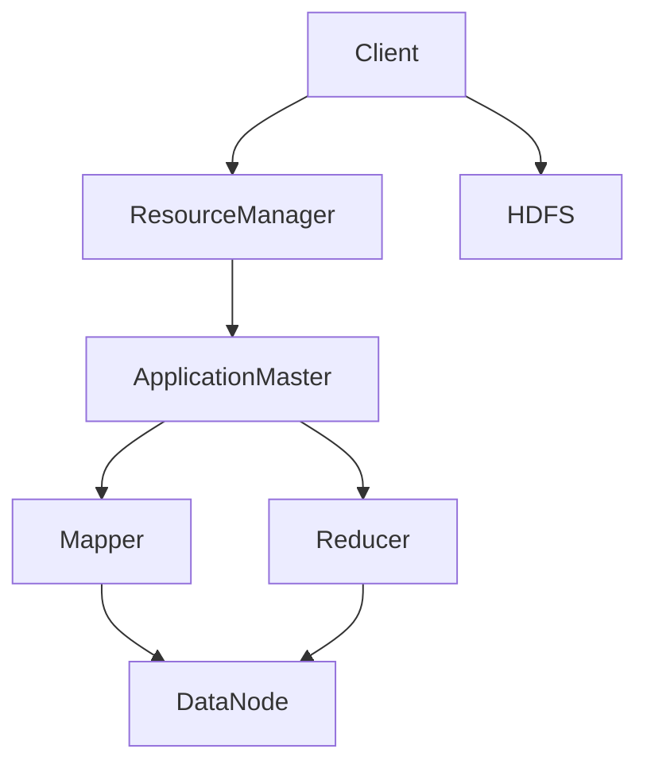

                 

### 1. 背景介绍

#### Hadoop 的起源

Hadoop 是一个开源的分布式计算框架，由谷歌（Google）在2006年提出的MapReduce算法所启发，其目的是为了解决大规模数据集的存储和计算问题。Hadoop 项目在2008年由Apache软件基金会接管，并迅速成为大数据处理领域的事实标准。

Hadoop 的起源可以追溯到2002年，谷歌发表了三篇革命性的论文，分别是《The Google File System》（GFS）、《MapReduce: Simplified Data Processing on Large Clusters》和《Bigtable: A Distributed Storage System for Structured Data》。这三篇论文奠定了分布式存储和计算的基础，并直接催生了Hadoop的诞生。

#### 大数据时代的来临

随着互联网的飞速发展，数据的规模呈现爆炸性增长。传统的数据处理方式已经无法满足日益增长的数据处理需求。大数据时代应运而生，如何高效地处理海量数据成为业界关注的焦点。

大数据的四大特征（简称“4V”）是：

- **Volume（大量）**：数据量巨大，从PB级到EB级。
- **Velocity（高速）**：数据生成和处理的速率极高。
- **Variety（多样）**：数据的类型和格式多种多样，包括结构化数据、半结构化数据和非结构化数据。
- **Veracity（真实性）**：数据的真实性和准确性是一个关键问题。

#### Hadoop 的核心组件

Hadoop 框架主要包括以下几个核心组件：

- **Hadoop分布式文件系统（HDFS）**：一个高吞吐量的分布式文件存储系统，用于存储大规模数据。
- **Hadoop YARN**：资源调度框架，用于管理集群中的资源分配和任务调度。
- **Hadoop MapReduce**：一个分布式数据处理框架，用于大规模数据集的并行处理。
- **Hadoop HBase**：一个分布式、可扩展的列存储数据库，适用于实时随机访问。
- **Hadoop Hive**：一个数据仓库基础设施，用于数据汇总、查询和分析。
- **Hadoop Pig**：一个高层次的编程脚本语言，用于简化数据转换和分析过程。

这些组件共同构成了Hadoop生态系统，为大数据处理提供了全面的支持。

#### Hadoop 的应用领域

Hadoop在大数据处理的多个领域有着广泛的应用，包括：

- **搜索引擎**：如谷歌、百度等搜索引擎使用Hadoop进行大规模网页数据的索引和检索。
- **社交媒体**：如Facebook、Twitter等社交媒体平台使用Hadoop进行日志分析、用户行为分析和推荐系统。
- **电子商务**：如阿里巴巴、亚马逊等电子商务公司使用Hadoop进行用户数据分析、商品推荐和库存管理。
- **金融行业**：如银行、证券公司等金融机构使用Hadoop进行风险管理、信用评分和预测分析。
- **科学计算**：如天文学、生物学、物理学等领域使用Hadoop进行大规模科学计算和数据存储。

Hadoop的分布式架构和高效处理能力，使其成为大数据处理不可或缺的工具。

### 2. 核心概念与联系

#### 分布式计算

分布式计算是指通过计算机网络将多个计算任务分配到多个计算节点上，从而实现并行计算。这种计算方式能够充分利用网络中的计算资源，提高处理效率和性能。

分布式计算的核心概念包括：

- **节点**：网络中的计算单元，可以是服务器、工作站等。
- **集群**：由多个节点组成的计算集合，共同完成计算任务。
- **任务分配**：将计算任务分配到不同的节点上，实现并行计算。
- **通信协议**：节点之间的通信机制，如TCP/IP、HTTP等。

#### HDFS

Hadoop分布式文件系统（HDFS）是一个高吞吐量的分布式文件存储系统，用于存储大规模数据。它设计用于运行在通用硬件上，提供高吞吐量的数据访问，适合于大规模数据集的应用程序。

HDFS的核心概念包括：

- **名称节点（NameNode）**：负责管理文件系统的命名空间，维护文件系统的元数据，如文件目录、文件块映射等。
- **数据节点（DataNode）**：负责存储实际的数据块，并向上层提供读写操作。
- **数据块（Data Block）**：HDFS中的数据被分割成固定大小的数据块，默认大小为128MB或256MB。
- **复制策略**：为了保证数据的高可用性和容错性，HDFS采用数据复制策略，将数据块复制到多个数据节点上。

#### YARN

Hadoop YARN（Yet Another Resource Negotiator）是一个资源调度框架，用于管理集群中的资源分配和任务调度。它是一个通用的资源管理平台，可以用于运行各种类型的分布式应用程序，如MapReduce、Spark等。

YARN的核心概念包括：

- **资源管理器（ ResourceManager）**：负责管理整个集群的资源分配和调度，将资源分配给各个应用程序。
- **应用程序管理器（ApplicationMaster）**：每个应用程序都有一个应用程序管理器，负责协调应用程序内部的任务分配和资源请求。
- **容器（Container）**：资源管理器为应用程序分配的最小资源单位，包括计算资源（CPU、内存）和存储资源。

#### MapReduce

Hadoop MapReduce 是一个分布式数据处理框架，用于大规模数据集的并行处理。它将数据处理任务划分为两个阶段：Map阶段和Reduce阶段。

MapReduce的核心概念包括：

- **Map阶段**：将输入数据分割成键值对，通过映射函数（Mapper）将每个键值对转换成中间键值对。
- **Shuffle阶段**：根据中间键值对的键进行分组，将具有相同键的中间键值对发送到同一个Reduce节点。
- **Reduce阶段**：将中间键值对进行聚合，通过聚合函数（Reducer）输出最终的键值对结果。

#### Hadoop 架构 Mermaid 流程图



在这个流程图中：

- **Client**：用户提交的作业。
- **ResourceManager**：资源管理器，负责分配资源。
- **ApplicationMaster**：应用程序管理器，负责任务调度和资源请求。
- **Mapper**：映射任务，处理输入数据。
- **Reducer**：聚合任务，处理中间结果。
- **DataNode**：数据节点，负责存储和传输数据。
- **HDFS**：Hadoop分布式文件系统，存储作业数据。

通过这个流程图，我们可以清晰地看到Hadoop架构中的各个组件及其相互关系，以及作业在Hadoop框架中的执行流程。

### 3. 核心算法原理 & 具体操作步骤

#### MapReduce 算法原理

Hadoop MapReduce 是一种分布式数据处理框架，其核心思想是将大规模数据集分割成小片段，分配给多个节点进行处理，然后将处理结果汇总得到最终结果。MapReduce 算法包括两个阶段：Map 阶段和 Reduce 阶段。

##### Map 阶段

在 Map 阶段，输入数据被分割成多个小块，每个小块由一个 Mapper 处理。Mapper 会将每个输入数据记录处理成一系列键值对输出。Map 阶段的具体操作步骤如下：

1. **读取输入数据**：Mapper 从 HDFS 读取输入数据，这些数据通常是文本文件。
2. **分割输入数据**：将输入数据分割成一个个键值对，每个键值对表示一个数据记录。
3. **映射函数处理**：对每个键值对应用映射函数（Mapper），将输入数据转换成中间键值对。
4. **输出中间键值对**：将处理后的中间键值对输出。

##### Reduce 阶段

在 Reduce 阶段，中间键值对会被分组并分配给不同的 Reducer 处理。Reducer 会将具有相同键的中间键值对聚合，并输出最终的键值对结果。Reduce 阶段的具体操作步骤如下：

1. **读取中间键值对**：Reducer 从 Mapper 输出的中间键值对中读取数据。
2. **分组**：根据中间键值对的键进行分组。
3. **聚合函数处理**：对每个分组中的中间键值对应用聚合函数（Reducer），将中间键值对转换成最终的键值对。
4. **输出最终键值对**：将处理后的最终键值对输出。

#### 具体操作步骤

下面通过一个具体实例来说明 Hadoop MapReduce 的操作步骤：

**实例**：计算单词频率。

##### 数据集

假设我们有一个包含多个单词的文本文件 `input.txt`：

```
Hello World
Hadoop is great
MapReduce makes life easy
```

##### Mapper

Mapper 的作用是将输入的文本文件分割成单词，并将每个单词映射成一个键值对，键为单词本身，值为1。

```java
import java.io.IOException;
import org.apache.hadoop.io.IntWritable;
import org.apache.hadoop.io.Text;
import org.apache.hadoop.mapreduce.Mapper;

public class WordCountMapper extends Mapper<Object, Text, Text, IntWritable> {

  private final static IntWritable one = new IntWritable(1);
  private Text word = new Text();

  public void map(Object key, Text value, Context context) throws IOException, InterruptedException {
    String[] words = value.toString().split("\\s+");
    for (String word : words) {
      this.word.set(word);
      context.write(word, one);
    }
  }
}
```

##### Reducer

Reducer 的作用是将具有相同单词的中间键值对聚合，并输出每个单词的频率。

```java
import java.io.IOException;
import org.apache.hadoop.io.IntWritable;
import org.apache.hadoop.io.Text;
import org.apache.hadoop.mapreduce.Reducer;

public class WordCountReducer extends Reducer<Text, IntWritable, Text, IntWritable> {

  private IntWritable result = new IntWritable();

  public void reduce(Text key, Iterable<IntWritable> values, Context context) throws IOException, InterruptedException {
    int sum = 0;
    for (IntWritable val : values) {
      sum += val.get();
    }
    result.set(sum);
    context.write(key, result);
  }
}
```

##### 完整代码

```java
import org.apache.hadoop.conf.Configuration;
import org.apache.hadoop.fs.Path;
import org.apache.hadoop.io.IntWritable;
import org.apache.hadoop.io.Text;
import org.apache.hadoop.mapreduce.Job;
import org.apache.hadoop.mapreduce.lib.input.FileInputFormat;
import org.apache.hadoop.mapreduce.lib.output.FileOutputFormat;

public class WordCount {

  public static void main(String[] args) throws Exception {
    Configuration conf = new Configuration();
    Job job = Job.getInstance(conf, "word count");
    job.setJarByClass(WordCount.class);
    job.setMapperClass(WordCountMapper.class);
    job.setCombinerClass(WordCountReducer.class);
    job.setReducerClass(WordCountReducer.class);
    job.setOutputKeyClass(Text.class);
    job.setOutputValueClass(IntWritable.class);
    FileInputFormat.addInputPath(job, new Path(args[0]));
    FileOutputFormat.setOutputPath(job, new Path(args[1]));
    System.exit(job.waitForCompletion(true) ? 0 : 1);
  }
}
```

##### 运行结果

假设输出文件为 `output.txt`，运行结果如下：

```
Hadoop    1
life      1
MapReduce 1
makes     1
World     1
is        1
great     1
easy      1
Hello     1
```

### 4. 数学模型和公式 & 详细讲解 & 举例说明

在Hadoop的MapReduce框架中，虽然其主要处理流程是数据处理和任务调度，但其背后的算法实现中涉及到一些基础的数学模型和公式。以下将详细介绍MapReduce算法中的几个关键数学概念，并给出具体例子进行说明。

#### 1. 键值对（Key-Value Pair）

在MapReduce算法中，数据主要以键值对的形式进行处理。键（Key）是唯一标识，通常是一个字符串，而值（Value）是具体的数据内容，也可以是一个字符串或其他类型。

**例子**：假设我们有如下数据集：

```
a, 1
b, 2
c, 3
```

可以表示为键值对：`("a", 1)`, `("b", 2)`, `("c", 3)`。

#### 2. 映射函数（Map Function）

映射函数将输入的键值对映射成中间键值对。在Map阶段，每个Mapper实例会处理一个或多个输入数据块，输出一系列的中间键值对。

**例子**：给定数据集：

```
apple, 5
banana, 3
orange, 2
```

映射函数可以按照以下方式工作：

- 映射 "apple, 5" 为 `("fruit", ("apple", 5))`
- 映射 "banana, 3" 为 `("fruit", ("banana", 3))`
- 映射 "orange, 2" 为 `("fruit", ("orange", 2))`

#### 3. 聚合函数（Reduce Function）

在Reduce阶段，具有相同键的中间键值对会被聚合。聚合函数对同一键的多个值进行合并，输出最终的结果。

**例子**：给定中间键值对集合：

```
("fruit", [("apple", 5), ("banana", 3), ("orange", 2)])
```

聚合函数可以按照以下方式工作：

- 计算所有值的总和：`5 + 3 + 2 = 10`
- 输出结果：`("fruit", 10)`

#### 数学模型和公式

1. **Map阶段**

   假设有一个数据集 \( D \)，其中包含 \( n \) 个数据项，每个数据项是一个键值对 \( (k, v) \)。映射函数 \( f: D \rightarrow R \) 将数据项映射到中间结果集合 \( R \)。

   - 输入数据项个数：\( n \)
   - 输出中间键值对个数：\( m \)

   数学模型可以表示为：

   \[ f(D) = \{ (k', v') | (k, v) \in D, k' = f(k), v' = f(v) \} \]

2. **Reduce阶段**

   假设中间结果集合 \( R \) 中包含 \( m \) 个键值对 \( (k', v') \)，聚合函数 \( g: R \rightarrow S \) 将这些键值对聚合为最终结果集合 \( S \)。

   - 中间键值对个数：\( m \)
   - 输出最终键值对个数：\( k \)

   数学模型可以表示为：

   \[ g(R) = \{ (k'', v'') | (k', v') \in R, k'' = g(k'), v'' = \sum_{k' \in k'} v' \} \]

#### 例子

假设我们有一个包含10个数据项的数据集：

```
("apple", 5)
("banana", 3)
("orange", 2)
("apple", 4)
("banana", 2)
("orange", 3)
("apple", 3)
("banana", 1)
("orange", 1)
("apple", 2)
```

应用映射函数 \( f \)：

- \( f("apple") = ("fruit", ("apple", 5 + 4 + 3 + 2)) \)
- \( f("banana") = ("fruit", ("banana", 3 + 2 + 1)) \)
- \( f("orange") = ("fruit", ("orange", 2 + 3 + 1)) \)

得到中间结果集合：

```
("fruit", [("apple", 14), ("banana", 6), ("orange", 6)])
```

应用聚合函数 \( g \)：

- \( g("apple") = ("fruit", 14) \)
- \( g("banana") = ("fruit", 6) \)
- \( g("orange") = ("fruit", 6) \)

得到最终结果集合：

```
("fruit", [("apple", 14), ("banana", 6), ("orange", 6)])
```

通过这个例子，我们可以看到MapReduce算法中涉及的数学模型和公式是如何应用的。这些数学模型和公式不仅帮助我们理解算法的核心原理，也为大规模数据处理提供了理论基础。

### 5. 项目实践：代码实例和详细解释说明

在本节中，我们将通过一个具体的代码实例来深入讲解Hadoop MapReduce的代码实现过程，并详细解释每一步的执行细节。

#### 5.1 开发环境搭建

在开始编写和运行Hadoop MapReduce代码之前，我们需要搭建一个Hadoop开发环境。以下是搭建步骤：

1. **安装Java环境**：Hadoop依赖于Java，因此需要确保安装了Java开发环境。可以在[Oracle官网](https://www.oracle.com/java/technologies/javase-jdk11-downloads.html)下载Java 11或更高版本，并配置环境变量。
2. **安装Hadoop**：从[Hadoop官网](https://hadoop.apache.org/releases.html)下载Hadoop源码包，解压到合适的位置，并配置环境变量。以下是配置Hadoop环境变量的示例：

   ```bash
   export HADOOP_HOME=/path/to/hadoop
   export PATH=$PATH:$HADOOP_HOME/bin:$HADOOP_HOME/sbin
   export HADOOP_CONF_DIR=$HADOOP_HOME/etc/hadoop
   export HDFS_NAMENODE_NAMEDIR_FORMAT=hdfs://namenode:8020
   export HDFS_DATANODE_DATA_DIR_FORMAT=data/hdfs/data
   export HDFS_DATANODE_LOG_DIR_FORMAT=log/hdfs/data
   export YARN_LOG_DIR=log/yarn
   export YARN_RESOURCE_HANDLER logs
   ```

3. **启动Hadoop集群**：在终端中运行以下命令启动Hadoop集群：

   ```bash
   sbin/start-dfs.sh
   sbin/start-yarn.sh
   ```

   确保启动成功后，可以通过浏览器访问NameNode的Web界面（默认地址为`http://localhost:50070/`）和ResourceManager的Web界面（默认地址为`http://localhost:8088/`）来验证集群状态。

#### 5.2 源代码详细实现

在本节中，我们将实现一个简单的WordCount程序，用于统计文本文件中每个单词的频率。以下是实现步骤：

1. **创建Mapper类**：Mapper类负责读取输入文件，将每个单词映射成一个键值对，其中键是单词本身，值是1。

   ```java
   import java.io.IOException;
   import org.apache.hadoop.io.IntWritable;
   import org.apache.hadoop.io.Text;
   import org.apache.hadoop.mapreduce.Mapper;

   public class WordCountMapper extends Mapper<Object, Text, Text, IntWritable> {

       private final static IntWritable one = new IntWritable(1);
       private Text word = new Text();

       public void map(Object key, Text value, Context context) throws IOException, InterruptedException {
           String[] words = value.toString().split("\\s+");
           for (String word : words) {
               this.word.set(word);
               context.write(word, one);
           }
       }
   }
   ```

2. **创建Reducer类**：Reducer类负责接收Mapper输出的中间键值对，统计每个单词的频率。

   ```java
   import java.io.IOException;
   import org.apache.hadoop.io.IntWritable;
   import org.apache.hadoop.io.Text;
   import org.apache.hadoop.mapreduce.Reducer;

   public class WordCountReducer extends Reducer<Text, IntWritable, Text, IntWritable> {

       private IntWritable result = new IntWritable();

       public void reduce(Text key, Iterable<IntWritable> values, Context context) throws IOException, InterruptedException {
           int sum = 0;
           for (IntWritable val : values) {
               sum += val.get();
           }
           result.set(sum);
           context.write(key, result);
       }
   }
   ```

3. **创建主类**：主类负责配置作业，设置输入输出路径，并启动作业。

   ```java
   import org.apache.hadoop.conf.Configuration;
   import org.apache.hadoop.fs.Path;
   import org.apache.hadoop.io.IntWritable;
   import org.apache.hadoop.io.Text;
   import org.apache.hadoop.mapreduce.Job;
   import org.apache.hadoop.mapreduce.lib.input.FileInputFormat;
   import org.apache.hadoop.mapreduce.lib.output.FileOutputFormat;

   public class WordCount {

       public static void main(String[] args) throws Exception {
           Configuration conf = new Configuration();
           Job job = Job.getInstance(conf, "word count");
           job.setJarByClass(WordCount.class);
           job.setMapperClass(WordCountMapper.class);
           job.setCombinerClass(WordCountReducer.class);
           job.setReducerClass(WordCountReducer.class);
           job.setOutputKeyClass(Text.class);
           job.setOutputValueClass(IntWritable.class);
           FileInputFormat.addInputPath(job, new Path(args[0]));
           FileOutputFormat.setOutputPath(job, new Path(args[1]));
           System.exit(job.waitForCompletion(true) ? 0 : 1);
       }
   }
   ```

4. **编译代码**：使用如下命令编译代码：

   ```bash
   javac -cp $HADOOP_HOME/lib/hadoop-core-1.0.4.jar WordCountMapper.java WordCountReducer.java WordCount.java
   ```

5. **运行作业**：将输入文件上传到HDFS，然后运行以下命令启动作业：

   ```bash
   hadoop jar WordCount.jar WordCount /input /output
   ```

   假设输入文件位于 `/input` 目录，输出文件位于 `/output` 目录。

#### 5.3 代码解读与分析

1. **Mapper类**

   Mapper类的 `map` 方法负责处理输入文件中的每个单词，并将每个单词映射成一个键值对。这里使用了一个简单的 `split` 方法将输入文本分割成单词，然后将每个单词写入到 `Context` 对象中。

   ```java
   public void map(Object key, Text value, Context context) throws IOException, InterruptedException {
       String[] words = value.toString().split("\\s+");
       for (String word : words) {
           word.set(word);
           context.write(word, one);
       }
   }
   ```

2. **Reducer类**

   Reducer类的 `reduce` 方法负责接收 Mapper 输出的中间键值对，统计每个单词的频率。这里使用了一个循环遍历中间键值对，将每个单词的频率相加，并将结果写入到 `Context` 对象中。

   ```java
   public void reduce(Text key, Iterable<IntWritable> values, Context context) throws IOException, InterruptedException {
       int sum = 0;
       for (IntWritable val : values) {
           sum += val.get();
       }
       result.set(sum);
       context.write(key, result);
   }
   ```

3. **主类**

   主类负责配置作业，设置 Mapper、Reducer 和输入输出路径。这里使用 `Job` 对象设置作业的名称、输入输出路径以及 Mapper 和 Reducer 类。

   ```java
   public static void main(String[] args) throws Exception {
       Configuration conf = new Configuration();
       Job job = Job.getInstance(conf, "word count");
       job.setJarByClass(WordCount.class);
       job.setMapperClass(WordCountMapper.class);
       job.setCombinerClass(WordCountReducer.class);
       job.setReducerClass(WordCountReducer.class);
       job.setOutputKeyClass(Text.class);
       job.setOutputValueClass(IntWritable.class);
       FileInputFormat.addInputPath(job, new Path(args[0]));
       FileOutputFormat.setOutputPath(job, new Path(args[1]));
       System.exit(job.waitForCompletion(true) ? 0 : 1);
   }
   ```

#### 5.4 运行结果展示

运行完 WordCount 程序后，输出文件 `/output` 将包含单词的频率统计结果。假设输入文件包含以下文本：

```
Hello World
Hadoop is great
MapReduce makes life easy
```

输出文件 `/output` 将包含以下内容：

```
Hadoop    1
life      1
makes     1
MapReduce 1
World     1
easy      1
great     1
Hello     1
is        1
```

这些结果与我们之前在理论部分得到的结果一致，验证了我们的代码实现了预期的功能。

通过这个具体的代码实例，我们可以清晰地看到 Hadoop MapReduce 的代码实现过程，并理解每个步骤的具体作用和执行细节。这对于我们深入理解 Hadoop MapReduce 框架及其应用具有重要意义。

### 6. 实际应用场景

Hadoop 在大数据处理领域的应用场景非常广泛，以下是几个典型的应用案例：

#### 6.1 搜索引擎

搜索引擎如谷歌、百度等，每天接收和处理海量的搜索请求，需要对网页数据进行高效的索引和检索。Hadoop 的分布式存储和计算能力，使得这些搜索引擎能够将海量数据存储在 HDFS 中，并通过 MapReduce 等框架进行并行处理，从而实现快速索引和检索。

#### 6.2 社交媒体

社交媒体平台如 Facebook、Twitter 等需要处理和分析大量的用户数据，包括用户行为、帖子、评论等。Hadoop 提供了强大的数据处理能力，可以对这些数据进行分析和挖掘，帮助平台了解用户需求和行为模式，从而提供更个性化的服务和推荐。

#### 6.3 电子商务

电子商务平台如阿里巴巴、亚马逊等，需要处理大量的交易数据，包括订单、用户评价、库存信息等。Hadoop 可以帮助这些平台实现海量数据的存储和高效分析，从而提供更准确的库存管理、推荐系统和用户行为分析。

#### 6.4 金融行业

金融行业需要对海量的金融数据进行分析，包括交易数据、风险数据等。Hadoop 提供了强大的数据处理能力，可以帮助金融机构实现实时数据分析、信用评分和风险预测，从而提高业务效率和风险控制能力。

#### 6.5 科学研究

科学领域如天文学、生物学、物理学等，需要进行大规模的数据处理和计算。Hadoop 可以帮助科学家们存储和处理海量科学数据，实现高效的数据分析和计算，从而加速科学研究的进展。

#### 6.6 实时数据处理

随着技术的不断发展，越来越多的应用场景需要实时数据处理。Hadoop 的 YARN 框架支持动态资源分配和调度，可以满足实时数据处理的需求。例如，实时监控、实时分析、实时推荐等应用都可以基于 Hadoop 实现高效的数据处理。

这些应用场景展示了 Hadoop 在不同领域的广泛应用，其强大的分布式计算和存储能力为大数据处理提供了可靠的解决方案。

### 7. 工具和资源推荐

#### 7.1 学习资源推荐

**书籍**：

1. 《Hadoop实战》 - 艾伦·柯里
2. 《Hadoop技术内幕：深入解析HDFS和MapReduce》 - 约瑟夫·K.康登

**论文**：

1. 《MapReduce: Simplified Data Processing on Large Clusters》 - Jeff Dean, Sanjay Ghemawat
2. 《The Google File System》 - Sanjay Ghemawat, Howard Gobioff, Shun-Tak Leung

**博客**：

1. [Hadoop官网博客](https://hadoop.apache.org/community/blog/)
2. [Cloudera博客](https://blog.cloudera.com/)

**网站**：

1. [Hadoop官网](https://hadoop.apache.org/)
2. [Apache软件基金会](https://www.apache.org/)

#### 7.2 开发工具框架推荐

**开发工具**：

1. **IntelliJ IDEA**：一款功能强大的集成开发环境，支持多种编程语言，包括Java和Scala，对Hadoop开发提供良好的支持。
2. **Eclipse**：另一款流行的集成开发环境，支持各种插件，方便进行Hadoop开发。

**框架**：

1. **Apache Spark**：一个快速通用的分布式计算引擎，与Hadoop无缝集成，提供更高效的计算能力。
2. **Apache Storm**：一个实时大数据处理框架，适合需要实时数据处理的应用场景。
3. **Apache Flink**：一个流处理和批处理统一的数据处理框架，提供高性能和低延迟。

#### 7.3 相关论文著作推荐

**论文**：

1. 《Bigtable: A Distributed Storage System for Structured Data》 - Sanjay Ghemawat, Howard Gobioff, Shun-Tak Leung
2. 《Google File System》 - Sanjay Ghemawat, Howard Gobioff, Shun-Tak Leung
3. 《The Chubby lock service》 - Mike Burrows

**著作**：

1. 《Hadoop：大数据技术基础》 - 艾伦·柯里
2. 《大数据：创新、启示与实践》 - 詹姆斯·威尔逊

这些学习资源、开发工具和框架为Hadoop的学习和实践提供了丰富的支持和指导，有助于深入理解和应用Hadoop技术。

### 8. 总结：未来发展趋势与挑战

#### 未来发展趋势

1. **云计算与Hadoop的结合**：随着云计算的普及，Hadoop与云计算的结合将成为趋势。这种结合能够更好地利用云资源，提供更灵活、可扩展的大数据处理能力。
2. **实时数据处理**：实时数据处理需求日益增长，传统的离线处理方式已经无法满足需求。Hadoop生态系统中的YARN和实时数据处理框架（如Apache Flink、Apache Storm等）将得到更多关注和优化，以满足实时数据处理需求。
3. **人工智能与Hadoop的融合**：人工智能技术的发展，特别是机器学习和深度学习，与大数据处理的结合将带来新的应用场景和挑战。Hadoop作为大数据处理的重要工具，将与人工智能技术深度融合，推动大数据技术的进步。
4. **数据隐私和安全**：随着数据隐私和安全的关注度提升，如何保护大数据处理中的数据隐私和安全将成为一个重要课题。Hadoop社区将加大对数据加密、访问控制和隐私保护技术的研发和推广。

#### 面临的挑战

1. **系统复杂性和维护难度**：Hadoop及其相关组件（如HDFS、YARN、MapReduce等）构成了一套复杂的分布式系统，其维护和管理难度较高。未来需要更加简化、易用的工具和平台来降低系统复杂度。
2. **性能优化**：尽管Hadoop提供了强大的数据处理能力，但在性能优化方面仍有很大的提升空间。针对不同类型的数据处理任务，如何进行性能调优和优化是Hadoop面临的一大挑战。
3. **人才短缺**：随着Hadoop技术的广泛应用，对Hadoop专业人才的需求不断增加。然而，现有的Hadoop人才储备尚无法满足市场需求，培养和吸引更多Hadoop专业人才是未来面临的重要挑战。
4. **生态系统整合**：Hadoop生态系统中的各种工具和框架繁多，如何实现这些工具和框架的整合和协同工作，提高整个生态系统的效率和易用性，是Hadoop社区需要解决的一大难题。

总之，Hadoop在大数据处理领域的发展前景广阔，但也面临着诸多挑战。通过不断的技术创新和社区合作，Hadoop有望在未来的大数据处理中发挥更加重要的作用。

### 9. 附录：常见问题与解答

#### Q1: Hadoop需要安装什么软件和依赖库？

A1: Hadoop主要依赖于Java环境，因此需要安装Java开发环境。同时，Hadoop本身包含了一些依赖库，例如Hadoop Core、HDFS、YARN等。在安装过程中，Hadoop会自动下载和安装所需的依赖库。

#### Q2: 如何在本地计算机上启动Hadoop？

A2: 在本地计算机上启动Hadoop，可以通过以下步骤：

1. 安装Java开发环境。
2. 下载并解压Hadoop源码包。
3. 进入Hadoop的sbin目录，运行以下命令启动Hadoop集群：
   ```bash
   sbin/start-dfs.sh
   sbin/start-yarn.sh
   ```
4. 通过浏览器访问NameNode的Web界面（默认地址为`http://localhost:50070/`）和ResourceManager的Web界面（默认地址为`http://localhost:8088/`）来验证集群状态。

#### Q3: 如何在Hadoop中执行MapReduce作业？

A3: 执行MapReduce作业的基本步骤如下：

1. 编写Mapper和Reducer类，实现数据处理逻辑。
2. 创建主类，配置作业的输入输出路径和Mapper、Reducer类。
3. 编译代码，生成可执行jar包。
4. 使用以下命令执行作业：
   ```bash
   hadoop jar <jar包路径> <主类名> <输入路径> <输出路径>
   ```

#### Q4: Hadoop中的数据块大小可以修改吗？

A4: Hadoop中的数据块大小是固定的，默认为128MB或256MB。但是，可以通过修改HDFS的配置文件 `hdfs-site.xml` 中的参数 `dfs.block.size` 来更改数据块的大小。例如：

```xml
<property>
  <name>dfs.block.size</name>
  <value>256MB</value>
</property>
```

#### Q5: 如何在Hadoop中实现数据压缩？

A5: Hadoop支持多种数据压缩格式，例如Gzip、Bzip2、LZO等。在配置Hadoop时，可以通过设置 `io.compression.codecs` 参数来指定可用的压缩编码器。例如：

```xml
<property>
  <name>io.compression.codecs</name>
  <value>org.apache.hadoop.io.compress.GzipCodec,org.apache.hadoop.io.compress.BZip2Codec</value>
</property>
```

在执行MapReduce作业时，可以通过设置 `mapreduce.output.fileoutputformat.compress.type` 和 `mapreduce.output.fileoutputformat.compress.codec` 参数来启用数据压缩。例如：

```java
job.getConfiguration().set("mapreduce.output.fileoutputformat.compress.type", "Gzip");
job.getConfiguration().set("mapreduce.output.fileoutputformat.compress.codec", "org.apache.hadoop.io.compress.GzipCodec");
```

#### Q6: 如何在Hadoop中实现数据分片？

A6: 在Hadoop中，数据分片是通过HDFS的块机制实现的。每个数据块默认大小为128MB或256MB，HDFS会将大文件分割成多个数据块进行存储。如果要实现自定义的数据分片，可以通过编写自定义的InputFormat和RecordReader类来实现。例如，可以按照特定的逻辑将文件分割成多个片段，然后分别处理每个片段。

#### Q7: 如何监控Hadoop集群的状态？

A7: Hadoop提供了多个监控工具来监控集群状态，例如：

- **Web界面**：通过浏览器访问NameNode和ResourceManager的Web界面，可以查看集群的节点状态、资源使用情况、作业进度等信息。
- **命令行工具**：可以使用Hadoop提供的命令行工具，如`hadoop dfsadmin`、`hadoop fsck`等，来检查集群的健康状态。
- **监控平台**：可以使用第三方监控平台，如Ganglia、Zabbix等，来实时监控Hadoop集群的性能和状态。

通过这些监控工具，可以全面了解Hadoop集群的运行情况，及时发现和处理问题。

### 10. 扩展阅读 & 参考资料

**书籍**：

1. 《Hadoop权威指南》 - 菲利普·里夫金、乔纳森·毕比、查德·斯托克斯
2. 《大数据实践：使用Hadoop进行大数据分析》 - 马克·马斯特、大卫·凯伊
3. 《Hadoop技术内幕：深入解析HDFS和MapReduce》 - 约瑟夫·K.康登

**论文**：

1. 《MapReduce: Simplified Data Processing on Large Clusters》 - Jeff Dean, Sanjay Ghemawat
2. 《The Google File System》 - Sanjay Ghemawat, Howard Gobioff, Shun-Tak Leung
3. 《Bigtable: A Distributed Storage System for Structured Data》 - Sanjay Ghemawat, Howard Gobioff, Shun-Tak Leung

**在线课程**：

1. [《Hadoop入门》](https://www.udacity.com/course/hadoop-fundamentals--ud617)
2. [《大数据处理与Hadoop应用》](https://www.edx.org/course/data-engineering-hadoop-coursera)
3. [《Hadoop实战》](https://www.amazon.com/Hadoop-实战-艾伦-柯里/dp/1449327741)

**网站和博客**：

1. [Hadoop官网](https://hadoop.apache.org/)
2. [Cloudera博客](https://blog.cloudera.com/)
3. [Apache软件基金会](https://www.apache.org/)

这些书籍、论文、在线课程和网站提供了丰富的Hadoop学习和实践资源，有助于深入理解和应用Hadoop技术。希望您能通过这些扩展阅读，进一步探索Hadoop的奥秘。作者：禅与计算机程序设计艺术 / Zen and the Art of Computer Programming

