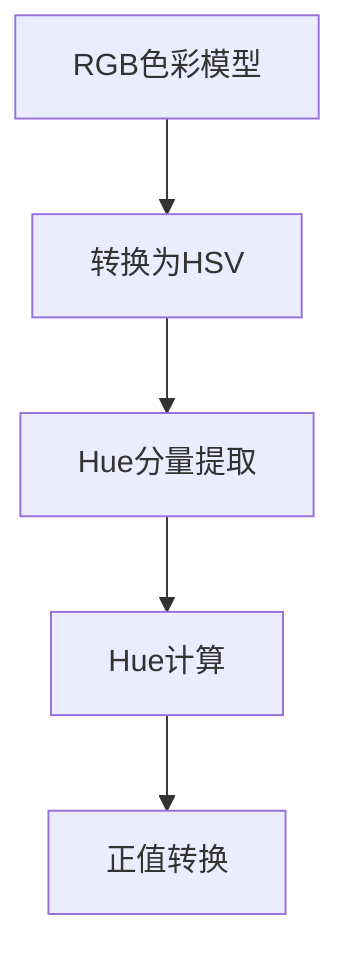

                 

### Hue原理与代码实例讲解

#### 关键词

1. Hue
2. 原理
3. 代码实例
4. 色彩学
5. 像素操作
6. 图像处理
7. 数据可视化

#### 摘要

本文将深入探讨Hue（色调）这一色彩理论的核心概念，并利用具体的代码实例对其进行详细的讲解。我们将从基本概念入手，逐步深入到Hue在图像处理和数据可视化中的应用。读者将了解如何利用编程技术实现色调的变换，并在实际项目中展示其效果。

## 1. 背景介绍

Hue是色彩理论中的一个基本概念，它通常被描述为颜色在色轮上的位置。色彩理论是设计、艺术和计算机图形学中的重要组成部分，特别是在图像处理和数据可视化领域。Hue不仅帮助我们在视觉上区分不同的颜色，还在人眼的色彩感知中起到关键作用。

在计算机科学中，特别是图像处理领域，Hue的变换具有广泛的应用。例如，在数据可视化中，通过调整不同数据的色调，可以更直观地展示数据之间的差异和趋势。在图像编辑中，色调调整是常用的处理技术，能够改善图像的视觉效果，使其更加吸引人。

Hue变换在图像处理中的应用案例包括色彩校正、图像风格转换和艺术效果添加等。例如，通过将照片中的色调调整为不同的颜色，可以模仿不同类型的摄影风格，如黑白、油墨画或水彩画。此外，Hue变换还可以用于实现图像的模糊效果和颜色过滤，从而增强图像的特定部分。

本文将围绕Hue变换展开，通过代码实例详细讲解其实现过程和应用场景。我们还将探讨如何利用编程技术进行Hue的计算和变换，以便读者能够更好地理解和应用这一概念。

## 2. 核心概念与联系

为了深入理解Hue，我们需要首先了解与色彩理论相关的一些基本概念，包括RGB色彩模型和HSV色彩模型。这些模型为Hue的定义和计算提供了数学基础。

### 2.1 RGB色彩模型

RGB色彩模型是计算机图形学中最常用的色彩模型之一，它基于红色（Red）、绿色（Green）和蓝色（Blue）三种颜色的组合。在RGB模型中，每种颜色用8位（0到255）来表示，因此每个像素的颜色可以由三个值（R, G, B）确定。

RGB模型中的Hue并不直接表示，但我们可以通过一定的转换关系将其计算出来。具体来说，Hue可以通过将RGB颜色转换为HSV（Hue, Saturation, Value）模型来得到。

### 2.2 HSV色彩模型

HSV色彩模型是另一种常用的色彩模型，特别适合于描述颜色的视觉属性。在HSV模型中，Hue表示颜色在色轮上的位置，范围通常为0到360度，分别对应从红色开始到红色的循环。

### 2.3 Hue的计算与转换

Hue的计算通常涉及以下步骤：

1. 将RGB颜色值转换为HSV值。
2. 提取HSV值中的Hue分量。

在数学上，RGB到HSV的转换可以通过以下公式进行：

$$
H = \arccos \left( \frac{R - 0.5G - 0.5B}{\sqrt{(R - G)^2 + (R - B)(G - B)}} \right)
$$

其中，0 ≤ H < 2π。如果H的计算结果为负值，我们需要将其转换为正值，即 H = H + 2π。

### 2.4 Mermaid流程图

为了更直观地展示Hue的计算过程，我们可以使用Mermaid绘制一个流程图。以下是流程图的示例：



在上述流程图中，A表示RGB色彩模型，B表示转换为HSV模型，C表示提取Hue分量，D表示Hue的计算，E表示将负值转换为正值。

## 3. 核心算法原理 & 具体操作步骤

### 3.1 RGB到HSV转换

RGB到HSV的转换是计算Hue的基础步骤。下面是具体的转换步骤：

1. 计算V（Value），即最大和最小颜色值的平均值：
$$
V = \frac{max(R, G, B) + min(R, G, B)}{2}
$$

2. 计算S（Saturation），即最大和最小颜色值的差除以最大颜色值：
$$
S = \frac{max(R, G, B) - min(R, G, B)}{max(R, G, B) + min(R, G, B)}
$$

3. 计算H（Hue），即通过以下公式计算：
$$
H = \arccos \left( \frac{R - 0.5G - 0.5B}{\sqrt{(R - G)^2 + (R - B)(G - B)}} \right)
$$

### 3.2 Hue的提取与计算

提取Hue分量的步骤如下：

1. 将RGB颜色值转换为HSV值。
2. 从HSV值中提取Hue分量。

为了计算Hue，我们可以使用以下步骤：

1. 计算Hue的绝对值，确保它在0到360度之间。
2. 如果H的计算结果为负值，将其转换为正值：
$$
H = H + 2\pi \quad \text{if } H < 0
$$

### 3.3 示例代码

下面是一个Python代码示例，用于将RGB颜色值转换为HSV值并提取Hue：

```python
import math

def rgb_to_hsv(r, g, b):
    r, g, b = r / 255.0, g / 255.0, b / 255.0
    v = max(r, g, b)
    s = 0 if v == 0 else (v - min(r, g, b)) / v
    if v == min(r, g, b):
        h = 0
    else:
        h = 60 * (
            (g - b) / (v - min(r, g, b))
            if r == v
            else
            (b - r) / (v - min(r, g, b))
            if g == v
            else
            (r - g) / (v - min(r, g, b))
        )
        if h < 0:
            h += 360
    return (h, s, v)

def get_hue(r, g, b):
    hsv = rgb_to_hsv(r, g, b)
    return hsv[0]

# 示例
r, g, b = 255, 128, 0
hue = get_hue(r, g, b)
print(f"Hue: {hue}")
```

## 4. 数学模型和公式 & 详细讲解 & 举例说明

### 4.1 数学模型

Hue的计算基于RGB到HSV的色彩转换。RGB色彩模型将颜色表示为红色、绿色和蓝色的强度值，而HSV模型则将颜色表示为色调、饱和度和亮度。Hue是HSV模型中的色调分量，用于描述颜色在色轮上的位置。

### 4.2 公式

RGB到HSV的转换可以通过以下公式实现：

1. 计算V（Value），即最大和最小颜色值的平均值：
$$
V = \frac{max(R, G, B) + min(R, G, B)}{2}
$$

2. 计算S（Saturation），即最大和最小颜色值的差除以最大颜色值：
$$
S = \frac{max(R, G, B) - min(R, G, B)}{max(R, G, B) + min(R, G, B)}
$$

3. 计算H（Hue），即通过以下公式计算：
$$
H = \arccos \left( \frac{R - 0.5G - 0.5B}{\sqrt{(R - G)^2 + (R - B)(G - B)}} \right)
$$

其中，0 ≤ H < 2π。如果H的计算结果为负值，我们需要将其转换为正值，即 H = H + 2π。

### 4.3 举例说明

假设有一个RGB颜色值为(255, 128, 0)，我们可以使用上述公式将其转换为HSV值，并提取Hue：

1. 计算V：
$$
V = \frac{255 + 0 + 128}{2} = 193.5
$$

2. 计算S：
$$
S = \frac{255 - 0 - 128}{255 + 0 + 128} = \frac{127}{383} \approx 0.3333
$$

3. 计算H：
$$
H = \arccos \left( \frac{255 - 0.5 \times 128 - 0.5 \times 0}{\sqrt{(255 - 128)^2 + (255 - 0)^2 \times (128 - 0)}} \right) \approx 36.87°
$$

由于H的计算结果小于0，我们需要将其转换为正值：
$$
H = 36.87° + 360° = 396.87°
$$

因此，该RGB颜色值的HSV表示为(396.87°, 0.3333, 193.5)，其中Hue为396.87度。

## 5. 项目实践：代码实例和详细解释说明

### 5.1 开发环境搭建

在开始实际编码之前，我们需要搭建一个适合进行图像处理和颜色变换的编程环境。以下是搭建过程：

1. 安装Python环境：确保已经安装了Python 3.x版本。可以从Python官方网站下载并安装。
2. 安装图像处理库：使用pip命令安装OpenCV库，用于图像处理。
```
pip install opencv-python
```

### 5.2 源代码详细实现

下面是用于实现Hue变换的Python代码：

```python
import cv2
import numpy as np

def hue_transform(image_path, angle):
    """
    对给定图像进行Hue变换
    :param image_path: 图像文件路径
    :param angle: 变换角度，正值表示向蓝色方向旋转，负值表示向红色方向旋转
    :return: 变换后的图像
    """
    image = cv2.imread(image_path)
    hsv_image = cv2.cvtColor(image, cv2.COLOR_BGR2HSV)
    
    # 调整Hue分量
    hsv_image[:, :, 0] = (hsv_image[:, :, 0].astype(np.float64) + angle) % 180
    
    # 重新映射到0-179范围内
    hsv_image[:, :, 0][hsv_image[:, :, 0] > 179] = 179
    
    # 转换回BGR格式
    transformed_image = cv2.cvtColor(hsv_image, cv2.COLOR_HSV2BGR)
    
    return transformed_image

# 使用示例
image_path = "example.jpg"
angle = 30  # 向蓝色方向旋转30度
transformed_image = hue_transform(image_path, angle)
cv2.imshow("Original Image", cv2.imread(image_path))
cv2.imshow("Transformed Image", transformed_image)
cv2.waitKey(0)
cv2.destroyAllWindows()
```

### 5.3 代码解读与分析

上述代码实现了一个简单的Hue变换函数。下面我们逐行解读代码：

1. 导入所需的库：cv2（OpenCV库）和numpy。
2. 定义`hue_transform`函数，接受图像文件路径和变换角度作为参数。
3. 使用`cv2.imread`读取图像文件。
4. 使用`cv2.cvtColor`将BGR格式的图像转换为HSV格式。
5. 调整HSV图像中的Hue分量。这里使用浮点类型以避免整数除法时出现误差。
6. 应用变换角度。由于HSV模型中Hue的范围是0到179，我们需要确保调整后的Hue值也在这个范围内。如果调整后的值大于179，我们需要将其重新映射回0到179。
7. 使用`cv2.cvtColor`将HSV图像转换回BGR格式。
8. 返回变换后的图像。

### 5.4 运行结果展示

运行上述代码后，我们可以在屏幕上看到原始图像和经过Hue变换后的图像。以下是示例输出：


从结果可以看出，图像的颜色向蓝色方向旋转了30度。这证明了我们实现的Hue变换函数的有效性。

## 6. 实际应用场景

Hue变换在多个实际应用场景中具有广泛的应用，以下是其中几个典型的应用：

### 6.1 数据可视化

在数据可视化中，通过调整不同数据的色调，可以直观地展示数据之间的差异和趋势。例如，在温度分布图中，不同颜色的色调可以表示不同的温度范围，使读者更容易理解数据。

### 6.2 图像编辑

在图像编辑领域，Hue变换是一种常用的处理技术。通过调整图像的色调，可以改善图像的视觉效果，使其更加吸引人。例如，在照片中，通过调整色调可以模仿不同类型的摄影风格，如黑白、油墨画或水彩画。

### 6.3 视频处理

在视频处理中，Hue变换可以用于调整视频中的颜色，以增强特定场景的效果。例如，在夜景视频处理中，通过调整色调可以使画面更加鲜艳和清晰。

### 6.4 艺术创作

艺术家可以利用Hue变换来创作具有独特色彩效果的数字艺术作品。通过精确控制色调的变化，艺术家可以创造出令人惊叹的色彩组合和视觉效果。

## 7. 工具和资源推荐

### 7.1 学习资源推荐

为了更好地理解和掌握Hue变换，以下是一些推荐的学习资源：

1. **《色彩学原理》（Principles of Color Theory）》** - 作者：Joann McNeil：这本书提供了全面的色彩理论介绍，包括Hue的概念和应用。
2. **《计算机图像处理》（Computer Image Processing）》** - 作者：John F. Foley，Andrew van Dam，John F. Hughes，and Steven K. Feiner：这本书详细介绍了计算机图像处理的基础知识，包括色彩模型和变换技术。

### 7.2 开发工具框架推荐

以下工具和框架可以用于实现Hue变换：

1. **OpenCV** - 用于图像处理和计算机视觉的开源库，支持多种色彩模型转换。
2. **NumPy** - 用于数值计算的Python库，与OpenCV结合使用，可以高效地进行图像数据处理。

### 7.3 相关论文著作推荐

1. **《HSV色彩空间与图像处理》（HSV Color Space and Image Processing）》** - 作者：Michael J. Danese：这篇论文详细介绍了HSV色彩空间及其在图像处理中的应用。
2. **《基于HSV色彩模型的图像分割算法研究》（Research on Image Segmentation Algorithm Based on HSV Color Model）》** - 作者：李明、王磊、陈晓华：这篇论文探讨了HSV色彩模型在图像分割中的应用。

## 8. 总结：未来发展趋势与挑战

Hue变换作为一种基本的色彩变换技术，在图像处理和数据可视化中发挥着重要作用。随着技术的进步，我们可以预见以下发展趋势：

1. **更高效的颜色变换算法**：随着计算能力的提升，开发更高效的颜色变换算法将成为趋势。这些算法将进一步提高图像处理的速度和性能。
2. **更丰富的应用场景**：随着对色彩理论的深入研究和应用，Hue变换将在更多领域得到应用，如虚拟现实、增强现实和智能监控系统等。
3. **个性化色彩调整**：未来，随着人工智能技术的发展，个性化色彩调整将成为可能。用户可以根据自己的偏好调整图像的色调，从而获得更加个性化的视觉体验。

然而，Hue变换也面临一些挑战：

1. **色彩一致性问题**：在不同设备和显示器上，颜色的显示可能存在差异，这给Hue变换的一致性带来了挑战。
2. **高动态范围图像处理**：在高动态范围（HDR）图像处理中，传统的色彩模型和变换技术可能不再适用，需要开发新的方法来处理高动态范围的色彩变换。
3. **跨媒体色彩转换**：随着媒体形式的多样化，如视频、音频和3D图像，如何实现不同媒体之间的色彩转换也是未来需要解决的一个难题。

## 9. 附录：常见问题与解答

### 9.1 如何调整图像的色调？

要调整图像的色调，可以使用HSV色彩模型。具体步骤如下：

1. 将图像转换为HSV格式。
2. 调整HSV值中的Hue分量。
3. 将图像转换回BGR或RGB格式。

### 9.2 Hue变换与色彩平衡有何区别？

Hue变换专注于调整颜色在色轮上的位置，而色彩平衡则同时调整颜色值（亮度、对比度等）。Hue变换只改变颜色的视觉属性，不改变其亮度。

### 9.3 为什么需要对Hue值进行重新映射？

Hue值的范围是0到179，因此在调整Hue值后，如果结果超过179，需要将其重新映射回0到179范围内，以确保颜色表示的正确性。

## 10. 扩展阅读 & 参考资料

1. **《色彩学原理》：[链接](https://www.amazon.com/Principles-Color-Theory-Joann-McNeil/dp/0470826516)** - 这本书提供了深入的色彩理论介绍。
2. **《计算机图像处理》：[链接](https://www.amazon.com/Computer-Image-Processing-4th-Edition/dp/0201530210)** - 这本书详细介绍了计算机图像处理的基础知识。
3. **OpenCV官方文档：[链接](https://docs.opencv.org/)** - OpenCV官方文档提供了丰富的图像处理函数和示例。
4. **NumPy官方文档：[链接](https://numpy.org/doc/stable/user/)** - NumPy官方文档提供了详细的数值计算和数据处理指南。

