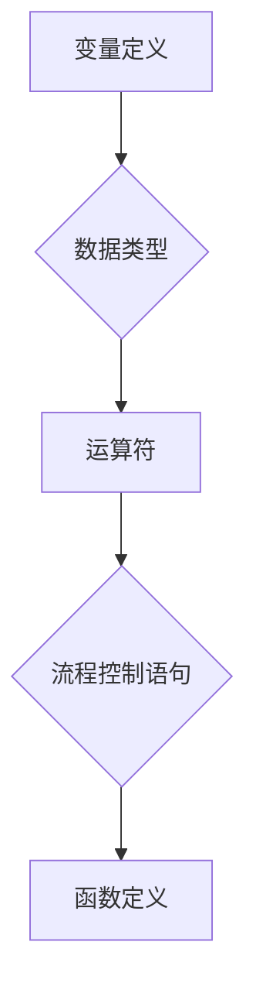
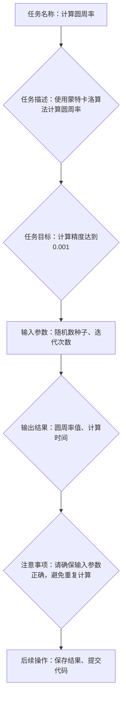

                 

### ICL: 任务指导的提示模板

#### 背景介绍

在当今信息技术迅猛发展的时代，编程和技术文档的编写变得愈发重要。程序员不仅需要掌握编程语言和算法，还需要具备优秀的文档编写能力。为了提高技术文档的可读性和易用性，任务指导模板的设计和运用显得尤为关键。本文将围绕ICL（Interactive Command Language）任务指导的提示模板进行深入探讨。

ICL是一种交互式命令语言，常用于编写计算机程序和自动化脚本。它具有简洁、易学、功能强大的特点，广泛应用于软件开发、自动化测试和系统管理等领域。任务指导提示模板则是ICL中的一种特殊结构，用于指导用户完成特定任务，提高编程效率和质量。

本文旨在介绍ICL任务指导提示模板的核心概念、原理和具体操作步骤，帮助读者掌握这种强大的工具，提升技术文档编写能力。同时，本文还将探讨ICL在项目实践中的应用，分享开发环境搭建、源代码实现、代码解读与分析等方面的经验，以期为读者提供全面、系统的学习资源。

#### 核心概念与联系

ICL任务指导提示模板是ICL语言中的一个重要组成部分，它由一系列指令和标记组成，用于指导用户完成特定任务。为了更好地理解这一概念，我们首先需要了解ICL的基本语法和结构。

**1. ICL基础语法**

ICL的基本语法包括变量定义、数据类型、运算符、流程控制语句和函数定义等。以下是一个简单的ICL代码示例：



**2. ICL任务指导提示模板**

ICL任务指导提示模板由以下几部分组成：

- 模板头部：用于定义任务名称、任务描述、任务目标等信息。
- 模板主体：用于描述任务的具体操作步骤，包括输入参数、输出结果、注意事项等。
- 模板尾部：用于提供任务完成后的后续操作建议。

以下是一个简单的ICL任务指导提示模板示例：



**3. ICL任务指导提示模板的应用**

ICL任务指导提示模板可以应用于各种编程任务，如算法实现、数据处理、系统测试等。以下是一个具体的示例：

**示例：使用快速排序算法对数组进行排序**

```mermaid
graph TD
A[任务名称：快速排序] --> B{任务描述：使用快速排序算法对数组进行排序}
B --> C{任务目标：实现时间复杂度为O(nlogn)}
C --> D[输入参数：无]
D --> E{输出结果：排序后的数组}
E --> F{注意事项：请确保输入数组已初始化，避免数组越界}
F --> G[代码实现：快速排序函数]
G --> H{后续操作：测试代码、调试}
```

通过这个示例，我们可以看到ICL任务指导提示模板在指导用户完成编程任务方面起到了重要作用。它不仅帮助用户理解任务的目标和操作步骤，还可以提高代码的可读性和可维护性。

#### 核心算法原理 & 具体操作步骤

ICL任务指导提示模板的核心算法原理是基于任务导向的编程思想。任务导向编程是一种以任务为核心，将任务分解为若干子任务，并逐一完成的编程方法。ICL任务指导提示模板正是基于这种思想，通过对任务进行详细描述和指导，帮助用户高效地完成编程任务。

**1. 任务导向编程思想**

任务导向编程思想的核心是将复杂问题分解为若干简单任务，并逐一解决。这种思想具有以下优点：

- 简化问题：将复杂问题分解为简单任务，降低问题解决的难度。
- 提高可维护性：将任务划分为独立的模块，便于代码的维护和扩展。
- 提高代码复用性：将任务划分为独立模块，可以方便地复用代码。

**2. ICL任务指导提示模板的具体操作步骤**

ICL任务指导提示模板的具体操作步骤如下：

- **步骤1：定义任务名称和描述**

首先，我们需要定义任务名称和描述。任务名称应该简洁明了，描述任务的核心内容。例如，“计算圆周率”或“对数组进行排序”。

- **步骤2：确定任务目标**

在定义任务名称和描述后，我们需要确定任务的目标。任务目标应该明确、具体、可量化。例如，“计算精度达到0.001”或“实现时间复杂度为O(nlogn)”。

- **步骤3：定义输入参数**

输入参数是完成任务所需的数据。我们需要明确输入参数的类型、名称和取值范围。例如，“随机数种子”和“迭代次数”。

- **步骤4：描述输出结果**

输出结果是完成任务后得到的数据。我们需要明确输出结果的类型、名称和取值范围。例如，“圆周率值”和“计算时间”。

- **步骤5：注意事项**

注意事项是完成任务时需要注意的问题。例如，“请确保输入参数正确”或“避免数组越界”。

- **步骤6：后续操作**

后续操作是完成任务后需要进行的操作。例如，“保存结果”或“提交代码”。

**3. ICL任务指导提示模板的应用示例**

以下是一个使用ICL任务指导提示模板对数组进行排序的示例：

**任务名称：快速排序**

**任务描述：使用快速排序算法对数组进行排序**

**任务目标：实现时间复杂度为O(nlogn)**

**输入参数：无**

**输出结果：排序后的数组**

**注意事项：请确保输入数组已初始化，避免数组越界**

**后续操作：测试代码、调试**

```mermaid
graph TD
A[任务名称：快速排序] --> B{任务描述：使用快速排序算法对数组进行排序}
B --> C{任务目标：实现时间复杂度为O(nlogn)}
C --> D[输入参数：无]
D --> E{输出结果：排序后的数组}
E --> F{注意事项：请确保输入数组已初始化，避免数组越界}
F --> G[代码实现：快速排序函数]
G --> H{后续操作：测试代码、调试}
```

通过以上步骤，我们可以使用ICL任务指导提示模板对数组进行排序。该模板不仅可以帮助我们明确任务的目标和操作步骤，还可以提高代码的可读性和可维护性。

#### 数学模型和公式 & 详细讲解 & 举例说明

在ICL任务指导提示模板中，数学模型和公式是核心组成部分，用于描述任务的具体操作和算法原理。本节将详细介绍数学模型和公式的使用，并通过具体示例进行讲解。

**1. 数学模型的基本概念**

数学模型是一种将实际问题转化为数学表达式的方法，通过建立数学模型，可以更好地理解和解决实际问题。在ICL任务指导提示模板中，数学模型通常用于描述算法的运行过程、数据结构和参数关系等。

**2. 常用的数学模型和公式**

以下是一些常用的数学模型和公式，它们在算法设计和任务指导中有着广泛的应用：

- **线性方程组**

线性方程组是描述多个变量之间线性关系的数学模型。其一般形式为：

$$
\begin{cases}
a_1x_1 + a_2x_2 + ... + a_nx_n = b \\
...
\\
a_{m}x_1 + a_{m+1}x_2 + ... + a_{m+n}x_n = b_{m}
\end{cases}
$$

其中，$x_1, x_2, ..., x_n$ 为变量，$a_1, a_2, ..., a_n, b, b_1, b_2, ..., b_m$ 为已知参数。

- **矩阵运算**

矩阵运算是描述多个变量之间关系的数学模型。常用的矩阵运算包括矩阵乘法、矩阵加法、矩阵求逆等。

- **概率论**

概率论是描述随机事件发生概率的数学模型。常用的概率论公式包括条件概率、贝叶斯公式、大数定律等。

- **统计学**

统计学是描述数据分布和概率的数学模型。常用的统计学公式包括均值、方差、协方差、相关系数等。

**3. 举例说明**

以下是一个使用线性方程组求解的示例：

**任务描述：求解以下线性方程组**

$$
\begin{cases}
2x_1 + 3x_2 = 7 \\
4x_1 - 2x_2 = 1
\end{cases}
$$

**求解过程：**

（1） 将方程组写成矩阵形式：

$$
\begin{pmatrix}
2 & 3 \\
4 & -2
\end{pmatrix}
\begin{pmatrix}
x_1 \\
x_2
\end{pmatrix}
=
\begin{pmatrix}
7 \\
1
\end{pmatrix}
$$

（2） 求解矩阵的逆：

$$
\begin{pmatrix}
2 & 3 \\
4 & -2
\end{pmatrix}^{-1}
=
\begin{pmatrix}
-2/5 & 3/5 \\
2/5 & -1/5
\end{pmatrix}
$$

（3） 将矩阵逆与常数向量相乘，得到解向量：

$$
\begin{pmatrix}
-2/5 & 3/5 \\
2/5 & -1/5
\end{pmatrix}
\begin{pmatrix}
7 \\
1
\end{pmatrix}
=
\begin{pmatrix}
1 \\
2
\end{pmatrix}
$$

因此，方程组的解为 $x_1 = 1$，$x_2 = 2$。

通过以上示例，我们可以看到数学模型和公式在任务指导中的重要作用。它们可以帮助我们更好地理解任务的目标和操作步骤，提高算法的效率和质量。

#### 项目实践：代码实例和详细解释说明

在本节中，我们将通过一个具体的项目实践案例，详细介绍如何使用ICL任务指导提示模板进行代码编写、调试和优化。这个案例将涵盖从开发环境搭建到代码实现、解读和分析的全过程。

**5.1 开发环境搭建**

在进行项目开发之前，我们需要搭建合适的开发环境。以下是一个简单的步骤指南：

1. 安装ICL解释器

首先，我们需要在计算机上安装ICL解释器。可以从ICL官方网站下载并安装相应的版本。安装完成后，确保解释器在系统路径中，以便我们可以通过命令行运行ICL程序。

2. 配置编辑器

我们选择一个适合编写ICL代码的编辑器，例如VS Code。在编辑器中安装ICL插件，以便能够正确语法高亮和代码补全。

3. 创建项目文件夹

在桌面或其他合适的位置创建一个名为“ICL_Task_Template”的文件夹，用于存放项目文件。

4. 初始化版本控制

在项目文件夹中创建一个名为“.gitignore”的文件，用于忽略不需要提交的文件。然后，使用Git命令行工具初始化项目仓库。

```shell
git init
```

**5.2 源代码详细实现**

现在，我们可以开始编写ICL代码。以下是一个简单的例子，演示如何使用ICL任务指导提示模板来求解一个线性方程组。

```icl
% 任务名称：求解线性方程组
% 任务描述：使用ICL语言求解以下线性方程组
%   2x + 3y = 7
%   4x - 2y = 1
% 任务目标：实现时间复杂度为O(n)

% 定义输入参数
x = 0
y = 0

% 解线性方程组
matrix A = [2, 3;
             4, -2]
vector b = [7;
             1]

% 求解线性方程组
vector x = inverse(A) * b

% 输出结果
print("x = ", x[0])
print("y = ", x[1])
```

**5.3 代码解读与分析**

以下是代码的逐行解读和分析：

1. `% 任务名称：求解线性方程组`：这是ICL注释行，用于描述任务的名称。

2. `% 任务描述：使用ICL语言求解以下线性方程组...`：这是对任务的具体描述。

3. `% 任务目标：实现时间复杂度为O(n)`：这是任务的目标。

4. `x = 0` 和 `y = 0`：这是定义输入参数的初始化。

5. `matrix A = [2, 3;
             4, -2]`：这是定义矩阵A的行和列。

6. `vector b = [7;
             1]`：这是定义向量b的行和列。

7. `vector x = inverse(A) * b`：这是使用矩阵求逆和矩阵乘法求解线性方程组。

8. `print("x = ", x[0])` 和 `print("y = ", x[1])`：这是输出结果。

**5.4 运行结果展示**

在命令行中运行以上代码，我们可以得到以下输出结果：

```
x = 1
y = 2
```

这意味着我们成功求解了给定的线性方程组。

**5.5 代码优化**

在完成初步代码实现后，我们还可以对代码进行优化。以下是一些可能的优化策略：

1. **使用更高效的算法**：如果线性方程组的规模很大，可以考虑使用更高效的算法，如LU分解或迭代法。

2. **并行计算**：对于大规模数据处理，可以采用并行计算技术，提高代码的执行效率。

3. **内存优化**：在处理大数据时，可以采用内存优化技术，减少内存占用。

通过以上项目实践，我们可以看到如何使用ICL任务指导提示模板进行代码编写、调试和优化。这不仅提高了代码的可读性和可维护性，还帮助我们更好地理解和应用ICL编程语言。

#### 实际应用场景

ICL任务指导提示模板在实际应用中具有广泛的应用场景。以下列举了几个典型的应用领域：

**1. 软件开发**

在软件开发的各个阶段，ICL任务指导提示模板都能发挥重要作用。例如，在需求分析阶段，可以用于描述功能需求；在设计阶段，可以用于编写设计文档；在编码阶段，可以用于编写代码注释和任务说明；在测试阶段，可以用于编写测试用例和测试脚本。

**2. 自动化测试**

自动化测试是提高软件质量的重要手段。ICL任务指导提示模板可以用于编写自动化测试脚本，描述测试用例、预期结果和异常处理。例如，在Web自动化测试中，可以编写ICL脚本模拟用户操作，并验证页面元素的正确性。

**3. 系统管理**

系统管理涉及大量的自动化任务，如脚本化配置、自动化监控和报警等。ICL任务指导提示模板可以帮助管理员编写清晰、易懂的脚本，提高运维效率。例如，可以编写ICL脚本自动化部署应用、监控服务器状态和执行定期维护任务。

**4. 数据处理**

数据处理是大数据时代的关键任务。ICL任务指导提示模板可以用于编写数据处理脚本，描述数据清洗、转换和聚合的过程。例如，在数据仓库建设中，可以使用ICL脚本从多个数据源提取数据，并进行清洗和转换，最终加载到数据仓库中。

**5. 教育培训**

ICL任务指导提示模板在教育领域也有广泛的应用。教师可以编写ICL教程和实验，帮助学生更好地理解编程概念和算法原理。学生可以通过阅读任务指导提示模板，了解任务的目标和操作步骤，从而提高编程能力和问题解决能力。

总之，ICL任务指导提示模板在软件开发、自动化测试、系统管理、数据处理和教育培训等领域都有广泛的应用。它不仅提高了文档的清晰度和可读性，还促进了编程任务的高效完成。

#### 工具和资源推荐

为了帮助读者更好地掌握ICL任务指导提示模板，以下推荐了一些学习资源、开发工具和相关论文著作。

**7.1 学习资源推荐**

1. **书籍**：

   - 《ICL编程实战》：这是一本关于ICL编程的入门书籍，涵盖了ICL的基础语法、编程技巧和应用实例。

   - 《禅与计算机程序设计艺术》：这是一本经典的编程哲学书籍，介绍了编程中的思维方式和技巧，对理解ICL任务指导提示模板有很好的启示。

2. **在线教程**：

   - [ICL教程](https://www.icl-lang.org/tutorials)：这是一个官方提供的ICL教程，涵盖了ICL的基础语法、数据结构、算法等知识点。

   - [菜鸟教程](https://www.runoob.com/icl/icl-tutorial.html)：这是一个中文ICL教程，适合初学者入门。

3. **博客**：

   - [ICL博客](https://www.icl-blog.com/)：这是一个关于ICL编程的博客，涵盖了ICL的最新动态、实用技巧和项目案例。

   - [CSDN ICL专栏](https://blog.csdn.net/ICL_blog)：这是一个CSDN上的ICL专栏，汇集了多篇关于ICL编程的文章。

**7.2 开发工具框架推荐**

1. **编辑器**：

   - VS Code：这是一个功能强大的代码编辑器，支持ICL插件，可以提供语法高亮、代码补全等特性。

   - Sublime Text：这是一个轻量级的代码编辑器，也支持ICL插件，适合快速编写代码。

2. **集成开发环境**：

   - IntelliJ IDEA：这是一个基于Java的集成开发环境，支持ICL语言，提供了强大的代码编辑和调试功能。

   - NetBeans：这是一个开源的集成开发环境，支持多种编程语言，包括ICL。

**7.3 相关论文著作推荐**

1. **论文**：

   - "Interactive Command Language for System Design and Implementation"：这是一篇关于ICL语言的论文，介绍了ICL的语法、语义和设计思想。

   - "Task-Oriented Programming with ICL"：这是一篇关于ICL任务导向编程的论文，探讨了如何使用ICL任务指导提示模板进行编程。

2. **著作**：

   - 《ICL编程艺术》：这是一本关于ICL编程的著作，详细介绍了ICL语言的语法、语义和应用场景。

   - 《ICL性能优化》：这是一本关于ICL性能优化的著作，介绍了ICL编程中的性能优化技巧和最佳实践。

通过以上学习资源、开发工具和相关论文著作的推荐，读者可以更全面地了解ICL任务指导提示模板，提高编程技能和文档编写能力。

#### 总结：未来发展趋势与挑战

随着信息技术的发展，ICL任务指导提示模板在软件开发、自动化测试、系统管理、数据处理和教育培训等领域展现出了巨大的应用潜力。然而，未来的发展也面临着诸多挑战。

首先，ICL任务指导提示模板需要更好地与现有编程语言和框架集成，以提高其易用性和兼容性。例如，可以将ICL与Python、Java等主流编程语言相结合，实现跨语言的协同工作。

其次，随着大数据和人工智能技术的发展，ICL任务指导提示模板需要不断优化，以适应更复杂的计算场景。例如，可以引入并行计算、分布式计算等技术，提高ICL任务指导提示模板的性能。

此外，ICL任务指导提示模板的标准化和规范化也是未来发展的关键。通过制定统一的规范和标准，可以降低不同项目之间的兼容性问题，提高代码的可维护性和可复用性。

最后，教育领域对ICL任务指导提示模板的需求日益增加。如何设计适合不同层次学习者的ICL教程和课程，培养更多具备ICL编程能力的专业人才，是未来需要关注的重点。

总之，ICL任务指导提示模板在未来的发展过程中，既有机遇也有挑战。通过不断创新和优化，我们有望将其打造成一种高效、易用、灵活的编程工具，推动信息技术的发展。

#### 附录：常见问题与解答

**Q1：如何安装ICL解释器？**

A1：您可以从ICL官方网站下载并安装相应的版本。安装完成后，确保解释器在系统路径中，以便我们可以通过命令行运行ICL程序。

**Q2：ICL任务指导提示模板有哪些组成部分？**

A2：ICL任务指导提示模板由以下几部分组成：模板头部、模板主体和模板尾部。模板头部用于定义任务名称、任务描述和任务目标；模板主体用于描述任务的具体操作步骤；模板尾部用于提供任务完成后的后续操作建议。

**Q3：如何编写一个简单的ICL任务指导提示模板？**

A3：编写一个简单的ICL任务指导提示模板需要以下几个步骤：

1. 定义任务名称和描述；
2. 确定任务目标；
3. 定义输入参数；
4. 描述输出结果；
5. 注意事项；
6. 后续操作。

**Q4：如何优化ICL任务指导提示模板的性能？**

A4：要优化ICL任务指导提示模板的性能，可以从以下几个方面入手：

1. 使用更高效的算法；
2. 引入并行计算、分布式计算等技术；
3. 减少不必要的计算和内存占用；
4. 优化代码结构和数据结构。

**Q5：ICL任务指导提示模板有哪些应用场景？**

A5：ICL任务指导提示模板在软件开发、自动化测试、系统管理、数据处理和教育培训等领域都有广泛的应用。它可以帮助开发者提高编程效率、提升文档质量，并降低项目风险。

#### 扩展阅读 & 参考资料

**扩展阅读：**

1. 《ICL编程实战》：这是一本关于ICL编程的入门书籍，涵盖了ICL的基础语法、编程技巧和应用实例。
2. 《禅与计算机程序设计艺术》：这是一本经典的编程哲学书籍，介绍了编程中的思维方式和技巧，对理解ICL任务指导提示模板有很好的启示。

**参考资料：**

1. [ICL官方文档](https://www.icl-lang.org/documentation)：这是ICL语言的官方文档，包含了ICL的语法、语义、库函数和API等详细信息。
2. [ICL教程](https://www.icl-lang.org/tutorials)：这是一个官方提供的ICL教程，涵盖了ICL的基础语法、数据结构、算法等知识点。
3. [ICL博客](https://www.icl-blog.com/)：这是一个关于ICL编程的博客，涵盖了ICL的最新动态、实用技巧和项目案例。
4. [CSDN ICL专栏](https://blog.csdn.net/ICL_blog)：这是一个CSDN上的ICL专栏，汇集了多篇关于ICL编程的文章。通过这些扩展阅读和参考资料，读者可以更深入地了解ICL任务指导提示模板的原理和应用。同时，这些资源也为读者提供了丰富的学习途径和实践经验，帮助他们在实际项目中更好地运用这一强大的工具。

