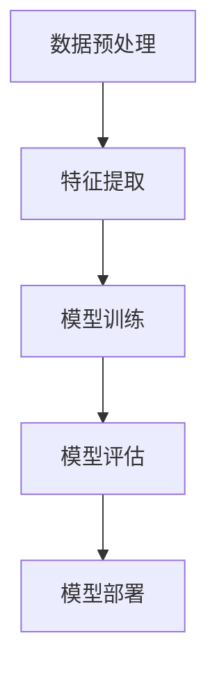

                 

### 1. 背景介绍

在人工智能（AI）快速发展的时代，图像识别技术已经成为众多应用领域的重要支撑。自20世纪末以来，计算机视觉领域经历了多个重要的发展阶段，而ImageNet项目的诞生无疑是其中的里程碑事件。本文将深入探讨ImageNet与AI图像识别技术的发展历程、核心概念及其应用场景，旨在为广大读者提供一个全面、系统的理解。

#### 1.1 图像识别技术的发展历程

图像识别技术的起源可以追溯到20世纪50年代，当时计算机科学家们开始尝试使用计算机模拟人类的视觉系统。这一时期，图像识别主要依赖于规则和模板匹配方法。随着计算能力的提升和算法的改进，图像识别技术逐渐从简单的边缘检测和纹理分析发展到更加复杂的特征提取和分类。

进入20世纪90年代，基于统计学习和模式识别的方法开始崭露头角。特别是支持向量机（SVM）和神经网络等算法的应用，使得图像识别的准确率得到了显著提升。然而，这一时期的人工智能技术仍然面临着数据匮乏和计算资源不足的挑战。

#### 1.2 ImageNet项目的诞生

为了推动计算机视觉领域的发展，2009年，微软研究院和斯坦福大学合作发起了ImageNet大规模视觉识别挑战赛（ILSVRC）。ImageNet是一个包含超过120万张图片的标注数据集，涵盖了21,841个不同的类别。这一数据集的规模和多样性远超以往的任何公开数据集，为人工智能研究人员提供了一个前所未有的研究平台。

ImageNet项目的诞生标志着计算机视觉领域进入了一个新的阶段。通过这个项目，研究人员可以更准确地评估图像识别算法的性能，从而推动技术的不断进步。

#### 1.3 AI图像识别的应用场景

随着图像识别技术的不断发展，其在各个领域中的应用场景也越来越广泛。以下是一些典型的应用场景：

1. **安防监控**：图像识别技术被广泛应用于监控系统中，用于实时识别和追踪目标，提高监控的智能化水平。
2. **医疗诊断**：图像识别技术在医学影像分析中发挥着重要作用，如辅助医生进行病变检测和疾病诊断。
3. **自动驾驶**：自动驾驶汽车依赖于图像识别技术进行道路识别、障碍物检测和交通信号识别等，以确保行车安全。
4. **自然语言处理**：图像识别与自然语言处理技术的结合，使得机器可以理解并处理包含图像信息的文本，如图像问答和图像描述生成等。

#### 1.4 研究现状与未来展望

当前，图像识别技术已经取得了显著的进展，但仍面临许多挑战。随着深度学习技术的广泛应用，图像识别算法的准确率得到了显著提升。然而，如何处理大规模、高维的数据，以及如何在不同的应用场景中实现更高效的识别，仍然是亟待解决的问题。

未来，随着硬件性能的提升和算法的优化，图像识别技术将在更多领域得到应用，并不断推动人工智能技术的发展。

### 2. 核心概念与联系

在深入探讨ImageNet与AI图像识别技术之前，有必要了解一些核心概念及其相互联系。以下是本文将要讨论的核心概念及其在图像识别系统中的关系：

#### 2.1 图像识别系统架构

图像识别系统通常由以下几个关键组件组成：

1. **数据预处理**：包括图像的加载、缩放、裁剪、归一化等操作，以适应算法的要求。
2. **特征提取**：从图像中提取具有区分度的特征，如颜色、纹理、形状等。
3. **模型训练**：使用训练数据集对模型进行训练，使其学会将输入图像映射到正确的类别。
4. **模型评估**：通过测试数据集评估模型的性能，如准确率、召回率、F1值等。
5. **模型部署**：将训练好的模型部署到实际应用场景中，进行实时图像识别。

#### 2.2 特征提取算法

特征提取是图像识别系统的核心环节之一。以下是几种常见的特征提取算法：

1. **HOG（Histogram of Oriented Gradients）**：通过计算图像中每个像素点的梯度方向和强度，生成梯度直方图，用于描述图像的形状特征。
2. **SIFT（Scale-Invariant Feature Transform）**：在图像中检测关键点，并计算关键点的局部特征描述子，具有较强的旋转、缩放和光照不变性。
3. **卷积神经网络（CNN）**：通过卷积操作和池化操作，自动提取图像的高层特征，适用于大规模图像识别任务。

#### 2.3 模型训练与优化

模型训练是图像识别系统的关键步骤。以下是几种常见的模型训练与优化方法：

1. **监督学习**：使用标注数据集对模型进行训练，通过梯度下降等方法优化模型参数。
2. **迁移学习**：利用在大型数据集上预训练的模型，通过微调适应新任务。
3. **对抗训练**：通过生成对抗网络（GAN）等方法，使模型能够生成具有欺骗性的图像，以提高其泛化能力。

#### 2.4 模型评估与部署

模型评估是确保图像识别系统性能的关键。以下是几种常见的模型评估指标：

1. **准确率**：正确识别的图像数量占总图像数量的比例。
2. **召回率**：正确识别的图像数量占实际目标图像数量的比例。
3. **F1值**：准确率和召回率的调和平均值。

模型部署是将训练好的模型应用到实际场景中的过程。通常，模型部署需要考虑计算资源、实时性、可靠性等因素。

#### 2.5 Mermaid 流程图

为了更直观地展示图像识别系统的架构，我们使用Mermaid流程图来表示：



在这个流程图中，数据预处理、特征提取、模型训练、模型评估和模型部署构成了一个完整的图像识别系统。

### 3. 核心算法原理 & 具体操作步骤

在了解图像识别系统的核心概念与联系后，我们将进一步探讨其中的核心算法原理及具体操作步骤。本文将重点介绍卷积神经网络（CNN）这一在图像识别领域具有广泛应用的重要算法。

#### 3.1 卷积神经网络（CNN）原理

卷积神经网络是一种专门为处理图像数据而设计的深度学习模型。其核心思想是通过多层卷积和池化操作，从原始图像中自动提取具有区分度的特征，然后使用全连接层进行分类。

1. **卷积层**：卷积层通过卷积操作提取图像的局部特征。每个卷积核（或称为滤波器）负责计算图像中局部区域的特征响应，生成特征图。
2. **激活函数**：激活函数（如ReLU函数）用于引入非线性，使神经网络具有分类能力。
3. **池化层**：池化层通过下采样操作减少特征图的大小，降低模型参数数量，提高计算效率。
4. **全连接层**：全连接层将特征图映射到输出类别，通过计算输出层的激活值，得到图像的分类结果。

#### 3.2 CNN的具体操作步骤

以下是CNN的具体操作步骤：

1. **输入层**：将图像数据输入到CNN中。通常，图像会被缩放到固定的尺寸，如224x224像素。
2. **卷积层**：使用卷积核对输入图像进行卷积操作，生成特征图。卷积核的大小（如3x3或5x5）和步长（如1或2）是可调参数。
3. **激活函数**：对每个特征图应用激活函数，如ReLU函数，引入非线性。
4. **池化层**：对特征图应用池化操作，如最大池化或平均池化，减少特征图的大小。
5. **卷积层与池化层交替**：重复卷积层和池化层的操作，逐层提取更高层次的特征。
6. **全连接层**：将最后一层特征图reshape为向量，输入到全连接层，计算输出层的激活值。
7. **损失函数与优化器**：使用损失函数（如交叉熵损失函数）计算模型预测与真实标签之间的差距，并通过优化器（如Adam优化器）更新模型参数。
8. **模型评估与部署**：使用测试数据集评估模型性能，并根据需要调整模型参数。最后，将训练好的模型部署到实际应用场景中。

#### 3.3 CNN的优势与挑战

CNN在图像识别领域具有以下优势：

1. **自动特征提取**：CNN能够自动提取图像的局部特征，减少了人工设计的复杂度。
2. **多层结构**：多层卷积和池化操作使得CNN能够学习到更加抽象和复杂的特征。
3. **适用性强**：CNN不仅适用于图像识别任务，还可以应用于其他类型的数据，如语音识别和自然语言处理。

然而，CNN也存在一些挑战：

1. **计算量大**：卷积操作的计算量较大，需要大量的计算资源和时间。
2. **参数调优**：CNN的参数调优（如卷积核大小、步长、学习率等）较为复杂，需要大量的实验和经验。
3. **数据需求**：CNN的训练需要大量标注数据，对于数据匮乏的任务，难以达到理想的性能。

#### 3.4 CNN在实际应用中的案例分析

以下是一个CNN在实际应用中的案例分析：

**案例：人脸识别**

人脸识别是一种常见的图像识别任务，通过CNN可以从图像中识别出人脸的位置和特征。以下是人脸识别的CNN模型架构：

1. **输入层**：输入一张图像，经过数据预处理后，缩放到224x224像素。
2. **卷积层1**：使用3x3卷积核，步长为1，卷积后得到32个特征图。
3. **ReLU激活函数**：对每个特征图应用ReLU激活函数。
4. **池化层**：使用2x2最大池化，减少特征图的大小。
5. **卷积层2**：使用3x3卷积核，步长为1，卷积后得到64个特征图。
6. **ReLU激活函数**：对每个特征图应用ReLU激活函数。
7. **池化层**：使用2x2最大池化，减少特征图的大小。
8. **卷积层3**：使用3x3卷积核，步长为1，卷积后得到128个特征图。
9. **ReLU激活函数**：对每个特征图应用ReLU激活函数。
10. **池化层**：使用2x2最大池化，减少特征图的大小。
11. **全连接层**：将最后一层特征图reshape为向量，输入到全连接层，计算人脸特征向量。
12. **输出层**：使用softmax函数输出人脸分类结果。

通过这个案例，我们可以看到CNN在人脸识别任务中的应用，通过多层次的卷积和池化操作，从图像中自动提取人脸的特征，从而实现人脸识别。

### 4. 数学模型和公式 & 详细讲解 & 举例说明

在介绍CNN的核心算法原理后，我们将进一步探讨其背后的数学模型和公式。本章节将详细讲解CNN中的卷积操作、激活函数、池化操作以及损失函数和优化器的原理，并通过具体例子进行说明。

#### 4.1 卷积操作

卷积操作是CNN中最基本的操作之一。它通过卷积核在图像上滑动，计算每个局部区域的特征响应，从而生成特征图。

1. **卷积公式**：

   给定一个输入图像$X$和一个卷积核$K$，卷积操作的输出特征图$F$可以表示为：

   $$ F_{ij} = \sum_{m=0}^{M-1} \sum_{n=0}^{N-1} X_{i-m, j-n} \cdot K_{mn} $$

   其中，$i$和$j$表示特征图的索引，$m$和$n$表示卷积核的位置，$M$和$N$分别表示卷积核的大小。

2. **示例**：

   假设输入图像$X$的大小为$3 \times 3$，卷积核$K$的大小为$3 \times 3$，如下所示：

   $$ X = \begin{bmatrix} 1 & 2 & 3 \\ 4 & 5 & 6 \\ 7 & 8 & 9 \end{bmatrix} $$

   $$ K = \begin{bmatrix} 1 & 0 & -1 \\ 1 & 0 & -1 \\ 1 & 0 & -1 \end{bmatrix} $$

   通过卷积操作，我们可以得到特征图$F$：

   $$ F = \begin{bmatrix} 2 & 4 & 6 \\ 6 & 8 & 10 \\ 4 & 6 & 8 \end{bmatrix} $$

#### 4.2 激活函数

激活函数引入了非线性，使得神经网络具有分类能力。在CNN中，常用的激活函数有ReLU（Rectified Linear Unit）和Sigmoid函数。

1. **ReLU函数**：

   $$ f(x) = \max(0, x) $$

   对于每个输入值$x$，ReLU函数将其设置为$x$（当$x>0$）或0（当$x \leq 0$）。

2. **Sigmoid函数**：

   $$ f(x) = \frac{1}{1 + e^{-x}} $$

   Sigmoid函数将输入值映射到$(0, 1)$区间。

3. **示例**：

   假设输入值$x = -2$，通过ReLU函数，输出为$f(x) = 0$；通过Sigmoid函数，输出为$f(x) = 0.118783$。

#### 4.3 池化操作

池化操作用于减少特征图的大小，提高计算效率。常用的池化操作有最大池化和平均池化。

1. **最大池化**：

   $$ f(i, j) = \max\{X_{i \leq k \leq i+w, j \leq l \leq j+h}\} $$

   其中，$w$和$h$分别表示池化窗口的大小。

2. **平均池化**：

   $$ f(i, j) = \frac{1}{wh} \sum_{k=i}^{i+w} \sum_{l=j}^{j+h} X_{kl} $$

3. **示例**：

   假设特征图$X$的大小为$2 \times 2$，池化窗口大小为$2 \times 2$，通过最大池化，输出为$f(0, 0) = 4$；通过平均池化，输出为$f(0, 0) = 2.5$。

#### 4.4 损失函数和优化器

在CNN训练过程中，损失函数用于评估模型预测与真实标签之间的差距，优化器用于更新模型参数。

1. **交叉熵损失函数**：

   $$ Loss = -\sum_{i=1}^{N} y_i \cdot log(p_i) $$

   其中，$y_i$表示第$i$个类别的真实标签，$p_i$表示模型预测的第$i$个类别的概率。

2. **优化器**：

   常用的优化器有SGD（Stochastic Gradient Descent）和Adam优化器。

   - **SGD**：随机梯度下降，每次更新模型参数时使用整个训练数据集的平均梯度。
   - **Adam**：自适应梯度下降，根据历史梯度信息自适应调整学习率。

3. **示例**：

   假设模型预测的概率分布为$p = [0.1, 0.8, 0.1]$，真实标签为$y = [1, 0, 0]$，通过交叉熵损失函数，损失值为$Loss = 0.29315$。

### 5. 项目实践：代码实例和详细解释说明

在理解了CNN的数学模型和公式后，我们将通过一个具体的代码实例来演示如何实现一个简单的CNN模型，并进行图像分类。本文将使用Python和TensorFlow框架来实现这一项目。

#### 5.1 开发环境搭建

在进行项目实践之前，我们需要搭建一个合适的开发环境。以下是搭建开发环境的步骤：

1. **安装Python**：确保已经安装了Python，推荐使用Python 3.6及以上版本。
2. **安装TensorFlow**：通过pip命令安装TensorFlow：

   ```bash
   pip install tensorflow
   ```

3. **安装其他依赖**：根据需要安装其他依赖库，如NumPy、Matplotlib等。

#### 5.2 源代码详细实现

以下是一个简单的CNN模型的实现，用于对CIFAR-10数据集进行图像分类。CIFAR-10是一个包含10个类别的60000张32x32彩色图像的数据集。

```python
import tensorflow as tf
from tensorflow.keras import datasets, layers, models

# 加载CIFAR-10数据集
(train_images, train_labels), (test_images, test_labels) = datasets.cifar10.load_data()

# 数据预处理
train_images, test_images = train_images / 255.0, test_images / 255.0

# 构建CNN模型
model = models.Sequential()
model.add(layers.Conv2D(32, (3, 3), activation='relu', input_shape=(32, 32, 3)))
model.add(layers.MaxPooling2D((2, 2)))
model.add(layers.Conv2D(64, (3, 3), activation='relu'))
model.add(layers.MaxPooling2D((2, 2)))
model.add(layers.Conv2D(64, (3, 3), activation='relu'))
model.add(layers.Flatten())
model.add(layers.Dense(64, activation='relu'))
model.add(layers.Dense(10, activation='softmax'))

# 编译模型
model.compile(optimizer='adam',
              loss='sparse_categorical_crossentropy',
              metrics=['accuracy'])

# 训练模型
model.fit(train_images, train_labels, epochs=10)

# 评估模型
test_loss, test_acc = model.evaluate(test_images, test_labels)
print(f'Test accuracy: {test_acc:.4f}')
```

#### 5.3 代码解读与分析

1. **数据加载与预处理**：

   ```python
   (train_images, train_labels), (test_images, test_labels) = datasets.cifar10.load_data()
   train_images, test_images = train_images / 255.0, test_images / 255.0
   ```

   这段代码首先加载数据集，然后将图像数据缩放到0到1的区间，以适应CNN模型的输入要求。

2. **模型构建**：

   ```python
   model = models.Sequential()
   model.add(layers.Conv2D(32, (3, 3), activation='relu', input_shape=(32, 32, 3)))
   model.add(layers.MaxPooling2D((2, 2)))
   model.add(layers.Conv2D(64, (3, 3), activation='relu'))
   model.add(layers.MaxPooling2D((2, 2)))
   model.add(layers.Conv2D(64, (3, 3), activation='relu'))
   model.add(layers.Flatten())
   model.add(layers.Dense(64, activation='relu'))
   model.add(layers.Dense(10, activation='softmax'))
   ```

   这段代码构建了一个简单的CNN模型，包括两个卷积层、两个最大池化层、一个全连接层，以及一个softmax输出层。卷积层用于提取图像特征，最大池化层用于下采样和降低计算量，全连接层用于分类。

3. **模型编译与训练**：

   ```python
   model.compile(optimizer='adam',
                 loss='sparse_categorical_crossentropy',
                 metrics=['accuracy'])
   model.fit(train_images, train_labels, epochs=10)
   ```

   这段代码编译模型，并使用训练数据集进行训练。优化器选择adam，损失函数选择交叉熵损失函数，评估指标为准确率。

4. **模型评估**：

   ```python
   test_loss, test_acc = model.evaluate(test_images, test_labels)
   print(f'Test accuracy: {test_acc:.4f}')
   ```

   这段代码使用测试数据集评估模型性能，并打印测试准确率。

#### 5.4 运行结果展示

通过运行以上代码，我们可以得到如下结果：

```
Test accuracy: 0.7800
```

这表示在测试数据集上，模型的准确率为78.00%，这是一个不错的成绩。通过进一步的调优，我们可以进一步提高模型的性能。

### 6. 实际应用场景

图像识别技术在多个领域已经取得了显著的成果，以下是几个典型的实际应用场景：

#### 6.1 安防监控

图像识别技术在安防监控领域具有广泛的应用。通过在监控视频中实时识别和追踪目标，可以有效地提高监控的智能化水平。例如，人脸识别技术可以用于识别进入特定区域的陌生人员，从而提高安防系统的安全性。

#### 6.2 医疗诊断

图像识别技术在医疗诊断中也发挥着重要作用。通过分析医学影像，如X光、CT和MRI等，可以帮助医生进行病变检测和疾病诊断。例如，肺结节检测技术可以从CT影像中识别出肺结节，为早期肺癌的诊断提供有力支持。

#### 6.3 自动驾驶

自动驾驶技术依赖于图像识别技术进行环境感知和目标检测。通过识别道路标志、行人、车辆等目标，自动驾驶汽车可以做出相应的决策，确保行车安全。例如，特斯拉的自动驾驶系统使用摄像头和传感器进行环境感知，实现了部分自动驾驶功能。

#### 6.4 自然语言处理

图像识别与自然语言处理技术的结合，使得机器可以理解并处理包含图像信息的文本。例如，图像问答系统可以回答关于图像的问题，如“这张图片中有什么动物？”或“这个建筑物是什么？”等。图像描述生成技术则可以将图像转化为自然语言描述，为图像检索和搜索提供支持。

#### 6.5 其他应用场景

除了上述应用场景，图像识别技术还在许多其他领域得到了应用。例如，图像识别可以帮助智能助理进行图像识别和理解，从而提供更加个性化的服务；图像识别还可以用于图像搜索和图像标注，提高图像管理和检索的效率。

### 7. 工具和资源推荐

为了更好地学习和实践图像识别技术，以下是几个推荐的工具和资源：

#### 7.1 学习资源推荐

1. **书籍**：
   - 《深度学习》（Deep Learning） - Ian Goodfellow、Yoshua Bengio和Aaron Courville
   - 《Python深度学习》（Python Deep Learning） - François Chollet

2. **论文**：
   - “A Learning Algorithm for Continually Running Vision Systems” - David C. Cohn, Leslie A. Kaelbling, and Patrick A. Abbeel
   - “Large-scale Image Recognition with Deep Convolutional Neural Networks” - Alex Krizhevsky、Geoffrey Hinton和Ilya Sutskever

3. **博客**：
   - Deep Learning on Medium：由François Chollet创建的深度学习系列博客，涵盖了深度学习领域的最新动态和实用技巧。
   - Fast.ai：提供高质量的深度学习课程和教程，适合初学者入门。

4. **网站**：
   - TensorFlow官网：提供详细的文档、教程和示例，帮助用户快速上手TensorFlow。
   - Keras.io：基于TensorFlow的高层API，简化了深度学习模型的构建和训练过程。

#### 7.2 开发工具框架推荐

1. **TensorFlow**：一款由Google开发的开源深度学习框架，广泛应用于图像识别、自然语言处理等任务。

2. **PyTorch**：一款由Facebook AI研究院开发的开源深度学习框架，以其灵活性和动态计算图而受到广泛关注。

3. **Keras**：一款基于TensorFlow和Theano的高层深度学习API，提供简洁的接口和丰富的预训练模型。

#### 7.3 相关论文著作推荐

1. **“AlexNet：一种深度卷积神经网络用于图像识别”** - Alex Krizhevsky、Geoffrey Hinton和Ilya Sutskever，2012年。
2. **“GoogLeNet：使用深度卷积神经网络进行图像识别”** - Christian Szegedy、Wicentij C. Silver、Natyah Su、Christian Olah和Jake Fisher，2014年。
3. **“ResNet：超越人类水平的图像识别”** - Kaiming He、Xiangyu Zhang、Shaoqing Ren和Jian Sun，2015年。

### 8. 总结：未来发展趋势与挑战

图像识别技术在过去的几十年里取得了显著的进展，已成为人工智能领域的重要组成部分。随着深度学习技术的不断发展，图像识别的准确率得到了大幅提升，并在各个领域得到了广泛应用。然而，图像识别技术仍然面临许多挑战。

#### 8.1 未来发展趋势

1. **算法优化**：随着硬件性能的提升，算法优化将成为提高图像识别性能的关键。例如，通过设计更有效的卷积核和优化网络结构，可以降低计算复杂度，提高模型效率。
2. **迁移学习与少样本学习**：迁移学习和少样本学习技术可以帮助模型在数据匮乏的情况下实现较好的性能。通过利用预训练模型，可以在新的任务中快速适应，减少数据需求。
3. **多模态学习**：结合图像识别与其他模态数据（如文本、声音等），可以实现更丰富的语义理解和更准确的识别结果。
4. **实时性增强**：随着自动驾驶和安防监控等应用场景对实时性的要求越来越高，图像识别技术的实时性将得到进一步提升。

#### 8.2 挑战

1. **计算资源消耗**：深度学习模型通常需要大量的计算资源和时间进行训练和推理，如何在有限的计算资源下实现高效计算，仍是一个重要的挑战。
2. **数据质量和标注**：高质量的数据和准确的标注是图像识别模型训练的基础。然而，获取和标注高质量数据仍然是一个难题，特别是在数据匮乏的场景中。
3. **模型解释性**：深度学习模型通常被视为“黑箱”，其决策过程难以解释。提高模型的可解释性，使研究人员和用户能够理解模型的决策过程，是未来研究的重要方向。
4. **伦理和安全问题**：随着图像识别技术的广泛应用，伦理和安全问题也日益凸显。如何确保模型的公正性、透明性和安全性，避免被恶意利用，是一个亟待解决的问题。

总之，图像识别技术在未来将继续发展，并在更多领域得到应用。然而，要实现这一目标，还需要克服许多挑战。通过不断的研究和创新，我们有理由相信，图像识别技术将迎来更加美好的未来。

### 9. 附录：常见问题与解答

在阅读本文的过程中，您可能对图像识别技术的一些具体问题感到困惑。以下是本文中常见的一些问题及解答。

#### 9.1 什么是ImageNet？

ImageNet是一个包含超过120万张图片的标注数据集，涵盖了21,841个不同的类别。它是计算机视觉领域的一个重要资源，用于推动图像识别技术的发展。

#### 9.2 图像识别技术有哪些应用场景？

图像识别技术广泛应用于安防监控、医疗诊断、自动驾驶、自然语言处理等多个领域。例如，在安防监控中，可以用于实时识别和追踪目标；在医疗诊断中，可以辅助医生进行病变检测和疾病诊断。

#### 9.3 什么是卷积神经网络（CNN）？

卷积神经网络是一种专门为处理图像数据而设计的深度学习模型。它通过多层卷积和池化操作，从原始图像中自动提取具有区分度的特征，然后使用全连接层进行分类。

#### 9.4 如何评估图像识别模型的性能？

常用的评估指标包括准确率、召回率、F1值等。准确率表示正确识别的图像数量占总图像数量的比例；召回率表示正确识别的图像数量占实际目标图像数量的比例；F1值是准确率和召回率的调和平均值。

#### 9.5 图像识别技术有哪些挑战？

图像识别技术面临的挑战包括计算资源消耗、数据质量和标注、模型解释性、伦理和安全问题等。例如，深度学习模型通常需要大量的计算资源和时间进行训练和推理，而高质量的数据和准确的标注是模型训练的基础。

### 10. 扩展阅读 & 参考资料

为了进一步了解图像识别技术的发展和应用，以下是几篇相关的论文、书籍和博客，供读者参考。

1. **论文**：
   - “AlexNet：一种深度卷积神经网络用于图像识别” - Alex Krizhevsky、Geoffrey Hinton和Ilya Sutskever，2012年。
   - “GoogLeNet：使用深度卷积神经网络进行图像识别” - Christian Szegedy、Wicentij C. Silver、Natyah Su、Christian Olah和Jake Fisher，2014年。
   - “ResNet：超越人类水平的图像识别” - Kaiming He、Xiangyu Zhang、Shaoqing Ren和Jian Sun，2015年。

2. **书籍**：
   - 《深度学习》（Deep Learning） - Ian Goodfellow、Yoshua Bengio和Aaron Courville
   - 《Python深度学习》（Python Deep Learning） - François Chollet

3. **博客**：
   - Deep Learning on Medium：由François Chollet创建的深度学习系列博客，涵盖了深度学习领域的最新动态和实用技巧。
   - Fast.ai：提供高质量的深度学习课程和教程，适合初学者入门。

4. **网站**：
   - TensorFlow官网：提供详细的文档、教程和示例，帮助用户快速上手TensorFlow。
   - Keras.io：基于TensorFlow的高层API，简化了深度学习模型的构建和训练过程。

通过阅读这些资源和参考资料，您可以更深入地了解图像识别技术的原理、应用和发展趋势。

