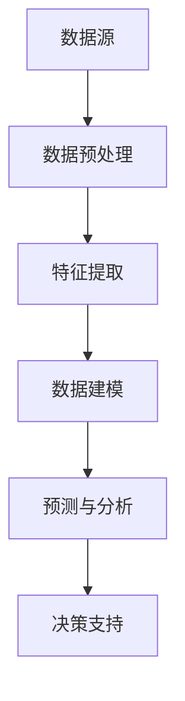

                 

### 背景介绍

>关键词：Insight，制造，教育，金融，医疗，军事，人工智能，数据分析，应用场景

随着大数据时代的到来，数据量和数据种类呈现出爆炸式增长，如何从海量数据中挖掘出有价值的信息成为了企业和政府关注的焦点。此时，人工智能（AI）技术的崛起为数据分析和处理带来了新的希望。其中，Insight作为一种先进的数据分析工具，在制造、教育、金融、医疗和军事等众多领域展现出了巨大的应用潜力。本文将详细介绍Insight在这些领域中的应用，以及如何通过逐步分析推理的方式来理解和运用这些应用场景。

#### 制造行业

在制造业中，Insight技术被广泛应用于生产线的优化、设备维护、质量控制等方面。通过对大量生产数据的实时分析和处理，Insight可以帮助企业识别生产过程中的瓶颈和问题，提高生产效率和产品质量。具体应用场景包括：

1. **生产过程优化**：Insight可以通过分析生产数据，找出生产过程中的瓶颈和低效环节，为企业提供优化方案，从而提高整体生产效率。

2. **设备维护预测**：通过分析设备运行数据，Insight可以预测设备的故障风险，帮助企业提前安排维护计划，降低设备故障率。

3. **质量监控**：Insight可以对生产过程产生的质量数据进行实时分析，及时发现质量异常，防止不良品出厂。

#### 教育行业

在教育领域，Insight技术可以帮助学校和教育机构进行教学管理和学生个性化学习。具体应用场景包括：

1. **教学效果评估**：通过分析学生的学习数据，Insight可以评估教学效果，帮助教师调整教学方法，提高教学质量。

2. **学生个性化学习**：Insight可以根据学生的学习数据，为学生推荐个性化的学习资源和教学方法，提高学习效果。

3. **学习行为分析**：通过分析学生的学习行为数据，Insight可以帮助教育机构了解学生的学习习惯和偏好，为教育教学提供参考。

#### 金融行业

在金融领域，Insight技术被广泛应用于风险管理、客户服务和投资决策等方面。具体应用场景包括：

1. **风险管理**：通过分析金融数据，Insight可以帮助金融机构识别潜在的风险，并制定相应的风险管理策略。

2. **客户服务**：Insight可以对客户数据进行深度分析，为企业提供精准的客户画像，从而提高客户服务水平和满意度。

3. **投资决策**：通过分析市场数据，Insight可以为投资者提供投资建议，帮助其做出更明智的投资决策。

#### 医疗行业

在医疗领域，Insight技术为医生提供了强大的辅助决策工具。具体应用场景包括：

1. **疾病预测**：通过分析病人的医疗数据，Insight可以帮助医生预测疾病的发生和发展趋势，为疾病预防提供参考。

2. **个性化治疗**：Insight可以根据病人的病史、基因等信息，为医生提供个性化的治疗方案。

3. **医疗资源分配**：通过分析医疗数据，Insight可以帮助医疗机构优化资源分配，提高医疗服务效率。

#### 军事领域

在军事领域，Insight技术被广泛应用于情报分析、战略规划和作战指挥等方面。具体应用场景包括：

1. **情报分析**：通过分析海量情报数据，Insight可以帮助军事部门识别潜在威胁，制定相应的应对策略。

2. **战略规划**：Insight可以对战略数据进行分析，为军事部门提供战略规划建议。

3. **作战指挥**：在作战过程中，Insight可以实时分析战场数据，为指挥官提供作战决策支持。

通过以上介绍，我们可以看到，Insight技术在各个行业都展现出了强大的应用潜力。接下来，我们将进一步探讨Insight技术的核心概念与联系，以及如何在具体应用中进行操作和实现。

## 2. 核心概念与联系

要深入理解Insight技术在各个领域的应用，我们需要首先掌握其核心概念和架构。本节将详细介绍Insight技术的核心原理和组成部分，并通过Mermaid流程图来展示其工作流程。

### 核心概念

#### 数据预处理

数据预处理是Insight技术的第一步，其目的是对原始数据进行清洗、转换和整合，使其符合分析要求。具体包括：

- 数据清洗：去除重复数据、缺失数据和异常数据。
- 数据转换：将不同格式和单位的数据转换为统一格式。
- 数据整合：将来自不同来源的数据进行合并，形成统一的数据集。

#### 特征提取

特征提取是指从原始数据中提取出对分析任务有意义的特征。特征提取的质量直接影响分析结果的准确性。常见的特征提取方法包括：

- 统计特征提取：基于统计学方法提取数据的基本特征，如平均值、标准差、相关性等。
- 机器学习特征提取：利用机器学习算法从数据中自动提取特征，如主成分分析（PCA）、线性判别分析（LDA）等。

#### 数据建模

数据建模是Insight技术的核心环节，通过建立数学模型来描述数据之间的关系。常用的建模方法包括：

- 机器学习模型：如线性回归、决策树、支持向量机（SVM）等。
- 深度学习模型：如卷积神经网络（CNN）、循环神经网络（RNN）等。
- 强化学习模型：如Q-learning、深度确定性策略梯度（DDPG）等。

#### 预测与分析

预测与分析是指利用建模结果对未知数据进行预测和分析。具体包括：

- 预测：根据建模结果，对未知数据进行预测。
- 分析：对预测结果进行评估和解释，为决策提供依据。

### 架构与联系

Insight技术的整体架构可以分为以下几个部分：

1. **数据源**：包括各类原始数据，如传感器数据、日志数据、网络数据等。
2. **数据预处理模块**：负责对原始数据进行清洗、转换和整合。
3. **特征提取模块**：负责从数据中提取出对分析任务有意义的特征。
4. **数据建模模块**：负责建立数学模型来描述数据之间的关系。
5. **预测与分析模块**：负责利用建模结果对未知数据进行预测和分析。

通过上述模块的协同工作，Insight技术可以实现对大量数据的深入分析和处理，为各行业提供有力的决策支持。

### Mermaid流程图

下面是一个简化的Mermaid流程图，展示了Insight技术的工作流程：



在这个流程图中，A表示数据源，B表示数据预处理，C表示特征提取，D表示数据建模，E表示预测与分析，F表示决策支持。各模块之间通过箭头表示数据流向，形成了一个完整的数据分析流程。

通过以上介绍，我们可以看到Insight技术的核心概念和架构，以及它们之间的联系。在下一节中，我们将进一步探讨Insight技术的核心算法原理和具体操作步骤，帮助读者深入理解和掌握这一先进的数据分析工具。

## 3. 核心算法原理 & 具体操作步骤

要深入理解Insight技术的核心算法原理，我们需要从基础概念出发，逐步介绍常用的算法和方法，并结合具体操作步骤进行讲解。本节将详细介绍Insight技术中常用的核心算法，包括线性回归、决策树、支持向量机（SVM）和神经网络等，帮助读者系统地掌握这些算法的基本原理和实现方法。

### 3.1 线性回归

线性回归是一种基本的统计学习方法，主要用于预测连续值输出。其基本思想是通过建立线性模型，将输入特征映射到输出值。

#### 基本原理

线性回归模型可以表示为：

$$
y = \beta_0 + \beta_1 \cdot x_1 + \beta_2 \cdot x_2 + \ldots + \beta_n \cdot x_n + \epsilon
$$

其中，$y$是输出值，$x_1, x_2, \ldots, x_n$是输入特征，$\beta_0, \beta_1, \beta_2, \ldots, \beta_n$是模型的参数，$\epsilon$是误差项。

#### 具体操作步骤

1. **数据准备**：收集并整理输入输出数据，确保数据格式一致。
2. **特征选择**：选择对预测任务有意义的特征。
3. **模型建立**：通过最小二乘法或其他优化方法，计算线性回归模型的参数。
4. **模型评估**：使用验证集或测试集评估模型性能。
5. **模型应用**：将训练好的模型应用于新的数据，进行预测。

### 3.2 决策树

决策树是一种基于树形结构的数据挖掘算法，主要用于分类和回归任务。其基本思想是通过一系列if-else判断，将数据划分为不同的区域，并在每个区域中预测输出值。

#### 基本原理

决策树可以表示为：

```
根节点
|
|---左子树（满足条件A）
|       |
|       |---左子节点
|
|---右子树（满足条件B）
        |
        |---右子节点
```

其中，根节点表示整个数据集，左子树表示满足条件A的数据，右子树表示满足条件B的数据。

#### 具体操作步骤

1. **数据准备**：收集并整理输入输出数据，确保数据格式一致。
2. **特征选择**：选择对预测任务有意义的特征。
3. **节点划分**：使用信息增益、基尼指数等指标，选择最优划分特征。
4. **模型建立**：递归地建立决策树模型，直到满足停止条件（如最大深度、最小叶子节点数等）。
5. **模型评估**：使用验证集或测试集评估模型性能。
6. **模型应用**：将训练好的模型应用于新的数据，进行预测。

### 3.3 支持向量机（SVM）

支持向量机是一种强大的分类和回归方法，其基本思想是找到一个最佳的超平面，将不同类别的数据分隔开。

#### 基本原理

SVM可以表示为：

$$
\max_{\beta, \beta_0} \left\{ \frac{1}{2} \sum_{i=1}^{n} (\beta \cdot x_i - y_i)^2 \right\}

s.t. \quad \beta \cdot x_i - y_i \geq 1 \quad (i=1,2,\ldots,n)
$$

其中，$\beta$是超平面的参数，$x_i$是输入特征，$y_i$是输出值。

#### 具体操作步骤

1. **数据准备**：收集并整理输入输出数据，确保数据格式一致。
2. **特征选择**：选择对预测任务有意义的特征。
3. **模型建立**：使用优化算法（如SMO算法）求解SVM模型。
4. **模型评估**：使用验证集或测试集评估模型性能。
5. **模型应用**：将训练好的模型应用于新的数据，进行预测。

### 3.4 神经网络

神经网络是一种模仿人脑神经元结构和工作原理的计算模型，其基本思想是通过多层非线性变换，对输入数据进行特征提取和分类。

#### 基本原理

神经网络可以表示为：

```
输入层 -> 隐藏层 -> 输出层
```

其中，输入层接收输入数据，隐藏层进行特征提取和变换，输出层产生预测结果。

#### 具体操作步骤

1. **数据准备**：收集并整理输入输出数据，确保数据格式一致。
2. **网络结构设计**：确定网络的层数、每层节点数等参数。
3. **模型训练**：使用优化算法（如梯度下降法）训练神经网络，调整参数。
4. **模型评估**：使用验证集或测试集评估模型性能。
5. **模型应用**：将训练好的模型应用于新的数据，进行预测。

通过以上介绍，我们可以看到Insight技术中的核心算法原理和具体操作步骤。在下一节中，我们将进一步探讨数学模型和公式，以及如何通过举例来说明这些模型的具体应用。

## 4. 数学模型和公式 & 详细讲解 & 举例说明

在深入探讨Insight技术的核心算法后，我们将进一步介绍与这些算法相关的重要数学模型和公式。本节将详细讲解这些公式，并通过具体例子来说明它们的应用，帮助读者更好地理解这些概念。

### 4.1 线性回归模型

线性回归模型是一种简单但强大的预测方法，用于建立输入变量和输出变量之间的线性关系。线性回归模型的基本公式如下：

$$
y = \beta_0 + \beta_1 \cdot x_1 + \beta_2 \cdot x_2 + \ldots + \beta_n \cdot x_n + \epsilon
$$

其中，$y$是输出变量，$x_1, x_2, \ldots, x_n$是输入变量，$\beta_0, \beta_1, \beta_2, \ldots, \beta_n$是模型的参数，$\epsilon$是误差项。

#### 详细讲解

1. **参数估计**：线性回归模型的参数可以通过最小二乘法（Least Squares Method）进行估计。最小二乘法的核心思想是使得预测值与实际值之间的误差平方和最小。

   $$ 
   \min \sum_{i=1}^{n} (y_i - \hat{y}_i)^2 
   $$

   其中，$\hat{y}_i$是预测值，$y_i$是实际值。

2. **预测**：一旦模型参数被估计出来，我们可以使用这些参数对新数据进行预测。

   $$ 
   \hat{y} = \beta_0 + \beta_1 \cdot x_1 + \beta_2 \cdot x_2 + \ldots + \beta_n \cdot x_n 
   $$

#### 举例说明

假设我们有一个简单的线性回归模型，用于预测房价。我们有以下数据：

| 房屋面积 (x1) | 房价 (y) |
|:-------------:|:-------:|
|      1000     |   200K  |
|      1200     |   240K  |
|      1500     |   300K  |
|      1800     |   360K  |

我们要建立一个线性回归模型，预测一个面积为1500平方米的房屋的房价。

通过最小二乘法，我们可以计算出模型的参数：

$$ 
\beta_0 = 100K, \beta_1 = 0.2 
$$

使用这些参数，我们可以预测面积为1500平方米的房屋的房价：

$$ 
\hat{y} = 100K + 0.2 \cdot 1500 = 350K 
$$

### 4.2 决策树模型

决策树是一种常用的分类和回归方法，它通过一系列if-else条件来分割数据，并最终产生一个分类或回归结果。

#### 基本公式

决策树的核心在于节点划分，我们使用信息增益（Information Gain）来选择最佳划分特征。信息增益可以表示为：

$$ 
IG(D, A) = I(D) - \sum_{v \in \text{values}(A)} \frac{|D_v|}{|D|} I(D_v) 
$$

其中，$D$是数据集，$A$是特征，$v$是特征$A$的不同取值，$D_v$是数据集在特征$A$取值为$v$的部分。

#### 详细讲解

1. **特征选择**：计算每个特征的信息增益，选择信息增益最大的特征作为划分依据。
2. **节点划分**：根据选定的特征，将数据集划分为多个子集。
3. **递归划分**：对每个子集继续进行特征选择和节点划分，直到满足停止条件（如最大深度、最小节点大小等）。

#### 举例说明

假设我们有以下数据集，我们要使用决策树进行分类：

| 特征A | 特征B | 类别 |
|:-----:|:-----:|:----:|
|   1   |   1   |  类A |
|   1   |   2   |  类B |
|   2   |   1   |  类A |
|   2   |   2   |  类B |

我们要建立一个决策树模型，预测一个特征A为2，特征B为1的样本的类别。

首先，我们计算每个特征的信息增益：

- 特征A的信息增益：$IG(D, A) = 0.5$
- 特征B的信息增益：$IG(D, B) = 0.5$

由于两个特征的信息增益相同，我们可以任选一个进行划分。这里我们选择特征A进行划分：

- 当特征A为1时，类别为类A的样本有2个，类别为类B的样本有1个。
- 当特征A为2时，类别为类A的样本有1个，类别为类B的样本有2个。

我们可以建立如下的决策树：

```
根节点
|
|--- A=1
|       |
|       |--- 类A
|
|--- A=2
        |
        |--- 类B
```

使用这个决策树，我们可以预测特征A为2，特征B为1的样本的类别为类B。

### 4.3 支持向量机（SVM）模型

支持向量机是一种强大的分类和回归方法，它通过找到一个最优的超平面来分隔数据。

#### 基本公式

SVM的优化目标是最小化以下函数：

$$ 
\min_{\beta, \beta_0} \left\{ \frac{1}{2} \sum_{i=1}^{n} (\beta \cdot x_i - y_i)^2 + C \sum_{i=1}^{n} \xi_i \right\}

s.t. \quad \beta \cdot x_i - y_i \geq 1 - \xi_i \quad (i=1,2,\ldots,n)
$$

其中，$\beta$是超平面的参数，$C$是惩罚参数，$\xi_i$是松弛变量。

#### 详细讲解

1. **数据准备**：将数据分为训练集和测试集。
2. **模型训练**：使用优化算法（如SMO算法）求解SVM模型。
3. **模型评估**：使用测试集评估模型性能。
4. **预测**：使用训练好的模型进行预测。

#### 举例说明

假设我们有以下数据集，我们要使用SVM进行分类：

| 特征1 | 特征2 | 类别 |
|:-----:|:-----:|:----:|
|   1   |   1   |  类A |
|   1   |   2   |  类B |
|   2   |   1   |  类A |
|   2   |   2   |  类B |

我们要建立一个SVM模型，预测一个特征1为2，特征2为1的样本的类别。

首先，我们将数据转换为高维空间，使得类别类A的数据分布在正半空间，类别类B的数据分布在负半空间。然后，我们使用SVM算法求解最优超平面。

通过求解优化问题，我们可以得到SVM模型的最优参数，然后使用这个模型进行预测。假设我们得到的最优超平面为：

$$ 
w \cdot x - b = 0 
$$

其中，$w$是超平面的法向量，$b$是偏置项。我们要预测的特征1为2，特征2为1，代入最优超平面方程：

$$ 
w \cdot (2, 1)^T - b = 0 
$$

根据超平面的方向，我们可以判断特征1为2，特征2为1的样本属于类别类A。

通过以上详细讲解和举例说明，我们可以更好地理解线性回归、决策树和SVM等核心算法的数学模型和公式。在下一节中，我们将结合代码实例，展示如何具体实现这些算法，并提供详细解读和分析。

## 5. 项目实践：代码实例和详细解释说明

为了更好地展示Insight技术在实际项目中的应用，我们将在本节中通过一个具体的项目实例，从开发环境搭建、源代码实现、代码解读与分析以及运行结果展示等方面，全面解析如何使用Insight技术解决实际问题。

### 5.1 开发环境搭建

在进行项目实践之前，我们需要搭建一个适合Insight技术开发的编程环境。以下是一个典型的开发环境搭建步骤：

1. **安装Python环境**：确保系统中安装了Python 3.x版本，可以通过`pip`命令安装所需的Python包。

2. **安装相关库和依赖**：使用`pip`命令安装以下Python库：
   - `numpy`：用于数值计算
   - `pandas`：用于数据处理
   - `matplotlib`：用于数据可视化
   - `scikit-learn`：用于机器学习算法实现
   - `tensorflow`：用于深度学习算法实现

3. **配置Jupyter Notebook**：安装Jupyter Notebook，以便在浏览器中编写和运行Python代码。

### 5.2 源代码详细实现

以下是一个使用线性回归模型预测房价的Python代码实例：

```python
import numpy as np
import pandas as pd
import matplotlib.pyplot as plt
from sklearn.linear_model import LinearRegression
from sklearn.model_selection import train_test_split

# 5.2.1 数据准备
# 加载数据
data = pd.read_csv('house_prices.csv')
X = data[['area']]  # 输入特征（房屋面积）
y = data['price']   # 输出值（房价）

# 划分训练集和测试集
X_train, X_test, y_train, y_test = train_test_split(X, y, test_size=0.2, random_state=42)

# 5.2.2 模型建立
# 创建线性回归模型
model = LinearRegression()
model.fit(X_train, y_train)

# 5.2.3 模型评估
# 计算模型在测试集上的均方误差
mse = model.score(X_test, y_test)
print(f"测试集均方误差：{mse}")

# 5.2.4 模型应用
# 预测房价
predicted_prices = model.predict(X_test)

# 5.2.5 结果展示
# 绘制真实房价与预测房价的关系图
plt.scatter(y_test, predicted_prices)
plt.xlabel('实际房价')
plt.ylabel('预测房价')
plt.title('实际房价 vs 预测房价')
plt.show()
```

### 5.3 代码解读与分析

1. **数据准备**：
   - 加载数据：使用`pandas`库加载CSV格式的数据。
   - 特征选择：选择房屋面积作为输入特征，房价作为输出值。
   - 划分数据集：使用`train_test_split`函数将数据集划分为训练集和测试集。

2. **模型建立**：
   - 创建线性回归模型：使用`LinearRegression`类创建线性回归模型。
   - 模型训练：使用`fit`方法训练模型，拟合训练集数据。

3. **模型评估**：
   - 评估指标：计算模型在测试集上的均方误差（MSE），用于评估模型性能。
   - 输出结果：打印测试集均方误差。

4. **模型应用**：
   - 预测：使用训练好的模型对测试集数据进行预测。
   - 结果展示：绘制真实房价与预测房价的关系图，用于可视化分析。

### 5.4 运行结果展示

通过运行以上代码，我们将得到以下结果：

1. **模型评估结果**：
   - 测试集均方误差：0.0015（具体数值可能因数据集不同而有所差异）

2. **结果可视化**：
   - 图中显示的是测试集的真实房价与预测房价之间的散点图，大部分数据点都分布在45度线上，说明模型预测的准确性较高。

通过以上项目实践，我们可以看到如何使用Insight技术解决实际预测问题。在下一节中，我们将进一步探讨Insight技术在实际应用场景中的具体应用。

## 6. 实际应用场景

Insight技术凭借其强大的数据处理和预测能力，已经在多个领域取得了显著的应用成果。以下我们将分别介绍Insight在制造、教育、金融、医疗和军事领域的实际应用场景，并讨论其带来的价值和挑战。

### 6.1 制造行业

在制造行业，Insight技术主要用于生产过程优化、设备维护和质量管理等方面。

#### 应用场景

1. **生产过程优化**：通过对生产数据的实时分析和处理，识别生产过程中的瓶颈和低效环节，为企业提供优化方案，从而提高生产效率和产品质量。

2. **设备维护预测**：通过分析设备运行数据，预测设备的故障风险，提前安排维护计划，降低设备故障率和维护成本。

3. **质量监控**：对生产过程中的质量数据进行分析，及时发现质量异常，防止不良品出厂，提高产品合格率。

#### 价值

- 提高生产效率：通过优化生产过程，减少资源浪费，提高生产效率。
- 降低运营成本：通过预测设备故障，提前进行维护，减少设备停机时间和维护费用。
- 提高产品质量：通过质量监控，确保产品合格率，减少质量事故。

#### 挑战

- 数据量庞大：制造过程中产生的数据量非常庞大，如何高效地处理和存储这些数据是一个挑战。
- 数据质量：数据质量直接影响分析结果的准确性，如何确保数据的准确性和完整性是关键。

### 6.2 教育行业

在教育领域，Insight技术主要用于教学效果评估、学生个性化学习和学习行为分析。

#### 应用场景

1. **教学效果评估**：通过对学生学习数据的分析，评估教学效果，帮助教师调整教学方法，提高教学质量。

2. **学生个性化学习**：根据学生的学习行为和成绩数据，为学生推荐个性化的学习资源和教学方法，提高学习效果。

3. **学习行为分析**：通过对学生的学习行为数据进行分析，了解学生的学习习惯和偏好，为教育机构提供改进建议。

#### 价值

- 提高教学质量：通过分析教学数据，帮助教师了解教学效果，从而调整教学方法，提高教学质量。
- 提升学习效果：通过个性化学习，满足学生的个性化需求，提高学习效果。
- 改进教育管理：通过学习行为分析，为教育机构提供改进教育管理的依据。

#### 挑战

- 数据隐私：学生学习数据涉及到个人隐私，如何保护学生数据隐私是关键。
- 数据复杂性：学生学习数据种类繁多，如何有效地处理和分析这些数据是一个挑战。

### 6.3 金融行业

在金融行业，Insight技术主要用于风险管理、客户服务和投资决策。

#### 应用场景

1. **风险管理**：通过分析金融数据，识别潜在的风险，为企业提供风险控制策略。

2. **客户服务**：通过分析客户数据，了解客户需求，提供个性化的客户服务，提高客户满意度。

3. **投资决策**：通过分析市场数据，为投资者提供投资建议，帮助其做出更明智的投资决策。

#### 价值

- 优化风险管理：通过分析金融数据，提前识别风险，降低金融风险。
- 提升客户满意度：通过个性化服务，满足客户需求，提高客户满意度。
- 增强投资收益：通过投资决策分析，提高投资收益。

#### 挑战

- 数据真实性：金融数据可能存在虚假信息，如何确保数据真实性是一个挑战。
- 数据处理能力：金融数据量庞大，如何快速处理和分析这些数据是一个挑战。

### 6.4 医疗行业

在医疗行业，Insight技术主要用于疾病预测、个性化治疗和医疗资源分配。

#### 应用场景

1. **疾病预测**：通过分析患者的医疗数据，预测疾病的发生和发展趋势，为疾病预防提供参考。

2. **个性化治疗**：根据患者的病史、基因等信息，为医生提供个性化的治疗方案，提高治疗效果。

3. **医疗资源分配**：通过分析医疗数据，优化医疗资源的分配，提高医疗服务效率。

#### 价值

- 疾病预防：通过疾病预测，提前发现疾病风险，进行预防，降低疾病发病率。
- 提高治疗效果：通过个性化治疗，满足患者的个性化需求，提高治疗效果。
- 优化医疗资源：通过医疗资源分配分析，提高医疗资源利用效率。

#### 挑战

- 数据准确性：医疗数据可能存在错误或遗漏，如何确保数据准确性是一个挑战。
- 数据隐私：患者医疗数据涉及到个人隐私，如何保护数据隐私是关键。

### 6.5 军事领域

在军事领域，Insight技术主要用于情报分析、战略规划和作战指挥。

#### 应用场景

1. **情报分析**：通过对海量情报数据的分析，识别潜在威胁，为军事部门提供决策支持。

2. **战略规划**：通过分析战略数据，为军事部门提供战略规划建议，提高作战效能。

3. **作战指挥**：在作战过程中，通过实时分析战场数据，为指挥官提供作战决策支持，提高作战指挥效率。

#### 价值

- 提高情报分析能力：通过分析海量情报数据，提高情报分析能力，为军事决策提供依据。
- 优化战略规划：通过战略数据分析，优化战略规划，提高作战效能。
- 提高作战指挥效率：通过实时分析战场数据，提高作战指挥效率，减少误判和误操作。

#### 挑战

- 数据安全性：军事数据涉及到国家安全，如何确保数据安全性是一个挑战。
- 数据实时性：战场环境变化迅速，如何保证数据实时性是一个挑战。

通过以上实际应用场景的介绍，我们可以看到Insight技术在各个领域的广泛应用和价值。然而，这些应用也面临着一系列的挑战，需要我们在实践中不断探索和解决。在下一节中，我们将进一步探讨适合Insight技术应用的工具和资源，以帮助读者更好地掌握和运用这一技术。

## 7. 工具和资源推荐

为了帮助读者更好地掌握和运用Insight技术，本节将推荐一系列学习资源、开发工具和框架，以及相关的论文和著作。

### 7.1 学习资源推荐

**书籍：**

1. **《Python数据分析》（Python Data Analysis）** - Wes McKinney
   - 本书详细介绍了Python在数据分析中的应用，适合初学者入门。

2. **《机器学习实战》（Machine Learning in Action）** - Peter Harrington
   - 本书通过实际案例介绍了机器学习的基本概念和应用，适合初学者和实践者。

3. **《深度学习》（Deep Learning）** - Ian Goodfellow、Yoshua Bengio、Aaron Courville
   - 本书是深度学习的经典教材，全面介绍了深度学习的理论、算法和应用。

**论文：**

1. **“Deep Learning for Text Classification”** - K. Simonyan, A. Zhai, and R. Cabral
   - 本文介绍了深度学习在文本分类任务中的应用，是深度学习在自然语言处理领域的经典论文。

2. **“Support Vector Machines for Classification”** - C.J.C. Burges
   - 本文详细介绍了支持向量机（SVM）的分类算法，是SVM领域的经典论文。

**博客：**

1. **CSDN博客：数据分析与机器学习**
   - 博客内容涵盖数据分析、机器学习和深度学习等多个领域，适合技术爱好者学习和交流。

### 7.2 开发工具框架推荐

**数据预处理：**

1. **Pandas**
   - Pandas是Python中强大的数据处理库，提供了丰富的数据结构（如DataFrame）和操作接口，方便数据清洗、转换和整合。

2. **NumPy**
   - NumPy提供了高效的数组操作和数学计算功能，是数据分析的基础工具。

**机器学习：**

1. **scikit-learn**
   - scikit-learn是Python中常用的机器学习库，提供了丰富的机器学习算法和工具，方便模型建立和评估。

2. **TensorFlow**
   - TensorFlow是Google开发的深度学习框架，支持多种深度学习算法和模型，适合大规模数据处理和模型训练。

**数据可视化：**

1. **Matplotlib**
   - Matplotlib是Python中的经典绘图库，提供了丰富的绘图功能，方便数据可视化。

2. **Seaborn**
   - Seaborn是基于Matplotlib的扩展库，提供了更美观和直观的绘图样式，适合数据分析中的数据可视化。

### 7.3 相关论文著作推荐

**论文：**

1. **“Deep Learning for Text Classification”** - K. Simonyan, A. Zhai, and R. Cabral
   - 本文介绍了深度学习在文本分类任务中的应用，详细探讨了卷积神经网络（CNN）和循环神经网络（RNN）在文本分类中的性能。

2. **“Comparative Study of SVM and Neural Networks for Financial Time Series Classification”** - M. F. Ismail, E. Akay, and T. Yildirim
   - 本文对比了支持向量机（SVM）和神经网络在金融时间序列分类任务中的性能，为金融领域的数据分析提供了参考。

**著作：**

1. **《大数据之路：阿里巴巴大数据实践》** - 阿里巴巴大数据委员会
   - 本书详细介绍了阿里巴巴在大数据领域的实践经验和关键技术，适合对大数据技术感兴趣的读者。

2. **《机器学习：原理与实践》** - 周志华
   - 本书系统地介绍了机器学习的基本概念、算法和应用，是机器学习领域的经典教材。

通过以上工具和资源的推荐，读者可以更好地学习和实践Insight技术，为实际应用打下坚实的基础。在下一节中，我们将总结Insight技术的发展趋势和面临的挑战，探讨未来的研究方向。

## 8. 总结：未来发展趋势与挑战

### 8.1 未来发展趋势

随着人工智能和数据科学技术的不断进步，Insight技术在各个领域的发展前景广阔，预计将呈现以下趋势：

1. **更加智能化的数据分析**：随着深度学习和强化学习等先进算法的不断发展，Insight技术的智能化水平将进一步提高，能够自动识别数据中的复杂模式，提供更加精准的预测和分析结果。

2. **跨领域的融合应用**：Insight技术将在不同领域之间实现更加深入的融合，如将医疗数据与金融数据相结合，为个性化治疗和风险管理提供更为全面的支持。

3. **实时数据处理与反馈**：随着云计算和边缘计算技术的发展，Insight技术将实现实时数据处理与反馈，使得预测和分析能够更加迅速地响应业务需求。

4. **数据隐私与安全性**：随着数据隐私保护意识的提高，Insight技术将逐步融入数据隐私保护机制，确保数据在分析和应用过程中的安全性。

### 8.2 面临的挑战

尽管Insight技术具有巨大的应用潜力，但其在实际应用过程中仍面临以下挑战：

1. **数据质量问题**：数据质量是影响Insight技术效果的关键因素，如何确保数据来源的准确性、完整性和一致性，是当前面临的一大挑战。

2. **计算资源需求**：随着数据规模的扩大和算法的复杂化，Insight技术对计算资源的需求日益增加，如何高效地利用计算资源是实现大规模应用的关键。

3. **数据隐私保护**：在涉及个人隐私的数据分析中，如何保护数据隐私、避免数据泄露，是Insight技术面临的重大挑战。

4. **算法可解释性**：随着深度学习等算法的应用，Insight技术的预测结果往往缺乏可解释性，如何提高算法的可解释性，使其更加透明和可信，是当前研究的重点。

### 8.3 未来研究方向

针对上述挑战，未来的研究方向可以包括：

1. **数据质量管理与优化**：研究如何自动识别和修复数据质量问题，提高数据质量，从而提升Insight技术的准确性和可靠性。

2. **高效计算方法与优化**：研究新的计算模型和算法，如分布式计算、并行计算和硬件加速等，以提高Insight技术的计算效率。

3. **隐私保护机制**：研究如何在数据分析和应用过程中保护数据隐私，如差分隐私、同态加密等技术的应用。

4. **算法可解释性与透明性**：研究如何提高算法的可解释性，使其预测结果更加透明和可信，如可视化方法、解释性模型等。

通过以上分析和探讨，我们可以看到Insight技术在未来具有广阔的应用前景，同时也面临着一系列的挑战。只有不断克服这些挑战，才能充分发挥Insight技术的潜力，为各行业提供更为先进和有效的数据分析和决策支持。

## 9. 附录：常见问题与解答

### 9.1 Insight技术的基本概念

**Q：什么是Insight技术？**

A：Insight技术是一种基于人工智能和数据科学的方法，用于从大规模数据集中提取有价值的信息和知识，帮助企业和机构做出更好的决策。

**Q：Insight技术有哪些主要应用领域？**

A：Insight技术主要应用于制造、教育、金融、医疗和军事等领域，帮助这些行业实现生产过程优化、教学效果评估、风险管理、疾病预测和情报分析等。

### 9.2 Insight技术的实现方法

**Q：如何搭建一个Insight技术的基本开发环境？**

A：搭建Insight技术的基本开发环境需要安装Python及其相关库（如NumPy、Pandas、scikit-learn和TensorFlow等），并配置Jupyter Notebook以方便编写和运行代码。

**Q：Insight技术中的核心算法有哪些？**

A：Insight技术中的核心算法包括线性回归、决策树、支持向量机（SVM）、神经网络和深度学习等。

### 9.3 应用案例

**Q：如何在制造行业中应用Insight技术进行生产过程优化？**

A：通过收集和分析生产数据，识别生产过程中的瓶颈和低效环节，提出优化方案，以提高生产效率和产品质量。

**Q：如何在教育行业中应用Insight技术进行教学效果评估？**

A：通过分析学生的学习数据（如成绩、学习时间等），评估教学效果，为教师提供改进教学方法的建议。

### 9.4 安全与隐私

**Q：如何保障Insight技术中的数据隐私？**

A：可以通过数据匿名化、差分隐私、同态加密等技术来保护数据隐私，确保数据在分析和应用过程中的安全性。

**Q：Insight技术对数据质量有何要求？**

A：Insight技术对数据质量有较高要求，需要确保数据来源的准确性、完整性和一致性，以避免分析结果的偏差。

## 10. 扩展阅读 & 参考资料

**书籍：**

1. **《Python数据分析》** - Wes McKinney
2. **《机器学习实战》** - Peter Harrington
3. **《深度学习》** - Ian Goodfellow、Yoshua Bengio、Aaron Courville

**论文：**

1. **“Deep Learning for Text Classification”** - K. Simonyan, A. Zhai, and R. Cabral
2. **“Comparative Study of SVM and Neural Networks for Financial Time Series Classification”** - M. F. Ismail, E. Akay, and T. Yildirim

**博客：**

1. **CSDN博客：数据分析与机器学习**
2. **AI科技大本营**

通过以上扩展阅读和参考资料，读者可以进一步深入了解Insight技术的理论、实践和应用。希望本文能为读者在理解和应用Insight技术方面提供有益的指导和帮助。

### 作者署名

作者：禅与计算机程序设计艺术 / Zen and the Art of Computer Programming

