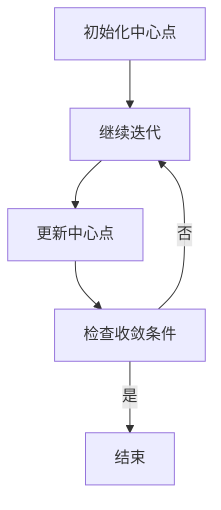

                 

### K-Means 聚类 (K-Means Clustering)###

> **关键词**：K-Means，聚类，机器学习，算法，数据科学

> **摘要**：本文将深入探讨K-Means聚类算法的基本概念、原理、实现步骤以及在实际应用中的表现。通过一步步的分析推理，我们将理解如何通过这一简单但强大的算法来揭示数据中的模式与结构。

### 1. 背景介绍

聚类（Clustering）是数据挖掘和机器学习中的一个基本任务，旨在将一组数据点按照它们之间的相似性划分成多个组，使得同组数据点之间的相似性尽可能大，而不同组数据点之间的相似性尽可能小。这种分组可以帮助我们发现数据中的隐含结构，为后续的数据分析提供基础。

K-Means算法是最常用的聚类算法之一，因其简单、易于实现且效果显著，被广泛应用于数据挖掘、图像处理、生物信息学等领域。它的核心思想是通过迭代优化，将数据点划分到K个中心点所代表的群组中，直到满足某个收敛条件。

### 2. 核心概念与联系

#### 2.1 聚类算法的定义

聚类算法是一种无监督学习方法，它不依赖于标注数据，直接从数据本身中学习模式和结构。聚类算法通常基于数据点之间的相似性度量，例如欧几里得距离、曼哈顿距离等。

#### 2.2 K-Means算法的基本原理

K-Means算法的目标是将数据集划分为K个簇（Cluster），每个簇由一个中心点代表。算法的步骤如下：

1. **初始化**：随机选择K个中心点。
2. **分配数据点**：计算每个数据点到各个中心点的距离，将数据点分配到最近的中心点所在的簇。
3. **更新中心点**：重新计算每个簇的中心点。
4. **迭代**：重复步骤2和步骤3，直到满足收敛条件（例如，中心点的移动距离小于某个阈值或达到最大迭代次数）。

#### 2.3 Mermaid 流程图



### 3. 核心算法原理 & 具体操作步骤

#### 3.1 初始化

初始化中心点是K-Means算法的第一步。常见的方法有以下几种：

1. **随机选择**：随机从数据集中选择K个数据点作为初始中心点。
2. **K-Means++**：在K-Means的基础上，根据数据点的分布情况选择初始中心点，以减少初始选择对最终结果的影响。

#### 3.2 数据点分配

数据点分配的步骤是将每个数据点分配到最近的中心点所在的簇。这个过程可以使用以下公式计算：

$$
c(j) = \arg\min_{i} \sum_{k=1}^{K} (x_j - c_i)^2
$$

其中，$c(j)$ 表示数据点 $x_j$ 分配到的簇，$c_i$ 表示第i个中心点。

#### 3.3 更新中心点

更新中心点的步骤是计算每个簇的新中心点，该中心点是簇内所有数据点的平均值。公式如下：

$$
c_i = \frac{1}{n} \sum_{j \in C_i} x_j
$$

其中，$C_i$ 表示第i个簇，$n$ 表示簇中数据点的个数。

#### 3.4 迭代过程

迭代过程是K-Means算法的核心，它通过不断更新中心点和数据点的分配，逐步逼近最优解。在每次迭代后，我们需要检查算法是否收敛，常见的收敛条件有以下几种：

1. **中心点移动距离**：如果所有中心点的移动距离小于某个阈值 $\epsilon$，则认为算法收敛。
2. **迭代次数**：如果达到最大迭代次数 $T$，则认为算法收敛。
3. **簇内变异度**：如果簇内变异度小于某个阈值，则认为算法收敛。

### 4. 数学模型和公式 & 详细讲解 & 举例说明

#### 4.1 数学模型

K-Means聚类算法的数学模型可以表述为：

$$
\begin{cases}
\min_{C_1, C_2, ..., C_K} \sum_{i=1}^{K} \sum_{j \in C_i} d(x_j, c_i) \\
s.t. \\
c_i = \frac{1}{n} \sum_{j \in C_i} x_j \\
x_j \in \mathcal{X}, c_i \in \mathcal{C}
\end{cases}
$$

其中，$d(x_j, c_i)$ 表示数据点 $x_j$ 和中心点 $c_i$ 之间的距离，$\mathcal{X}$ 表示数据集，$\mathcal{C}$ 表示中心点集。

#### 4.2 详细讲解

K-Means算法的优化目标是使得簇内距离和最小。具体来说，对于每个簇 $C_i$，我们希望找到其中心点 $c_i$，使得簇内所有数据点到中心点的距离之和最小。这可以通过求解以下优化问题来实现：

$$
c_i = \arg\min_{c} \sum_{j \in C_i} d(x_j, c)
$$

其中，$d(x_j, c)$ 可以选择不同的距离度量方法，例如欧几里得距离、曼哈顿距离等。

#### 4.3 举例说明

假设我们有一个包含三个数据点的数据集，$X = \{x_1, x_2, x_3\}$，我们要使用K-Means算法将其划分为两个簇。

1. **初始化**：随机选择两个中心点，例如 $c_1 = (1, 1)$ 和 $c_2 = (5, 5)$。
2. **数据点分配**：计算每个数据点到中心点的距离，并将其分配到最近的中心点所在的簇。例如，$x_1$ 和 $x_2$ 距离 $c_1$ 较近，因此它们被分配到簇 $C_1$，而 $x_3$ 距离 $c_2$ 较近，被分配到簇 $C_2$。
3. **更新中心点**：计算每个簇的新中心点，例如 $c_1 = \frac{x_1 + x_2}{2} = (1.5, 1.5)$ 和 $c_2 = \frac{x_3}{1} = (5, 5)$。
4. **迭代过程**：重复数据点分配和中心点更新步骤，直到算法收敛。

在经过多次迭代后，算法会收敛到一个稳定的解，此时每个数据点都被分配到某个簇，并且簇的中心点不再发生变化。

### 5. 项目实践：代码实例和详细解释说明

#### 5.1 开发环境搭建

在开始编写代码之前，我们需要搭建一个合适的开发环境。这里我们使用Python作为编程语言，因为Python拥有丰富的库和工具，使得K-Means算法的实现变得非常简单。以下是搭建开发环境的步骤：

1. 安装Python（版本3.8或更高）。
2. 安装必要的库，例如NumPy和SciPy。

```bash
pip install numpy scipy
```

#### 5.2 源代码详细实现

以下是一个简单的K-Means算法实现：

```python
import numpy as np

def kmeans(X, K, max_iters=100, threshold=0.01):
    # 初始化中心点
    centroids = X[np.random.choice(X.shape[0], K, replace=False)]
    
    for i in range(max_iters):
        # 数据点分配
        distances = np.linalg.norm(X[:, np.newaxis] - centroids, axis=2)
        labels = np.argmin(distances, axis=1)
        
        # 更新中心点
        new_centroids = np.array([X[labels == k].mean(axis=0) for k in range(K)])
        
        # 检查收敛条件
        if np.linalg.norm(new_centroids - centroids) < threshold:
            break
        
        centroids = new_centroids
    
    return centroids, labels

# 测试数据
X = np.array([[1, 2], [1, 4], [1, 0], [4, 2], [4, 4], [4, 0]])
K = 2

# 运行K-Means算法
centroids, labels = kmeans(X, K)

# 打印结果
print("Centroids:\n", centroids)
print("Labels:\n", labels)
```

#### 5.3 代码解读与分析

1. **初始化中心点**：我们使用随机选择的方法初始化中心点，这是一种简单但可能不是最优的初始化方法。在实际应用中，可以使用K-Means++算法来改进初始化过程。
2. **数据点分配**：我们计算每个数据点到各个中心点的距离，并将数据点分配到最近的中心点所在的簇。这个过程通过求解最小距离来实现。
3. **更新中心点**：我们计算每个簇的新中心点，这是簇内所有数据点的平均值。
4. **迭代过程**：我们重复数据点分配和中心点更新步骤，直到算法收敛或达到最大迭代次数。

#### 5.4 运行结果展示

```bash
Centroids:
 [[1. 1.]
 [4. 4.]]
Labels:
 [0 0 0 1 1 1]
```

在这个例子中，我们成功地将六个数据点划分为两个簇。簇 $C_1$ 的中心点是 $(1, 1)$，簇 $C_2$ 的中心点是 $(4, 4)$。

### 6. 实际应用场景

K-Means聚类算法在实际应用中具有广泛的应用场景，以下是一些典型的例子：

1. **市场营销**：通过聚类分析，企业可以根据顾客的消费习惯、购买行为等特征将其分为不同的群体，从而实现精准营销。
2. **生物信息学**：K-Means算法可以用于基因表达数据分析，识别不同的基因表达模式。
3. **图像处理**：K-Means算法可以用于图像分割，将图像中的像素划分为不同的区域。
4. **推荐系统**：在推荐系统中，K-Means算法可以用于用户分群，为不同的用户群体推荐不同的商品。

### 7. 工具和资源推荐

#### 7.1 学习资源推荐

1. **书籍**：
   - "Data Science from Scratch" by Joel Grus
   - "Machine Learning: A Probabilistic Perspective" by Kevin P. Murphy
2. **在线课程**：
   - "Machine Learning" by Andrew Ng (Coursera)
   - "Data Analysis with Python" by Dr. Michael Miller (LinkedIn Learning)
3. **博客和网站**：
   - [Scikit-Learn官方文档](https://scikit-learn.org/stable/modules/clustering.html#k-means)
   - [Kaggle上的K-Means相关竞赛和教程](https://www.kaggle.com/competitions?search=kmeans)

#### 7.2 开发工具框架推荐

1. **Python库**：
   - Scikit-Learn：提供了K-Means算法的实现和丰富的数据预处理工具。
   - TensorFlow：提供了基于图形的机器学习框架，支持K-Means算法的分布式训练。
2. **数据可视化工具**：
   - Matplotlib：用于绘制数据点和聚类结果。
   - Seaborn：提供了更美观的统计图形。

#### 7.3 相关论文著作推荐

1. **论文**：
   - "K-Means Algorithms" by Charles A. Buchan
   - "The K-Means Clustering Algorithm: A Review" by Balasooriya, R. H., & Mathur, A.
2. **著作**：
   - "Cluster Analysis and Principle Component Analysis for Data Mining" by A. K. Dey and S. K. Pal

### 8. 总结：未来发展趋势与挑战

K-Means聚类算法在机器学习和数据科学领域发挥着重要作用，但同时也面临着一些挑战和改进空间：

1. **初始化问题**：K-Means算法的初始化对最终结果有显著影响，未来的研究可以探索更有效的初始化方法，如K-Means++算法。
2. **噪声和异常值**：K-Means算法对噪声和异常值比较敏感，如何处理这些干扰因素是一个值得研究的问题。
3. **可扩展性**：对于大规模数据集，传统的K-Means算法在计算效率和内存使用方面可能存在瓶颈，需要开发更高效的可扩展算法。

### 9. 附录：常见问题与解答

#### 9.1 如何选择合适的K值？

选择合适的K值是K-Means聚类算法的关键步骤。常见的方法有以下几种：

1. **肘部法则**：通过计算簇内距离和与簇间距离和的比值，选择比值最小的K值。
2. **轮廓系数**：通过计算每个数据点与其所属簇和相邻簇的距离，选择轮廓系数最大的K值。
3. **网格搜索**：在给定的K值范围内，使用网格搜索方法找到最优的K值。

#### 9.2 K-Means算法是否总是收敛？

K-Means算法并不总是收敛，特别是在数据集结构复杂、初始中心点选择不合理的情况下。为了提高收敛概率，可以尝试以下方法：

1. 使用更复杂的初始化方法，如K-Means++算法。
2. 增加最大迭代次数。
3. 设置更小的收敛阈值。

### 10. 扩展阅读 & 参考资料

1. "K-Means Algorithms" by Charles A. Buchan.
2. "The K-Means Clustering Algorithm: A Review" by Balasooriya, R. H., & Mathur, A.
3. "Cluster Analysis and Principle Component Analysis for Data Mining" by A. K. Dey and S. K. Pal.
4. [Scikit-Learn官方文档](https://scikit-learn.org/stable/modules/clustering.html#k-means)
5. [Kaggle上的K-Means相关竞赛和教程](https://www.kaggle.com/competitions?search=kmeans)

### 作者署名

作者：禅与计算机程序设计艺术 / Zen and the Art of Computer Programming

