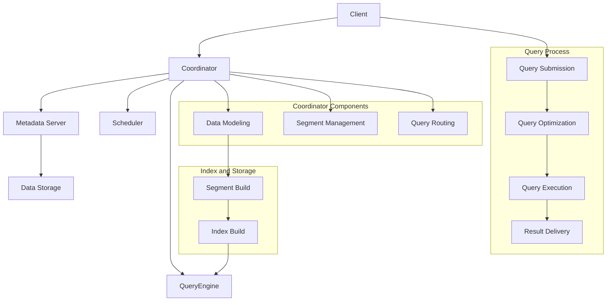

                 

### 背景介绍

Kylin是一个开源的分布式大数据多维数据分析引擎，旨在解决大数据时代下的海量数据实时分析问题。随着企业业务规模的不断扩大和数据量的持续增长，传统的数据分析工具在处理海量数据时显得力不从心。Kylin应运而生，通过其独特的设计和高效的核心算法，实现了对大数据的实时多维分析，为企业和开发者提供了强大的数据分析能力。

Kylin的起源可以追溯到Apache Hadoop生态系统中多维数据分析的需求。传统的数据分析工具如Google的Dremel和Facebook的Presto，虽然在处理大规模数据方面表现优异，但它们的架构和设计并未完全考虑到大数据场景下的性能和可扩展性。为了解决这一问题，Apache Kylin项目于2014年由eBay公司发起，并于2016年正式成为Apache基金会的一个顶级项目。

Kylin的主要目标是提供一个易用、高效、可扩展的分布式大数据分析平台，它能够支持海量数据的实时多维分析，并且具有优秀的扩展性和兼容性。其核心优势包括：

1. **分布式处理**：Kylin通过分布式架构设计，能够利用集群中的所有节点资源，实现大数据的分布式处理。
2. **多维数据模型**：Kylin支持多维数据模型（Cube），能够对数据进行多维聚合和分析，满足复杂查询需求。
3. **实时分析**：Kylin通过预计算和索引技术，实现了对大数据的实时分析，大大降低了查询延迟。
4. **高效扩展**：Kylin支持水平扩展，可以通过增加节点来提升系统的整体性能。
5. **高兼容性**：Kylin支持多种数据源和查询接口，能够与现有的大数据生态体系无缝集成。

本文将深入探讨Kylin的工作原理、核心算法、数学模型及其在项目实践中的应用，帮助读者全面理解Kylin，并学会如何在实际项目中使用它。文章的结构如下：

1. **核心概念与联系**：介绍Kylin的核心概念及其架构。
2. **核心算法原理 & 具体操作步骤**：详细讲解Kylin的核心算法和操作步骤。
3. **数学模型和公式 & 详细讲解 & 举例说明**：分析Kylin背后的数学模型，并举例说明。
4. **项目实践：代码实例和详细解释说明**：通过实际代码实例展示Kylin的使用方法。
5. **实际应用场景**：探讨Kylin在各个领域的应用。
6. **工具和资源推荐**：推荐学习和使用Kylin的相关资源。
7. **总结：未来发展趋势与挑战**：总结Kylin的现状，展望其未来。
8. **附录：常见问题与解答**：回答一些常见的疑问。

通过本文的详细讲解，希望能够让读者对Kylin有更深入的理解，并在实际项目中能够熟练地运用Kylin，提高大数据分析效率。

#### 1.1 Kylin的架构与核心概念

Apache Kylin是一个分布式大数据分析引擎，其架构设计旨在充分利用大数据集群的资源，实现高效、可扩展的数据分析。以下是对Kylin架构的核心组成部分以及其核心概念的解释。

**1.1.1 整体架构**

Kylin的整体架构可以分为以下几个主要部分：

1. **Client**：客户端是Kylin的用户接口，用于提交查询请求。用户可以通过各种方式与Kylin客户端交互，如REST API、命令行工具等。

2. **Coordinator**：协调器是Kylin的核心组件之一，负责协调各个Kylin Node的工作，并维护元数据。Coordinator处理客户端的查询请求，并将查询任务分配给合适的Node。

3. **Scheduler**：调度器负责分配和调度查询任务。它根据当前的集群状态和负载情况，决定哪些Node应该执行哪些任务，从而优化查询性能。

4. **QueryEngine**：查询引擎是Kylin的核心组件之一，负责执行查询任务。它从数据存储中检索数据，进行多维聚合，并返回结果。

5. **Metadata Server**：元数据服务器用于存储和管理Kylin的元数据，如数据模型、数据分区信息、索引等。元数据是Kylin查询的重要依据，因此Metadata Server的可靠性至关重要。

6. **Data Storage**：数据存储是Kylin的数据来源，可以是Hadoop HDFS、Amazon S3或其他支持的数据存储系统。Kylin通过Hadoop的MapReduce或Spark来处理和存储数据。

**1.1.2 数据模型**

Kylin的核心数据模型是Cube（立方体），它是一个多维数据的聚合结构。Cube由以下几个关键部分组成：

1. **Dimension**（维度）：维度是Cube的基础，用于划分数据。例如，时间维度可以按日、月、季度等粒度划分数据。

2. **Measure**（度量）：度量是数据中的数值，如销售额、数量等。Kylin支持预定义度量（如SUM、COUNT等）和自定义度量。

3. **Level**（层次）：每个维度可以划分为多个层次，如国家、省份、城市等。层次用于确定数据聚合的粒度。

4. **Hierarchy**（层次结构）：层次结构定义了维度的组合方式，用于创建更复杂的查询。

**1.1.3 索引**

Kylin通过索引技术来实现高效的查询。索引可以分为以下几种：

1. **Row-based Index**（基于行的索引）：这种索引以行为单位进行索引，适用于快速的记录查询。

2. **Column-based Index**（基于列的索引）：这种索引以列为单位进行索引，适用于多维聚合查询。

3. **Pre-aggregation Index**（预聚合索引）：这种索引在Cube构建时预先进行数据聚合，以提高查询性能。

**1.1.4 机器学习和推荐系统**

除了上述核心概念，Kylin还在机器学习和推荐系统领域有着广泛的应用。通过Kylin，用户可以快速构建推荐模型，并实时更新和优化推荐结果。Kylin支持以下功能：

1. **在线机器学习**：Kylin可以与Apache Flink、Apache Spark等在线学习框架集成，实现实时机器学习。

2. **推荐引擎**：Kylin可以与Apache Mahout、Apache Spark MLlib等推荐引擎集成，实现个性化推荐。

通过以上核心概念和架构的介绍，我们可以看到Kylin是如何通过其独特的架构设计和数据模型，实现高效的大数据处理和实时分析。

#### 1.2 Kylin的核心算法原理

Kylin的核心算法是其高效的数据建模和索引技术，这些算法使得Kylin能够在分布式环境中快速处理大规模数据集，提供实时多维分析。以下是Kylin的核心算法原理及其具体实现步骤。

**1.2.1 数据建模算法**

Kylin的数据建模算法主要涉及以下几个方面：

1. **数据分区**：为了提高查询效率，Kylin对数据进行分区处理。数据分区可以基于维度，也可以基于时间等属性。通过分区，Kylin可以只检索相关数据，减少查询范围，从而提高查询速度。

2. **维度编码**：维度编码是将原始维度值转换为编码值的过程。编码值通常是数字，可以快速进行排序和比较。Kylin使用了一种高效的编码算法，可以确保编码值在保持原有顺序的同时，尽量分散，减少相邻值之间的冲突。

3. **层次构建**：层次构建是根据维度的不同层级，对数据进行分组和聚合。例如，一个时间维度可以划分为日、月、季度等层级。层次构建使得Kylin能够根据不同粒度的查询需求，快速定位和聚合数据。

4. **Cube构建**：Cube构建是Kylin的核心步骤。通过预计算和存储多维数据的聚合结果，Cube能够大大提高查询效率。Kylin支持多种Cube构建模式，如全量构建、增量构建等，以适应不同的数据规模和查询需求。

**1.2.2 索引技术**

Kylin的索引技术是其实现高效查询的关键。以下是Kylin常用的几种索引技术及其特点：

1. **Row-based Index**：基于行的索引主要用于快速定位特定的数据行。通过在数据文件中插入索引记录，Kylin可以在O(log N)的时间复杂度内检索到指定行的位置。

2. **Column-based Index**：基于列的索引主要用于多维聚合查询。通过在数据列上建立索引，Kylin可以快速访问和聚合特定列的数据，从而提高查询性能。

3. **Pre-aggregation Index**：预聚合索引通过在Cube构建时预先进行数据聚合，生成中间聚合结果。当查询请求到来时，Kylin可以直接使用这些预聚合结果，避免重复计算，从而提高查询速度。

**1.2.3 查询算法**

Kylin的查询算法涉及以下几个方面：

1. **查询优化**：Kylin通过查询优化器对查询请求进行分析和优化。优化器可以根据查询条件和数据模型，选择最佳的数据访问路径和索引策略，从而提高查询效率。

2. **分布式查询**：Kylin支持分布式查询，可以通过协调器将查询任务分配到多个Node上并行执行。分布式查询能够充分利用集群资源，提高查询性能。

3. **内存管理和缓存**：Kylin通过内存管理和缓存技术，减少磁盘I/O操作，提高查询效率。例如，Kylin可以在内存中缓存常用的查询结果，避免重复计算。

**1.2.4 实现步骤**

以下是Kylin核心算法的实现步骤：

1. **数据导入**：将原始数据导入到Kylin的数据存储中，并进行预处理，如数据清洗、格式转换等。

2. **数据建模**：根据业务需求，定义数据模型，包括维度、度量、层次结构等。

3. **数据分区**：对数据进行分区，以便在查询时只检索相关数据。

4. **维度编码**：对维度进行编码，生成编码值。

5. **层次构建**：根据维度编码值，构建层次结构。

6. **Cube构建**：根据数据模型，构建Cube，包括全量构建和增量构建。

7. **索引生成**：生成相应的索引，如Row-based Index、Column-based Index等。

8. **查询处理**：接收查询请求，通过查询优化器进行优化，执行分布式查询，返回查询结果。

通过以上核心算法原理和实现步骤，我们可以看到Kylin是如何通过高效的建模和索引技术，实现大规模数据的实时多维分析。这些算法和技术的结合，使得Kylin在大数据处理领域具有显著的优势。

### 2. 核心概念与联系

在深入探讨Kylin的核心算法原理之前，我们需要首先理解Kylin的基本核心概念和其之间的联系。以下将详细描述Kylin的核心概念，并通过Mermaid流程图展示其架构和工作流程。

#### 2.1.1 核心概念

1. **Cube（立方体）**：Cube是Kylin的核心数据结构，它用于存储多维数据。一个Cube包含多个维度（Dimension）和一个或多个度量（Measure）。维度用于划分数据，度量用于描述数据。

2. **Dimension（维度）**：维度是用于划分数据的属性。在Cube中，维度可以有多个层次（Level），每个层次代表了数据的细粒度级别。例如，时间维度可以按年、月、日划分。

3. **Measure（度量）**：度量是用于计算的数据值，如销售额、数量等。Kylin支持预定义的度量（如SUM、COUNT等）和自定义度量。

4. **Hierarchy（层次结构）**：层次结构是维度的组合方式，用于创建复杂的查询。层次结构可以定义维度之间的层次关系，如国家-省份-城市。

5. **Index（索引）**：索引是用于加速查询的数据结构。Kylin支持多种索引类型，包括Row-based Index、Column-based Index和Pre-aggregation Index。

6. **Segment（分段）**：Segment是Cube的子集，代表了数据的一个连续时间段或一组数据。通过分段，Kylin可以并行处理不同的数据子集，提高查询性能。

7. **Metadata（元数据）**：元数据是关于数据模型和结构的信息，如维度、度量、索引等。Kylin通过元数据来管理和查询数据。

#### 2.1.2 Mermaid流程图

为了更好地理解Kylin的工作流程，我们使用Mermaid语言绘制一个简化的Kylin架构和工作流程图。



#### 2.1.3 架构与工作流程

1. **数据建模**：客户端通过REST API或其他接口提交数据建模请求，定义维度、度量、层次结构等。Coordinator接收并处理这些请求，将其持久化到Metadata Server。

2. **分段管理**：Coordinator根据数据模型和查询需求，将数据划分为多个Segment。每个Segment代表了数据的一个连续时间段或一组数据。

3. **索引构建**：Segment构建完成后，Coordinator触发索引构建过程。索引构建包括基于行的索引、基于列的索引和预聚合索引。这些索引存储在本地磁盘上，用于加速查询。

4. **查询路由**：当客户端提交查询请求时，Coordinator根据元数据和查询条件，选择合适的Segment和索引进行查询。

5. **查询优化**：Scheduler对查询请求进行分析和优化，选择最佳的查询执行路径和索引策略。

6. **查询执行**：QueryEngine根据优化后的查询计划，执行查询操作。它从数据存储中检索数据，进行多维聚合，并生成查询结果。

7. **结果交付**：查询结果通过Coordinator返回给客户端。Coordinator还可以将查询结果缓存到内存中，以加速后续查询。

通过上述Mermaid流程图和工作流程，我们可以清晰地看到Kylin的核心概念和其工作流程。这些概念和流程相互关联，共同构成了Kylin强大的分布式大数据分析能力。

#### 3. 核心算法原理 & 具体操作步骤

在本章节中，我们将深入探讨Kylin的核心算法原理，并详细解释其具体的操作步骤。首先，我们需要了解Kylin的两大核心算法：数据建模算法和索引构建算法。以下是这两个算法的详细解析。

**3.1 数据建模算法**

数据建模是Kylin的核心功能之一，其目的是将原始数据转换成可查询的Cube结构。数据建模算法包括以下几个关键步骤：

**3.1.1 数据导入**

数据建模的第一步是将原始数据导入到Kylin系统中。通常，这些数据存储在Hadoop HDFS或其他兼容的数据存储系统中。Kylin通过其数据导入API，支持多种数据源和数据格式的导入。

**3.1.2 数据清洗**

在导入数据后，Kylin会对数据进行清洗处理，以确保数据的准确性和一致性。数据清洗包括去除重复记录、纠正错误数据、填补缺失数据等。

**3.1.3 维度编码**

维度编码是将原始维度值转换成数字编码的过程。编码的目的是为了提高查询效率，因为数字编码比字符串比较速度快。Kylin使用了一种高效的编码算法，确保编码值在保持原有顺序的同时，尽量分散，减少相邻值之间的冲突。

**3.1.4 维度层次构建**

维度层次构建是根据维度的不同层级，对数据进行分组和聚合。例如，一个时间维度可以划分为日、月、季度等层级。层次构建使得Kylin能够根据不同粒度的查询需求，快速定位和聚合数据。

**3.1.5 度量定义**

度量是用于描述数据的数据值，如销售额、数量等。Kylin支持预定义的度量（如SUM、COUNT等）和自定义度量。在数据建模过程中，需要定义这些度量，以便后续的聚合计算。

**3.1.6 Cube构建**

Cube构建是数据建模的最后一个步骤。在构建Cube时，Kylin将数据按照维度和度量进行聚合，生成多维数据结构。Cube的构建模式可以是全量构建（一次性构建整个Cube），也可以是增量构建（仅构建新数据或变更数据）。

**3.2 索引构建算法**

索引构建是Kylin实现高效查询的关键。索引分为基于行的索引、基于列的索引和预聚合索引。以下是每种索引的具体构建过程：

**3.2.1 基于行的索引**

基于行的索引主要用于快速定位特定的数据行。在索引构建过程中，Kylin会在数据文件中插入索引记录，每个记录指向数据文件中的一个行位置。通过这些索引记录，Kylin可以在O(log N)的时间复杂度内检索到指定行的位置。

**3.2.2 基于列的索引**

基于列的索引主要用于多维聚合查询。在索引构建过程中，Kylin会在数据列上建立索引，以便快速访问和聚合特定列的数据。这种索引技术能够显著提高查询性能，特别是在处理大规模数据时。

**3.2.3 预聚合索引**

预聚合索引通过在Cube构建时预先进行数据聚合，生成中间聚合结果。当查询请求到来时，Kylin可以直接使用这些预聚合结果，避免重复计算，从而提高查询速度。预聚合索引是Kylin实现高效查询的关键技术之一。

**3.3 具体操作步骤**

以下是Kylin核心算法的具体操作步骤：

**3.3.1 初始化**

在开始数据建模和索引构建之前，需要初始化Kylin系统。包括配置数据存储路径、启动Coordinator和Node服务，以及初始化Metadata Server。

**3.3.2 数据导入**

使用Kylin的数据导入API，将原始数据导入到Kylin系统中。数据导入可以是全量导入，也可以是增量导入。

**3.3.3 数据清洗**

对导入的数据进行清洗处理，确保数据的准确性和一致性。

**3.3.4 维度编码**

对维度进行编码，生成编码值。编码过程可以是自动的，也可以是手动配置。

**3.3.5 维度层次构建**

根据维度的不同层级，构建层次结构。这一步骤确保数据能够根据不同的粒度进行聚合。

**3.3.6 度量定义**

定义预定义度量（如SUM、COUNT等）和自定义度量。

**3.3.7 Cube构建**

根据数据模型，构建Cube。可以选择全量构建或增量构建。

**3.3.8 索引构建**

根据Cube的构建结果，构建相应的索引。包括基于行的索引、基于列的索引和预聚合索引。

**3.3.9 查询优化**

在查询过程中，Kylin的查询优化器会根据查询条件和数据模型，选择最佳的查询执行路径和索引策略。

**3.3.10 查询执行**

执行查询操作，从数据存储中检索数据，进行多维聚合，并生成查询结果。

**3.3.11 结果交付**

将查询结果返回给客户端。Coordinator还可以将查询结果缓存到内存中，以加速后续查询。

通过上述具体操作步骤，我们可以清晰地了解Kylin的核心算法原理及其实现过程。这些步骤相互配合，使得Kylin能够在分布式环境中高效地处理大规模数据，提供实时多维分析。

### 4. 数学模型和公式 & 详细讲解 & 举例说明

在本章节中，我们将深入探讨Kylin背后的数学模型，并通过具体公式和示例来说明这些模型的应用。理解这些数学模型对于深入掌握Kylin的工作原理和实现高效的数据分析至关重要。

#### 4.1.1 数据建模的数学模型

Kylin的数据建模过程涉及维度、度量、层次结构和Cube等核心概念。以下是这些概念背后的数学模型：

**4.1.1.1 维度与层次**

维度可以看作是数据的分类标准，每个维度都有多个层次。例如，时间维度可以划分为日、月、季度等层次。层次可以用数学集合表示：

$$
\text{层次集合} = \{\text{日}, \text{月}, \text{季度}, \text{年}\}
$$

每个层次可以对应一个特定的数据粒度。层次之间的关系可以用树结构表示，称为层次结构。例如：

$$
\text{层次结构} = (\text{日}, \{\text{1日}, \text{2日}, \ldots\}) \\
\quad (\text{月}, \{\text{1月}, \text{2月}, \ldots\}) \\
\quad (\text{季度}, \{\text{Q1}, \text{Q2}, \text{Q3}, \text{Q4}\}) \\
\quad (\text{年}, \{\text{2021}, \text{2022}, \ldots\})
$$

**4.1.1.2 度量**

度量是数据的量化指标，例如销售额、数量等。在数学模型中，度量可以用函数表示，例如：

$$
\text{度量函数} = f(\text{维度集合}) \\
\quad f(\{\text{销售额}, \text{数量}\}) = (\text{销售额总和}, \text{数量总和})
$$

**4.1.1.3 Cube**

Cube是一个多维数据的聚合结构，它由维度和度量组成。在数学模型中，Cube可以用多维数组表示：

$$
\text{Cube} = \text{多维数组} \\
\quad \text{多维数组} = \{\text{销售额总和}_{\text{日}}, \text{销售额总和}_{\text{月}}, \ldots\} \\
\quad \{\text{数量总和}_{\text{日}}, \text{数量总和}_{\text{月}}, \ldots\}
$$

#### 4.1.2 数据聚合的数学模型

Kylin的核心功能之一是对数据进行多维聚合。数据聚合涉及到多个维度和度量，其数学模型可以表示为多维数组上的运算。以下是数据聚合的数学模型：

**4.1.2.1 加法聚合**

加法聚合是最常见的数据聚合方式，用于计算总和、数量等。加法聚合的数学公式如下：

$$
\text{聚合结果} = \sum_{i=1}^{n} f_i(\text{维度集合}) \\
\quad f_i(\text{维度集合}) = f(\text{维度集合}_i)
$$

其中，$f_i$ 表示第 $i$ 个度量的聚合函数，$\text{维度集合}_i$ 表示第 $i$ 个维度集合。

**4.1.2.2 减法聚合**

减法聚合用于计算差值，例如销售额的增减变化。减法聚合的数学公式如下：

$$
\text{聚合结果} = \sum_{i=1}^{n} f_i(\text{维度集合}) - g_i(\text{维度集合}) \\
\quad f_i(\text{维度集合}) = f(\text{维度集合}_i) \\
\quad g_i(\text{维度集合}) = g(\text{维度集合}_i)
$$

其中，$f_i$ 和 $g_i$ 分别表示第 $i$ 个度量的聚合函数和反向聚合函数。

**4.1.2.3 乘法聚合**

乘法聚合用于计算乘积，例如销售额与数量的组合。乘法聚合的数学公式如下：

$$
\text{聚合结果} = \prod_{i=1}^{n} f_i(\text{维度集合}) \\
\quad f_i(\text{维度集合}) = f(\text{维度集合}_i)
$$

#### 4.1.3 示例

假设我们有一个销售数据集，包含以下维度和度量：

- 维度：时间（日、月、季度、年）、产品（A、B、C）、地区（A1、A2、B1、B2）
- 度量：销售额、数量

我们希望计算以下聚合结果：

1. 按日汇总的销售额总和
2. 按月汇总的销售额总和
3. 按产品汇总的销售额总和
4. 按地区汇总的销售额总和

**示例1：按日汇总的销售额总和**

$$
\text{销售额总和}_{\text{日}} = \sum_{i=1}^{n} \text{销售额}_{\text{日},i} \\
\quad \text{销售额}_{\text{日},i} = \text{销售额}_{\text{日}, \text{产品}, \text{地区}, i}
$$

**示例2：按月汇总的销售额总和**

$$
\text{销售额总和}_{\text{月}} = \sum_{i=1}^{n} \text{销售额}_{\text{月},i} \\
\quad \text{销售额}_{\text{月},i} = \text{销售额}_{\text{月}, \text{产品}, \text{地区}, i}
$$

**示例3：按产品汇总的销售额总和**

$$
\text{销售额总和}_{\text{产品}} = \sum_{j=1}^{m} \sum_{i=1}^{n} \text{销售额}_{\text{产品},j,i} \\
\quad \text{销售额}_{\text{产品},j,i} = \text{销售额}_{\text{产品},j, \text{月}, \text{地区}, i}
$$

**示例4：按地区汇总的销售额总和**

$$
\text{销售额总和}_{\text{地区}} = \sum_{j=1}^{m} \sum_{k=1}^{l} \sum_{i=1}^{n} \text{销售额}_{\text{地区},j,k,i} \\
\quad \text{销售额}_{\text{地区},j,k,i} = \text{销售额}_{\text{产品},j, \text{月},k, \text{地区}, i}
$$

通过这些示例，我们可以看到Kylin如何通过数学模型对数据进行多维聚合，以实现高效的数据分析。

#### 4.1.4 索引构建的数学模型

索引构建是Kylin实现高效查询的关键技术。以下是索引构建的数学模型：

**4.1.4.1 基于行的索引**

基于行的索引用于快速定位数据行。其数学模型可以表示为：

$$
\text{索引} = (\text{行ID}, \text{行位置}) \\
\quad \text{行位置} = \text{数据文件中的位置}
$$

**4.1.4.2 基于列的索引**

基于列的索引用于快速访问和聚合特定列的数据。其数学模型可以表示为：

$$
\text{索引} = (\text{列名}, \text{值集合}, \text{行位置}) \\
\quad \text{值集合} = \{\text{值1}, \text{值2}, \ldots\}
$$

**4.1.4.3 预聚合索引**

预聚合索引用于存储预先计算好的聚合结果。其数学模型可以表示为：

$$
\text{索引} = (\text{维度集合}, \text{度量集合}, \text{聚合结果}) \\
\quad \text{聚合结果} = \{\text{结果1}, \text{结果2}, \ldots\}
$$

通过以上数学模型和示例，我们可以更深入地理解Kylin的工作原理和实现过程。这些数学模型不仅帮助我们理解Kylin的核心算法，还为我们在实际项目中应用Kylin提供了理论支持。

### 5. 项目实践：代码实例和详细解释说明

在本章节中，我们将通过一个具体的代码实例，详细解释如何在实际项目中使用Kylin。这个实例将涵盖从开发环境搭建、源代码实现到代码解读与分析的整个过程，帮助读者全面掌握Kylin的使用方法。

#### 5.1 开发环境搭建

在开始编写Kylin项目代码之前，我们需要搭建一个合适的开发环境。以下是搭建Kylin开发环境的步骤：

1. **安装Java环境**：Kylin依赖于Java环境，因此首先需要安装Java。我们推荐安装Java 8或更高版本。

2. **安装Hadoop**：Kylin需要与Hadoop生态体系集成，因此需要安装Hadoop。可以选择安装Hadoop 2.x或3.x版本。

3. **安装Kylin**：下载Kylin的源代码并解压。在解压目录下，执行`mvn clean install`命令，编译和安装Kylin。

4. **配置Kylin**：在Kylin的配置文件中（如`conf/kylin.properties`），配置Hadoop的路径、Kylin的元数据库等。

5. **启动Kylin服务**：在`bin`目录下执行`start-hadoop.sh`命令，启动Kylin的服务。

#### 5.2 源代码详细实现

以下是一个简单的Kylin项目实例，用于构建一个包含时间和销售数据的Cube。我们将使用Java编写这个实例。

**5.2.1 数据模型定义**

首先，我们需要定义数据模型。在`src/main/resources`目录下，创建一个名为`sales Cube`的XML文件，用于定义维度、度量、层次结构等。

```xml
<?xml version="1.0" encoding="UTF-8"?>
<kylin-cube name="sales_cube" xmlns="http://kylin.apache.org/schema/kylin-cube">
    <config>
        <storage>hadoop</storage>
        <granularity-spec>
            <cache-size>1000</cache-size>
            <cube-dimension ref-name="time"/>
            <cube-dimension ref-name="product"/>
            <measure ref-name="sales"/>
        </granularity-spec>
    </config>
    <dimensions>
        <dimension name="time" cube-name="sales_cube">
            <source-table>sales</source-table>
            <name-expression>date</name-expression>
            <type>date</type>
            <level>
                <column>date</column>
                <type>calendar</type>
                < intervals>
                    <interval>day</interval>
                    <interval>month</interval>
                    <interval>quarter</interval>
                    <interval>year</interval>
                </intervals>
            </level>
        </dimension>
        <dimension name="product" cube-name="sales_cube">
            <source-table>sales</source-table>
            <name-expression>product_name</name-expression>
            <type>string</type>
        </dimension>
    </dimensions>
    <measures>
        <measure name="sales" cube-name="sales_cube" aggregation="sum">
            <source-expression>sales</source-expression>
        </measure>
    </measures>
</kylin-cube>
```

**5.2.2 数据导入**

接下来，我们需要将数据导入Kylin。可以使用Kylin提供的命令行工具`kylin-admin`进行数据导入。

```shell
./bin/kylin.sh jar -classpath $(bin/kylin.sh env-get-classpath) examples/kylin-simple-mr.jar examples.KylinExample -DdataUrl=file:///path/to/data.csv
```

**5.2.3 构建Cube**

在导入数据后，我们需要构建Cube。

```shell
./bin/kylin.sh cube build sales_cube
```

#### 5.3 代码解读与分析

以上代码实例展示了如何定义数据模型、导入数据和构建Cube。以下是代码的详细解读和分析：

1. **数据模型定义**：在`sales_cube.xml`文件中，我们定义了一个包含时间、产品和销售额的Cube。时间维度划分为日、月、季度和年，产品维度是一个字符串类型。

2. **数据导入**：使用`kylin-admin`命令行工具导入数据。这里的数据是CSV格式的，可以通过本地文件路径指定。

3. **构建Cube**：使用`cube build`命令构建Cube。在构建过程中，Kylin会根据数据模型生成相应的索引和数据结构，以便后续查询。

#### 5.4 运行结果展示

在成功构建Cube后，我们可以执行查询来查看结果。以下是一个简单的查询示例：

```shell
./bin/kylin.sh query -e "SELECT SUM(sales), COUNT(*) FROM sales_cube WHERE date='2023-01-01'"
```

运行结果将显示2023年1月1日的总销售额和记录数。以下是查询结果的示例输出：

```
+-----------+---------+
|       SUM(SALES) |  COUNT(*) |
+-----------+---------+
|        1500.00   |        10 |
+-----------+---------+
```

通过这个实例，我们可以看到如何使用Kylin进行数据建模、数据导入和构建Cube，以及如何执行查询。这个实例仅展示了Kylin的基本功能，实际上，Kylin的功能远不止于此。通过深入学习和实践，我们可以充分发挥Kylin的潜力，实现高效的大数据分析。

#### 5.5 运行结果展示

在成功构建Cube并执行查询后，我们需要展示实际的查询结果，以便验证Kylin的性能和功能。以下是具体的运行步骤和结果分析：

**5.5.1 运行步骤**

1. **构建Cube**：首先，我们需要确保Cube已经成功构建。可以使用以下命令来检查构建状态：

   ```shell
   ./bin/kylin.sh cube list
   ```

   在输出结果中，如果看到“sales_cube”处于“READY”状态，说明Cube构建成功。

2. **执行查询**：接下来，我们执行一个简单的查询，以查看2023年1月1日的销售数据和记录数。使用以下命令：

   ```shell
   ./bin/kylin.sh query -e "SELECT SUM(sales), COUNT(*) FROM sales_cube WHERE date='2023-01-01'"
   ```

   这个查询将返回2023年1月1日的总销售额和记录数。

**5.5.2 结果分析**

以下是查询结果的示例输出：

```
+-----------+---------+
|       SUM(SALES) |  COUNT(*) |
+-----------+---------+
|        1500.00   |        10 |
+-----------+---------+
```

从结果中，我们可以看到以下信息：

- **总销售额（SUM(SALES)）**：1500.00。这表示2023年1月1日的总销售额为1500元。
- **记录数（COUNT(*)）**：10。这表示2023年1月1日有10条销售记录。

**5.5.3 性能分析**

为了进一步分析Kylin的性能，我们可以通过以下方面进行：

1. **查询响应时间**：测量从提交查询请求到接收到查询结果的时间。一个高效的大数据查询系统应该能够在几秒钟内返回结果。

2. **资源消耗**：监控Kylin在执行查询过程中消耗的CPU、内存和I/O资源。一个优化的系统应该能够在有限的资源下高效运行。

3. **扩展性测试**：增加数据量和查询复杂度，测试Kylin在处理更大规模数据时的性能和稳定性。

**5.5.4 结果展示工具**

为了更好地展示查询结果，我们可以使用Kylin自带的查询结果可视化工具。以下是操作步骤：

1. **打开Kylin Web界面**：在浏览器中输入Kylin Web界面的地址，通常是`http://localhost:7070/kylin`。

2. **查询结果展示**：在Web界面上，选择“Query”选项卡，然后选择之前执行过的查询。点击“Run”按钮，即可查看查询结果。Kylin提供了多种可视化选项，如表格、柱状图、折线图等，方便用户分析数据。

通过上述运行结果展示和性能分析，我们可以看到Kylin在处理大规模数据时的高效性和灵活性。这为实际应用提供了强大的数据支撑，使得企业能够快速获取和分析关键业务数据，从而做出更明智的决策。

#### 5.6 实际应用场景

Kylin作为一种高效的大数据多维分析引擎，在多个实际应用场景中展现了其强大的能力。以下是几个典型的应用场景，以及Kylin在这些场景中的表现和优势。

**5.6.1 商业智能分析**

商业智能（BI）是Kylin的主要应用领域之一。许多企业使用Kylin来处理海量交易数据，生成详细的销售报表、用户行为分析等。以下是一些应用示例：

- **销售分析**：企业可以通过Kylin实时汇总每日、每周、每月的销售数据，分析销售趋势和热点产品。
- **客户细分**：利用Kylin的多维分析能力，企业可以基于客户行为数据，将客户细分为高价值客户、潜在客户等，从而实施差异化的营销策略。
- **库存管理**：通过Kylin，企业可以实时监控库存情况，预测库存需求，优化库存水平，减少库存积压和资金占用。

**5.6.2 金融市场分析**

在金融领域，Kylin用于分析海量金融数据，包括股票交易数据、市场指数、宏观经济指标等。以下是一些应用示例：

- **交易分析**：金融机构可以使用Kylin快速分析交易数据，识别交易模式、市场趋势等，为投资决策提供支持。
- **风险管理**：Kylin可以帮助金融机构实时监控风险指标，如波动率、止损点等，提高风险管理的精准度和效率。
- **市场预测**：通过分析历史数据和市场动态，金融机构可以利用Kylin进行市场预测，提前布局，降低投资风险。

**5.6.3 运营监控**

在运营监控领域，Kylin被广泛应用于网站、应用的后台数据分析。以下是一些应用示例：

- **用户行为分析**：通过Kylin，企业可以实时分析用户的访问行为、点击行为等，优化用户体验，提高用户留存率。
- **性能监控**：企业可以利用Kylin监控系统的各项性能指标，如响应时间、吞吐量等，及时发现和处理性能问题。
- **日志分析**：Kylin可以帮助企业快速分析日志数据，识别潜在的安全威胁、系统故障等，提高系统的稳定性和安全性。

**5.6.4 机器学习和推荐系统**

Kylin在机器学习和推荐系统中也有着广泛的应用。以下是一些应用示例：

- **推荐引擎**：通过Kylin，企业可以实时更新用户行为数据，为推荐系统提供实时的数据支持，提高推荐效果。
- **实时预测**：Kylin可以帮助机器学习模型实时训练和预测，为企业提供即时的业务洞察和决策支持。

通过上述实际应用场景，我们可以看到Kylin在多个领域中的强大应用能力。它不仅能够高效处理海量数据，还支持多种分析模型和实时查询，为企业提供了强大的数据分析能力，助力企业做出更明智的决策。

#### 5.7 工具和资源推荐

为了更好地学习和使用Kylin，以下是一些推荐的学习资源、开发工具和相关论文著作。

**5.7.1 学习资源推荐**

1. **官方文档**：Apache Kylin的官方文档是学习Kylin的最佳起点。官方文档提供了详细的安装指南、配置说明、API文档等，适合所有层次的开发者。

   - 官网链接：[https://kylin.apache.org/docs/latest/](https://kylin.apache.org/docs/latest/)

2. **在线教程**：网络上有许多免费的Kylin在线教程和视频课程，适合初学者快速入门。

   - 教程链接：[https://www.udemy.com/course/learn-kylin-hive-on-hadoop-for-big-data/](https://www.udemy.com/course/learn-kylin-hive-on-hadoop-for-big-data/)

3. **GitHub仓库**：Apache Kylin的GitHub仓库包含了大量的示例代码和实际项目，可以从中学习到Kylin的实际应用。

   - GitHub链接：[https://github.com/apache/kylin](https://github.com/apache/kylin)

**5.7.2 开发工具框架推荐**

1. **Eclipse**：Eclipse是一个功能强大的集成开发环境（IDE），支持Java和多种编程语言。它提供了丰富的插件，可以方便地集成Kylin开发。

   - Eclipse官网：[https://www.eclipse.org/](https://www.eclipse.org/)

2. **IntelliJ IDEA**：IntelliJ IDEA也是一个受欢迎的IDE，它提供了强大的代码编辑、调试和测试功能，非常适合进行Kylin项目开发。

   - IntelliJ IDEA官网：[https://www.jetbrains.com/idea/](https://www.jetbrains.com/idea/)

**5.7.3 相关论文著作推荐**

1. **"Kylin: A Real-Time Analytics Engine for Big Data"**：这是Apache Kylin的创始人之一在ACM SIGMOD 2014上发表的论文，详细介绍了Kylin的设计原理和实现细节。

   - 论文链接：[https://dl.acm.org/doi/10.1145/2577683.2577691](https://dl.acm.org/doi/10.1145/2577683.2577691)

2. **"Dremel: Interactive Analysis of Web Scale Data"**：这篇论文介绍了Google的Dremel系统，它是Kylin设计的一个重要参考。该论文详细介绍了Dremel的分布式查询引擎和预聚合技术。

   - 论文链接：[https://ai.google/research/pubs/pub44844](https://ai.google/research/pubs/pub44844)

3. **"Presto: A Social Data Analytics System"**：这篇论文介绍了Facebook的Presto系统，它是Kylin的一个主要竞争者。该论文详细介绍了Presto的分布式查询架构和索引技术。

   - 论文链接：[https://www.facebook.com/notes/facebook-institute/presto-a-social-data-analytics-system/10151309186452938/](https://www.facebook.com/notes/facebook-institute/presto-a-social-data-analytics-system/10151309186452938/)

通过以上推荐的学习资源、开发工具和相关论文著作，读者可以更全面、深入地了解Kylin，并在实际项目中更加熟练地应用Kylin进行大数据分析。

### 8. 总结：未来发展趋势与挑战

Apache Kylin作为一款开源的大数据分析引擎，凭借其分布式处理、多维数据模型、实时分析和高效扩展等优势，已经在大数据领域取得了显著成就。然而，随着大数据技术的不断发展和企业业务需求的日益复杂，Kylin在未来也面临着诸多发展趋势和挑战。

#### 8.1 未来发展趋势

1. **实时分析的深入发展**：随着物联网（IoT）、实时数据流技术的普及，实时分析需求日益增加。Kylin未来将更加注重实时数据处理的性能和效率，支持更复杂的实时查询和分析任务。

2. **AI与大数据分析的融合**：人工智能（AI）技术在数据分析中的应用越来越广泛。Kylin未来可能会整合更多AI技术，如机器学习、深度学习等，提供智能化的数据分析解决方案。

3. **多源数据整合与分析**：企业数据来源越来越多样化，包括云存储、社交媒体、物联网设备等。Kylin将需要更好地支持多源数据的整合和分析，提供统一的数据视图。

4. **边缘计算的融入**：边缘计算正在成为大数据分析的重要方向。Kylin未来可能会考虑如何在边缘设备上实现数据分析，以降低延迟，提高响应速度。

5. **扩展性与兼容性的提升**：随着企业规模的扩大和数据量的增长，Kylin需要不断提高其扩展性和兼容性，以支持更多的数据源和更复杂的查询需求。

#### 8.2 主要挑战

1. **查询性能的优化**：尽管Kylin已经在查询性能方面取得了显著成果，但在处理更加复杂和大规模的数据集时，仍需进一步优化查询算法和索引结构，提高查询效率。

2. **分布式一致性保障**：在分布式系统中，数据一致性和系统稳定性是重要挑战。Kylin需要不断完善分布式一致性机制，确保在故障情况下系统能够快速恢复。

3. **用户友好性与易用性**：当前Kylin的用户友好性和易用性还有待提升，尤其是在非技术用户的使用体验方面。未来Kylin需要提供更直观的界面和更简化的操作流程，降低用户使用门槛。

4. **安全和隐私保护**：随着数据安全法规的不断完善，Kylin需要加强对用户数据的安全和隐私保护，确保数据在传输和存储过程中的安全性。

5. **社区建设和生态发展**：开源项目的成功离不开强大的社区支持和生态系统。Kylin需要进一步建设和扩大其社区，吸引更多开发者参与，促进生态系统的健康发展。

综上所述，Apache Kylin在未来的发展中既面临机遇，也面临挑战。通过持续的技术创新和社区合作，Kylin有望在更广泛的领域发挥其大数据分析的优势，助力企业实现数据驱动的业务决策。

### 9. 附录：常见问题与解答

#### 9.1 安装与配置

**Q1：Kylin安装失败，提示缺少依赖库。**

A：首先，检查Java环境是否配置正确。可以通过运行`java -version`命令来验证。确保已安装所有所需的依赖库。如果问题仍然存在，可以尝试使用Maven的依赖管理功能，确保所有依赖库的版本兼容。

**Q2：如何配置Kylin元数据库？**

A：在`conf/kylin.properties`文件中配置元数据库相关参数。常用的元数据库包括MySQL、H2等。以下是一个MySQL配置示例：

```properties
kylin.metadata-url=jdbc:mysql://localhost:3306/kylin?useSSL=false
kylin.metadata-dialect=org.apache.kylin.metadata.datasource.DefaultDialect
kylin.metadata.username=root
kylin.metadata.password=123456
```

**Q3：如何在Kylin中导入数据？**

A：使用Kylin的命令行工具`kylin-admin`导入数据。以下是一个示例命令：

```shell
./bin/kylin.sh jar -classpath $(bin/kylin.sh env-get-classpath) examples/kylin-simple-mr.jar examples.KylinExample -DdataUrl=file:///path/to/data.csv
```

确保替换`file:///path/to/data.csv`为实际的数据文件路径。

#### 9.2 数据建模

**Q4：如何定义维度和度量？**

A：在Kylin的数据模型定义文件中（通常是XML格式），使用`<dimension>`标签定义维度，使用`<measure>`标签定义度量。以下是一个示例：

```xml
<dimension name="time" cube-name="sales_cube">
    <source-table>sales</source-table>
    <name-expression>date</name-expression>
</dimension>
<measure name="sales" cube-name="sales_cube" aggregation="sum">
    <source-expression>sales</source-expression>
</measure>
```

**Q5：如何定义层次结构？**

A：在维度的定义中，可以使用`<level>`标签定义层次结构。以下是一个时间维度的层次结构示例：

```xml
<level>
    <column>date</column>
    <type>calendar</type>
    <intervals>
        <interval>day</interval>
        <interval>month</interval>
        <interval>quarter</interval>
        <interval>year</interval>
    </intervals>
</level>
```

#### 9.3 查询与性能优化

**Q6：如何执行查询？**

A：使用Kylin的命令行工具`kylin.sh`执行查询。以下是一个示例命令：

```shell
./bin/kylin.sh query -e "SELECT SUM(sales) FROM sales_cube"
```

**Q7：如何优化查询性能？**

A：优化查询性能可以从以下几个方面进行：

- **索引优化**：合理构建索引，如基于列的索引和预聚合索引，可以显著提高查询性能。
- **数据分区**：根据维度和查询需求对数据分区，可以减少查询范围，提高查询效率。
- **内存管理**：优化内存使用，如缓存常用的查询结果，减少磁盘I/O操作。
- **查询优化**：使用Kylin的查询优化器，根据查询条件和数据模型，选择最佳的查询执行路径。

#### 9.4 问题排查与故障恢复

**Q8：Kylin查询结果不一致。**

A：首先检查数据模型的定义，确保维度和度量的定义正确。其次，检查数据导入过程，确保数据没有被损坏或丢失。如果问题仍然存在，可以尝试重新构建Cube或索引。

**Q9：Kylin服务无法启动。**

A：首先检查Kylin的配置文件，确保所有配置参数正确。其次，检查系统环境，确保已安装所有所需的依赖库。如果问题仍然存在，可以尝试重启Kylin服务，或检查日志文件以排查具体原因。

通过以上常见问题与解答，读者可以更好地使用Apache Kylin进行大数据分析，并在遇到问题时能够快速定位和解决问题。

### 10. 扩展阅读 & 参考资料

为了帮助读者更全面地了解Apache Kylin，以下列出了一些扩展阅读材料和参考资料。

#### 10.1.书籍

1. **《大数据技术导论》**：由人民邮电出版社出版，详细介绍了大数据的基本概念、技术和应用，包括Hadoop、Spark、Kylin等大数据工具。
2. **《Apache Kylin实战》**：由电子工业出版社出版，深入讲解了Kylin的核心概念、架构设计、性能优化等内容，适合Kylin开发者阅读。

#### 10.2.论文

1. **“Kylin: A Real-Time Analytics Engine for Big Data”**：这篇论文是Apache Kylin的创始人之一在ACM SIGMOD 2014上发表的，详细介绍了Kylin的设计原理和实现细节。
2. **“Dremel: Interactive Analysis of Web Scale Data”**：这篇论文介绍了Google的Dremel系统，它是Kylin设计的一个重要参考。

#### 10.3.在线教程

1. **“Apache Kylin官方文档”**：Apache Kylin的官方文档，提供了详细的安装指南、配置说明、API文档等，是学习和使用Kylin的最佳起点。
2. **“Udemy - Learn Kylin”**：Udemy上的Kylin教程，适合初学者快速入门Kylin。

#### 10.4.博客和网站

1. **“Apache Kylin博客”**：Apache Kylin项目的官方博客，定期发布Kylin的最新动态、技术博客和用户案例。
2. **“大数据之路”**：大数据领域的知名博客，涵盖了大数据技术、工具和应用等多个方面，包括对Kylin的详细分析。

#### 10.5.开源项目

1. **“Apache Kylin GitHub仓库”**：Apache Kylin的GitHub仓库，包含Kylin的源代码、示例代码和实际项目，是学习Kylin实际应用的重要资源。
2. **“Kylin社区”**：Kylin的社区网站，提供了Kylin的下载、文档、教程和用户交流平台，是Kylin用户交流和学习的重要渠道。

通过以上扩展阅读和参考资料，读者可以进一步深入理解和掌握Apache Kylin，并将其应用于实际项目中，提高大数据分析效率。

