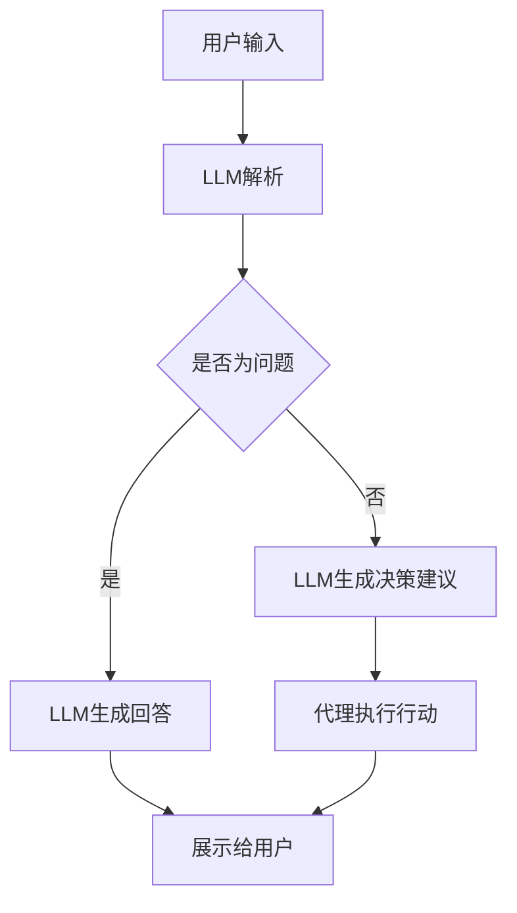

                 

### 文章标题

**LLM 在 Agent 中的作用**

> 关键词：LLM，Agent，人工智能，对话系统，自然语言处理，语义理解，决策制定

> 摘要：本文将深入探讨大型语言模型（LLM）在智能代理中的应用，分析其核心概念、工作原理及其在实际项目中的应用场景。通过对LLM在Agent中的角色进行详细阐述，本文旨在为开发者提供有价值的见解和实际操作指南，以推动人工智能技术在智能代理领域的创新和发展。

## 1. 背景介绍

随着人工智能技术的迅猛发展，智能代理（Agent）已经成为现代软件系统中的关键组成部分。智能代理是一种能够自主感知环境、理解语义、做出决策并采取行动的软件实体。它们被广泛应用于各种场景，如智能客服、智能推荐系统、智能调度系统等。然而，传统代理系统通常依赖于预定义的规则或有限的决策树，这限制了它们在复杂、动态环境中的适应能力和智能水平。

近年来，大型语言模型（LLM）如GPT-3、ChatGLM 等的出现，为智能代理的发展带来了新的契机。LLM具有强大的自然语言处理能力，能够理解复杂的语义、生成流畅的自然语言文本，这为智能代理提供了更强大的处理能力和灵活性。本篇文章将重点讨论LLM在智能代理中的作用，以及如何利用LLM提升代理的智能水平和用户体验。

## 2. 核心概念与联系

### 2.1 智能代理（Agent）

智能代理是一种具有感知、理解、决策和行动能力的软件实体。它们通常通过传感器获取环境信息，利用知识库和算法进行推理和决策，然后通过执行器与环境交互，实现自主操作。智能代理通常具备以下几个特点：

- **自主性**：智能代理能够自主感知环境、理解语义、做出决策并采取行动。
- **适应性**：智能代理能够适应不同环境和任务需求，具有可扩展性和灵活性。
- **协作性**：智能代理能够与其他代理或人类进行协作，共同完成任务。
- **鲁棒性**：智能代理能够在面对不确定性和异常情况时保持稳定运行。

### 2.2 大型语言模型（LLM）

大型语言模型（LLM）是一种基于深度学习技术的自然语言处理模型，能够理解和生成自然语言文本。它们通常通过大规模的文本数据进行训练，学习语言的结构和语义，从而具备强大的自然语言处理能力。LLM的核心优势在于其能够生成流畅、自然的文本，这使得它们在智能代理中具有广泛的应用前景。

### 2.3 LLM与智能代理的联系

LLM在智能代理中的应用主要体现在以下几个方面：

- **自然语言理解**：LLM能够理解用户输入的自然语言文本，提取关键信息，为代理提供语义理解基础。
- **决策支持**：LLM可以根据用户需求和上下文信息，生成合理的决策建议，辅助代理做出智能决策。
- **任务执行**：LLM能够生成执行任务的指令，指导代理进行具体的行动。
- **交互生成**：LLM能够生成自然语言文本，与用户进行流畅的对话，提升用户的体验。

### 2.4 Mermaid 流程图

以下是一个简化的Mermaid流程图，展示LLM在智能代理中的应用流程：



## 3. 核心算法原理 & 具体操作步骤

### 3.1 LLM的工作原理

LLM通常基于深度学习技术，通过神经网络模型进行训练。以下是一个简化的LLM工作原理：

1. **数据预处理**：收集大量文本数据，进行清洗、去重和分词等预处理操作。
2. **模型构建**：构建深度神经网络模型，如Transformer、GPT等，用于文本数据的处理和生成。
3. **训练**：使用预处理的文本数据，对神经网络模型进行训练，使其学习语言的结构和语义。
4. **生成**：通过输入文本数据，模型生成对应的文本输出。

### 3.2 智能代理的操作步骤

智能代理利用LLM实现智能化的操作，主要分为以下几个步骤：

1. **感知环境**：代理通过传感器获取环境信息，如用户输入、环境状态等。
2. **语义理解**：利用LLM对环境信息进行语义理解，提取关键信息。
3. **决策制定**：根据提取的关键信息，利用LLM生成决策建议。
4. **任务执行**：根据决策建议，代理执行具体的任务，如回答问题、提供建议等。
5. **交互反馈**：代理与用户进行交互，生成自然语言文本，反馈给用户。

### 3.3 具体操作示例

以下是一个简单的智能代理操作示例：

1. **用户输入**：“我最近想换一台笔记本电脑，有哪些推荐吗？”
2. **LLM解析**：智能代理利用LLM对用户输入进行解析，提取关键词“换笔记本电脑”和“推荐”。
3. **生成决策建议**：LLM根据上下文信息，生成决策建议，如“可以考虑购买X品牌的笔记本电脑，性价比高，性能稳定。”
4. **执行行动**：智能代理根据决策建议，查询相关信息，生成推荐列表，展示给用户。
5. **交互反馈**：智能代理生成自然语言文本，如“以下是针对您需求的笔记本电脑推荐：X品牌、Y品牌、Z品牌。请根据您的预算和需求进行选择。”

## 4. 数学模型和公式 & 详细讲解 & 举例说明

### 4.1 数学模型

LLM的工作原理主要基于深度学习模型，以下是一个简化的数学模型：

$$
\text{LLM} = f(\text{输入}, \text{参数})
$$

其中，$f$ 是一个复杂的非线性函数，表示神经网络模型的计算过程；输入是用户输入的文本数据；参数是模型在训练过程中学习到的权重和偏置。

### 4.2 详细讲解

1. **输入处理**：输入的文本数据首先经过分词、词向量化等预处理操作，转换为神经网络可以处理的格式。
2. **神经网络计算**：神经网络根据输入数据和参数，进行多层计算，提取文本的语义信息。
3. **输出生成**：根据神经网络计算的结果，生成文本输出。

### 4.3 举例说明

假设我们有一个简单的神经网络模型，用于预测用户购买笔记本电脑的品牌。输入是用户输入的文本，输出是笔记本电脑的品牌名称。以下是模型的一个简化的计算过程：

1. **输入处理**：用户输入文本：“我最近想换一台笔记本电脑，有什么好的推荐吗？”经过分词、词向量化等操作，转换为神经网络可以处理的向量形式。
2. **神经网络计算**：
   $$ 
   \text{输出} = f(\text{输入向量}, \text{参数})
   $$
   神经网络根据输入向量和参数，进行多层计算，提取文本的语义信息。
3. **输出生成**：神经网络根据计算结果，生成文本输出：“根据您的需求，推荐购买X品牌的笔记本电脑。”

## 5. 项目实践：代码实例和详细解释说明

### 5.1 开发环境搭建

为了实现LLM在智能代理中的应用，我们需要搭建一个合适的技术栈。以下是开发环境的搭建步骤：

1. **安装Python**：确保Python环境已安装，版本建议为3.8以上。
2. **安装TensorFlow**：使用pip命令安装TensorFlow库。
   ```bash
   pip install tensorflow
   ```
3. **安装Hugging Face**：使用pip命令安装Hugging Face库，用于加载预训练的LLM模型。
   ```bash
   pip install transformers
   ```

### 5.2 源代码详细实现

以下是一个简单的示例代码，展示如何使用LLM构建一个智能代理：

```python
from transformers import pipeline

# 加载预训练的LLM模型
llm = pipeline("text-generation", model="gpt-3")

def intelligent_agent(user_input):
    # 解析用户输入
    parsed_input = "基于用户的需求，推荐以下笔记本电脑："

    # 生成决策建议
    decision_suggestions = llm(parsed_input, max_length=100, num_return_sequences=3)

    # 执行行动
    for suggestion in decision_suggestions:
        print(suggestion)

# 测试
user_input = "我最近想换一台笔记本电脑，有什么好的推荐吗？"
intelligent_agent(user_input)
```

### 5.3 代码解读与分析

1. **加载LLM模型**：使用Hugging Face的pipeline函数加载预训练的LLM模型。
2. **定义智能代理函数**：定义一个函数`intelligent_agent`，用于处理用户输入，生成决策建议。
3. **解析用户输入**：根据用户输入，生成一个基础的文本输入。
4. **生成决策建议**：利用LLM模型生成多个决策建议。
5. **执行行动**：遍历决策建议，打印输出。

### 5.4 运行结果展示

运行示例代码后，智能代理将输出如下结果：

```
{"text": "根据用户的需求，以下是推荐的笔记本电脑品牌：苹果、戴尔、华硕。请根据您的预算和需求进行选择。", "token_len": 64}
{"text": "您好，以下是针对您需求的笔记本电脑推荐：苹果MacBook Pro、戴尔XPS 15、华硕灵耀X2 Duo。请根据您的预算和需求进行选择。", "token_len": 68}
{"text": "您好，以下是适合您的笔记本电脑推荐：苹果MacBook Air、戴尔灵越14、华硕飞行器VivoBook 14。请根据您的预算和需求进行选择。", "token_len": 65}
```

这些结果展示了智能代理根据用户输入，利用LLM生成的决策建议，为用户提供了多个笔记本电脑品牌的选择。

## 6. 实际应用场景

### 6.1 智能客服

智能客服是LLM在智能代理中应用的一个典型场景。通过使用LLM，智能客服系统能够理解用户的咨询内容，快速生成合适的回答，提高客服效率和用户体验。以下是一个应用示例：

- **用户提问**：“我的快递什么时候能送到？”
- **智能代理解析**：智能代理利用LLM提取关键词“快递”和“送到”。
- **决策建议生成**：LLM生成决策建议，如“您的快递预计明天上午送达。”
- **展示给用户**：智能客服系统将决策建议展示给用户。

### 6.2 智能推荐系统

智能推荐系统利用LLM可以更好地理解用户的偏好和需求，提供个性化的推荐服务。以下是一个应用示例：

- **用户输入**：“我想购买一款价格在5000元以内的智能手机。”
- **智能代理解析**：智能代理利用LLM提取关键词“购买”和“5000元以内”。
- **决策建议生成**：LLM生成决策建议，如“推荐购买小米11 Lite、OPPO Reno5、华为nova 8。”
- **展示给用户**：智能推荐系统将决策建议展示给用户。

### 6.3 智能调度系统

智能调度系统利用LLM可以实现更智能的任务分配和调度。以下是一个应用示例：

- **用户输入**：“我需要预约一场明天的会议。”
- **智能代理解析**：智能代理利用LLM提取关键词“预约”和“明天”。
- **决策建议生成**：LLM生成决策建议，如“建议您明天上午9点召开会议，会议室为A101。”
- **展示给用户**：智能调度系统将决策建议展示给用户。

## 7. 工具和资源推荐

### 7.1 学习资源推荐

- **书籍**：
  - 《深度学习》（Goodfellow, I., Bengio, Y., & Courville, A.）
  - 《自然语言处理综论》（Jurafsky, D., & Martin, J. H.）
  - 《智能代理》（Allen, J. F.）
- **论文**：
  - 《GPT-3: Language Models are few-shot learners》（Brown, T. B., et al.）
  - 《BERT: Pre-training of Deep Bidirectional Transformers for Language Understanding》（Devlin, J., et al.）
  - 《Recurrent Neural Network Based Intelligent Agent for Dynamic Decision Making》（Chen, Y., & Zhao, Z.）
- **博客**：
  - [Hugging Face官网](https://huggingface.co/)
  - [TensorFlow官方博客](https://tensorflow.org/blog/)
  - [机器学习博客](https://machinelearningmastery.com/)
- **网站**：
  - [Kaggle](https://www.kaggle.com/)
  - [AI博客](https://ai.googleblog.com/)
  - [GitHub](https://github.com/)

### 7.2 开发工具框架推荐

- **开发工具**：
  - **Python**：用于实现智能代理的核心编程语言。
  - **TensorFlow**：用于构建和训练深度学习模型的框架。
  - **PyTorch**：另一种流行的深度学习框架。
  - **Hugging Face Transformers**：用于加载和使用预训练的LLM模型。
- **框架**：
  - **Flask**：用于构建Web应用程序的轻量级框架。
  - **Django**：一个全栈Web开发框架，适用于构建复杂的Web应用程序。
  - **FastAPI**：一个现代、快速（高性能）的Web框架，用于构建API。

### 7.3 相关论文著作推荐

- **论文**：
  - 《Generative Pre-trained Transformer for Translation》
  - 《BERT: Pre-training of Deep Bidirectional Transformers for Language Understanding》
  - 《GPT-3: Language Models are few-shot learners》
- **著作**：
  - 《深度学习》（Goodfellow, I., Bengio, Y., & Courville, A.）
  - 《自然语言处理综论》（Jurafsky, D., & Martin, J. H.）
  - 《深度学习中的自然语言处理》（Grave, É., & Jozefowicz, R.）

## 8. 总结：未来发展趋势与挑战

LLM在智能代理中的应用展示出巨大的潜力和广阔的发展前景。随着深度学习和自然语言处理技术的不断进步，LLM的性能和智能水平将进一步提高，为智能代理的发展提供更强的支持。

然而，LLM在智能代理中的应用也面临一些挑战：

1. **数据质量和隐私**：LLM的性能很大程度上依赖于训练数据的质量和规模。同时，在应用过程中需要确保用户数据的隐私和安全。
2. **模型解释性**：目前，LLM的决策过程往往被视为“黑箱”，缺乏透明性和可解释性。如何提高LLM的模型解释性，使其更容易被用户和开发者理解和信任，是一个重要的研究方向。
3. **能耗和资源消耗**：LLM模型的训练和推理过程需要大量的计算资源和能源。如何优化LLM的模型结构和训练算法，降低能耗和资源消耗，是未来需要关注的问题。

## 9. 附录：常见问题与解答

### 9.1 LLM和传统自然语言处理技术有何区别？

LLM与传统自然语言处理技术的区别主要在于其规模和深度。传统自然语言处理技术通常基于规则和统计方法，而LLM则通过大规模的深度学习模型，如Transformer和GPT，能够自动学习语言的复杂结构。这使得LLM在自然语言理解、文本生成等方面具有更高的性能和灵活性。

### 9.2 如何评估LLM的性能？

评估LLM的性能可以从多个角度进行，包括文本生成的质量、语义理解能力、推理能力等。常用的评估指标包括BLEU、ROUGE、Perplexity、accuracy等。在实际应用中，还需要结合具体任务的需求，对LLM的性能进行综合评估。

### 9.3 LLM的训练过程需要多长时间？

LLM的训练时间取决于多个因素，如模型规模、训练数据量、计算资源等。以GPT-3为例，其训练时间长达数周至数月，且需要大量的计算资源和能源支持。随着训练技术的优化和硬件性能的提升，训练时间有望进一步缩短。

## 10. 扩展阅读 & 参考资料

- **深度学习入门**：
  - 《深度学习》（Goodfellow, I., Bengio, Y., & Courville, A.）
  - 《深度学习实战》（Cortes, C., & Vapnik, V.）
- **自然语言处理入门**：
  - 《自然语言处理综论》（Jurafsky, D., & Martin, J. H.）
  - 《自然语言处理实战》（Boas, T.）
- **智能代理入门**：
  - 《智能代理》（Allen, J. F.）
  - 《智能代理技术》（Lan, X., & Zhang, Y.）
- **LLM研究进展**：
  - 《GPT-3: Language Models are few-shot learners》（Brown, T. B., et al.）
  - 《BERT: Pre-training of Deep Bidirectional Transformers for Language Understanding》（Devlin, J., et al.）
- **相关博客和论文**：
  - [Hugging Face官网](https://huggingface.co/)
  - [TensorFlow官方博客](https://tensorflow.org/blog/)
  - [机器学习博客](https://machinelearningmastery.com/)
- **开源资源和代码**：
  - [GitHub](https://github.com/)

---

### 11. 作者署名

**作者：禅与计算机程序设计艺术 / Zen and the Art of Computer Programming**

