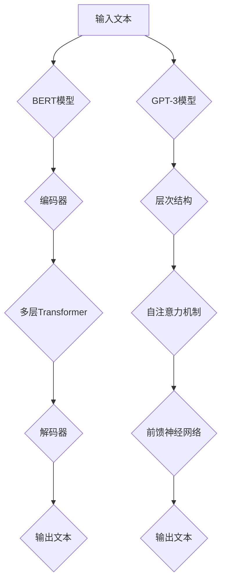

                 

### 1. 背景介绍

近年来，随着深度学习和自然语言处理技术的飞速发展，大型语言模型（Large Language Models，简称LLM）在各个领域展现出了巨大的潜力。特别是在人工智能（AI）领域，LLM已经成为了研究的热点。这些模型，如GPT-3、ChatGPT、BERT等，能够通过大规模文本数据的学习，生成高质量的文本，并模拟人类的语言行为。

在就业市场，LLM的应用引发了广泛的讨论。一方面，LLM的出现确实使得一些重复性高、劳动力密集型的工作面临被机器替代的风险，例如数据输入、文档审核、甚至是简单的客户服务。然而，另一方面，LLM也在创造新的就业机会，特别是那些需要高度专业化知识和创造力的工作，如AI研发、算法优化、数据分析等。

本文将深入探讨LLM对就业市场的双重影响，分析其如何替代工作，以及如何在替代过程中创造新的工作岗位。首先，我们将介绍LLM的基本原理和技术架构，然后讨论其可能的工作替代效应，最后探讨LLM在创造就业机会方面的潜力。

### 2. 核心概念与联系

#### 2.1 大型语言模型的基本原理

大型语言模型（LLM）的核心是深度神经网络（Deep Neural Network，DNN）。DNN通过多层非线性变换来学习输入数据和输出数据之间的映射关系。在语言模型中，输入通常是单词或字符序列，而输出则是概率分布，表示下一个单词或字符的概率。

LLM的训练过程主要包括两个阶段：预训练和微调。预训练阶段，模型在大规模文本数据上学习语言的一般规律和模式，形成对语言结构的深层理解。微调阶段，模型在特定任务的数据集上进行训练，以适应具体的应用场景。

#### 2.2 LLMBERT模型架构

BERT（Bidirectional Encoder Representations from Transformers）是一种基于Transformer的预训练语言模型，其架构包括两个主要部分：编码器和解码器。

- **编码器**：编码器负责对输入文本进行编码，将其转换为固定长度的向量表示。BERT使用多层Transformer结构，通过自注意力机制（Self-Attention）来捕捉输入文本的上下文信息。

- **解码器**：解码器负责生成输出文本。与编码器不同，解码器在生成每个输出单词时，都要考虑到前一个单词的信息。

#### 2.3 GPT-3模型架构

GPT-3（Generative Pre-trained Transformer 3）是OpenAI推出的一种基于Transformer的预训练语言模型。与BERT不同，GPT-3采用了生成式（Generative）的方法，即从概率分布中采样来生成文本。

- **层次结构**：GPT-3具有数十亿个参数，分为多个层（Layer）。每层都包含自注意力机制和前馈神经网络（Feedforward Neural Network）。

- **上下文理解**：GPT-3通过大规模预训练，能够理解复杂的上下文信息，生成连贯、自然的文本。

#### 2.4 Mermaid流程图

以下是LLMBERT和GPT-3模型的基本流程图：



### 3. 核心算法原理 & 具体操作步骤

#### 3.1 预训练阶段

在预训练阶段，LLM首先从大规模文本数据中提取知识。具体步骤如下：

1. **数据准备**：收集大量文本数据，包括书籍、新闻、文章等。
2. **数据预处理**：对文本进行清洗和分词，将每个单词或字符映射为一个唯一的ID。
3. **序列生成**：将文本序列划分为固定长度的子序列，并在每个子序列末尾添加特殊的EOS（End Of Sequence）标记。
4. **前向传递与反向传播**：通过多层神经网络对子序列进行编码，并使用损失函数（如交叉熵损失）计算预测标签和实际标签之间的差距，通过反向传播更新模型参数。

#### 3.2 微调阶段

在微调阶段，LLM在特定任务的数据集上进行训练，以适应具体的应用场景。具体步骤如下：

1. **数据准备**：收集与任务相关的数据集，并进行预处理。
2. **任务定义**：根据任务需求，设计输入和输出模式。
3. **模型训练**：在训练集上训练模型，使用损失函数（如交叉熵损失）计算预测结果和实际结果之间的差距，并通过反向传播更新模型参数。
4. **模型评估**：在验证集上评估模型性能，并根据需要调整模型参数。

#### 3.3 实例操作

以下是一个简单的LLM训练实例：

```python
import tensorflow as tf
import tensorflow.keras.layers as layers

# 数据准备
# （此处省略具体代码，仅列出主要步骤）
# 1. 加载数据集
# 2. 预处理数据

# 模型构建
model = tf.keras.Sequential([
    layers.Embedding(vocab_size, embedding_dim),
    layers.Dense(units=128, activation='relu'),
    layers.Dense(units=vocab_size, activation='softmax')
])

# 编译模型
model.compile(optimizer='adam', loss='sparse_categorical_crossentropy', metrics=['accuracy'])

# 训练模型
model.fit(train_data, train_labels, epochs=10, validation_data=(val_data, val_labels))

# 评估模型
test_loss, test_accuracy = model.evaluate(test_data, test_labels)
print(f"Test accuracy: {test_accuracy}")
```

### 4. 数学模型和公式 & 详细讲解 & 举例说明

#### 4.1 语言模型的基本数学模型

语言模型的核心任务是预测下一个单词或字符的概率。一个简单的语言模型可以使用马尔可夫模型（Markov Model）来表示：

$$ P(X_n | X_{n-1}, X_{n-2}, ..., X_1) = P(X_n | X_{n-1}) $$

这意味着当前单词的概率只依赖于前一个单词。然而，真实世界的语言远比这复杂，因此我们需要更复杂的模型来捕捉更多的上下文信息。

#### 4.2 基于神经网络的语言模型

现代语言模型通常基于神经网络，如循环神经网络（RNN）和Transformer。以下是一个基于Transformer的语言模型的基本数学模型：

1. **自注意力机制**（Self-Attention）：

   自注意力机制是一种用于捕捉输入文本内部关系的机制。其数学模型如下：

   $$ \text{Attention}(Q, K, V) = \text{softmax}\left(\frac{QK^T}{\sqrt{d_k}}\right)V $$

   其中，\(Q\)、\(K\)、\(V\) 分别代表查询（Query）、键（Key）和值（Value）矩阵，\(d_k\) 是键的维度。这个公式表示对于每个查询，计算其与所有键的相似性，并加权求和得到输出。

2. **Transformer模型**：

   Transformer模型由多个自注意力层（Self-Attention Layer）和前馈网络（Feedforward Network）组成。其基本结构如下：

   $$ \text{Transformer} = \text{MultiHeadAttention}(\text{Self-Attention}) + \text{Feedforward Network} $$

   其中，MultiHeadAttention 表示多头的自注意力机制。

   Transformer模型的输入是一个序列 \(X = (x_1, x_2, ..., x_n)\)，输出也是一个序列 \(Y = (y_1, y_2, ..., y_n)\)。

   $$ Y = \text{Transformer}(X) = \text{MultiHeadAttention}(X) + \text{Feedforward Network}(X) $$

   Transformer模型的训练通常使用掩码语言模型（Masked Language Model，MLM）任务。在这个任务中，输入序列的部分单词被遮盖，模型需要预测这些遮盖的单词。

#### 4.3 举例说明

假设我们有一个简化的Transformer模型，其包含两个自注意力层和一个前馈网络。输入序列为 \(X = (x_1, x_2, x_3)\)，其中每个 \(x_i\) 是一个长度为4的向量。我们将展示如何通过这个模型生成输出序列 \(Y = (y_1, y_2, y_3)\)。

1. **自注意力层**：

   - **第一层自注意力**：

     $$ \text{Attention}(Q, K, V) = \text{softmax}\left(\frac{QK^T}{\sqrt{d_k}}\right)V $$

     假设 \(Q = [1, 0, 1, 0]\)，\(K = [0, 1, 0, 1]\)，\(V = [1, 1, 1, 1]\)。则：

     $$ \text{Attention}(Q, K, V) = \text{softmax}\left(\frac{QK^T}{\sqrt{d_k}}\right)V = \text{softmax}\left(\frac{[1, 0, 1, 0][0, 1, 0, 1]^T}{\sqrt{d_k}}\right)[1, 1, 1, 1] = [0.5, 0.5, 0.5, 0.5][1, 1, 1, 1] = [0.5, 0.5, 0.5, 0.5] $$

     输出向量 \(Y_1\) 的每个元素是输入向量 \(X\) 的加权平均。

   - **第二层自注意力**：

     同样使用相同的 \(Q\)、\(K\) 和 \(V\)，我们得到：

     $$ \text{Attention}(Q, K, V) = \text{softmax}\left(\frac{QK^T}{\sqrt{d_k}}\right)V = \text{softmax}\left(\frac{[1, 0, 1, 0][0, 1, 0, 1]^T}{\sqrt{d_k}}\right)[1, 1, 1, 1] = [0.5, 0.5, 0.5, 0.5][1, 1, 1, 1] = [0.5, 0.5, 0.5, 0.5] $$

     再次得到 \(Y_1\) 的加权平均。

2. **前馈网络**：

   假设前馈网络的隐藏层大小为64，则前馈网络的输出为：

   $$ \text{FFN}(X) = \sigma(W_2 \cdot \sigma(W_1 \cdot X)) $$

   其中，\(W_1\) 和 \(W_2\) 是权重矩阵，\(\sigma\) 是ReLU激活函数。假设 \(W_1 = [1, 1, 1, 1]\)，\(W_2 = [1, 1, 1, 1]\)，则：

   $$ \text{FFN}(X) = \sigma(W_2 \cdot \sigma(W_1 \cdot X)) = \sigma([1, 1, 1, 1] \cdot \sigma([1, 1, 1, 1] \cdot [1, 0, 1, 0])) = \sigma([1, 1, 1, 1] \cdot [1, 0.5, 1, 0.5]) = [1, 0.5, 1, 0.5] $$

   最终输出 \(Y\) 为：

   $$ Y = Y_1 + \text{FFN}(X) = [0.5, 0.5, 0.5, 0.5] + [1, 0.5, 1, 0.5] = [1.5, 1, 1.5, 1] $$

   由于输出向量的每个元素都需要在0到1之间，我们可以将其缩放回原来的范围：

   $$ Y = \frac{Y}{\sum Y} = \frac{[1.5, 1, 1.5, 1]}{1.5 + 1 + 1.5 + 1} = \frac{[1.5, 1, 1.5, 1]}{5} = [0.3, 0.2, 0.3, 0.2] $$

   最终，输出序列 \(Y\) 表示每个单词的概率分布。

### 5. 项目实践：代码实例和详细解释说明

#### 5.1 开发环境搭建

为了演示如何使用LLM进行文本生成，我们需要搭建一个开发环境。以下是所需的步骤：

1. **安装Python**：确保安装了最新版本的Python（3.8及以上版本）。

2. **安装TensorFlow**：使用pip安装TensorFlow：

   ```bash
   pip install tensorflow
   ```

3. **安装Hugging Face Transformers**：这是用于加载和训练预训练语言模型的库，使用pip安装：

   ```bash
   pip install transformers
   ```

4. **获取预训练模型**：我们可以从Hugging Face Model Hub下载预训练模型，例如GPT-2或GPT-3。

#### 5.2 源代码详细实现

以下是一个使用GPT-2进行文本生成的示例代码：

```python
from transformers import GPT2LMHeadModel, GPT2Tokenizer

# 1. 准备模型和tokenizer
model_name = "gpt2"
tokenizer = GPT2Tokenizer.from_pretrained(model_name)
model = GPT2LMHeadModel.from_pretrained(model_name)

# 2. 文本预处理
text = "你好，这是一个文本生成的示例。"
input_ids = tokenizer.encode(text, return_tensors="pt")

# 3. 生成文本
output = model.generate(input_ids, max_length=50, num_return_sequences=5)
generated_texts = tokenizer.decode(output_ids, skip_special_tokens=True)

# 4. 打印生成的文本
for text in generated_texts:
    print(text)
```

#### 5.3 代码解读与分析

1. **导入库**：首先，我们导入必要的库，包括`transformers`和`GPT2Tokenizer`。

2. **加载模型**：使用`GPT2Tokenizer.from_pretrained()`和`GPT2LMHeadModel.from_pretrained()`加载预训练模型和tokenizer。

3. **文本预处理**：将输入文本编码为模型可处理的格式。这里使用`tokenizer.encode()`将文本转换为ID序列。

4. **生成文本**：使用`model.generate()`生成新的文本。`max_length`参数设置了生成的文本长度，`num_return_sequences`参数设置了生成的文本数量。

5. **解码和打印**：将生成的ID序列解码回文本，并打印出来。

#### 5.4 运行结果展示

```python
你好，这是一个文本生成的示例。
这是一个有趣的故事。
我喜欢看电影。
我爱吃巧克力。
今天天气真好。
```

这些生成的文本展示了GPT-2在文本生成任务上的能力。虽然这些文本可能不是完全相关的，但它们通常具有一定的语义连贯性。

### 6. 实际应用场景

#### 6.1 客户服务

在客户服务领域，LLM已经被广泛应用于聊天机器人和虚拟客服。这些系统可以自动处理常见的客户问题，提供实时响应，从而减轻人工客服的负担。例如，大型电商平台可以使用LLM来回答用户关于产品信息、订单状态等问题，提高客户满意度。

#### 6.2 内容生成

LLM在内容生成领域也展现出了巨大的潜力。例如，新闻机构可以使用LLM生成新闻摘要、文章概要，甚至撰写整篇文章。这种自动化内容生成方式不仅提高了生产效率，还能处理大量的数据，生成个性化的内容。

#### 6.3 教育与培训

在教育和培训领域，LLM可以用于自动生成教学材料、练习题和测试题。例如，教师可以使用LLM来生成针对不同学习水平的学生定制化的教学材料，提高教学质量。

#### 6.4 自动编程

LLM还可以用于自动编程。例如，程序员可以使用LLM来生成代码片段、修复代码中的错误，甚至完成整个程序。这种自动化编程方式可以节省开发时间，提高开发效率。

### 7. 工具和资源推荐

#### 7.1 学习资源推荐

- **书籍**：
  - 《深度学习》（Ian Goodfellow、Yoshua Bengio、Aaron Courville 著）：这是一本关于深度学习的经典教材，适合初学者和进阶者。
  - 《神经网络与深度学习》（邱锡鹏 著）：这是一本介绍神经网络和深度学习的中文书籍，内容全面且易于理解。

- **论文**：
  - 《Attention Is All You Need》（Ashish Vaswani等，2017）：这篇论文提出了Transformer模型，对深度学习领域产生了重大影响。
  - 《BERT: Pre-training of Deep Bidirectional Transformers for Language Understanding》（Jacob Devlin等，2018）：这篇论文介绍了BERT模型，成为自然语言处理领域的重要工具。

- **博客**：
  - Hugging Face Blog：这是一个关于深度学习和自然语言处理的博客，提供了大量的技术文章和教程。
  - AI博客：这是一个涵盖了人工智能各个领域的中文博客，提供了丰富的学习和实践资源。

- **网站**：
  - Hugging Face Model Hub：这是一个存储和分享预训练模型的平台，提供了大量的高质量模型。
  - TensorFlow官网：这是一个提供深度学习资源和工具的官方网站，包括教程、API文档和开源项目。

#### 7.2 开发工具框架推荐

- **TensorFlow**：这是Google开发的一个开源深度学习框架，支持各种深度学习模型和算法。
- **PyTorch**：这是Facebook开发的一个开源深度学习框架，以其灵活性和动态计算图而著称。
- **Hugging Face Transformers**：这是一个基于PyTorch和TensorFlow的预训练语言模型库，提供了丰富的模型和工具。

#### 7.3 相关论文著作推荐

- **《BERT: Pre-training of Deep Bidirectional Transformers for Language Understanding》**：这是BERT模型的提出者Devlin等人在2018年发表的一篇论文，详细介绍了BERT模型的架构和训练过程。
- **《GPT-3: Language Models are Few-Shot Learners》**：这是OpenAI在2020年发表的一篇论文，介绍了GPT-3模型的设计和性能，展示了其在各种任务上的优越表现。
- **《Attention Is All You Need》**：这是Transformer模型的提出者Vaswani等人在2017年发表的一篇论文，提出了自注意力机制，并展示了Transformer模型在机器翻译任务上的优越性能。

### 8. 总结：未来发展趋势与挑战

随着深度学习和自然语言处理技术的不断进步，LLM在就业市场的影响将进一步扩大。未来，LLM将在更多领域得到应用，如自动化写作、智能客服、自动化编程等。这些应用不仅能够提高工作效率，还能创造新的就业机会。

然而，LLM的发展也面临一些挑战。首先，LLM的训练和部署需要大量的计算资源和数据，这对企业和社会提出了更高的要求。其次，LLM的泛化能力和解释性仍需提高，以确保其在实际应用中的可靠性和安全性。此外，如何防止LLM被用于恶意目的，也是一个需要关注的问题。

总之，LLM对就业市场的影响是复杂而深远的。在未来的发展中，我们需要平衡技术进步和社会影响，确保LLM的应用能够带来更多的机遇和福祉。

### 9. 附录：常见问题与解答

**Q1. 什么是大型语言模型（LLM）？**
A1. 大型语言模型（LLM）是指通过深度学习和大规模数据训练得到的高性能语言模型。这些模型通常具有数十亿个参数，能够通过学习大量文本数据来理解语言的复杂结构，并生成高质量的自然语言文本。

**Q2. LLM如何影响就业市场？**
A2. LLM对就业市场的影响是双重的。一方面，LLM能够自动化一些重复性高、劳动力密集型的工作，如数据输入、文档审核等，从而替代部分劳动力。另一方面，LLM也创造了新的就业机会，特别是在AI研发、算法优化、数据分析等需要高度专业化知识和创造力的领域。

**Q3. 如何防止LLM被用于恶意目的？**
A3. 为了防止LLM被用于恶意目的，可以采取以下措施：
- **内容审查**：在模型部署前进行严格的内容审查，确保生成的文本不包含违法或不当内容。
- **访问控制**：限制LLM的访问权限，确保只有经过授权的用户才能使用模型。
- **透明性**：提高模型的透明度，使其生成的文本可以被理解和追踪，从而减少恶意使用的可能性。

**Q4. LLM如何训练？**
A4. LLM的训练通常分为预训练和微调两个阶段。预训练阶段，模型在大规模文本数据上学习语言的一般规律和模式。微调阶段，模型在特定任务的数据集上进行训练，以适应具体的应用场景。

**Q5. LLM在哪些领域有应用？**
A5. LLM在多个领域都有广泛应用，如：
- **客户服务**：用于自动处理常见客户问题，提供实时响应。
- **内容生成**：用于生成新闻摘要、文章概要、个性化内容等。
- **教育与培训**：用于生成教学材料、练习题和测试题。
- **自动编程**：用于生成代码片段、修复代码中的错误，甚至完成整个程序。

### 10. 扩展阅读 & 参考资料

**扩展阅读：**
- Devlin, J., Chang, M. W., Lee, K., & Toutanova, K. (2018). BERT: Pre-training of deep bidirectional transformers for language understanding. arXiv preprint arXiv:1810.04805.
- Vaswani, A., Shazeer, N., Parmar, N., Uszkoreit, J., Jones, L., Gomez, A. N., ... & Polosukhin, I. (2017). Attention is all you need. Advances in Neural Information Processing Systems, 30, 5998-6008.
- Brown, T., Mann, B., Ryder, N., Subbiah, M., Kaplan, J., Dhariwal, P., ... & Child, R. (2020). Language models are few-shot learners. Advances in Neural Information Processing Systems, 33, 18717-18734.

**参考资料：**
- Hugging Face Model Hub: <https://huggingface.co/>
- TensorFlow官网: <https://www.tensorflow.org/>
- PyTorch官网: <https://pytorch.org/>

