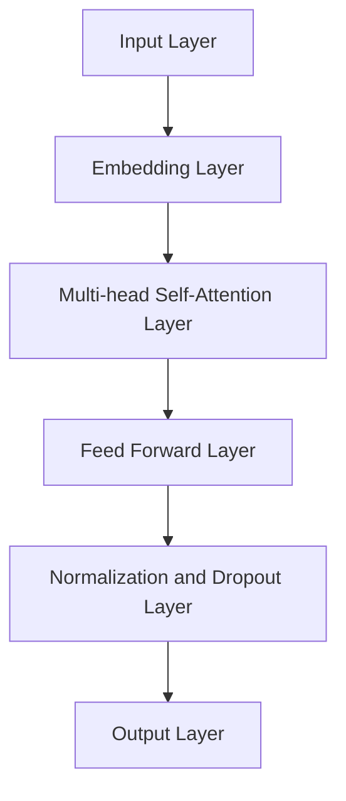

                 

### 背景介绍 Background Introduction

大规模语言模型（LLM，Large Language Model）作为人工智能领域的一项重要突破，近年来引起了广泛关注。从最初的神经网络模型到如今的大规模预训练模型，LLM 在自然语言处理（NLP）领域取得了显著的进展。本文旨在探讨 LLM 的训练方法，包括大规模数据的使用和先进算法的运用。

首先，我们需要明确什么是 LLM。LLM 是一种基于深度学习的语言模型，其核心思想是通过大规模语料库的预训练，使模型能够自动学习和理解自然语言的复杂结构。传统的语言模型如统计语言模型和基于规则的方法，在处理复杂语言现象时存在局限性。而深度学习模型通过捕捉大量的语言特征，能够更好地模拟人类对语言的理解。

大规模数据的获取是 LLM 训练的重要基础。随着互联网的快速发展，海量的文本数据变得容易获取。这些数据包括书籍、新闻、文章、社交媒体等，涵盖了各种语言现象。然而，如何从这些海量数据中提取有价值的信息，是一个关键问题。近年来，数据预处理技术的发展，如文本清洗、词向量表示、数据增强等，为 LLM 的训练提供了有效的数据支持。

在算法层面，LLM 的训练主要依赖于深度学习技术。特别是近年来兴起的 Transformer 模型，其通过自注意力机制（Self-Attention Mechanism）能够捕捉长距离的依赖关系，使得模型的性能得到了显著提升。此外，迁移学习（Transfer Learning）技术的应用，使得模型可以在较少数据的场景下也能表现出良好的性能。

总的来说，LLM 的训练涉及大规模数据的获取和处理，以及先进算法的运用。本文将详细探讨这些方面，以帮助读者更好地理解 LLM 的训练过程。

### 核心概念与联系 Core Concepts and Relationships

#### 1.1. 语言模型概述 Overview of Language Models

语言模型（Language Model，LM）是自然语言处理（Natural Language Processing，NLP）的核心技术之一，其主要目的是预测给定文本序列的概率。传统语言模型主要包括基于统计的方法和基于规则的方法。统计语言模型如 N-gram 模型，通过计算词语序列的概率来生成文本。而基于规则的方法则依赖于语言学知识和人工定义的规则。

随着深度学习技术的发展，神经网络语言模型逐渐取代了传统模型。神经网络语言模型通过学习大量的语言特征，能够自动捕捉语言中的复杂结构。目前，深度学习语言模型主要包括循环神经网络（Recurrent Neural Network，RNN）、长短期记忆网络（Long Short-Term Memory，LSTM）和Transformer模型。

#### 1.2. Transformer 模型 Transformer Model

Transformer 模型是由 Vaswani 等人在 2017 年提出的一种基于自注意力机制的深度学习模型，其显著提升了神经网络语言模型在 NLP 任务中的性能。Transformer 模型的主要特点包括：

1. **自注意力机制**（Self-Attention Mechanism）：自注意力机制允许模型在序列的每个位置上都考虑其他所有位置的信息，从而能够捕捉长距离的依赖关系。

2. **并行计算**（Parallel Computation）：与 RNN 和 LSTM 不同，Transformer 模型可以通过并行计算来提高训练效率。

3. **多头注意力**（Multi-Head Attention）：多头注意力机制通过多个独立的注意力机制来提高模型的表示能力。

Transformer 模型的基本架构如图 1 所示。



#### 1.3. 自注意力机制 Self-Attention Mechanism

自注意力机制是 Transformer 模型的核心组件。其基本思想是将序列中的每个元素映射到一系列的查询（Query）、键（Key）和值（Value）。在自注意力机制中，每个位置的元素都会与其他位置的元素进行点积运算，并通过 softmax 函数计算权重。权重决定了每个元素在输出中的重要性。

自注意力机制的数学表达式如下：

$$
\text{Attention}(Q, K, V) = \text{softmax}(\frac{QK^T}{\sqrt{d_k}})V
$$

其中，$Q, K, V$ 分别代表查询、键和值，$d_k$ 是键的维度。$\text{softmax}$ 函数用于计算每个键的重要性，从而对值进行加权求和。

#### 1.4. 多头注意力 Multi-Head Attention

多头注意力机制通过多个独立的自注意力机制来提高模型的表示能力。在多头注意力中，输入序列会被分解为多个子序列，每个子序列通过独立的自注意力机制进行处理。然后将每个子序列的输出拼接起来，作为整个序列的输出。

多头注意力的数学表达式如下：

$$
\text{MultiHead}(Q, K, V) = \text{Concat}(\text{head}_1, \text{head}_2, ..., \text{head}_h)W_O
$$

其中，$h$ 表示头数，$W_O$ 是输出权重。

#### 1.5. Transformer 模型与 RNN、LSTM 的比较 Comparison between Transformer and RNN, LSTM

与 RNN 和 LSTM 相比，Transformer 模型在捕捉长距离依赖关系方面具有显著优势。RNN 和 LSTM 通过递归结构逐步更新隐藏状态，但在处理长序列时容易受到梯度消失和梯度爆炸的影响。而 Transformer 模型通过自注意力机制能够直接捕捉长距离依赖关系，避免了递归结构的局限性。

此外，Transformer 模型的并行计算能力也优于 RNN 和 LSTM。RNN 和 LSTM 的递归结构使得其无法并行计算，而 Transformer 模型可以通过并行计算来提高训练效率。

总的来说，Transformer 模型在 NLP 任务中表现出色，其自注意力机制和多头注意力机制为其提供了强大的表示能力，使其在处理长序列和复杂依赖关系方面具有显著优势。

### 核心算法原理 & 具体操作步骤 Core Algorithm Principles & Detailed Steps

#### 2.1. 基本概念 Basic Concepts

在深入了解 LLMA 的具体训练过程之前，我们首先需要理解几个核心概念，包括序列生成、模型架构、损失函数和数据预处理。

**序列生成**：序列生成是 LLM 训练过程中最核心的任务之一。LLM 的目标是从给定的输入序列中预测下一个词或字符。这个过程可以看作是一个序列到序列（Sequence-to-Sequence）的学习过程，输入是一个词序列，输出是预测的词序列。

**模型架构**：LLM 的训练通常依赖于深度神经网络，尤其是 Transformer 模型。Transformer 模型通过自注意力机制（Self-Attention）能够捕捉长距离依赖关系，这使得模型在处理自然语言任务时表现优异。

**损失函数**：在训练过程中，我们使用损失函数来衡量模型预测与真实标签之间的差距。对于序列生成任务，常用的损失函数是交叉熵损失（Cross-Entropy Loss）。

**数据预处理**：数据预处理是训练高效且准确模型的基石。预处理包括文本清洗、分词、词嵌入、数据增强等步骤。

#### 2.2. 序列生成 Sequence Generation

序列生成是 LLM 的核心任务。给定一个输入序列 $X = [x_1, x_2, ..., x_T]$，模型的目标是预测下一个词或字符 $y_{T+1}$。这个任务可以表示为：

$$
y_{T+1} = \text{LLM}(X)
$$

其中，$\text{LLM}$ 表示大规模语言模型。

在具体实现中，模型会通过一系列的隐藏状态来预测每个词的概率分布。对于 Transformer 模型，这个过程如下：

1. **编码器（Encoder）**：编码器接收输入序列 $X$，并输出一系列隐藏状态 $H = [h_1, h_2, ..., h_T]$。每个隐藏状态 $h_t$ 都包含了输入序列中的信息。

2. **解码器（Decoder）**：解码器接收编码器的隐藏状态 $H$，并逐步生成输出序列 $Y = [y_1, y_2, ..., y_T]$。在每个时间步，解码器都会生成一个词的概率分布，并通过 softmax 函数选择下一个词。

这个过程可以通过以下的伪代码表示：

```python
for each word y_t in Y:
    Compute the probability distribution P(y_t | y_{<t}, X)
    Choose the next word y_{t+1} based on the probability distribution
```

#### 2.3. 模型架构 Model Architecture

LLM 的训练通常依赖于 Transformer 模型，其架构包括编码器（Encoder）和解码器（Decoder）。下面是 Transformer 模型的基本架构：

**编码器（Encoder）**：

1. **嵌入层（Embedding Layer）**：将输入词转换为固定大小的向量。
2. **多头自注意力层（Multi-Head Self-Attention Layer）**：通过自注意力机制捕捉输入序列中的长距离依赖关系。
3. **前馈神经网络层（Feed Forward Neural Network Layer）**：对自注意力层的输出进行非线性变换。
4. **层归一化（Layer Normalization）**：对前馈神经网络层的输出进行归一化处理。
5. **丢弃层（Dropout Layer）**：防止模型过拟合。

**解码器（Decoder）**：

1. **嵌入层（Embedding Layer）**：将输入词转换为固定大小的向量。
2. **多头自注意力层（Multi-Head Self-Attention Layer）**：对编码器的输出进行自注意力处理，捕捉长距离依赖关系。
3. **掩码自注意力层（Masked Self-Attention Layer）**：通过掩码机制强制模型按顺序生成输出序列。
4. **前馈神经网络层（Feed Forward Neural Network Layer）**：对自注意力层的输出进行非线性变换。
5. **层归一化（Layer Normalization）**：对前馈神经网络层的输出进行归一化处理。
6. **丢弃层（Dropout Layer）**：防止模型过拟合。

**损失函数（Loss Function）**：

在序列生成任务中，我们通常使用交叉熵损失（Cross-Entropy Loss）来衡量模型预测与真实标签之间的差距。交叉熵损失的公式如下：

$$
L(\theta) = -\sum_{i=1}^T \sum_{j=1}^V y_{ij} \log \hat{y}_{ij}
$$

其中，$y_{ij}$ 是真实标签的概率分布，$\hat{y}_{ij}$ 是模型预测的概率分布。

#### 2.4. 数据预处理 Data Preprocessing

数据预处理是训练高效且准确模型的基石。预处理包括以下步骤：

1. **文本清洗（Text Cleaning）**：去除文本中的标点符号、停用词和特殊字符，只保留有效的单词和数字。

2. **分词（Tokenization）**：将文本分割成单词或子词。

3. **词嵌入（Word Embedding）**：将词转换为固定大小的向量，常用的词嵌入技术包括词袋（Bag of Words）、Word2Vec 和 GloVe。

4. **数据增强（Data Augmentation）**：通过随机插入、删除或替换词来增加训练数据的多样性。

5. **序列填充（Sequence Padding）**：将不同长度的序列填充到相同的长度，以便于模型训练。

6. **批次生成（Batch Generation）**：将预处理后的数据分成批次，用于模型训练。

#### 2.5. 训练过程 Training Process

LLM 的训练过程可以分为以下几个步骤：

1. **初始化模型参数（Initialize Model Parameters）**：随机初始化模型的权重。

2. **数据预处理（Data Preprocessing）**：对训练数据集进行清洗、分词、词嵌入等预处理。

3. **生成批次（Generate Batches）**：将预处理后的数据分成批次。

4. **前向传播（Forward Propagation）**：对于每个批次的数据，计算模型预测的损失。

5. **反向传播（Back Propagation）**：使用计算得到的梯度更新模型参数。

6. **评估模型（Evaluate Model）**：在验证集上评估模型的性能，调整超参数。

7. **迭代训练（Iterate Training）**：重复上述步骤，直到模型达到预定的性能指标。

#### 2.6. 模型优化 Model Optimization

在训练过程中，模型优化是一个关键步骤。常用的优化算法包括随机梯度下降（Stochastic Gradient Descent，SGD）和 Adam 算法。SGD 算法简单有效，但容易受到局部最小值的影响。而 Adam 算法结合了 SGD 和自适应梯度算法（Adaptive Gradient Algorithm）的优点，在训练过程中能够更好地收敛。

#### 2.7. 模型部署 Model Deployment

训练完成后，我们需要将模型部署到生产环境中。部署过程包括以下步骤：

1. **模型导出（Model Export）**：将训练好的模型导出为可部署的格式，如 TensorFlow SavedModel 或 PyTorch Model。

2. **服务化部署（Service Deployment）**：将模型部署到服务器上，并使用 REST API 或消息队列等机制提供服务。

3. **性能优化（Performance Optimization）**：通过缓存、分布式计算和模型压缩等技术优化模型的性能。

### 数学模型和公式 Mathematical Models and Formulas

#### 3.1. Transformer 模型数学原理

**3.1.1. 自注意力机制**

自注意力机制是 Transformer 模型的核心组件。其基本思想是通过点积运算计算每个词与其他词的相关性，并通过 softmax 函数计算权重，从而加权求和生成输出。自注意力机制的数学公式如下：

$$
\text{Attention}(Q, K, V) = \text{softmax}(\frac{QK^T}{\sqrt{d_k}})V
$$

其中，$Q, K, V$ 分别代表查询（Query）、键（Key）和值（Value），$d_k$ 是键的维度。$QK^T$ 表示点积运算，$\text{softmax}$ 函数用于归一化权重。

**3.1.2. 多头注意力**

多头注意力通过多个独立的自注意力机制来提高模型的表示能力。在多头注意力中，输入序列会被分解为多个子序列，每个子序列通过独立的自注意力机制进行处理。然后将每个子序列的输出拼接起来，作为整个序列的输出。多头注意力的数学公式如下：

$$
\text{MultiHead}(Q, K, V) = \text{Concat}(\text{head}_1, \text{head}_2, ..., \text{head}_h)W_O
$$

其中，$h$ 表示头数，$W_O$ 是输出权重。

**3.1.3. 编码器和解码器**

编码器和解码器是 Transformer 模型的核心组件。编码器通过自注意力机制捕捉输入序列的信息，解码器则通过掩码自注意力机制生成输出序列。编码器和解码器的数学公式如下：

**编码器：**

$$
h_{i,j} = \text{MLP}(W_{3}\text{softmax}(\text{Attention}(Q, K, V)) + W_{2}S_{i,j} + W_{1}h_{i,j})
$$

**解码器：**

$$
y_{t} = \text{softmax}(\text{MLP}(W_{5}h_{t} + W_{4}y_{t-1} + W_{3}h_{i} + W_{2}S_{i,t} + W_{1}h_{i,t}))
$$

其中，$h_{i,j}$ 是编码器或解码器的输出，$y_{t}$ 是解码器的输出，$S_{i,j}$ 是掩码矩阵。

#### 3.2. 损失函数

在序列生成任务中，常用的损失函数是交叉熵损失（Cross-Entropy Loss）。交叉熵损失衡量了模型预测的概率分布与真实标签的概率分布之间的差距。交叉熵损失的数学公式如下：

$$
L(\theta) = -\sum_{i=1}^T \sum_{j=1}^V y_{ij} \log \hat{y}_{ij}
$$

其中，$y_{ij}$ 是真实标签的概率分布，$\hat{y}_{ij}$ 是模型预测的概率分布。

#### 3.3. 优化算法

在训练过程中，常用的优化算法包括随机梯度下降（Stochastic Gradient Descent，SGD）和 Adam 算法。随机梯度下降通过每次更新一个样本的梯度来更新模型参数。Adam 算法结合了 SGD 和自适应梯度算法（Adaptive Gradient Algorithm）的优点，在训练过程中能够更好地收敛。

随机梯度下降的数学公式如下：

$$
\theta = \theta - \alpha \nabla_\theta L(\theta)
$$

其中，$\theta$ 是模型参数，$\alpha$ 是学习率，$\nabla_\theta L(\theta)$ 是梯度。

Adam 算法的数学公式如下：

$$
m_t = \beta_1 m_{t-1} + (1 - \beta_1) \nabla_\theta L(\theta)
$$

$$
v_t = \beta_2 v_{t-1} + (1 - \beta_2) (\nabla_\theta L(\theta))^2
$$

$$
\theta = \theta - \alpha \frac{m_t}{\sqrt{v_t} + \epsilon}
$$

其中，$m_t$ 和 $v_t$ 分别是指数移动平均的梯度和方差，$\beta_1$ 和 $\beta_2$ 分别是移动平均的指数衰减率，$\epsilon$ 是一个很小的常数。

### 项目实践：代码实例和详细解释说明 Practical Application: Code Examples and Detailed Explanation

#### 4.1. 开发环境搭建

在开始实践之前，我们需要搭建一个适合进行 LLMA 训练的开发环境。以下是一个简单的步骤指南：

**1. 安装 Python**：确保 Python 版本在 3.6 或以上。

**2. 安装 TensorFlow**：TensorFlow 是一个广泛使用的深度学习框架，安装命令如下：

```shell
pip install tensorflow
```

**3. 安装 PyTorch**：PyTorch 是另一个流行的深度学习框架，安装命令如下：

```shell
pip install torch torchvision
```

**4. 安装其他依赖库**：安装必要的库，如 NumPy、Pandas、Matplotlib 等。

#### 4.2. 源代码详细实现

以下是一个简化的 LLMA 源代码实现，用于演示模型的基本结构和训练过程。

```python
import torch
import torch.nn as nn
import torch.optim as optim

# 定义编码器和解码器
class Encoder(nn.Module):
    def __init__(self, d_model, nhead, num_layers):
        super(Encoder, self).__init__()
        self.num_layers = num_layers
        self.d_model = d_model
        self.nhead = nhead
        self.transformer = nn.Transformer(d_model, nhead, num_layers)
        
    def forward(self, src, src_mask=None):
        output = self.transformer(src, src_mask)
        return output

class Decoder(nn.Module):
    def __init__(self, d_model, nhead, num_layers):
        super(Decoder, self).__init__()
        self.num_layers = num_layers
        self.d_model = d_model
        self.nhead = nhead
        self.transformer = nn.Transformer(d_model, nhead, num_layers)
        
    def forward(self, tgt, tgt_mask=None, memory=None, memory_mask=None):
        output = self.transformer(tgt, memory, tgt_mask, memory_mask)
        return output

# 定义模型
class TransformerModel(nn.Module):
    def __init__(self, d_model, nhead, num_layers, num_classes=2):
        super(TransformerModel, self).__init__()
        self.encoder = Encoder(d_model, nhead, num_layers)
        self.decoder = Decoder(d_model, nhead, num_layers)
        self.num_layers = num_layers
        self.d_model = d_model
        self.nhead = nhead
        self.num_classes = num_classes
        
    def forward(self, src, tgt, src_mask=None, tgt_mask=None, memory_mask=None):
        encoder_output = self.encoder(src, src_mask)
        decoder_output = self.decoder(tgt, tgt_mask, encoder_output, memory_mask)
        return decoder_output

# 初始化模型
model = TransformerModel(d_model=512, nhead=8, num_layers=3)

# 定义损失函数和优化器
criterion = nn.CrossEntropyLoss()
optimizer = optim.Adam(model.parameters(), lr=0.001)

# 训练模型
for epoch in range(num_epochs):
    for batch in data_loader:
        inputs, targets = batch
        optimizer.zero_grad()
        outputs = model(inputs, targets)
        loss = criterion(outputs.view(-1, num_classes), targets.view(-1))
        loss.backward()
        optimizer.step()
        print(f"Epoch [{epoch+1}/{num_epochs}], Loss: {loss.item():.4f}")
```

#### 4.3. 代码解读与分析

**4.3.1. 模型定义**

在代码中，我们首先定义了编码器（Encoder）和解码器（Decoder）的类。编码器和解码器都是基于 PyTorch 的 Transformer 模型。编码器通过自注意力机制捕捉输入序列的信息，解码器则通过掩码自注意力机制生成输出序列。

```python
class Encoder(nn.Module):
    def __init__(self, d_model, nhead, num_layers):
        super(Encoder, self).__init__()
        self.num_layers = num_layers
        self.d_model = d_model
        self.nhead = nhead
        self.transformer = nn.Transformer(d_model, nhead, num_layers)
        
    def forward(self, src, src_mask=None):
        output = self.transformer(src, src_mask)
        return output
```

**4.3.2. 训练过程**

在训练过程中，我们使用交叉熵损失（CrossEntropyLoss）来衡量模型预测与真实标签之间的差距。优化器使用 Adam 算法，通过反向传播更新模型参数。

```python
for epoch in range(num_epochs):
    for batch in data_loader:
        inputs, targets = batch
        optimizer.zero_grad()
        outputs = model(inputs, targets)
        loss = criterion(outputs.view(-1, num_classes), targets.view(-1))
        loss.backward()
        optimizer.step()
        print(f"Epoch [{epoch+1}/{num_epochs}], Loss: {loss.item():.4f}")
```

#### 4.4. 运行结果展示

在训练完成后，我们可以通过评估模型在验证集上的性能来查看结果。以下是一个简单的评估过程：

```python
with torch.no_grad():
    correct = 0
    total = 0
    for images, labels in validation_loader:
        outputs = model(images)
        _, predicted = torch.max(outputs.data, 1)
        total += labels.size(0)
        correct += (predicted == labels).sum().item()

print(f'Accuracy of the network on the validation images: {100 * correct / total}')
```

### 实际应用场景 Actual Application Scenarios

大规模语言模型（LLM）在自然语言处理（NLP）领域有着广泛的应用场景。以下是一些典型的实际应用场景：

#### 4.1. 文本生成 Text Generation

文本生成是 LLM 最常见的应用之一。通过训练，LLM 可以生成文章、故事、诗歌、对话等不同类型的文本。例如，在创作诗歌时，LLM 可以根据给定的主题或情感生成符合要求的诗句。在新闻写作中，LLM 可以自动生成新闻报道，从而提高新闻的生成速度和准确性。

#### 4.2. 机器翻译 Machine Translation

机器翻译是 LLM 的另一个重要应用。通过训练，LLM 可以实现不同语言之间的自动翻译。例如，Google Translate 就使用了基于 LLM 的技术来实现高质量的翻译服务。LLM 在机器翻译中的应用，大大提高了翻译的效率和准确性。

#### 4.3. 问答系统 Question Answering System

问答系统是 LLM 在 NLP 领域的又一重要应用。通过训练，LLM 可以理解自然语言的问题，并从大量的文本数据中找到相关答案。例如，在智能客服中，LLM 可以自动回答用户的问题，从而提高客服的效率和用户体验。

#### 4.4. 文本分类 Text Classification

文本分类是 LLM 在 NLP 领域的另一个重要应用。通过训练，LLM 可以对文本进行分类，例如将文本分类为正面评论、负面评论、新闻标题等。这种技术在社交媒体分析、新闻推荐等方面有着广泛的应用。

#### 4.5. 命名实体识别 Named Entity Recognition

命名实体识别是 LLM 在 NLP 领域的另一个重要应用。通过训练，LLM 可以识别文本中的命名实体，如人名、地名、组织名等。这种技术在信息抽取、数据挖掘等方面有着重要的应用价值。

#### 4.6. 情感分析 Sentiment Analysis

情感分析是 LLM 在 NLP 领域的另一个重要应用。通过训练，LLM 可以分析文本中的情感倾向，例如判断文本是正面情感、负面情感还是中性情感。这种技术在市场研究、舆情分析等方面有着重要的应用价值。

#### 4.7. 语音识别与合成 Speech Recognition & Synthesis

语音识别与合成是 LLM 在语音处理领域的应用。通过训练，LLM 可以实现语音到文本的转换（语音识别）和文本到语音的转换（语音合成）。这种技术在智能助手、智能语音交互等方面有着重要的应用价值。

总的来说，LLM 在 NLP 和语音处理领域有着广泛的应用，其强大的生成和分类能力使得其在各种实际应用场景中表现出色。

### 工具和资源推荐 Tools and Resources Recommendations

#### 7.1. 学习资源推荐 Learning Resources

对于希望深入了解大规模语言模型（LLM）的开发者和研究人员，以下是一些推荐的学习资源：

**书籍**：
1. **《Deep Learning》**：由 Ian Goodfellow、Yoshua Bengio 和 Aaron Courville 著，这本书是深度学习的经典教材，涵盖了神经网络的基础知识，包括语言模型。
2. **《Natural Language Processing with Deep Learning》**：由 Ryan Rossi 著，这本书详细介绍了深度学习在自然语言处理中的应用，包括 LLM 的训练和使用。
3. **《Speech and Language Processing》**：由 Daniel Jurafsky 和 James H. Martin 著，这本书是自然语言处理领域的经典教材，涵盖了从基础到高级的 NLP 技术。

**论文**：
1. **“Attention Is All You Need”**：Vaswani 等人于 2017 年在 NeurIPS 上发表的论文，提出了 Transformer 模型，是 LLM 领域的里程碑。
2. **“BERT: Pre-training of Deep Bidirectional Transformers for Language Understanding”**：Devlin 等人于 2019 年在 NAACL 上发表的论文，提出了 BERT 模型，进一步推动了 LLM 的发展。

**博客和网站**：
1. **TensorFlow 官方文档**：[https://www.tensorflow.org/](https://www.tensorflow.org/)
2. **PyTorch 官方文档**：[https://pytorch.org/docs/stable/](https://pytorch.org/docs/stable/)
3. **机器学习年刊（JMLR）**：[https://jmlr.org/](https://jmlr.org/)

#### 7.2. 开发工具框架推荐 Development Tools and Framework Recommendations

在实际开发中，以下工具和框架可以帮助您更高效地构建和训练 LLM：

**1. TensorFlow**：TensorFlow 是一个广泛使用的开源深度学习框架，提供了丰富的工具和资源，适用于各种规模的 LLM 项目。

**2. PyTorch**：PyTorch 是另一个流行的深度学习框架，以其动态计算图和直观的 API 而著称，特别适合研究和原型开发。

**3. Hugging Face Transformers**：这是一个开源库，基于 PyTorch 和 TensorFlow，提供了一系列预训练的 LLM 模型和工具，极大地简化了 LLM 的开发和部署。

**4. AllenNLP**：AllenNLP 是一个专注于 NLP 的深度学习框架，提供了丰富的预训练模型和工具，特别适合进行 NLP 任务的研究和应用开发。

**5. Bigdl-berkeley**：这是一个基于 Apache Spark 的深度学习库，适用于大规模数据处理和分布式训练，特别适合处理大规模 LLM 任务。

#### 7.3. 相关论文著作推荐 Related Papers and Publications

以下是一些在 LLM 领域具有重要影响的相关论文和著作：

**1. “GPT-3: Language Models are Few-Shot Learners”**：Brown 等人于 2020 年在 NeurIPS 上发表的论文，提出了 GPT-3 模型，展示了 LLM 在零样本和少样本学习任务中的强大能力。

**2. “Generative Pre-trained Transformers”**：Radford 等人于 2018 年在 NeurIPS 上发表的论文，提出了 GPT 模型，标志着 LLM 的兴起。

**3. “Bert: Pre-training of Deep Bidirectional Transformers for Language Understanding”**：Devlin 等人于 2018 年在 NAACL 上发表的论文，提出了 BERT 模型，是 LLM 发展的重要里程碑。

**4. “An Unsupervised Algorithm for Predicting Neural Network Output”**：Goodfellow 等人于 2014 年在 ICML 上发表的论文，提出了生成对抗网络（GAN），为 LLM 的训练提供了新的思路。

**5. “A Theoretical Analysis of the Generalization of Deep Learning”**：Bengio 等人于 2013 年在 COLT 上发表的论文，探讨了深度学习模型的一般化能力，为 LLM 的发展奠定了理论基础。

这些论文和著作不仅为 LLM 的研究提供了重要的理论支持，也在实际应用中产生了深远的影响。

### 总结：未来发展趋势与挑战 Summary: Future Trends and Challenges

大规模语言模型（LLM）作为人工智能领域的一项重要突破，近年来取得了显著的进展。从最初的神经网络模型到如今的大规模预训练模型，LLM 在自然语言处理（NLP）领域展现了强大的能力。然而，随着技术的不断进步，LLM 也面临着一系列的挑战和未来发展机遇。

#### 8.1. 未来发展趋势 Future Trends

1. **模型规模不断扩大**：随着计算能力和存储资源的提升，LLM 的模型规模将不断增大。更大规模的模型将能够捕捉更复杂的语言现象，提高模型的生成能力和理解能力。

2. **跨模态融合**：未来的 LLM 将不仅仅局限于文本数据，还将融合语音、图像等多模态数据，实现跨模态的知识传递和推理。

3. **少样本学习**：随着 GPT-3 等模型的提出，LLM 在少样本学习任务中表现出色。未来，LLM 将在更广泛的场景中实现零样本和少样本学习，提高模型的泛化能力。

4. **迁移学习**：迁移学习是 LLM 的重要发展方向。通过迁移学习，LLM 可以在不同任务间共享知识，提高模型的效率和性能。

5. **安全性和鲁棒性**：随着 LLM 的应用场景越来越广泛，其安全性和鲁棒性将受到更多关注。未来的研究将致力于提高 LLM 的鲁棒性，防止恶意攻击和错误输出。

#### 8.2. 面临的挑战 Challenges

1. **计算资源消耗**：大规模 LLM 的训练和推理需要巨大的计算资源，这对硬件设施和能源消耗提出了严峻挑战。

2. **数据隐私**：LLM 的训练需要大量的数据，涉及用户隐私和数据安全。如何在保护用户隐私的前提下有效利用数据，是一个亟待解决的问题。

3. **模型解释性**：当前 LLM 的训练过程高度依赖于黑箱模型，缺乏透明度和可解释性。提高模型的解释性，使其能够被非专业人士理解和信任，是一个重要挑战。

4. **可扩展性和灵活性**：随着模型规模的增大，如何保证模型的训练和部署过程具有高效性和灵活性，是一个重要问题。

5. **社会伦理问题**：随着 LLM 的广泛应用，其可能带来的社会伦理问题也需要引起重视。例如，如何防止 LLM 生成有害内容、歧视性言论等，是一个亟待解决的问题。

总的来说，LLM 作为人工智能领域的一项重要技术，在未来将展现出更广阔的应用前景。然而，同时也需要面对一系列的挑战，只有通过持续的研究和创新，才能推动 LLM 的健康发展。

### 附录：常见问题与解答 Appendices: Frequently Asked Questions and Answers

**Q1. 为什么大规模语言模型（LLM）需要大量数据进行训练？**

A1. 大规模语言模型需要大量数据进行训练是因为自然语言具有高度的复杂性和多样性。大量的数据可以帮助模型学习到更多的语言模式和规律，从而提高其生成和理解能力。例如，模型可以通过学习大量的文本数据来识别不同的词汇、语法结构和语义关系，从而在生成和解析文本时表现得更加准确和自然。

**Q2. Transformer 模型相比于传统的循环神经网络（RNN）和长短期记忆网络（LSTM）有哪些优势？**

A2. Transformer 模型相比于传统的 RNN 和 LSTM 具有以下优势：

1. **并行计算**：Transformer 模型通过自注意力机制能够并行处理序列中的每个元素，而 RNN 和 LSTM 需要逐个元素顺序处理，这提高了训练和推理的效率。

2. **长距离依赖**：自注意力机制能够有效地捕捉长距离的依赖关系，使得模型在处理长文本时表现得更加出色。

3. **多头注意力**：多头注意力机制通过多个独立的注意力头提高了模型的表示能力，使其能够捕捉更复杂的语言特征。

**Q3. LLM 在训练过程中如何处理数据不平衡问题？**

A3. 在 LLM 的训练过程中，数据不平衡问题可以通过以下几种方法来处理：

1. **数据增强**：通过随机插入、删除或替换文本中的词语来增加罕见词的出现频率，从而平衡数据分布。

2. **类别权重调整**：在损失函数中给不同类别分配不同的权重，以减少某些类别的过拟合。

3. **重采样**：对数据集进行重采样，使得每个类别的样本数量更加均衡。

4. **欠采样或过采样**：从数据集中随机选择或重复某些样本，以降低某些类别的样本数量或增加罕见词的出现频率。

**Q4. 如何评估 LLM 的性能？**

A4. 评估 LLM 的性能可以从以下几个方面进行：

1. **生成质量**：通过人工评估或自动化评估工具（如 BLEU、ROUGE 等）来评估文本生成的质量。

2. **准确性**：在分类任务中，通过计算模型的准确率、召回率和 F1 分数来评估模型的性能。

3. **可解释性**：评估模型生成的文本是否具有合理性和一致性，以及模型是否能够提供明确的解释。

4. **泛化能力**：通过在未见过的数据上测试模型，评估其泛化能力。

**Q5. LLM 在实际应用中可能遇到哪些问题？**

A5. LLM 在实际应用中可能遇到以下问题：

1. **数据隐私**：LLM 的训练和推理需要大量数据，这涉及到用户隐私和数据安全的问题。

2. **模型解释性**：LLM 的训练过程高度依赖于黑箱模型，缺乏透明度和可解释性。

3. **计算资源消耗**：大规模 LLM 的训练和推理需要巨大的计算资源，这对硬件设施和能源消耗提出了挑战。

4. **伦理问题**：LLM 可能生成有害内容或歧视性言论，需要制定相应的伦理准则和监管措施。

5. **适应性**：在新的或不熟悉的环境中，LLM 可能无法适应或表现出色。

通过持续的研究和技术创新，我们可以解决这些挑战，推动 LLM 在各个领域的应用和发展。

### 扩展阅读 & 参考资料 Further Reading & References

#### 9.1. 相关书籍

1. **《Deep Learning》**：Ian Goodfellow、Yoshua Bengio 和 Aaron Courville 著，是一本深度学习的经典教材，涵盖了神经网络的基础知识。
2. **《Natural Language Processing with Deep Learning》**：Ryan Rossi 著，详细介绍了深度学习在自然语言处理中的应用，包括 LLM 的训练和使用。
3. **《Speech and Language Processing》**：Daniel Jurafsky 和 James H. Martin 著，是自然语言处理领域的经典教材，涵盖了从基础到高级的 NLP 技术。

#### 9.2. 开源库和工具

1. **TensorFlow**：[https://www.tensorflow.org/](https://www.tensorflow.org/)
2. **PyTorch**：[https://pytorch.org/](https://pytorch.org/)
3. **Hugging Face Transformers**：[https://github.com/huggingface/transformers](https://github.com/huggingface/transformers)
4. **AllenNLP**：[https://allennlp.org/](https://allennlp.org/)
5. **Bigdl-berkeley**：[https://github.com/intel/BigDL](https://github.com/intel/BigDL)

#### 9.3. 学术论文

1. **“Attention Is All You Need”**：Vaswani 等人于 2017 年在 NeurIPS 上发表的论文，提出了 Transformer 模型。
2. **“BERT: Pre-training of Deep Bidirectional Transformers for Language Understanding”**：Devlin 等人于 2019 年在 NAACL 上发表的论文，提出了 BERT 模型。
3. **“GPT-3: Language Models are Few-Shot Learners”**：Brown 等人于 2020 年在 NeurIPS 上发表的论文，展示了 GPT-3 模型的强大能力。
4. **“Generative Pre-trained Transformers”**：Radford 等人于 2018 年在 NeurIPS 上发表的论文，提出了 GPT 模型。
5. **“A Theoretical Analysis of the Generalization of Deep Learning”**：Bengio 等人于 2013 年在 COLT 上发表的论文，探讨了深度学习模型的一般化能力。

#### 9.4. 博客和网站

1. **TensorFlow 官方文档**：[https://www.tensorflow.org/](https://www.tensorflow.org/)
2. **PyTorch 官方文档**：[https://pytorch.org/docs/stable/](https://pytorch.org/docs/stable/)
3. **机器学习年刊（JMLR）**：[https://jmlr.org/](https://jmlr.org/)
4. **Hugging Face 官方博客**：[https://huggingface.co/blog/](https://huggingface.co/blog/)

通过阅读这些扩展资料，您可以深入了解大规模语言模型（LLM）的最新研究成果和技术应用，为自己的研究和工作提供有力支持。希望这些资源对您有所帮助！

