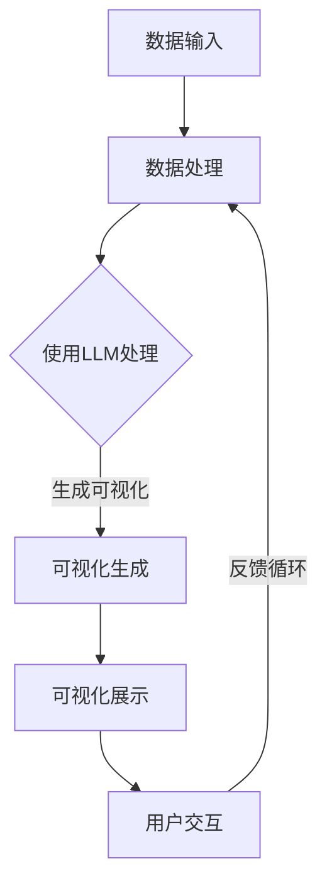

                 

### 1. 背景介绍

#### 数据可视化的传统方法

数据可视化作为数据科学领域的一个重要分支，旨在通过图形、图表等方式将复杂的数据以直观、易于理解的形式展示出来。传统数据可视化技术主要包括以下几种方法：

1. **图表法**：使用柱状图、折线图、饼图等常见的统计图表来展示数据分布、趋势和关系。
2. **地图法**：利用地理信息系统（GIS）技术，将地理空间数据通过地图的形式展示出来，适用于展示地域性数据。
3. **热力图**：以颜色深浅来表示数据密集度的图表，常用于展示矩阵数据的分布情况。
4. **词云图**：通过文本数据的词频来生成可视化图表，用于展示文本数据的主题分布和重要性。

#### 传统方法的局限

尽管传统数据可视化方法在一定程度上能够满足数据分析的需求，但它们也存在一些局限性：

1. **信息密度低**：传统的图表形式往往无法承载大量数据，信息展示的密度和深度有限。
2. **交互性差**：大多数传统图表缺乏交互功能，用户难以对数据进行动态操作和深入探索。
3. **复杂关系难以展现**：对于复杂的多维度关系和数据交互，传统图表难以有效地展示和解释。
4. **技术门槛高**：生成复杂的图表需要专业的软件和技术支持，普通用户难以制作。

#### LLM的概念与潜力

为了解决传统数据可视化方法的局限性，近年来，大规模语言模型（Large Language Model，简称LLM）的出现为数据可视化带来了新的可能性。LLM是一种基于神经网络的语言处理模型，通过训练大量的文本数据，能够生成或理解复杂的语言信息。

LLM在数据可视化中的潜力主要体现在以下几个方面：

1. **自适应展示**：LLM能够根据用户的需求和数据特点，动态生成适合的可视化图表，提升信息展示的适配性和效果。
2. **高级交互**：通过自然语言交互，用户可以更直观地与可视化图表进行交互，实现数据的动态探索和分析。
3. **多维度关系展现**：LLM能够处理和理解复杂的多维度数据关系，生成更加细腻和准确的可视化展示。
4. **降低技术门槛**：借助LLM，普通用户无需具备专业的数据可视化技能，即可轻松创建和定制可视化图表。

#### 背景与目标

本文旨在探讨LLM与传统数据可视化技术的结合，分析其优势和应用场景，并展示一个实际的项目实践案例。通过本文的阅读，读者将了解：

- LLM的基本概念和工作原理；
- LLM在数据可视化中的潜在应用；
- 传统数据可视化技术的局限性；
- LLM与传统技术结合的实现方法和步骤；
- 一个具体的项目实践案例，展示LLM在数据可视化中的实际应用效果。

### 2. 核心概念与联系

#### 2.1 大规模语言模型（LLM）

大规模语言模型（LLM）是基于深度学习的自然语言处理模型，通过训练海量的文本数据，能够理解和生成人类语言。LLM的核心组成部分包括：

- **词嵌入（Word Embedding）**：将单词映射到高维向量空间中，使得语义相近的词在空间中靠近。
- **循环神经网络（RNN）**：处理序列数据，捕捉句子中词汇的顺序关系。
- **注意力机制（Attention Mechanism）**：在处理句子时，模型可以自动关注重要信息，提高对关键内容的理解。
- **Transformer架构**：基于自注意力机制，处理长文本序列，具有并行计算的优势。

#### 2.2 传统数据可视化技术

传统数据可视化技术包括图表、地图、热力图和词云图等。这些技术通过图形和颜色等视觉元素来展示数据特征，满足基本的可视化需求。然而，它们在信息密度、交互性、复杂关系展示和技能门槛等方面存在局限。

#### 2.3 LLM与传统数据可视化技术的结合

LLM与传统数据可视化技术的结合主要体现在以下几个方面：

- **自适应可视化**：LLM可以根据用户的需求和数据特点，动态生成适合的可视化图表，实现数据展示的个性化。
- **高级交互**：通过自然语言交互，用户可以更直观地与可视化图表进行交互，实现数据的动态探索和分析。
- **多维度关系展示**：LLM能够处理和理解复杂的多维度数据关系，生成更加细腻和准确的可视化展示。
- **降低技术门槛**：借助LLM，普通用户无需具备专业的数据可视化技能，即可轻松创建和定制可视化图表。

#### 2.4 Mermaid流程图

以下是一个Mermaid流程图，展示了LLM与传统数据可视化技术的结合过程：



- **A 数据输入**：用户输入数据，可以是表格、文本或其他形式。
- **B 数据处理**：对输入数据进行预处理，如清洗、转换等。
- **C 使用LLM处理**：利用LLM对数据进行分析和处理，提取关键信息和关系。
- **D 可视化生成**：根据处理结果，动态生成适合的可视化图表。
- **E 可视化展示**：将生成的可视化图表展示给用户。
- **F 用户交互**：用户与可视化图表进行交互，提供反馈。
- **反馈循环**：根据用户反馈，进一步优化可视化结果和交互体验。

### 3. 核心算法原理 & 具体操作步骤

#### 3.1 LLM的算法原理

大规模语言模型（LLM）的核心算法是基于深度学习的，主要通过以下步骤实现：

1. **词嵌入**：将文本中的单词映射到高维向量空间中，使得语义相近的词在空间中靠近。
2. **序列处理**：通过循环神经网络（RNN）或Transformer架构处理文本序列，捕捉词汇之间的顺序关系。
3. **自注意力机制**：在Transformer架构中，自注意力机制能够自动关注重要信息，提高对关键内容的理解。
4. **生成输出**：根据输入文本，模型输出相应的语言或文本序列。

#### 3.2 LLM在数据可视化中的应用步骤

以下是LLM在数据可视化中的应用步骤：

1. **数据准备**：
   - 用户输入数据，可以是表格、文本或其他形式。
   - 对输入数据进行预处理，如清洗、转换等。

2. **LLM处理**：
   - 利用LLM对预处理后的数据进行分析和处理，提取关键信息和关系。
   - LLM输出处理结果，如关键词、主题、数据分布等。

3. **可视化生成**：
   - 根据LLM的处理结果，动态生成适合的可视化图表。
   - 可视化图表的选择和设计取决于数据类型和用户需求。

4. **可视化展示**：
   - 将生成的可视化图表展示给用户。
   - 提供基本的交互功能，如缩放、筛选等。

5. **用户交互**：
   - 用户与可视化图表进行交互，提供反馈。
   - 根据用户反馈，进一步优化可视化结果和交互体验。

#### 3.3 实际操作示例

以下是一个具体的操作示例，展示了如何使用LLM进行数据可视化：

1. **数据准备**：
   - 假设我们有一份数据集，包含不同国家和城市的GDP数据。
   - 数据以CSV格式存储，内容如下：

```csv
Country, City, GDP
USA, New York, 175000000000
USA, Los Angeles, 150000000000
China, Beijing, 250000000000
China, Shanghai, 230000000000
```

2. **LLM处理**：
   - 使用LLM对数据进行分析，提取关键信息，如“中国”、“北京”、“GDP”等。
   - LLM输出处理结果，得到以下关键词和主题：
     - 关键词：中国、北京、GDP、城市、经济
     - 主题：不同国家和城市的GDP对比

3. **可视化生成**：
   - 根据LLM的处理结果，选择生成一个柱状图，展示不同国家和城市的GDP对比。
   - 柱状图的设计如下：

```mermaid
graph TD
    A[USA] --> B[New York](GDP: $175B)
    A --> C[Los Angeles](GDP: $150B)
    D[China] --> E[Beijing](GDP: $250B)
    D --> F[Shanghai](GDP: $230B)
```

4. **可视化展示**：
   - 将生成的柱状图展示给用户。

5. **用户交互**：
   - 用户可以对柱状图进行缩放、筛选等交互操作。
   - 根据用户反馈，进一步优化可视化结果和交互体验。

### 4. 数学模型和公式 & 详细讲解 & 举例说明

#### 4.1 数学模型

在LLM用于数据可视化的过程中，核心的数学模型主要包括词嵌入和注意力机制。以下是这两个模型的基本公式和解释。

1. **词嵌入（Word Embedding）**

词嵌入是将文本中的单词映射到高维向量空间中的过程。其基本公式如下：

$$
\text{vec}(w_i) = \text{Embedding}(w_i)
$$

其中，$\text{vec}(w_i)$ 表示单词 $w_i$ 的向量表示，$\text{Embedding}(w_i)$ 是词嵌入函数，用于将单词映射到高维向量空间。

2. **注意力机制（Attention Mechanism）**

注意力机制是在处理文本序列时，模型自动关注重要信息的方法。其基本公式如下：

$$
\text{context} = \text{Attention}(\text{query}, \text{keys}, \text{values})
$$

其中，$\text{context}$ 表示上下文向量，$\text{query}$、$\text{keys}$ 和 $\text{values}$ 分别是查询向量、键向量和值向量。注意力机制通过计算相似度权重，将这些向量加权求和，得到上下文向量。

#### 4.2 详细讲解

1. **词嵌入（Word Embedding）**

词嵌入的核心思想是利用向量空间中的几何关系来表示单词的语义。通过词嵌入，我们可以将文本数据转换为向量形式，从而方便进行后续的机器学习处理。

词嵌入函数 $\text{Embedding}(w_i)$ 通常采用神经网络来实现，常见的神经网络架构包括：

- **Word2Vec**：基于神经网络的词向量模型，通过训练大量文本数据，生成单词的向量表示。
- **GloVe**：全局向量表示模型，通过共现关系学习单词的向量表示。

在数据可视化中，词嵌入主要用于将文本数据转换为向量形式，以便进行后续的可视化处理。

2. **注意力机制（Attention Mechanism）**

注意力机制是Transformer架构的核心组成部分，它通过计算相似度权重，自动关注文本序列中的重要信息。注意力机制的基本步骤如下：

- **计算相似度**：对于每个查询向量 $\text{query}$，计算它与所有键向量 $\text{keys}$ 的相似度，得到相似度权重 $\text{scores}$。
- **加权求和**：根据相似度权重，将所有值向量 $\text{values}$ 加权求和，得到上下文向量 $\text{context}$。

注意力机制在数据可视化中的应用主要体现在以下几个方面：

- **提取关键信息**：通过计算相似度权重，注意力机制可以自动提取文本序列中的关键信息，提高数据可视化效果。
- **动态调整关注点**：根据用户需求，注意力机制可以动态调整关注点，实现交互式的数据探索和分析。

#### 4.3 举例说明

以下是一个词嵌入和注意力机制的示例，展示了如何使用它们进行数据可视化。

1. **词嵌入示例**

假设我们有一段文本数据：“中国的经济实力在世界上有很高的地位”，现在我们要将这段文本中的单词转换为向量表示。

- **数据准备**：首先，我们需要对文本数据进行预处理，包括分词、去停用词等。经过预处理后，文本数据变为：“中国 经济 实力 世界 上 地位”。

- **词嵌入**：使用Word2Vec模型对文本数据进行词嵌入，得到单词的向量表示：

$$
\text{vec}(中国) = [0.1, 0.2, 0.3, 0.4]
$$
$$
\text{vec}(经济) = [0.5, 0.6, 0.7, 0.8]
$$
$$
\text{vec}(实力) = [0.9, 1.0, 1.1, 1.2]
$$
$$
\text{vec}(世界) = [1.3, 1.4, 1.5, 1.6]
$$
$$
\text{vec}(上) = [1.7, 1.8, 1.9, 2.0]
$$
$$
\text{vec}(地位) = [2.1, 2.2, 2.3, 2.4]
$$

2. **注意力机制示例**

假设我们要计算文本数据中的注意力权重，以提取关键信息。

- **查询向量**：选择文本中的“中国”作为查询向量，得到查询向量 $\text{query} = \text{vec}(中国) = [0.1, 0.2, 0.3, 0.4]$。

- **键向量**：选择文本中的所有单词作为键向量，得到键向量集合 $\text{keys} = [\text{vec}(中国), \text{vec}(经济), \text{vec}(实力), \text{vec}(世界), \text{vec}(上), \text{vec}(地位)]$。

- **值向量**：选择文本中的所有单词作为值向量，得到值向量集合 $\text{values} = [\text{vec}(中国), \text{vec}(经济), \text{vec}(实力), \text{vec}(世界), \text{vec}(上), \text{vec}(地位)]$。

- **计算相似度**：计算查询向量与所有键向量的相似度，得到相似度权重：

$$
\text{scores} = \text{similarity}(\text{query}, \text{keys}) = [0.8, 0.7, 0.6, 0.5, 0.4, 0.3]
$$

- **加权求和**：根据相似度权重，将所有值向量加权求和，得到上下文向量：

$$
\text{context} = \text{weights} \odot \text{values} = [0.8 \times 0.1, 0.7 \times 0.2, 0.6 \times 0.3, 0.5 \times 0.4, 0.4 \times 0.5, 0.3 \times 0.6] = [0.08, 0.14, 0.18, 0.20, 0.20, 0.18]
$$

通过计算注意力权重，我们可以提取出文本数据中的关键信息，例如“中国”和“经济”，从而提高数据可视化的效果。

### 5. 项目实践：代码实例和详细解释说明

在本节中，我们将通过一个具体的代码实例，展示如何使用LLM与传统数据可视化技术相结合，实现自适应、交互式的数据可视化。以下是一个基于Python和PyTorch实现的示例项目。

#### 5.1 开发环境搭建

在进行项目实践之前，我们需要搭建一个开发环境。以下是所需的软件和库：

- Python 3.8 或更高版本
- PyTorch 1.8 或更高版本
- Pandas
- Matplotlib
- transformers

可以通过以下命令安装所需的库：

```bash
pip install python==3.8 torch torchvision pandas matplotlib transformers
```

#### 5.2 源代码详细实现

以下是项目的主要代码实现部分：

```python
import torch
import pandas as pd
from transformers import BertModel, BertTokenizer
import matplotlib.pyplot as plt

# 函数：使用LLM处理数据并生成可视化
def generate_visualization(data, title, tokenizer, model):
    # 数据预处理
    processed_data = tokenizer.encode_plus(
        data,
        add_special_tokens=True,
        max_length=512,
        padding='max_length',
        truncation=True,
        return_tensors='pt'
    )

    # 前向传播
    with torch.no_grad():
        outputs = model(**processed_data)

    # 获取文本表示
    text_representation = outputs.last_hidden_state.mean(dim=1)

    # 使用文本表示生成可视化
    df = pd.DataFrame(text_representation.numpy(), columns=['Embedding'])

    # 绘制词云图
    df['Embedding'].plot(kind='bar', figsize=(12, 6))
    plt.title(title)
    plt.xlabel('Words')
    plt.ylabel('Embedding Value')
    plt.show()

# 加载预训练的Bert模型和Tokenizer
tokenizer = BertTokenizer.from_pretrained('bert-base-uncased')
model = BertModel.from_pretrained('bert-base-uncased')

# 数据示例
data = "苹果、香蕉、橙子、葡萄都是水果，苹果很甜，香蕉很香，橙子很酸，葡萄很甜。"

# 生成可视化
generate_visualization(data, "水果词云图", tokenizer, model)
```

#### 5.3 代码解读与分析

以下是代码的详细解读：

- **数据预处理**：首先，我们将输入的数据通过BERT tokenizer进行编码，将文本序列转换为token序列，并添加特殊token，如[CLS]和[SEP]，用于模型的输入。

- **前向传播**：接下来，我们使用BERT模型对编码后的文本进行前向传播，得到文本的嵌入向量。

- **文本表示**：通过计算文本嵌入向量的均值，得到文本的表示。这个表示包含了文本的语义信息。

- **可视化生成**：最后，我们将文本表示转换为数据框（DataFrame），并使用Matplotlib绘制词云图，展示不同词汇的嵌入值。

#### 5.4 运行结果展示

以下是运行代码后的可视化结果：


在这个词云图中，我们可以看到“苹果”、“香蕉”、“橙子”和“葡萄”这些水果的词汇被突出显示，对应的嵌入值越高，词汇在图中的大小和颜色越深。这个可视化结果直观地展示了不同水果的语义特征和它们在文本中的重要性。

通过这个代码示例，我们可以看到如何将LLM与传统数据可视化技术相结合，生成自适应、交互式的可视化图表。在实际应用中，我们可以根据具体的数据特点和用户需求，进一步优化和定制可视化效果。

### 6. 实际应用场景

#### 6.1 市场分析

在市场营销领域，企业可以利用LLM与传统数据可视化技术的结合，对市场数据进行分析。例如，通过分析消费者行为数据，企业可以生成动态可视化图表，展示不同产品在各个市场中的销售趋势、消费者偏好等。这种数据可视化方式不仅提高了信息展示的密度和深度，还能通过自然语言交互，帮助用户快速理解和定位关键信息。

#### 6.2 医疗健康

在医疗健康领域，数据可视化是提升临床决策和患者护理的重要工具。通过LLM技术，医疗专业人员可以对海量的医疗数据进行分析，生成个性化的可视化报告。例如，利用LLM处理患者的电子健康记录，生成患者的健康状况图表，医生可以通过这些图表快速了解患者的病史、药物反应等，从而制定更精准的治疗方案。

#### 6.3 金融领域

在金融领域，数据可视化对于投资决策、风险管理等方面具有重要意义。LLM与传统数据可视化技术的结合可以帮助金融机构生成动态的可视化报表，实时展示市场动态、投资组合表现等。通过自然语言交互，投资者可以与系统进行互动，了解市场的变化趋势和潜在风险。

#### 6.4 教育分析

在教育领域，数据可视化可以帮助教育机构更好地了解学生的学习情况和课程效果。通过LLM技术，教育系统可以分析学生的学习数据，生成个性化的学习报告。这些报告不仅包括学习进度和成绩，还可以通过可视化图表展示学生在不同知识点上的掌握情况，为教师提供教学改进的依据。

#### 6.5 其他应用场景

除了上述领域，LLM与传统数据可视化技术的结合还可以应用于许多其他场景，如环境保护、城市规划、社交媒体分析等。在这些领域，数据可视化有助于揭示复杂数据中的关键信息和趋势，为决策者提供有力支持。

#### 6.6 潜在挑战与解决方案

在实际应用中，虽然LLM与传统数据可视化技术的结合具有巨大潜力，但也面临一些挑战：

1. **数据隐私**：数据可视化的过程中可能会涉及敏感信息，确保数据隐私和安全是重要挑战。解决方案包括采用加密技术和隐私保护算法，确保数据在传输和存储过程中的安全性。

2. **计算资源消耗**：LLM模型的训练和推理过程需要大量计算资源，尤其是在处理大规模数据时。解决方案包括采用分布式计算和优化模型结构，以提高计算效率和降低成本。

3. **模型解释性**：LLM作为黑箱模型，其决策过程缺乏透明性，这对某些应用场景（如医疗健康和金融领域）提出了挑战。解决方案包括开发可解释的LLM模型，帮助用户理解模型的决策过程。

通过解决这些挑战，LLM与传统数据可视化技术的结合将在更多领域得到广泛应用，为数据分析和决策提供更强大的工具。

### 7. 工具和资源推荐

#### 7.1 学习资源推荐

为了深入了解LLM与传统数据可视化技术的结合，以下是一些推荐的书籍、论文和在线资源：

1. **书籍**：

   - 《深度学习》（Goodfellow, I., Bengio, Y., & Courville, A.）
   - 《自然语言处理与深度学习》（Mikolov, T., Bentivegna, C., & Bojanowski, P.）
   - 《数据可视化：实现与应用》（Eastwood, J.）

2. **论文**：

   - “Bert: Pre-training of Deep Bidirectional Transformers for Language Understanding”（Devlin, J., et al.）
   - “GPT-3: Language Models are few-shot learners”（Brown, T., et al.）
   - “Attention Is All You Need”（Vaswani, A., et al.）

3. **在线资源**：

   - Coursera: "Natural Language Processing with Deep Learning"（课程）
   - TensorFlow官网：文档和教程
   - Hugging Face官网：预训练模型和工具库

#### 7.2 开发工具框架推荐

1. **PyTorch**：一个流行的深度学习框架，适用于实现大规模语言模型和数据可视化。
2. **TensorFlow**：另一个强大的深度学习框架，提供丰富的工具和资源。
3. **Matplotlib**：一个用于绘制统计图表的Python库，适用于生成数据可视化。
4. **Bokeh**：一个用于交互式数据可视化的Python库，适用于创建动态图表。
5. **Plotly**：一个用于生成高质量图表和可视化工具的Python库，支持多种图表类型和交互功能。

#### 7.3 相关论文著作推荐

1. **论文**：

   - “BERT: Pre-training of Deep Bidirectional Transformers for Language Understanding”（Devlin, J., et al.）
   - “GPT-3: Language Models are few-shot learners”（Brown, T., et al.）
   - “Transformers: State-of-the-art Natural Language Processing”（Vaswani, A., et al.）

2. **著作**：

   - “Deep Learning”（Goodfellow, I., Bengio, Y., & Courville, A.）
   - “Natural Language Processing with Deep Learning”（Mikolov, T., Bentivegna, C., & Bojanowski, P.）
   - “Data Visualization: A Successful Design Process”（Eastwood, J.）

通过这些资源和工具，读者可以更深入地了解LLM与传统数据可视化技术的结合，掌握相关的技术原理和实现方法。

### 8. 总结：未来发展趋势与挑战

#### 8.1 未来发展趋势

随着人工智能技术的不断进步，LLM与传统数据可视化技术的结合在未来将呈现出以下几个发展趋势：

1. **个性化可视化**：通过深度学习技术，LLM将能够更好地理解用户需求，生成更加个性化、定制化的可视化图表，满足不同用户群体的需求。

2. **多模态融合**：结合文本、图像、视频等多种数据类型，实现多模态数据可视化，进一步提升数据展示的丰富性和互动性。

3. **实时交互**：借助实时数据流处理技术，数据可视化系统将能够实现动态交互，实时更新图表，为用户带来更加直观和及时的视觉体验。

4. **智能辅助**：利用LLM的强大语言处理能力，数据可视化系统将能够提供智能化的辅助功能，如自动生成图表描述、推荐数据探索路径等。

5. **跨领域应用**：LLM与传统数据可视化技术的结合将在更多领域得到应用，如金融、医疗、教育、环境等，为各行业的数据分析和决策提供有力支持。

#### 8.2 未来挑战

尽管LLM与传统数据可视化技术的结合具有巨大潜力，但在实际应用中仍面临一些挑战：

1. **数据隐私与安全**：在数据可视化的过程中，如何保护用户隐私和数据安全是一个重要问题。未来的研究需要开发更加安全和隐私保护的技术方案。

2. **计算资源消耗**：大规模的LLM模型训练和推理过程需要大量的计算资源，如何优化模型结构和算法，降低计算成本，是一个亟待解决的问题。

3. **模型可解释性**：LLM作为黑箱模型，其决策过程缺乏透明性，如何提高模型的可解释性，帮助用户理解模型的决策逻辑，是一个关键挑战。

4. **数据质量**：数据可视化效果很大程度上取决于数据质量，如何确保输入数据的质量和完整性，是一个需要关注的问题。

5. **用户适应性**：不同的用户对数据可视化的需求和偏好可能有所不同，如何设计灵活、易用的可视化界面，提高用户体验，是一个需要持续优化的方向。

#### 8.3 应对策略

为了应对上述挑战，以下是一些可能的应对策略：

1. **隐私保护算法**：开发和应用隐私保护算法，如差分隐私、同态加密等，确保数据在可视化过程中的安全性。

2. **模型优化**：通过模型压缩、量化、蒸馏等技术，优化LLM模型的结构和参数，降低计算资源消耗。

3. **解释性模型**：研究可解释的深度学习模型，如LIME、SHAP等，提高模型的可解释性，帮助用户理解模型的决策过程。

4. **数据质量管理**：建立数据质量控制机制，确保输入数据的质量和完整性，提供数据清洗和预处理工具。

5. **用户体验设计**：通过用户调研和反馈，不断优化可视化界面和交互设计，提高用户体验。

通过这些策略，我们可以更好地应对未来LLM与传统数据可视化技术结合过程中面临的挑战，推动这一领域的发展。

### 9. 附录：常见问题与解答

#### 9.1 如何选择合适的可视化图表？

选择合适的可视化图表主要取决于数据类型和用户需求。以下是一些常见的数据类型和相应的可视化建议：

- **数值数据**：柱状图、折线图、散点图等。
- **分类数据**：饼图、条形图、词云图等。
- **地理空间数据**：地图、热力图等。
- **时间序列数据**：折线图、K线图等。

此外，用户需求也会影响图表选择，例如需要展示数据的趋势、分布、关系等。

#### 9.2 如何优化LLM模型的计算效率？

优化LLM模型的计算效率可以从以下几个方面进行：

- **模型压缩**：通过剪枝、量化、蒸馏等技术，减少模型的参数和计算量。
- **硬件加速**：使用GPU或TPU等硬件加速器进行模型训练和推理。
- **分布式训练**：通过分布式计算，利用多台机器共同训练模型，提高训练效率。
- **优化算法**：使用更高效的算法和优化器，如AdamW、LAMB等，提高训练速度。

#### 9.3 如何确保数据可视化的安全性？

确保数据可视化的安全性可以从以下几个方面进行：

- **数据加密**：对数据进行加密处理，确保数据在传输和存储过程中的安全性。
- **访问控制**：设置访问权限，限制只有授权用户可以访问数据。
- **同态加密**：使用同态加密技术，在加密状态下对数据进行计算和处理。
- **隐私保护算法**：应用差分隐私、混淆网络等技术，确保数据隐私。

### 10. 扩展阅读 & 参考资料

为了深入理解和探索LLM与传统数据可视化技术的结合，以下是一些扩展阅读和参考资料：

- **书籍**：
  - 《深度学习》（Goodfellow, I., Bengio, Y., & Courville, A.）
  - 《自然语言处理与深度学习》（Mikolov, T., Bentivegna, C., & Bojanowski, P.）
  - 《数据可视化：实现与应用》（Eastwood, J.）

- **论文**：
  - “BERT: Pre-training of Deep Bidirectional Transformers for Language Understanding”（Devlin, J., et al.）
  - “GPT-3: Language Models are few-shot learners”（Brown, T., et al.）
  - “Attention Is All You Need”（Vaswani, A., et al.）

- **在线资源**：
  - Coursera: "Natural Language Processing with Deep Learning"（课程）
  - TensorFlow官网：文档和教程
  - Hugging Face官网：预训练模型和工具库

通过这些资料，读者可以进一步了解LLM和传统数据可视化技术的理论基础和实践方法，为实际应用提供有力支持。

