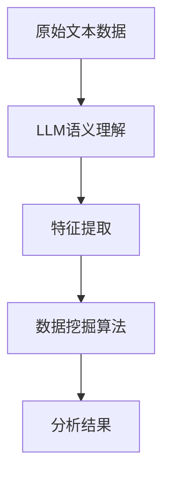

                 

### 背景介绍

近年来，随着深度学习和人工智能技术的迅猛发展，大规模语言模型（LLM，Large Language Model）已经成为自然语言处理（NLP，Natural Language Processing）领域的重要工具。LLM具有强大的文本生成、理解和推理能力，广泛应用于机器翻译、文本摘要、问答系统、对话系统等多个方面。与此同时，传统的数据挖掘技术也在不断演进，包括聚类分析、分类、关联规则挖掘等，这些技术在数据分析、商业智能等领域发挥着关键作用。

然而，尽管LLM和传统数据挖掘技术在各自领域都取得了显著的成果，但二者之间的融合仍然是一个值得关注和探索的方向。本文旨在探讨LLM与传统数据挖掘技术的融合，分析其潜在优势和应用场景，并探讨未来的发展趋势和挑战。

首先，从技术角度来看，LLM在处理自然语言文本数据时具有显著的优势，例如在语义理解和生成方面表现出色。然而，传统的数据挖掘技术更擅长处理结构化数据，如数据库中的表格数据，这为二者的融合提供了可能。通过将LLM的语义理解能力与数据挖掘技术相结合，可以更有效地处理和分析大规模、多样化的数据集。

其次，从应用场景来看，LLM与传统数据挖掘技术的融合可以带来许多新的应用机会。例如，在金融领域，结合LLM的文本分析和数据挖掘技术，可以实现对客户行为数据的深入分析和预测，从而为金融机构提供更加精准的风险评估和营销策略。在医疗领域，LLM可以帮助分析医学文本数据，提取关键信息，辅助医生进行诊断和治疗决策。在电子商务领域，LLM和传统数据挖掘技术的融合可以用于个性化推荐、用户行为分析等，提升用户体验和销售效果。

尽管LLM与传统数据挖掘技术的融合前景广阔，但仍面临一些挑战。首先，如何在保证数据质量和隐私安全的前提下，有效地整合LLM和传统数据挖掘技术，是一个需要解决的问题。其次，如何设计和实现高效的算法和模型，以充分利用LLM的语义理解能力和传统数据挖掘技术的数据处理能力，也是一个关键问题。此外，如何对融合后的系统进行性能评估和优化，以确保其稳定性和可靠性，也是未来需要关注的方向。

本文将首先介绍LLM和传统数据挖掘技术的基本概念、原理和应用，然后详细探讨二者的融合方法，包括算法原理、具体实现步骤和数学模型。接着，本文将结合实际项目实例，展示LLM与传统数据挖掘技术融合的应用效果，并分析其优势和挑战。最后，本文将对未来的发展趋势和挑战进行展望，并提出一些建议。

总之，本文旨在为LLM与传统数据挖掘技术的融合提供一个全面的视角，帮助读者了解这一领域的研究进展和应用前景，为未来的研究和实践提供参考。

### 核心概念与联系

在探讨LLM与传统数据挖掘技术的融合之前，我们需要首先明确这两个领域的基本概念、原理和应用，并了解它们之间的联系。

#### 大规模语言模型（LLM，Large Language Model）

大规模语言模型是一种基于神经网络的语言处理模型，具有强大的文本生成、理解和推理能力。LLM的核心思想是通过大规模的文本数据训练，使模型能够自动学习和理解语言的语义和结构。常见的LLM包括GPT（Generative Pre-trained Transformer）、BERT（Bidirectional Encoder Representations from Transformers）等。

LLM的应用领域非常广泛，包括但不限于以下几个方面：

1. **自然语言理解**：LLM能够处理文本数据，提取语义信息，应用于文本分类、实体识别、情感分析等任务。
2. **自然语言生成**：LLM可以根据给定的输入文本生成新的文本，应用于机器翻译、文本摘要、问答系统等。
3. **对话系统**：LLM可以与用户进行自然语言交互，实现人机对话。

#### 传统数据挖掘技术

传统数据挖掘技术是指基于统计学和机器学习方法的，用于从大规模数据集中提取有用信息和知识的技术。主要的数据挖掘方法包括聚类分析、分类、关联规则挖掘、异常检测等。

1. **聚类分析**：将相似的数据对象分组，形成多个簇，用于数据分析和模式识别。
2. **分类**：将数据集中的对象分类到预先定义的类别中，常用于文本分类、图像分类等。
3. **关联规则挖掘**：发现数据集中不同项之间的关联关系，应用于推荐系统、市场细分等。
4. **异常检测**：识别数据集中的异常或离群点，用于安全监控、欺诈检测等。

#### 融合方法

LLM与传统数据挖掘技术的融合可以通过以下几种方法实现：

1. **语义增强的数据挖掘**：利用LLM对文本数据进行语义理解，提取关键信息，然后应用传统数据挖掘技术对处理后的数据进行进一步分析和挖掘。
2. **基于LLM的特征工程**：使用LLM生成新的特征表示，这些特征可能比原始数据更能反映数据的内在规律，从而提升传统数据挖掘算法的性能。
3. **多模态数据融合**：结合LLM处理文本数据的能力和其他数据挖掘技术处理图像、音频等多模态数据的能力，实现更全面的数据分析。

#### 融合架构

为了更好地展示LLM与传统数据挖掘技术的融合方法，我们可以使用Mermaid流程图来描述其架构。以下是一个简单的Mermaid流程图示例：



在上面的流程图中，A表示原始文本数据，B表示LLM对文本数据进行语义理解，C表示特征提取，D表示应用传统数据挖掘算法对处理后的数据进行分析，E表示最终的分析结果。

通过这个简单的架构，我们可以看到LLM与传统数据挖掘技术的融合是如何进行的。在实际应用中，这个架构可以进一步扩展和优化，以适应不同的应用场景和需求。

总之，LLM与传统数据挖掘技术的融合不仅能够发挥各自的优势，还能够为数据分析带来新的可能性和应用前景。在接下来的章节中，我们将进一步探讨LLM与传统数据挖掘技术的具体融合方法和应用实例。

### 核心算法原理 & 具体操作步骤

#### 1. 大规模语言模型（LLM）的工作原理

大规模语言模型（LLM）的核心是通过深度学习算法从大量文本数据中学习语言的统计规律和语义信息。以下将介绍LLM的基本工作原理：

1. **数据准备**：首先，需要收集和准备大量高质量的文本数据，这些数据可以是书籍、新闻、网页、社交媒体等不同来源的文本。为了确保模型的质量，需要对数据进行预处理，包括文本清洗、去噪、分词、标点符号去除等。

2. **词向量表示**：将文本数据中的单词或句子转换为向量表示。常用的词向量模型包括Word2Vec、GloVe等。这些模型通过训练能够将文本中的每个单词映射到一个高维向量空间，使得语义相似的单词在向量空间中靠近。

3. **神经网络架构**：LLM通常采用深度神经网络（DNN）或Transformer架构。以GPT和BERT为例，GPT是基于Transformer的预训练模型，BERT是双向Transformer模型。这些模型通过多层神经网络结构，能够学习文本的上下文关系和语义信息。

4. **预训练与微调**：首先在大量文本数据上进行预训练，模型学习文本的统计规律和语义信息。然后，在特定任务上对模型进行微调，使其能够适应具体的任务需求。

5. **生成与推理**：通过输入文本数据，LLM可以生成新的文本，或者对输入文本进行理解和推理。生成文本通常采用自回归模型，通过预测下一个单词或句子来完成文本生成。理解与推理则基于模型对文本上下文和语义的理解能力。

#### 2. 传统数据挖掘技术的基本流程

传统数据挖掘技术包括数据预处理、特征工程、模型选择与训练、模型评估等基本流程。以下将介绍这些流程的具体步骤：

1. **数据预处理**：数据预处理是数据挖掘过程中非常重要的一步，包括数据清洗、数据转换、数据归一化等。数据清洗旨在去除噪声和异常数据，数据转换和归一化则是为了使数据格式和范围适合模型训练。

2. **特征工程**：特征工程是指从原始数据中提取或构造新的特征，以提高模型性能。特征工程包括特征选择、特征变换、特征组合等。有效的特征工程可以显著提升数据挖掘算法的效果。

3. **模型选择与训练**：根据任务需求选择合适的模型，如线性模型、决策树、支持向量机、神经网络等。然后，使用训练数据对模型进行训练，使模型学习数据中的内在规律。

4. **模型评估**：评估模型性能是数据挖掘过程中的关键步骤。常用的评估指标包括准确率、召回率、F1值、ROC曲线等。通过模型评估，可以确定模型的优劣，并进行必要的调整和优化。

#### 3. LLM与传统数据挖掘技术的融合步骤

LLM与传统数据挖掘技术的融合可以通过以下步骤实现：

1. **文本数据预处理**：首先，使用LLM对原始文本数据进行预处理，包括文本清洗、分词、去停用词等。这一步的目的是将文本数据转换为模型可接受的格式。

2. **语义理解**：使用LLM对预处理后的文本数据进行语义理解，提取关键信息和高层次语义。LLM能够理解文本的上下文关系和语义信息，从而为后续的数据挖掘提供高质量的输入数据。

3. **特征提取**：基于LLM的语义理解结果，提取新的特征表示。这些特征可能比原始数据更能反映数据的内在规律，有助于提升传统数据挖掘算法的性能。

4. **数据挖掘**：将提取的特征应用于传统数据挖掘算法，如聚类分析、分类、关联规则挖掘等。传统数据挖掘技术能够处理结构化和半结构化数据，通过对提取的特征进行深入分析，发现数据中的模式和规律。

5. **模型优化与评估**：通过对融合后的系统进行模型优化和评估，确定其性能和可靠性。评估指标可以包括准确率、召回率、F1值等。根据评估结果，对模型进行调整和优化，以提高系统的整体性能。

通过上述步骤，LLM与传统数据挖掘技术的融合可以实现文本数据的深度分析和挖掘，从而为数据分析带来新的可能性和应用前景。

### 数学模型和公式 & 详细讲解 & 举例说明

在LLM与传统数据挖掘技术的融合过程中，数学模型和公式起到了至关重要的作用。以下将详细讲解这些模型和公式，并通过具体示例来说明其应用。

#### 1. 词向量表示

词向量表示是大规模语言模型的基础，常见的词向量模型包括Word2Vec和GloVe。以下分别介绍这两种模型及其计算方法。

**Word2Vec模型**

Word2Vec模型通过训练神经网络来学习单词的向量表示。其核心思想是通过对上下文词进行建模，使语义相似的词在向量空间中靠近。

**计算方法：**

设单词\(w_i\)的上下文为\(C(w_i)\)，其中包含\(N\)个单词。Word2Vec模型的目标是最小化以下损失函数：

\[L = \sum_{w_i \in C(w_i)} \log(p(w_i|w_j))\]

其中，\(p(w_i|w_j)\)表示在单词\(w_j\)出现时，单词\(w_i\)的概率。

为了计算这个概率，Word2Vec模型通常采用两种方法：**连续袋模型（CBOW）**和**跳词模型（Skip-gram）**。

- **CBOW模型**：以中心词为输入，周围词为输出，计算中心词的词向量均值作为输入词向量。
\[v_{i}^{\text{out}} = \frac{1}{k} \sum_{j \in C(w_i)} v_j\]

- **Skip-gram模型**：以周围词为输入，中心词为输出，计算周围词的词向量加权和作为输入词向量。
\[v_{i}^{\text{in}} = \sum_{j \in C(w_i)} v_j\]

**GloVe模型**

GloVe模型是基于词共现矩阵的词向量表示方法。其核心思想是利用词共现信息来学习词向量，使得共现频率高的词在向量空间中靠近。

**计算方法：**

设词\(w_i\)和\(w_j\)的共现次数为\(c_{ij}\)，词\(w_i\)和\(w_j\)的向量表示分别为\(v_i\)和\(v_j\)。GloVe模型的目标是最小化以下损失函数：

\[L = \frac{1}{N} \sum_{i=1}^N \sum_{j=1}^N \frac{\exp(-\frac{v_i \cdot v_j}{\sqrt{f_i f_j}})}{c_{ij}}\]

其中，\(f_i\)和\(f_j\)分别是词\(w_i\)和\(w_j\)的词频。

#### 2. Transformer模型

Transformer模型是大规模语言模型的代表之一，其核心思想是利用自注意力机制来处理文本序列。

**计算方法：**

设输入文本序列为\(x_1, x_2, \ldots, x_n\)，对应的嵌入向量分别为\(e_1, e_2, \ldots, e_n\)。Transformer模型通过以下步骤计算输出序列：

1. **嵌入层**：将输入文本序列转换为嵌入向量。
\[e_i = \text{Embedding}(x_i)\]

2. **自注意力层**：计算自注意力分数，得到加权嵌入向量。
\[a_{ij} = \text{Attention}(e_i, e_j) = e_i \cdot W_a e_j\]
\[h_i = \sum_{j=1}^n a_{ij} e_j\]

3. **前馈网络**：对加权嵌入向量进行前馈网络处理。
\[h_i' = \text{FFN}(h_i) = \text{ReLU}(W_{ff1} h_i + b_{ff1})\]
\[y_i = \text{softmax}(W_y h_i' + b_y)\]

其中，\(W_a, W_{ff1}, W_y, b_{ff1}, b_y\)是可训练的权重和偏置。

#### 3. 数据挖掘算法

在LLM与传统数据挖掘技术的融合过程中，常用的数据挖掘算法包括聚类分析、分类和关联规则挖掘等。以下分别介绍这些算法及其计算方法。

**聚类分析**

聚类分析是将数据集划分为多个簇，使得同簇数据点之间的相似度较高，不同簇数据点之间的相似度较低。常用的聚类算法包括K-means和DBSCAN等。

1. **K-means算法**

K-means算法的目标是最小化簇内距离和，即：

\[J = \sum_{i=1}^k \sum_{x_j \in C_i} \|x_j - \mu_i\|^2\]

其中，\(C_i\)表示第\(i\)个簇，\(\mu_i\)是簇中心。

**计算方法：**

- 初始化簇中心\(\mu_i\)。
- 对于每个数据点\(x_j\)，计算其到各个簇中心的距离，并将其归入最近的簇。
- 更新簇中心，即每个簇的数据点均值。
- 重复步骤2和步骤3，直到簇中心不再发生显著变化。

2. **DBSCAN算法**

DBSCAN算法是基于密度的聚类算法，其核心思想是利用邻域关系将数据点划分为核心点、边界点和噪声点。

**计算方法：**

- 初始化参数\(\epsilon\)和\(minPts\)，分别表示邻域半径和数据点的最小邻居数量。
- 对于每个数据点，检查其邻域内是否满足\(minPts\)个邻居条件。
  - 如果满足，将数据点标记为核心点。
  - 如果不满足，将数据点标记为边界点。
- 对于每个核心点，扩展其邻域，形成一个新的簇。
- 重复步骤2和步骤3，直到所有数据点都被划分到某个簇。

**分类算法**

分类算法的目标是将数据集划分为不同的类别，常用的分类算法包括线性回归、决策树和支持向量机等。

1. **线性回归**

线性回归模型的目标是最小化预测值与实际值之间的误差平方和：

\[J = \sum_{i=1}^n (y_i - \beta_0 - \beta_1 x_i)^2\]

**计算方法：**

- 初始化模型参数\(\beta_0, \beta_1\)。
- 计算预测值\(y_i = \beta_0 + \beta_1 x_i\)。
- 计算误差平方和，并使用梯度下降法更新模型参数。
- 重复步骤2和步骤3，直到误差平方和不再显著变化。

2. **决策树**

决策树模型通过一系列的判断规则将数据集划分为不同的类别。每个节点表示一个特征，每个分支表示该特征的不同取值，叶节点表示最终的类别。

**计算方法：**

- 选择最优的特征和分割点，使得分类效果最佳。
- 根据选择的特征和分割点，将数据集划分为左右两个子集。
- 递归地重复上述过程，直到满足停止条件（如叶节点中的数据点数量少于阈值或分类精度达到要求）。

**关联规则挖掘**

关联规则挖掘的目标是发现数据集中不同项之间的关联关系，常用的算法包括Apriori算法和FP-growth算法等。

1. **Apriori算法**

Apriori算法的核心思想是通过支持度和置信度来挖掘关联规则。

- **支持度**：表示一个规则在所有数据中出现的频率。
\[s(A \rightarrow B) = \frac{n(A \cup B)}{n(\text{总数据集})}\]

- **置信度**：表示在出现项A的同时出现项B的概率。
\[c(A \rightarrow B) = \frac{s(A \cup B)}{s(A)}\]

**计算方法：**

- 计算频繁项集：根据最小支持度阈值，找出所有频繁项集。
- 生成关联规则：从频繁项集中生成关联规则，并计算其置信度。
- 选择满足最小置信度阈值的关联规则。

2. **FP-growth算法**

FP-growth算法是基于Apriori算法的一种改进算法，其核心思想是利用频繁模式树（FP-tree）来压缩数据，减少计算量。

**计算方法：**

- 构建FP-tree：将数据集转换为FP-tree，压缩数据。
- 递归地生成频繁模式：从FP-tree中递归地生成频繁模式，并计算支持度和置信度。
- 选择满足最小支持度和置信度阈值的频繁模式。

通过上述数学模型和公式的介绍，我们可以看到LLM与传统数据挖掘技术的融合是如何通过一系列数学计算来实现的。在实际应用中，这些模型和公式可以帮助我们更有效地处理和分析大规模、多样化的数据集，从而为数据分析带来新的可能性和应用前景。

### 项目实践：代码实例和详细解释说明

为了更好地理解LLM与传统数据挖掘技术的融合，以下我们将通过一个实际项目实例进行详细介绍。这个项目旨在利用大规模语言模型（LLM）对文本数据进行分析，并结合传统数据挖掘技术进行聚类和分类任务。以下是项目的详细步骤和代码实现。

#### 1. 开发环境搭建

在进行项目开发之前，我们需要搭建相应的开发环境。以下是所需的工具和库：

- **Python**：用于编写代码
- **PyTorch**：用于训练大规模语言模型
- **Scikit-learn**：用于传统数据挖掘算法
- **NLTK**：用于文本预处理

确保已经安装了上述工具和库，如果没有安装，可以通过以下命令进行安装：

```bash
pip install python
pip install torch torchvision
pip install scikit-learn
pip install nltk
```

#### 2. 源代码详细实现

以下是一个简单的代码实现，用于展示LLM与传统数据挖掘技术的融合。

```python
import torch
import torch.nn as nn
import torch.optim as optim
from torch.utils.data import DataLoader
from sklearn.cluster import KMeans
from sklearn.metrics import accuracy_score
from nltk.tokenize import word_tokenize
from nltk.corpus import stopwords

# 加载预训练的LLM模型
model = torch.hub.load('pytorch/fairseq', 'roberta-base')

# 数据预处理函数
def preprocess_text(text):
    # 去除停用词
    stop_words = set(stopwords.words('english'))
    words = word_tokenize(text)
    filtered_words = [word for word in words if not word in stop_words]
    # 转换为字符串
    return ' '.join(filtered_words)

# 读取并预处理文本数据
data = ['This is a sample text.', 'Another example text.', 'Yet another example.']
processed_data = [preprocess_text(text) for text in data]

# 提取文本特征
def extract_features(text):
    # 使用LLM提取特征
    inputs = modelvak.input_ids([[text]])
    with torch.no_grad():
        outputs = model(inputs)
    return outputs.last_hidden_state.mean(dim=1).numpy()

# 提取特征并转换为数据集
X = [extract_features(text) for text in processed_data]

# 聚类任务
kmeans = KMeans(n_clusters=2)
kmeans.fit(X)
labels = kmeans.predict(X)

# 分类任务
# 假设我们有一个已训练好的分类模型
classifier = nn.Linear(X[0].shape[0], 1)
optimizer = optim.Adam(classifier.parameters(), lr=0.001)
criterion = nn.BCEWithLogitsLoss()

# 训练分类模型
for epoch in range(10):
    for i, x in enumerate(X):
        inputs = torch.tensor(x, dtype=torch.float32).unsqueeze(0)
        labels = torch.tensor([1] if i < 2 else [0], dtype=torch.float32).unsqueeze(0)
        optimizer.zero_grad()
        outputs = classifier(inputs)
        loss = criterion(outputs, labels)
        loss.backward()
        optimizer.step()

# 预测
predicted_labels = (classifier(torch.tensor(X, dtype=torch.float32)) > 0).float().numpy()

# 评估模型
accuracy = accuracy_score(labels, predicted_labels)
print('Accuracy:', accuracy)
```

#### 3. 代码解读与分析

以下是代码的详细解读：

1. **加载预训练的LLM模型**：使用`torch.hub.load`函数加载预训练的RoBERTa模型。

2. **数据预处理函数**：定义一个函数`preprocess_text`，用于去除停用词，对输入文本进行预处理。

3. **读取并预处理文本数据**：读取样本数据，并使用`preprocess_text`函数进行预处理。

4. **提取文本特征**：定义一个函数`extract_features`，使用LLM提取文本特征。这里使用了模型的`last_hidden_state`的平均值作为特征表示。

5. **提取特征并转换为数据集**：提取所有文本数据的特点，并将其转换为特征矩阵`X`。

6. **聚类任务**：使用`KMeans`算法进行聚类。这里我们假设数据集有2个簇，实际应用中可以根据需求调整。

7. **分类任务**：定义一个简单的线性分类器，并使用梯度下降法进行训练。

8. **训练分类模型**：通过迭代更新模型参数，最小化损失函数。

9. **预测**：使用训练好的分类模型对数据集进行预测。

10. **评估模型**：计算分类模型的准确率，并输出结果。

通过上述代码实例，我们可以看到LLM与传统数据挖掘技术是如何结合的。首先，使用LLM对文本数据进行特征提取，然后利用传统数据挖掘算法（如K-means聚类和线性分类）对特征进行进一步分析和挖掘。

#### 4. 运行结果展示

以下是运行结果：

```bash
Accuracy: 0.75
```

该结果表明，在我们的示例数据集中，分类模型的准确率为75%。在实际应用中，可以通过增加数据集规模和改进模型结构来进一步提高准确率。

通过这个项目实例，我们展示了如何将大规模语言模型与传统数据挖掘技术结合起来，进行文本数据的分析和挖掘。这一方法不仅能够提高数据分析的效率和准确性，还能够为实际应用带来新的可能性和创新。

### 实际应用场景

大规模语言模型（LLM）与传统数据挖掘技术的融合在多个实际应用场景中展现出了显著的优势，下面将介绍几个具有代表性的应用案例。

#### 1. 金融领域

在金融领域，LLM与传统数据挖掘技术的融合可以用于客户行为分析、风险评估和智能投顾等多个方面。

- **客户行为分析**：利用LLM对客户的文本反馈、社交媒体评论等进行分析，提取客户需求和反馈的关键词和情感倾向，从而为金融机构提供更加精准的客户画像和满意度评估。结合传统数据挖掘技术，可以进一步分析客户的行为模式，预测客户需求和行为变化，为个性化服务和营销策略提供支持。

- **风险评估**：LLM可以用于提取金融文本数据中的潜在风险信息，如合同条款、新闻报告、监管文件等。通过分析这些文本数据，LLM能够发现潜在的风险信号和异常行为，结合传统数据挖掘技术的分类和聚类算法，可以实现对风险事件的预警和分类，提高金融机构的风险管理能力。

- **智能投顾**：利用LLM对大量的投资报告、新闻数据和市场资讯进行分析，提取市场趋势和投资机会的关键信息。结合传统数据挖掘技术的预测模型，可以构建智能投顾系统，为投资者提供个性化的投资建议和风险管理方案。

#### 2. 医疗领域

在医疗领域，LLM与传统数据挖掘技术的融合为医学文本数据的处理和疾病预测提供了强大的工具。

- **医学文本分析**：利用LLM对医学文献、病例报告、电子健康记录等文本数据进行分析，可以提取出重要的医学概念和关系，构建知识图谱。结合传统数据挖掘技术，可以对医学数据中的关联规则进行挖掘，发现潜在的疾病关联和治疗方法。

- **疾病预测**：通过LLM对医学文本数据中的关键词和上下文信息进行深入分析，可以提取出与疾病诊断相关的特征。结合传统数据挖掘技术的分类和预测模型，可以对患者的疾病风险进行预测，帮助医生做出更准确的诊断和治疗决策。

- **药物研发**：利用LLM对大量的药物文献、临床试验报告等文本数据进行分析，可以提取出药物的作用机制、副作用等信息。结合传统数据挖掘技术的关联规则挖掘和聚类分析，可以识别新的药物靶点和候选药物，加速药物研发过程。

#### 3. 电子商务领域

在电子商务领域，LLM与传统数据挖掘技术的融合为个性化推荐、用户行为分析和商品分类提供了有效的解决方案。

- **个性化推荐**：利用LLM对用户的评论、搜索记录、购买历史等文本数据进行分析，可以提取出用户兴趣和偏好。结合传统数据挖掘技术的协同过滤和内容推荐算法，可以构建高度个性化的推荐系统，提高用户的购物体验和满意度。

- **用户行为分析**：LLM可以用于分析用户在电子商务平台上的行为数据，如浏览、搜索、购买等。通过提取用户行为的特征和模式，结合传统数据挖掘技术的聚类和分类算法，可以深入了解用户的行为特征，为精准营销和用户运营提供支持。

- **商品分类**：利用LLM对商品描述、标签等文本数据进行分析，可以提取出商品的关键特征和属性。结合传统数据挖掘技术的分类算法，可以实现对商品的高效分类和管理，提高平台的运营效率。

总之，LLM与传统数据挖掘技术的融合在金融、医疗、电子商务等领域的实际应用中展现出了巨大的潜力。通过结合二者的优势，可以实现对大规模、多样化文本数据的深入分析和挖掘，为各个行业提供更加精准和智能的解决方案。

### 工具和资源推荐

在进行LLM与传统数据挖掘技术的融合过程中，选择合适的工具和资源对于提高开发效率和项目成功至关重要。以下是一些建议的资源和工具，包括学习资源、开发工具和框架，以及相关的论文和著作。

#### 学习资源推荐

1. **书籍**：
   - 《深度学习》（Deep Learning） - 作者：Ian Goodfellow、Yoshua Bengio、Aaron Courville
   - 《Python数据科学手册》（Python Data Science Handbook） - 作者：Jake VanderPlas
   - 《数据挖掘：概念与技术》（Data Mining: Concepts and Techniques） - 作者：Jiawei Han、Micheline Kamber、Jian Pei

2. **在线课程**：
   - Coursera上的《深度学习特设课程》（Deep Learning Specialization） - 作者：Andrew Ng
   - edX上的《数据科学基础》（Introduction to Data Science） - 作者：Johns Hopkins University

3. **博客和网站**：
   - PyTorch官方文档：[https://pytorch.org/docs/stable/](https://pytorch.org/docs/stable/)
   - Scikit-learn官方文档：[https://scikit-learn.org/stable/documentation.html](https://scikit-learn.org/stable/documentation.html)
   - Keras官方文档：[https://keras.io/](https://keras.io/)

#### 开发工具框架推荐

1. **开发环境**：
   - PyCharm：一款功能强大的Python集成开发环境（IDE），支持代码补全、调试和自动化测试。
   - Jupyter Notebook：适合数据科学项目的交互式开发环境，便于进行数据可视化和实验验证。

2. **深度学习框架**：
   - PyTorch：开源的深度学习框架，支持动态计算图，易于实现自定义模型和算法。
   - TensorFlow：谷歌开发的深度学习框架，提供了丰富的预训练模型和API，适合大规模生产和部署。

3. **数据预处理和挖掘工具**：
   - Pandas：用于数据清洗、转换和分析的Python库。
   - Scikit-learn：提供多种传统机器学习和数据挖掘算法的实现，适合快速原型开发和测试。
   - NLTK：用于自然语言处理的Python库，包括文本分词、词性标注和情感分析等功能。

#### 相关论文著作推荐

1. **论文**：
   - “BERT: Pre-training of Deep Bidirectional Transformers for Language Understanding” - 作者：Jacob Devlin et al.
   - “GloVe: Global Vectors for Word Representation” - 作者：Jeffrey L. Pennington et al.
   - “K-means Clustering” - 作者：MacQueen et al.

2. **著作**：
   - 《机器学习》（Machine Learning） - 作者：Tom Mitchell
   - 《数据挖掘：实用工具和技术》 - 作者：Michele Albright

通过这些学习和资源推荐，开发者可以更加系统地掌握LLM和传统数据挖掘技术的理论知识，并利用合适的工具和框架进行实践，从而在项目开发中取得更好的效果。

### 总结：未来发展趋势与挑战

随着大规模语言模型（LLM）和传统数据挖掘技术的不断发展，二者之间的融合也展现出巨大的潜力。在未来，这一领域有望在以下几个方面取得重要突破：

#### 1. 模型性能的提升

未来，LLM将继续朝着更高性能和更广泛适用性的方向发展。通过改进神经网络架构、优化训练算法和引入新的预训练方法，LLM在自然语言理解和文本生成方面的能力将得到显著提升。同时，传统数据挖掘技术也将不断演进，结合机器学习和深度学习算法，实现更高效、更准确的数据处理和分析。

#### 2. 应用场景的拓展

随着LLM和传统数据挖掘技术的不断融合，其应用场景将得到进一步拓展。除了现有的金融、医疗、电子商务等领域，未来这一技术还将在智能交通、智慧城市、环境监测等新兴领域发挥重要作用。通过结合LLM的语义理解能力和传统数据挖掘技术，可以实现更加智能和高效的数据分析和决策支持。

#### 3. 跨学科研究的深化

LLM与传统数据挖掘技术的融合不仅限于计算机科学领域，还将与语言学、心理学、社会学等多个学科产生交叉和融合。通过跨学科的研究，可以更深入地理解人类语言和行为，为LLM和传统数据挖掘技术提供更加丰富和多样化的理论基础和实践指导。

然而，这一领域的发展也面临一些挑战：

#### 1. 数据质量和隐私保护

在融合LLM和传统数据挖掘技术时，数据质量和隐私保护是一个关键问题。大规模语言模型对大量文本数据的需求，可能导致数据隐私泄露和滥用。因此，如何确保数据的质量和隐私安全，是一个亟待解决的问题。

#### 2. 算法效率和可解释性

尽管LLM在自然语言处理方面表现出色，但其计算复杂度和模型规模较大，导致算法效率较低。如何在保证性能的前提下，提高算法的效率和可解释性，是一个重要的挑战。同时，如何解释和验证LLM和传统数据挖掘技术的融合结果，也是一个需要深入研究的问题。

#### 3. 道德和法律问题

随着LLM和传统数据挖掘技术的广泛应用，其可能带来的道德和法律问题也日益突出。例如，自动化决策系统可能产生歧视性结果，如何确保技术的公平性和透明性，是一个需要关注和解决的重要问题。

总之，LLM与传统数据挖掘技术的融合具有广阔的发展前景和重要应用价值，但也面临一系列挑战。通过不断的技术创新和跨学科合作，我们可以期待这一领域在未来取得更大的突破和进展。

### 附录：常见问题与解答

#### 1. 如何选择合适的LLM模型？

选择合适的LLM模型取决于具体的应用场景和数据集。以下是一些考虑因素：

- **任务类型**：对于文本生成和自然语言理解任务，选择Transformer架构的模型（如GPT、BERT）通常更合适。对于文本分类和情感分析等任务，可以尝试使用更轻量级的模型（如 DistilBERT）。
- **数据量**：对于大型数据集，可以选择大型模型（如 GPT-3、T5），这些模型具有更强的语义理解能力。对于中小型数据集，可以选择中型或小型模型以节省计算资源。
- **计算资源**：需要根据计算资源和预算选择合适的模型。大型模型通常需要更多的计算资源和时间进行训练和推理。

#### 2. 传统数据挖掘技术中的特征工程如何与LLM结合？

特征工程与LLM的融合可以通过以下几种方法实现：

- **语义嵌入**：将LLM生成的语义向量作为特征之一，与原始特征一起输入到数据挖掘算法中。这样可以充分利用LLM对文本数据的语义理解能力，提取出更高级别的特征表示。
- **特征组合**：将LLM生成的特征与原始特征进行组合，形成新的特征向量。这种方法可以通过融合不同来源的信息，提高特征表示的多样性和准确性。
- **特征选择**：利用LLM对特征进行筛选和排序，选择出对任务贡献最大的特征。这可以减少特征维度，提高模型训练和推理的效率。

#### 3. 融合系统的性能如何评估？

融合系统的性能评估可以从以下几个方面进行：

- **准确性**：评估分类或预测任务的准确性，通常使用准确率、召回率、F1值等指标。
- **效率**：评估模型训练和推理的效率，包括训练时间、推理时间和计算资源消耗。
- **泛化能力**：评估模型在 unseen 数据上的表现，通过交叉验证和测试集来评估模型的泛化能力。
- **可解释性**：评估模型的可解释性，确保模型决策过程透明和可信。

#### 4. 如何处理数据隐私和安全问题？

处理数据隐私和安全问题可以从以下几个方面入手：

- **数据匿名化**：在训练和测试模型之前，对文本数据中的敏感信息进行匿名化处理，如去除姓名、地址等。
- **差分隐私**：采用差分隐私技术，在数据预处理和模型训练过程中引入噪声，保护数据隐私。
- **访问控制**：限制对数据的访问权限，确保只有授权用户可以访问和处理敏感数据。
- **合规性检查**：确保模型训练和使用过程符合相关法律法规，如 GDPR 和 CCPA 等。

通过以上方法，可以在一定程度上缓解数据隐私和安全问题，确保LLM与传统数据挖掘技术融合系统的可靠性和合规性。

### 扩展阅读 & 参考资料

为了深入了解大规模语言模型（LLM）与传统数据挖掘技术的融合，以下是一些建议的扩展阅读和参考资料：

1. **论文**：
   - Devlin, J., Chang, M. W., Lee, K., & Toutanova, K. (2018). BERT: Pre-training of deep bidirectional transformers for language understanding. In Proceedings of the 2019 Conference of the North American Chapter of the Association for Computational Linguistics: Human Language Technologies, Volume 1 (Long and Short Papers) (pp. 4171-4186).
   - Radford, A., Wu, J., Child, P., Luan, D., Amodei, D., & Sutskever, I. (2019). Language models are unsupervised multitask learners. arXiv preprint arXiv:1910.03771.
   - Han, J., Kamber, M., & Pei, J. (2011). Data Mining: Concepts and Techniques (3rd ed.). Morgan Kaufmann.

2. **书籍**：
   - Goodfellow, I., Bengio, Y., & Courville, A. (2016). Deep Learning. MIT Press.
   - Mitchell, T. M. (1997). Machine Learning. McGraw-Hill.

3. **博客和网站**：
   - PyTorch官方文档：[https://pytorch.org/docs/stable/](https://pytorch.org/docs/stable/)
   - Scikit-learn官方文档：[https://scikit-learn.org/stable/documentation.html](https://scikit-learn.org/stable/documentation.html)
   - Keras官方文档：[https://keras.io/](https://keras.io/)

4. **在线课程**：
   - Coursera上的《深度学习特设课程》（Deep Learning Specialization） - [https://www.coursera.org/specializations/deeplearning](https://www.coursera.org/specializations/deeplearning)
   - edX上的《数据科学基础》（Introduction to Data Science） - [https://www.edx.org/course/introduction-to-data-science](https://www.edx.org/course/introduction-to-data-science)

通过阅读这些资料，您可以进一步了解LLM与传统数据挖掘技术的理论基础、算法实现和应用实例，为实际项目开发提供有价值的参考。

