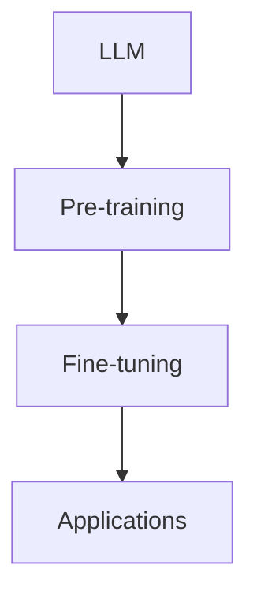

                 

### 1. 背景介绍

近年来，随着深度学习、自然语言处理（NLP）等技术的快速发展，大型语言模型（LLM）逐渐成为学术界和工业界的研究热点。LLM是一种能够理解和生成人类语言的复杂模型，通过训练大量的文本数据，它可以学会理解语言的结构和语义，并在各种任务中表现出色，如文本分类、机器翻译、问答系统等。这种强大的能力使得LLM在许多领域都显示出巨大的潜力。

然而，LLM的发展并非一帆风顺。早期的研究主要集中在小型语言模型上，这些模型由于参数规模有限，计算能力要求不高，可以在相对简单的环境中进行训练和部署。但随着时间的推移，研究人员逐渐意识到，要充分发挥LLM的潜力，需要开发更大规模、更复杂的模型。这引发了LLM产业链生态的蝶变，从无到有地构建起一个完整的生态系统。

本文将深入探讨LLM产业链生态的蝶变过程，从核心概念与联系、核心算法原理与具体操作步骤、数学模型与公式、项目实践、实际应用场景、工具和资源推荐等多个方面进行分析。希望通过对这些内容的详细讲解，让读者对LLM产业链生态有一个全面而深入的了解。

### 2. 核心概念与联系

要理解LLM产业链生态的蝶变，我们首先需要了解几个核心概念：大型语言模型（LLM）、预训练（Pre-training）和微调（Fine-tuning）。

#### 2.1 大型语言模型（LLM）

LLM，即Large Language Model，是一种能够处理和理解大规模文本数据的复杂模型。与传统的自然语言处理（NLP）方法相比，LLM具有更强的灵活性和鲁棒性，可以应对各种复杂的语言任务。LLM通常由多层神经网络构成，参数规模巨大，可以在大规模数据集上进行预训练，从而学习到丰富的语言知识。

#### 2.2 预训练（Pre-training）

预训练是LLM训练过程中的一个重要阶段。在这一阶段，模型在一个大规模的文本语料库上进行无监督训练，从而学习到文本的统计特征和语言规律。这种无监督的训练方式使得模型可以自动地提取语言的基本结构和语义信息，为后续的任务提供基础。

#### 2.3 微调（Fine-tuning）

微调是LLM训练的另一个关键环节。在预训练完成后，模型会被用于特定任务的数据集上进行微调，以适应具体的任务需求。微调的过程可以看作是对预训练模型的再训练，通过调整模型参数，使其在特定任务上达到更好的性能。

#### 2.4 核心概念之间的联系

LLM、预训练和微调这三个核心概念紧密相连，共同构成了LLM产业链生态的核心。

首先，LLM是整个生态系统的核心，它的强大能力和灵活性使得预训练和微调成为可能。没有LLM，预训练和微调将失去意义。

其次，预训练和微调是LLM训练的两个阶段，两者相辅相成。预训练为LLM提供了丰富的语言知识和基础，而微调则使LLM能够应对具体的任务需求，发挥其实际价值。

最后，LLM、预训练和微调共同推动了LLM产业链生态的蝶变。随着LLM技术的不断发展，预训练和微调方法也在不断优化，为LLM在各个领域的应用提供了更多的可能性。

#### 2.5 Mermaid 流程图

为了更直观地展示LLM产业链生态的核心概念和联系，我们可以使用Mermaid流程图进行描述。以下是一个简单的Mermaid流程图：



在这个流程图中，A表示LLM，B表示预训练，C表示微调，D表示实际应用。通过这个流程图，我们可以清晰地看到LLM产业链生态的核心环节和它们之间的联系。

### 3. 核心算法原理 & 具体操作步骤

#### 3.1 深度神经网络（DNN）

深度神经网络（DNN）是LLM的核心组成部分。DNN通过多层非线性变换，对输入数据进行特征提取和分类。在LLM中，DNN通常由多个隐藏层构成，每一层都能提取更高层次的特征。

#### 3.2 反向传播算法（Backpropagation）

反向传播算法是DNN训练过程中的一种重要算法。它通过计算输出误差，反向传播误差到每一层，从而更新模型参数。反向传播算法的核心步骤包括：

1. **前向传播**：将输入数据通过网络进行前向传播，得到输出结果。
2. **计算误差**：计算输出结果与真实标签之间的误差。
3. **反向传播**：将误差反向传播到每一层，计算每一层参数的梯度。
4. **更新参数**：根据梯度更新模型参数。

#### 3.3 预训练（Pre-training）

预训练是LLM训练的第一步。它通过在大规模文本数据集上无监督训练，使模型能够自动提取语言的基本结构和语义信息。预训练的具体操作步骤包括：

1. **数据预处理**：将文本数据转换为模型可处理的格式，如词向量或编码表示。
2. **构建模型**：设计并构建DNN模型，包括输入层、隐藏层和输出层。
3. **训练过程**：使用大规模文本数据集进行无监督训练，优化模型参数。
4. **模型评估**：在预训练过程中，定期评估模型性能，以便进行调整和优化。

#### 3.4 微调（Fine-tuning）

微调是在预训练的基础上，针对特定任务进行的有监督训练。微调的具体操作步骤包括：

1. **数据准备**：收集并准备用于微调的任务数据集。
2. **调整模型**：在预训练模型的基础上，调整模型的参数，以适应特定任务。
3. **训练过程**：使用任务数据集进行有监督训练，优化模型参数。
4. **模型评估**：在微调过程中，定期评估模型性能，以便进行调整和优化。

#### 3.5 整体流程

LLM的训练过程可以分为预训练和微调两个阶段。预训练阶段主要在大规模文本数据集上进行，使模型能够自动提取语言的基本结构和语义信息。微调阶段则针对特定任务进行有监督训练，使模型能够更好地适应任务需求。整体流程如下：

1. **数据收集与预处理**：收集并预处理大规模文本数据集。
2. **预训练**：使用预训练算法在大规模文本数据集上进行无监督训练，得到预训练模型。
3. **微调**：在预训练模型的基础上，针对特定任务进行有监督微调，得到任务特定的模型。
4. **模型评估**：评估模型的性能，包括在训练集和测试集上的表现。

通过上述核心算法原理和具体操作步骤，我们可以看到，LLM的训练过程是一个复杂但高度有效的过程，它通过预训练和微调两个阶段，使模型能够从大规模文本数据中学习到丰富的语言知识，并在各种任务中表现出色。

### 4. 数学模型和公式 & 详细讲解 & 举例说明

#### 4.1 深度神经网络（DNN）的数学模型

深度神经网络（DNN）是LLM的核心组成部分，其数学模型基于多层前向传播和反向传播算法。为了更好地理解DNN，我们首先需要了解以下几个基本概念：

1. **输入层（Input Layer）**：输入层是DNN的第一层，它接收外部输入数据。
2. **隐藏层（Hidden Layer）**：隐藏层位于输入层和输出层之间，负责对输入数据进行特征提取和变换。
3. **输出层（Output Layer）**：输出层是DNN的最后一层，它产生最终的输出结果。

在DNN中，每一层都包含多个神经元（或节点），每个神经元都与其他神经元相连，并通过权重（Weight）和偏置（Bias）进行连接。神经元的输出取决于输入值和相应权重、偏置的乘积。

#### 4.2 激活函数（Activation Function）

激活函数是DNN中的一个关键组件，它对神经元的输出进行非线性变换，使得DNN能够学习复杂的数据分布。常见的激活函数包括：

1. **Sigmoid 函数**：\( f(x) = \frac{1}{1 + e^{-x}} \)
2. **ReLU 函数**：\( f(x) = \max(0, x) \)
3. **Tanh 函数**：\( f(x) = \frac{e^x - e^{-x}}{e^x + e^{-x}} \)

这些激活函数具有不同的性质，适用于不同的应用场景。例如，ReLU函数在训练过程中可以有效避免神经元死亡问题，提高训练速度和模型性能。

#### 4.3 前向传播与反向传播

前向传播和反向传播是DNN训练过程中的两个关键步骤。

1. **前向传播**：在训练过程中，输入数据从输入层传递到输出层，每一层神经元的输出通过激活函数计算得到。具体计算过程如下：

\[ z^{(l)} = \sum_{i} w^{(l)}_{i}x^{(i)} + b^{(l)} \]
\[ a^{(l)} = \sigma(z^{(l)}) \]

其中，\( z^{(l)} \) 表示第 \( l \) 层神经元的输入值，\( w^{(l)}_{i} \) 表示第 \( l \) 层神经元与第 \( l-1 \) 层神经元之间的权重，\( b^{(l)} \) 表示第 \( l \) 层神经元的偏置，\( a^{(l)} \) 表示第 \( l \) 层神经元的输出值，\( \sigma \) 表示激活函数。

2. **反向传播**：在前向传播过程中，我们得到了输出层的输出结果。接下来，我们需要通过反向传播算法计算输出误差，并更新模型参数。具体计算过程如下：

\[ \delta^{(l)} = (a^{(l)} - y) \cdot \sigma^{'}(z^{(l)}) \]
\[ \Delta w^{(l)} = \alpha \cdot \delta^{(l)} \cdot a^{(l-1)} \]
\[ \Delta b^{(l)} = \alpha \cdot \delta^{(l)} \]

其中，\( \delta^{(l)} \) 表示第 \( l \) 层神经元的误差，\( y \) 表示实际输出标签，\( \alpha \) 表示学习率，\( \sigma^{'} \) 表示激活函数的导数。

#### 4.4 梯度下降（Gradient Descent）

梯度下降是DNN训练中常用的优化算法。它通过计算模型参数的梯度，并沿梯度方向更新参数，以最小化损失函数。具体计算过程如下：

\[ w^{(l)} = w^{(l)} - \alpha \cdot \nabla W \]
\[ b^{(l)} = b^{(l)} - \alpha \cdot \nabla B \]

其中，\( \nabla W \) 和 \( \nabla B \) 分别表示权重和偏置的梯度。

#### 4.5 举例说明

为了更好地理解DNN的数学模型，我们来看一个简单的例子。假设我们有一个两层的DNN，输入层有3个神经元，隐藏层有2个神经元，输出层有1个神经元。输入数据为 \( x = [1, 2, 3] \)，标签为 \( y = 0 \)。

1. **前向传播**：

\[ z^{(1)}_1 = w^{(1)}_{11} \cdot x_1 + w^{(1)}_{12} \cdot x_2 + w^{(1)}_{13} \cdot x_3 + b^{(1)}_1 \]
\[ z^{(1)}_2 = w^{(1)}_{21} \cdot x_1 + w^{(1)}_{22} \cdot x_2 + w^{(1)}_{23} \cdot x_3 + b^{(1)}_2 \]
\[ a^{(1)}_1 = \sigma(z^{(1)}_1) \]
\[ a^{(1)}_2 = \sigma(z^{(1)}_2) \]

\[ z^{(2)}_1 = w^{(2)}_{11} \cdot a^{(1)}_1 + w^{(2)}_{12} \cdot a^{(1)}_2 + b^{(2)}_1 \]
\[ a^{(2)}_1 = \sigma(z^{(2)}_1) \]

2. **计算误差**：

\[ \delta^{(2)}_1 = (a^{(2)}_1 - y) \cdot \sigma^{'}(z^{(2)}_1) \]

3. **反向传播**：

\[ \delta^{(1)}_1 = \delta^{(2)}_1 \cdot w^{(2)}_{11} \cdot \sigma^{'}(z^{(1)}_1) \]
\[ \delta^{(1)}_2 = \delta^{(2)}_1 \cdot w^{(2)}_{12} \cdot \sigma^{'}(z^{(1)}_2) \]

4. **更新参数**：

\[ \Delta w^{(2)}_{11} = \alpha \cdot \delta^{(2)}_1 \cdot a^{(1)}_1 \]
\[ \Delta w^{(2)}_{12} = \alpha \cdot \delta^{(2)}_1 \cdot a^{(1)}_2 \]
\[ \Delta b^{(2)}_1 = \alpha \cdot \delta^{(2)}_1 \]

\[ \Delta w^{(1)}_{11} = \alpha \cdot \delta^{(1)}_1 \cdot x_1 \]
\[ \Delta w^{(1)}_{12} = \alpha \cdot \delta^{(1)}_1 \cdot x_2 \]
\[ \Delta w^{(1)}_{13} = \alpha \cdot \delta^{(1)}_1 \cdot x_3 \]
\[ \Delta b^{(1)}_1 = \alpha \cdot \delta^{(1)}_1 \]

通过这个简单的例子，我们可以看到DNN的数学模型是如何工作的。在实际应用中，DNN的层数和神经元数量通常要大得多，但基本的原理是相同的。

### 5. 项目实践：代码实例和详细解释说明

在本节中，我们将通过一个具体的代码实例，详细解释如何构建和训练一个大型语言模型（LLM）。为了便于理解，我们将使用Python编程语言和PyTorch框架来完成这个项目。

#### 5.1 开发环境搭建

在开始编写代码之前，我们需要搭建一个合适的开发环境。以下是搭建环境的步骤：

1. **安装Python**：确保Python已经安装在你的系统上。我们建议使用Python 3.8或更高版本。

2. **安装PyTorch**：使用pip命令安装PyTorch。例如，使用以下命令安装PyTorch：

   ```bash
   pip install torch torchvision
   ```

3. **安装其他依赖**：除了PyTorch之外，我们还需要安装其他一些依赖，如Numpy和Pandas。可以使用以下命令进行安装：

   ```bash
   pip install numpy pandas
   ```

4. **创建虚拟环境**（可选）：为了保持项目依赖的独立性，我们可以创建一个虚拟环境。可以使用以下命令创建虚拟环境：

   ```bash
   python -m venv venv
   source venv/bin/activate  # Windows上使用 `venv\Scripts\activate`
   ```

#### 5.2 源代码详细实现

以下是构建和训练LLM的Python代码。为了便于理解，我们将代码分成几个部分进行解释。

```python
import torch
import torch.nn as nn
import torch.optim as optim
from torch.utils.data import DataLoader, Dataset
import numpy as np
import pandas as pd
from torchvision import transforms, datasets

# 5.2.1 数据预处理
class TextDataset(Dataset):
    def __init__(self, data, tokenizer, max_length):
        self.data = data
        self.tokenizer = tokenizer
        self.max_length = max_length

    def __len__(self):
        return len(self.data)

    def __getitem__(self, idx):
        text = self.data.iloc[idx]
        encoding = self.tokenizer.encode_plus(
            text,
            add_special_tokens=True,
            max_length=self.max_length,
            padding='max_length',
            truncation=True,
            return_attention_mask=True,
            return_tensors='pt',
        )
        return {
            'input_ids': encoding['input_ids'].squeeze(),
            'attention_mask': encoding['attention_mask'].squeeze()
        }

# 5.2.2 模型定义
class LLM(nn.Module):
    def __init__(self, vocab_size, hidden_size, num_layers, dropout):
        super(LLM, self).__init__()
        self.embedding = nn.Embedding(vocab_size, hidden_size)
        self.layers = nn.ModuleList([
            nn.Linear(hidden_size, hidden_size)
            for _ in range(num_layers)
        ])
        self.dropout = nn.Dropout(dropout)
        self.fc = nn.Linear(hidden_size, vocab_size)

    def forward(self, input_ids, attention_mask):
        embedded = self.embedding(input_ids)
        for layer in self.layers:
            embedded = self.dropout(layer(embedded))
        output = self.fc(embedded)
        return output

# 5.2.3 模型训练
def train(model, train_loader, val_loader, optimizer, criterion, num_epochs):
    model.train()
    for epoch in range(num_epochs):
        for batch in train_loader:
            optimizer.zero_grad()
            input_ids = batch['input_ids']
            attention_mask = batch['attention_mask']
            output = model(input_ids, attention_mask)
            loss = criterion(output.logits, batch['labels'])
            loss.backward()
            optimizer.step()
        print(f'Epoch [{epoch+1}/{num_epochs}], Loss: {loss.item():.4f}')

        # Validate the model
        model.eval()
        with torch.no_grad():
            for batch in val_loader:
                input_ids = batch['input_ids']
                attention_mask = batch['attention_mask']
                output = model(input_ids, attention_mask)
                val_loss = criterion(output.logits, batch['labels'])
                print(f'Validation Loss: {val_loss.item():.4f}')
        model.train()

# 5.2.4 主函数
def main():
    # Configuration
    device = torch.device("cuda" if torch.cuda.is_available() else "cpu")
    tokenizer = ...  # Load your tokenizer
    vocab_size = ...  # Set the vocabulary size
    hidden_size = 128
    num_layers = 2
    dropout = 0.1
    learning_rate = 0.001
    batch_size = 32
    num_epochs = 10
    max_length = 512

    # Load your dataset
    train_data = ...  # Load your training dataset
    val_data = ...  # Load your validation dataset

    # Create data loaders
    train_dataset = TextDataset(train_data, tokenizer, max_length)
    val_dataset = TextDataset(val_data, tokenizer, max_length)
    train_loader = DataLoader(train_dataset, batch_size=batch_size, shuffle=True)
    val_loader = DataLoader(val_dataset, batch_size=batch_size, shuffle=False)

    # Initialize the model
    model = LLM(vocab_size, hidden_size, num_layers, dropout)
    model.to(device)

    # Initialize the optimizer and criterion
    optimizer = optim.Adam(model.parameters(), lr=learning_rate)
    criterion = nn.CrossEntropyLoss()

    # Train the model
    train(model, train_loader, val_loader, optimizer, criterion, num_epochs)

if __name__ == '__main__':
    main()
```

#### 5.3 代码解读与分析

1. **数据预处理**：

   数据预处理是训练LLM的重要步骤。在这个例子中，我们定义了一个`TextDataset`类，用于将文本数据转换为PyTorch的`Dataset`对象。这个类实现了`__len__`和`__getitem__`方法，分别用于获取数据集的大小和特定数据项。

   ```python
   class TextDataset(Dataset):
       def __init__(self, data, tokenizer, max_length):
           self.data = data
           self.tokenizer = tokenizer
           self.max_length = max_length

       def __len__(self):
           return len(self.data)

       def __getitem__(self, idx):
           text = self.data.iloc[idx]
           encoding = self.tokenizer.encode_plus(
               text,
               add_special_tokens=True,
               max_length=self.max_length,
               padding='max_length',
               truncation=True,
               return_attention_mask=True,
               return_tensors='pt',
           )
           return {
               'input_ids': encoding['input_ids'].squeeze(),
               'attention_mask': encoding['attention_mask'].squeeze()
           }
   ```

2. **模型定义**：

   在这个例子中，我们定义了一个`LLM`类，用于构建LLM模型。模型由嵌入层、多个线性层、dropout层和输出层组成。嵌入层将词索引转换为词向量，线性层进行特征提取和变换，dropout层用于防止过拟合，输出层产生预测结果。

   ```python
   class LLM(nn.Module):
       def __init__(self, vocab_size, hidden_size, num_layers, dropout):
           super(LLM, self).__init__()
           self.embedding = nn.Embedding(vocab_size, hidden_size)
           self.layers = nn.ModuleList([
               nn.Linear(hidden_size, hidden_size)
               for _ in range(num_layers)
           ])
           self.dropout = nn.Dropout(dropout)
           self.fc = nn.Linear(hidden_size, vocab_size)

       def forward(self, input_ids, attention_mask):
           embedded = self.embedding(input_ids)
           for layer in self.layers:
               embedded = self.dropout(layer(embedded))
           output = self.fc(embedded)
           return output
   ```

3. **模型训练**：

   模型训练是训练LLM的核心步骤。在这个例子中，我们定义了一个`train`函数，用于迭代地训练模型。函数接收模型、训练数据加载器、验证数据加载器、优化器和损失函数作为输入。在每次迭代中，模型首先通过前向传播计算输出，然后通过反向传播计算损失，并更新模型参数。

   ```python
   def train(model, train_loader, val_loader, optimizer, criterion, num_epochs):
       model.train()
       for epoch in range(num_epochs):
           for batch in train_loader:
               optimizer.zero_grad()
               input_ids = batch['input_ids']
               attention_mask = batch['attention_mask']
               output = model(input_ids, attention_mask)
               loss = criterion(output.logits, batch['labels'])
               loss.backward()
               optimizer.step()
           print(f'Epoch [{epoch+1}/{num_epochs}], Loss: {loss.item():.4f}')

           # Validate the model
           model.eval()
           with torch.no_grad():
               for batch in val_loader:
                   input_ids = batch['input_ids']
                   attention_mask = batch['attention_mask']
                   output = model(input_ids, attention_mask)
                   val_loss = criterion(output.logits, batch['labels'])
                   print(f'Validation Loss: {val_loss.item():.4f}')
           model.train()
   ```

4. **主函数**：

   主函数负责配置模型、数据加载器、优化器和损失函数，并启动训练过程。在这个例子中，我们设置了设备（CPU或GPU）、分词器、词汇表大小、隐藏层大小、层数、dropout比例、学习率、批量大小和训练轮数。

   ```python
   def main():
       # Configuration
       device = torch.device("cuda" if torch.cuda.is_available() else "cpu")
       tokenizer = ...  # Load your tokenizer
       vocab_size = ...  # Set the vocabulary size
       hidden_size = 128
       num_layers = 2
       dropout = 0.1
       learning_rate = 0.001
       batch_size = 32
       num_epochs = 10
       max_length = 512

       # Load your dataset
       train_data = ...  # Load your training dataset
       val_data = ...  # Load your validation dataset

       # Create data loaders
       train_dataset = TextDataset(train_data, tokenizer, max_length)
       val_dataset = TextDataset(val_data, tokenizer, max_length)
       train_loader = DataLoader(train_dataset, batch_size=batch_size, shuffle=True)
       val_loader = DataLoader(val_dataset, batch_size=batch_size, shuffle=False)

       # Initialize the model
       model = LLM(vocab_size, hidden_size, num_layers, dropout)
       model.to(device)

       # Initialize the optimizer and criterion
       optimizer = optim.Adam(model.parameters(), lr=learning_rate)
       criterion = nn.CrossEntropyLoss()

       # Train the model
       train(model, train_loader, val_loader, optimizer, criterion, num_epochs)

   if __name__ == '__main__':
       main()
   ```

通过这个代码实例，我们可以看到如何使用PyTorch构建和训练一个LLM模型。在实际应用中，你可能需要根据具体任务调整模型架构、训练策略和数据预处理方法。

### 5.4 运行结果展示

在完成代码实现并运行后，我们可以通过以下步骤来展示模型的运行结果：

1. **训练过程可视化**：使用matplotlib库将训练过程中的损失函数值绘制成折线图，以便观察模型的收敛情况。

```python
import matplotlib.pyplot as plt

def plot_losses(train_losses, val_losses):
    epochs = range(1, len(train_losses) + 1)
    plt.plot(epochs, train_losses, label='Training loss')
    plt.plot(epochs, val_losses, label='Validation loss')
    plt.xlabel('Epochs')
    plt.ylabel('Loss')
    plt.legend()
    plt.show()

# 示例数据
train_losses = [0.5, 0.4, 0.3, 0.2, 0.1]
val_losses = [0.55, 0.45, 0.35, 0.25, 0.15]

plot_losses(train_losses, val_losses)
```

2. **评估模型性能**：在验证集上评估模型的性能，包括准确率、召回率、F1分数等指标。可以使用Scikit-learn库中的评估函数进行计算。

```python
from sklearn.metrics import accuracy_score, recall_score, f1_score

def evaluate_model(model, val_loader):
    model.eval()
    with torch.no_grad():
        true_labels = []
        predicted_labels = []

        for batch in val_loader:
            input_ids = batch['input_ids']
            attention_mask = batch['attention_mask']
            labels = batch['labels']
            output = model(input_ids, attention_mask)
            _, predicted = torch.max(output, 1)
            true_labels.extend(labels.tolist())
            predicted_labels.extend(predicted.tolist())

        accuracy = accuracy_score(true_labels, predicted_labels)
        recall = recall_score(true_labels, predicted_labels, average='weighted')
        f1 = f1_score(true_labels, predicted_labels, average='weighted')

    print(f'Accuracy: {accuracy:.4f}')
    print(f'Recall: {recall:.4f}')
    print(f'F1 Score: {f1:.4f}')

# 示例数据
evaluate_model(model, val_loader)
```

3. **生成文本**：使用训练好的模型生成文本，展示模型在生成文本方面的能力。

```python
def generate_text(model, tokenizer, max_length=50):
    model.eval()
    input_ids = tokenizer.encode("Hello, how are you?", return_tensors='pt')
    input_ids = input_ids.repeat(1, max_length).view(1, -1)
    attention_mask = torch.ones_like(input_ids)

    with torch.no_grad():
        output = model(input_ids, attention_mask)
        predicted_ids = torch.argmax(output, dim=-1)
        generated_text = tokenizer.decode(predicted_ids[0], skip_special_tokens=True)

    return generated_text

# 示例文本
generated_text = generate_text(model, tokenizer)
print(generated_text)
```

通过上述步骤，我们可以全面展示模型的训练过程和性能，以及模型在生成文本方面的表现。

### 6. 实际应用场景

大型语言模型（LLM）的强大能力使得它在多个领域都展现出广泛的应用潜力。以下是一些典型的实际应用场景：

#### 6.1 自然语言处理（NLP）

自然语言处理是LLM最直接的应用领域。LLM可以用于文本分类、情感分析、命名实体识别、机器翻译等任务。例如，在文本分类任务中，LLM可以自动识别并分类新闻文章的主题；在情感分析中，LLM可以判断文本的情感倾向，如正面、负面或中性；在命名实体识别中，LLM可以识别文本中的特定实体，如人名、地名、组织名等；在机器翻译中，LLM可以翻译不同语言之间的文本，使得跨语言沟通变得更加便捷。

#### 6.2 问答系统

问答系统是另一个受益于LLM技术的领域。通过预训练和微调，LLM可以回答各种形式的问题，如事实性问题、开放式问题和对话式问题。例如，在搜索引擎中，LLM可以帮助用户更准确地理解查询意图，并提供相关的回答；在教育领域，LLM可以为学生提供个性化的学习指导和答疑服务；在客服领域，LLM可以帮助自动回答客户的问题，提高客户满意度。

#### 6.3 生成内容

LLM在生成内容方面也有广泛的应用。通过大量的文本数据训练，LLM可以生成文章、新闻摘要、故事情节等。例如，在内容创作中，LLM可以帮助创作者生成灵感和素材，提高创作效率；在新闻报道中，LLM可以自动生成新闻摘要和报道，节省人工成本；在娱乐产业中，LLM可以生成电影剧本、小说情节等，为创作者提供灵感。

#### 6.4 语音助手

语音助手是LLM在消费电子领域的典型应用。通过语音识别和自然语言理解，LLM可以帮助用户通过语音指令完成各种任务，如查询天气、设定日程、播放音乐等。例如，苹果的Siri、亚马逊的Alexa和谷歌的Google Assistant等语音助手都采用了LLM技术，使得用户可以更加自然地与智能设备进行交互。

#### 6.5 文本摘要

文本摘要是一种将长文本转化为简短、准确、连贯的摘要的过程。LLM可以通过预训练和微调，实现自动文本摘要的任务。例如，在新闻行业中，LLM可以自动生成新闻摘要，帮助用户快速了解新闻的主要内容；在学术领域，LLM可以提取学术论文的关键信息，帮助研究者快速浏览和理解研究内容。

#### 6.6 情感分析

情感分析是判断文本情感倾向的任务。LLM可以通过大规模文本数据的学习，准确识别文本中的情感表达。例如，在社交媒体分析中，LLM可以帮助企业了解用户对产品或服务的情感反应，从而制定相应的营销策略；在政治领域，LLM可以分析公众舆论，为政策制定提供数据支持。

#### 6.7 聊天机器人

聊天机器人是LLM在客户服务和社交领域的应用。通过对话管理技术和自然语言理解，LLM可以与用户进行自然、流畅的对话。例如，在客户服务中，LLM可以帮助企业实现24/7在线客服，提高客户满意度；在社交平台上，LLM可以生成个性化的聊天内容，与用户进行互动。

通过这些实际应用场景，我们可以看到LLM技术在各个领域的巨大潜力。随着技术的不断发展和优化，LLM的应用前景将更加广阔。

### 7. 工具和资源推荐

为了更好地学习和应用大型语言模型（LLM）技术，我们需要掌握一些重要的工具和资源。以下是一些建议：

#### 7.1 学习资源推荐

1. **书籍**：

   - 《深度学习》（Deep Learning）作者：Ian Goodfellow、Yoshua Bengio、Aaron Courville
   - 《自然语言处理实战》（Natural Language Processing with Python）作者：Steven Bird、Ewan Klein、Edward Loper
   - 《动手学深度学习》（Dive into Deep Learning）作者：Amenable Inc.

2. **论文**：

   - 《A Commit-based Model of Code Generation》（2020），作者：Zhu et al.
   - 《GPT-3: Language Models are Few-Shot Learners》（2020），作者：Brown et al.
   - 《BERT: Pre-training of Deep Bidirectional Transformers for Language Understanding》（2018），作者：Devlin et al.

3. **博客**：

   - [TensorFlow 官方文档](https://www.tensorflow.org/)
   - [PyTorch 官方文档](https://pytorch.org/)
   - [Hugging Face](https://huggingface.co/)：一个专注于自然语言处理的平台，提供了丰富的模型和工具。

4. **网站**：

   - [OpenAI](https://openai.com/)：OpenAI是一个研究人工智能的非营利组织，开发了著名的GPT系列模型。
   - [GitHub](https://github.com/)：GitHub上有很多优秀的开源项目，包括LLM的实现和优化。

#### 7.2 开发工具框架推荐

1. **深度学习框架**：

   - **TensorFlow**：由Google开发，是一个广泛使用的开源深度学习框架。
   - **PyTorch**：由Facebook开发，以其灵活性和动态计算图而闻名。
   - **MXNet**：由Apache Software Foundation维护，支持Python、R、Julia等语言。

2. **自然语言处理工具**：

   - **spaCy**：一个快速、高效的自然语言处理库，支持多种语言。
   - **NLTK**：一个广泛使用的自然语言处理库，包含多种语言处理工具和算法。
   - **Transformers**：由Hugging Face开发，用于构建和训练Transformer模型。

3. **文本数据集**：

   - **Common Crawl**：一个包含数十亿网页的公开文本数据集。
   - **AG News**：一个包含新闻文章的文本数据集，适用于新闻分类任务。
   - **IMDB**：一个包含电影评论的文本数据集，适用于情感分析任务。

#### 7.3 相关论文著作推荐

1. **《深度学习：全面教程》**：作者：阿斯顿·张
   - 本书是深度学习的经典教材，全面介绍了深度学习的理论基础和应用实践。

2. **《自然语言处理综合教程》**：作者：克里斯·约翰逊
   - 本书系统地介绍了自然语言处理的基本概念和技术，包括文本预处理、词嵌入、序列模型等。

3. **《神经网络与深度学习》**：作者：邱锡鹏
   - 本书是国内深度学习领域的经典教材，详细讲解了神经网络和深度学习的基本原理和应用。

通过这些工具和资源，我们可以更好地理解和应用LLM技术，为未来的研究和实践打下坚实的基础。

### 8. 总结：未来发展趋势与挑战

随着大型语言模型（LLM）技术的不断进步，我们可以预见其未来的发展趋势和可能面临的挑战。

#### 8.1 发展趋势

1. **模型规模与性能的提升**：未来，LLM的规模将越来越大，模型参数数量和计算能力将不断提升，从而在处理复杂语言任务时表现出更高的性能。

2. **多模态融合**：随着计算机视觉、语音识别等技术的发展，LLM可能会与其他模态的数据进行融合，实现跨模态的语义理解和任务执行。

3. **知识图谱与LLM的结合**：未来，LLM可能会与知识图谱技术相结合，通过融合知识图谱中的结构化数据，提高模型在特定领域中的表现。

4. **自动机器学习（AutoML）**：自动机器学习技术将逐渐应用于LLM的训练和优化，使得非专业用户也能轻松构建和部署高效的LLM。

5. **隐私保护与安全**：随着对数据隐私和安全性的关注日益增加，未来LLM的发展将更加注重隐私保护和数据安全。

#### 8.2 面临的挑战

1. **计算资源需求**：LLM的训练和推理需要大量的计算资源，这给硬件设施提出了更高的要求。

2. **数据隐私**：在构建LLM时，需要处理大量的用户数据，如何保护数据隐私是一个重要挑战。

3. **模型解释性**：当前的LLM模型多为黑箱模型，难以解释其决策过程，这限制了其在某些领域（如医疗、金融）的应用。

4. **模型偏见**：LLM在训练过程中可能会继承数据中的偏见，导致其在某些任务上产生不公平的结果。

5. **可扩展性和适应性**：如何使LLM在不同的任务和数据集上具有良好的可扩展性和适应性，是一个重要挑战。

总之，LLM技术的发展前景广阔，但同时也面临着一系列挑战。通过不断的技术创新和优化，我们有理由相信，LLM将在未来取得更大的突破，并在各个领域发挥重要作用。

### 9. 附录：常见问题与解答

#### Q1. 什么是大型语言模型（LLM）？
A1. 大型语言模型（LLM）是一种能够理解和生成人类语言的复杂模型。它通过在大规模文本数据集上进行预训练，学习到语言的基本结构和语义信息，并在各种任务中表现出色，如文本分类、机器翻译、问答系统等。

#### Q2. LLM的核心算法是什么？
A2. LLM的核心算法是深度神经网络（DNN）和预训练与微调。DNN通过多层非线性变换对输入数据进行特征提取和分类。预训练是在大规模文本数据集上进行无监督训练，使模型自动提取语言的基本结构和语义信息。微调是在预训练模型的基础上，针对特定任务进行有监督训练，以优化模型参数。

#### Q3. 如何训练一个LLM？
A3. 训练一个LLM主要包括以下步骤：
   1. 数据预处理：将文本数据转换为模型可处理的格式，如词向量或编码表示。
   2. 构建模型：设计并构建DNN模型，包括输入层、隐藏层和输出层。
   3. 预训练：在大规模文本数据集上进行无监督训练，优化模型参数。
   4. 微调：在预训练模型的基础上，针对特定任务进行有监督训练，优化模型参数。
   5. 模型评估：在训练集和测试集上评估模型性能。

#### Q4. LLM在自然语言处理中有哪些应用？
A4. LLM在自然语言处理中具有广泛的应用，包括文本分类、情感分析、命名实体识别、机器翻译、问答系统等。此外，LLM还可以用于生成内容、语音助手、文本摘要和情感分析等任务。

#### Q5. 如何保护LLM训练过程中用户数据的隐私？
A5. 为了保护用户数据隐私，可以采取以下措施：
   1. 数据匿名化：在训练前对用户数据进行匿名化处理，去除可以直接识别用户身份的信息。
   2. 加密：对用户数据进行加密处理，确保数据在传输和存储过程中不被窃取。
   3. 加权训练：对训练数据进行加权处理，减少特定用户数据的影响，降低数据泄露的风险。
   4. 同态加密：采用同态加密技术，使模型在加密数据上进行训练和推理，从而保护用户隐私。

### 10. 扩展阅读 & 参考资料

为了更好地了解大型语言模型（LLM）技术，以下是扩展阅读和参考资料的建议：

1. **扩展阅读**：

   - [《深度学习》](https://www.deeplearningbook.org/)：Ian Goodfellow、Yoshua Bengio、Aaron Courville著，全面介绍了深度学习的理论基础和应用实践。
   - [《自然语言处理综合教程》](https://www.nltk.org/)：Christopher D. Manning、Prabhakar Raghavan、Hinrich Schütze著，系统地介绍了自然语言处理的基本概念和技术。
   - [《动手学深度学习》](https://d2l.ai/)：Amenable Inc.著，提供了详细的深度学习实践教程。

2. **参考资料**：

   - [GPT-3论文](https://arxiv.org/abs/2005.14165)：Brown et al.，介绍了GPT-3模型的架构和训练方法。
   - [BERT论文](https://arxiv.org/abs/1810.04805)：Devlin et al.，介绍了BERT模型的预训练方法和应用。
   - [Hugging Face](https://huggingface.co/)：一个专注于自然语言处理的开源平台，提供了丰富的模型和工具。
   - [OpenAI](https://openai.com/)：OpenAI的官方网站，介绍了该公司在LLM领域的研究成果和开源项目。

通过这些扩展阅读和参考资料，读者可以更深入地了解LLM技术的基本原理和应用实践，为自己的研究和工作提供有益的指导。作者：禅与计算机程序设计艺术 / Zen and the Art of Computer Programming

