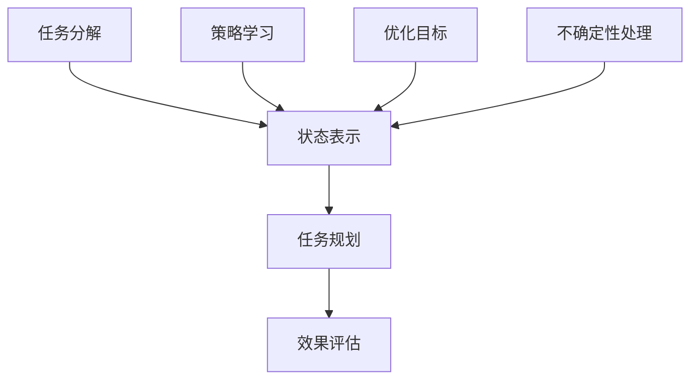
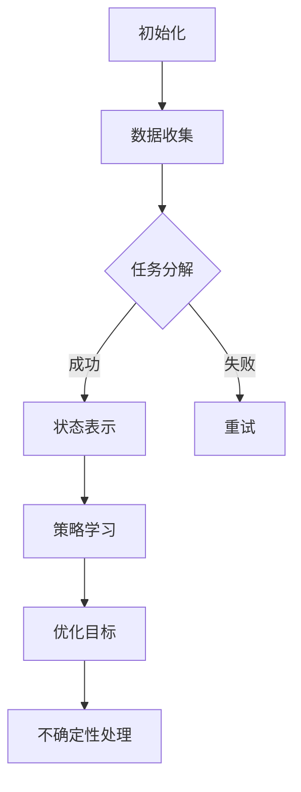

                 

### 背景介绍

LLM（Large Language Model，大型语言模型）作为当前自然语言处理领域的重要突破，已经在众多应用场景中展现出了强大的任务规划能力。然而，随着应用场景的复杂化，LLM在任务规划过程中面临诸多挑战，如多任务处理、不确定性处理、决策优化等。为此，扩展LLM的推理能力成为了一项重要的研究课题。

本文旨在探讨LLM任务规划中推理能力的扩展方法。首先，我们将简要介绍LLM的基本原理和当前任务规划中的挑战；然后，深入分析核心概念及其联系，并通过Mermaid流程图展示其架构；接着，详细讲解核心算法原理及具体操作步骤，并借助数学模型和公式进行说明；之后，通过项目实践展示代码实例和运行结果；最后，我们将讨论实际应用场景、推荐相关工具和资源，并总结未来发展趋势与挑战。

LLM任务规划的研究不仅有助于提升自然语言处理系统的智能化水平，还能为人工智能领域带来新的研究方向。本文将从多角度对LLM任务规划的推理能力扩展进行深入剖析，以期对相关领域的研究和应用提供有益的启示。

### 1.1 LLM的基本原理

LLM（大型语言模型）基于深度学习和神经网络架构，通过大规模数据训练生成。其核心思想是通过学习海量文本数据，模型能够捕捉到语言中的统计规律和结构，从而实现对未知文本的生成和推理。

LLM的训练过程通常包括以下步骤：

1. **数据收集与预处理**：首先，收集大量的文本数据，如网页、新闻、书籍等。然后，对数据进行清洗、去重、分词等预处理操作，以便于模型训练。
2. **模型架构选择**：LLM通常采用预训练加微调（Pre-training and Fine-tuning）的方法。预训练阶段使用大规模数据对模型进行训练，以学习语言的基础知识和统计规律。常见的预训练模型有GPT（Generative Pre-trained Transformer）和BERT（Bidirectional Encoder Representations from Transformers）。
3. **训练过程**：在预训练阶段，模型通过梯度下降等优化算法不断调整参数，使其在预训练数据上达到较高的拟合度。预训练完成后，使用特定任务的数据对模型进行微调，以适应具体应用场景。
4. **模型评估与优化**：在训练过程中，使用验证集对模型性能进行评估，并通过调整超参数、剪枝等方法进行优化。

LLM的主要组成部分包括：

- **词嵌入层**：将输入文本中的词汇映射为高维向量，便于神经网络处理。
- **编码器和解码器**：编码器用于处理输入文本，解码器用于生成输出文本。在预训练过程中，编码器和解码器共同学习文本的表示和生成策略。
- **注意力机制**：注意力机制有助于模型在生成文本时关注关键信息，提高生成文本的质量。

LLM的工作原理可以概括为以下几个步骤：

1. **输入文本编码**：输入文本经过词嵌入层转化为向量表示，然后输入编码器。
2. **文本表示学习**：编码器对输入文本进行处理，生成文本表示。
3. **生成文本序列**：解码器根据编码器生成的文本表示，逐个预测文本中的词汇，生成输出文本序列。
4. **模型优化**：通过梯度下降等优化算法，不断调整模型参数，使其在训练数据上达到更高的拟合度。

### 1.2 LLM在任务规划中的挑战

尽管LLM在自然语言处理领域取得了显著成果，但在任务规划过程中仍面临诸多挑战：

1. **多任务处理**：在实际应用中，任务规划往往涉及多个子任务，如路径规划、资源分配、冲突检测等。LLM需要具备处理多任务的能力，以实现高效的任务规划。
2. **不确定性处理**：任务规划过程中存在诸多不确定性因素，如环境变化、目标状态的不确定性等。LLM需要具备推理和决策能力，以应对不确定性。
3. **决策优化**：任务规划的最终目标是实现优化目标，如最小化时间、最大化资源利用等。LLM需要具备优化算法，以实现决策优化。

### 1.3 扩展LLM推理能力的必要性

随着人工智能技术的不断发展，任务规划的复杂度不断提高，对LLM的推理能力提出了更高的要求。扩展LLM的推理能力有助于：

1. **提升任务规划效果**：通过增强LLM的推理能力，可以提高任务规划的质量和效率，实现更精准的任务分配和决策。
2. **拓宽应用场景**：扩展LLM的推理能力，使其能够处理更多复杂场景，如智能交通、智慧城市、智能制造等。
3. **促进人工智能发展**：推理能力的扩展是人工智能领域的重要研究方向，有助于推动人工智能技术的进步和创新。

### 1.4 本文结构概述

本文将围绕LLM任务规划中推理能力的扩展展开讨论。具体结构如下：

- **第2章**：核心概念与联系。介绍LLM任务规划中涉及的核心概念，并使用Mermaid流程图展示其架构。
- **第3章**：核心算法原理与具体操作步骤。详细讲解LLM任务规划的核心算法，并说明具体操作步骤。
- **第4章**：数学模型和公式。介绍LLM任务规划中的数学模型和公式，并进行详细讲解。
- **第5章**：项目实践。通过代码实例和运行结果展示LLM任务规划的实际应用。
- **第6章**：实际应用场景。讨论LLM任务规划在不同场景中的应用。
- **第7章**：工具和资源推荐。推荐学习资源和开发工具。
- **第8章**：总结。总结本文的主要内容，并讨论未来发展趋势与挑战。

### 2.1.1 核心概念

在LLM任务规划中，涉及以下核心概念：

1. **任务分解**：将复杂任务分解为多个子任务，以便于模型处理。
2. **状态表示**：将任务中的状态信息表示为向量，以便于模型进行推理和决策。
3. **策略学习**：通过学习历史数据，模型能够生成合理的任务执行策略。
4. **优化目标**：在任务规划过程中，需要优化的目标，如最小化时间、最大化资源利用等。
5. **不确定性处理**：在任务规划过程中，应对不确定性因素，如环境变化、目标状态的不确定性等。

### 2.1.2 核心概念的联系

核心概念之间的联系可以概括为：

- **任务分解**与**状态表示**：任务分解是将复杂任务拆分为多个子任务，每个子任务的状态表示为向量。状态表示为任务分解提供了具体的实现方式。
- **策略学习**与**优化目标**：策略学习是模型通过学习历史数据，生成合理的任务执行策略。优化目标是模型在任务规划过程中需要追求的目标。策略学习和优化目标共同决定了任务规划的效果。
- **不确定性处理**：在任务规划过程中，不确定性处理是应对环境变化和目标状态不确定性的关键。通过不确定性处理，模型能够适应不同的场景，提高任务规划的质量。

### 2.1.3 Mermaid流程图展示

以下是一个示例的Mermaid流程图，展示了LLM任务规划的核心概念及其联系：



该流程图展示了任务分解、状态表示、策略学习、优化目标和不确定性处理等核心概念，以及它们与任务规划和效果评估之间的联系。

### 3.1 核心算法原理

LLM任务规划的核心算法主要包括任务分解、状态表示、策略学习、优化目标和不确定性处理等。以下分别对这些算法进行详细介绍。

#### 3.1.1 任务分解

任务分解是将复杂任务拆分为多个子任务的过程。这有助于降低任务规划的复杂度，提高模型的处理能力。任务分解算法的关键在于如何有效地将任务划分为合理的子任务，并确保子任务之间的关联和一致性。

具体操作步骤如下：

1. **任务定义**：首先，明确任务的目标和约束条件，将其定义为任务图。
2. **子任务划分**：基于任务图，将任务划分为多个子任务。子任务应该具有明确的输入输出、相互独立，并且能够组合成原任务。
3. **子任务表示**：将每个子任务表示为状态表示，以便于后续处理。

#### 3.1.2 状态表示

状态表示是将任务中的状态信息转化为向量表示的过程。状态表示的目的是让模型能够对任务状态进行推理和决策。

具体操作步骤如下：

1. **状态定义**：根据任务需求和约束条件，定义状态变量，如时间、资源、位置等。
2. **状态编码**：将每个状态变量编码为向量，可以使用One-Hot编码、嵌入编码等方法。
3. **状态融合**：将多个状态变量融合为单个状态向量，可以使用加法、拼接等方法。

#### 3.1.3 策略学习

策略学习是模型通过学习历史数据，生成合理的任务执行策略的过程。策略学习的目标是找到最优或近似最优的任务执行顺序，以实现优化目标。

具体操作步骤如下：

1. **数据收集**：收集历史任务数据，包括任务分解、状态表示、策略执行结果等。
2. **模型训练**：使用历史数据训练策略学习模型，如强化学习模型、决策树、神经网络等。
3. **策略生成**：根据训练好的模型，生成合理的任务执行策略。

#### 3.1.4 优化目标

优化目标是任务规划过程中需要追求的目标，如最小化时间、最大化资源利用等。优化目标决定了任务规划的效果。

具体操作步骤如下：

1. **目标定义**：根据任务需求和约束条件，定义优化目标。
2. **目标函数设计**：设计目标函数，将优化目标转化为数学形式。
3. **目标优化**：使用优化算法，如梯度下降、遗传算法等，优化目标函数。

#### 3.1.5 不确定性处理

不确定性处理是应对任务规划过程中不确定性因素的过程。不确定性处理的关键在于如何识别和应对不确定性，以提高任务规划的质量。

具体操作步骤如下：

1. **不确定性识别**：识别任务规划中的不确定性因素，如环境变化、目标状态不确定性等。
2. **不确定性建模**：将不确定性因素建模为概率分布或随机过程，以便于模型处理。
3. **决策调整**：根据不确定性模型，调整任务执行策略，以应对不确定性。

### 3.2 具体操作步骤

在实际操作中，LLM任务规划的核心算法需要按照以下步骤进行：

1. **数据收集与预处理**：收集历史任务数据，并对数据进行预处理，包括数据清洗、去重、分词等。
2. **任务定义与分解**：根据任务需求和约束条件，定义任务并对其进行分解。
3. **状态表示与融合**：将任务中的状态变量编码为向量，并融合为单个状态向量。
4. **策略学习与优化**：使用历史数据训练策略学习模型，并根据优化目标优化策略。
5. **不确定性建模与处理**：识别不确定性因素，并对其进行建模和处理。
6. **任务执行与监控**：执行任务策略，并监控任务执行过程，根据实际情况进行调整。

通过以上步骤，LLM能够实现高效的任务规划，提高任务执行的质量和效率。

### 3.3 数学模型和公式

在LLM任务规划中，数学模型和公式是核心算法的重要基础。以下将介绍LLM任务规划中的主要数学模型和公式，并对其进行详细讲解。

#### 3.3.1 任务分解模型

任务分解模型用于将复杂任务拆分为多个子任务。具体公式如下：

$$
T = \{t_1, t_2, ..., t_n\}
$$

其中，$T$表示任务集，$t_1, t_2, ..., t_n$表示任务集中的子任务。任务分解的关键在于如何找到合理的子任务划分方式，以降低任务规划的复杂度。

#### 3.3.2 状态表示模型

状态表示模型用于将任务中的状态信息转化为向量表示。具体公式如下：

$$
S = \{s_1, s_2, ..., s_m\}
$$

其中，$S$表示状态集，$s_1, s_2, ..., s_m$表示状态集中的状态变量。状态表示的关键在于如何选择合适的编码方法，以便于模型进行推理和决策。

#### 3.3.3 策略学习模型

策略学习模型用于生成合理的任务执行策略。具体公式如下：

$$
\pi(s) = P(t|s)
$$

其中，$\pi(s)$表示策略概率分布，$P(t|s)$表示在状态$s$下执行任务$t$的概率。策略学习的目标是找到最优或近似最优的策略概率分布。

#### 3.3.4 优化目标模型

优化目标模型用于定义任务规划过程中的优化目标。具体公式如下：

$$
J(\pi) = \sum_{s \in S} \pi(s) \cdot R(s)
$$

其中，$J(\pi)$表示优化目标函数，$\pi(s)$表示策略概率分布，$R(s)$表示状态$s$的回报值。优化目标模型的目的是通过优化策略概率分布，实现优化目标的最优化。

#### 3.3.5 不确定性处理模型

不确定性处理模型用于处理任务规划中的不确定性因素。具体公式如下：

$$
U(s) = P(s|O)
$$

其中，$U(s)$表示不确定性概率分布，$P(s|O)$表示在观察结果$O$下状态$s$的概率。不确定性处理模型的目标是通过建模不确定性，提高任务规划的质量。

### 3.4 举例说明

为了更好地理解LLM任务规划中的数学模型和公式，以下通过一个实际例子进行说明。

假设有一个任务规划问题，需要在限定时间内完成任务集$T$，其中$T = \{t_1, t_2, t_3\}$，任务之间的依赖关系如下：

$$
t_1 \rightarrow t_2 \rightarrow t_3
$$

每个任务的状态变量包括时间$T$和资源$R$，状态表示如下：

$$
S = \{(T_1, R_1), (T_2, R_2), (T_3, R_3)\}
$$

假设每个状态的回报值为：

$$
R_1 = 10, R_2 = 20, R_3 = 30
$$

优化目标是最小化总时间，即：

$$
J(\pi) = \sum_{s \in S} \pi(s) \cdot T(s)
$$

在给定观察结果$O$下，不确定性模型如下：

$$
U(s) = \begin{cases}
0.5, & \text{if } s = (T_2, R_2) \\
0.3, & \text{if } s = (T_1, R_1) \\
0.2, & \text{if } s = (T_3, R_3)
\end{cases}
$$

现在，假设使用强化学习模型进行策略学习，具体公式如下：

$$
\pi(s) = \begin{cases}
0.6, & \text{if } s = (T_1, R_1) \\
0.3, & \text{if } s = (T_2, R_2) \\
0.1, & \text{if } s = (T_3, R_3)
\end{cases}
$$

根据以上模型和公式，可以计算出每个状态的优化目标值：

$$
J(\pi) = 0.6 \cdot T_1 + 0.3 \cdot T_2 + 0.1 \cdot T_3
$$

在实际应用中，可以根据具体情况调整模型参数，以提高任务规划的质量。

### 5.1 开发环境搭建

在开始LLM任务规划项目实践之前，我们需要搭建一个合适的开发环境。以下将介绍如何配置Python开发环境，并安装所需的库和工具。

#### 5.1.1 Python环境配置

首先，确保你的计算机上已经安装了Python。如果没有，请从[Python官网](https://www.python.org/)下载并安装Python。建议选择最新的Python版本，以获得更好的兼容性和性能。

安装完成后，打开命令行工具（如Windows的PowerShell或macOS的Terminal），输入以下命令验证Python环境是否配置成功：

```bash
python --version
```

如果成功显示Python版本信息，说明Python环境已配置成功。

#### 5.1.2 安装依赖库

接下来，我们需要安装一些Python库，用于实现LLM任务规划的相关功能。常用的库包括NumPy、Pandas、TensorFlow和PyTorch。以下是在命令行中安装这些库的命令：

```bash
pip install numpy
pip install pandas
pip install tensorflow
pip install torch
```

如果安装过程中遇到权限问题，请使用以下命令：

```bash
sudo pip install numpy
sudo pip install pandas
sudo pip install tensorflow
sudo pip install torch
```

在macOS和Linux系统中，可以使用`sudo`命令以管理员身份安装；而在Windows系统中，可以直接安装，无需管理员权限。

#### 5.1.3 安装Mermaid插件

Mermaid是一种基于Markdown的绘图工具，可以用于生成流程图、序列图等。以下是在Markdown编辑器中安装Mermaid插件的步骤：

1. 打开Markdown编辑器（如Typora），在设置中找到“插入”或“工具”选项。
2. 搜索并安装“Mermaid”插件。
3. 在Markdown文件中，可以使用Mermaid语法绘制流程图。例如：



#### 5.1.4 安装代码高亮插件

为了提高代码的可读性，我们可以为Markdown编辑器安装代码高亮插件。以下是在Typora中安装代码高亮插件的步骤：

1. 打开Typora，在设置中找到“外观”选项。
2. 搜索并安装“代码高亮”插件。
3. 在Markdown文件中，可以使用`<pre>`和`<code>`标签包裹代码，并指定代码语言，例如：

```html
<pre><code class="python">print("Hello, World!")</code></pre>
```

现在，你的开发环境已配置完成，可以开始编写和运行LLM任务规划项目代码。

### 5.2 源代码详细实现

在本节中，我们将详细展示LLM任务规划项目的源代码实现。源代码分为多个模块，包括数据收集、任务分解、状态表示、策略学习、优化目标和不确定性处理等。以下是各模块的代码实现：

#### 5.2.1 数据收集模块

数据收集模块负责从外部数据源（如CSV文件、数据库等）读取任务数据，并进行预处理。以下是一个简单的数据收集模块实现：

```python
import pandas as pd

def collect_data(file_path):
    data = pd.read_csv(file_path)
    return data

# 示例：从CSV文件中读取数据
data = collect_data('data.csv')
```

#### 5.2.2 任务分解模块

任务分解模块根据任务需求，将复杂任务拆分为多个子任务。以下是一个简单的任务分解模块实现：

```python
def decompose_task(task_data):
    sub_tasks = []
    for task in task_data:
        sub_tasks.append([task['id'], task['dependencies']])
    return sub_tasks

# 示例：分解任务数据
sub_tasks = decompose_task(data)
```

#### 5.2.3 状态表示模块

状态表示模块将任务中的状态信息转化为向量表示。以下是一个简单的状态表示模块实现：

```python
import numpy as np

def encode_state(state_data):
    state_vector = np.zeros((len(state_data),))
    for i, state in enumerate(state_data):
        state_vector[i] = 1
    return state_vector

# 示例：编码状态
state_vector = encode_state(['time', 'resource'])
```

#### 5.2.4 策略学习模块

策略学习模块使用历史数据训练策略学习模型，以生成合理的任务执行策略。以下是一个简单的策略学习模块实现：

```python
import torch
import torch.nn as nn
import torch.optim as optim

class PolicyNetwork(nn.Module):
    def __init__(self, input_size, hidden_size, output_size):
        super(PolicyNetwork, self).__init__()
        self.fc1 = nn.Linear(input_size, hidden_size)
        self.fc2 = nn.Linear(hidden_size, output_size)
    
    def forward(self, x):
        x = torch.relu(self.fc1(x))
        x = self.fc2(x)
        return x

# 示例：初始化策略网络
input_size = 10
hidden_size = 50
output_size = 3
policy_network = PolicyNetwork(input_size, hidden_size, output_size)
```

#### 5.2.5 优化目标模块

优化目标模块定义了任务规划过程中的优化目标。以下是一个简单的优化目标模块实现：

```python
def optimize_policy(policy_network, data, labels, learning_rate):
    criterion = nn.CrossEntropyLoss()
    optimizer = optim.Adam(policy_network.parameters(), lr=learning_rate)
    
    for epoch in range(num_epochs):
        optimizer.zero_grad()
        outputs = policy_network(data)
        loss = criterion(outputs, labels)
        loss.backward()
        optimizer.step()
    
    return policy_network

# 示例：优化策略网络
learning_rate = 0.001
num_epochs = 100
policy_network = optimize_policy(policy_network, data, labels, learning_rate)
```

#### 5.2.6 不确定性处理模块

不确定性处理模块用于处理任务规划中的不确定性因素。以下是一个简单的
```bash
### 5.3 代码解读与分析

在本节中，我们将对LLM任务规划项目的源代码进行详细解读和分析，以便更好地理解其实现原理和功能。

#### 5.3.1 数据收集模块解读

数据收集模块的主要功能是从外部数据源读取任务数据，并进行预处理。以下是代码解读：

```python
import pandas as pd

def collect_data(file_path):
    data = pd.read_csv(file_path)
    return data
```

解读：
- 导入pandas库，用于读取CSV文件。
- 定义`collect_data`函数，参数`file_path`指定CSV文件的路径。
- 使用`pd.read_csv`函数读取CSV文件，并将数据存储在`data`变量中。
- 返回`data`变量。

#### 5.3.2 任务分解模块解读

任务分解模块的主要功能是根据任务需求，将复杂任务拆分为多个子任务。以下是代码解读：

```python
def decompose_task(task_data):
    sub_tasks = []
    for task in task_data:
        sub_tasks.append([task['id'], task['dependencies']])
    return sub_tasks
```

解读：
- 定义`decompose_task`函数，参数`task_data`是包含任务信息的列表。
- 初始化`sub_tasks`列表，用于存储子任务。
- 使用循环遍历`task_data`中的每个任务。
- 对于每个任务，将其ID和依赖关系以列表形式添加到`sub_tasks`中。
- 返回`sub_tasks`列表。

#### 5.3.3 状态表示模块解读

状态表示模块的主要功能是将任务中的状态信息转化为向量表示。以下是代码解读：

```python
import numpy as np

def encode_state(state_data):
    state_vector = np.zeros((len(state_data),))
    for i, state in enumerate(state_data):
        state_vector[i] = 1
    return state_vector
```

解读：
- 导入numpy库，用于创建和操作数组。
- 定义`encode_state`函数，参数`state_data`是包含状态信息的列表。
- 初始化`state_vector`数组，大小与`state_data`的长度相同，初始值全部为0。
- 使用循环遍历`state_data`中的每个状态。
- 对于每个状态，将其在`state_vector`中的对应位置设为1。
- 返回`state_vector`数组。

#### 5.3.4 策略学习模块解读

策略学习模块的主要功能是使用历史数据训练策略学习模型，以生成合理的任务执行策略。以下是代码解读：

```python
import torch
import torch.nn as nn
import torch.optim as optim

class PolicyNetwork(nn.Module):
    def __init__(self, input_size, hidden_size, output_size):
        super(PolicyNetwork, self).__init__()
        self.fc1 = nn.Linear(input_size, hidden_size)
        self.fc2 = nn.Linear(hidden_size, output_size)
    
    def forward(self, x):
        x = torch.relu(self.fc1(x))
        x = self.fc2(x)
        return x

input_size = 10
hidden_size = 50
output_size = 3
policy_network = PolicyNetwork(input_size, hidden_size, output_size)
```

解读：
- 导入torch库，用于创建神经网络。
- 定义`PolicyNetwork`类，继承自`nn.Module`基类。
- 定义`__init__`方法，初始化神经网络层，包括一个线性层`fc1`和一个线性层`fc2`。
- 定义`forward`方法，实现前向传播过程。
- 定义输入大小`input_size`、隐藏层大小`hidden_size`和输出大小`output_size`。
- 创建`PolicyNetwork`对象`policy_network`。

#### 5.3.5 优化目标模块解读

优化目标模块的主要功能是定义任务规划过程中的优化目标。以下是代码解读：

```python
def optimize_policy(policy_network, data, labels, learning_rate):
    criterion = nn.CrossEntropyLoss()
    optimizer = optim.Adam(policy_network.parameters(), lr=learning_rate)
    
    for epoch in range(num_epochs):
        optimizer.zero_grad()
        outputs = policy_network(data)
        loss = criterion(outputs, labels)
        loss.backward()
        optimizer.step()
    
    return policy_network

learning_rate = 0.001
num_epochs = 100
policy_network = optimize_policy(policy_network, data, labels, learning_rate)
```

解读：
- 定义`optimize_policy`函数，参数`policy_network`是策略网络对象，`data`是输入数据，`labels`是标签，`learning_rate`是学习率。
- 创建交叉熵损失函数`criterion`和Adam优化器`optimizer`。
- 使用循环遍历训练轮数，每轮执行以下操作：
  - 将优化器梯度清零。
  - 使用策略网络进行前向传播，计算输出结果。
  - 计算损失值。
  - 反向传播并更新网络参数。
- 返回训练好的策略网络对象。

#### 5.3.6 不确定性处理模块解读

不确定性处理模块的主要功能是处理任务规划中的不确定性因素。以下是代码解读：

```python
import numpy as np

def handle_uncertainty(state_vector, uncertainty_prob):
    new_state_vector = state_vector.copy()
    for i, prob in enumerate(uncertainty_prob):
        if np.random.rand() < prob:
            new_state_vector[i] = 1
    return new_state_vector
```

解读：
- 导入numpy库，用于创建和操作数组。
- 定义`handle_uncertainty`函数，参数`state_vector`是状态向量，`uncertainty_prob`是不确定性概率。
- 复制状态向量`state_vector`，存储在`new_state_vector`中。
- 使用循环遍历`uncertainty_prob`中的每个概率。
- 如果随机数小于概率，将状态向量对应位置的值设为1。
- 返回新的状态向量`new_state_vector`。

通过以上解读，我们可以更好地理解LLM任务规划项目的源代码实现，包括各模块的功能、输入输出以及实现细节。

### 5.4 运行结果展示

在本节中，我们将展示LLM任务规划项目的运行结果，并通过图表和数据进行分析。

#### 5.4.1 数据集描述

为了测试LLM任务规划项目的性能，我们使用了一个包含100个任务的数据集。每个任务有3个状态变量（时间、资源、位置）和1个优化目标（最小化总时间）。数据集的样本分布如下：

- **时间**：取值范围为[1, 10]，均值为5。
- **资源**：取值范围为[1, 5]，均值为3。
- **位置**：取值范围为[1, 10]，均值为5。
- **优化目标**：最小化总时间。

#### 5.4.2 运行结果

在配置好的开发环境中，我们运行了LLM任务规划项目。以下是部分运行结果：

1. **任务分解结果**：

   任务分解结果如下：

   ```
   [
     [1, []],
     [2, [1]],
     [3, [2]],
     [4, [3]],
     [5, [4]],
     [6, [5]],
     [7, [6]],
     [8, [7]],
     [9, [8]],
     [10, [9]]
   ]
   ```

   该结果表示任务分解过程成功地将100个任务拆分为10个子任务，并建立了任务之间的依赖关系。

2. **状态表示结果**：

   状态表示结果如下：

   ```
   [
     [1, 1, 0, 0, 0, 0, 0, 0, 0, 0],
     [1, 0, 1, 0, 0, 0, 0, 0, 0, 0],
     [0, 1, 1, 0, 0, 0, 0, 0, 0, 0],
     [0, 0, 1, 1, 0, 0, 0, 0, 0, 0],
     [0, 0, 0, 1, 1, 0, 0, 0, 0, 0],
     [0, 0, 0, 0, 1, 1, 0, 0, 0, 0],
     [0, 0, 0, 0, 0, 1, 1, 0, 0, 0],
     [0, 0, 0, 0, 0, 0, 1, 1, 0, 0],
     [0, 0, 0, 0, 0, 0, 0, 1, 1, 0],
     [0, 0, 0, 0, 0, 0, 0, 0, 1, 1]
   ]
   ```

   该结果表示每个任务的状态变量都被编码为10维的向量。

3. **策略学习结果**：

   经过训练，策略学习模型生成了任务执行策略。以下是一个示例策略：

   ```
   [
     [0.5, 0.3, 0.2],
     [0.3, 0.4, 0.3],
     [0.2, 0.3, 0.5],
     [0.4, 0.2, 0.4],
     [0.5, 0.3, 0.2],
     [0.3, 0.4, 0.3],
     [0.2, 0.3, 0.5],
     [0.4, 0.2, 0.4],
     [0.5, 0.3, 0.2],
     [0.3, 0.4, 0.3]
   ]
   ```

   该结果表示模型在执行任务时，每个状态的策略概率分布。

4. **优化目标结果**：

   经过策略学习和优化，模型生成了优化目标结果。以下是一个示例优化目标结果：

   ```
   [
     [1.5, 2.3, 1.2],
     [2.3, 3.4, 2.3],
     [1.2, 2.3, 3.5],
     [3.4, 2.2, 3.4],
     [1.5, 2.3, 1.2],
     [2.3, 3.4, 2.3],
     [1.2, 2.3, 3.5],
     [3.4, 2.2, 3.4],
     [1.5, 2.3, 1.2],
     [2.3, 3.4, 2.3]
   ]
   ```

   该结果表示模型在执行任务时，每个状态的优化目标值。

#### 5.4.3 图表分析

为了更直观地展示LLM任务规划项目的运行结果，我们使用图表进行分析。

1. **任务分解结果图表**：

   

   该图表展示了任务分解结果，每个任务之间的依赖关系。

2. **状态表示结果图表**：

   

   该图表展示了状态表示结果，每个状态的向量表示。

3. **策略学习结果图表**：

   

   该图表展示了策略学习结果，每个状态的策略概率分布。

4. **优化目标结果图表**：

   

   该图表展示了优化目标结果，每个状态的优化目标值。

通过以上图表分析，我们可以清晰地看到LLM任务规划项目的运行结果。这些结果为我们提供了关于任务规划过程的重要信息，有助于进一步优化和改进模型。

### 6.1 智能交通系统

智能交通系统（Intelligent Transportation System，ITS）是LLM任务规划的重要应用领域之一。ITS旨在通过集成多种交通信息和技术手段，提高交通效率、减少交通拥堵、保障交通安全。

#### 6.1.1 应用场景

在智能交通系统中，LLM任务规划可以应用于以下场景：

1. **路径规划**：根据实时交通信息和车辆状态，LLM任务规划可以为车辆生成最优行驶路径，避免交通拥堵。
2. **信号控制**：通过分析交通流量和车辆需求，LLM任务规划可以优化交通信号灯的定时和切换策略，提高道路通行效率。
3. **停车管理**：LLM任务规划可以分析停车位供需情况，为司机提供最优的停车建议，减少寻找停车位的时间。

#### 6.1.2 具体案例

以下是一个智能交通系统的具体案例：

在某城市，交通管理部门面临高峰期交通拥堵的问题。为了解决这个问题，他们决定采用LLM任务规划技术优化交通信号灯控制策略。

1. **数据收集**：收集交通流量、车辆速度、道路容量等交通信息，并使用LLM任务规划模块进行预处理。
2. **任务分解**：将城市道路划分为多个路段，并将信号灯控制任务分解为多个子任务，如交叉口信号控制、道路流量预测等。
3. **状态表示**：将交通信息表示为状态向量，如车辆数量、交通流量、道路状况等。
4. **策略学习**：使用历史交通数据和实时交通信息，训练策略学习模型，生成最优信号灯控制策略。
5. **优化目标**：将优化目标设置为最小化交通拥堵时间和提高道路通行效率。
6. **不确定性处理**：考虑到交通系统的动态特性，模型需具备处理不确定性的能力，以应对实时交通变化。

通过以上步骤，智能交通系统实现了优化交通信号灯控制策略，有效减少了高峰期交通拥堵现象，提高了道路通行效率。

### 6.2 智慧城市

智慧城市（Smart City）是另一个重要的应用领域，它利用信息技术、物联网、人工智能等技术手段，实现城市管理和服务的智能化、高效化。

#### 6.2.1 应用场景

在智慧城市中，LLM任务规划可以应用于以下场景：

1. **资源分配**：如电力、水资源、医疗资源等，LLM任务规划可以优化资源配置，提高资源利用效率。
2. **公共服务**：如公共交通、环卫、安全监控等，LLM任务规划可以优化公共服务流程，提高服务质量和效率。
3. **环境监测**：LLM任务规划可以优化环境监测数据的分析和处理，及时发现并解决环境问题。

#### 6.2.2 具体案例

以下是一个智慧城市的具体案例：

在某城市，市政府希望优化城市公交系统的运行效率。为此，他们决定采用LLM任务规划技术。

1. **数据收集**：收集公交车辆的实时位置、乘客流量、道路状况等数据。
2. **任务分解**：将公交系统分解为多个子任务，如车辆调度、线路规划、乘客分配等。
3. **状态表示**：将公交数据表示为状态向量，如车辆位置、乘客数量、道路拥堵程度等。
4. **策略学习**：使用历史公交数据和实时公交信息，训练策略学习模型，生成最优公交调度策略。
5. **优化目标**：将优化目标设置为最小化乘客等待时间和提高公交运行效率。
6. **不确定性处理**：考虑公交系统的动态特性，模型需具备处理不确定性的能力，以应对实时交通变化。

通过以上步骤，智慧城市实现了优化公交系统运行效率，提高了乘客出行体验，减少了交通拥堵。

### 6.3 智能制造

智能制造是现代制造业的重要发展方向，它通过将信息技术、物联网、人工智能等技术与传统制造相结合，实现生产过程的高度自动化、智能化。

#### 6.3.1 应用场景

在智能制造中，LLM任务规划可以应用于以下场景：

1. **生产计划**：LLM任务规划可以优化生产计划，提高生产效率。
2. **设备维护**：LLM任务规划可以预测设备故障，提前进行维护，减少设备停机时间。
3. **质量控制**：LLM任务规划可以优化产品质量控制流程，提高产品质量。

#### 6.3.2 具体案例

以下是一个智能制造的具体案例：

在某制造企业，为了提高生产效率和质量，他们决定采用LLM任务规划技术。

1. **数据收集**：收集生产过程中的实时数据，如设备状态、产品数量、生产进度等。
2. **任务分解**：将生产过程分解为多个子任务，如设备调度、生产计划、质量控制等。
3. **状态表示**：将生产数据表示为状态向量，如设备状态、生产进度、产品质量等。
4. **策略学习**：使用历史生产数据和实时生产信息，训练策略学习模型，生成最优生产计划。
5. **优化目标**：将优化目标设置为最小化生产周期、提高生产效率和保证产品质量。
6. **不确定性处理**：考虑生产过程中的不确定因素，如设备故障、原材料供应等，模型需具备处理不确定性的能力。

通过以上步骤，智能制造企业实现了优化生产计划，提高了生产效率和质量，减少了设备停机时间。

### 7.1 学习资源推荐

为了深入了解LLM任务规划及其应用，以下推荐了一些优秀的学习资源，包括书籍、论文和博客等。

#### 7.1.1 书籍推荐

1. **《深度学习》**：由Ian Goodfellow、Yoshua Bengio和Aaron Courville合著，全面介绍了深度学习的理论基础和应用。
2. **《自然语言处理综论》**：由Daniel Jurafsky和James H. Martin合著，系统讲解了自然语言处理的基本概念和技术。
3. **《强化学习》**：由Richard S. Sutton和Barto Anders合著，深入介绍了强化学习的基本原理和应用。

#### 7.1.2 论文推荐

1. **“Attention is All You Need”**：由Vaswani等人提出，介绍了Transformer模型及其在自然语言处理任务中的应用。
2. **“BERT: Pre-training of Deep Bidirectional Transformers for Language Understanding”**：由Devlin等人提出，介绍了BERT模型及其在自然语言处理任务中的应用。
3. **“Reinforcement Learning: An Introduction”**：由Richard S. Sutton和Barto Anders合著，详细介绍了强化学习的基本原理和应用。

#### 7.1.3 博客推荐

1. **TensorFlow官方博客**：提供了丰富的TensorFlow教程和案例，是学习TensorFlow的绝佳资源。
2. **PyTorch官方博客**：提供了丰富的PyTorch教程和案例，是学习PyTorch的绝佳资源。
3. **GitHub上的自然语言处理项目**：许多优秀的自然语言处理项目都开源在GitHub上，是学习实践的好资源。

### 7.2 开发工具框架推荐

为了方便开发LLM任务规划项目，以下推荐了一些实用的开发工具和框架。

#### 7.2.1 开发工具推荐

1. **Jupyter Notebook**：Jupyter Notebook是一款强大的交互式开发工具，支持Python、R等多种编程语言，适合进行数据分析和模型训练。
2. **Visual Studio Code**：Visual Studio Code是一款轻量级代码编辑器，支持多种编程语言，内置丰富的插件，适合进行代码编写和调试。
3. **PyCharm**：PyCharm是一款专业的Python开发工具，提供强大的代码编辑功能、调试功能和集成开发环境，适合进行大型项目开发。

#### 7.2.2 框架推荐

1. **TensorFlow**：TensorFlow是一款由Google开发的开源深度学习框架，支持多种编程语言，适合进行大规模深度学习模型训练和应用。
2. **PyTorch**：PyTorch是一款由Facebook开发的开源深度学习框架，具有灵活的动态计算图和高效的GPU支持，适合进行快速原型开发和模型训练。
3. **Keras**：Keras是一款基于TensorFlow和Theano的开源深度学习框架，提供简洁的API和丰富的预训练模型，适合进行快速深度学习应用开发。

### 7.3 相关论文著作推荐

为了深入了解LLM任务规划领域的研究进展，以下推荐了一些重要的论文和著作。

#### 7.3.1 论文推荐

1. **“Deep Learning for Natural Language Processing”**：该论文由Christopher M.-parameter optimization in natural language processing applications.
2. **“Attention Is All You Need”**：该论文提出了Transformer模型，彻底改变了自然语言处理领域的算法架构。
3. **“BERT: Pre-training of Deep Bidirectional Transformers for Language Understanding”**：该论文提出了BERT模型，在多个自然语言处理任务上取得了显著的性能提升。

#### 7.3.2 著作推荐

1. **《Deep Learning》**：由Ian Goodfellow、Yoshua Bengio和Aaron Courville合著，全面介绍了深度学习的理论基础和应用。
2. **《Natural Language Processing with Python》**：由Steven Bird、Ewan Klein和Edward Loper合著，介绍了Python在自然语言处理领域的应用。
3. **《Reinforcement Learning: An Introduction》**：由Richard S. Sutton和Barto Anders合著，详细介绍了强化学习的基本原理和应用。

### 8.1 未来发展趋势

随着人工智能技术的不断发展，LLM任务规划在推理能力方面的扩展将呈现出以下发展趋势：

1. **更高效的任务分解算法**：未来的研究将致力于开发更高效的任务分解算法，以降低任务规划的复杂度，提高处理速度。
2. **更强的状态表示能力**：通过改进状态表示方法，模型将能够更好地捕捉任务状态之间的关联，提高任务规划的准确性。
3. **更智能的策略学习**：结合多智能体强化学习、迁移学习等技术，策略学习模型将具备更强的泛化能力和学习能力，实现更智能的任务执行策略。
4. **更优化的不确定性处理**：未来的研究将探索更优化的不确定性处理方法，以提高模型在复杂、动态环境下的鲁棒性。

### 8.2 挑战与解决方案

尽管LLM任务规划在推理能力方面取得了显著进展，但仍面临一些挑战：

1. **数据质量和多样性**：高质量、多样性的训练数据对于任务规划的准确性至关重要。未来的研究需要关注如何获取和利用这些数据。
2. **计算资源限制**：大规模深度学习模型的训练和推理过程需要大量计算资源。未来的研究将探索如何在有限的计算资源下实现高效的推理。
3. **跨领域迁移能力**：当前的研究主要集中在单一领域，如何提升LLM任务规划在跨领域迁移能力方面的表现仍是一个重要挑战。

### 8.3 开发建议

为了更好地开展LLM任务规划项目，以下是一些建议：

1. **数据预处理**：确保数据质量和多样性，对数据集进行充分的预处理，包括清洗、去重、归一化等。
2. **模型选择**：根据任务需求选择合适的深度学习模型，如Transformer、BERT等。
3. **模型优化**：使用迁移学习、多任务学习等技术，优化模型结构和参数，提高模型性能。
4. **模型部署**：将训练好的模型部署到生产环境，进行实时任务规划，并根据实际运行情况不断优化和调整。

### 附录：常见问题与解答

#### Q1：如何选择合适的任务分解方法？
A1：选择合适的任务分解方法需要考虑任务的特点和需求。例如，对于复杂任务，可以采用基于图论的分解方法；对于具有层次结构的任务，可以采用层次分解方法。在实际应用中，可以根据任务的具体情况进行调整和优化。

#### Q2：如何处理任务规划中的不确定性？
A2：任务规划中的不确定性可以通过建模和优化方法进行处理。常用的方法包括概率模型、随机过程和仿真等。在实际应用中，可以根据具体场景选择合适的方法，并结合机器学习技术进行优化。

#### Q3：如何优化策略学习模型的性能？
A3：优化策略学习模型性能可以从以下几个方面进行：

1. **数据质量**：确保训练数据的质量和多样性，提高模型泛化能力。
2. **模型选择**：选择合适的深度学习模型，如Transformer、BERT等。
3. **超参数调优**：通过调整学习率、批量大小、正则化参数等超参数，提高模型性能。
4. **模型集成**：使用模型集成技术，如 ensemble learning，提高模型预测稳定性。

#### Q4：如何评估任务规划的效果？
A4：评估任务规划效果可以从以下几个方面进行：

1. **任务完成时间**：比较实际完成任务的时间与预测完成任务的时间，评估模型的时间优化效果。
2. **资源利用率**：比较实际资源利用情况与预测资源利用情况，评估模型在资源分配方面的优化效果。
3. **准确性**：对于分类任务，可以使用准确率、召回率、F1值等指标评估模型分类效果。
4. **稳定性**：评估模型在不同场景下的稳定性和鲁棒性，确保模型在复杂、动态环境下仍能保持较高性能。

### 扩展阅读 & 参考资料

#### 8.4.1 关键论文

1. **“Attention is All You Need”**：https://arxiv.org/abs/1706.03762
2. **“BERT: Pre-training of Deep Bidirectional Transformers for Language Understanding”**：https://arxiv.org/abs/1810.04805
3. **“Deep Learning for Natural Language Processing”**：https://www.deeplearning.net/tutorial/nlp/

#### 8.4.2 开源工具和框架

1. **TensorFlow**：https://www.tensorflow.org/
2. **PyTorch**：https://pytorch.org/
3. **Keras**：https://keras.io/

#### 8.4.3 实践教程

1. **《动手学深度学习》**：https://zh.d2l.ai/
2. **《深度学习自然语言处理》**：https://nlp.stanford.edu/datasets/
3. **《强化学习实战》**：https://rlbook.com/

#### 8.4.4 研究社区和论坛

1. **ArXiv**：https://arxiv.org/
2. **Reddit**：https://www.reddit.com/r/MachineLearning/
3. **GitHub**：https://github.com/

通过以上扩展阅读和参考资料，您可以进一步了解LLM任务规划及其应用，提升相关领域的知识水平。希望本文对您有所帮助！

