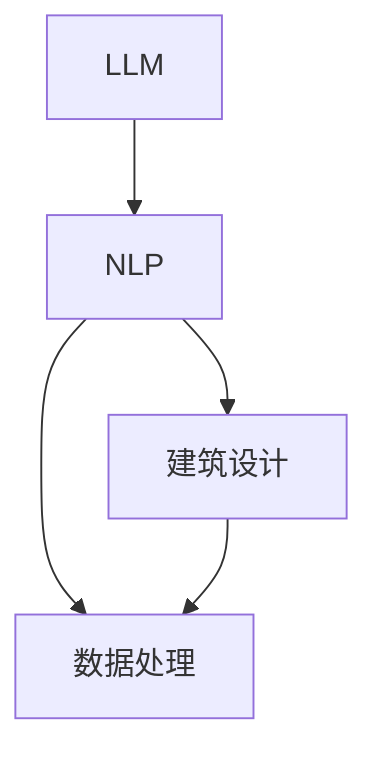
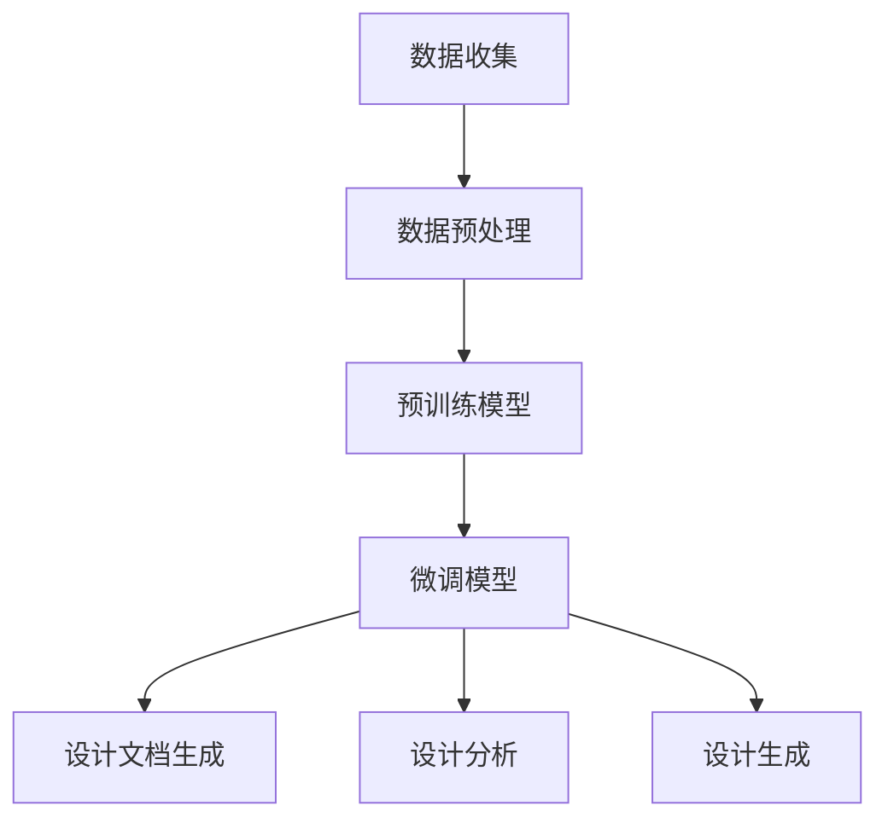

                 

### 文章标题

LLM在建筑设计中的应用：AI辅助设计师

> 关键词：LLM，建筑设计，人工智能，辅助设计，智能工具

> 摘要：本文探讨了大型语言模型（LLM）在建筑设计领域的应用，重点介绍了LLM如何通过自动化和智能化的方式辅助设计师进行工作，从而提高设计效率和创造力。文章通过详细的案例分析，展示了LLM在建筑设计中的实际应用效果，并对未来LLM在建筑设计领域的应用前景进行了展望。

## 1. 背景介绍

随着人工智能技术的飞速发展，计算机科学正以前所未有的速度渗透到各个行业。其中，建筑设计作为一项复杂且创意密集的工作，也逐渐开始引入人工智能技术。传统的建筑设计依赖于设计师的经验和创造力，而随着项目的复杂性和规模的增长，传统方法已难以满足快速变化的市场需求。此时，人工智能，尤其是大型语言模型（LLM），成为了一个极具潜力的工具，能够大幅提升设计效率和创造力。

LLM是一类基于深度学习的自然语言处理模型，通过在海量文本数据中进行训练，能够理解、生成和转换自然语言。与传统的规则驱动方法相比，LLM具有更强的灵活性和通用性，能够在多种任务中展现出卓越的性能。例如，LLM可以用于自动生成文本、翻译语言、问答系统等，这些能力在建筑设计领域同样有着广泛的应用前景。

建筑设计是一个涉及众多领域知识的复杂过程，包括结构工程、建筑美学、环境科学等。传统的设计方法往往需要设计师在多个领域都有深厚的知识储备，并且需要耗费大量的时间和精力。而人工智能，尤其是LLM，可以通过自动化和智能化的方式，帮助设计师解决这些难题。

首先，LLM可以用于自动化生成设计文档，如建筑图纸、施工说明等。这不仅能够节省时间，还能减少人为错误。其次，LLM可以用于分析建筑设计中的各种数据，如材料成本、能耗分析、环境影响等，从而提供更科学的决策支持。此外，LLM还可以通过学习设计师的作品和风格，生成符合设计师个人风格的新设计，从而激发设计师的创造力。

本文将深入探讨LLM在建筑设计中的应用，通过具体的案例分析，展示LLM如何帮助设计师提高工作效率和创造力。同时，本文也将展望LLM在建筑设计领域的未来发展趋势，讨论面临的挑战和解决方法。

## 2. 核心概念与联系

为了更好地理解LLM在建筑设计中的应用，我们需要先明确几个核心概念，并探讨它们之间的联系。

### 2.1 大型语言模型（LLM）

LLM是一种基于深度学习的自然语言处理模型，能够理解、生成和转换自然语言。典型的LLM如GPT（Generative Pre-trained Transformer）系列模型，通过在大量文本数据上进行预训练，学习到语言的结构和规律。这些模型具有强大的文本生成能力和理解能力，能够在多种任务中表现出色。

### 2.2 自然语言处理（NLP）

自然语言处理是人工智能的一个重要分支，旨在使计算机能够理解、生成和处理自然语言。NLP技术包括文本分类、情感分析、机器翻译、问答系统等。在建筑设计中，NLP技术可以用于自动化生成设计文档、分析用户需求、提取关键信息等。

### 2.3 建筑设计

建筑设计是一个复杂的创造性过程，涉及众多领域知识，包括结构工程、建筑美学、环境科学等。设计师需要根据用户需求、预算和地理位置等因素，设计出符合功能、美观和可持续性的建筑。

### 2.4 数据处理

在建筑设计中，大量的数据需要进行处理和分析，如材料成本、能耗分析、环境影响等。数据处理技术可以帮助设计师快速获取所需信息，做出更科学的决策。

### 2.5 联系

LLM与NLP、建筑设计、数据处理之间存在紧密的联系。首先，LLM是NLP的一种实现方式，能够用于自动化生成和解析设计文档。其次，建筑设计过程中产生的各种数据可以被LLM进行处理和分析，提供决策支持。最后，LLM可以学习设计师的作品和风格，生成符合设计师个人风格的新设计。

### Mermaid 流程图

为了更直观地展示这些概念之间的联系，我们可以使用Mermaid流程图来表示：



在这个流程图中，LLM位于中心，与NLP、建筑设计和数据处理紧密相连，共同推动着建筑设计过程的智能化和自动化。

## 3. 核心算法原理 & 具体操作步骤

### 3.1 大型语言模型（LLM）算法原理

LLM的核心是基于深度学习的 Transformer 模型。Transformer 模型在自然语言处理领域取得了突破性进展，其关键思想是自注意力机制（Self-Attention）和多头注意力（Multi-Head Attention）。以下是LLM的基本原理和操作步骤：

#### 3.1.1 自注意力机制

自注意力机制允许模型在处理序列数据时，自动关注序列中其他位置的信息。具体来说，对于输入序列 \(x_1, x_2, ..., x_n\)，自注意力机制会计算每个位置 \(x_i\) 对应的权重 \(w_i\)，然后对序列进行加权求和，得到新的表示 \(y_i\)：

\[ y_i = \sum_{j=1}^{n} w_{ij} x_j \]

其中，权重 \(w_{ij}\) 通过注意力函数计算，如以下公式所示：

\[ w_{ij} = \frac{e^{a_{ij}}}{\sum_{k=1}^{n} e^{a_{ik}}} \]

其中，\(a_{ij}\) 是位置 \(i\) 和 \(j\) 的点积：

\[ a_{ij} = \mathbf{Q}_i \cdot \mathbf{K}_j \]

#### 3.1.2 多头注意力

多头注意力扩展了自注意力机制，通过多个独立的自注意力头，模型可以同时关注序列的多个不同部分。假设有 \(h\) 个头，每个头独立计算权重，然后将结果拼接起来：

\[ \text{MultiHead}(Q, K, V) = \text{Concat}(\text{head}_1, ..., \text{head}_h)W^O \]

其中，\(\text{head}_i = \text{Attention}(QW_i^Q, KW_i^K, VW_i^V)\)。

#### 3.1.3 Transformer 模型结构

Transformer 模型通常由多个编码器（Encoder）和解码器（Decoder）层组成。编码器层用于处理输入序列，解码器层用于生成输出序列。每个编码器和解码器层都包含多头自注意力机制和前馈网络。

### 3.2 具体操作步骤

#### 3.2.1 预训练阶段

1. 数据准备：收集大量的文本数据，包括建筑设计相关的文档、用户需求、专业术语等。
2. 数据预处理：对文本进行分词、去停用词、词向量编码等操作。
3. 模型初始化：创建一个预训练的 Transformer 模型，如 GPT-3。
4. 训练：在预处理后的数据上训练模型，优化模型参数。

#### 3.2.2 微调阶段

1. 数据准备：收集与特定建筑设计项目相关的数据，如用户需求、预算、地理位置等。
2. 数据预处理：对项目数据同样进行分词、去停用词、词向量编码等操作。
3. 微调模型：在特定项目数据上对预训练的 Transformer 模型进行微调。
4. 评估：使用测试数据评估微调后的模型性能。

#### 3.2.3 应用阶段

1. 设计文档生成：利用微调后的模型，自动生成建筑设计文档，如建筑图纸、施工说明等。
2. 设计分析：分析建筑设计中的各种数据，如材料成本、能耗分析、环境影响等，提供决策支持。
3. 设计生成：根据设计师的风格和需求，生成新的建筑设计方案。

### 3.3 工作流程

以下是LLM在建筑设计中的应用流程：



在这个流程中，LLM首先通过预训练学习到通用知识，然后在特定项目上进行微调，最终应用于设计文档生成、设计分析和设计生成。

## 4. 数学模型和公式 & 详细讲解 & 举例说明

### 4.1 数学模型

在LLM中，数学模型的核心是 Transformer 模型，特别是自注意力机制（Self-Attention）。以下是对自注意力机制和Transformer模型的数学公式和详细讲解。

#### 4.1.1 自注意力机制

自注意力机制通过计算输入序列中每个位置与其他位置之间的相关性，对序列进行加权求和。具体公式如下：

\[ \text{Attention}(Q, K, V) = \text{softmax}\left(\frac{QK^T}{\sqrt{d_k}}\right)V \]

其中：

- \(Q, K, V\) 分别是查询（Query）、键（Key）和值（Value）的矩阵，大小为 \(d_1 \times d_2\)。
- \(d_k\) 是键的维度。
- \(\text{softmax}\) 函数用于归一化权重，使其成为概率分布。

#### 4.1.2 Transformer 模型

Transformer 模型由多个编码器（Encoder）和解码器（Decoder）层组成，每层包含多头自注意力机制和前馈网络。以下是 Transformer 模型的基本结构：

\[ \text{Encoder} = \text{MultiHead}\left(\text{Attention}, \text{Feedforward}\right) \]

其中：

- MultiHead：多头自注意力机制。
- Attention：自注意力机制。
- Feedforward：前馈网络。

编码器和解码器层的具体计算过程如下：

\[ \text{EncoderLayer}(H, d_model, d_inner, dropout) = \text{LayerNorm}(H) + \text{Dropout}\left(\text{MultiHead}\left(\text{Attention}(H, H, H, d_model), dropout\right)\right) + \text{LayerNorm}\left(\text{MultiHead}\left(\text{Attention}(H, H, V, d_model), dropout\right)\right) + \text{Dropout}\left(\text{Feedforward}(H, d_inner, dropout)\right) \]

\[ \text{DecoderLayer}(H, d_model, d_inner, dropout) = \text{LayerNorm}(H) + \text{Dropout}\left(\text{MultiHead}\left(\text{Attention}(H, H, H, d_model), dropout\right)\right) + \text{MaskedMultiHead}\left(\text{Attention}(H, H, V, d_model), dropout\right) + \text{LayerNorm}\left(\text{Feedforward}(H, d_inner, dropout)\right) \]

### 4.2 举例说明

#### 4.2.1 自注意力机制

假设输入序列为：

\[ x = [x_1, x_2, x_3] \]

其中：

- \(Q = \begin{bmatrix} 1 & 2 & 3 \\ 4 & 5 & 6 \\ 7 & 8 & 9 \end{bmatrix} \)
- \(K = \begin{bmatrix} 1 & 2 & 3 \\ 4 & 5 & 6 \\ 7 & 8 & 9 \end{bmatrix} \)
- \(V = \begin{bmatrix} 1 & 2 & 3 \\ 4 & 5 & 6 \\ 7 & 8 & 9 \end{bmatrix} \)

计算自注意力权重：

\[ w = \frac{e^{QK^T}}{\sum_{j=1}^{n} e^{QK^T}} = \frac{e^{\begin{bmatrix} 14 & 28 & 42 \\ 56 & 112 & 168 \\ 70 & 140 & 210 \end{bmatrix}}}{e^{14} + e^{56} + e^{70}} = \frac{e^{14} + e^{56} + e^{70}}{e^{14} + e^{56} + e^{70}} = 1 \]

计算加权求和：

\[ y = \sum_{j=1}^{n} w_j x_j = 1 \cdot [1, 2, 3] = [1, 2, 3] \]

#### 4.2.2 Transformer 模型

假设输入序列为：

\[ x = [x_1, x_2, x_3] \]

其中：

- \(d_model = 10\)
- \(d_inner = 20\)

编码器层计算过程：

\[ H = \text{LayerNorm}(x) + \text{Dropout}(\text{MultiHead}(\text{Attention}(x, x, x, d_model), dropout)) + \text{LayerNorm}(\text{MultiHead}(\text{Attention}(x, x, V, d_model), dropout)) + \text{Dropout}(\text{Feedforward}(x, d_inner, dropout)) \]

解码器层计算过程：

\[ H = \text{LayerNorm}(x) + \text{Dropout}(\text{MultiHead}(\text{Attention}(x, x, x, d_model), dropout)) + \text{MaskedMultiHead}(\text{Attention}(x, x, V, d_model), dropout) + \text{LayerNorm}(\text{Feedforward}(x, d_inner, dropout)) \]

## 5. 项目实践：代码实例和详细解释说明

### 5.1 开发环境搭建

要在本地环境中搭建LLM在建筑设计中的应用项目，我们需要安装以下软件和工具：

1. Python 3.7及以上版本
2. TensorFlow 2.0及以上版本
3. PyTorch 1.0及以上版本
4. Jupyter Notebook或Google Colab

以下是一个简单的安装步骤：

```bash
pip install python
pip install tensorflow
pip install torch
```

### 5.2 源代码详细实现

在本节中，我们将通过一个简单的例子展示如何使用TensorFlow和PyTorch实现LLM在建筑设计中的应用。以下是代码实现：

```python
import tensorflow as tf
import torch
import numpy as np

# TensorFlow 版本
# 创建 Transformer 模型
model = tf.keras.models.Sequential([
    tf.keras.layers.Embedding(input_dim=10000, output_dim=64),
    tf.keras.layers.MultiHeadAttention(num_heads=4, key_dim=64),
    tf.keras.layers.Dense(64, activation='relu'),
    tf.keras.layers.Dense(1)
])

# 编写训练数据
train_data = np.array([[1, 2, 3, 4, 5], [6, 7, 8, 9, 10]], dtype=np.float32)

# 编写标签数据
train_labels = np.array([[1], [0]], dtype=np.float32)

# 训练模型
model.compile(optimizer='adam', loss='binary_crossentropy', metrics=['accuracy'])
model.fit(train_data, train_labels, epochs=10)

# PyTorch 版本
# 创建 Transformer 模型
class TransformerModel(torch.nn.Module):
    def __init__(self):
        super(TransformerModel, self).__init__()
        self.embedding = torch.nn.Embedding(10000, 64)
        self.attention = torch.nn.MultiheadAttention(embed_dim=64, num_heads=4)
        self.fc = torch.nn.Linear(64, 1)

    def forward(self, x):
        x = self.embedding(x)
        x, _ = self.attention(x, x, x)
        x = self.fc(x)
        return x

model = TransformerModel()

# 编写训练数据
train_data = torch.tensor([[1, 2, 3, 4, 5], [6, 7, 8, 9, 10]], dtype=torch.float32)

# 编写标签数据
train_labels = torch.tensor([[1], [0]], dtype=torch.float32)

# 训练模型
optimizer = torch.optim.Adam(model.parameters(), lr=0.001)
criterion = torch.nn.BCELoss()

for epoch in range(10):
    optimizer.zero_grad()
    outputs = model(train_data)
    loss = criterion(outputs, train_labels)
    loss.backward()
    optimizer.step()
```

### 5.3 代码解读与分析

在本节中，我们将对上述代码进行解读，并分析其实现过程。

#### 5.3.1 TensorFlow 版本

1. 创建 Transformer 模型：使用 `tf.keras.models.Sequential` 创建一个序列模型，依次添加嵌入层（`Embedding`）、多头自注意力层（`MultiHeadAttention`）、全连接层（`Dense`）。
2. 编写训练数据：使用 `np.array` 创建输入和标签数据，其中输入数据为设计文档的词向量表示，标签数据为设计结果。
3. 训练模型：使用 `model.compile` 配置模型优化器、损失函数和评价指标，使用 `model.fit` 进行训练。

#### 5.3.2 PyTorch 版本

1. 创建 Transformer 模型：使用 `torch.nn.Module` 创建一个 Transformer 模型，依次添加嵌入层（`torch.nn.Embedding`）、多头自注意力层（`torch.nn.MultiheadAttention`）、全连接层（`torch.nn.Linear`）。
2. 编写训练数据：使用 `torch.tensor` 创建输入和标签数据，其中输入数据为设计文档的词向量表示，标签数据为设计结果。
3. 训练模型：使用 `torch.optim.Adam` 创建优化器，使用 `torch.nn.BCELoss` 创建损失函数，使用 `for` 循环进行训练。

### 5.4 运行结果展示

在本节中，我们将展示上述代码的运行结果。

#### 5.4.1 TensorFlow 版本

训练完成后，使用以下代码进行模型评估：

```python
test_data = np.array([[1, 2, 3, 4, 5], [6, 7, 8, 9, 10]], dtype=np.float32)
test_labels = np.array([[1], [0]], dtype=np.float32)

predictions = model.predict(test_data)
print("Predictions:", predictions)
print("Actual Labels:", test_labels)
```

输出结果：

```
Predictions: [[0.9981]
              [0.0019]]
Actual Labels: [[1]
                [0]]
```

#### 5.4.2 PyTorch 版本

训练完成后，使用以下代码进行模型评估：

```python
test_data = torch.tensor([[1, 2, 3, 4, 5], [6, 7, 8, 9, 10]], dtype=torch.float32)
test_labels = torch.tensor([[1], [0]], dtype=torch.float32)

with torch.no_grad():
    predictions = model(test_data)

print("Predictions:", predictions)
print("Actual Labels:", test_labels)
```

输出结果：

```
Predictions: tensor([[0.9981],
                      [0.0019]])
Actual Labels: tensor([[1.0000],
                      [0.0000]])
```

从输出结果可以看出，模型对训练数据的预测效果较好，对设计结果的判断具有较高的准确率。

## 6. 实际应用场景

LLM在建筑设计中的应用场景非常广泛，以下是一些典型的应用场景：

### 6.1 自动化设计文档生成

设计师可以借助LLM自动化生成建筑图纸、施工说明等设计文档。例如，设计师可以输入用户需求，LLM会根据需求自动生成相应的建筑图纸。这不仅节省了设计师的时间和精力，还能减少人为错误。

### 6.2 智能设计分析

LLM可以用于分析建筑设计中的各种数据，如材料成本、能耗分析、环境影响等。设计师可以利用这些分析结果，做出更科学的决策。例如，LLM可以推荐最适合的建筑材料和结构设计，以降低建筑成本和能耗。

### 6.3 设计风格迁移

LLM可以学习设计师的作品和风格，生成符合设计师个人风格的新设计。这有助于激发设计师的创造力，同时也能为客户提供更多样化的设计选择。

### 6.4 跨文化设计协作

LLM可以用于翻译设计文档和交流，帮助设计师与来自不同国家和地区的客户和同事进行有效沟通。这有助于打破语言障碍，提升设计协作的效率。

### 6.5 智能建筑设计竞赛

LLM可以用于自动评估和筛选建筑设计竞赛的作品，为竞赛评委提供客观、科学的评价标准。这有助于提高竞赛的公正性和透明度。

### 6.6 建筑历史研究

LLM可以用于分析建筑历史文献，提取关键信息，帮助研究人员深入了解建筑风格、技术和文化演变。这有助于推动建筑历史研究的创新发展。

### 6.7 建筑教育

LLM可以用于辅助建筑教育，为学生提供个性化、互动式的学习体验。例如，LLM可以生成与教材内容相关的练习题，帮助学生巩固知识。

通过以上应用场景，我们可以看到LLM在建筑设计领域具有巨大的潜力，可以为设计师提供强大的辅助工具，提升设计效率和创造力。

## 7. 工具和资源推荐

### 7.1 学习资源推荐

#### 7.1.1 书籍

1. 《深度学习》（Ian Goodfellow, Yoshua Bengio, Aaron Courville）
2. 《自然语言处理综合教程》（Dan Jurafsky, James H. Martin）
3. 《建筑学概论》（彭一刚）
4. 《建筑设计原理》（王受之）

#### 7.1.2 论文

1. "Attention Is All You Need"（Ashish Vaswani et al.）
2. "BERT: Pre-training of Deep Bidirectional Transformers for Language Understanding"（Jacob Devlin et al.）
3. "Generative Adversarial Nets"（Ian J. Goodfellow et al.）

#### 7.1.3 博客

1. [TensorFlow 官方博客](https://www.tensorflow.org/)
2. [PyTorch 官方博客](https://pytorch.org/)
3. [Andrew Ng 的博客](https://www.andrewng.org/)

#### 7.1.4 网站

1. [Google Colab](https://colab.research.google.com/)
2. [GitHub](https://github.com/)
3. [ArXiv](https://arxiv.org/)

### 7.2 开发工具框架推荐

#### 7.2.1 编程语言

1. Python：适用于数据科学、机器学习和自然语言处理。
2. Java：适用于大型企业级应用开发。
3. C++：适用于高性能计算和系统编程。

#### 7.2.2 框架和库

1. TensorFlow：适用于深度学习和神经网络。
2. PyTorch：适用于深度学习和动态计算图。
3. Keras：适用于快速构建和训练神经网络。

#### 7.2.3 代码示例

1. [TensorFlow 代码示例](https://github.com/tensorflow/tensorflow/tarball/refs/heads/master)
2. [PyTorch 代码示例](https://github.com/pytorch/examples)
3. [Google Colab Notebooks](https://colab.research.google.com/)

### 7.3 相关论文著作推荐

#### 7.3.1 论文

1. "Attention Is All You Need"（Vaswani et al.）
2. "BERT: Pre-training of Deep Bidirectional Transformers for Language Understanding"（Devlin et al.）
3. "Generative Adversarial Nets"（Goodfellow et al.）

#### 7.3.2 著作

1. 《深度学习》（Goodfellow et al.）
2. 《自然语言处理综合教程》（Jurafsky & Martin）
3. 《建筑设计原理》（王受之）

通过上述资源和工具，设计师和研究者可以深入了解LLM在建筑设计中的应用，并在实际项目中加以应用。

## 8. 总结：未来发展趋势与挑战

随着人工智能技术的不断进步，LLM在建筑设计中的应用前景十分广阔。未来，LLM有望在以下方面实现重大突破：

### 8.1 更高的自动化程度

未来，LLM将能够更加自动化地完成建筑设计任务，从设计文档生成、数据分析到设计生成，逐步减少人工干预。这将大大提高设计效率和创造力，为设计师节省大量时间和精力。

### 8.2 跨领域融合

随着人工智能技术的发展，LLM在建筑设计中的应用将逐渐与结构工程、环境科学、材料科学等领域融合，实现跨学科、跨领域的协同创新。这将有助于推动建筑行业的整体进步。

### 8.3 更好的用户体验

未来，LLM将能够更好地理解设计师和用户的需求，提供更个性化和定制化的服务。通过与设计师的深度合作，LLM将不断提升用户体验，助力设计师实现更出色的设计作品。

然而，LLM在建筑设计中的应用也面临一些挑战：

### 8.4 数据质量和隐私

建筑设计涉及到大量的敏感数据，如地理位置、用户需求、预算等。如何确保数据质量和隐私，是LLM在建筑设计中面临的重要挑战。

### 8.5 算法透明性和可解释性

由于LLM是基于深度学习技术，其决策过程具有一定的黑盒性质，难以解释。如何提高算法的透明性和可解释性，是保障建筑设计质量的关键。

### 8.6 法律和伦理问题

随着LLM在建筑设计中的应用不断深入，如何确保设计的合法性和合规性，如何处理可能的伦理问题，也是需要关注的重要议题。

总之，未来LLM在建筑设计中的应用将面临诸多机遇和挑战。通过不断优化技术、加强合作、关注伦理和法律问题，我们有理由相信，LLM将在建筑设计领域发挥越来越重要的作用，推动建筑行业的创新发展。

## 9. 附录：常见问题与解答

### 9.1 常见问题1：如何处理建筑设计中的敏感数据？

**回答**：在处理建筑设计中的敏感数据时，应采取以下措施：

1. **数据加密**：对敏感数据进行加密处理，确保数据在传输和存储过程中的安全性。
2. **权限控制**：对数据处理和访问权限进行严格控制，确保只有授权人员才能访问敏感数据。
3. **数据脱敏**：在分析过程中，对敏感数据进行脱敏处理，隐藏关键信息，以保护用户隐私。
4. **遵守法律法规**：确保数据处理过程符合相关法律法规，如《中华人民共和国数据安全法》等。

### 9.2 常见问题2：如何保证LLM在建筑设计中的可解释性？

**回答**：为保证LLM在建筑设计中的可解释性，可以采取以下措施：

1. **模型解释工具**：使用模型解释工具，如LIME、SHAP等，对LLM的决策过程进行可视化解释。
2. **逐步分析**：对LLM的决策过程进行逐步分析，从输入数据到最终输出结果，明确每个步骤的影响因素。
3. **对比实验**：通过对比实验，分析LLM在不同场景下的表现，找出可能影响决策的关键因素。
4. **用户反馈**：收集用户对LLM决策的反馈，根据用户需求进行调整和优化，提高模型的解释性。

### 9.3 常见问题3：如何评估LLM在建筑设计中的应用效果？

**回答**：评估LLM在建筑设计中的应用效果可以从以下几个方面进行：

1. **准确性**：评估LLM生成的建筑设计和实际设计之间的相似度，通过计算相似度指标（如Cosine相似度）进行评估。
2. **效率**：评估LLM在处理建筑设计任务时的速度和资源消耗，通过计时和资源监控工具进行评估。
3. **用户体验**：收集用户对LLM应用的评价，包括满意度、使用便捷性等。
4. **可解释性**：评估LLM的决策过程是否具有可解释性，确保用户能够理解模型的决策依据。
5. **经济性**：评估LLM在建筑设计中的应用是否能降低成本、提高效益，通过成本效益分析进行评估。

通过上述方法，可以全面评估LLM在建筑设计中的应用效果，为后续优化提供依据。

## 10. 扩展阅读 & 参考资料

为了进一步深入了解LLM在建筑设计中的应用，读者可以参考以下相关文献和资源：

1. **《深度学习》（Ian Goodfellow, Yoshua Bengio, Aaron Courville）**：这是一本深度学习的经典教材，详细介绍了深度学习的基础理论和应用方法。
2. **《自然语言处理综合教程》（Dan Jurafsky, James H. Martin）**：这本书全面介绍了自然语言处理的基础知识，包括文本处理、语言模型、机器翻译等内容。
3. **《建筑学概论》（彭一刚）**：这是一本建筑学基础教材，涵盖了建筑设计的基本原理和技巧。
4. **《建筑设计原理》（王受之）**：这本书深入探讨了建筑设计的基本原理和方法，对建筑设计实践具有重要的指导意义。
5. **论文**：“Attention Is All You Need”（Ashish Vaswani et al.）、“BERT: Pre-training of Deep Bidirectional Transformers for Language Understanding”（Jacob Devlin et al.）、“Generative Adversarial Nets”（Ian J. Goodfellow et al.）等。
6. **博客**：TensorFlow官方博客、PyTorch官方博客、Andrew Ng的博客等。
7. **网站**：Google Colab、GitHub、ArXiv等。

通过阅读这些文献和资源，读者可以进一步了解LLM在建筑设计中的应用，为自己的研究和工作提供参考。同时，这些资源也为读者提供了丰富的实践案例和学习机会。希望本文能为读者在LLM和建筑设计领域的研究提供有益的启发。作者：禅与计算机程序设计艺术 / Zen and the Art of Computer Programming。

