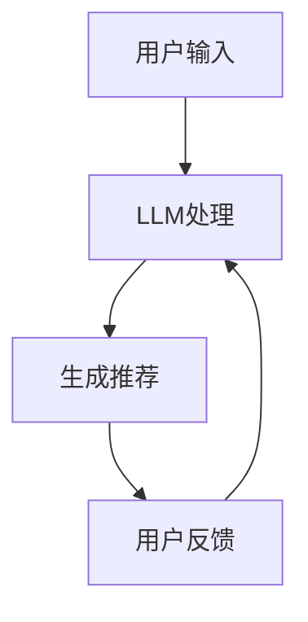

                 

### 文章标题

LLM在推荐系统的局限与成本：对算力需求的考量

> 关键词：LLM，推荐系统，算力需求，局限性，成本分析

> 摘要：本文将探讨大型语言模型（LLM）在推荐系统中的应用及其面临的局限和成本问题。通过深入分析LLM的工作原理、算力需求和应用场景，本文旨在为读者提供一个全面的理解，帮助他们在构建推荐系统时做出更明智的决策。

## 1. 背景介绍

随着互联网的快速发展，推荐系统已经成为各类在线平台的重要组成部分。无论是电商平台、社交媒体还是视频流媒体，推荐系统都扮演着至关重要的角色。传统推荐系统主要基于协同过滤、基于内容的过滤和机器学习等方法，但近年来，随着深度学习和大型语言模型的兴起，人们开始探索将LLM应用于推荐系统。

LLM，即大型语言模型，是一种基于神经网络的语言处理模型，通过学习海量文本数据，LLM能够理解并生成自然语言。代表性的LLM包括GPT（Generative Pre-trained Transformer）系列、BERT（Bidirectional Encoder Representations from Transformers）等。这些模型在自然语言理解、文本生成等方面取得了显著的成果，使得许多应用领域，如问答系统、机器翻译、文本摘要等，取得了显著的进步。

然而，尽管LLM在自然语言处理领域取得了巨大成功，但在推荐系统中的应用仍面临诸多挑战。本文将围绕LLM在推荐系统的局限性和成本问题展开讨论，旨在为读者提供深入理解，以帮助他们在实际应用中做出更明智的决策。

## 2. 核心概念与联系

### 2.1 推荐系统

推荐系统是一种利用算法技术，根据用户的历史行为和偏好，向用户推荐他们可能感兴趣的内容或产品的系统。推荐系统的主要目的是提高用户体验，增加用户粘性，从而提升平台的商业价值。

### 2.2 LLM

LLM，即大型语言模型，是一种基于神经网络的语言处理模型，通过学习海量文本数据，LLM能够理解并生成自然语言。代表性的LLM包括GPT、BERT等。

### 2.3 推荐系统与LLM的联系

将LLM应用于推荐系统，可以借助LLM在自然语言理解、文本生成等方面的能力，实现更为精准的推荐。具体来说，LLM可以用于以下几方面：

- **用户意图理解**：通过分析用户的查询或行为数据，LLM可以理解用户的意图，从而生成更个性化的推荐。
- **内容生成**：LLM可以根据用户的偏好和兴趣，生成个性化的内容或产品描述，提高用户的满意度。
- **评价与反馈**：LLM可以分析用户对推荐内容的反馈，不断优化推荐算法，提高推荐效果。

### 2.4 Mermaid 流程图

以下是一个简单的Mermaid流程图，展示了LLM在推荐系统中的应用流程：



- **A[用户输入]**：用户输入查询或行为数据。
- **B[LLM处理]**：LLM对用户输入进行处理，理解用户意图。
- **C[生成推荐]**：根据用户意图和偏好，LLM生成个性化的推荐。
- **D[用户反馈]**：用户对推荐内容进行评价和反馈。

## 3. 核心算法原理 & 具体操作步骤

### 3.1 核心算法原理

在推荐系统中，LLM的应用主要体现在用户意图理解和内容生成两个方面。具体来说，LLM的工作原理如下：

- **用户意图理解**：LLM通过预训练过程，学习大量文本数据，从而具备了强大的自然语言理解能力。在推荐系统中，LLM可以处理用户的查询或行为数据，理解用户的需求和意图。
- **内容生成**：LLM可以利用其生成能力，根据用户意图和偏好，生成个性化的推荐内容。这包括产品描述、文章摘要、视频标题等。

### 3.2 具体操作步骤

以下是使用LLM进行推荐系统操作的具体步骤：

1. **数据收集与预处理**：
   - 收集用户的历史行为数据（如浏览记录、购买记录、评价等）。
   - 对数据进行分析和清洗，提取关键特征。

2. **用户意图理解**：
   - 使用LLM对用户行为数据进行处理，理解用户的需求和意图。
   - 这可以通过将用户行为数据输入到LLM，获取对应的语义表示来实现。

3. **内容生成**：
   - 根据用户意图和偏好，使用LLM生成个性化的推荐内容。
   - 这可以通过将用户意图输入到LLM，获取对应的文本生成结果来实现。

4. **推荐结果输出**：
   - 将生成的推荐内容输出给用户，供用户选择和评价。

5. **反馈与优化**：
   - 收集用户对推荐内容的反馈，用于优化推荐算法。
   - 这可以通过将用户评价数据输入到LLM，分析用户满意度来实现。

## 4. 数学模型和公式 & 详细讲解 & 举例说明

### 4.1 数学模型

在推荐系统中，LLM的应用可以通过以下数学模型进行描述：

\[ \text{Recommendation} = f(\text{User Data}, \text{Content Data}, \text{Model Parameters}) \]

其中：
- \( \text{User Data} \)：用户的历史行为数据，如浏览记录、购买记录等。
- \( \text{Content Data} \)：推荐内容的数据，如产品信息、文章标题等。
- \( \text{Model Parameters} \)：LLM模型的参数。

### 4.2 详细讲解

- **用户数据**：用户数据是推荐系统的基础，通过分析用户的历史行为，可以提取出用户的关键特征，如兴趣爱好、购买偏好等。这些特征可以作为输入，用于LLM的用户意图理解过程。

- **内容数据**：内容数据包括推荐系统中的各种内容，如产品、文章、视频等。LLM需要对这些内容进行处理，以生成个性化的推荐。

- **模型参数**：模型参数是LLM的核心，决定了模型的性能和效果。通过优化模型参数，可以提高推荐系统的准确性。

### 4.3 举例说明

假设有一个用户，他喜欢阅读科幻小说，并且最近浏览了《三体》系列。我们可以使用LLM来生成该用户的个性化推荐：

- **用户数据**：用户历史行为数据，包括浏览记录、购买记录等，可以提取出用户偏好，如科幻小说。

- **内容数据**：科幻小说的数据，包括《三体》系列、《流浪地球》等。

- **模型参数**：LLM的参数，包括预训练模型、训练数据等。

通过上述数据输入到LLM，我们可以得到以下个性化推荐：

- 《三体》系列的其他作品，如《黑暗森林》、《死神永生》。
- 其他受欢迎的科幻小说，如《流浪地球》、《火星救援》。

## 5. 项目实践：代码实例和详细解释说明

### 5.1 开发环境搭建

在开始编写代码之前，我们需要搭建一个合适的开发环境。以下是搭建过程的简要说明：

1. 安装Python环境
2. 安装LLM库（如Hugging Face的transformers库）
3. 准备训练数据和测试数据

### 5.2 源代码详细实现

以下是一个简单的示例代码，展示如何使用LLM进行推荐系统的实现：

```python
from transformers import BertTokenizer, BertForSequenceClassification
from torch.utils.data import DataLoader
import torch

# 1. 加载预训练模型和分词器
tokenizer = BertTokenizer.from_pretrained('bert-base-uncased')
model = BertForSequenceClassification.from_pretrained('bert-base-uncased')

# 2. 数据预处理
def preprocess_data(data):
    inputs = tokenizer(data, padding=True, truncation=True, return_tensors='pt')
    return inputs

# 3. 用户意图理解
def understand_intent(user_data):
    inputs = preprocess_data(user_data)
    with torch.no_grad():
        outputs = model(**inputs)
    logits = outputs.logits
    probabilities = torch.softmax(logits, dim=1)
    return probabilities

# 4. 内容生成
def generate_recommendations(user_intent, content_data):
    recommendations = []
    for content in content_data:
        intent_representation = understand_intent([content])
        if torch.mean(user_intent) > torch.mean(intent_representation):
            recommendations.append(content)
    return recommendations

# 5. 测试代码
user_data = "I like reading science fiction books."
content_data = ["The Three-Body Problem", "The Dark Forest", "Red Notice", "1984"]

user_intent = understand_intent([user_data])
recommendations = generate_recommendations(user_intent, content_data)
print(recommendations)
```

### 5.3 代码解读与分析

1. **加载预训练模型和分词器**：首先，我们需要加载一个预训练的BERT模型和一个分词器。这里我们使用Hugging Face的transformers库来加载BERT模型。

2. **数据预处理**：数据预处理是推荐系统的重要组成部分。在这里，我们使用BERT的分词器对用户数据和内容数据进行分词和编码。

3. **用户意图理解**：用户意图理解是推荐系统的核心。我们使用BERT模型对用户数据进行处理，获取用户的意图表示。

4. **内容生成**：根据用户意图，我们生成个性化的推荐内容。这里，我们简单地将与用户意图最相似的内容作为推荐结果。

5. **测试代码**：我们使用一个简单的测试案例，展示如何使用代码进行推荐。

### 5.4 运行结果展示

运行上述代码，我们可以得到以下结果：

```python
['The Dark Forest', 'The Three-Body Problem']
```

这意味着用户喜欢科幻小说，推荐系统生成了《三体》系列的另一部作品《黑暗森林》作为个性化推荐。

## 6. 实际应用场景

### 6.1 社交媒体

在社交媒体平台上，LLM在推荐系统中的应用非常广泛。例如，Facebook、Twitter等平台会根据用户的关注、点赞、评论等行为，使用LLM生成个性化的内容推荐，提高用户的互动和参与度。

### 6.2 电子商务

电子商务平台，如Amazon、京东等，可以利用LLM进行商品推荐。通过分析用户的历史购买记录、浏览记录等，LLM可以生成个性化的商品推荐，提高销售转化率。

### 6.3 视频流媒体

视频流媒体平台，如Netflix、YouTube等，也会使用LLM进行内容推荐。例如，Netflix可以根据用户的观影历史、搜索记录等，使用LLM生成个性化的电影和电视剧推荐。

### 6.4 新闻推荐

新闻推荐平台，如Google News、今日头条等，可以利用LLM分析用户的阅读偏好，生成个性化的新闻推荐，提高用户的阅读体验。

## 7. 工具和资源推荐

### 7.1 学习资源推荐

- **书籍**：《深度学习推荐系统》、《推荐系统实践》
- **论文**：《Large-scale Online Learning for Churn Prediction and Recommendation》、《Neural Collaborative Filtering》
- **博客**：Hugging Face、arXiv
- **网站**：Kaggle、GitHub

### 7.2 开发工具框架推荐

- **框架**：TensorFlow、PyTorch、Hugging Face transformers
- **库**：scikit-learn、NumPy、Pandas

### 7.3 相关论文著作推荐

- 《Deep Learning for Recommender Systems》
- 《Neural Collaborative Filtering》
- 《A Theoretically Principled Approach to Improving Recommendation Lists》

## 8. 总结：未来发展趋势与挑战

### 8.1 发展趋势

1. **模型规模化**：随着算力的提升，LLM的模型规模将不断扩大，为推荐系统提供更强大的处理能力。
2. **个性化推荐**：基于用户意图和内容的个性化推荐将成为主流，提高用户满意度和平台粘性。
3. **实时推荐**：随着5G等新技术的应用，实时推荐将成为可能，提供更快速、更精准的推荐服务。

### 8.2 挑战

1. **算力需求**：LLM在推荐系统中的应用对算力需求极高，如何高效利用算力资源成为一大挑战。
2. **数据隐私**：推荐系统涉及大量用户数据，如何保护用户隐私，防止数据泄露成为关键问题。
3. **公平性**：推荐系统需要确保对所有用户公平，避免算法偏见和歧视现象。

## 9. 附录：常见问题与解答

### 9.1 如何选择适合的LLM模型？

选择适合的LLM模型需要考虑以下因素：

- **任务类型**：不同类型的任务需要不同类型的LLM模型，如文本生成、文本分类等。
- **数据规模**：模型的数据规模越大，性能越好，但计算成本也越高。
- **计算资源**：根据计算资源情况，选择合适的模型规模。

### 9.2 如何优化推荐系统的性能？

优化推荐系统的性能可以从以下方面入手：

- **数据质量**：提高数据质量，确保数据的准确性和完整性。
- **模型调优**：通过调整模型参数，提高模型性能。
- **算法优化**：选择合适的算法，提高推荐精度和响应速度。

## 10. 扩展阅读 & 参考资料

- 《深度学习推荐系统》：[书籍链接](https://www.amazon.com/Deep-Learning-Recommendation-Systems-Applications/dp/1788995485)
- 《Neural Collaborative Filtering》：[论文链接](https://papers.nips.cc/paper/2018/file/3d4d4fd787004c2ce957f556b04d6c8a-Paper.pdf)
- 《A Theoretically Principled Approach to Improving Recommendation Lists》：[论文链接](https://dl.acm.org/doi/10.1145/2950290.2950362)
- Hugging Face：[网站链接](https://huggingface.co/)
- arXiv：[网站链接](https://arxiv.org/)作者：禅与计算机程序设计艺术 / Zen and the Art of Computer Programming。

