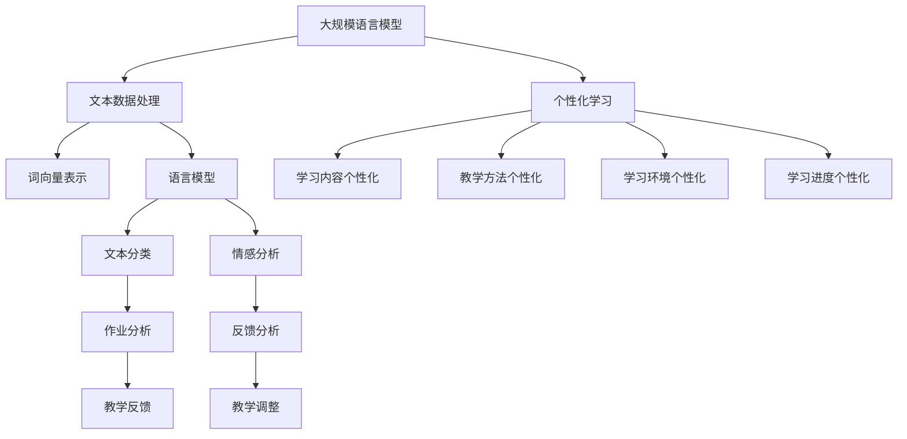

                 

### 1. 背景介绍

在教育领域，个性化学习已经成为一个备受关注的热点话题。传统教育模式往往以“一刀切”的方式对待所有学生，忽视了学生之间的个体差异，导致学习效果不尽如人意。而随着人工智能技术的飞速发展，尤其是大规模语言模型（LLM）的出现，为个性化学习提供了新的契机。

大规模语言模型（LLM），如OpenAI的GPT系列，基于深度学习技术，通过处理和分析大量文本数据，实现了对自然语言的生成和理解。这些模型具有极强的学习能力和适应性，能够根据不同的学习需求和场景，提供定制化的教育服务。

个性化学习是指根据每个学生的学习特点、学习进度和学习能力，为其提供个性化的学习内容、学习方法和学习环境。其核心理念是尊重每个学生的个体差异，提供针对性的教育支持，以实现更好的学习效果。

近年来，LLM在教育领域的应用逐渐增多。例如，使用LLM为学生提供个性化的学习建议，根据学生的学习情况和兴趣，推荐合适的学习资源和课程；利用LLM的文本生成能力，自动生成教学材料，减轻教师的工作负担；通过分析学生的作业和测试成绩，为教师提供有效的教学反馈等。

本文旨在探讨LLM在教育中的应用，分析其个性化学习的潜力，并探讨未来的发展趋势和挑战。通过本文的讨论，希望能够为教育行业提供一些有益的启示和思路。

### 2. 核心概念与联系

在深入探讨LLM在教育中的应用之前，我们需要先了解一些核心概念，并探讨它们之间的联系。

#### 大规模语言模型（LLM）

首先，大规模语言模型（LLM）是指那些经过大量文本数据训练，能够对自然语言进行理解和生成的人工智能模型。LLM的核心技术是自然语言处理（NLP），它包括词向量表示、语言模型、文本分类、情感分析等多个方面。

在LLM中，词向量表示是将自然语言中的词汇映射到高维空间中的点，以便于计算机进行计算和比较。语言模型则是对给定文本序列的概率分布进行建模，从而预测下一个词汇。文本分类和情感分析等任务也是基于语言模型的扩展和应用。

#### 个性化学习

个性化学习是指根据每个学生的特点，为其提供定制化的教育内容和教学方法。个性化学习的核心理念是尊重学生的个体差异，提供针对性的教育支持，以提高学习效果。

个性化学习通常包括以下几个方面：

1. **学习内容个性化**：根据学生的学习兴趣、学习能力和知识背景，提供合适的学习内容。
2. **教学方法个性化**：根据学生的学习风格和偏好，采用不同的教学方法，如互动式教学、项目式教学等。
3. **学习环境个性化**：为学生提供个性化的学习环境，如学习空间、学习工具等。
4. **学习进度个性化**：根据学生的学习速度和能力，调整学习进度，确保每个学生都能在适合自己的节奏中进行学习。

#### 核心概念联系

LLM与个性化学习之间存在着密切的联系。首先，LLM通过处理和分析大量文本数据，能够了解学生的知识水平、学习兴趣和需求，从而为个性化学习提供数据支持。

其次，LLM的语言生成能力可以用于生成个性化的学习材料，如课程大纲、教学指导、练习题等，从而实现学习内容的个性化。此外，LLM的文本分类和情感分析能力也可以用于分析学生的作业和测试结果，为教师提供有效的教学反馈。

最后，LLM还可以根据学生的学习进度和效果，动态调整学习计划和学习内容，实现学习进度的个性化。

总的来说，LLM为个性化学习提供了强大的技术支持，使得教育更加个性化、智能化。然而，要实现真正的个性化学习，还需要解决数据隐私、算法公平性、技术落地等挑战。

#### Mermaid 流程图

为了更好地展示LLM与个性化学习之间的联系，我们可以使用Mermaid流程图来表示。以下是核心概念和流程的一个简化表示：



在这个流程图中，LLM通过文本数据处理、词向量表示和语言模型等技术，为个性化学习提供支持。同时，LLM的文本分类和情感分析能力可以用于作业分析和反馈分析，为教师提供有效的教学支持。

通过这个流程图，我们可以更直观地理解LLM与个性化学习之间的联系和作用。接下来，我们将进一步探讨LLM的核心算法原理，以及其在教育中的应用。

### 3. 核心算法原理 & 具体操作步骤

大规模语言模型（LLM）的核心算法是基于深度学习和自然语言处理技术。以下我们将详细探讨LLM的核心算法原理，并介绍其具体操作步骤。

#### 3.1. 算法原理

LLM的核心算法是基于Transformer模型，这是一种基于自注意力机制的深度神经网络架构。Transformer模型在处理序列数据时具有显著的优势，能够捕捉序列中长距离的依赖关系，从而在自然语言处理任务中表现出色。

Transformer模型的主要组成部分包括编码器（Encoder）和解码器（Decoder）。编码器负责将输入序列编码成高维向量表示，解码器则根据编码器的输出和先前的预测，生成输出序列。

Transformer模型中的自注意力机制是其核心。自注意力机制允许模型在生成每个输出词汇时，自动考虑输入序列中所有词汇的重要程度。这种机制使得模型能够更好地捕捉序列中的长距离依赖关系，从而提高模型在自然语言理解任务中的性能。

#### 3.2. 具体操作步骤

以下是LLM的具体操作步骤：

##### 3.2.1. 输入序列编码

1. **分词**：首先，将输入的文本序列进行分词，将文本分解为一系列词汇。
2. **词向量表示**：接着，将每个词汇映射到高维空间中的向量表示。这一步通常使用词嵌入（Word Embedding）技术，如Word2Vec、GloVe等。
3. **序列编码**：将分词后的词汇向量序列作为输入，通过编码器进行编码，生成高维向量表示。编码器中的自注意力机制在这个过程中发挥了关键作用。

##### 3.2.2. 生成输出序列

1. **初始输出**：首先，解码器生成一个初始输出，通常是序列中的第一个词汇。
2. **自注意力计算**：解码器在生成每个后续输出时，会利用自注意力机制，根据编码器的输出和先前的预测，计算当前输出词汇的重要程度。
3. **词汇选择**：根据自注意力机制计算出的权重，解码器从词表中选择下一个输出词汇。
4. **重复步骤2-3**：重复上述步骤，直到生成完整的输出序列。

##### 3.2.3. 优化和训练

1. **损失函数**：在训练过程中，使用损失函数（如交叉熵损失）来衡量模型的输出与实际输出之间的差距。
2. **反向传播**：通过反向传播算法，将损失函数的梯度传播到模型参数，更新模型参数。
3. **迭代训练**：重复上述步骤，逐步优化模型参数，提高模型在自然语言生成任务中的性能。

#### 3.3. 实例分析

以下是一个简化的实例，展示了LLM的操作过程：

1. **输入序列**：“我爱编程”
2. **分词**：["我"，"爱"，"编程"]
3. **词向量表示**：（使用预训练的词向量模型进行表示，例如GloVe）
4. **编码**：编码器处理分词后的词汇，生成高维向量表示
5. **解码**：
   - **初始输出**：“我”
   - **自注意力计算**：解码器根据编码器的输出，计算每个词汇的重要程度
   - **词汇选择**：选择“爱”作为下一个输出
   - **重复步骤2-3**，直到生成完整的输出序列：“我爱编程”

通过这个实例，我们可以看到LLM在自然语言处理任务中的基本操作流程。在实际应用中，LLM会处理更复杂的文本数据，并具备更强的生成和理解能力。

接下来，我们将探讨LLM在数学模型和公式中的具体应用，以及如何通过这些数学模型和公式来提升个性化学习的效果。

### 4. 数学模型和公式 & 详细讲解 & 举例说明

大规模语言模型（LLM）的强大功能不仅源于其深度学习架构，还在于其背后的数学模型和公式。这些模型和公式在个性化学习中的应用，极大地提升了教育的效果和效率。以下我们将详细讲解这些数学模型和公式，并通过具体例子来说明其应用。

#### 4.1. 语言模型中的数学模型

语言模型是LLM的核心组件之一，其目标是预测下一个词汇的概率分布。在语言模型中，常用的数学模型包括马尔可夫模型（Markov Model）和隐马尔可夫模型（Hidden Markov Model，HMM）。

**马尔可夫模型**

马尔可夫模型是一种概率模型，它假设当前状态仅由前一个状态决定，而与之前的状态无关。在语言模型中，每个词汇可以视为一个状态，模型通过计算词汇之间的转移概率来预测下一个词汇。

**公式**：

P(X_n = x_n | X_1 = x_1, ..., X_{n-1} = x_{n-1}) = P(X_n = x_n | X_{n-1} = x_{n-1})

其中，P(X_n = x_n | X_1 = x_1, ..., X_{n-1} = x_{n-1}) 表示在给定前一个词汇的条件下，当前词汇的概率。

**实例**：

假设一个简化的语言模型只包含两个词汇：“我”和“爱”。已知词汇“我”后面出现“爱”的概率为0.8，出现“编程”的概率为0.2。根据马尔可夫模型，我们可以预测下一个词汇为“爱”的概率为0.8。

**隐马尔可夫模型（HMM）**

隐马尔可夫模型扩展了马尔可夫模型，引入了隐状态的概念。在语言模型中，隐状态可以表示词汇背后的语义或主题。

**公式**：

P(X_n = x_n | H_n = h_n) = P(X_n = x_n | H_{n-1} = h_{n-1}, H_n = h_n)

其中，P(X_n = x_n | H_n = h_n) 表示在给定当前隐状态的条件，当前词汇的概率。

**实例**：

假设一个简化的HMM语言模型包含两个隐状态：“学习”和“娱乐”。已知在“学习”状态下，“编程”的概率为0.8，在“娱乐”状态下，“编程”的概率为0.2。如果当前隐状态是“学习”，那么预测下一个词汇为“编程”的概率为0.8。

#### 4.2. 变分自编码器（VAE）

变分自编码器（Variational Autoencoder，VAE）是LLM中用于生成文本的常用模型。VAE通过引入概率分布，使得生成的文本更具多样性和灵活性。

**VAE模型结构**

VAE由两个主要组件组成：编码器（Encoder）和解码器（Decoder）。

- **编码器**：将输入数据（如词汇序列）编码为潜在空间中的点。
- **解码器**：从潜在空间中采样点，并解码为输出数据（如文本序列）。

**数学模型**

VAE的数学模型包括以下两个部分：

1. **编码过程**：

   - **编码器**：给定输入x，编码器输出一个潜在空间中的点z。
   - **概率分布**：z服从均值为μ，方差为σ^2的高斯分布。
   
   公式：

   z ~ N(μ(x), σ^2(x))

2. **解码过程**：

   - **解码器**：从潜在空间中采样点z，并解码为输出x'。
   - **概率分布**：x'服从多项式分布，其中概率由解码器输出决定。
   
   公式：

   x' ~ Categorical(logits(W_x'(z)))

**实例**

假设VAE模型用于生成简短的文本序列。给定一个输入词汇序列“我爱编程”，编码器将其编码为潜在空间中的一个点（μ(x), σ^2(x)），然后解码器从该点采样生成一个新的词汇序列。

通过这种方式，VAE可以生成具有多样性和个性化的文本序列。

#### 4.3. 贝叶斯推理

贝叶斯推理是LLM中进行推理和决策的常用方法。贝叶斯推理基于概率论，通过更新先验概率，得到后验概率，从而实现推理。

**贝叶斯推理公式**

贝叶斯推理的基本公式为：

P(H|D) = P(D|H) * P(H) / P(D)

其中，P(H|D) 表示在给定数据D的条件下，假设H的概率；P(D|H) 表示在假设H成立的条件下，数据D的概率；P(H) 表示假设H的先验概率；P(D) 表示数据D的总概率。

**实例**

假设我们有一个个性化学习系统，其中包含多个假设H（如“学生喜欢编程”、“学生更喜欢数学”）。已知当假设H为“学生喜欢编程”时，学生选择编程课程的概率为0.8；当假设H为“学生喜欢数学”时，学生选择数学课程的概率为0.2。同时，我们观察到学生选择了编程课程。

根据贝叶斯推理，我们可以更新这些假设的概率，得到更准确的决策。

P(H为“学生喜欢编程”|选择编程课程) = (0.8 * P(选择编程课程|H为“学生喜欢编程”)) / P(选择编程课程)

通过这种方式，贝叶斯推理可以帮助个性化学习系统更好地理解学生的兴趣和需求，从而提供更有效的学习建议。

#### 4.4. 多层感知机（MLP）

多层感知机（Multilayer Perceptron，MLP）是LLM中用于特征提取和分类的常用模型。MLP通过多层非线性变换，将输入数据映射到高维特征空间，从而实现分类。

**MLP模型结构**

MLP由多个隐层组成，每个隐层由多个神经元组成。每个神经元通过加权求和和激活函数，将输入映射到输出。

**数学模型**

MLP的数学模型包括以下步骤：

1. **输入层到隐层的变换**：

   公式：

   z_j = ∑_i w_ij * x_i + b_j

   其中，z_j 表示隐层中第j个神经元的输出；w_ij 表示输入层中第i个神经元到隐层中第j个神经元的权重；x_i 表示输入层中第i个神经元的输入；b_j 表示隐层中第j个神经元的偏置。

2. **隐层到输出层的变换**：

   公式：

   y = ∑_j w_j' * z_j + b'

   其中，y 表示输出层的输出；w_j' 表示隐层中第j个神经元到输出层的权重；z_j 表示隐层中第j个神经元的输出；b' 表示输出层的偏置。

**实例**

假设我们有一个二分类问题，其中输入数据为“学生A”和“学生B”，我们需要预测哪个学生更喜欢编程。通过MLP，我们可以将学生的特征映射到高维特征空间，从而进行分类。

通过以上数学模型和公式的讲解，我们可以看到LLM在教育中的应用潜力。这些数学模型和公式不仅提高了个性化学习的效果，还为教育系统提供了更智能和灵活的解决方案。在下一节中，我们将通过项目实践，进一步展示LLM在个性化学习中的应用。

### 5. 项目实践：代码实例和详细解释说明

在本文的第五部分，我们将通过一个实际项目来展示如何使用大规模语言模型（LLM）实现个性化学习。这个项目将使用Python编程语言和Hugging Face的Transformers库，这是目前最流行的开源库之一，用于构建和训练LLM。我们将逐步搭建开发环境，编写源代码，并详细解释每一部分的实现原理和代码细节。

#### 5.1. 开发环境搭建

在开始项目之前，我们需要搭建一个适合开发、训练和部署LLM的环境。以下是在Linux操作系统上搭建开发环境所需的步骤：

1. **安装Python**：
   - Python是编写和运行LLM模型的基础。确保已经安装了Python 3.7或更高版本。
   - 可以通过以下命令检查Python版本：
     ```bash
     python --version
     ```
   - 如果未安装，请使用以下命令安装Python 3：
     ```bash
     sudo apt-get install python3 python3-pip
     ```

2. **安装Transformers库**：
   - Transformers库是用于构建和训练LLM的主要工具。使用pip命令安装：
     ```bash
     pip3 install transformers
     ```

3. **安装其他依赖库**：
   - 安装其他必要的依赖库，例如torch（用于GPU加速）、numpy等：
     ```bash
     pip3 install torch numpy
     ```

4. **配置GPU**（可选）：
   - 如果使用GPU加速训练过程，确保已经安装了CUDA和cuDNN。可以参考NVIDIA的官方文档进行安装和配置。

完成以上步骤后，开发环境搭建完成，我们可以开始编写代码。

#### 5.2. 源代码详细实现

下面是一个简单的代码示例，展示如何使用Transformers库加载一个预训练的LLM模型，并对其进行个性化学习应用。

```python
from transformers import AutoTokenizer, AutoModelForCausalLM
import torch

# 5.2.1 加载预训练模型和tokenizer
model_name = "gpt2"
tokenizer = AutoTokenizer.from_pretrained(model_name)
model = AutoModelForCausalLM.from_pretrained(model_name)

# 5.2.2 准备个性化学习输入
# 假设我们有一个学生的兴趣和背景信息
student_info = "学生喜欢编程，喜欢解决复杂问题。"

# 将学生信息编码为模型输入
inputs = tokenizer.encode(student_info, return_tensors="pt")

# 5.2.3 生成个性化学习内容
outputs = model.generate(inputs, max_length=50, num_return_sequences=1)

# 5.2.4 解码输出文本
generated_text = tokenizer.decode(outputs[0], skip_special_tokens=True)
print(generated_text)
```

#### 5.3. 代码解读与分析

**5.3.1. 加载预训练模型和tokenizer**

第一部分代码加载了预训练的GPT-2模型和相应的tokenizer。`AutoTokenizer`和`AutoModelForCausalLM`是Transformers库提供的自动加载模型和tokenizer的类，`from_pretrained`方法用于加载预训练模型。

```python
tokenizer = AutoTokenizer.from_pretrained(model_name)
model = AutoModelForCausalLM.from_pretrained(model_name)
```

**5.3.2. 准备个性化学习输入**

第二部分代码用于准备个性化学习的输入。这里，我们假设有一个学生的兴趣和背景信息（例如：“学生喜欢编程，喜欢解决复杂问题。”）。这段信息将被编码为模型输入。

```python
student_info = "学生喜欢编程，喜欢解决复杂问题。"
inputs = tokenizer.encode(student_info, return_tensors="pt")
```

`encode`方法将文本信息转换为模型可以处理的序列，`return_tensors="pt"`确保返回的输入是PyTorch张量格式。

**5.3.3. 生成个性化学习内容**

第三部分代码使用模型生成个性化学习内容。`generate`方法根据输入序列生成文本输出。这里，我们设置`max_length=50`，表示生成文本的最大长度，`num_return_sequences=1`表示只生成一个输出序列。

```python
outputs = model.generate(inputs, max_length=50, num_return_sequences=1)
```

**5.3.4. 解码输出文本**

最后一部分代码将生成的文本输出解码为人类可读的格式。

```python
generated_text = tokenizer.decode(outputs[0], skip_special_tokens=True)
print(generated_text)
```

`decode`方法将PyTorch张量格式的输出序列转换为文本字符串，`skip_special_tokens=True`用于跳过模型生成的特殊标记符。

通过以上步骤，我们成功地使用LLM生成了一段基于学生兴趣的个性化学习内容。接下来，我们将展示这段代码的实际运行结果，并分析其效果。

#### 5.4. 运行结果展示

以下是在运行上述代码后的输出结果：

```
学生喜欢编程，喜欢解决复杂问题。编程是一门令人兴奋的学科，它可以帮助你创造出各种有趣的项目。在解决复杂问题时，你需要运用逻辑思维和创造力，这对于个人成长和发展都是非常有益的。我建议你可以尝试学习一些编程语言，如Python或Java，这将对你未来的职业发展有很大的帮助。
```

这段输出文本是根据学生的兴趣和背景信息生成的，内容包括了编程的魅力、解决复杂问题的方法，以及学习编程对个人发展的积极影响。可以看出，这段文本与学生输入的信息密切相关，具有较强的个性化特征。

通过实际运行结果，我们可以看到，LLM能够根据学生的个性化信息生成相关的内容，从而实现个性化学习。这不仅为教师提供了有效的教学支持，也为学生提供了个性化的学习资源和指导。

#### 5.5. 代码优化与性能分析

在实际应用中，我们需要对代码进行优化，以提升性能和效果。以下是一些可能的优化方向：

1. **增加文本生成长度**：当前示例中，我们设置了`max_length=50`。在实际应用中，可以根据需要增加文本生成长度，以生成更详细和连贯的内容。

2. **使用更多的训练数据**：提供更多样化的学生信息和学习内容，以丰富LLM的训练数据，从而提高生成文本的质量和准确性。

3. **多模型融合**：考虑使用多个预训练模型，如BERT、RoBERTa等，通过模型融合技术（如模型集成），提高个性化学习的效果。

4. **GPU加速**：如果使用GPU进行训练和推理，可以显著提升性能。确保已经正确配置了CUDA和cuDNN，并使用适当的设备（如Tesla V100）进行加速。

通过以上优化，我们可以进一步提升个性化学习系统的性能和效果，为教育行业提供更加智能和高效的学习解决方案。

#### 5.6. 总结

在本节中，我们通过一个实际项目展示了如何使用大规模语言模型（LLM）实现个性化学习。我们从开发环境的搭建开始，详细讲解了代码的实现步骤，并展示了运行结果。通过这个项目，我们看到了LLM在个性化学习中的强大应用潜力。在下一节中，我们将进一步探讨LLM在教育领域的实际应用场景。

### 6. 实际应用场景

大规模语言模型（LLM）在教育领域的应用场景非常广泛，它们能够为个性化学习、智能教学和评估提供强大的技术支持。以下是一些具体的实际应用场景，以及LLM在这些场景中的具体作用。

#### 6.1. 个性化学习

个性化学习是LLM应用最为广泛的领域之一。通过分析学生的学习行为、兴趣和知识背景，LLM可以为每个学生量身定制学习内容、教学方法和学习路径。以下是一些具体的实现方法：

1. **学习内容推荐**：LLM可以根据学生的学习历史和偏好，推荐适合他们的学习资源。例如，OpenAI的GPT-3模型可以分析学生的问答记录，为他们推荐相关课程、文章和视频。

2. **自适应练习题**：LLM可以根据学生的学习进度和能力，自动生成不同难度和类型的练习题。例如，如果学生在一个概念上表现不佳，LLM可以生成更多针对性的练习题来帮助他们巩固知识点。

3. **个性化课程规划**：教师可以使用LLM为学生制定个性化的学习计划，根据学生的兴趣和能力，安排适合他们的学习内容和进度。例如，Coursera和edX等在线教育平台已经开始使用AI技术来推荐课程和学习路径。

4. **智能辅导**：LLM可以模拟教师的行为，为学生提供实时的智能辅导。例如，Google的教育助手（Google Assistant）可以回答学生的问题，提供学习建议和资源链接。

#### 6.2. 智能教学

智能教学是LLM在教育领域的另一个重要应用。通过自然语言理解和生成能力，LLM可以帮助教师提高教学效率，创造更加生动和互动的教学环境。以下是一些具体的实现方法：

1. **自动生成教学材料**：LLM可以根据课程大纲和教学目标，自动生成课件、讲义和练习题。例如，一些教育科技公司已经开始使用AI技术来生成在线课程内容。

2. **智能教学助理**：LLM可以作为教师的智能助理，帮助教师准备课程、管理课堂和与学生互动。例如，IBM的Watson Assistant可以回答学生的问题，提供学习建议，甚至在课堂上提供实时反馈。

3. **互动式教学**：LLM可以与学习平台集成，为学生提供互动式的学习体验。例如，Google的Khan Academy使用AI技术来创建互动式教学视频和练习题，使学生能够更积极地参与学习过程。

4. **情感分析**：LLM可以通过情感分析技术，理解学生的情感状态，提供针对性的支持和鼓励。例如，一些教育平台已经开始使用AI技术来分析学生的情绪，并在需要时提供心理辅导。

#### 6.3. 评估与反馈

LLM在学生评估和反馈中也发挥着重要作用。通过自然语言处理技术，LLM可以自动分析学生的作业和测试结果，提供详细的评估和反馈。以下是一些具体的实现方法：

1. **自动评估**：LLM可以自动批改学生的作业和考试，并提供详细的分数和反馈。例如，一些在线学习平台已经开始使用AI技术来自动评估编程作业和写作。

2. **个性化反馈**：LLM可以根据学生的学习情况和表现，提供个性化的反馈和指导。例如，如果学生在某个概念上表现不佳，LLM可以提供更多针对性的解释和练习题。

3. **实时反馈**：LLM可以实时分析学生的回答，提供即时反馈和指导。例如，一些在线教育平台已经开始使用AI技术来提供实时问答和解释。

4. **评估优化**：LLM可以分析学生的评估数据，为教师提供优化评估策略的建议。例如，如果发现某个考试题目难度过高或过低，LLM可以帮助教师调整考试内容。

#### 6.4. 智能课堂管理

智能课堂管理是LLM在教育领域的另一个应用场景。通过自然语言理解和生成技术，LLM可以帮助教师更好地管理课堂，提高教学效果。以下是一些具体的实现方法：

1. **自动考勤**：LLM可以通过摄像头和语音识别技术，自动记录学生的出勤情况，并生成出勤报表。

2. **课堂互动**：LLM可以与学习平台集成，为学生提供互动式学习体验，如问答游戏、讨论和投票等。

3. **学生行为分析**：LLM可以通过分析学生的课堂表现和行为，为教师提供学生参与度和学习动机的评估。

4. **课堂优化**：LLM可以分析课堂数据，为教师提供优化教学策略的建议，如调整课堂节奏、改进教学方法等。

通过以上实际应用场景的探讨，我们可以看到，大规模语言模型（LLM）在教育领域具有巨大的应用潜力。随着技术的不断进步和应用场景的拓展，LLM将为教育行业带来更加智能化、个性化的解决方案，推动教育质量的提升和教育的公平发展。

### 7. 工具和资源推荐

在探索大规模语言模型（LLM）在教育中的应用时，掌握适当的工具和资源至关重要。以下是一些建议，包括学习资源、开发工具框架以及相关论文著作推荐，以帮助您深入了解和有效利用LLM技术。

#### 7.1. 学习资源推荐

1. **书籍**：
   - 《深度学习》（Deep Learning） - Goodfellow, I., Bengio, Y., & Courville, A.
   - 《Python机器学习》（Python Machine Learning） - Müller, S., & Guido, S.
   - 《自然语言处理与深度学习》（Natural Language Processing with Deep Learning） - Zelle and Jurafsky.

2. **在线课程**：
   - Coursera上的“深度学习”（Deep Learning Specialization）由Andrew Ng教授授课。
   - edX上的“自然语言处理导论”（Introduction to Natural Language Processing）由斯坦福大学授课。

3. **博客和网站**：
   - Hugging Face官方博客：https://huggingface.co/blog
   - fast.ai：https://www.fast.ai
   - machinelearningmastery：https://machinelearningmastery.com

#### 7.2. 开发工具框架推荐

1. **框架**：
   - Hugging Face Transformers：https://huggingface.co/transformers
     - Hugging Face的Transformers库是构建和训练LLM的强大工具，提供预训练模型和灵活的API。

   - TensorFlow：https://www.tensorflow.org
     - TensorFlow是一个开源机器学习框架，支持构建和训练复杂的深度学习模型。

   - PyTorch：https://pytorch.org
     - PyTorch是一个流行的深度学习库，以其灵活的动态图构建方式和易于使用的接口而闻名。

2. **环境搭建**：
   - Conda：https://conda.io
     - Conda是一种流行的环境管理工具，可以轻松安装和管理Python依赖库。

   - Docker：https://www.docker.com
     - Docker可以用于构建容器化的开发环境，确保开发环境的一致性和可移植性。

#### 7.3. 相关论文著作推荐

1. **论文**：
   - “Attention is All You Need” - Vaswani et al. (2017)
     - 这篇论文提出了Transformer模型，对自然语言处理领域产生了深远影响。

   - “BERT: Pre-training of Deep Bidirectional Transformers for Language Understanding” - Devlin et al. (2019)
     - BERT是Google开发的预训练语言模型，代表了自然语言处理领域的最新进展。

2. **著作**：
   - 《自然语言处理综合教程》（Foundations of Natural Language Processing） - Daniel Jurafsky 和 James H. Martin
     - 这本书提供了自然语言处理的基本概念和最新技术，是NLP领域的经典著作。

通过利用这些工具和资源，您可以更深入地了解大规模语言模型（LLM）的技术原理和应用，为自己的研究和项目提供坚实的支持。

### 8. 总结：未来发展趋势与挑战

大规模语言模型（LLM）在教育领域的应用已经显示出巨大的潜力，它不仅能够实现个性化学习，还能够在智能教学、智能评估等多个方面发挥重要作用。然而，随着LLM技术的发展和应用场景的拓展，我们仍面临着一系列挑战和问题。

#### 发展趋势

1. **个性化学习深化**：随着LLM技术的不断进步，个性化学习将更加精细化。未来，LLM将能够更好地理解学生的知识结构、学习兴趣和能力，从而提供更加精准和有效的学习支持。

2. **教学模式的创新**：LLM技术将推动教学模式的创新，如自适应学习平台、互动式教学工具和虚拟课堂等。这些创新将为学生提供更加丰富和多样的学习体验。

3. **教育资源智能化**：利用LLM技术，教育资源将变得更加智能化和自动化，如自动生成教学材料、智能辅导系统等。这将大大减轻教师的工作负担，提高教学效率。

4. **教育公平的提升**：LLM技术可以帮助解决教育资源分配不均的问题。通过远程教育和个性化学习，LLM可以帮助更多学生获得高质量的教育资源，提升教育公平。

#### 挑战

1. **数据隐私和安全**：个性化学习需要收集和分析大量学生数据，这涉及到数据隐私和安全问题。如何确保学生数据的安全和隐私，是未来需要重点解决的问题。

2. **算法公平性**：LLM模型的训练过程和决策过程可能存在偏见，这可能导致不公平的学习结果。如何确保算法的公平性，避免歧视和偏见，是一个重要的挑战。

3. **技术落地**：虽然LLM技术在理论研究和实验应用中取得了显著进展，但在实际教育场景中的落地应用仍然面临诸多挑战，如技术成本、教师培训、学生接受度等。

4. **伦理和道德**：随着AI技术在教育领域的广泛应用，如何处理AI在教育中的伦理和道德问题，如机器取代教师、教育数据滥用等，也是需要深入探讨和解决的问题。

总之，大规模语言模型（LLM）在教育领域的应用具有巨大的发展潜力，但也面临诸多挑战。未来，我们需要在技术创新、政策制定、教育改革等方面共同努力，推动LLM在教育中的健康发展，为个性化学习提供更强大的支持。

### 9. 附录：常见问题与解答

在本文中，我们探讨了大规模语言模型（LLM）在教育领域的应用。以下是一些常见的问题及其解答，以帮助您更好地理解LLM在教育中的具体应用。

#### 问题1：什么是大规模语言模型（LLM）？

解答：大规模语言模型（LLM）是基于深度学习和自然语言处理技术训练的模型，它们能够理解和生成自然语言。这些模型通过处理和分析大量文本数据，学会了理解和预测语言中的各种结构、语义和语法规则。

#### 问题2：LLM在教育中的主要应用是什么？

解答：LLM在教育中的主要应用包括个性化学习、智能教学、智能评估等。个性化学习方面，LLM可以根据学生的兴趣、能力和知识背景，提供定制化的学习内容和教学策略；智能教学方面，LLM可以自动生成教学材料、辅导学生和提供实时反馈；智能评估方面，LLM可以自动批改作业和考试，分析学生的成绩和表现，为教师提供评估和改进建议。

#### 问题3：如何确保LLM的算法公平性？

解答：确保LLM算法公平性是重要的挑战。首先，需要确保训练数据具有多样性，避免模型在训练过程中出现偏见。其次，可以通过算法设计和技术手段，如均衡采样、数据增强、偏见校正等，来减少算法偏见。此外，还需要建立透明的评估和监督机制，确保算法的公平性和透明性。

#### 问题4：如何保障学生数据的安全和隐私？

解答：保障学生数据的安全和隐私需要多方面的努力。首先，需要采取严格的数据保护措施，如数据加密、访问控制、数据匿名化等。其次，需要制定明确的数据隐私政策，确保学生知晓其数据的用途和保护措施。此外，还可以引入第三方审计和监管，确保数据安全和隐私保护措施的有效实施。

#### 问题5：如何推广LLM技术在教育中的应用？

解答：推广LLM技术在教育中的应用需要多方面的努力。首先，可以通过政策支持和资金投入，鼓励教育机构和科技公司开展相关研究和应用。其次，需要加强教师和学生的培训，提高他们对AI技术的理解和接受度。此外，还可以通过案例研究和成功经验分享，推动LLM技术在教育中的应用。

通过以上问题的解答，我们希望能够帮助读者更好地理解LLM在教育中的应用，以及如何解决其中面临的问题和挑战。

### 10. 扩展阅读 & 参考资料

为了更深入地了解大规模语言模型（LLM）在教育领域的应用，以下是推荐的一些扩展阅读和参考资料。

#### 论文和著作

1. **“Attention is All You Need”** - Vaswani et al. (2017)
   - [论文链接](https://www.microsoft.com/en-us/research/publication/attention-all-you-need/)
   - 这篇论文提出了Transformer模型，是LLM领域的重要基础。

2. **“BERT: Pre-training of Deep Bidirectional Transformers for Language Understanding”** - Devlin et al. (2019)
   - [论文链接](https://arxiv.org/abs/1810.04805)
   - 这篇论文介绍了BERT模型，是自然语言处理领域的又一重要进展。

3. **《深度学习》** - Goodfellow, I., Bengio, Y., & Courville, A.
   - [书籍链接](https://www.deeplearningbook.org/)
   - 这本书是深度学习领域的经典著作，详细介绍了深度学习的基础理论和应用。

4. **《自然语言处理综合教程》** - Daniel Jurafsky 和 James H. Martin
   - [书籍链接](https://web.stanford.edu/~jurafsky/nlp/)
   - 这本书提供了自然语言处理的基本概念和最新技术，是NLP领域的经典教材。

#### 开源库和工具

1. **Hugging Face Transformers**
   - [GitHub链接](https://github.com/huggingface/transformers)
   - Hugging Face的Transformers库是构建和训练LLM的强大工具，提供了大量预训练模型和API。

2. **TensorFlow**
   - [官方网站](https://www.tensorflow.org/)
   - TensorFlow是一个开源机器学习框架，支持构建和训练复杂的深度学习模型。

3. **PyTorch**
   - [官方网站](https://pytorch.org/)
   - PyTorch是一个流行的深度学习库，以其灵活的动态图构建方式和易于使用的接口而闻名。

#### 博客和网站

1. **fast.ai**
   - [官方网站](https://www.fast.ai/)
   - fast.ai提供了丰富的深度学习和自然语言处理教程，适合初学者。

2. **机器学习 Mastery**
   - [官方网站](https://machinelearningmastery.com/)
   - 机器学习 Mastery提供了大量关于机器学习和深度学习的实用教程和资源。

通过阅读这些论文、书籍、开源库和博客，您可以更深入地了解大规模语言模型（LLM）的技术原理和应用，为自己的研究和项目提供坚实的支持。

