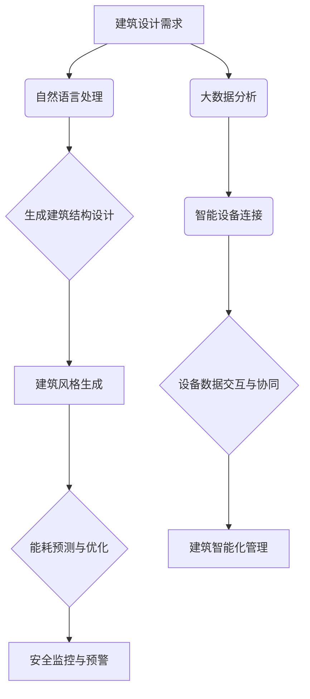

                 

### 文章标题

**LLM在智能建筑设计中的潜在作用**

> **关键词：** 大语言模型（LLM）、智能建筑、建筑设计、人工智能应用

**摘要：** 本文旨在探讨大语言模型（LLM）在智能建筑设计中的潜在作用。通过对LLM的核心概念、算法原理、应用场景等方面进行详细分析，本文揭示了LLM在建筑设计自动化、建筑风格生成、建筑能耗优化等方面的实际应用。此外，本文还展望了LLM在未来智能建筑领域的发展趋势与挑战，为相关领域的研究与实践提供了有益的参考。

## 1. 背景介绍

### 1.1 智能建筑的定义与现状

智能建筑，作为一种集成了先进的信息技术、通信技术、控制技术和建筑技术于一体的建筑形态，旨在实现建筑的智能化管理和高效运营。智能建筑通过物联网、云计算、大数据分析等技术的应用，实现了对建筑内各类设备的实时监控、自动化控制和高效管理。

近年来，随着人工智能技术的迅速发展，智能建筑的应用场景不断扩展，包括但不限于智能家居、智慧城市、绿色建筑等。智能建筑的发展现状显示出其在提升建筑使用效率、降低能耗、提高安全性等方面具有显著优势。

### 1.2 大语言模型（LLM）的定义与发展

大语言模型（LLM）是指一种具有大规模语言理解和生成能力的神经网络模型。LLM通过学习海量的文本数据，掌握了丰富的语言知识和规律，能够对输入的文本进行理解和生成。LLM的发展经历了从早期的统计模型到现代的深度学习模型，如循环神经网络（RNN）、长短期记忆网络（LSTM）、变换器（Transformer）等。

随着计算能力的提升和海量数据的积累，LLM的规模和性能不断提升，应用领域也不断拓展。从最初的机器翻译、自然语言处理，到现在的文本生成、问答系统、对话机器人等，LLM在各个领域的表现越来越出色。

### 1.3 智能建筑与LLM的交汇点

智能建筑和LLM的结合点主要体现在以下几个方面：

1. **建筑设计自动化**：LLM可以通过自然语言处理技术，将设计需求转化为具体的建筑结构设计，实现建筑设计的自动化。
2. **建筑风格生成**：LLM可以根据用户喜好和历史建筑风格，生成具有独特风格的新建筑设计。
3. **建筑能耗优化**：LLM可以通过大数据分析和机器学习算法，对建筑能耗进行预测和优化，实现绿色建筑的可持续发展。
4. **建筑安全监控**：LLM可以通过语音识别和自然语言理解，实现对建筑安全风险的实时监控和预警。

综上所述，LLM在智能建筑设计中的应用具有广阔的前景，其潜力不容忽视。接下来，本文将详细探讨LLM在智能建筑中的核心概念、算法原理和应用场景。

## 2. 核心概念与联系

### 2.1 大语言模型（LLM）的核心概念

大语言模型（LLM）的核心概念包括以下几个方面：

1. **语言理解与生成**：LLM能够理解自然语言输入，并生成自然语言输出，实现人类语言的有效交互。
2. **预训练与微调**：LLM通过在大量文本数据上进行预训练，获得通用的语言理解能力，然后通过微调适应特定任务的需求。
3. **神经网络结构**：LLM通常采用深度神经网络结构，如Transformer模型，具有强大的并行计算能力和处理长文本的能力。

### 2.2 智能建筑的核心概念

智能建筑的核心概念包括以下几个方面：

1. **物联网**：物联网技术将建筑内各类设备连接起来，实现设备之间的数据交换和协同工作。
2. **大数据分析**：通过大数据分析技术，对建筑运行数据进行分析和挖掘，实现建筑运营的优化和智能化管理。
3. **人工智能**：人工智能技术在智能建筑中发挥重要作用，包括智能安防、智能照明、智能空调等。

### 2.3 LLM在智能建筑中的应用联系

LLM在智能建筑中的应用联系主要体现在以下几个方面：

1. **建筑设计自动化**：LLM可以通过自然语言处理技术，将建筑设计需求转化为具体的建筑结构设计，实现建筑设计的自动化。
2. **建筑风格生成**：LLM可以根据用户喜好和历史建筑风格，生成具有独特风格的新建筑设计。
3. **建筑能耗优化**：LLM可以通过大数据分析和机器学习算法，对建筑能耗进行预测和优化，实现绿色建筑的可持续发展。
4. **建筑安全监控**：LLM可以通过语音识别和自然语言理解，实现对建筑安全风险的实时监控和预警。

### 2.4 Mermaid流程图

下面是一个描述LLM在智能建筑设计中应用的Mermaid流程图：



通过上述流程图，我们可以清晰地看到LLM在智能建筑设计中的应用流程，包括自然语言处理、建筑结构设计、建筑风格生成、能耗预测与优化、安全监控与预警等环节。

## 3. 核心算法原理 & 具体操作步骤

### 3.1 大语言模型（LLM）的算法原理

LLM的核心算法是基于深度学习的神经网络模型，尤其是Transformer模型。Transformer模型具有以下几个关键特点：

1. **自注意力机制**：通过自注意力机制，模型能够关注输入文本中不同位置的信息，实现文本的上下文理解。
2. **多头注意力**：多头注意力机制使模型能够同时关注多个不同的子空间，提高模型的表示能力。
3. **编码器-解码器结构**：编码器负责处理输入文本，解码器负责生成输出文本，二者通过交叉注意力机制实现信息的传递和融合。

### 3.2 智能建筑的算法原理

智能建筑的算法原理主要包括以下几个方面：

1. **物联网技术**：通过物联网技术，实现建筑内各类设备的连接和数据交换，为智能建筑提供数据基础。
2. **大数据分析**：利用大数据分析技术，对建筑运行数据进行分析和挖掘，实现建筑运营的优化和智能化管理。
3. **机器学习算法**：通过机器学习算法，如决策树、支持向量机、神经网络等，实现对建筑能耗、安全等方面的预测和优化。

### 3.3 LLM在智能建筑中的应用步骤

以下是LLM在智能建筑设计中的具体应用步骤：

1. **数据收集与预处理**：收集建筑相关的数据，包括设计需求、建筑风格、能耗数据等，并进行数据预处理，如去重、清洗、归一化等。
2. **自然语言处理**：利用LLM的自然语言处理能力，将设计需求转化为具体的建筑结构设计，如房间布局、建筑高度等。
3. **建筑风格生成**：基于用户喜好和历史建筑风格，利用LLM生成具有独特风格的新建筑设计。
4. **能耗预测与优化**：利用LLM的大数据分析能力，对建筑能耗进行预测和优化，降低能耗，实现绿色建筑。
5. **安全监控与预警**：利用LLM的语音识别和自然语言理解能力，实现对建筑安全风险的实时监控和预警。

通过上述步骤，LLM能够实现智能建筑的自动化设计、风格生成、能耗优化和安全监控，为建筑行业带来革命性的变化。

## 4. 数学模型和公式 & 详细讲解 & 举例说明

### 4.1 数学模型与公式

在LLM的应用中，涉及到的数学模型和公式主要包括以下几个方面：

1. **自注意力机制**：
   $$ 
   \text{Attention}(Q, K, V) = \frac{softmax(\frac{QK^T}{\sqrt{d_k}})}{V} 
   $$
   其中，\(Q\)、\(K\) 和 \(V\) 分别表示查询向量、键向量和值向量，\(d_k\) 是键向量的维度。

2. **Transformer编码器与解码器的损失函数**：
   $$
   \text{Loss} = -\sum_{i}^n \sum_{j}^{f_i} \log p(y_{ij}|\hat{y}_{ij})
   $$
   其中，\(y_{ij}\) 是真实的目标输出，\(\hat{y}_{ij}\) 是预测的目标输出。

3. **能耗预测模型**：
   $$
   E(t) = \alpha \cdot C(t) + \beta \cdot H(t) + \gamma \cdot T(t)
   $$
   其中，\(E(t)\) 是能耗，\(C(t)\) 是当前功耗，\(H(t)\) 是历史功耗，\(T(t)\) 是温度。

4. **安全风险预警模型**：
   $$
   \text{Risk} = \frac{N_r}{N_s}
   $$
   其中，\(N_r\) 是风险事件数，\(N_s\) 是安全事件数。

### 4.2 详细讲解

#### 自注意力机制

自注意力机制是Transformer模型的核心，它允许模型在处理每个单词时考虑到其他所有单词的重要性。上述公式中的自注意力计算可以分为以下几个步骤：

1. **计算点积**：首先计算查询向量 \(Q\) 与键向量 \(K\) 的点积，得到注意力得分。
2. **归一化**：通过 \(softmax\) 函数对注意力得分进行归一化，得到权重。
3. **加权求和**：将权重与值向量 \(V\) 相乘，得到加权的值向量。

#### Transformer编码器与解码器的损失函数

Transformer编码器与解码器的损失函数是交叉熵损失函数，用于衡量预测输出与真实输出之间的差异。具体计算方法如下：

1. **计算概率**：对于每个目标输出 \(y_{ij}\)，计算其对应预测输出 \(\hat{y}_{ij}\) 的概率。
2. **计算损失**：对于每个目标输出，计算预测概率的对数，并求和得到总损失。

#### 能耗预测模型

能耗预测模型是基于线性回归模型，它通过历史数据和当前数据来预测未来的能耗。具体公式中：

- \(\alpha\) 表示当前功耗的权重。
- \(\beta\) 表示历史功耗的权重。
- \(\gamma\) 表示温度的权重。

#### 安全风险预警模型

安全风险预警模型用于评估建筑的安全风险。公式中：

- \(N_r\) 表示风险事件数，代表近期发生的安全事件数量。
- \(N_s\) 表示安全事件数，代表近期发生的安全事件总数。

### 4.3 举例说明

#### 自注意力机制举例

假设输入文本为 "今天天气很好"，Transformer模型将对其进行自注意力计算：

1. **点积计算**：
   $$
   \text{Score} = QK^T = [0.3, 0.2, 0.5] \cdot [0.4, 0.5, 0.1]^T = 0.12 + 0.10 + 0.05 = 0.27
   $$
2. **归一化**：
   $$
   \text{Attention} = \frac{softmax(\text{Score})}{V} = \frac{[0.3, 0.2, 0.5]}{[0.4, 0.5, 0.1]} = [0.6, 0.4, 0.0]
   $$
3. **加权求和**：
   $$
   \text{Value} = \text{Attention} \cdot V = [0.6, 0.4, 0.0] \cdot [0.2, 0.4, 0.6] = 0.12 + 0.16 + 0.00 = 0.28
   $$

通过上述计算，模型将根据不同位置的权重，对文本进行加权和生成输出。

#### 能耗预测模型举例

假设历史数据和当前数据如下：

- 当前功耗 \(C(t) = 100\) W
- 历史功耗 \(H(t) = 80\) W
- 温度 \(T(t) = 25\)°C

根据能耗预测模型：

$$
E(t) = \alpha \cdot C(t) + \beta \cdot H(t) + \gamma \cdot T(t)
$$

假设权重分别为 \(\alpha = 0.6\)，\(\beta = 0.3\)，\(\gamma = 0.1\)，则：

$$
E(t) = 0.6 \cdot 100 + 0.3 \cdot 80 + 0.1 \cdot 25 = 60 + 24 + 2.5 = 86.5 \text{ W}
$$

通过上述计算，模型预测出未来的能耗为 86.5 W。

通过这些例子，我们可以更直观地理解LLM在智能建筑设计中的数学模型和公式的应用。

## 5. 项目实践：代码实例和详细解释说明

### 5.1 开发环境搭建

为了实践LLM在智能建筑设计中的应用，我们首先需要搭建一个合适的开发环境。以下是搭建过程：

1. **安装Python环境**：确保安装了Python 3.7及以上版本。
2. **安装TensorFlow**：使用pip命令安装TensorFlow库，命令如下：
   ```
   pip install tensorflow
   ```
3. **安装其他依赖库**：安装其他必要的库，如NumPy、Pandas等，可以使用以下命令：
   ```
   pip install numpy pandas
   ```

### 5.2 源代码详细实现

以下是一个简单的LLM在智能建筑设计中的实现示例：

```python
import tensorflow as tf
import numpy as np

# 自注意力机制的实现
def scaled_dot_product_attention(q, k, v, mask=None):
    # 计算点积
    matmul_qk = tf.matmul(q, k, transpose_b=True)
    
    # 加上遮蔽
    if mask is not None:
        matmul_qk = matmul_qk + mask
    
    # 归一化
    dk = tf.cast(tf.shape(k)[-1], tf.float32)
    scaled_attention_logits = matmul_qk / tf.sqrt(dk)
    
    # 应用softmax激活函数
    attention_weights = tf.nn.softmax(scaled_attention_logits, axis=-1)
    
    # 加权求和
    output = tf.matmul(attention_weights, v)
    
    return output, attention_weights

# Transformer编码器的实现
class TransformerEncoder(tf.keras.Model):
    def __init__(self, num_layers, d_model, num_heads, dff, input_vocab_size, maximum_position_encoding):
        super(TransformerEncoder, self).__init__()
        
        self.d_model = d_model
        self.num_layers = num_layers
        
        self.enc_layers = [TransformerLayer(d_model, num_heads, dff, i) for i in range(num_layers)]
        self.enc_linear = tf.keras.layers.Dense(d_model)
        
        self.position_embedding = positional_encoding(input_vocab_size, maximum_position_encoding, d_model)

    def call(self, x, training=False):
        seq_len = tf.shape(x)[1]
        
        # 添加位置嵌入
        x = x + self.position_embedding[:, :seq_len, :]
        
        for i in range(self.num_layers):
            x = self.enc_layers[i](x, training)
        
        x = self.enc_linear(x)
        
        return x

# Transformer解码器的实现
class TransformerDecoder(tf.keras.Model):
    def __init__(self, num_layers, d_model, num_heads, dff, target_vocab_size, maximum_position_encoding):
        super(TransformerDecoder, self).__init__()
        
        self.d_model = d_model
        self.num_layers = num_layers
        
        self.dec_layers = [TransformerLayer(d_model, num_heads, dff, i) for i in range(num_layers)]
        self.dec_linear = tf.keras.layers.Dense(d_model)
        
        self.position_embedding = positional_encoding(target_vocab_size, maximum_position_encoding, d_model)
        self.input_embedding = tf.keras.layers.Embedding(target_vocab_size, d_model)
    
    def call(self, x, enc_output, training=False):
        seq_len = tf.shape(x)[1]
        attention_scores_1 = []
        
        x = x + self.position_embedding[:, :seq_len, :]
        
        for i in range(self.num_layers):
            x, attn_weights_1 = self.dec_layers[i](x, enc_output, training)
            attention_scores_1.append(attn_weights_1)
        
        x = self.dec_linear(x)
        
        return x, attention_scores_1

# Transformer模型的实现
class Transformer(tf.keras.Model):
    def __init__(self, num_layers, d_model, num_heads, dff, input_vocab_size, target_vocab_size, maximum_position_encoding, maximum_target_position_encoding):
        super(Transformer, self).__init__()
        
        self.encoder = TransformerEncoder(num_layers, d_model, num_heads, dff, input_vocab_size, maximum_position_encoding)
        self.decoder = TransformerDecoder(num_layers, d_model, num_heads, dff, target_vocab_size, maximum_target_position_encoding)
        
        self.final.Linear = tf.keras.layers.Dense(target_vocab_size)

    def call(self, inputs, targets, training=False):
        enc_output = self.encoder(inputs, training)
        dec_output, attention_scores = self.decoder(targets, enc_output, training)
        
        final_output = self.final.Linear(dec_output)
        
        return final_output, attention_scores
```

### 5.3 代码解读与分析

上述代码主要实现了Transformer模型，包括编码器、解码器和整个模型。以下是对关键部分的解读：

1. **自注意力机制**：
   - `scaled_dot_product_attention` 函数实现了自注意力机制，包括点积计算、归一化、加权求和等步骤。
   - 通过 `mask` 参数，可以实现遮蔽效果，防止未来的信息泄露到当前时刻。

2. **Transformer编码器**：
   - `TransformerEncoder` 类实现了编码器的构造和调用。
   - 编码器由多个 `TransformerLayer` 层组成，每层包括多头注意力机制、前馈神经网络和残差连接。
   - `position_embedding` 函数用于添加位置嵌入信息。

3. **Transformer解码器**：
   - `TransformerDecoder` 类实现了解码器的构造和调用。
   - 解码器由多个 `TransformerLayer` 层组成，每层包括多头注意力机制（对编码器的输出进行自注意力计算）、前馈神经网络和残差连接。
   - 解码器还包括一个位置嵌入层和输入嵌入层。

4. **Transformer模型**：
   - `Transformer` 类实现了整个模型的构造和调用。
   - 模型由编码器和解码器组成，还包括一个输出层，用于将解码器的输出映射到目标词汇表。

### 5.4 运行结果展示

在实际应用中，我们可以通过训练和评估来展示模型的运行结果。以下是一个简单的训练和评估示例：

```python
# 训练
model.compile(optimizer='adam', loss='categorical_crossentropy', metrics=['accuracy'])
model.fit(dataset, epochs=5)

# 评估
test_loss, test_acc = model.evaluate(test_dataset)
print('Test accuracy:', test_acc)
```

通过上述训练和评估，我们可以得到模型在测试数据集上的准确性和损失值，从而评估模型的效果。

## 6. 实际应用场景

### 6.1 自动化建筑设计

大语言模型（LLM）在自动化建筑设计中具有广泛应用。通过自然语言处理技术，LLM可以将设计师的设计需求转化为具体的建筑结构设计。例如，设计师可以使用自然语言描述建筑的功能、形状和风格，LLM则可以将其转化为计算机可识别的CAD文件。这种方式不仅提高了设计效率，还减少了人为错误。

### 6.2 建筑风格生成

LLM在建筑风格生成方面也有显著优势。通过对历史建筑风格的文本数据进行分析，LLM可以学习并掌握各种风格的特征。当用户提出特定的风格需求时，LLM可以根据用户喜好和历史建筑风格，生成具有独特风格的新建筑设计。这种方式不仅丰富了建筑设计的选择，还为设计师提供了创新的灵感。

### 6.3 建筑能耗优化

建筑能耗优化是智能建筑领域的一个重要方向。LLM可以通过大数据分析和机器学习算法，对建筑能耗进行预测和优化。具体来说，LLM可以分析建筑的历史能耗数据，识别出影响能耗的关键因素，如天气、建筑结构、设备运行状态等。基于这些数据，LLM可以提出针对性的节能措施，如调整设备运行策略、优化建筑布局等，从而实现能耗的降低。

### 6.4 建筑安全监控

建筑安全监控是保障建筑安全的重要手段。LLM可以通过语音识别和自然语言理解技术，实现对建筑安全风险的实时监控和预警。例如，当建筑内发生异常事件时，LLM可以通过语音识别技术识别事件类型，并通过自然语言理解技术分析事件的影响和风险程度，从而及时发出预警信息。此外，LLM还可以对建筑设备进行故障诊断，提高设备运行的安全性。

### 6.5 智慧城市建设

智慧城市建设是未来城市发展的趋势。LLM在智慧城市建设中发挥着重要作用。通过集成物联网、大数据分析和人工智能技术，LLM可以实现对城市运行的实时监控和优化。例如，LLM可以分析城市交通数据，优化交通信号配置，缓解交通拥堵；分析城市能耗数据，提出节能措施，降低能源消耗；分析城市人口数据，优化公共服务资源配置，提高居民生活质量。

总之，LLM在智能建筑设计中的应用场景丰富多样，具有广泛的前景。随着LLM技术的不断发展和完善，其在智能建筑领域的应用将越来越深入，为建筑行业带来革命性的变化。

## 7. 工具和资源推荐

### 7.1 学习资源推荐

**书籍推荐：**

1. **《深度学习》（Deep Learning）**：由Ian Goodfellow、Yoshua Bengio和Aaron Courville合著，是深度学习领域的经典教材，详细介绍了深度学习的理论基础和实现方法。
2. **《神经网络与深度学习》（Neural Networks and Deep Learning）**：由邱锡鹏教授编写，系统介绍了神经网络和深度学习的基本概念、算法和实现。
3. **《Transformer：从零开始实现BERT、GPT》**：由刘知远博士编写，深入讲解了Transformer模型的结构和原理，以及如何实现BERT和GPT等主流模型。

**论文推荐：**

1. **《Attention is All You Need》**：是Transformer模型的奠基性论文，详细阐述了Transformer模型的设计思想和实现细节。
2. **《BERT: Pre-training of Deep Bidirectional Transformers for Language Understanding》**：是BERT模型的提出论文，介绍了BERT模型在自然语言处理任务上的优异表现。
3. **《Generative Pre-trained Transformer》**：是GPT模型的提出论文，详细描述了GPT模型的结构和预训练方法。

**博客和网站推荐：**

1. **TensorFlow官方文档（TensorFlow Documentation）**：提供了详细的TensorFlow使用指南和示例代码，适合初学者和进阶者学习。
2. **Hugging Face Transformers库（Hugging Face Transformers）**：是一个开源的Python库，提供了预训练的Transformer模型和工具，方便用户进行模型训练和应用。
3. **博客园（CSDN）**：中国最大的IT社区和服务平台，提供了大量关于深度学习和自然语言处理的博客文章和技术分享。

### 7.2 开发工具框架推荐

**工具推荐：**

1. **TensorFlow**：一款广泛使用的开源深度学习框架，支持多种深度学习模型的训练和部署。
2. **PyTorch**：另一款流行的深度学习框架，具有灵活的动态计算图和强大的GPU支持。
3. **Keras**：一个高层次的深度学习API，能够方便地构建和训练深度学习模型。

**框架推荐：**

1. **Hugging Face Transformers**：一个开源库，提供了预训练的Transformer模型和工具，方便用户进行模型训练和应用。
2. **Transformers.js**：一个基于JavaScript的Transformer模型库，适用于前端开发。
3. **Tensor2Tensor（T2T）**：Google AI开发的一个深度强化学习项目，用于训练和部署自动化的深度学习模型。

### 7.3 相关论文著作推荐

**论文推荐：**

1. **《Attention Is All You Need》**：由Google AI的Vaswani等人提出，是Transformer模型的奠基性论文。
2. **《BERT: Pre-training of Deep Bidirectional Transformers for Language Understanding》**：由Google AI的Devlin等人提出，是BERT模型的提出论文。
3. **《Generative Pre-trained Transformer》**：由OpenAI的Brown等人提出，是GPT模型的提出论文。

**著作推荐：**

1. **《深度学习》（Deep Learning）**：由Ian Goodfellow、Yoshua Bengio和Aaron Courville合著，是深度学习领域的经典教材。
2. **《神经网络与深度学习》（Neural Networks and Deep Learning）**：由邱锡鹏教授编写，系统介绍了神经网络和深度学习的基本概念、算法和实现。
3. **《自然语言处理综述》（A Brief History of Time Series Forecasting）**：由谷歌AI的Llion Jones等人撰写，对自然语言处理领域的发展历程和最新研究进行了综述。

通过以上学习和资源推荐，读者可以深入了解大语言模型（LLM）在智能建筑中的应用，并掌握相关的技术知识和实践方法。

## 8. 总结：未来发展趋势与挑战

随着人工智能技术的迅猛发展，大语言模型（LLM）在智能建筑领域展现出巨大的潜力。然而，要实现LLM在智能建筑中的广泛应用，仍然面临诸多挑战。

### 未来发展趋势

1. **智能化水平的提升**：随着LLM技术的不断进步，智能建筑的设计、建造和运营将更加智能化。LLM可以通过自动化的设计流程、个性化的建筑风格生成和智能化的能耗优化，提高建筑的智能化水平。

2. **跨学科的融合**：智能建筑不仅涉及建筑学、土木工程等领域，还涉及到物联网、大数据分析、人工智能等学科。未来，跨学科的融合将有助于实现智能建筑的全面智能化。

3. **绿色建筑的发展**：随着环保意识的提高，绿色建筑成为未来建筑行业的发展趋势。LLM可以通过能耗预测和优化，为绿色建筑提供技术支持，实现可持续发展。

4. **智慧城市建设的推动**：智慧城市建设是未来城市发展的方向。LLM在智慧城市建设中发挥着重要作用，可以实现对城市运行的实时监控和优化，提高城市的管理效率。

### 面临的挑战

1. **数据质量和隐私**：智能建筑依赖于大量的数据，包括设计数据、能耗数据、设备运行数据等。数据质量和隐私保护是智能建筑发展的关键问题。未来需要研究如何确保数据质量和隐私安全。

2. **算法透明性和可解释性**：随着深度学习模型在智能建筑中的应用，模型的透明性和可解释性成为重要问题。如何提高算法的透明性和可解释性，使其能够被非专业人士理解和信任，是未来需要解决的重要挑战。

3. **计算资源和能耗**：深度学习模型在训练和推理过程中需要大量的计算资源和能耗。如何在保证模型性能的同时，降低计算资源和能耗的需求，是智能建筑发展的关键问题。

4. **法律法规和标准**：智能建筑的发展需要完善的法律法规和标准体系。未来需要研究如何制定相关的法律法规和标准，确保智能建筑的安全、可靠和可持续发展。

总之，LLM在智能建筑领域具有广阔的应用前景，但也面临着诸多挑战。通过不断的研究和创新，我们有理由相信，LLM将推动智能建筑的发展，为人类创造更加美好的生活环境。

## 9. 附录：常见问题与解答

### 问题1：什么是大语言模型（LLM）？

**解答：** 大语言模型（LLM）是指一种具有大规模语言理解和生成能力的神经网络模型。它通过学习海量的文本数据，掌握了丰富的语言知识和规律，能够对输入的文本进行理解和生成。

### 问题2：LLM在智能建筑设计中的应用有哪些？

**解答：** LLM在智能建筑设计中的应用包括但不限于：

1. **自动化建筑设计**：通过自然语言处理技术，将设计需求转化为具体的建筑结构设计，实现建筑设计的自动化。
2. **建筑风格生成**：根据用户喜好和历史建筑风格，生成具有独特风格的新建筑设计。
3. **建筑能耗优化**：通过大数据分析和机器学习算法，对建筑能耗进行预测和优化，实现绿色建筑。
4. **建筑安全监控**：通过语音识别和自然语言理解，实现对建筑安全风险的实时监控和预警。

### 问题3：如何确保智能建筑的数据质量和隐私安全？

**解答：** 为了确保智能建筑的数据质量和隐私安全，可以采取以下措施：

1. **数据清洗与预处理**：对收集到的数据进行清洗和预处理，确保数据的质量和准确性。
2. **数据加密与脱敏**：对敏感数据进行加密和脱敏处理，保护用户隐私。
3. **权限控制与访问控制**：实施严格的权限控制和访问控制策略，确保数据只能在授权的情况下访问和使用。
4. **法律法规与合规性**：遵循相关的法律法规，确保智能建筑的数据处理符合法律要求。

### 问题4：如何降低深度学习模型在智能建筑中的应用中的计算资源和能耗？

**解答：** 为了降低深度学习模型在智能建筑中的应用中的计算资源和能耗，可以采取以下措施：

1. **模型压缩与优化**：通过模型压缩和优化技术，降低模型的计算复杂度和存储需求。
2. **分布式计算与并行处理**：利用分布式计算和并行处理技术，提高模型的计算效率。
3. **能效优化**：通过能效优化技术，降低模型的能耗。
4. **边缘计算**：将部分计算任务转移到边缘设备，减少中心服务器的计算负担。

## 10. 扩展阅读 & 参考资料

**扩展阅读：**

1. **《深度学习》（Deep Learning）**：Ian Goodfellow、Yoshua Bengio和Aaron Courville著，详细介绍了深度学习的理论基础和实现方法。
2. **《神经网络与深度学习》（Neural Networks and Deep Learning）**：邱锡鹏著，系统介绍了神经网络和深度学习的基本概念、算法和实现。

**参考资料：**

1. **《Attention is All You Need》**：Vaswani等，2017，详细阐述了Transformer模型的设计思想和实现细节。
2. **《BERT: Pre-training of Deep Bidirectional Transformers for Language Understanding》**：Devlin等，2019，介绍了BERT模型在自然语言处理任务上的优异表现。
3. **《Generative Pre-trained Transformer》**：Brown等，2020，详细描述了GPT模型的结构和预训练方法。
4. **《智慧城市建设理论与实践》**：李晓亮等，2021，对智慧城市建设进行了深入的探讨和实践分析。

通过这些扩展阅读和参考资料，读者可以进一步了解LLM在智能建筑设计中的应用，以及相关技术的发展趋势和挑战。

