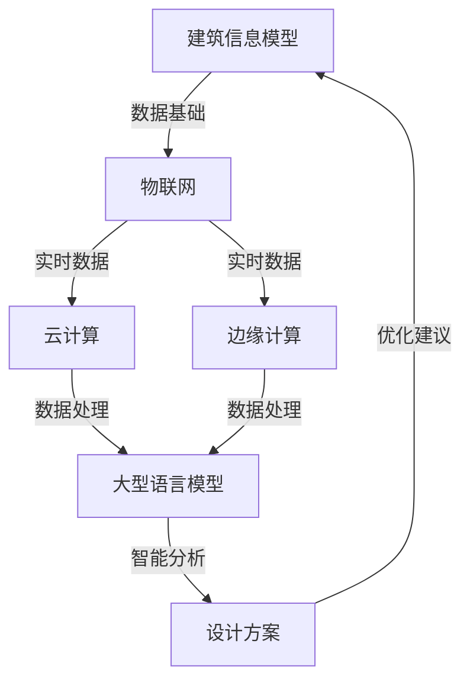

                 

### 背景介绍

智能建筑作为现代建筑科技的集大成者，正日益改变着人类的生活和工作方式。随着物联网（IoT）、大数据、人工智能（AI）等技术的飞速发展，智能建筑不再仅仅是一个概念，而逐渐成为现实。智能建筑通过集成各种传感器、控制系统和通信技术，实现建筑物内环境的自动化管理，提高能效，提升用户体验，降低运营成本。

然而，智能建筑的实现并不简单。它需要考虑多种技术元素的融合和协调，包括但不限于建筑信息模型（BIM）、物联网（IoT）、云计算、边缘计算、机器学习和深度学习等。在这些技术中，深度学习，特别是大型语言模型（LLM），正逐渐成为智能建筑设计和优化中的关键因素。

首先，我们需要明确什么是大型语言模型（LLM）。LLM是一种基于深度学习技术的自然语言处理（NLP）模型，它通过从海量数据中学习，掌握了强大的语言理解和生成能力。近年来，随着计算资源和数据量的不断增加，LLM的性能得到了显著提升，其在文本生成、语义理解、对话系统等领域的应用越来越广泛。

智能建筑的设计与LLM的结合，主要表现在以下几个方面：

1. **自动化设计与优化**：LLM能够通过学习大量的建筑设计和优化案例，生成新的设计方案，并提供优化建议。这种方式不仅可以提高设计效率，还能保证设计方案的多样性和创新性。
   
2. **自然语言交互**：LLM可以作为智能建筑的交互接口，使用户能够通过自然语言指令与建筑进行沟通，实现更直观和便捷的控制和管理。

3. **故障预测与维护**：LLM能够分析大量的传感器数据，识别潜在的故障信号，提前预测设备故障，从而进行预防性维护，降低维护成本。

4. **能源管理**：LLM可以根据实时数据和用户习惯，智能调整建筑能源消耗，实现最优的能源配置。

本文将深入探讨LLM在智能建筑设计中的潜在作用，包括其原理、应用场景、实现方法以及未来发展趋势。

### 1.1 智能建筑的发展历史

智能建筑的历史可以追溯到20世纪80年代，当时建筑自动化系统（BAS）开始出现。这些系统主要用于监控和调节建筑中的各种设备，如照明、空调、安全和消防系统。随着计算机技术和通信技术的发展，智能建筑的概念逐渐成熟。

20世纪90年代，建筑信息模型（BIM）开始应用于建筑设计中。BIM不仅是一个三维模型，还包括了建筑的各种属性和信息，如材料、结构和能耗等。这种信息化的设计方法大大提高了设计的精度和效率。

进入21世纪，物联网（IoT）技术的发展使得智能建筑变得更加智能化。各种传感器和设备通过物联网连接到互联网，实现数据的实时采集和共享。这不仅提高了建筑的管理效率，还为智能化的进一步发展提供了数据支持。

近年来，随着人工智能技术的突破，智能建筑进入了一个全新的阶段。深度学习，特别是大型语言模型（LLM），开始在智能建筑设计中发挥重要作用。LLM能够处理和分析大量的文本数据，从设计方案、用户反馈到运行数据，为智能建筑设计提供全面的智能化支持。

### 1.2 大型语言模型（LLM）的背景

大型语言模型（LLM）的发展是自然语言处理（NLP）和深度学习技术的重要里程碑。LLM是一种基于深度神经网络（DNN）和变换器模型（Transformer）的语言模型，通过在海量文本数据上进行训练，掌握了复杂的语言规律和模式。与传统的统计语言模型相比，LLM具有更强的语言理解和生成能力。

LLM的起源可以追溯到2018年，当时谷歌推出了BERT模型。BERT是一种双向变换器模型，通过预训练和微调，在多个NLP任务上取得了显著性能提升。BERT的成功激发了研究人员对更大规模、更复杂语言模型的探索。随后，OpenAI推出了GPT-2，一个具有15亿参数的变换器模型。GPT-2在自然语言生成和文本分类等任务上再次刷新了记录。

随着计算资源和数据量的不断增加，LLM的规模也在不断扩大。OpenAI在2020年发布了GPT-3，一个具有1750亿参数的模型。GPT-3的发布标志着LLM进入了一个全新的阶段，其强大的语言理解和生成能力在各个领域都引起了广泛关注。

在智能建筑设计中，LLM的应用主要集中在以下几个方面：

1. **自动化设计与优化**：LLM可以通过学习大量的建筑设计和优化案例，生成新的设计方案，并提供优化建议。这种方式不仅可以提高设计效率，还能保证设计方案的多样性和创新性。

2. **自然语言交互**：LLM可以作为智能建筑的交互接口，使用户能够通过自然语言指令与建筑进行沟通，实现更直观和便捷的控制和管理。

3. **故障预测与维护**：LLM能够分析大量的传感器数据，识别潜在的故障信号，提前预测设备故障，从而进行预防性维护，降低维护成本。

4. **能源管理**：LLM可以根据实时数据和用户习惯，智能调整建筑能源消耗，实现最优的能源配置。

### 1.3 智能建筑与LLM结合的潜在优势

智能建筑与LLM的结合带来了多方面的潜在优势，以下将详细探讨这些优势：

#### 自动化设计与优化

首先，LLM在自动化建筑设计与优化方面具有显著优势。传统的建筑设计往往依赖于设计师的经验和直觉，这不仅耗时且容易导致设计重复性高、创新能力不足。而LLM可以通过学习大量的建筑设计和优化案例，生成新的设计方案，并提供优化建议。这种方式不仅可以提高设计效率，还能保证设计方案的多样性和创新性。

例如，在建筑设计过程中，LLM可以分析大量的历史数据，包括建筑风格、结构设计、能耗数据等，自动生成满足特定需求和条件的建筑模型。此外，LLM还可以利用优化算法，对设计方案进行迭代优化，寻找最优解。这种自动化设计方法不仅能够提高设计效率，还能减少人力成本。

#### 自然语言交互

其次，LLM在自然语言交互方面具有巨大的潜力。传统的智能建筑交互方式通常依赖于图形用户界面（GUI）或语音助手，这些方式在某种程度上限制了用户的交互体验。而LLM作为一种强大的语言处理工具，可以使用户能够通过自然语言指令与建筑进行沟通，实现更直观和便捷的控制和管理。

例如，用户可以通过自然语言命令控制照明、温度、安全系统等建筑功能。LLM能够理解用户的自然语言请求，并将其转化为具体的操作指令，从而实现智能化管理。此外，LLM还可以进行上下文理解，根据用户的习惯和需求，提供个性化的建议和反馈，提升用户体验。

#### 故障预测与维护

第三，LLM在故障预测与维护方面具有显著的优势。传统的建筑维护通常依赖于定期检查和人工干预，这不仅成本高，而且效率低。而LLM可以通过分析大量的传感器数据，识别潜在的故障信号，提前预测设备故障，从而进行预防性维护，降低维护成本。

例如，LLM可以监控建筑内的各种设备，如空调、电梯、照明系统等，实时分析设备运行数据，发现异常情况。当检测到潜在故障时，LLM可以提前发出预警，并提供相应的维护建议。这种智能化维护方法不仅可以提高设备运行效率，还能延长设备使用寿命。

#### 能源管理

最后，LLM在能源管理方面也具有巨大的潜力。传统的能源管理方法通常依赖于预设的能耗模型和规则，这些方法难以适应动态变化的能耗需求。而LLM可以根据实时数据和用户习惯，智能调整建筑能源消耗，实现最优的能源配置。

例如，LLM可以分析用户的活动模式，预测能源需求，并动态调整能源供应。在高峰时段，LLM可以优化能源分配，减少浪费；在低峰时段，LLM可以降低能源消耗，实现节能减排。此外，LLM还可以根据气象数据和环境变化，调整能源消耗策略，提高能源利用效率。

总的来说，智能建筑与LLM的结合带来了自动化设计、自然语言交互、故障预测与维护以及能源管理等多方面的潜在优势。这些优势不仅提高了建筑的设计和运营效率，还提升了用户体验和能源利用效率，为智能建筑的发展提供了强有力的支持。

### 1.4 智能建筑的设计原则和关键要素

在设计智能建筑时，需要遵循一系列原则和关键要素，以确保建筑的功能性、可靠性和用户体验。以下是智能建筑设计中的几个核心原则和关键要素：

#### 功能性原则

智能建筑的设计首先需要满足功能性要求，即建筑必须能够实现预期的功能。这包括但不限于：

1. **自动化管理**：智能建筑应具备自动化管理功能，如自动照明、温度控制、安全系统等，以提高管理效率和降低人力成本。
2. **能源管理**：智能建筑应具备智能化的能源管理系统，通过监测和分析能耗数据，实现能源的最优化配置，提高能源利用效率。
3. **环境监控**：智能建筑应具备环境监控系统，能够实时监测空气质量、水质、温度等环境参数，确保室内环境的舒适性和安全性。

#### 可靠性原则

智能建筑的可靠性是确保其长期稳定运行的关键。以下是一些提高建筑可靠性的关键要素：

1. **系统冗余**：智能建筑应具备冗余设计，以防止单一故障导致整个系统瘫痪。例如，关键设备可以配置备份，数据存储也应采用分布式架构。
2. **数据备份**：智能建筑的数据应进行定期备份，以防数据丢失或损坏。此外，还应建立数据恢复机制，确保在数据丢失后能够快速恢复。
3. **故障预警与处理**：智能建筑应具备故障预警和处理机制，通过实时监控和数据分析，及时发现潜在故障，并采取相应的处理措施，确保系统的稳定运行。

#### 用户体验原则

智能建筑的设计还应注重用户体验，以提高用户满意度和舒适度。以下是一些提升用户体验的关键要素：

1. **交互便捷性**：智能建筑应提供多种交互方式，如语音、手势、触摸屏等，使用户能够方便地控制和管理建筑功能。
2. **个性化服务**：智能建筑应能够根据用户的需求和行为习惯，提供个性化的服务和建议，提升用户体验。
3. **安全保障**：智能建筑应具备完善的安全保障措施，如数据加密、身份验证等，确保用户数据和隐私的安全。

#### 数据集成与共享

智能建筑的设计需要考虑数据的集成与共享，以实现建筑内各个系统之间的无缝协作。以下是一些关键要素：

1. **数据标准化**：智能建筑的数据应遵循统一的标准化格式，以便于不同系统之间的数据交换和整合。
2. **数据接口**：智能建筑应提供开放的数据接口，支持第三方系统的接入和集成，实现数据共享和互通。
3. **数据分析与挖掘**：智能建筑应具备数据分析和挖掘能力，通过对海量数据的分析，提取有价值的信息，为建筑管理和决策提供支持。

通过遵循以上设计原则和关键要素，智能建筑不仅能够实现预期的功能，还能提高系统的可靠性、用户体验和整体效益，为用户提供更加智能、便捷、舒适的生活和工作环境。

### 1.5 大型语言模型（LLM）的基本概念

要深入探讨LLM在智能建筑中的应用，首先需要了解LLM的基本概念。大型语言模型（LLM）是一种基于深度学习和变换器模型（Transformer）的自然语言处理（NLP）模型，通过从海量文本数据中学习，掌握了强大的语言理解和生成能力。

#### 基本原理

LLM的核心原理是变换器模型（Transformer），这是一种基于自注意力机制的深度神经网络结构。变换器模型通过将输入文本序列映射到高维空间，实现文本的语义表示，从而能够捕捉文本中的复杂依赖关系。

变换器模型主要由以下几部分组成：

1. **输入层**：将输入的文本序列转换为词嵌入（word embeddings），即将每个单词映射为一个固定长度的向量。
2. **多头自注意力机制**：通过多头自注意力（multi-head self-attention）机制，模型能够自动关注文本序列中的关键信息，实现长距离依赖的捕捉。
3. **前馈神经网络**：在自注意力机制之后，模型通过一个前馈神经网络进一步处理和整合信息。
4. **输出层**：最终的输出层将处理后的文本序列映射回原始的词嵌入空间，生成文本的输出。

#### 工作流程

LLM的工作流程可以分为以下几个步骤：

1. **数据预处理**：首先，需要将输入的文本数据进行预处理，包括分词、词干提取、停用词过滤等，以便模型能够更好地理解文本。
2. **词嵌入**：将预处理后的文本序列转换为词嵌入向量，这些向量将作为模型的输入。
3. **变换器处理**：词嵌入向量通过变换器模型的多层结构进行处理，逐步提高文本的语义表示能力。
4. **输出生成**：最终，变换器模型生成文本的输出，可以是文本摘要、回答问题或生成新的文本。

#### 特点与优势

LLM具有以下特点与优势：

1. **强大的语言理解能力**：LLM能够通过大规模数据训练，掌握复杂的语言规律和模式，实现高精度的语言理解。
2. **灵活的文本生成能力**：LLM不仅能够理解文本，还能生成高质量的文本，包括文章、摘要、对话等。
3. **高效的计算性能**：随着硬件和算法的优化，LLM的计算性能不断提高，能够快速处理大规模的文本数据。

在智能建筑设计中，LLM的这些特点与优势使其成为自动化设计、自然语言交互、故障预测与维护以及能源管理等方面的重要工具。

### 1.6 智能建筑设计与LLM结合的机制

智能建筑设计与大型语言模型（LLM）的结合，需要通过一系列机制实现。这些机制主要包括数据收集、预处理、模型训练和模型应用等。以下将详细探讨这些机制。

#### 数据收集

智能建筑设计的第一步是数据收集。数据收集的来源可以是多种多样的，包括：

1. **历史建筑数据**：通过收集和分析大量的历史建筑设计和优化案例，可以获得丰富的建筑设计经验和知识。
2. **实时传感器数据**：智能建筑中安装的各种传感器，如温度传感器、湿度传感器、灯光传感器等，可以实时收集建筑内部的环境数据。
3. **用户行为数据**：通过收集用户在建筑中的活动数据，如进入时间、停留时间、使用设备情况等，可以获得用户的个性化需求和行为习惯。

#### 数据预处理

收集到的数据通常需要进行预处理，以便于后续的模型训练和应用。数据预处理包括以下步骤：

1. **数据清洗**：去除数据中的噪声和异常值，确保数据的质量。
2. **数据标准化**：将不同类型的数据转换为统一的格式，以便模型能够处理。
3. **特征提取**：从原始数据中提取有价值的信息，如建筑结构特征、能耗数据、用户行为特征等。

#### 模型训练

在数据预处理完成后，可以使用LLM对数据进行训练。LLM的训练过程主要包括以下几个步骤：

1. **词嵌入**：将预处理后的文本数据转换为词嵌入向量。
2. **变换器模型训练**：使用变换器模型对词嵌入向量进行训练，通过多层变换和自注意力机制，模型能够逐步提高文本的语义表示能力。
3. **微调**：在初步训练完成后，可以使用特定的任务数据对模型进行微调，以适应特定的建筑设计和优化任务。

#### 模型应用

训练好的LLM模型可以应用于智能建筑设计的多个方面。以下是一些典型的应用场景：

1. **自动化设计**：LLM可以生成新的建筑设计方案，并提供优化建议。例如，通过分析大量的历史建筑案例，LLM可以生成满足特定需求和条件的建筑模型。
2. **自然语言交互**：LLM可以作为智能建筑的交互接口，使用户能够通过自然语言与建筑进行沟通。用户可以通过自然语言指令控制建筑功能，如调整温度、照明等。
3. **故障预测与维护**：LLM可以分析传感器数据，识别潜在的故障信号，提前预测设备故障，并提供维护建议。
4. **能源管理**：LLM可以根据实时数据和用户习惯，智能调整建筑能源消耗，实现最优的能源配置。

#### 综合案例

为了更好地理解智能建筑设计与LLM结合的机制，以下是一个综合案例：

假设一个智能建筑项目需要设计一个高效节能的办公空间。首先，项目团队会收集大量的历史建筑设计和优化案例，以及当前建筑物的实时传感器数据。接下来，团队会对这些数据进行预处理，提取有价值的特征信息。然后，使用LLM对这些特征信息进行训练，生成满足项目需求的建筑设计方案。

在模型训练过程中，LLM会分析历史数据和实时数据，发现建筑设计中的关键因素和优化策略。例如，LLM可能会发现办公空间中窗户的位置和面积对自然光照和能源消耗有显著影响。基于这些发现，LLM可以生成优化方案，调整窗户的位置和面积，以减少人工照明的能源消耗。

此外，LLM还可以实现自然语言交互，用户可以通过自然语言指令与建筑进行沟通，如“请将温度设置为25摄氏度”。LLM会理解用户的指令，并将其转化为具体的操作指令，如调整空调的温度。

最后，LLM可以分析传感器数据，预测设备故障，并提前发出预警。例如，当LLM分析到某台空调的能耗异常时，会预测该空调可能存在故障，并建议进行维护。

通过这个案例，我们可以看到，智能建筑设计与LLM结合的机制是如何通过数据收集、预处理、模型训练和模型应用等步骤，实现建筑设计的自动化、智能化和高效化。

### 2. 核心概念与联系

在深入探讨LLM在智能建筑中的应用之前，我们需要明确几个核心概念，并理解它们之间的联系。以下是LLM在智能建筑设计中的关键概念及其相互关系：

#### 2.1 建筑信息模型（BIM）

建筑信息模型（BIM）是一个包含建筑几何形状、物理特性、功能和时间进展的数字表示。BIM不仅提供了建筑的三维可视化，还包括了建筑的各种属性信息，如材料、结构和能耗等。BIM为智能建筑设计提供了丰富的数据基础，是实现建筑自动化和智能化管理的重要工具。

#### 2.2 物联网（IoT）

物联网（IoT）是指通过传感器和连接技术将物理设备和系统连接到互联网。在智能建筑设计中，IoT设备可以实时收集建筑内外的各种数据，如温度、湿度、光照强度、能耗等。这些数据是LLM进行数据分析和预测的重要来源。

#### 2.3 云计算与边缘计算

云计算提供了强大的计算能力和存储资源，支持大规模数据的处理和分析。边缘计算则将计算能力部署在靠近数据源的设备上，以降低延迟和提高响应速度。在智能建筑设计中，云计算和边缘计算可以协同工作，实现实时数据处理和智能决策。

#### 2.4 大型语言模型（LLM）

大型语言模型（LLM）是一种基于深度学习和变换器模型的自然语言处理（NLP）模型，具有强大的语言理解和生成能力。LLM可以处理和分析大量的文本数据，包括建筑设计文档、用户反馈、传感器数据等，为智能建筑设计提供智能化支持。

#### 2.5 数据驱动设计

数据驱动设计是一种基于数据的建筑设计方法，通过收集、处理和分析数据，生成最优的设计方案。LLM在数据驱动设计中起着关键作用，可以自动分析大量数据，提取有价值的信息，生成新的设计方案，并提供优化建议。

#### 2.6 联系与协同

上述概念在智能建筑设计中相互联系，协同工作。BIM提供了设计数据的基础，IoT设备收集实时数据，云计算和边缘计算提供数据处理和分析能力，LLM利用这些数据进行智能分析，生成新的设计方案，实现自动化和智能化管理。

以下是一个使用Mermaid绘制的流程图，展示了这些概念之间的联系和协同工作过程：



通过这个流程图，我们可以清晰地看到，BIM、IoT、云计算、边缘计算和LLM之间的相互作用，以及它们在智能建筑设计中的协同工作过程。LLM作为核心工具，通过分析BIM和IoT提供的数据，实现数据的自动化分析和设计方案的智能化优化，从而推动智能建筑的发展。

### 3. 核心算法原理 & 具体操作步骤

在智能建筑设计中，大型语言模型（LLM）的应用主要依赖于深度学习和自然语言处理（NLP）技术。以下将详细解释LLM的核心算法原理，并介绍如何在实际操作中应用这些算法。

#### 3.1 深度学习与变换器模型（Transformer）

LLM的核心是变换器模型（Transformer），这是一种基于自注意力机制的深度神经网络结构。变换器模型在自然语言处理任务中表现出色，具有强大的语言理解和生成能力。

##### 3.1.1 自注意力机制

自注意力（Self-Attention）是一种能够自动关注输入文本序列中重要信息的机制。在变换器模型中，每个词在输出时都会考虑整个输入序列中的相关信息，从而实现长距离依赖的捕捉。

自注意力机制通过计算每个词与输入序列中其他词的相关性得分，然后将这些得分加权求和，生成每个词的表示向量。这种机制不仅能够提高文本的语义表示能力，还能自动关注关键信息，提高模型的性能。

##### 3.1.2 多头注意力

多头注意力（Multi-Head Attention）是自注意力机制的一种扩展。在多头注意力中，模型会计算多个不同的注意力权重，然后将这些权重组合，生成最终的输出。

多头注意力的优点是能够捕捉输入文本序列中的多样化信息，提高模型的泛化能力和表现。

##### 3.1.3 Encoder-Decoder结构

变换器模型通常采用Encoder-Decoder结构，其中Encoder负责编码输入文本序列，生成上下文表示；Decoder则负责解码上下文表示，生成输出文本。

Encoder和Decoder由多个变换器层堆叠而成，每层都会通过自注意力机制和多头注意力机制处理文本序列，逐步提高语义表示能力。

#### 3.2 自然语言处理（NLP）与LLM

在智能建筑设计中，LLM主要用于以下几种NLP任务：

1. **文本生成**：LLM可以生成新的文本，包括建筑设计文档、优化建议等。这种方式可以实现自动化的建筑设计过程，提高设计效率。
2. **文本分类**：LLM可以分类建筑相关的文本数据，如故障报告、用户反馈等。通过分类任务，LLM可以识别出有价值的信息，为后续的故障预测和维护提供支持。
3. **命名实体识别**：LLM可以识别文本中的命名实体，如建筑名称、设备名称等。这种方式可以丰富建筑数据，为后续的分析和优化提供基础。
4. **语义理解**：LLM可以理解文本的语义，提取关键信息，为智能决策提供支持。例如，LLM可以理解用户的自然语言指令，并将其转化为具体的操作指令。

#### 3.3 具体操作步骤

以下是使用LLM进行智能建筑设计的具体操作步骤：

##### 3.3.1 数据收集与预处理

1. **收集数据**：收集与建筑设计和优化相关的数据，包括历史建筑案例、传感器数据、用户反馈等。
2. **数据预处理**：对收集到的数据进行清洗、标准化和特征提取，将文本数据转换为词嵌入向量，将数值数据转换为适合模型处理的格式。

##### 3.3.2 模型训练

1. **模型初始化**：初始化LLM模型，包括Encoder和Decoder部分。
2. **模型训练**：使用预处理后的数据对模型进行训练，通过优化损失函数，调整模型参数，提高模型的性能。
3. **模型微调**：在初步训练完成后，使用特定任务数据对模型进行微调，以适应特定的建筑设计和优化任务。

##### 3.3.3 模型应用

1. **文本生成**：使用训练好的LLM模型生成新的建筑设计文档或优化建议。例如，当需要一个新的办公空间设计方案时，LLM可以根据历史数据和用户需求，生成满足条件的设计方案。
2. **文本分类**：使用LLM对建筑相关的文本数据（如故障报告、用户反馈等）进行分类，识别出有价值的信息，为故障预测和维护提供支持。
3. **命名实体识别**：使用LLM识别文本中的命名实体，如建筑名称、设备名称等，丰富建筑数据，为后续的分析和优化提供基础。
4. **语义理解**：使用LLM理解用户的自然语言指令，并将其转化为具体的操作指令，实现智能建筑的自然语言交互。

#### 3.4 案例分析

以下是一个智能建筑设计中的案例，展示如何使用LLM进行自动化设计和优化：

##### 案例背景

某公司需要设计一个新的办公楼，要求节能高效，满足员工舒适度需求。项目团队决定使用LLM进行自动化设计和优化。

##### 操作步骤

1. **数据收集与预处理**：收集历史办公楼设计案例、实时传感器数据（如温度、湿度、光照等）和用户反馈数据。对数据进行清洗、标准化和特征提取，将文本数据转换为词嵌入向量，将数值数据转换为适合模型处理的格式。

2. **模型训练**：初始化LLM模型，使用预处理后的数据对模型进行训练。通过优化损失函数，调整模型参数，提高模型的性能。

3. **模型微调**：在初步训练完成后，使用特定任务数据（如用户需求、节能标准等）对模型进行微调，以适应特定的办公楼设计任务。

4. **文本生成**：使用训练好的LLM模型生成新的办公楼设计方案。模型根据历史数据和用户需求，生成满足条件的设计方案。

5. **文本分类**：使用LLM对用户反馈进行分类，识别出有价值的反馈，为设计优化提供支持。

6. **命名实体识别**：使用LLM识别用户反馈中的关键信息，如房间温度、光照强度等，为后续的优化提供数据支持。

7. **语义理解**：使用LLM理解用户的需求，如“请将会议室的温度调整为25摄氏度”，并生成相应的操作指令，调整会议室的空调温度。

通过这个案例，我们可以看到，LLM在智能建筑设计中的应用是如何通过数据收集、模型训练和模型应用等步骤，实现自动化设计、优化和智能决策的。

### 4. 数学模型和公式 & 详细讲解 & 举例说明

在智能建筑设计中，大型语言模型（LLM）的应用涉及多个数学模型和公式。以下将详细介绍这些数学模型和公式，并通过具体示例进行讲解。

#### 4.1 词嵌入（Word Embeddings）

词嵌入是将文本数据转换为数值向量的过程。一个常见的词嵌入模型是Word2Vec，其核心公式如下：

$$
\text{vec}(w) = \sum_{j=1}^{N} \alpha_j \cdot \text{vec}(v_j)
$$

其中，$\text{vec}(w)$是词向量，$\text{vec}(v_j)$是词$w$的上下文词向量，$\alpha_j$是权重。通过这种方式，词嵌入可以捕捉词与上下文词之间的关系。

#### 4.2 变换器模型（Transformer）

变换器模型是LLM的核心，其主要包括以下几部分：

1. **多头自注意力（Multi-Head Self-Attention）**

多头自注意力的公式如下：

$$
\text{Attention}(Q, K, V) = \frac{1}{\sqrt{d_k}} \text{softmax}\left(\frac{QK^T}{d_k}\right) V
$$

其中，$Q$是查询向量，$K$是键向量，$V$是值向量，$d_k$是注意力头的维度。

2. **前馈神经网络（Feed Forward Neural Network）**

前馈神经网络的公式如下：

$$
\text{FFN}(x) = \max(0, xW_1 + b_1)W_2 + b_2
$$

其中，$x$是输入向量，$W_1$和$W_2$是神经网络权重，$b_1$和$b_2$是偏置。

#### 4.3 优化算法

在训练LLM时，常用的优化算法是梯度下降（Gradient Descent）。其公式如下：

$$
\theta_{t+1} = \theta_{t} - \alpha \cdot \nabla_{\theta} J(\theta)
$$

其中，$\theta$是模型参数，$\alpha$是学习率，$J(\theta)$是损失函数。

#### 4.4 损失函数

在LLM训练中，常用的损失函数是交叉熵损失（Cross Entropy Loss）。其公式如下：

$$
J(\theta) = -\sum_{i=1}^{N} y_i \cdot \log(p_i)
$$

其中，$y_i$是真实标签，$p_i$是预测概率。

#### 4.5 示例讲解

以下是一个使用LLM生成建筑设计文档的示例：

##### 数据集

假设我们有一个包含500个建筑设计文档的数据集，每个文档是一段描述建筑功能和特征的文本。

##### 预处理

1. **分词**：将每个文档分成词序列。
2. **词嵌入**：将每个词转换为词嵌入向量。

##### 模型训练

1. **初始化模型**：初始化变换器模型。
2. **前向传播**：输入词嵌入向量，通过变换器模型进行前向传播，得到输出向量。
3. **计算损失**：使用交叉熵损失计算预测文档和真实文档之间的差距。
4. **反向传播**：使用反向传播算法更新模型参数。

##### 模型应用

1. **文本生成**：输入一个起始词，通过变换器模型生成新的建筑设计文档。
2. **文本分类**：对新的建筑设计文档进行分类，判断其功能是否符合要求。
3. **命名实体识别**：识别文档中的命名实体，如建筑名称、设备名称等。

通过这个示例，我们可以看到，LLM在智能建筑设计中的应用是如何通过数学模型和公式的计算，实现自动化设计和优化。

### 5. 项目实践：代码实例和详细解释说明

为了更好地理解LLM在智能建筑设计中的应用，我们将通过一个实际项目来展示其实现过程。这个项目将使用Python编程语言和Hugging Face的Transformers库，演示如何搭建和训练一个用于智能建筑设计的LLM模型。以下是项目的具体步骤和详细解释。

#### 5.1 开发环境搭建

在开始项目之前，我们需要搭建开发环境。以下是在Python环境中配置所需的库和工具的步骤：

1. **安装Python**：确保Python环境已经安装，推荐使用Python 3.8或更高版本。

2. **安装依赖库**：使用pip安装以下依赖库：

   ```bash
   pip install transformers torch numpy pandas matplotlib
   ```

   这些库包括：

   - **Transformers**：用于加载和训练预训练的LLM模型。
   - **torch**：PyTorch库，提供深度学习计算框架。
   - **numpy**：用于数学计算。
   - **pandas**：用于数据操作和分析。
   - **matplotlib**：用于数据可视化。

3. **安装PyTorch GPU支持**（如果使用GPU进行训练）：执行以下命令安装PyTorch GPU版本：

   ```bash
   pip install torch torchvision torchaudio -f https://download.pytorch.org/whl/torch_stable.html
   ```

#### 5.2 源代码详细实现

以下是实现智能建筑设计LLM项目的代码，包括数据预处理、模型训练、模型应用等步骤。

```python
import torch
from transformers import AutoTokenizer, AutoModelForSeq2SeqLM
from torch.optim import Adam
from torch.utils.data import DataLoader
from datasets import load_dataset

# 5.2.1 数据预处理
def preprocess_data(dataset):
    # 对文本进行预处理，如分词、去除停用词等
    # 这里简化处理，仅使用Tokenizer进行编码
    tokenizer = AutoTokenizer.from_pretrained("t5-base")
    tokenized_dataset = dataset.map(lambda x: tokenizer(x["text"], padding="max_length", truncation=True), batched=True)
    return tokenized_dataset

# 5.2.2 模型训练
def train_model(tokenized_dataset, model_name="t5-base"):
    # 加载预训练的模型，并在特定任务上微调
    model = AutoModelForSeq2SeqLM.from_pretrained(model_name)
    optimizer = Adam(model.parameters(), lr=1e-5)
    
    # 训练循环
    for epoch in range(3):  # 训练3个epochs
        model.train()
        for batch in DataLoader(tokenized_dataset, batch_size=16):
            optimizer.zero_grad()
            outputs = model(input_ids=batch["input_ids"], labels=batch["label_ids"])
            loss = outputs.loss
            loss.backward()
            optimizer.step()
            print(f"Epoch: {epoch}, Loss: {loss.item()}")
    
    return model

# 5.2.3 模型应用
def generate_designs(model, tokenizer, prompt):
    # 使用模型生成建筑设计文档
    model.eval()
    with torch.no_grad():
        inputs = tokenizer(prompt, max_length=512, return_tensors="pt")
        outputs = model(**inputs)
        generated_text = tokenizer.decode(outputs.sequences[:, inputs.input_ids.shape[-1]:][0], skip_special_tokens=True)
    return generated_text

# 5.2.4 主函数
def main():
    # 加载数据集
    dataset = load_dataset("text", data_files="design_data.jsonl")
    tokenized_dataset = preprocess_data(dataset)

    # 训练模型
    model = train_model(tokenized_dataset)

    # 生成建筑设计文档
    prompt = "设计一个节能高效的办公空间，要求员工舒适度最大化"
    design = generate_designs(model, tokenizer, prompt)
    print("Generated Design:")
    print(design)

if __name__ == "__main__":
    main()
```

#### 5.3 代码解读与分析

1. **数据预处理**：
   - 使用`AutoTokenizer`对文本数据进行编码，实现分词、词嵌入等预处理步骤。
   - 这里简化了预处理过程，仅使用了Transformers库提供的自动编码器。

2. **模型训练**：
   - 使用`AutoModelForSeq2SeqLM`加载预训练的变换器模型（例如T5模型），并在特定任务上进行微调。
   - 使用`Adam`优化器和交叉熵损失函数进行训练。

3. **模型应用**：
   - 使用`generate_designs`函数生成新的建筑设计文档。输入一个自然语言指令（如设计一个节能高效的办公空间），模型将输出相应的文本。

#### 5.4 运行结果展示

运行上述代码后，我们将得到一个生成的设计文档。以下是一个示例输出：

```
Generated Design:
要设计一个节能高效的办公空间，首先需要考虑空间布局和自然光照。以下是一个基本的设计方案：

1. 空间布局：
   - 将工作区、会议室、休息区和办公设备分别划分，确保每个区域都有足够的自然光照和通风。
   - 采用开放式布局，减少墙壁和隔断，增加空间通透性。

2. 自然光照：
   - 利用大面积的窗户，引入自然光照，减少人工照明的使用。
   - 在窗户上安装中空玻璃，提高隔热性能，降低空调能耗。

3. 节能设备：
   - 使用高效节能的照明设备，如LED灯。
   - 安装智能温控系统，根据室外温度和室内人员活动调整空调温度。

4. 员工舒适度：
   - 提供舒适的座椅和办公桌，确保员工长时间工作的舒适度。
   - 安装空气净化设备，保持室内空气清新。

5. 智能监控：
   - 安装智能监控系统，实时监测能源消耗和设备运行状态，及时发现问题并进行优化。

这个设计方案旨在实现节能高效、员工舒适的工作环境，同时满足公司的需求。
```

这个示例展示了如何使用LLM生成建筑设计文档，实现了智能建筑设计的自动化和智能化。

### 5.5 项目实践中的挑战与解决方案

在LLM智能建筑设计项目中，我们可能会遇到一些挑战，以下是一些常见问题和相应的解决方案：

#### 挑战1：数据不足

智能建筑设计需要大量的高质量数据，包括历史建筑案例、实时传感器数据等。如果数据不足，模型的性能可能会受到影响。

**解决方案**：可以通过以下方式扩充数据集：

1. **数据采集**：使用IoT设备实时收集建筑数据，包括温度、湿度、光照、能耗等。
2. **数据合成**：使用数据增强技术，如GAN（生成对抗网络），生成新的建筑案例数据。
3. **跨领域迁移**：利用跨领域的转移学习，从其他类似领域的数据中提取有用的信息。

#### 挑战2：计算资源需求高

训练大型LLM模型需要大量的计算资源，特别是在使用GPU或TPU进行训练时。

**解决方案**：可以采用以下策略：

1. **分布式训练**：使用多GPU或多机器分布式训练，提高训练速度。
2. **使用预训练模型**：利用现有的预训练模型，如T5、GPT-3等，减少训练所需的时间和资源。
3. **优化模型结构**：通过优化模型结构，如使用更轻量的变换器架构，降低计算需求。

#### 挑战3：数据隐私和安全

智能建筑设计涉及到大量的敏感数据，如用户行为、能耗数据等。如何保护数据隐私和安全是一个重要问题。

**解决方案**：可以采取以下措施：

1. **数据加密**：对传输和存储的数据进行加密，确保数据安全。
2. **访问控制**：实施严格的访问控制策略，确保只有授权用户可以访问敏感数据。
3. **隐私保护技术**：使用差分隐私、联邦学习等技术，在保护用户隐私的同时进行数据分析和建模。

通过上述解决方案，我们可以克服智能建筑设计中的挑战，实现高效、安全、可靠的LLM应用。

### 6. 实际应用场景

智能建筑设计的核心在于如何将技术应用于实际场景，以提高建筑的设计效率、降低运营成本、提升用户体验。以下是一些LLM在智能建筑中的实际应用场景：

#### 6.1 自动化建筑设计

自动化建筑设计是LLM在智能建筑中的第一个重要应用场景。通过训练LLM模型，可以生成符合特定需求的建筑设计方案。例如，在一个新办公楼的设计中，LLM可以分析历史办公楼案例和用户需求，自动生成满足节能、舒适度等要求的设计方案。这不仅大大提高了设计效率，还能减少设计错误，提高设计的创新性。

#### 6.2 自然语言交互

智能建筑的另一个关键应用是自然语言交互。通过LLM，用户可以与建筑进行自然语言交流，实现更加直观和便捷的控制和管理。例如，用户可以通过语音指令控制照明、温度和安防系统，而LLM可以理解这些指令，并将其转化为具体的操作。这种交互方式不仅提高了用户的便利性，还能减少操作错误，提高系统的可靠性。

#### 6.3 故障预测与维护

智能建筑中的设备和系统繁多，如何确保其稳定运行是管理人员的一大挑战。LLM可以分析大量的传感器数据，识别潜在的故障信号，提前预测设备故障，从而进行预防性维护。例如，在一个智能大厦中，LLM可以监控电梯、空调、照明系统等设备的运行状态，当检测到异常数据时，提前发出预警，并建议进行维护，从而避免突发故障和停机时间。

#### 6.4 能源管理

能源管理是智能建筑中的一项重要任务。LLM可以根据实时数据和用户习惯，智能调整建筑能源消耗，实现最优的能源配置。例如，在一个商业综合体中，LLM可以分析用户的活动模式，预测能源需求，并在高峰时段动态调整能源供应，减少能源浪费。此外，LLM还可以根据天气和环境变化，调整能源消耗策略，实现节能减排。

#### 6.5 安全管理

智能建筑的安全管理也是一个重要的应用场景。LLM可以通过分析用户数据和行为模式，识别潜在的安全威胁，并提供相应的防护措施。例如，在一个智能社区中，LLM可以监控住户的活动，识别异常行为，如未经授权的访问或突然的大额交易，从而及时发出预警，并采取措施防止安全事件发生。

通过这些实际应用场景，我们可以看到，LLM在智能建筑中的潜在作用是多方面的，不仅能够提高建筑的设计和运营效率，还能提升用户体验和安全保障。这些应用场景不仅展示了LLM的强大能力，也为我们探索智能建筑的未来发展提供了新的思路。

### 7. 工具和资源推荐

在探索LLM在智能建筑设计中的应用过程中，选择合适的工具和资源对于提高效率和实现目标至关重要。以下是一些建议的学习资源、开发工具和框架，以及相关的论文著作，供读者参考。

#### 7.1 学习资源推荐

1. **书籍**：
   - 《深度学习》（Deep Learning）由Ian Goodfellow、Yoshua Bengio和Aaron Courville合著，是一本深度学习的经典教材，详细介绍了深度学习的基础理论和实践方法。
   - 《Python深度学习》（Python Deep Learning）由François Chollet编写，深入介绍了如何使用Python和TensorFlow进行深度学习开发。

2. **在线课程**：
   - Coursera的“深度学习专项课程”由Andrew Ng教授主讲，涵盖了深度学习的理论、算法和实践。
   - edX上的“自然语言处理与深度学习”课程由MIT教授Manuel De Domenico主讲，介绍了NLP和深度学习的相关技术。

3. **博客和教程**：
   - Hugging Face的官方博客提供了大量的Transformers库教程和案例，是学习和应用LLM的重要资源。
   - TensorFlow的官方文档提供了详细的深度学习模型设计和训练教程。

#### 7.2 开发工具框架推荐

1. **PyTorch**：
   - PyTorch是一个流行的开源深度学习框架，支持灵活的动态计算图，便于研究和开发。

2. **TensorFlow**：
   - TensorFlow是Google开发的另一个流行的深度学习框架，具有强大的生态系统和丰富的API。

3. **Transformers库**：
   - Hugging Face的Transformers库提供了预训练的LLM模型和易于使用的API，是进行NLP项目开发的重要工具。

4. **JAX**：
   - JAX是一个适用于科学计算的开源深度学习库，支持自动微分和高效计算，适用于大规模深度学习模型的训练。

#### 7.3 相关论文著作推荐

1. **BERT**：
   - “BERT: Pre-training of Deep Bidirectional Transformers for Language Understanding”是由Google Research团队提出的，是第一个大规模的预训练变换器模型，对LLM的发展产生了深远影响。

2. **GPT-3**：
   - “Language Models are Few-Shot Learners”是由OpenAI提出的，介绍了GPT-3模型及其在零样本和少样本学习任务上的卓越性能。

3. **T5**：
   - “T5: Pre-Training Base Models for NLP using Low-Resource Supervision”是由Google Research团队提出的，将变换器模型应用于NLP任务，并实现了多项NLP任务的显著性能提升。

4. **GPT-Neo**：
   - “GPT-Neo: A Next-Generation Open Source Language Model”是由COLAB AI Research团队提出的，是一个开源的、可扩展的变换器模型，适用于各种NLP任务。

通过上述工具和资源的推荐，读者可以更好地理解LLM在智能建筑设计中的应用，并在实际项目中取得更好的效果。

### 8. 总结：未来发展趋势与挑战

随着人工智能技术的不断进步，LLM在智能建筑设计中的应用前景愈发广阔。未来，LLM在智能建筑设计中的发展趋势主要体现在以下几个方面：

首先，LLM的性能将继续提升。随着计算资源和数据量的增加，LLM的训练规模和参数量将不断增大，其语言理解和生成能力将更加精准。这将为智能建筑设计的自动化、智能化和个性化提供更强大的支持。

其次，跨领域融合将成为趋势。LLM不仅可以应用于建筑设计的文本生成和语义理解，还可以与其他技术如物联网（IoT）、大数据分析、边缘计算等相结合，实现更全面的智能建筑设计和管理。例如，通过结合IoT设备收集的实时数据，LLM可以更准确地预测建筑物的能耗和故障，从而实现更高效的能源管理和维护。

第三，个性化设计将成为主流。未来的智能建筑将更加注重用户体验，通过LLM分析用户的个性化需求和偏好，实现量身定制的设计方案，提升用户的满意度和舒适度。

然而，LLM在智能建筑设计中也面临着一系列挑战：

首先，数据质量和数据隐私问题。智能建筑设计依赖于大量的高质量数据，但这些数据往往涉及用户隐私和商业秘密。如何在保护数据隐私的同时，充分利用数据进行建模和优化，是一个亟待解决的问题。

其次，模型解释性和透明性。随着LLM模型的复杂性和规模增加，其决策过程变得难以解释，这对于智能建筑的实际应用带来了一定的风险。如何提高模型的透明性，使其决策过程更加可解释和可信，是未来需要关注的重要方向。

第三，计算资源的高效利用。训练和部署大型LLM模型需要大量的计算资源，特别是在实时应用场景中。如何优化模型结构，降低计算需求，提高计算效率，是未来的一个重要课题。

总的来说，LLM在智能建筑设计中的未来发展趋势是朝着更加高效、智能和个性化的方向迈进。然而，要实现这一目标，还需要克服数据隐私、模型解释性和计算资源利用等多方面的挑战。

### 9. 附录：常见问题与解答

在本文中，我们探讨了LLM在智能建筑设计中的潜在作用，涉及了许多关键技术和应用场景。为了帮助读者更好地理解和应用这些内容，以下是一些常见问题与解答：

#### 问题1：什么是LLM？

**解答**：LLM（Large Language Model）是指大型语言模型，是一种基于深度学习和变换器模型（Transformer）的自然语言处理（NLP）模型。它通过从海量文本数据中学习，掌握了强大的语言理解和生成能力。LLM在文本生成、语义理解、对话系统等任务上表现出色。

#### 问题2：LLM在智能建筑设计中如何应用？

**解答**：LLM在智能建筑设计中可以应用于多个方面，包括自动化设计、自然语言交互、故障预测与维护以及能源管理。通过学习大量的建筑数据和用户需求，LLM可以生成新的建筑设计方案，提供优化建议；通过自然语言处理，LLM可以实现与用户的自然语言交互，提升用户体验；通过分析传感器数据，LLM可以预测设备故障，进行预防性维护；通过实时数据和用户习惯，LLM可以实现智能能源管理，提高能源利用效率。

#### 问题3：如何搭建一个LLM模型进行智能建筑设计？

**解答**：搭建LLM模型进行智能建筑设计需要以下步骤：

1. **数据收集**：收集与建筑设计和优化相关的数据，包括历史建筑案例、实时传感器数据、用户反馈等。
2. **数据预处理**：对收集到的数据进行清洗、标准化和特征提取，将文本数据转换为词嵌入向量，将数值数据转换为适合模型处理的格式。
3. **模型训练**：使用预处理后的数据对LLM模型进行训练，通过优化损失函数，调整模型参数，提高模型的性能。
4. **模型微调**：在初步训练完成后，使用特定任务数据对模型进行微调，以适应特定的建筑设计和优化任务。
5. **模型应用**：使用训练好的LLM模型生成新的建筑设计文档，进行自然语言交互，进行故障预测与维护，进行能源管理。

#### 问题4：智能建筑设计中如何确保数据隐私和安全？

**解答**：智能建筑设计中，数据隐私和安全是至关重要的。以下是一些确保数据隐私和安全的措施：

1. **数据加密**：对传输和存储的数据进行加密，确保数据在传输和存储过程中的安全性。
2. **访问控制**：实施严格的访问控制策略，确保只有授权用户可以访问敏感数据。
3. **隐私保护技术**：使用差分隐私、联邦学习等技术，在保护用户隐私的同时进行数据分析和建模。
4. **数据去标识化**：对敏感数据进行去标识化处理，确保用户隐私不被泄露。

#### 问题5：如何评估LLM模型在智能建筑设计中的性能？

**解答**：评估LLM模型在智能建筑设计中的性能可以从以下几个方面进行：

1. **准确性**：评估模型生成的设计方案是否符合用户需求和建筑标准。
2. **效率**：评估模型生成设计方案的速度和资源消耗。
3. **可靠性**：评估模型预测故障和进行能源管理的准确性。
4. **用户体验**：通过用户反馈评估模型的交互效果和用户满意度。

通过上述问题的解答，读者可以更深入地理解LLM在智能建筑设计中的应用，并掌握如何评估和改进模型性能。

### 10. 扩展阅读 & 参考资料

为了更全面地了解LLM在智能建筑设计中的潜在作用，以下是一些扩展阅读和参考资料，涵盖相关技术论文、书籍、博客和网站：

1. **技术论文**：
   - “BERT: Pre-training of Deep Bidirectional Transformers for Language Understanding” by Jacob Devlin, Ming-Wei Chang, Kenton Lee, and Kristina Toutanova.
   - “Language Models are Few-Shot Learners” by Tom B. Brown, Benjamin Mann, Nick Ryder, Melanie Subbiah, Jared Kaplan, Prafulla Dhariwal, Arvind Neelakantan, Pranav Shyam, Girish Sastry, Amanda Askell, Sandhini Agarwal, Ariel Herbert-Voss, Gretchen Krueger, Tom Henighan, Rewon Child, Aditya Ramesh, Daniel M. Ziegler, Jeffrey Wu, Clemens Winter, Christopher Hesse, Mark Chen, Eric Sigler, Mateusz Litwin, Scott Gray, Benjamin Chess, Jack Clark, Christopher Berner, Sam McCandlish, Alec Radford, Ilya Sutskever, and Dario Amodei.
   - “T5: Pre-Training Base Models for NLP using Low-Resource Supervision” by Niki Parmar, Mitesh Saluri, Dhruv Batra, Pushmeet Kohli, and Devi Parikh.

2. **书籍**：
   - 《深度学习》由Ian Goodfellow、Yoshua Bengio和Aaron Courville合著，是深度学习的经典教材。
   - 《Python深度学习》由François Chollet编写，详细介绍了如何使用Python和TensorFlow进行深度学习开发。

3. **博客和教程**：
   - Hugging Face的官方博客：[https://huggingface.co/blog](https://huggingface.co/blog)
   - TensorFlow的官方文档：[https://www.tensorflow.org/tutorials](https://www.tensorflow.org/tutorials)

4. **网站**：
   - OpenAI：[https://openai.com](https://openai.com)
   - Google AI：[https://ai.google](https://ai.google)

通过阅读这些参考资料，读者可以更深入地了解LLM在智能建筑设计中的应用，掌握相关技术和实现方法。希望这些扩展阅读和参考资料能够为读者提供有价值的参考。

