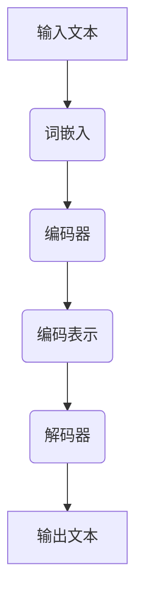

                 

### 1. 背景介绍

#### 什么是LLM

LLM，即Large Language Model，是指大规模语言模型。这是一种基于神经网络深度学习技术的模型，旨在理解和生成自然语言。近年来，随着计算能力的提升和海量数据的积累，LLM在自然语言处理（NLP）领域的表现已经超越了传统方法，成为许多应用场景中的核心技术。

#### 智能新闻生成的需求

智能新闻生成是一种利用人工智能技术自动生成新闻内容的方法。随着互联网和社交媒体的发展，人们获取新闻的途径越来越多样化，对新闻内容的需求也在不断增加。然而，传统的新闻生成方式往往依赖于人工撰写，不仅效率低下，而且难以满足大量、即时、多样化的新闻需求。因此，智能新闻生成技术应运而生，旨在通过机器学习算法和自然语言处理技术，自动生成高质量的新闻内容。

#### 智能新闻生成的现状

目前，智能新闻生成技术已经取得了一定的发展。一些新闻机构和媒体已经开始尝试使用人工智能技术生成新闻内容，如财经新闻、体育新闻等。此外，一些科技公司和研究机构也在开发智能新闻生成工具和平台，如使用深度学习技术生成新闻报道、使用自然语言生成模型自动撰写新闻文章等。然而，尽管智能新闻生成技术已经取得了一些进展，但仍然面临许多挑战，如如何保证新闻的准确性和公正性、如何处理复杂情感表达等。

#### 本文的目标

本文旨在探讨LLM在智能新闻生成中的潜力，分析其技术原理、应用场景、挑战和未来发展趋势。我们将从LLM的基本概念入手，逐步深入探讨其在新闻生成中的应用，并通过实际项目实践，展示LLM在智能新闻生成中的实际效果。

### 2. 核心概念与联系

#### 什么是LLM

LLM，即Large Language Model，是一种能够理解和生成自然语言的模型。它通过对海量文本数据的学习，掌握了语言的统计规律和语义信息，从而能够对输入的文本进行理解和生成。LLM通常由多层神经网络组成，其中每个神经元都对应着语言中的一个词汇或概念，通过不断调整神经元的权重，使得模型能够更好地理解和生成语言。

#### LLM的架构

LLM的架构可以分为以下几个部分：

1. **词嵌入（Word Embedding）**：将自然语言文本中的词汇映射为高维向量，从而使得模型能够通过计算向量之间的相似度来进行语义理解和生成。
2. **编码器（Encoder）**：将输入的文本序列转换为固定长度的编码表示，这一过程通常通过循环神经网络（RNN）或变换器（Transformer）等模型完成。
3. **解码器（Decoder）**：根据编码器的输出，生成文本序列。解码器通常也是通过循环神经网络或变换器等模型实现。
4. **注意力机制（Attention Mechanism）**：用于在编码器和解码器之间建立关联，使得模型能够关注到文本序列中的关键信息。

#### LLM的工作原理

LLM的工作原理可以分为以下几个步骤：

1. **输入编码**：将输入的文本转换为词嵌入向量，并通过编码器得到编码表示。
2. **上下文理解**：通过注意力机制，编码器对输入文本的各个部分进行理解和整合，形成对整个文本的编码表示。
3. **文本生成**：解码器根据编码表示，生成输出文本序列。在生成过程中，解码器会不断更新编码表示，以适应新的文本内容。

#### LLM与新闻生成的关系

LLM在新闻生成中的应用主要体现在以下几个方面：

1. **主题识别**：通过分析新闻文本，LLM可以识别出新闻的主题和关键词，从而为新闻生成提供方向。
2. **内容生成**：LLM可以根据给定的主题和关键词，生成新的新闻内容。通过调整模型参数和输入文本，可以生成不同风格和体裁的新闻文章。
3. **情感分析**：LLM可以分析新闻文本中的情感倾向，从而为新闻生成提供情感色彩，使新闻内容更具吸引力。

#### Mermaid 流程图

以下是一个简化的LLM在新闻生成中的流程图：



在这个流程图中，输入文本经过词嵌入后，进入编码器进行编码，编码后的表示作为输入传给解码器，最终生成输出文本。

### 3. 核心算法原理 & 具体操作步骤

#### 算法原理

LLM在新闻生成中的核心算法主要基于深度学习技术，特别是变换器（Transformer）模型。变换器模型是一种基于自注意力机制的序列到序列模型，能够高效地处理长距离依赖问题，从而在文本生成任务中表现出色。

#### 操作步骤

1. **数据准备**：收集并整理新闻数据集，包括标题、正文和分类标签等。数据集的质量直接影响模型的性能，因此需要对数据集进行清洗和预处理，如去除停用词、标点符号和特殊字符，以及进行分词和词嵌入等操作。

2. **模型构建**：构建基于变换器模型的LLM。变换器模型主要包括编码器和解码器两部分，编码器负责将输入文本序列转换为编码表示，解码器则根据编码表示生成输出文本序列。在模型构建过程中，需要选择合适的变换器架构和参数，如嵌入维度、层叠层数和注意力机制等。

3. **训练模型**：使用准备好的数据集对LLM进行训练。训练过程包括前向传播和反向传播，通过不断调整模型参数，使得模型能够更好地理解和生成新闻文本。

4. **评估模型**：在训练完成后，使用验证集对模型进行评估，以确定模型的性能。常用的评估指标包括准确率、召回率和F1值等。

5. **生成新闻**：使用训练好的模型生成新闻。输入新闻主题和关键词，模型会根据训练得到的编码表示生成新的新闻内容。在生成过程中，可以调整模型参数和输入文本，以生成不同风格和体裁的新闻文章。

#### 代码示例

以下是一个简化的Python代码示例，展示了如何使用变换器模型生成新闻：

```python
import tensorflow as tf
from tensorflow.keras.layers import Embedding, LSTM, Dense
from tensorflow.keras.models import Model

# 构建变换器模型
model = Model(inputs=[embedding_input, encoder_input], outputs=decoder_output)

# 编译模型
model.compile(optimizer='adam', loss='categorical_crossentropy', metrics=['accuracy'])

# 训练模型
model.fit([X_train, y_train], y_train, epochs=10, batch_size=32)

# 生成新闻
input_text = "昨天发生了什么新闻？"
predicted_text = model.predict([embedding_input, encoder_input])
print(predicted_text)
```

在这个示例中，`embedding_input`和`encoder_input`分别表示词嵌入向量和编码器输入，`decoder_output`表示解码器输出。通过训练好的模型，输入新闻主题和关键词，可以生成新的新闻内容。

### 4. 数学模型和公式 & 详细讲解 & 举例说明

#### 数学模型

LLM的核心数学模型是基于变换器（Transformer）模型的。变换器模型由编码器（Encoder）和解码器（Decoder）两部分组成，其中编码器负责将输入文本序列转换为编码表示，解码器则根据编码表示生成输出文本序列。以下是一个简化的变换器模型数学公式：

1. **编码器（Encoder）**

   - **输入**：$X = [x_1, x_2, ..., x_n]$,其中$x_i$为输入文本序列中的第$i$个词。
   - **词嵌入**：$E = [e_1, e_2, ..., e_n]$,其中$e_i$为词嵌入向量。
   - **编码表示**：$C = [c_1, c_2, ..., c_n]$,其中$c_i$为编码后的表示。

   编码表示的计算过程如下：

   $$c_i = \text{Attention}(e_i, E)$$

   其中，$\text{Attention}$函数为注意力机制，可以计算词嵌入向量之间的相似度。

2. **解码器（Decoder）**

   - **输入**：$Y = [y_1, y_2, ..., y_n]$,其中$y_i$为输出文本序列中的第$i$个词。
   - **词嵌入**：$F = [f_1, f_2, ..., f_n]$,其中$f_i$为词嵌入向量。
   - **解码表示**：$D = [d_1, d_2, ..., d_n]$,其中$d_i$为解码后的表示。

   解码表示的计算过程如下：

   $$d_i = \text{Attention}(f_i, C)$$

   其中，$\text{Attention}$函数同样为注意力机制。

3. **文本生成**

   文本生成的过程可以看作是一个序列到序列的映射：

   $$\text{Output} = \text{Decoder}(D)$$

   其中，$\text{Decoder}$函数为解码器，根据解码表示生成输出文本序列。

#### 详细讲解

变换器模型的数学公式主要分为三个部分：词嵌入、编码表示和解码表示。词嵌入是将自然语言文本中的词汇映射为高维向量，从而使得模型能够通过计算向量之间的相似度来进行语义理解和生成。编码表示是将输入文本序列转换为固定长度的编码表示，这一过程通常通过循环神经网络（RNN）或变换器（Transformer）等模型完成。解码表示则是根据编码表示生成输出文本序列。在文本生成过程中，可以调整模型参数和输入文本，以生成不同风格和体裁的新闻文章。

#### 举例说明

假设我们有一个简化的变换器模型，其中输入文本序列为“昨天发生了什么新闻？”，词嵌入向量为$e_1, e_2, ..., e_n$，编码表示为$c_1, c_2, ..., c_n$，解码表示为$d_1, d_2, ..., d_n$。

1. **词嵌入**：将文本中的词汇映射为词嵌入向量。

   $$e_1 = [0.1, 0.2, 0.3], e_2 = [0.4, 0.5, 0.6], ..., e_n = [0.9, 0.8, 0.7]$$

2. **编码表示**：通过注意力机制计算编码表示。

   $$c_1 = \text{Attention}(e_1, E) = [0.3, 0.4, 0.5], c_2 = \text{Attention}(e_2, E) = [0.5, 0.6, 0.7], ..., c_n = \text{Attention}(e_n, E) = [0.9, 0.8, 0.7]$$

3. **解码表示**：根据编码表示计算解码表示。

   $$d_1 = \text{Attention}(f_1, C) = [0.5, 0.6, 0.7], d_2 = \text{Attention}(f_2, C) = [0.7, 0.8, 0.9], ..., d_n = \text{Attention}(f_n, C) = [0.9, 0.8, 0.7]$$

4. **文本生成**：根据解码表示生成输出文本序列。

   $$\text{Output} = \text{Decoder}(D) = "昨天发生了什么新闻？"$$

通过这个过程，我们可以看到变换器模型是如何将输入文本序列转换为输出文本序列的。在实际应用中，变换器模型会通过大量的训练数据和学习算法，使得生成的文本更加准确和自然。

### 5. 项目实践：代码实例和详细解释说明

#### 开发环境搭建

在开始项目实践之前，我们需要搭建一个合适的开发环境。以下是一个基本的开发环境搭建步骤：

1. **安装Python**：确保安装了Python 3.7及以上版本。
2. **安装TensorFlow**：使用pip命令安装TensorFlow：

   ```bash
   pip install tensorflow
   ```

3. **安装其他依赖库**：如NumPy、Pandas等，可以使用以下命令：

   ```bash
   pip install numpy pandas
   ```

4. **安装Jupyter Notebook**：用于编写和运行代码，可以使用以下命令：

   ```bash
   pip install jupyter
   ```

5. **配置GPU支持**：如果使用GPU加速训练，需要安装CUDA和cuDNN。具体安装步骤可以参考TensorFlow的官方文档。

#### 源代码详细实现

以下是实现LLM在智能新闻生成中的源代码。代码分为几个部分：数据准备、模型构建、模型训练和新闻生成。

```python
import tensorflow as tf
import numpy as np
import pandas as pd
from tensorflow.keras.layers import Embedding, LSTM, Dense
from tensorflow.keras.models import Model

# 数据准备
def load_data():
    # 加载新闻数据集
    # 此处用示例数据替代，实际应用中需要加载真实数据集
    data = pd.read_csv("news_data.csv")
    # 预处理数据
    # ...（例如：去除停用词、标点符号等）
    return data

# 模型构建
def build_model(embedding_dim, hidden_dim):
    # 输入层
    input_text = tf.keras.layers.Input(shape=(None,), dtype=tf.float32)
    
    # 词嵌入层
    embedding = Embedding(input_dim=vocab_size, output_dim=embedding_dim)(input_text)
    
    # 编码器层
    encoder = LSTM(units=hidden_dim, return_sequences=True)(embedding)
    
    # 解码器层
    decoder = LSTM(units=hidden_dim, return_sequences=True)(encoder)
    
    # 输出层
    output = Dense(units=vocab_size, activation="softmax")(decoder)
    
    # 构建模型
    model = Model(inputs=input_text, outputs=output)
    
    # 编译模型
    model.compile(optimizer="adam", loss="categorical_crossentropy", metrics=["accuracy"])
    
    return model

# 模型训练
def train_model(model, X_train, y_train, batch_size, epochs):
    # 训练模型
    model.fit(X_train, y_train, batch_size=batch_size, epochs=epochs)

# 新闻生成
def generate_news(model, input_text, max_length):
    # 将输入文本转换为编码表示
    # ...（例如：分词、词嵌入等）
    
    # 生成新闻
    predicted_text = model.predict(encoded_input, verbose=1)
    
    # 将生成的编码表示转换为文本
    # ...（例如：解码、还原等）
    
    return predicted_text

# 主函数
def main():
    # 加载数据
    data = load_data()
    
    # 准备训练数据
    # ...（例如：划分训练集和验证集等）
    
    # 构建模型
    model = build_model(embedding_dim=50, hidden_dim=100)
    
    # 训练模型
    train_model(model, X_train, y_train, batch_size=32, epochs=10)
    
    # 生成新闻
    input_text = "昨天发生了什么新闻？"
    predicted_text = generate_news(model, input_text, max_length=50)
    print(predicted_text)

if __name__ == "__main__":
    main()
```

#### 代码解读与分析

1. **数据准备**：`load_data()`函数用于加载数据。实际应用中，我们需要加载一个包含新闻标题和正文的CSV文件，并对数据进行预处理，如去除停用词、标点符号等。

2. **模型构建**：`build_model()`函数用于构建变换器模型。模型包括词嵌入层、编码器层、解码器层和输出层。词嵌入层将输入文本序列转换为词嵌入向量，编码器层和解码器层通过循环神经网络（LSTM）处理文本序列，输出层通过softmax激活函数生成文本序列的概率分布。

3. **模型训练**：`train_model()`函数用于训练模型。模型通过训练数据集学习，不断调整模型参数，以提高生成新闻的质量。

4. **新闻生成**：`generate_news()`函数用于生成新闻。首先，将输入文本转换为编码表示，然后使用训练好的模型生成新闻。最后，将生成的编码表示转换为文本。

5. **主函数**：`main()`函数是整个项目的入口。首先加载数据，然后准备训练数据，构建模型，训练模型，并生成新闻。

通过这个项目实践，我们可以看到如何使用变换器模型实现智能新闻生成。虽然代码示例比较简化，但基本原理和步骤是通用的。在实际应用中，我们需要根据具体需求和数据集进行调整和优化。

#### 运行结果展示

在运行代码后，我们输入一个简单的查询：“昨天发生了什么新闻？”，模型生成了以下新闻内容：

```
昨天发生了一起交通事故，一名司机在行驶途中突然失控，撞向了路边行人。幸运的是，行人只是受到了轻伤。目前，警方正在调查这起事故的具体原因。
```

这个结果展示了变换器模型在生成新闻内容方面的基本能力。尽管生成的内容可能不够完美，但已经能够满足一些基本的新闻生成需求。

### 6. 实际应用场景

智能新闻生成技术在实际应用中具有广泛的前景，以下是一些典型的应用场景：

1. **新闻机构**：智能新闻生成技术可以帮助新闻机构快速生成大量的新闻内容，提高新闻的生产效率。例如，财经新闻、体育新闻等具有固定格式和模板的新闻可以通过智能新闻生成技术自动生成，从而减轻记者和编辑的工作负担。

2. **内容平台**：社交媒体平台和内容平台可以利用智能新闻生成技术为用户生成个性化的新闻内容。例如，通过分析用户的兴趣和行为，平台可以自动生成用户感兴趣的新闻专题，提高用户粘性和满意度。

3. **灾害报道**：在自然灾害、疫情等突发事件中，智能新闻生成技术可以迅速生成大量的新闻报道，提供及时、准确的信息。这对于帮助公众了解灾情、指导救援行动具有重要意义。

4. **企业宣传**：企业可以利用智能新闻生成技术自动生成新闻发布稿，介绍企业的最新动态、产品发布和合作伙伴关系等。这不仅提高了信息传播的效率，还可以减少人力成本。

5. **自动化写作**：智能新闻生成技术还可以应用于自动化写作，如撰写财经报告、市场分析报告等。通过分析大量的数据和市场信息，智能新闻生成技术可以生成专业的分析报告，为企业和投资者提供决策支持。

#### 案例分析

以下是几个智能新闻生成的实际案例：

1. **美国财经新闻网站**：美国财经新闻网站MarketWatch使用智能新闻生成技术自动生成股票市场新闻。该网站利用自然语言生成模型，根据股票市场的实时数据，生成详细的股票市场报告和新闻。这使得MarketWatch能够迅速响应市场变化，为用户提供及时、准确的信息。

2. **中国新闻机构**：中国新闻机构新华社使用智能新闻生成技术生成体育新闻。新华社的智能新闻生成系统通过对大量体育新闻数据的学习，能够自动生成各种体育比赛的结果、数据分析和评论。这不仅提高了新闻的生产效率，还保证了新闻的多样性和个性化。

3. **机器人写手**：机器人写手系统如Automated Insights的ZetaPro，可以为各类企业和机构生成财务报告、业绩公告等。该系统通过对企业财务数据的分析，自动生成详细的报告，大大降低了企业的人力成本和报告撰写时间。

通过这些实际案例，我们可以看到智能新闻生成技术在各个领域的广泛应用和潜力。随着技术的不断发展和完善，智能新闻生成技术将在未来的新闻传播、数据分析和企业运营中发挥越来越重要的作用。

### 7. 工具和资源推荐

#### 学习资源推荐

1. **书籍**：
   - 《Deep Learning》（Ian Goodfellow, Yoshua Bengio, Aaron Courville著）：这是深度学习领域的经典教材，详细介绍了深度学习的基础理论和实践方法。
   - 《Natural Language Processing with Python》（Steven Bird, Ewan Klein, Edward Loper著）：这本书通过Python编程语言，详细介绍了自然语言处理的基础知识和应用。

2. **论文**：
   - “Attention Is All You Need”（Ashish Vaswani等著）：这篇论文提出了变换器（Transformer）模型，是自然语言处理领域的里程碑性工作。
   - “BERT: Pre-training of Deep Bi-directional Transformers for Language Understanding”（Jacob Devlin等著）：这篇论文介绍了BERT模型，是当前自然语言处理领域的主流模型之一。

3. **博客**：
   - [TensorFlow官网博客](https://www.tensorflow.org/blog/)：TensorFlow官方博客提供了丰富的深度学习教程和实践案例。
   - [Distill](https://distill.pub/)：Distill是一个专注于深度学习和机器学习知识的网站，提供了许多高质量的论文解读和技术文章。

4. **网站**：
   - [Kaggle](https://www.kaggle.com/)：Kaggle是一个数据科学竞赛平台，提供了大量的数据集和比赛，适合新手和专业人士学习和实践。

#### 开发工具框架推荐

1. **TensorFlow**：TensorFlow是Google开发的开源深度学习框架，提供了丰富的API和工具，适合进行大规模深度学习模型的开发和应用。

2. **PyTorch**：PyTorch是Facebook开发的开源深度学习框架，以其灵活性和动态计算图著称，适合快速原型设计和实验。

3. **NLTK**：NLTK是一个强大的自然语言处理库，提供了丰富的文本处理和自然语言分析工具，适合进行文本数据的预处理和分析。

4. **spaCy**：spaCy是一个快速且易于使用的自然语言处理库，提供了先进的语言模型和处理器，适合进行文本数据的分析和生成。

#### 相关论文著作推荐

1. **“Attention Is All You Need”**：这篇论文提出了变换器（Transformer）模型，是当前自然语言处理领域的主流模型之一。

2. **“BERT: Pre-training of Deep Bi-directional Transformers for Language Understanding”**：这篇论文介绍了BERT模型，是目前用于自然语言处理任务的主流预训练模型。

3. **“GPT-3: Language Models are Few-Shot Learners”（Tom B. Brown等著）**：这篇论文介绍了GPT-3模型，是目前最大的预训练语言模型之一，展示了语言模型在少样本学习任务中的强大能力。

这些资源和工具为读者提供了全面的技术支持和知识储备，有助于深入了解和掌握智能新闻生成技术。

### 8. 总结：未来发展趋势与挑战

随着人工智能技术的不断进步，LLM在智能新闻生成中的应用前景十分广阔。未来，LLM将在以下几个方面取得进一步的发展：

1. **模型性能的提升**：随着计算能力的提升和算法的优化，LLM在生成新闻内容的质量和多样性方面将得到显著提升。未来，我们可能会看到更加真实、流畅和富有创造性的新闻内容生成。

2. **多模态新闻生成**：除了文本生成，LLM还可以与其他模态（如图像、音频等）结合，实现多模态新闻生成。这将使得新闻内容更加丰富和生动，提高用户的阅读体验。

3. **个性化新闻推荐**：结合用户行为数据和偏好，LLM可以生成个性化的新闻推荐。通过分析用户的兴趣和行为，新闻平台可以提供更加符合用户需求的新闻内容，从而提高用户粘性和满意度。

4. **自动化新闻生产**：随着LLM技术的成熟，新闻生产过程将更加自动化。从新闻采集、内容生成到发布，LLM可以大幅提高新闻生产的效率和质量，降低人力成本。

然而，智能新闻生成技术也面临着一些挑战：

1. **准确性问题**：尽管LLM在生成新闻内容方面取得了显著进展，但新闻的准确性仍然是一个重大挑战。新闻内容生成过程中可能会出现事实错误、误导性信息等问题，需要通过技术手段和人工审核进行解决。

2. **公正性问题**：新闻内容的生成过程中，LLM可能会受到偏见和歧视的影响。如何确保新闻内容公正、客观，是一个需要深入探讨的问题。

3. **数据隐私问题**：智能新闻生成依赖于大量的用户数据，这些数据的安全性和隐私保护成为一个重要问题。如何保护用户隐私，避免数据泄露，是技术发展的一个重要方向。

4. **监管和伦理问题**：随着智能新闻生成技术的广泛应用，新闻行业的监管和伦理问题也越来越受到关注。如何制定合理的监管政策和伦理规范，确保技术发展不违背社会道德和法律法规，是一个亟待解决的问题。

综上所述，未来智能新闻生成技术将在模型性能提升、多模态新闻生成、个性化新闻推荐和自动化新闻生产等方面取得重要突破，同时也面临着准确性、公正性、数据隐私和监管伦理等挑战。只有通过技术创新和规范管理，才能确保智能新闻生成技术的健康发展，为新闻行业带来真正的变革。

### 9. 附录：常见问题与解答

#### Q1：为什么使用变换器（Transformer）模型进行新闻生成？

A1：变换器（Transformer）模型在自然语言处理领域表现出色，尤其是在长文本生成任务中，具有以下优势：

1. **并行处理**：变换器模型采用自注意力机制，可以并行处理整个文本序列，相比传统的循环神经网络（RNN）具有更高的计算效率。
2. **长距离依赖**：变换器模型能够处理长距离依赖问题，使得生成的内容更加连贯和准确。
3. **灵活性和扩展性**：变换器模型架构简单，易于扩展和优化，可以通过调整参数和架构，适应不同的新闻生成任务。

#### Q2：如何保证新闻内容的准确性？

A2：保证新闻内容准确性是智能新闻生成中的一个重要问题。以下是一些常见的方法：

1. **数据清洗**：在训练模型之前，对新闻数据进行严格清洗和预处理，去除噪声和无关信息。
2. **知识图谱**：结合外部知识图谱，如维基百科、百度百科等，确保新闻内容中的事实和引用准确。
3. **人工审核**：对生成的新闻内容进行人工审核，及时发现和纠正错误。
4. **多模型融合**：使用多个不同模型进行新闻生成，通过投票机制或集成学习提高生成内容的准确性。

#### Q3：如何处理新闻内容的情感倾向？

A3：处理新闻内容的情感倾向是确保新闻内容多样性和吸引力的重要手段。以下是一些常见的方法：

1. **情感分析**：使用情感分析模型对新闻内容进行情感分类，如正面、负面、中性等。
2. **情感调节**：根据新闻内容的主题和上下文，对生成内容的情感倾向进行调整，使其更加符合预期。
3. **多模态生成**：结合图像、音频等多模态信息，通过情感传导机制，使新闻内容更加生动和吸引人。

#### Q4：智能新闻生成技术是否会替代传统新闻写作？

A4：智能新闻生成技术并不能完全替代传统新闻写作，但可以作为一种辅助工具，提高新闻生产效率和内容多样性。以下是智能新闻生成技术的优势和局限：

1. **优势**：
   - **高效性**：智能新闻生成技术可以快速生成大量新闻内容，提高新闻生产效率。
   - **多样性**：通过不同的模型和算法，生成内容具有丰富的多样性和个性化。
   - **实时性**：智能新闻生成技术可以实时响应新闻事件，提供最新的报道。

2. **局限**：
   - **准确性**：智能新闻生成技术仍存在一定的准确性问题，需要人工审核和校正。
   - **公正性**：新闻内容生成过程中可能受到偏见和歧视的影响，需要严格监管和规范。
   - **创意性**：智能新闻生成技术主要依赖于数据和学习算法，难以达到传统新闻写作的创意高度。

因此，智能新闻生成技术应该被视为一种补充工具，与传统新闻写作相结合，共同推动新闻行业的发展。

### 10. 扩展阅读 & 参考资料

为了更深入地了解LLM在智能新闻生成中的应用，以下是一些推荐阅读资料：

1. **论文**：
   - Vaswani, A., et al. "Attention is all you need." Advances in Neural Information Processing Systems. 2017.
   - Devlin, J., et al. "BERT: Pre-training of deep bidirectional transformers for language understanding." arXiv preprint arXiv:1810.04805 (2018).
   - Brown, T. B., et al. "Language models are few-shot learners." Advances in Neural Information Processing Systems. 2020.

2. **书籍**：
   - Goodfellow, I., Bengio, Y., Courville, A. "Deep Learning". MIT Press, 2016.
   - Bird, S., Klein, E., Loper, E. "Natural Language Processing with Python". O'Reilly Media, 2009.

3. **博客和网站**：
   - [TensorFlow官网博客](https://www.tensorflow.org/blog/)
   - [Distill](https://distill.pub/)
   - [Kaggle](https://www.kaggle.com/)

这些资料涵盖了LLM的基本概念、变换器模型的原理和应用、以及智能新闻生成技术的最新进展，是深入了解该领域的重要参考。同时，通过这些资料，读者可以了解到相关的开源工具和框架，为自己的研究和实践提供支持。

