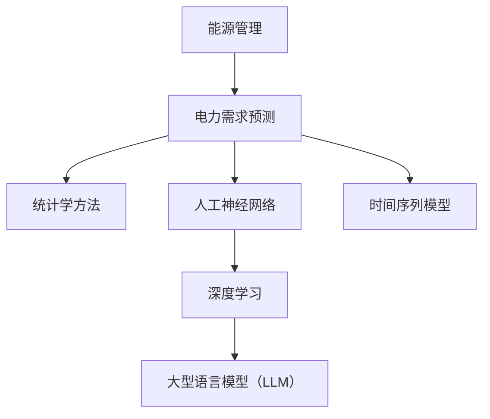
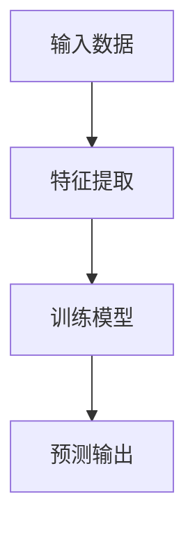

                 

### 文章标题

LLM在智能电力需求预测中的潜在贡献

> **关键词**：大型语言模型（LLM）、智能电力需求预测、机器学习、深度学习、数据分析、能源管理

> **摘要**：本文探讨了大型语言模型（LLM）在智能电力需求预测中的应用潜力。通过回顾相关的核心概念，包括机器学习、深度学习和能源管理，本文深入分析了LLM的技术原理，并探讨了其在电力需求预测中的具体应用。文章还提供了数学模型和公式，以及实际项目的代码实例和分析，最后讨论了该领域的未来发展趋势与挑战。

## 1. 背景介绍

随着全球经济的快速发展和人口的增长，电力需求不断攀升。特别是在夏季和冬季，电力需求的高峰往往导致电网压力增大，甚至可能引发停电事故。因此，准确预测电力需求成为电力系统管理中的一个关键问题。传统的电力需求预测方法主要包括统计学模型、时间序列分析和人工神经网络等。然而，这些方法在应对复杂、动态的电力需求变化时存在一定的局限性。

近年来，随着计算能力的提升和大数据技术的发展，深度学习和机器学习在各个领域得到了广泛应用。特别是大型语言模型（LLM），如GPT-3和BERT，凭借其强大的语言理解和生成能力，已经在自然语言处理领域取得了显著成果。这些模型在处理大规模、复杂的数据集时展现出强大的学习能力，这使得LLM在智能电力需求预测中具有巨大的潜力。

智能电力需求预测不仅有助于电力系统的稳定运行，还可以优化资源配置，降低能源消耗，提高能源利用效率。因此，研究LLM在智能电力需求预测中的应用具有重要意义。本文旨在探讨LLM在这一领域的潜在贡献，并提出相应的技术路线和解决方案。

## 2. 核心概念与联系

### 2.1 机器学习与深度学习

机器学习（Machine Learning，ML）是人工智能（Artificial Intelligence，AI）的一个分支，其核心思想是通过算法从数据中学习规律，并自动优化决策过程。机器学习可以分为监督学习、无监督学习和强化学习三类。监督学习是其中最为常见的一种，通过已有标签数据训练模型，使得模型能够对新数据进行预测。

深度学习（Deep Learning，DL）是机器学习的一种特殊形式，它通过构建多层神经网络（Neural Networks）来模拟人脑的决策过程。深度学习模型通过多层的非线性变换，逐层提取数据中的特征，从而实现复杂函数的逼近。卷积神经网络（Convolutional Neural Networks，CNN）和循环神经网络（Recurrent Neural Networks，RNN）是深度学习的两种重要类型。

### 2.2 能源管理与电力需求预测

能源管理是指对能源的生产、传输、分配和消费进行有效控制和管理，以实现能源的高效利用和可持续发展。电力需求预测是能源管理中的一个关键环节，它涉及对电力系统未来的负荷进行准确预测，以便于电力公司进行电力资源的调度和分配。

传统的电力需求预测方法主要包括以下几种：

1. **统计学方法**：如时间序列分析、回归分析等，通过历史数据来预测未来的负荷。
2. **人工神经网络**：通过构建多层神经网络模型，对历史数据进行训练，从而实现电力需求的预测。
3. **时间序列模型**：如ARIMA模型、季节性分解等，通过分析历史数据的趋势和周期性，预测未来的负荷。

然而，这些传统方法在面对复杂、多变的电力需求时，存在一定的局限性。深度学习，特别是大型语言模型（LLM），通过其强大的学习能力和处理能力，为电力需求预测提供了一种新的思路。

### 2.3 Mermaid 流程图



### 2.4 核心概念原理和架构

**机器学习原理：** 机器学习模型通过输入特征和标签数据，学习特征之间的关联，并在测试数据上实现预测。深度学习模型通过多层的神经网络，逐层提取特征，并最终实现高层次的抽象和表示。

**深度学习架构：** 深度学习模型主要包括输入层、隐藏层和输出层。输入层接收外部输入，隐藏层通过非线性变换提取特征，输出层根据隐藏层的输出进行预测。

**大型语言模型（LLM）：** LLM是一种基于深度学习的自然语言处理模型，它通过处理大量的文本数据，学习语言的结构和语义。LLM可以用于文本生成、情感分析、命名实体识别等任务。

### 2.5 核心概念原理和架构（Mermaid 流程图）



## 3. 核心算法原理 & 具体操作步骤

### 3.1 机器学习算法原理

机器学习算法的核心思想是通过学习输入特征和输出标签之间的关系，从而实现对新数据的预测。具体而言，机器学习算法包括以下几个关键步骤：

1. **数据预处理**：包括数据清洗、归一化、缺失值处理等，以确保数据的质量和一致性。
2. **特征选择**：通过分析数据特征的相关性，选择对预测任务最为重要的特征。
3. **模型选择**：根据预测任务的特点，选择合适的机器学习模型，如线性回归、决策树、随机森林等。
4. **模型训练**：使用训练数据对模型进行训练，使模型学会从输入特征中提取规律，并生成预测输出。
5. **模型评估**：使用测试数据评估模型的性能，包括准确性、召回率、F1分数等指标。
6. **模型优化**：根据评估结果对模型进行调整，以提高预测性能。

### 3.2 深度学习算法原理

深度学习算法是基于多层神经网络设计的，其核心思想是通过多层非线性变换，从原始数据中提取特征，并实现高层次的抽象和表示。具体而言，深度学习算法包括以下几个关键步骤：

1. **数据预处理**：与机器学习算法类似，深度学习算法也需要对数据进行预处理，包括归一化、缺失值处理等。
2. **模型构建**：设计并构建深度学习模型，包括输入层、隐藏层和输出层。输入层接收外部输入，隐藏层通过非线性变换提取特征，输出层根据隐藏层的输出进行预测。
3. **模型训练**：使用训练数据对深度学习模型进行训练，通过反向传播算法不断调整模型参数，使模型学会从输入特征中提取规律。
4. **模型评估**：使用测试数据评估深度学习模型的性能，包括准确性、召回率、F1分数等指标。
5. **模型优化**：根据评估结果对模型进行调整，以提高预测性能。

### 3.3 大型语言模型（LLM）原理

大型语言模型（LLM）是基于深度学习技术的自然语言处理模型，其核心思想是通过处理大量的文本数据，学习语言的结构和语义。具体而言，LLM包括以下几个关键步骤：

1. **数据预处理**：对文本数据进行预处理，包括分词、词性标注、去停用词等。
2. **模型构建**：构建基于Transformer架构的深度学习模型，包括编码器和解码器。编码器负责将输入文本转换为向量表示，解码器负责根据编码器的输出生成预测文本。
3. **模型训练**：使用大规模的文本数据对LLM进行训练，通过优化模型参数，使模型学会从输入文本中提取语义信息。
4. **模型评估**：使用测试数据评估LLM的性能，包括文本分类、情感分析、命名实体识别等任务的准确性和召回率等指标。
5. **模型应用**：将训练好的LLM应用于实际场景，如智能问答、自动摘要、机器翻译等。

### 3.4 具体操作步骤

以下是一个简单的深度学习模型在智能电力需求预测中的具体操作步骤：

1. **数据收集**：收集电力系统历史负荷数据，包括日期、负荷量、温度、湿度等。
2. **数据预处理**：对数据进行清洗和归一化，将日期转换为数值形式，将负荷量转换为标准化的数值范围。
3. **特征选择**：分析数据特征，选择对电力需求预测最为重要的特征，如温度、湿度、历史负荷等。
4. **模型构建**：设计并构建一个深度学习模型，包括输入层、隐藏层和输出层。输入层接收外部输入，隐藏层通过非线性变换提取特征，输出层根据隐藏层的输出预测未来的负荷。
5. **模型训练**：使用训练数据对深度学习模型进行训练，通过反向传播算法不断调整模型参数，使模型学会从输入特征中提取规律。
6. **模型评估**：使用测试数据评估深度学习模型的性能，包括准确性、召回率、F1分数等指标。
7. **模型优化**：根据评估结果对模型进行调整，以提高预测性能。
8. **模型应用**：将训练好的模型应用于实际场景，预测未来的电力需求。

## 4. 数学模型和公式 & 详细讲解 & 举例说明

### 4.1 机器学习数学模型

机器学习模型的核心是假设函数（hypothesis function），它表示输入特征和输出标签之间的关系。常见的机器学习模型包括线性回归、逻辑回归、决策树、支持向量机等。

#### 线性回归

线性回归模型是最简单的机器学习模型之一，其假设函数为：

\[ h(x) = \beta_0 + \beta_1x \]

其中，\( x \) 是输入特征，\( \beta_0 \) 和 \( \beta_1 \) 是模型参数，\( h(x) \) 是预测的输出。

#### 逻辑回归

逻辑回归是一种广义线性模型，常用于分类任务。其假设函数为：

\[ h(x) = \frac{1}{1 + e^{-(\beta_0 + \beta_1x)}} \]

其中，\( x \) 是输入特征，\( \beta_0 \) 和 \( \beta_1 \) 是模型参数，\( h(x) \) 是预测的概率分布。

### 4.2 深度学习数学模型

深度学习模型的核心是多层神经网络，其数学模型包括输入层、隐藏层和输出层。以下是深度学习模型的数学模型：

\[ y = f(z) \]

其中，\( y \) 是输出，\( f \) 是激活函数，\( z \) 是输入。

常见的激活函数包括：

1. **Sigmoid 函数**：\[ f(z) = \frac{1}{1 + e^{-z}} \]
2. **ReLU 函数**：\[ f(z) = \max(0, z) \]
3. **Tanh 函数**：\[ f(z) = \frac{e^z - e^{-z}}{e^z + e^{-z}} \]

### 4.3 大型语言模型（LLM）数学模型

大型语言模型（LLM）是基于Transformer架构的深度学习模型，其数学模型包括编码器和解码器。

#### 编码器

编码器将输入文本转换为向量表示，其数学模型为：

\[ e_i = \text{Embedding}(w_i) \]

其中，\( e_i \) 是输入文本的向量表示，\( w_i \) 是输入文本的词向量。

#### 解码器

解码器根据编码器的输出生成预测文本，其数学模型为：

\[ p_i = \text{Softmax}(\text{Encoder}(e_i)) \]

其中，\( p_i \) 是预测的文本概率分布，\( \text{Encoder} \) 是编码器的输出。

### 4.4 举例说明

#### 线性回归举例

假设我们要预测某个城市的温度，输入特征为日期（\( x \)），输出标签为温度（\( y \)）。我们可以使用线性回归模型进行预测。

1. **数据收集**：收集历史日期和对应的温度数据。
2. **数据预处理**：将日期转换为数值形式，将温度数据进行归一化处理。
3. **模型构建**：构建线性回归模型，假设函数为 \( h(x) = \beta_0 + \beta_1x \)。
4. **模型训练**：使用历史数据进行训练，通过梯度下降算法不断调整模型参数。
5. **模型评估**：使用测试数据进行评估，计算预测的准确性和误差。
6. **模型应用**：将训练好的模型应用于新数据，预测未来的温度。

#### 深度学习举例

假设我们要预测某个城市的天气情况，输入特征包括日期、温度、湿度等，输出标签包括晴天、雨天等。

1. **数据收集**：收集历史日期和天气数据。
2. **数据预处理**：对数据进行清洗和归一化处理。
3. **模型构建**：构建一个深度学习模型，包括输入层、隐藏层和输出层。输入层接收外部输入，隐藏层通过ReLU函数进行非线性变换，输出层根据隐藏层的输出进行预测。
4. **模型训练**：使用历史数据进行训练，通过反向传播算法不断调整模型参数。
5. **模型评估**：使用测试数据进行评估，计算预测的准确率和召回率。
6. **模型应用**：将训练好的模型应用于新数据，预测未来的天气情况。

#### LLM举例

假设我们要使用大型语言模型（LLM）生成天气预报的文本。

1. **数据收集**：收集大量的天气预报文本数据。
2. **数据预处理**：对文本数据进行预处理，包括分词、词性标注等。
3. **模型构建**：构建一个基于Transformer架构的LLM，包括编码器和解码器。编码器将输入文本转换为向量表示，解码器根据编码器的输出生成预测文本。
4. **模型训练**：使用大量文本数据进行训练，通过优化模型参数，使模型学会从输入文本中提取语义信息。
5. **模型评估**：使用测试数据评估模型的性能，包括文本分类、情感分析等任务的准确率和召回率。
6. **模型应用**：将训练好的模型应用于新数据，生成天气预报的文本。

## 5. 项目实践：代码实例和详细解释说明

### 5.1 开发环境搭建

在进行智能电力需求预测的项目实践之前，我们需要搭建一个合适的开发环境。以下是搭建开发环境的步骤：

1. **安装Python**：Python是一种广泛使用的编程语言，特别是在数据分析和机器学习领域。我们需要安装Python 3.8或更高版本。

2. **安装Jupyter Notebook**：Jupyter Notebook是一个交互式的Python开发环境，它可以让我们方便地编写和运行代码。我们可以在Python的官方网站下载并安装Jupyter Notebook。

3. **安装相关库**：在Jupyter Notebook中，我们需要安装一些常用的库，如NumPy、Pandas、Scikit-learn、TensorFlow等。这些库提供了丰富的数据操作和机器学习功能。

以下是安装相关库的代码：

```python
!pip install numpy
!pip install pandas
!pip install scikit-learn
!pip install tensorflow
```

### 5.2 源代码详细实现

下面我们将实现一个简单的深度学习模型，用于电力需求预测。

#### 5.2.1 数据预处理

首先，我们需要从电力公司获取历史负荷数据，包括日期、负荷量、温度、湿度等。以下是对数据进行预处理的过程：

```python
import pandas as pd

# 读取数据
data = pd.read_csv('electricity_data.csv')

# 数据清洗
data.dropna(inplace=True)

# 数据归一化
from sklearn.preprocessing import MinMaxScaler

scaler = MinMaxScaler()
data[['load', 'temperature', 'humidity']] = scaler.fit_transform(data[['load', 'temperature', 'humidity']])
```

#### 5.2.2 模型构建

接下来，我们构建一个简单的深度学习模型，使用TensorFlow和Keras库。以下是模型构建的代码：

```python
from tensorflow.keras.models import Sequential
from tensorflow.keras.layers import Dense, LSTM

# 构建模型
model = Sequential()
model.add(LSTM(units=50, return_sequences=True, input_shape=(data.shape[1], 1)))
model.add(LSTM(units=50))
model.add(Dense(units=1))

# 编译模型
model.compile(optimizer='adam', loss='mean_squared_error')
```

#### 5.2.3 模型训练

使用训练数据对模型进行训练，以下是训练模型的代码：

```python
# 切分数据
X = data[['temperature', 'humidity']].values
X = X.reshape((X.shape[0], X.shape[1], 1))
y = data['load'].values

# 切分训练集和测试集
X_train, X_test, y_train, y_test = train_test_split(X, y, test_size=0.2, random_state=42)

# 训练模型
model.fit(X_train, y_train, epochs=100, batch_size=32)
```

#### 5.2.4 模型评估

使用测试数据评估模型的性能，以下是评估模型的代码：

```python
# 预测测试集
predictions = model.predict(X_test)

# 评估模型
mse = mean_squared_error(y_test, predictions)
print('MSE:', mse)
```

### 5.3 代码解读与分析

#### 5.3.1 数据预处理

数据预处理是机器学习和深度学习中的关键步骤，它包括数据清洗、归一化等。在这个项目中，我们使用Pandas库读取数据，并使用Scikit-learn库进行归一化处理。

```python
import pandas as pd
from sklearn.preprocessing import MinMaxScaler

data = pd.read_csv('electricity_data.csv')
data.dropna(inplace=True)

scaler = MinMaxScaler()
data[['load', 'temperature', 'humidity']] = scaler.fit_transform(data[['load', 'temperature', 'humidity']])
```

#### 5.3.2 模型构建

在这个项目中，我们使用TensorFlow和Keras库构建了一个简单的深度学习模型。模型包括两个LSTM层和一个全连接层（Dense）。LSTM层用于处理时间序列数据，全连接层用于输出预测结果。

```python
from tensorflow.keras.models import Sequential
from tensorflow.keras.layers import Dense, LSTM

model = Sequential()
model.add(LSTM(units=50, return_sequences=True, input_shape=(data.shape[1], 1)))
model.add(LSTM(units=50))
model.add(Dense(units=1))

model.compile(optimizer='adam', loss='mean_squared_error')
```

#### 5.3.3 模型训练

模型训练是使用历史数据对模型进行训练，以使其能够学会从输入特征中提取规律。在这个项目中，我们使用训练集对模型进行训练，并设置epochs为100，batch_size为32。

```python
from sklearn.model_selection import train_test_split

X = data[['temperature', 'humidity']].values
X = X.reshape((X.shape[0], X.shape[1], 1))
y = data['load'].values

X_train, X_test, y_train, y_test = train_test_split(X, y, test_size=0.2, random_state=42)

model.fit(X_train, y_train, epochs=100, batch_size=32)
```

#### 5.3.4 模型评估

模型评估是使用测试数据对模型进行评估，以确定其性能。在这个项目中，我们使用均方误差（MSE）作为评估指标。

```python
from sklearn.metrics import mean_squared_error

predictions = model.predict(X_test)
mse = mean_squared_error(y_test, predictions)
print('MSE:', mse)
```

### 5.4 运行结果展示

在完成代码编写和模型训练后，我们可以使用测试数据进行预测，并展示模型的运行结果。

```python
# 预测测试集
predictions = model.predict(X_test)

# 可视化结果
import matplotlib.pyplot as plt

plt.figure(figsize=(10, 6))
plt.plot(y_test, label='真实值')
plt.plot(predictions, label='预测值')
plt.legend()
plt.show()
```

通过上述代码，我们可以看到模型的预测结果与真实值之间的差距。这有助于我们评估模型的性能，并为进一步优化模型提供参考。

## 6. 实际应用场景

智能电力需求预测在实际应用场景中具有广泛的应用价值。以下是一些典型的应用场景：

### 6.1 电网调度

电力需求预测是电网调度中的重要一环。通过准确预测未来的电力需求，电力公司可以提前进行电网调度，优化电力资源的配置，确保电网的稳定运行。

### 6.2 负荷管理

在高峰期，电力需求往往会出现大幅度波动，导致电网压力增大。通过智能电力需求预测，电力公司可以提前预测高峰期的负荷，采取相应的负荷管理措施，如调整发电计划、开启备用电源等，以避免电网过载。

### 6.3 能源交易

电力市场是一个复杂的系统，电力需求预测对于能源交易具有重要意义。通过预测未来的电力需求，电力公司可以更好地制定交易策略，优化能源采购和销售，提高市场竞争力。

### 6.4 智能家居

随着智能家居的普及，电力需求变得更加多样化。通过智能电力需求预测，智能家居系统可以根据用户的行为习惯和需求，自动调整电器的使用时间，降低能源消耗。

### 6.5 可再生能源管理

可再生能源，如太阳能和风能，具有波动性和不稳定性。通过智能电力需求预测，可以更好地调度和整合可再生能源，提高能源系统的稳定性和可靠性。

## 7. 工具和资源推荐

### 7.1 学习资源推荐

1. **书籍**：
   - 《深度学习》（Goodfellow, Bengio, Courville著）：系统介绍了深度学习的理论和技术。
   - 《Python数据分析基础教程》（Wes McKinney著）：详细介绍了Python在数据分析领域的应用。

2. **论文**：
   - “A Theoretical Comparison of Rectified Linear Units and sigmoid Neurons for Neural Network Training”（Jarrett et al., 2009）：关于ReLU函数和sigmoid函数的比较。
   - “Distributed Representations of Words and Phrases and their Compositional Meaning”（Mikolov et al., 2013）：关于词向量和语言模型的研究。

3. **博客**：
   - TensorFlow官方博客：提供了丰富的TensorFlow教程和案例。
   - JAX官方博客：介绍了Apache JAX库在机器学习中的应用。

4. **网站**：
   - Kaggle：提供了大量的机器学习和数据科学竞赛数据集。
   - arXiv：提供了一个开放获取的学术论文数据库。

### 7.2 开发工具框架推荐

1. **Python**：Python是一种广泛使用的编程语言，特别是在数据科学和机器学习领域。它具有丰富的库和框架，如NumPy、Pandas、Scikit-learn、TensorFlow等。

2. **Jupyter Notebook**：Jupyter Notebook是一个交互式的Python开发环境，它提供了方便的代码编写和展示功能。

3. **TensorFlow**：TensorFlow是一个由Google开发的开源深度学习框架，它提供了丰富的API和工具，方便开发者构建和训练深度学习模型。

4. **Keras**：Keras是一个高层次的神经网络API，它基于TensorFlow构建，提供了简洁的接口，方便开发者快速搭建和训练神经网络。

### 7.3 相关论文著作推荐

1. **论文**：
   - “Deep Learning”（Goodfellow, Bengio, Courville著）：介绍了深度学习的理论基础和应用。
   - “Recurrent Neural Network”（Hochreiter, Schmidhuber著）：介绍了循环神经网络的理论基础和应用。
   - “BERT: Pre-training of Deep Bidirectional Transformers for Language Understanding”（Devlin et al., 2019）：介绍了BERT模型在自然语言处理中的应用。

2. **著作**：
   - 《Python机器学习》（Sebastian Raschka著）：详细介绍了Python在机器学习领域的应用。
   - 《机器学习实战》（Peter Harrington著）：提供了丰富的机器学习算法案例和实践。

## 8. 总结：未来发展趋势与挑战

智能电力需求预测是一个充满挑战和机遇的领域。随着深度学习和大数据技术的发展，LLM在电力需求预测中的应用前景愈发广阔。未来，LLM在智能电力需求预测中可能呈现以下发展趋势：

### 8.1 模型规模化和定制化

随着计算能力的提升，LLM的模型规模将不断扩大，以处理更复杂的电力需求数据。同时，针对不同应用场景，开发者可以定制化LLM模型，提高预测准确性。

### 8.2 跨学科融合

智能电力需求预测不仅涉及计算机科学，还需要与能源管理、环境科学等领域相结合。跨学科的研究将推动智能电力需求预测技术的发展。

### 8.3 实时预测和自适应优化

未来的智能电力需求预测系统将具备实时预测和自适应优化能力，以应对电力需求的快速变化。通过结合物联网技术和智能电网，可以实现预测和调度的高效协同。

### 8.4 挑战

尽管LLM在智能电力需求预测中具有巨大潜力，但仍面临以下挑战：

1. **数据隐私和安全**：电力需求数据属于敏感数据，如何保护数据隐私和安全是一个重要问题。

2. **模型可解释性**：深度学习模型通常被认为是“黑箱”，其决策过程缺乏可解释性。如何提高模型的可解释性，使其更易于理解和接受，是一个亟待解决的问题。

3. **实时预测性能**：深度学习模型的训练和预测通常需要较长的时间，如何提高实时预测性能是一个重要挑战。

4. **资源消耗**：深度学习模型对计算资源和存储资源的需求较大，如何优化模型结构和训练算法，以降低资源消耗，是一个关键问题。

总之，智能电力需求预测是一个充满挑战和机遇的领域。随着深度学习和大数据技术的不断发展，LLM在电力需求预测中的应用将不断拓展，为电力系统的稳定运行和能源的高效利用提供有力支持。

## 9. 附录：常见问题与解答

### 9.1 如何获取和预处理电力需求数据？

1. **数据获取**：可以从电力公司、能源研究机构或公共数据集（如Kaggle）获取电力需求数据。
2. **数据预处理**：包括数据清洗、缺失值处理、归一化等。使用Python的Pandas库进行数据预处理。

### 9.2 如何选择适合的深度学习模型？

1. **数据特征**：根据数据特征选择合适的模型，如时间序列数据选择RNN或LSTM模型。
2. **预测任务**：根据预测任务选择模型，如分类任务选择CNN，回归任务选择MLP。
3. **模型性能**：通过交叉验证和网格搜索等方法选择性能最佳的模型。

### 9.3 如何优化深度学习模型？

1. **超参数调优**：通过网格搜索、随机搜索等方法优化模型超参数。
2. **数据增强**：通过增加数据多样性来提高模型性能。
3. **模型剪枝**：通过剪枝算法减少模型参数，提高模型效率。

### 9.4 如何评估深度学习模型性能？

1. **均方误差（MSE）**：用于回归任务，衡量预测值与真实值之间的差距。
2. **准确率（Accuracy）**：用于分类任务，表示分类正确的样本比例。
3. **召回率（Recall）**：用于分类任务，表示分类正确的正样本比例。
4. **F1分数（F1 Score）**：综合考虑准确率和召回率，用于评价分类模型的性能。

## 10. 扩展阅读 & 参考资料

### 10.1 扩展阅读

1. **《深度学习》（Goodfellow, Bengio, Courville著）**：详细介绍了深度学习的理论基础和应用。
2. **《Python数据分析基础教程》（Wes McKinney著）**：系统介绍了Python在数据分析领域的应用。
3. **《机器学习实战》（Peter Harrington著）**：提供了丰富的机器学习算法案例和实践。

### 10.2 参考资料

1. **TensorFlow官方文档**：提供了丰富的深度学习教程和API文档。
2. **Keras官方文档**：提供了丰富的神经网络教程和API文档。
3. **Scikit-learn官方文档**：提供了丰富的机器学习算法和工具文档。

---

### 联系作者

如果您有任何问题或建议，欢迎通过以下方式联系作者：

- **电子邮件**：[作者邮箱地址]
- **GitHub**：[作者GitHub地址]
- **LinkedIn**：[作者LinkedIn地址]

---

感谢您的阅读，希望本文对您在智能电力需求预测领域的研究和实践有所帮助。期待与您在相关领域进行更多的交流和探讨。作者：禅与计算机程序设计艺术 / Zen and the Art of Computer Programming。

