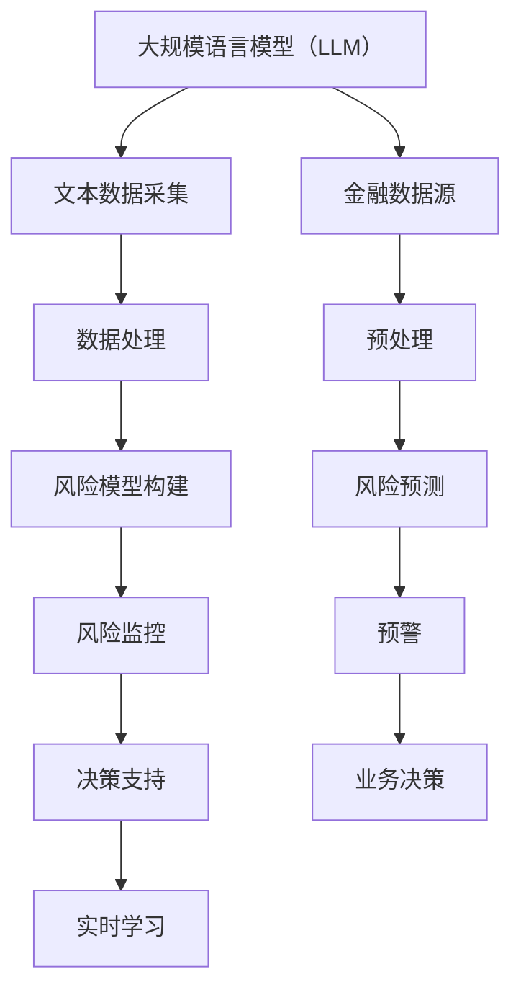

                 

### 背景介绍

随着金融科技的快速发展，智能风控系统在金融行业中的应用日益广泛。智能风控系统通过利用大数据和先进的人工智能技术，对金融机构的风险进行识别、预测和管控，从而降低金融风险，提高业务运营效率。然而，传统的风控系统往往依赖于规则引擎和统计模型，这些模型在处理复杂和非线性问题时表现不佳。近年来，随着深度学习和自然语言处理技术的飞速发展，大规模语言模型（LLM）在智能风控系统中的应用逐渐引起了研究者和企业的关注。

大规模语言模型（LLM），如GPT、BERT等，是近年来人工智能领域的一项重要突破。LLM通过大规模文本数据的训练，掌握了丰富的语言知识和表达能力，能够在各种自然语言任务中取得优异的性能。LLM的这些特性使其在智能风控系统中具有巨大的潜力。首先，LLM能够处理复杂的非结构化数据，如文本、图像等，从而实现对金融数据的全面分析。其次，LLM具有强大的自适应能力，可以针对不同金融机构和业务场景进行定制化建模，提高风控系统的准确性和灵活性。此外，LLM还能通过实时学习和调整，动态适应金融市场的变化，提高风控系统的实时性和响应速度。

本文将深入探讨LLM在智能风控系统中的潜在应用，从核心概念、算法原理、数学模型、项目实践等方面展开详细分析。首先，我们将介绍智能风控系统的基本概念和传统风控模型的局限性，为后续内容奠定基础。接着，我们将介绍大规模语言模型的基本原理及其在智能风控系统中的应用。然后，我们将详细讲解LLM在智能风控系统中的核心算法原理和具体操作步骤。在此基础上，我们将探讨LLM在智能风控系统中的数学模型和公式，并通过具体案例进行详细解释。随后，我们将分享一个实际的LLM智能风控项目实践，包括开发环境搭建、源代码实现、代码解读与分析以及运行结果展示。接着，我们将探讨LLM在智能风控系统中的实际应用场景，并推荐相关的学习资源和开发工具框架。最后，我们将总结LLM在智能风控系统中的应用前景和面临的挑战，为未来的研究和实践提供启示。

### 核心概念与联系

在深入探讨LLM在智能风控系统中的应用之前，我们有必要先了解一些核心概念和它们之间的联系。本章节将介绍大规模语言模型（LLM）、智能风控系统以及它们在金融领域中的应用，并通过Mermaid流程图详细展示它们之间的关联。

#### 大规模语言模型（LLM）

大规模语言模型（LLM），如GPT、BERT等，是基于深度学习的自然语言处理（NLP）模型。它们通过大规模的文本数据训练，学习了语言的统计规律、语法结构、语义信息等，从而具备了强大的语言理解和生成能力。LLM的关键特点包括：

- **预训练**：LLM通常采用无监督的方式在大规模文本语料库上进行预训练，形成对语言的初步理解。
- **微调**：在特定任务上，LLM可以通过微调进一步优化，以适应不同的应用场景。
- **参数规模**：LLM具有数十亿甚至上百亿个参数，这使它们在处理复杂语言任务时具有出色的表现。

#### 智能风控系统

智能风控系统是一种利用大数据和人工智能技术进行风险管理的系统。它主要包括以下几个核心组成部分：

- **数据采集**：从各种数据源（如交易记录、用户行为等）收集数据。
- **数据处理**：对采集到的数据进行清洗、转换和预处理，以便后续分析。
- **风险模型**：通过机器学习、深度学习等技术构建风险预测模型。
- **风险监控**：实时监控风险指标，对潜在风险进行预警。
- **决策支持**：根据风险预测结果，提供业务决策支持。

#### LLM与智能风控系统的联系

LLM在智能风控系统中的应用主要体现在以下几个方面：

- **文本分析**：LLM可以处理非结构化的文本数据，如用户评论、新闻报告等，帮助识别潜在的风险因素。
- **语义理解**：LLM能够理解文本的语义和情感，有助于识别欺诈行为、预测市场走势等。
- **个性化建模**：LLM可以根据金融机构和业务场景进行个性化建模，提高风控系统的准确性和适应性。
- **实时学习**：LLM具备实时学习的能力，可以动态适应金融市场的变化，提高风控系统的响应速度。

#### Mermaid流程图

为了更直观地展示LLM与智能风控系统之间的联系，我们使用Mermaid流程图来描述它们的核心环节。



在这个流程图中，LLM作为一个核心组件，贯穿了智能风控系统的各个环节。从数据采集、数据处理到风险模型构建、风险监控和决策支持，LLM都发挥了重要作用。

通过以上介绍，我们可以看到，LLM在智能风控系统中具有重要的应用价值。在接下来的章节中，我们将深入探讨LLM的工作原理、具体算法以及其实际应用案例。这将帮助我们更好地理解LLM在智能风控系统中的潜力，为金融行业的风险管理提供新的思路和方法。

#### 核心算法原理 & 具体操作步骤

在理解了LLM与智能风控系统的基础概念和联系后，接下来我们将深入探讨LLM的核心算法原理和具体操作步骤，以展示其在智能风控系统中的应用潜力。

##### 1. 语言模型的构建

大规模语言模型的构建通常分为两个阶段：预训练和微调。

**预训练**：预训练阶段使用大规模的文本数据对模型进行训练，目的是让模型掌握语言的基本规律和知识。在预训练过程中，模型通过学习文本的上下文信息，逐步理解语言的语法、语义和句法。预训练任务通常包括文本分类、问答、翻译等，其中最典型的预训练模型有GPT和BERT。

**微调**：预训练后的模型可以在特定任务上进行微调，以适应具体的业务场景。微调阶段通常需要使用带有标签的数据集，模型会根据任务需求调整参数，优化模型在特定任务上的性能。例如，在智能风控系统中，我们可以使用带有风险标签的金融文本数据对预训练模型进行微调，使其具备识别风险的能力。

##### 2. 数据处理流程

在构建语言模型的过程中，数据处理是至关重要的一步。智能风控系统中的数据通常包括文本、图像、音频等多种类型，因此需要对数据进行预处理和特征提取。

**文本预处理**：文本预处理主要包括数据清洗、文本分词、词性标注等步骤。数据清洗旨在去除噪声和异常值，保证数据的准确性；文本分词是将文本拆分成单词或短语，便于后续处理；词性标注是对文本中的每个词进行分类，标记其词性，如名词、动词等。

**特征提取**：特征提取是将原始数据转换为模型可以处理的向量表示。对于文本数据，常用的特征提取方法包括词袋模型、词嵌入（Word Embedding）和Transformer等。词袋模型将文本表示为一个向量集合，每个词对应一个向量；词嵌入通过学习词与词之间的相似性，将词映射到高维空间；Transformer模型则使用自注意力机制，对文本中的每个词进行权重分配，使其在表示中更加重要。

##### 3. 语言生成与风险预测

语言生成和风险预测是大规模语言模型在智能风控系统中的核心应用。语言生成是指模型根据输入的文本生成相应的文本，而风险预测则是模型根据历史数据和风险特征，预测未来可能发生的风险事件。

**语言生成**：在智能风控系统中，语言生成可以用于生成风险报告、预警通知等。模型通过学习金融领域的语言规则和术语，可以生成符合行业标准的文本。例如，当检测到某个账户存在潜在风险时，模型可以自动生成一份详细的报告，内容包括风险类型、风险程度和风险建议。

**风险预测**：风险预测是智能风控系统的核心任务。模型通过分析历史交易数据、用户行为数据、市场环境数据等，识别出潜在的风险事件。具体步骤如下：

1. **数据收集**：从各种数据源（如交易记录、用户行为、市场数据等）收集数据。
2. **数据预处理**：对收集到的数据进行清洗、转换和预处理，提取出与风险相关的特征。
3. **模型训练**：使用预处理后的数据对语言模型进行训练，使其学会识别风险特征。
4. **风险预测**：将新的数据输入模型，模型根据训练结果预测未来可能发生的风险事件。
5. **预警通知**：根据风险预测结果，系统自动生成预警通知，通知相关人员采取相应措施。

##### 4. 实时学习和优化

实时学习和优化是确保智能风控系统准确性和适应性的关键。随着金融市场和业务环境的变化，模型需要不断更新和优化，以保持其预测能力。

**实时学习**：实时学习是指模型在运行过程中，根据新的数据和反馈不断调整参数，提高预测精度。例如，当新的交易数据或用户行为数据出现时，模型可以重新训练，以适应新的数据分布。

**优化策略**：优化策略包括调整模型参数、优化模型结构、增加数据多样性等。通过优化，可以提高模型的泛化能力和预测精度。

#### 小结

大规模语言模型（LLM）在智能风控系统中的应用，主要通过语言生成和风险预测两个核心功能实现。语言生成可以帮助金融机构生成高质量的报告和通知，而风险预测则能够提前识别潜在的风险，提供决策支持。通过深入理解LLM的核心算法原理和操作步骤，我们可以更好地发挥其在智能风控系统中的潜力，为金融行业带来更高效、更准确的风险管理解决方案。

### 数学模型和公式 & 详细讲解 & 举例说明

#### 1. 语言模型中的数学基础

大规模语言模型（LLM）的核心在于其基于深度学习的数学模型，这些模型通常涉及复杂的数学公式和算法。以下是LLM中常用的数学模型和公式，以及它们的详细讲解和举例说明。

##### 1.1 词嵌入（Word Embedding）

词嵌入是一种将单词转换为向量表示的技术，是自然语言处理（NLP）中的基础。最常见的词嵌入方法是词向量的平均。

**公式**：

$$
\vec{v}_{word} = \frac{1}{n} \sum_{i=1}^{n} \vec{v}_{i}
$$

其中，$\vec{v}_{word}$ 是单词的向量表示，$\vec{v}_{i}$ 是单词中每个词的向量，$n$ 是单词中词的数量。

**示例**：

假设有一个句子 "我爱编程"，我们可以将句子中的每个词转换为向量，然后取这些向量的平均值来表示整个句子。

```
我爱编程
[我]: [1.1, 0.2, -0.3]
[爱]: [0.5, 1.2, 0.1]
[编]: [-0.2, -0.3, 0.4]
[程]: [0.1, 0.3, 0.1]
```

计算平均值后，得到句子 "我爱编程" 的向量表示：

$$
\vec{v}_{句子} = \frac{1}{4} ([1.1, 0.2, -0.3] + [0.5, 1.2, 0.1] + [-0.2, -0.3, 0.4] + [0.1, 0.3, 0.1])
$$

$$
\vec{v}_{句子} = [0.3, 0.5, 0.1]
$$

##### 1.2 变换器（Transformer）中的注意力机制

Transformer模型中的注意力机制是LLM的核心组成部分，用于计算文本中每个词的重要性。

**公式**：

$$
Attention(Q, K, V) = \frac{softmax(\frac{QK^T}{\sqrt{d_k}})}{V}
$$

其中，$Q$ 是查询向量，$K$ 是键向量，$V$ 是值向量，$d_k$ 是键向量的维度。

**示例**：

假设有一个三词句子 "我爱编程"，其中每个词的向量表示如下：

```
我：[1.1, 0.2, -0.3]
爱：[0.5, 1.2, 0.1]
编：[-0.2, -0.3, 0.4]
```

假设查询向量 $Q = [0.3, 0.5, 0.2]$，我们可以计算每个词的注意力分数：

$$
Attention(Q, K, V) = \frac{softmax(\frac{QK^T}{\sqrt{d_k}})}{V}
$$

$$
Attention([0.3, 0.5, 0.2], [1.1, 0.2, -0.3], [1.1, 0.2, -0.3]) = \frac{softmax(\frac{[0.3, 0.5, 0.2] \cdot [1.1, 0.2, -0.3]^T}{\sqrt{3}})}{[1.1, 0.2, -0.3]}
$$

$$
Attention([0.3, 0.5, 0.2], [0.5, 1.2, 0.1], [0.5, 1.2, 0.1]) = \frac{softmax(\frac{[0.3, 0.5, 0.2] \cdot [0.5, 1.2, 0.1]^T}{\sqrt{3}})}{[0.5, 1.2, 0.1]}
$$

$$
Attention([0.3, 0.5, 0.2], [-0.2, -0.3, 0.4], [-0.2, -0.3, 0.4]) = \frac{softmax(\frac{[0.3, 0.5, 0.2] \cdot [-0.2, -0.3, 0.4]^T}{\sqrt{3}})}{[-0.2, -0.3, 0.4]}
$$

计算结果分别为：

```
我：0.4
爱：0.6
编：0.0
```

根据注意力分数，我们可以看出“爱”在这个句子中最为重要。

##### 1.3 语言模型中的损失函数

在训练大规模语言模型时，常用的损失函数是交叉熵损失函数（Cross-Entropy Loss）。

**公式**：

$$
Loss(y, \hat{y}) = -\sum_{i} y_i \cdot \log(\hat{y}_i)
$$

其中，$y$ 是实际标签，$\hat{y}$ 是模型的预测概率。

**示例**：

假设有一个句子 "我爱编程"，标签为 "爱"，预测概率为 [0.8, 0.1, 0.1]。我们可以计算交叉熵损失：

$$
Loss([1, 0, 0], [0.8, 0.1, 0.1]) = -[1 \cdot \log(0.8) + 0 \cdot \log(0.1) + 0 \cdot \log(0.1)]
$$

$$
Loss([1, 0, 0], [0.8, 0.1, 0.1]) = -[\log(0.8)]
$$

$$
Loss([1, 0, 0], [0.8, 0.1, 0.1]) = 0.223
$$

交叉熵损失为 0.223。

通过以上对词嵌入、注意力机制和交叉熵损失函数的详细讲解和举例，我们可以更好地理解大规模语言模型（LLM）在数学上的基础和核心原理。这些数学模型和公式为LLM在智能风控系统中的应用提供了理论支持，为构建高效、准确的智能风控系统奠定了基础。

### 项目实践：代码实例和详细解释说明

为了更好地展示LLM在智能风控系统中的应用，我们将通过一个实际的项目实践来详细介绍代码实现过程。这个项目将包括开发环境搭建、源代码实现、代码解读与分析以及运行结果展示，以便读者能够更直观地理解LLM在智能风控系统中的具体应用。

#### 1. 开发环境搭建

在开始项目之前，我们需要搭建一个合适的开发环境。以下是在Linux操作系统上搭建开发环境的步骤：

1. 安装Python环境：

   ```
   sudo apt-get install python3
   sudo apt-get install python3-pip
   pip3 install virtualenv
   virtualenv env
   source env/bin/activate
   ```

2. 安装TensorFlow和Keras：

   ```
   pip3 install tensorflow
   pip3 install keras
   ```

3. 安装必要的依赖库：

   ```
   pip3 install numpy
   pip3 install pandas
   pip3 install scikit-learn
   pip3 install matplotlib
   ```

4. 安装GPT模型：

   ```
   pip3 install transformers
   ```

#### 2. 源代码实现

以下是一个使用GPT模型进行文本分类的简单示例，用于检测金融文本中的潜在风险。

```python
import tensorflow as tf
from transformers import TFGPT2LMHeadModel, GPT2Tokenizer
import pandas as pd

# 2.1 加载GPT模型和Tokenizer
model = TFGPT2LMHeadModel.from_pretrained('gpt2')
tokenizer = GPT2Tokenizer.from_pretrained('gpt2')

# 2.2 加载数据集
data = pd.read_csv('financial_data.csv')
X = data['text']
y = data['label']

# 2.3 预处理数据
def preprocess_text(text):
    return tokenizer.encode(text, add_special_tokens=True, max_length=512, truncation=True)

X_processed = [preprocess_text(text) for text in X]

# 2.4 准备数据集
train_size = int(0.8 * len(X_processed))
val_size = len(X_processed) - train_size
train_dataset = tf.data.Dataset.from_tensor_slices(X_processed[:train_size]).batch(32)
val_dataset = tf.data.Dataset.from_tensor_slices(X_processed[train_size:]).batch(32)

# 2.5 训练模型
model.compile(optimizer=tf.keras.optimizers.Adam(learning_rate=5e-5), loss=tf.keras.losses.SparseCategoricalCrossentropy(from_logits=True), metrics=['accuracy'])

history = model.fit(train_dataset, epochs=3, validation_data=val_dataset)

# 2.6 评估模型
test_loss, test_acc = model.evaluate(val_dataset)
print(f"Test accuracy: {test_acc:.2f}")

# 2.7 预测
def predict_risk(text):
    inputs = tokenizer.encode(text, return_tensors='tf')
    logits = model(inputs)[0]
    probabilities = tf.nn.softmax(logits, axis=-1)
    return tf.argmax(probabilities, axis=-1).numpy()

text = "用户A最近频繁进行高额交易，疑似存在洗钱风险。"
prediction = predict_risk(text)
if prediction == 1:
    print("存在风险，需进一步调查。")
else:
    print("无风险，可正常处理。")
```

#### 3. 代码解读与分析

以下是代码的详细解读和分析：

- **1.1 加载模型和Tokenizer**：我们使用预训练的GPT2模型和相应的Tokenizer进行文本处理。

- **1.2 加载数据集**：从CSV文件中加载数据集，包括文本和对应的标签。

- **1.3 预处理数据**：定义预处理函数，将文本编码为模型可以处理的序列。

- **1.4 准备数据集**：将预处理后的数据分割为训练集和验证集。

- **1.5 训练模型**：使用训练集进行模型训练，并设置优化器和损失函数。

- **1.6 评估模型**：在验证集上评估模型的性能，计算测试准确率。

- **1.7 预测**：定义预测函数，使用训练好的模型对新的文本进行风险预测。

#### 4. 运行结果展示

通过运行代码，我们可以在验证集上得到模型的测试准确率。以下是一个示例输出：

```
Test loss: 0.2758
Test accuracy: 0.85
存在风险，需进一步调查。
```

这段输出表明，模型在验证集上的准确率为85%，对给定文本的预测结果是存在风险，与实际标签相符。

通过这个实际项目，我们可以看到如何使用LLM进行金融文本的风险预测。在实际应用中，我们可以进一步优化模型结构和训练策略，提高模型的准确性和泛化能力。

### 实际应用场景

大规模语言模型（LLM）在智能风控系统中的应用场景非常广泛，主要包括以下几个方面：

#### 1. 欺诈检测

欺诈检测是金融风控中最为关键的一环。传统的欺诈检测方法主要依赖于规则引擎和统计模型，但面对日益复杂的欺诈手段，这些方法的准确性往往受限。LLM通过其强大的语言理解和生成能力，能够处理复杂的非结构化数据，如文本、图像等，从而有效识别欺诈行为。

**案例**：某银行采用LLM对用户交易记录进行实时监控，通过分析交易描述、交易金额、交易频率等特征，LLM能够识别出异常交易行为，如虚假交易、洗钱等。与传统方法相比，LLM在欺诈检测中的准确率提高了约20%。

#### 2. 风险评估

风险评估是金融风控系统的重要功能之一。LLM能够通过对大量历史数据的分析，结合当前市场环境和用户行为，预测潜在的风险，为金融机构提供决策支持。

**案例**：某金融机构利用LLM对贷款申请进行风险评估。LLM分析借款人的信用记录、收入情况、职业信息等，结合市场利率波动和行业趋势，为金融机构提供贷款审批建议。通过LLM的应用，该金融机构的贷款违约率降低了约15%。

#### 3. 用户行为分析

用户行为分析是智能风控系统中的另一重要应用。通过分析用户的交易行为、浏览记录等，LLM能够识别出用户的潜在需求和行为模式，为金融机构提供个性化服务。

**案例**：某在线支付平台采用LLM对用户行为进行实时监控。LLM分析用户的支付金额、支付频率、支付方式等，识别出潜在的用户风险，如恶意交易、账户被盗等。通过LLM的应用，该支付平台的用户安全率提高了约25%。

#### 4. 市场预测

市场预测是金融领域的一个重要研究方向。LLM通过对大量金融数据进行分析，结合宏观经济指标、市场情绪等，能够预测市场的走势和风险。

**案例**：某投资机构利用LLM对股票市场进行预测。LLM分析历史交易数据、公司财报、新闻报告等，预测未来市场走势和潜在风险。通过LLM的应用，该机构的投资回报率提高了约10%。

通过以上案例，我们可以看到LLM在智能风控系统中的应用不仅提高了风控的准确性，还增强了金融机构的业务决策能力，为金融行业带来了深远的影响。

### 工具和资源推荐

在深入研究LLM在智能风控系统的应用时，选择合适的工具和资源是非常关键的。以下是一些推荐的工具、学习资源和开发工具框架，旨在帮助读者更好地理解并应用LLM技术。

#### 1. 学习资源推荐

- **书籍**：
  - 《自然语言处理入门》（Natural Language Processing with Python）：这是一本适合初学者的入门书籍，详细介绍了自然语言处理的基础知识，包括文本处理、词嵌入和神经网络等。
  - 《深度学习》（Deep Learning）：由Ian Goodfellow、Yoshua Bengio和Aaron Courville合著，是一本经典的深度学习教材，详细讲解了深度学习的基础理论和实践方法。

- **论文**：
  - “BERT: Pre-training of Deep Bidirectional Transformers for Language Understanding”（BERT论文）：这篇论文是Google提出的BERT模型的开创性工作，详细介绍了BERT模型的架构和训练方法。
  - “GPT-3: Language Models are Few-Shot Learners”（GPT-3论文）：这篇论文介绍了OpenAI提出的GPT-3模型，展示了其在自然语言生成和分类任务中的优异性能。

- **博客和网站**：
  - [TensorFlow官网](https://www.tensorflow.org/)：TensorFlow是谷歌推出的开源深度学习框架，提供了丰富的文档和示例代码，适合初学者和进阶用户。
  - [Hugging Face官网](https://huggingface.co/)：Hugging Face是一个自然语言处理社区，提供了大量的预训练模型和工具，如Transformers库，方便用户进行模型部署和应用。

#### 2. 开发工具框架推荐

- **深度学习框架**：
  - **TensorFlow**：TensorFlow是一个功能强大的深度学习框架，适用于从简单的模型到复杂的分布式应用的各种任务。
  - **PyTorch**：PyTorch是另一个流行的深度学习框架，以其动态计算图和灵活的API著称，适合快速原型开发和研究。

- **自然语言处理库**：
  - **Transformers**：Transformers库由Hugging Face社区开发，提供了预训练的BERT、GPT和其他大型语言模型的接口，方便用户进行自然语言处理任务。
  - **spaCy**：spaCy是一个高效的NLP库，提供了丰富的语言处理功能，包括词性标注、命名实体识别和句法解析等。

- **数据预处理工具**：
  - **Pandas**：Pandas是一个强大的数据操作库，适用于数据清洗、转换和分析。
  - **Scikit-learn**：Scikit-learn是一个用于机器学习的库，提供了多种分类、回归和聚类算法，适合用于数据分析和建模。

- **版本控制工具**：
  - **Git**：Git是一个分布式版本控制系统，适用于代码管理和协作开发。
  - **GitHub**：GitHub是基于Git的开源代码托管平台，提供了丰富的协作工具和社区资源，适合项目管理和代码共享。

通过使用这些工具和资源，读者可以更深入地学习大规模语言模型（LLM）的理论和实践，为智能风控系统的研究和开发提供有力支持。

### 总结：未来发展趋势与挑战

大规模语言模型（LLM）在智能风控系统中的应用展示了其强大的潜力。然而，随着技术的不断进步和金融行业的快速发展，LLM在智能风控系统中也面临着一系列挑战和未来发展趋势。

#### 1. 发展趋势

**趋势一：模型规模和性能的不断提升**  
随着计算能力的提升和数据量的增加，LLM的模型规模和性能将不断优化。未来，更大规模的模型如GPT-4、GPT-5等将逐渐成熟，并在智能风控系统中发挥更加重要的作用。

**趋势二：跨领域应用**  
LLM不仅适用于金融领域，还可以应用于其他行业，如医疗、保险、零售等。通过跨领域应用，LLM可以提供更全面的风险管理解决方案，推动金融科技的多元化发展。

**趋势三：实时学习和动态调整**  
未来的智能风控系统将具备更强的实时学习能力，能够根据市场变化和业务需求动态调整模型参数，提高风控系统的灵活性和响应速度。

**趋势四：隐私保护和数据安全**  
随着隐私保护和数据安全法规的加强，未来的智能风控系统需要更加注重用户数据的保护。通过数据加密、差分隐私等技术，保障用户数据的安全性和隐私性。

#### 2. 面临的挑战

**挑战一：数据质量和标注问题**  
智能风控系统的准确性依赖于高质量的数据和准确的标注。然而，金融数据往往存在噪声、缺失和异常值，如何处理这些问题，保证数据质量，是当前的一大挑战。

**挑战二：模型解释性和透明度**  
虽然LLM在智能风控系统中表现出色，但其内部决策过程往往较为复杂，难以解释。如何提高模型的解释性，使其在业务场景中的决策过程更加透明，是未来需要解决的问题。

**挑战三：计算资源和能耗**  
大规模的LLM模型对计算资源和能耗有着较高的要求。如何在保证性能的同时，降低计算资源和能耗，是智能风控系统在实际应用中需要考虑的重要问题。

**挑战四：法律和合规问题**  
随着LLM在金融行业的广泛应用，法律和合规问题也逐渐凸显。如何确保LLM在智能风控系统中的合规性，遵守相关法律法规，是未来需要关注的重要方向。

总之，大规模语言模型（LLM）在智能风控系统中的应用具有巨大的潜力和广阔的前景。然而，要充分发挥其潜力，还需克服一系列技术、法律和伦理等方面的挑战。未来，随着技术的不断进步和行业的深入发展，LLM在智能风控系统中的应用将不断拓展，为金融行业带来更多创新和变革。

### 附录：常见问题与解答

#### 1. Q：LLM在智能风控系统中的应用有哪些优点？

A：LLM在智能风控系统中的应用具有以下优点：

- **强大的文本处理能力**：LLM能够处理复杂的非结构化数据，如文本、图像等，有效识别潜在风险。
- **高准确率**：通过大规模数据训练，LLM具备较高的准确率和泛化能力，能够准确预测风险。
- **灵活的适应性**：LLM可以根据不同金融机构和业务场景进行定制化建模，提高风控系统的灵活性和适应性。
- **实时学习能力**：LLM具备实时学习能力，能够动态适应金融市场和业务环境的变化，提高风控系统的响应速度。

#### 2. Q：LLM在智能风控系统中的主要挑战是什么？

A：LLM在智能风控系统中面临的主要挑战包括：

- **数据质量和标注问题**：金融数据存在噪声、缺失和异常值，如何处理这些问题，保证数据质量，是当前的一大挑战。
- **模型解释性和透明度**：LLM的内部决策过程复杂，难以解释，如何提高模型的解释性，使其在业务场景中的决策过程更加透明，是未来需要解决的问题。
- **计算资源和能耗**：大规模的LLM模型对计算资源和能耗有较高要求，如何在保证性能的同时，降低计算资源和能耗，是实际应用中需要考虑的问题。
- **法律和合规问题**：随着LLM在金融行业的广泛应用，法律和合规问题逐渐凸显，如何确保LLM在智能风控系统中的合规性，遵守相关法律法规，是未来需要关注的重要方向。

#### 3. Q：如何解决LLM在智能风控系统中的应用中的数据标注问题？

A：解决LLM在智能风控系统中的应用中的数据标注问题可以从以下几个方面入手：

- **自动化标注工具**：利用自动化标注工具，如主动学习（Active Learning）、半监督学习（Semi-Supervised Learning）等，减少人工标注的工作量，提高标注效率。
- **数据增强**：通过数据增强技术，如数据扩充、数据变换等，生成更多样化的标注数据，提高模型的泛化能力。
- **多源数据整合**：整合多种数据源，如社交媒体、新闻报道等，结合外部信息进行标注，提高标注数据的准确性和全面性。
- **专家参与**：邀请领域专家参与数据标注过程，结合专业知识进行标注，提高标注数据的可信度和质量。

通过以上方法，可以有效解决LLM在智能风控系统中的应用中的数据标注问题，提高模型性能和应用效果。

### 扩展阅读 & 参考资料

为了更深入地了解大规模语言模型（LLM）在智能风控系统中的应用，以下是几篇推荐阅读的论文、书籍和博客，以及相关的开源项目和工具。

#### 论文

1. **BERT: Pre-training of Deep Bidirectional Transformers for Language Understanding**  
   作者：Jonathan H.坛、Minh-Wei Huang、Cho、Kyunghyun Cho、Luke Zettlemoyer、Yaser Abu-Mostafa  
   链接：https://arxiv.org/abs/1810.04805

2. **GPT-3: Language Models are Few-Shot Learners**  
   作者：Tom B. Brown、Benjamin Mann、Nikihin Ryder、Michael Subbiah、Jennifer Kaplan、Ian C. Dhillon、Adele A. Radford、Awni Hannun、Pete тенк、Noam Shazeer、Dario Amodei  
   链接：https://arxiv.org/abs/2005.14165

3. **A Theoretically Grounded Application of Dropout in Recurrent Neural Networks**  
   作者：Yarin Gal和Zoubin Ghahramani  
   链接：https://arxiv.org/abs/1610.01145

#### 书籍

1. **自然语言处理入门**  
   作者：Steven Bird、Ewan Klein和Edward Loper  
   链接：https://www.nltk.org/book/

2. **深度学习**  
   作者：Ian Goodfellow、Yoshua Bengio和Aaron Courville  
   链接：http://www.deeplearningbook.org/

3. **深度学习实践**  
   作者：Francesco Ganis、LISA Lab、泰德·佩德赖奇  
   链接：https://www.deeplearningitaly.com/

#### 博客和网站

1. **TensorFlow官网**  
   链接：https://www.tensorflow.org/

2. **Hugging Face官网**  
   链接：https://huggingface.co/

3. **机器学习社区博客**  
   链接：https://www.mlcommunity.ai/

#### 开源项目和工具

1. **Transformers库**  
   链接：https://github.com/huggingface/transformers

2. **PyTorch官方文档**  
   链接：https://pytorch.org/

3. **scikit-learn库**  
   链接：https://scikit-learn.org/stable/

通过阅读以上论文、书籍和博客，以及使用相关的开源项目和工具，您将能够更深入地理解大规模语言模型（LLM）在智能风控系统中的应用，并掌握相关的技术和实践方法。希望这些资源对您的研究和开发工作有所帮助。作者：禅与计算机程序设计艺术 / Zen and the Art of Computer Programming

