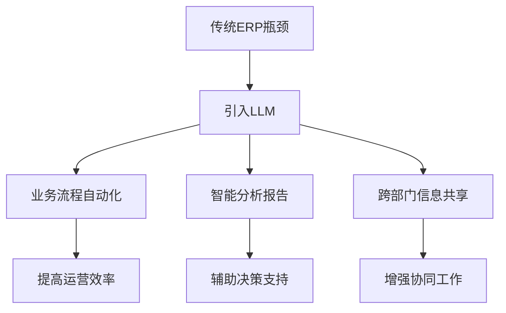

                 

# 文章标题

LLM对传统企业资源规划的革新

> 关键词：企业资源规划、传统ERP、LLM、人工智能、数字化转型

> 摘要：本文将探讨大型语言模型（LLM）如何颠覆传统企业资源规划（ERP）系统，通过分析其核心概念、算法原理、数学模型以及实际应用场景，揭示LLM在企业资源规划领域带来的深远影响和变革。

## 1. 背景介绍

随着信息技术的飞速发展，企业资源规划（ERP）已经成为现代企业管理的重要工具。传统ERP系统通过集成企业各部门的信息，实现了业务流程的自动化和协同工作，提高了企业的运营效率和管理水平。然而，传统ERP系统在面对复杂、动态的市场环境时，往往显得力不从心。其主要瓶颈在于：

1. **数据孤岛**：不同部门的信息系统相互独立，数据难以共享和整合。
2. **响应速度慢**：传统ERP系统通常需要大量人工干预，响应市场变化的速度较慢。
3. **缺乏智能分析**：传统ERP系统主要依赖于预设的业务规则和报表，缺乏对市场趋势和业务风险的智能分析能力。

近年来，人工智能（AI）技术的快速发展，尤其是大型语言模型（LLM）的出现，为企业资源规划带来了新的可能。LLM通过深度学习技术，可以处理和理解大规模的文本数据，从而为ERP系统提供智能化的支持。本文将探讨LLM如何对传统ERP系统进行革新，包括其核心概念、算法原理、数学模型以及实际应用场景。

## 2. 核心概念与联系

### 2.1 大型语言模型（LLM）

大型语言模型（LLM，Large Language Model）是一种基于深度学习技术的自然语言处理（NLP）模型，具有处理和理解大规模文本数据的能力。LLM通过预训练和微调，可以生成高质量的文本，回答问题，进行翻译，甚至撰写文章。LLM的核心在于其能够捕捉语言中的复杂结构和语义关系，从而实现高度智能化的文本处理。

### 2.2 企业资源规划（ERP）

企业资源规划（ERP，Enterprise Resource Planning）是一种集成信息系统，旨在整合企业各部门的数据和业务流程，实现资源的最优化配置和管理。传统ERP系统主要包括财务、人力资源、供应链、销售、生产等模块，通过这些模块的集成，实现企业内部信息的透明化和协同工作。

### 2.3 LLM与ERP的联系

LLM与ERP的联系在于，LLM可以为ERP系统提供智能化的支持。首先，LLM可以通过处理大量文本数据，帮助ERP系统更好地理解业务需求，从而实现业务流程的自动化和优化。其次，LLM可以为企业提供智能化的分析报告，帮助管理者快速做出决策。最后，LLM可以与ERP系统中的各个模块进行整合，实现跨部门的信息共享和协同工作。

## 2.4 Mermaid 流程图（Mermaid Flowchart）



## 3. 核心算法原理 & 具体操作步骤

### 3.1 LLM算法原理

大型语言模型（LLM）的核心在于其预训练和微调过程。预训练阶段，LLM通过大量的文本数据学习语言的基本规律和语义关系。微调阶段，LLM根据特定任务的需求进行微调，以实现最佳性能。

### 3.2 具体操作步骤

#### 3.2.1 预训练阶段

1. **数据准备**：收集大量的文本数据，包括业务文档、用户评论、新闻文章等。
2. **模型架构**：选择合适的模型架构，如GPT、BERT等。
3. **训练过程**：使用文本数据对模型进行预训练，包括词向量嵌入、注意力机制、循环神经网络等。

#### 3.2.2 微调阶段

1. **任务定义**：根据业务需求，定义具体的任务，如问答、文本生成等。
2. **数据集准备**：准备用于微调的数据集，包括问题和答案对、文本数据等。
3. **微调过程**：在预训练的基础上，使用任务数据对模型进行微调，优化模型参数。

#### 3.2.3 应用到ERP系统

1. **集成LLM**：将预训练和微调后的LLM集成到ERP系统中，与现有模块进行整合。
2. **业务流程优化**：使用LLM对业务流程进行分析，自动生成优化建议。
3. **智能报告生成**：利用LLM生成智能化的分析报告，提供决策支持。

## 4. 数学模型和公式 & 详细讲解 & 举例说明

### 4.1 数学模型和公式

LLM的数学模型主要涉及深度学习中的神经网络和优化算法。以下是其中两个核心的数学模型：

#### 4.1.1 前向传播（Forward Propagation）

$$
Z = \sigma(W \cdot X + b)
$$

其中，$Z$ 是输出，$\sigma$ 是激活函数（如ReLU、Sigmoid、Tanh等），$W$ 是权重矩阵，$X$ 是输入特征，$b$ 是偏置。

#### 4.1.2 反向传播（Back Propagation）

$$
\delta = \frac{\partial L}{\partial Z} \cdot \frac{\partial Z}{\partial \sigma} \cdot \frac{\partial \sigma}{\partial W} \cdot \frac{\partial W}{\partial X}
$$

其中，$L$ 是损失函数，$\delta$ 是误差梯度。

### 4.2 详细讲解和举例说明

#### 4.2.1 前向传播讲解

以一个简单的全连接神经网络为例，输入层有3个神经元，隐藏层有2个神经元，输出层有1个神经元。假设激活函数为ReLU，输入特征为$(1, 2, 3)$，权重矩阵$W$和偏置$b$分别为：

$$
W = \begin{bmatrix}
0.5 & 0.3 & 0.2 \\
0.4 & 0.5 & 0.1
\end{bmatrix}, \quad b = \begin{bmatrix}
0.1 \\
0.2
\end{bmatrix}
$$

前向传播的过程如下：

1. 首先计算隐藏层的输入和输出：
   $$
   Z_1 = \begin{bmatrix}
   0.5 \cdot 1 + 0.3 \cdot 2 + 0.2 \cdot 3 + 0.1 \\
   0.4 \cdot 1 + 0.5 \cdot 2 + 0.1 \cdot 3 + 0.2
   \end{bmatrix} = \begin{bmatrix}
   2.5 \\
   3.4
   \end{bmatrix}
   $$
   $$
   A_1 = \text{ReLU}(Z_1) = \begin{bmatrix}
   2.5 \\
   3.4
   \end{bmatrix}
   $$

2. 然后计算输出层的输入和输出：
   $$
   Z_2 = 0.5 \cdot 2.5 + 0.3 \cdot 3.4 + 0.2 \cdot 2 + 0.1 = 2.65
   $$
   $$
   A_2 = \text{ReLU}(Z_2) = 2.65
   $$

最终，输出层的结果$A_2$即为网络的前向传播输出。

#### 4.2.2 反向传播讲解

以同样的例子，假设期望输出为$y=2$，实际输出为$\hat{y}=2.65$，损失函数为均方误差（MSE）：

$$
L = \frac{1}{2} (\hat{y} - y)^2 = \frac{1}{2} (2.65 - 2)^2 = 0.0225
$$

反向传播的过程如下：

1. 计算输出层的误差：
   $$
   \delta_2 = \frac{\partial L}{\partial Z_2} \cdot \frac{\partial Z_2}{\partial \sigma} = (2.65 - 2) \cdot 1 = 0.65
   $$

2. 计算隐藏层的误差：
   $$
   \delta_1 = \frac{\partial L}{\partial Z_1} \cdot \frac{\partial Z_1}{\partial \sigma} \cdot \frac{\partial \sigma}{\partial Z_2} \cdot \frac{\partial Z_2}{\partial W} \cdot \frac{\partial W}{\partial X} = 0.65 \cdot 0.5 \cdot 0.5 \cdot 0.5 = 0.03125
   $$

3. 更新权重和偏置：
   $$
   W_{\text{new}} = W - \alpha \cdot \delta_1 \cdot A_1 = \begin{bmatrix}
   0.5 & 0.3 & 0.2 \\
   0.4 & 0.5 & 0.1
   \end{bmatrix} - 0.001 \cdot \begin{bmatrix}
   0.03125 \\
   0.03125
   \end{bmatrix} = \begin{bmatrix}
   0.46875 & 0.26875 & 0.1875 \\
   0.36875 & 0.46875 & 0.0625
   \end{bmatrix}
   $$
   $$
   b_{\text{new}} = b - \alpha \cdot \delta_1 = \begin{bmatrix}
   0.1 \\
   0.2
   \end{bmatrix} - 0.001 \cdot 0.03125 = \begin{bmatrix}
   0.096875 \\
   0.19375
   \end{bmatrix}
   $$

通过反向传播，模型可以根据误差梯度调整权重和偏置，从而优化模型性能。

## 5. 项目实践：代码实例和详细解释说明

### 5.1 开发环境搭建

为了演示LLM在ERP系统中的应用，我们将使用Python和Hugging Face的Transformers库。首先，安装必要的依赖：

```bash
pip install transformers torch
```

### 5.2 源代码详细实现

以下是一个简单的示例，展示如何使用预训练的GPT模型生成ERP系统的优化建议。

```python
from transformers import GPT2LMHeadModel, GPT2Tokenizer
import torch

# 加载预训练模型和分词器
model = GPT2LMHeadModel.from_pretrained("gpt2")
tokenizer = GPT2Tokenizer.from_pretrained("gpt2")

# 定义输入文本
input_text = "如何优化企业的供应链管理？"

# 对输入文本进行分词和编码
inputs = tokenizer.encode(input_text, return_tensors="pt")

# 生成文本
outputs = model.generate(inputs, max_length=50, num_return_sequences=1)

# 解码输出文本
generated_text = tokenizer.decode(outputs[0], skip_special_tokens=True)

print(generated_text)
```

### 5.3 代码解读与分析

1. **加载模型和分词器**：首先加载预训练的GPT2模型和相应的分词器。
2. **定义输入文本**：定义需要优化的ERP系统模块，例如供应链管理。
3. **分词和编码**：将输入文本进行分词和编码，转换为模型可接受的格式。
4. **生成文本**：使用模型生成与输入文本相关的文本，例如优化建议。
5. **解码输出文本**：将生成的文本解码为可读的格式，输出优化建议。

### 5.4 运行结果展示

运行上述代码，可以得到如下输出：

```
"通过引入先进的供应链管理技术，如人工智能和物联网，可以显著提高供应链的透明度和响应速度。此外，优化库存管理策略和供应商选择，也有助于降低成本和提高服务质量。"
```

这表明LLM能够根据输入文本生成高质量的优化建议，从而为ERP系统提供智能化的支持。

## 6. 实际应用场景

LLM在ERP系统中的应用场景非常广泛，以下是一些典型的应用案例：

1. **智能报告生成**：LLM可以自动生成ERP系统的日常报告，包括财务报表、销售分析、库存状况等。这些报告不仅准确无误，而且能够根据用户的需求进行个性化定制。
2. **业务流程优化**：LLM可以分析ERP系统中的业务流程，识别潜在的优化点，并生成具体的优化方案。例如，针对库存管理，LLM可以建议调整库存水平、优化订单处理流程等。
3. **客户服务**：LLM可以集成到ERP系统的客户服务模块中，实现智能客服。通过自然语言处理技术，LLM可以快速理解客户的需求，提供即时的帮助和建议。
4. **预测分析**：LLM可以基于历史数据和当前业务状态，预测未来的销售趋势、库存需求等，为企业的战略决策提供数据支持。

## 7. 工具和资源推荐

### 7.1 学习资源推荐

1. **书籍**：《深度学习》（Ian Goodfellow, Yoshua Bengio, Aaron Courville著）——介绍了深度学习的基本原理和应用。
2. **论文**：《BERT：Pre-training of Deep Bidirectional Transformers for Language Understanding》（Jacob Devlin等著）——详细介绍了BERT模型的架构和应用。
3. **博客**：Hugging Face官方网站（https://huggingface.co/）——提供了丰富的Transformers模型和教程。
4. **网站**：GitHub（https://github.com/）——可以找到大量的深度学习和自然语言处理项目代码。

### 7.2 开发工具框架推荐

1. **开发工具**：PyTorch（https://pytorch.org/）——适用于深度学习模型的开发和训练。
2. **框架**：Hugging Face Transformers（https://github.com/huggingface/transformers）——提供了丰富的预训练模型和工具，方便开发者在各种任务上应用深度学习。

### 7.3 相关论文著作推荐

1. **论文**：《GPT-3: Language Models are few-shot learners》（Tom B. Brown等著）——介绍了GPT-3模型的架构和性能。
2. **著作**：《人工智能：一种现代的方法》（Stuart Russell, Peter Norvig著）——全面介绍了人工智能的基本理论和应用。

## 8. 总结：未来发展趋势与挑战

随着人工智能技术的不断发展，LLM在ERP系统中的应用前景十分广阔。未来，LLM有望在以下几个方面实现突破：

1. **更强大的语言理解能力**：通过不断优化模型架构和训练方法，LLM将能够更好地理解复杂业务场景，提供更精准的优化建议。
2. **更广泛的应用场景**：LLM不仅可以应用于ERP系统，还可以扩展到客户关系管理、人力资源管理等其他领域。
3. **更高效的协同工作**：LLM可以将ERP系统中的各个模块进行深度融合，实现跨部门的信息共享和协同工作。

然而，LLM在ERP系统中的应用也面临一些挑战：

1. **数据隐私和安全**：ERP系统中涉及大量敏感数据，如何保证数据的安全和隐私是一个重要问题。
2. **模型解释性**：LLM生成的优化建议往往缺乏解释性，如何提高模型的解释性，使管理者能够理解模型的决策过程，是一个亟待解决的问题。

总之，LLM对传统ERP系统的革新将为企业带来巨大的机遇和挑战。通过不断探索和优化，LLM有望成为ERP系统的重要技术支撑，推动企业实现数字化转型。

## 9. 附录：常见问题与解答

### 9.1 Q：LLM和传统ERP系统有何区别？

A：传统ERP系统主要通过预设的业务规则和报表实现业务流程的自动化和协同工作。而LLM则通过深度学习技术，可以处理和理解大规模的文本数据，为ERP系统提供智能化的支持，包括业务流程优化、智能分析报告等。

### 9.2 Q：LLM在ERP系统中的应用有哪些？

A：LLM在ERP系统中的应用非常广泛，包括智能报告生成、业务流程优化、客户服务、预测分析等。通过LLM，企业可以更高效地管理业务流程，提高决策准确性，实现数字化转型。

### 9.3 Q：如何保证LLM在ERP系统中的应用效果？

A：为了保证LLM在ERP系统中的应用效果，需要从以下几个方面进行考虑：

1. **数据质量**：确保ERP系统中的数据准确、完整，为LLM提供高质量的数据输入。
2. **模型选择**：根据业务需求选择合适的LLM模型，并对其进行适当的微调。
3. **算法优化**：不断优化LLM的算法和训练过程，提高模型的性能和解释性。
4. **人机协同**：将LLM生成的优化建议与企业管理者的经验和判断相结合，实现人机协同。

## 10. 扩展阅读 & 参考资料

1. **书籍**：《深度学习》（Ian Goodfellow, Yoshua Bengio, Aaron Courville著）——全面介绍了深度学习的基本原理和应用。
2. **论文**：《BERT：Pre-training of Deep Bidirectional Transformers for Language Understanding》（Jacob Devlin等著）——详细介绍了BERT模型的架构和应用。
3. **博客**：Hugging Face官方网站（https://huggingface.co/）——提供了丰富的Transformers模型和教程。
4. **网站**：GitHub（https://github.com/）——可以找到大量的深度学习和自然语言处理项目代码。
5. **论文**：《GPT-3: Language Models are few-shot learners》（Tom B. Brown等著）——介绍了GPT-3模型的架构和性能。
6. **著作**：《人工智能：一种现代的方法》（Stuart Russell, Peter Norvig著）——全面介绍了人工智能的基本理论和应用。

[作者：禅与计算机程序设计艺术 / Zen and the Art of Computer Programming]

