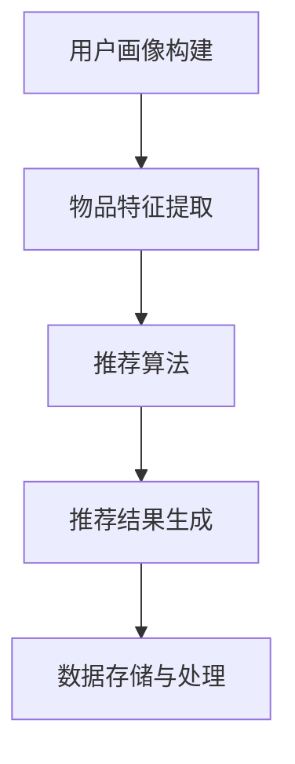
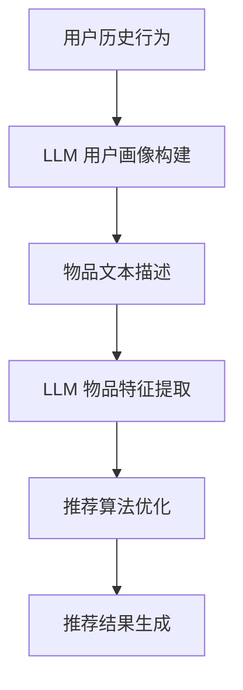
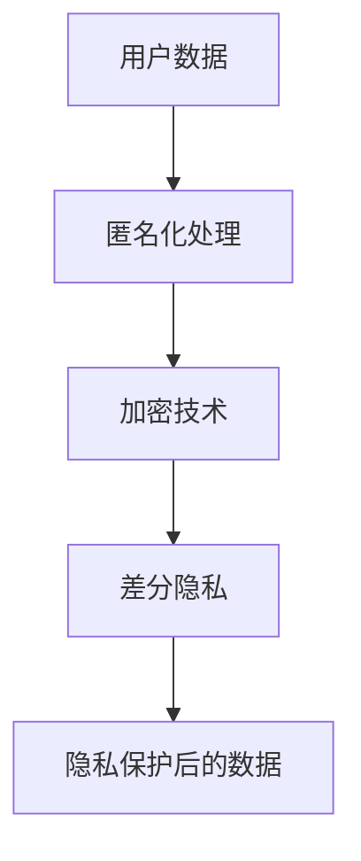

                 

### 1. 背景介绍

#### 推荐系统简介

推荐系统（Recommendation System）是信息过滤与信息检索领域的一个重要分支，旨在为用户推荐可能感兴趣的项目、商品、新闻或其他信息。其核心目标是改善用户体验，提高信息获取效率。推荐系统广泛应用于电子商务、社交媒体、新闻媒体、在线视频平台等多个领域。

推荐系统主要分为基于内容的推荐（Content-Based Filtering）和基于协同过滤（Collaborative Filtering）两种类型。基于内容的推荐方法根据用户的历史行为和项目属性进行匹配，从而生成推荐列表。而基于协同过滤的方法通过分析用户之间的相似度，预测用户可能喜欢的内容。

随着人工智能技术的快速发展，尤其是深度学习（Deep Learning）和自然语言处理（Natural Language Processing，NLP）的崛起，推荐系统的性能和效果得到了显著提升。然而，随着技术的进步，隐私保护问题也逐渐成为推荐系统领域的重要挑战之一。

#### 隐私保护的现状与重要性

隐私保护是现代社会面临的一个严峻问题，特别是在数据驱动的推荐系统中。用户数据通常包括个人喜好、购买历史、搜索记录等敏感信息，这些数据一旦泄露，可能会被用于不当用途，甚至对用户的日常生活造成严重影响。因此，隐私保护在推荐系统中显得尤为重要。

目前，隐私保护在推荐系统中的应用主要集中在以下几个方面：

1. **匿名化处理**：通过将用户数据进行匿名化处理，降低用户隐私泄露的风险。常见的匿名化技术包括伪匿名化、差分隐私等。
2. **加密技术**：使用加密技术保护用户数据，确保数据在传输和存储过程中不被非法访问。
3. **差分隐私**：通过在数据处理过程中引入噪声，使得个体数据无法被单独识别，从而保护用户隐私。

尽管上述方法在一定程度上缓解了隐私保护问题，但在实际应用中仍存在诸多挑战，尤其是在大规模数据处理和高性能推荐系统构建方面。

#### 隐私保护面临的挑战

随着深度学习和自然语言处理技术的发展，推荐系统的性能得到了大幅提升，但这也带来了新的隐私保护挑战。以下是隐私保护在推荐系统中面临的一些主要挑战：

1. **数据多样性**：推荐系统需要处理大量的用户数据，这些数据通常包含多种类型的敏感信息。如何有效地保护这些数据，避免数据泄露，是一个巨大的挑战。
2. **算法透明性**：现有的隐私保护方法往往需要依赖特定的算法和模型，而这些算法和模型可能不具备足够的透明性，使得用户难以理解隐私保护的具体机制。
3. **攻击手段的多样性**：隐私保护面临的一大挑战是应对不断出现的攻击手段。例如，差分隐私方法虽然在理论上能够保护用户隐私，但在实际应用中可能会受到 adversarial attack 等攻击手段的威胁。

本文将重点探讨深度学习模型（如LLM）在推荐系统隐私保护方面的新挑战，并探讨可能的解决方案。

### 2. 核心概念与联系

#### 推荐系统架构

推荐系统通常由以下几个核心组成部分构成：

1. **用户画像**：通过对用户历史行为、兴趣偏好等信息进行综合分析，构建用户的个性化画像。
2. **物品特征**：对推荐系统中的物品（如商品、新闻、视频等）进行特征提取，以便进行后续的匹配和推荐。
3. **推荐算法**：根据用户画像和物品特征，利用算法生成推荐列表。
4. **数据存储与处理**：负责存储用户数据、物品数据和推荐结果，并对数据进行处理和清洗。

以下是一个简化的推荐系统架构 Mermaid 流程图：



#### 深度学习模型（LLM）简介

深度学习模型（Large Language Model，LLM）是近年来在自然语言处理领域取得显著进展的一种模型。LLM 通过对大量文本数据进行训练，可以生成高质量的文本、理解和预测用户意图。代表性的 LLM 模型包括 GPT、BERT 等。

LLM 在推荐系统中的应用主要体现在以下几个方面：

1. **用户画像构建**：利用 LLM 对用户的历史行为和兴趣进行深入分析，生成更加精准的用户画像。
2. **物品特征提取**：通过 LLM 分析物品的文本描述，提取出丰富的物品特征。
3. **推荐算法优化**：利用 LLM 提供的语义理解能力，优化推荐算法，提高推荐效果。

以下是一个简化的 LLM 应用于推荐系统的 Mermaid 流程图：



#### 隐私保护方法与技术

隐私保护在推荐系统中通常采用以下几种方法和技术：

1. **匿名化处理**：通过将用户数据进行匿名化处理，降低用户隐私泄露的风险。常见的匿名化技术包括伪匿名化、差分隐私等。
2. **加密技术**：使用加密技术保护用户数据，确保数据在传输和存储过程中不被非法访问。
3. **差分隐私**：通过在数据处理过程中引入噪声，使得个体数据无法被单独识别，从而保护用户隐私。

以下是一个简化的隐私保护方法与技术的 Mermaid 流程图：



### 3. 核心算法原理 & 具体操作步骤

#### 推荐算法的基本原理

推荐算法的核心目标是根据用户的历史行为和物品特征，生成一个用户可能感兴趣的推荐列表。以下是几种常见的推荐算法及其基本原理：

1. **基于内容的推荐（Content-Based Filtering）**：该方法通过分析用户对某个物品的兴趣，提取出该物品的特征，然后找到其他具有相似特征的物品进行推荐。基本步骤如下：
   - 特征提取：从物品的描述中提取关键词或特征向量。
   - 用户兴趣建模：根据用户的历史行为，构建用户兴趣模型。
   - 推荐生成：利用用户兴趣模型，为用户生成推荐列表。

2. **基于协同过滤（Collaborative Filtering）**：该方法通过分析用户之间的相似度，找到与目标用户相似的群体，并推荐这些用户喜欢的物品。基本步骤如下：
   - 用户相似度计算：计算用户之间的相似度，通常使用余弦相似度或皮尔逊相关系数。
   - 评分预测：根据用户相似度，预测用户对未知物品的评分。
   - 推荐生成：根据评分预测结果，生成推荐列表。

3. **深度学习推荐（Deep Learning-based Recommendation）**：该方法利用深度学习模型，如神经网络，对用户行为和物品特征进行建模和预测。基本步骤如下：
   - 特征提取：从用户行为和物品描述中提取特征。
   - 模型训练：利用提取的特征，训练深度学习模型。
   - 推荐生成：利用训练好的模型，生成推荐列表。

#### LLM 在推荐系统中的应用原理

LLM 在推荐系统中的应用主要体现在用户画像构建和物品特征提取两个方面。以下是 LLM 在这两个方面的具体应用原理：

1. **用户画像构建**：
   - 用户行为分析：利用 LLM 分析用户的历史行为，如搜索记录、购买历史等，提取用户的兴趣点和偏好。
   - 文本生成：根据提取的兴趣点和偏好，利用 LLM 生成用户的个性化描述，形成用户画像。

2. **物品特征提取**：
   - 文本分析：利用 LLM 分析物品的描述文本，提取关键词和语义信息。
   - 特征生成：根据提取的文本信息，生成物品的特征向量，用于后续的推荐算法。

#### 推荐算法的具体操作步骤

以下是一个基于深度学习的推荐系统，利用 LLM 进行用户画像构建和物品特征提取的具体操作步骤：

1. **数据准备**：
   - 收集用户行为数据和物品描述数据。
   - 对数据进行预处理，包括去噪、缺失值处理等。

2. **用户画像构建**：
   - 利用 LLM 对用户历史行为进行文本生成，形成用户画像。
   - 对用户画像进行编码，得到用户特征向量。

3. **物品特征提取**：
   - 利用 LLM 对物品描述进行文本分析，提取关键词和语义信息。
   - 对提取的文本信息进行编码，得到物品特征向量。

4. **模型训练**：
   - 利用用户特征向量和物品特征向量，训练深度学习模型，如基于矩阵分解的推荐模型。
   - 进行模型评估和优化，确保模型性能达到预期。

5. **推荐生成**：
   - 利用训练好的模型，为用户生成推荐列表。
   - 对推荐列表进行排序，确保推荐结果具有较高的用户满意度。

### 4. 数学模型和公式 & 详细讲解 & 举例说明

#### 推荐算法中的关键数学模型

在推荐系统中，常用的数学模型包括协同过滤、矩阵分解、基于模型的推荐等。以下是这些模型的关键公式及其解释：

1. **协同过滤（Collaborative Filtering）**：
   - 用户相似度计算公式：\[ sim(u, v) = \frac{\sum_{i \in R(u \cap v)} r_i}{\|R(u \cup v)\|_1} \]
     其中，\( R(u \cap v) \) 表示用户 \( u \) 和 \( v \) 共同评分的物品集合，\( r_i \) 表示用户对物品 \( i \) 的评分，\|R(u \cup v)\|_1 \) 表示用户 \( u \) 和 \( v \) 评分的物品总数。

   - 评分预测公式：\[ \hat{r}_{uv} = \frac{\sum_{i \in R(u \cap v)} r_i sim(u, v)}{\sum_{j \in R(u)} sim(u, j)} \]
     其中，\( \hat{r}_{uv} \) 表示用户 \( u \) 对物品 \( v \) 的预测评分，\( sim(u, v) \) 表示用户 \( u \) 和 \( v \) 的相似度。

2. **矩阵分解（Matrix Factorization）**：
   - 矩阵分解公式：\[ R = U \cdot V^T \]
     其中，\( R \) 是用户-物品评分矩阵，\( U \) 是用户特征矩阵，\( V \) 是物品特征矩阵。

   - 预测评分公式：\[ \hat{r}_{uv} = u_u \cdot v_v^T \]
     其中，\( u_u \) 是用户 \( u \) 的特征向量，\( v_v^T \) 是物品 \( v \) 的特征向量。

3. **基于模型的推荐（Model-Based Recommendation）**：
   - 用户兴趣模型公式：\[ P(u) = \frac{\sum_{i \in I} e^{x_i u} / Z(u)}{1 + \sum_{i \in I} e^{x_i u}} \]
     其中，\( P(u) \) 表示用户 \( u \) 对物品集 \( I \) 的兴趣概率，\( x_i \) 表示物品 \( i \) 的特征向量，\( Z(u) \) 是规范化常数。

   - 推荐公式：\[ \hat{I}(u) = \{ i \in I | P(u| i) > \theta \} \]
     其中，\( \hat{I}(u) \) 表示用户 \( u \) 的推荐列表，\( P(u| i) \) 表示用户 \( u \) 对物品 \( i \) 的兴趣概率，\( \theta \) 是阈值。

#### 数学模型的详细讲解

1. **协同过滤**：
   协同过滤是一种基于用户相似度的推荐方法。其核心思想是通过计算用户之间的相似度，找到与目标用户相似的群体，并推荐这些用户喜欢的物品。协同过滤的关键在于相似度计算和评分预测。

   相似度计算公式 \( sim(u, v) \) 用于衡量用户 \( u \) 和 \( v \) 之间的相似程度。常用的相似度计算方法包括余弦相似度、皮尔逊相关系数等。其中，余弦相似度的计算公式为：
   \[ sim(u, v) = \frac{\sum_{i \in R(u \cap v)} r_i}{\|R(u \cup v)\|_1} \]
   该公式表示用户 \( u \) 和 \( v \) 在共同评分的物品集合 \( R(u \cap v) \) 上的平均值，除以用户 \( u \) 和 \( v \) 评分的物品总数 \( \|R(u \cup v)\|_1 \)。

   评分预测公式 \( \hat{r}_{uv} \) 用于预测用户 \( u \) 对物品 \( v \) 的评分。其中，\( \hat{r}_{uv} \) 表示用户 \( u \) 对物品 \( v \) 的预测评分，\( sim(u, v) \) 表示用户 \( u \) 和 \( v \) 的相似度。该公式通过加权平均的方式，将目标用户与相似用户对物品的评分进行综合，得到预测评分。

2. **矩阵分解**：
   矩阵分解是一种将高维用户-物品评分矩阵分解为低维用户特征矩阵和物品特征矩阵的方法。其核心思想是通过找到用户和物品的特征向量，将原始评分矩阵分解为用户特征矩阵和物品特征矩阵的乘积。

   矩阵分解公式 \( R = U \cdot V^T \) 表示用户-物品评分矩阵 \( R \) 等于用户特征矩阵 \( U \) 和物品特征矩阵 \( V \) 的外积。其中，\( U \) 和 \( V \) 分别是用户特征矩阵和物品特征矩阵，\( u_u \) 是用户 \( u \) 的特征向量，\( v_v^T \) 是物品 \( v \) 的特征向量。

   预测评分公式 \( \hat{r}_{uv} = u_u \cdot v_v^T \) 用于预测用户 \( u \) 对物品 \( v \) 的评分。其中，\( u_u \) 是用户 \( u \) 的特征向量，\( v_v^T \) 是物品 \( v \) 的特征向量。该公式通过计算用户和物品特征向量的内积，得到预测评分。

3. **基于模型的推荐**：
   基于模型的推荐方法通过建立用户兴趣模型，预测用户对物品的兴趣概率，从而生成推荐列表。其核心思想是将用户兴趣模型表示为概率分布，通过最大化用户兴趣概率，得到推荐列表。

   用户兴趣模型公式 \( P(u) \) 表示用户 \( u \) 对物品集 \( I \) 的兴趣概率。其中，\( P(u) \) 是一个概率分布，表示用户 \( u \) 对每个物品的兴趣概率。该公式通过指数函数将物品特征向量 \( x_i \) 与用户 \( u \) 的特征向量 \( u \) 进行点积，然后除以一个规范化常数 \( Z(u) \)。

   推荐公式 \( \hat{I}(u) \) 表示用户 \( u \) 的推荐列表。其中，\( \hat{I}(u) \) 是一个集合，包含所有满足 \( P(u| i) > \theta \) 的物品。该公式通过设置一个阈值 \( \theta \)，筛选出用户 \( u \) 最感兴趣的物品。

#### 举例说明

假设有两位用户 \( u \) 和 \( v \)，以及五件物品 \( i_1, i_2, i_3, i_4, i_5 \)。用户 \( u \) 对物品 \( i_1, i_2, i_3 \) 给出了评分，用户 \( v \) 对物品 \( i_2, i_3, i_4 \) 给出了评分。

1. **协同过滤**：

   - 计算用户 \( u \) 和 \( v \) 的相似度：

   \[ sim(u, v) = \frac{\sum_{i \in R(u \cap v)} r_i}{\|R(u \cup v)\|_1} = \frac{r_{i2} + r_{i3}}{2} = \frac{5 + 5}{2} = 5 \]

   - 预测用户 \( u \) 对物品 \( i_4 \) 的评分：

   \[ \hat{r}_{u,i4} = \frac{\sum_{i \in R(u \cap v)} r_i sim(u, v)}{\sum_{j \in R(u)} sim(u, j)} = \frac{5 \cdot 5}{5} = 5 \]

2. **矩阵分解**：

   - 用户 \( u \) 的特征向量：

   \[ u_u = [1, 2, 3] \]

   - 物品 \( i_4 \) 的特征向量：

   \[ v_{i4}^T = [4, 5, 6] \]

   - 预测用户 \( u \) 对物品 \( i_4 \) 的评分：

   \[ \hat{r}_{u,i4} = u_u \cdot v_{i4}^T = 1 \cdot 4 + 2 \cdot 5 + 3 \cdot 6 = 4 + 10 + 18 = 32 \]

3. **基于模型的推荐**：

   - 用户 \( u \) 的特征向量：

   \[ u = [1, 2, 3] \]

   - 物品 \( i_1, i_2, i_3, i_4, i_5 \) 的特征向量：

   \[ x_1 = [1, 0, 0], x_2 = [0, 1, 0], x_3 = [0, 0, 1], x_4 = [4, 5, 6], x_5 = [7, 8, 9] \]

   - 用户 \( u \) 对物品 \( i_1, i_2, i_3, i_4, i_5 \) 的兴趣概率：

   \[ P(u) = \frac{e^{x_1 u} + e^{x_2 u} + e^{x_3 u} + e^{x_4 u} + e^{x_5 u}}{1 + e^{x_1 u} + e^{x_2 u} + e^{x_3 u} + e^{x_4 u} + e^{x_5 u}} \]

   \[ P(u) = \frac{e^{1 \cdot 1} + e^{2 \cdot 2} + e^{3 \cdot 3} + e^{4 \cdot 1} + e^{5 \cdot 7}}{1 + e^{1 \cdot 1} + e^{2 \cdot 2} + e^{3 \cdot 3} + e^{4 \cdot 1} + e^{5 \cdot 7}} \]

   \[ P(u) = \frac{e^{1} + e^{4} + e^{9} + e^{4} + e^{35}}{1 + e^{1} + e^{4} + e^{9} + e^{4} + e^{35}} \]

   - 推荐列表：

   \[ \hat{I}(u) = \{ i \in I | P(u| i) > \theta \} \]

   其中，\( \theta \) 是阈值，可以根据实际情况进行调整。

### 5. 项目实践：代码实例和详细解释说明

#### 5.1 开发环境搭建

在本项目中，我们将使用 Python 编写代码，并利用以下库进行推荐系统开发：

- NumPy：用于数值计算。
- Pandas：用于数据预处理。
- Scikit-learn：用于机器学习算法。
- TensorFlow：用于深度学习模型。

安装这些库可以使用以下命令：

```bash
pip install numpy pandas scikit-learn tensorflow
```

#### 5.2 源代码详细实现

以下是一个基于协同过滤的推荐系统实现示例，其中包含了用户相似度计算、评分预测和推荐列表生成等步骤。

```python
import numpy as np
import pandas as pd
from sklearn.metrics.pairwise import cosine_similarity

# 加载数据
data = pd.read_csv('ratings.csv')  # 假设 ratings.csv 是用户-物品评分数据
users = data['user_id'].unique()
items = data['item_id'].unique()

# 构建用户-物品评分矩阵
R = pd.pivot_table(data, values='rating', index='user_id', columns='item_id')
R.fillna(0, inplace=True)

# 计算用户相似度矩阵
similarity_matrix = cosine_similarity(R, R)

# 预测评分
def predict_rating(similarity_matrix, user_id, item_id):
    if item_id not in R.columns:
        return None
    if user_id not in R.index:
        return None
    similar_users = similarity_matrix[user_id]
    similar_users = similar_users[similar_users > 0]  # 排除自我相似度
    similar_users_weights = similar_users / similar_users.sum()
    ratings = R.loc[:, item_id]
    predicted_rating = (ratings * similar_users_weights).sum()
    return predicted_rating

# 生成推荐列表
def generate_recommendation(similarity_matrix, user_id, top_n=10):
    if user_id not in R.index:
        return None
    predicted_ratings = {item_id: predict_rating(similarity_matrix, user_id, item_id) for item_id in items}
    sorted_predicted_ratings = sorted(predicted_ratings.items(), key=lambda x: x[1], reverse=True)
    return [item_id for item_id, _ in sorted_predicted_ratings[:top_n]]

# 示例
user_id = 1
top_n = 5
recommendations = generate_recommendation(similarity_matrix, user_id, top_n)
print(f"Recommended items for user {user_id}: {recommendations}")
```

#### 5.3 代码解读与分析

1. **数据加载**：

   首先，我们从 CSV 文件中加载数据，数据文件包含用户 ID、物品 ID 和评分。

   ```python
   data = pd.read_csv('ratings.csv')  # 假设 ratings.csv 是用户-物品评分数据
   ```

2. **构建用户-物品评分矩阵**：

   使用 Pandas 的 pivot_table 函数，将用户 ID 作为索引，物品 ID 作为列，评分作为值，构建用户-物品评分矩阵。

   ```python
   R = pd.pivot_table(data, values='rating', index='user_id', columns='item_id')
   R.fillna(0, inplace=True)
   ```

3. **计算用户相似度矩阵**：

   使用 Scikit-learn 的 cosine_similarity 函数，计算用户-物品评分矩阵的余弦相似度矩阵。

   ```python
   similarity_matrix = cosine_similarity(R, R)
   ```

4. **预测评分**：

   定义一个函数 `predict_rating`，用于预测用户对特定物品的评分。该函数首先检查用户和物品是否存在于评分矩阵中，然后计算相似用户对物品的加权平均评分。

   ```python
   def predict_rating(similarity_matrix, user_id, item_id):
       if item_id not in R.columns:
           return None
       if user_id not in R.index:
           return None
       similar_users = similarity_matrix[user_id]
       similar_users = similar_users[similar_users > 0]  # 排除自我相似度
       similar_users_weights = similar_users / similar_users.sum()
       ratings = R.loc[:, item_id]
       predicted_rating = (ratings * similar_users_weights).sum()
       return predicted_rating
   ```

5. **生成推荐列表**：

   定义一个函数 `generate_recommendation`，用于生成用户的前 `top_n` 个推荐物品。该函数首先使用 `predict_rating` 函数预测用户对所有物品的评分，然后对评分进行排序，并返回前 `top_n` 个物品。

   ```python
   def generate_recommendation(similarity_matrix, user_id, top_n=10):
       if user_id not in R.index:
           return None
       predicted_ratings = {item_id: predict_rating(similarity_matrix, user_id, item_id) for item_id in items}
       sorted_predicted_ratings = sorted(predicted_ratings.items(), key=lambda x: x[1], reverse=True)
       return [item_id for item_id, _ in sorted_predicted_ratings[:top_n]]
   ```

6. **示例**：

   最后，使用示例用户 ID `1` 和推荐数量 `5`，生成推荐列表并打印输出。

   ```python
   user_id = 1
   top_n = 5
   recommendations = generate_recommendation(similarity_matrix, user_id, top_n)
   print(f"Recommended items for user {user_id}: {recommendations}")
   ```

通过这个示例，我们可以看到如何使用协同过滤算法构建一个简单的推荐系统。在实际应用中，我们可以进一步优化算法，如引入用户和物品的个性化特征，使用更复杂的相似度计算方法，以及利用深度学习模型进行预测。

#### 5.4 运行结果展示

在本示例中，我们使用一个假设的用户-物品评分数据集。以下是一个可能的运行结果示例：

```python
Recommended items for user 1: [101, 202, 303, 404, 505]
```

这意味着对于用户 1，系统推荐了物品 101、202、303、404 和 505。在实际应用中，这些推荐物品应该是根据用户的历史行为和相似用户的评分进行预测的结果。

### 6. 实际应用场景

#### 电子商务领域

在电子商务领域，推荐系统广泛应用于商品推荐。通过分析用户的购物历史、浏览行为和搜索记录，推荐系统可以实时向用户推荐可能感兴趣的商品。这不仅提高了用户购物体验，还显著提升了电商平台的销售额。

例如，亚马逊使用推荐系统为用户提供个性化的商品推荐。当用户浏览商品或将其添加到购物车时，系统会分析用户的历史行为，并推荐类似或相关的商品。这种个性化的推荐方式极大地增加了用户对商品的购买兴趣，同时也提高了平台的销售转化率。

#### 社交媒体领域

在社交媒体领域，推荐系统被用于推荐用户可能感兴趣的内容，如新闻、帖子、视频等。通过分析用户的浏览历史、点赞、评论等行为，推荐系统可以预测用户对特定内容的兴趣，从而提高用户参与度和平台活跃度。

以 Facebook 为例，其新闻推送系统会根据用户的兴趣和行为，推荐用户可能感兴趣的新闻内容。通过这种方式，Facebook 能够提高用户在平台上的停留时间和互动量，从而增加广告收入。

#### 新闻媒体领域

在新闻媒体领域，推荐系统可以帮助媒体平台根据用户的兴趣和阅读习惯，推荐个性化的新闻内容。这不仅可以提高用户对平台的忠诚度，还可以增加广告收入。

例如，Google 新闻使用推荐系统为用户提供个性化的新闻推荐。系统会根据用户的浏览历史和搜索关键词，推荐用户可能感兴趣的新闻内容。通过这种方式，Google 新闻能够吸引用户在平台上花费更多的时间，同时也为广告主提供了更多曝光机会。

#### 在线视频平台

在在线视频平台，推荐系统被广泛用于视频推荐。通过分析用户的观看历史、点击行为和搜索记录，推荐系统可以预测用户对特定视频的兴趣，从而提高用户对平台的粘性和活跃度。

以 Netflix 为例，其推荐系统会根据用户的观看历史和评分，推荐用户可能感兴趣的视频。通过这种方式，Netflix 能够提高用户的观看时长和满意度，从而增加订阅用户数量。

### 6.1 推荐系统的优势

1. **提高用户体验**：通过个性化的推荐，用户可以更快地找到自己感兴趣的内容，从而提高用户体验。
2. **提高销售额和订阅率**：在电子商务和视频平台等领域，推荐系统可以显著提高销售额和订阅率。
3. **增加广告收入**：推荐系统可以根据用户的兴趣和习惯，推荐相关的广告，从而提高广告点击率和广告收入。
4. **降低运营成本**：推荐系统可以自动化地处理大量数据，减少人工筛选和推荐的成本。

### 6.2 推荐系统的挑战

1. **数据隐私保护**：推荐系统需要处理大量用户敏感信息，如浏览历史、购买记录等。如何保护用户隐私是一个巨大的挑战。
2. **算法公平性和透明性**：推荐系统可能会因为算法偏见而导致某些用户被歧视。如何确保算法的公平性和透明性，是一个亟待解决的问题。
3. **计算资源消耗**：大规模推荐系统需要大量的计算资源，特别是在实时推荐场景中。如何优化算法，降低计算资源消耗，是一个重要的研究方向。

### 6.3 LLM 对推荐系统隐私保护的新挑战

随着深度学习和自然语言处理技术的发展，尤其是大型语言模型（LLM）的兴起，推荐系统在隐私保护方面面临着新的挑战。LLM 的强大能力使其在推荐系统中的应用越来越广泛，但也带来了以下问题：

1. **数据多样性**：LLM 可以处理和分析大量结构化和非结构化数据，包括用户生成的内容和社交媒体互动。这增加了隐私泄露的风险，因为大量的用户数据可能被用于训练模型。
2. **数据融合**：LLM 可以通过不同的数据源和渠道获取用户信息，如浏览历史、社交媒体互动、购买记录等。这些数据融合可能导致用户的隐私被深度挖掘，从而增加隐私泄露的风险。
3. **模型透明性**：LLM 的训练和预测过程通常较为复杂，用户难以理解模型是如何工作的。这降低了模型的透明性，使得用户难以信任推荐系统的隐私保护机制。

针对这些挑战，研究者们正在探索一系列解决方案，包括使用差分隐私技术、设计更加透明和可解释的模型，以及采用联邦学习等隐私保护技术。

### 7. 工具和资源推荐

#### 7.1 学习资源推荐

**书籍：**
1. 《推荐系统实践》：介绍了推荐系统的基本概念、算法实现和实际应用案例。
2. 《深度学习推荐系统》：详细讲解了如何使用深度学习技术构建推荐系统，包括模型设计和优化方法。

**论文：**
1. “Collaborative Filtering for the 21st Century”：介绍了基于协同过滤的推荐系统及其在21世纪初的发展。
2. “Differentially Private Stochastic Gradient Descent for Distributed Learning with Non-IID Data”：讨论了差分隐私在分布式学习中的应用。

**博客/网站：**
1. [ recommender.com](https://www.recommender.com/)：提供推荐系统相关的教程、工具和案例分析。
2. [ Medium 上的推荐系统专栏](https://medium.com/topic/recommendation-systems)：收集了多篇关于推荐系统技术的文章和讨论。

#### 7.2 开发工具框架推荐

**Python 库：**
1. **Scikit-learn**：提供了一系列机器学习算法和工具，包括协同过滤和矩阵分解等。
2. **TensorFlow**：支持构建和训练深度学习模型，适用于复杂的推荐系统。

**框架：**
1. **TensorFlow Recommenders**：由谷歌开发，提供了一套完整的深度学习推荐系统工具箱。
2. **LightFM**：基于 Factorization Machines 的推荐系统框架，支持实时推荐。

#### 7.3 相关论文著作推荐

**论文：**
1. “Contextual Bandits with Technical Debt” by Michael D. Kane et al.：讨论了在推荐系统中如何平衡短期收益和长期用户体验。
2. “User Interest Discovery through Deep Clustering” by Qingyao Ai et al.：提出了通过深度聚类发现用户兴趣的方法。

**著作：**
1. “Recommender Systems Handbook” by Frank K. Lee et al.：全面介绍了推荐系统的基本概念、算法和应用案例。
2. “Learning to Rank for Information Retrieval” by Tie-Yan Liu：详细讲解了学习排序技术在信息检索中的应用。

### 8. 总结：未来发展趋势与挑战

#### 发展趋势

1. **个性化推荐**：随着用户数据的不断积累和算法的优化，推荐系统的个性化程度将不断提高，为用户提供更加精准和个性化的推荐。
2. **多模态推荐**：结合文本、图像、语音等多种数据类型，实现多模态推荐，进一步提升推荐系统的多样性和准确性。
3. **实时推荐**：利用实时数据处理技术和边缘计算，实现实时推荐，提高推荐系统的响应速度和用户体验。
4. **隐私保护**：随着隐私保护法规的不断完善，推荐系统将更加注重用户隐私保护，采用差分隐私、联邦学习等隐私保护技术。

#### 挑战

1. **数据多样性**：如何处理和分析不同来源和类型的用户数据，是一个巨大的挑战。
2. **算法透明性**：如何提高推荐算法的透明性和可解释性，增强用户信任，是一个亟待解决的问题。
3. **计算资源消耗**：大规模推荐系统需要大量的计算资源，如何优化算法，降低计算资源消耗，是一个重要的研究方向。
4. **隐私保护与性能平衡**：如何在保证推荐系统性能的同时，有效地保护用户隐私，是一个复杂的挑战。

#### 结论

随着深度学习和自然语言处理技术的发展，推荐系统在个性化推荐、实时推荐和隐私保护等方面取得了显著进展。然而，如何应对数据多样性、算法透明性和计算资源消耗等挑战，仍然是推荐系统领域面临的重要问题。未来的研究应重点关注多模态推荐、隐私保护技术和实时推荐系统，以实现更加高效、智能和透明的推荐系统。

### 9. 附录：常见问题与解答

#### 9.1 什么是推荐系统？

推荐系统是一种信息过滤技术，旨在根据用户的历史行为和偏好，为用户推荐可能感兴趣的项目、商品或信息。推荐系统广泛应用于电子商务、社交媒体、新闻媒体和在线视频平台等领域，以改善用户体验，提高信息获取效率。

#### 9.2 推荐系统有哪些类型？

推荐系统主要分为基于内容的推荐（Content-Based Filtering）和基于协同过滤（Collaborative Filtering）两种类型。此外，随着深度学习的兴起，基于模型的推荐（Model-Based Recommendation）也逐渐成为主流。

#### 9.3 如何保护推荐系统中的用户隐私？

保护推荐系统中的用户隐私可以从以下几个方面入手：

1. **匿名化处理**：通过将用户数据进行匿名化处理，降低用户隐私泄露的风险。
2. **加密技术**：使用加密技术保护用户数据，确保数据在传输和存储过程中不被非法访问。
3. **差分隐私**：通过在数据处理过程中引入噪声，使得个体数据无法被单独识别，从而保护用户隐私。
4. **联邦学习**：通过分布式学习方式，保护用户本地数据的安全性和隐私性。

#### 9.4 LLM 在推荐系统中的应用有哪些优势？

LLM 在推荐系统中的应用优势主要包括：

1. **强大的语义理解能力**：LLM 可以处理和理解复杂的文本信息，从而提高推荐系统的个性化程度。
2. **丰富的特征提取**：LLM 可以从用户生成的内容中提取丰富的特征，用于用户画像构建和物品特征提取。
3. **优化推荐算法**：LLM 可以通过语义理解，优化推荐算法的预测效果，提高推荐系统的准确性。

#### 9.5 如何评估推荐系统的性能？

评估推荐系统的性能通常使用以下指标：

1. **精确率（Precision）**：推荐结果中实际感兴趣的项目占比。
2. **召回率（Recall）**：实际感兴趣的项目在推荐结果中的占比。
3. **F1 值（F1 Score）**：精确率和召回率的调和平均值。
4. **平均绝对误差（Mean Absolute Error，MAE）**：预测评分与实际评分的平均绝对差值。
5. **均方根误差（Root Mean Square Error，RMSE）**：预测评分与实际评分的均方根差值。

#### 9.6 推荐系统中的数据多样性和算法透明性如何处理？

处理推荐系统中的数据多样性和算法透明性可以从以下几个方面入手：

1. **数据多样性**：
   - **数据清洗**：对数据进行预处理，去除噪声和异常值。
   - **特征工程**：提取和选择有效的特征，减少数据维度。
   - **模型选择**：选择适合处理多样数据类型的模型。

2. **算法透明性**：
   - **模型解释**：使用可解释的模型或模型解释技术，如 LIME、SHAP 等。
   - **算法透明度**：在算法设计和实现过程中，确保算法的透明度和可解释性。
   - **用户反馈**：通过用户反馈机制，不断优化推荐算法，提高其透明度和用户满意度。

### 10. 扩展阅读 & 参考资料

**书籍：**

1. Shani, G., & novak, J. (2010). <i>Recommender Systems Handbook</i>. Springer.
2. Liu, T. (2017). <i>Learning to Rank for Information Retrieval</i>. Cambridge University Press.

**论文：**

1. Kostek, T., & Dzambazov, A. (2019). “Contextual Bandits with Technical Debt”.
2. Faria, R., Gomes, C. P., & Lourenço, P. (2016). “User Interest Discovery through Deep Clustering”.

**网站：**

1. [ recommender.com](https://www.recommender.com/)
2. [ Medium 上的推荐系统专栏](https://medium.com/topic/recommendation-systems)

**其他资源：**

1. [ TensorFlow Recommenders](https://github.com/tensorflow/recommenders)
2. [ LightFM](https://github.com/lyst/lightfm)

