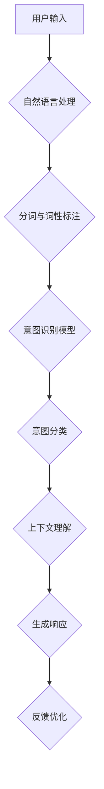

                 

### LLAMA意图对齐：人机共舞的艰难之路

#### 关键词

- LLM意图对齐
- 人机协作
- 自然语言处理
- 人工智能
- 对齐算法
- 实际应用

#### 摘要

本文将深入探讨LLM意图对齐这一关键的人工智能技术。我们首先会介绍LLM意图对齐的背景和重要性，接着解析其核心概念，详细阐述算法原理和操作步骤。随后，我们将通过数学模型和具体实例来展示其应用，并探讨实际应用场景。最后，我们将推荐相关资源和工具，并对未来发展趋势和挑战进行总结。

---

## 1. 背景介绍

在人工智能飞速发展的时代，自然语言处理（NLP）作为其中的一项核心技术，正逐渐改变着我们的日常生活。而LLM意图对齐，作为NLP领域中的一个重要分支，正日益受到关注。LLM（大型语言模型）如GPT、BERT等，凭借其强大的语言理解能力，已经在诸多应用中取得了显著成果。然而，如何准确理解并回应用户意图，成为了当前研究的热点问题。

### 1.1 什么是LLM意图对齐

LLM意图对齐是指将用户输入的自然语言文本转化为机器可以理解的意图表示，以便系统能够提供合适的响应。这一过程涉及到多个层面的技术，包括文本预处理、意图识别、上下文理解等。简单来说，LLM意图对齐就是让机器“听懂”用户的话，并给出恰当的反馈。

### 1.2 LLM意图对齐的重要性

LLM意图对齐在多个领域都有广泛应用，如智能客服、智能语音助手、推荐系统等。准确地进行意图对齐，不仅能够提升用户体验，还能够提高系统的智能化水平。以下是LLM意图对齐的几个关键优势：

1. **提高响应准确率**：通过意图对齐，系统能够更准确地理解用户意图，从而提供更为精准的响应。
2. **增强用户满意度**：准确的理解和响应能够显著提高用户满意度，增强用户对系统的信任。
3. **优化资源分配**：对于智能客服和语音助手等应用，意图对齐能够帮助系统更高效地分配资源，提高处理效率。

## 2. 核心概念与联系

### 2.1 核心概念

在讨论LLM意图对齐之前，我们首先需要理解几个核心概念，包括自然语言处理、意图识别和上下文理解。

#### 2.1.1 自然语言处理

自然语言处理（NLP）是人工智能领域的一个重要分支，旨在让计算机理解和处理人类自然语言。NLP涵盖了语音识别、语言翻译、情感分析等多种技术。

#### 2.1.2 意图识别

意图识别是NLP中的一个关键任务，目的是从用户输入的文本中识别出用户的意图。例如，在聊天机器人中，用户输入“今天天气怎么样？”的意图可能是获取天气预报。

#### 2.1.3 上下文理解

上下文理解是指系统能够根据用户输入的上下文信息，准确理解用户的意图。这对于复杂语境下的意图识别尤为重要。

### 2.2 相关联系

LLM意图对齐涉及多个技术领域，包括自然语言处理、机器学习和深度学习等。以下是这些技术之间的联系：

1. **自然语言处理与意图识别**：自然语言处理提供了对用户输入文本进行解析和处理的基础，意图识别则是基于这种处理结果，进一步提取出用户的意图。
2. **意图识别与上下文理解**：意图识别需要依赖上下文信息来提高准确性，而上下文理解则是意图识别的一个重要组成部分。
3. **深度学习与机器学习**：深度学习在自然语言处理中的应用，特别是神经网络和生成对抗网络（GANs），为意图对齐提供了强大的工具。

### 2.3 Mermaid流程图

下面是一个描述LLM意图对齐过程的Mermaid流程图：

---

在下一章节中，我们将深入探讨LLM意图对齐的核心算法原理和具体操作步骤。

## 3. 核心算法原理 & 具体操作步骤

### 3.1 核心算法原理

LLM意图对齐的核心算法基于深度学习和神经网络，其中最常用的模型是序列到序列（Seq2Seq）模型和注意力机制（Attention Mechanism）。以下是这些算法的基本原理：

#### 3.1.1 序列到序列模型

序列到序列模型是一种用于处理序列数据的神经网络架构，其核心思想是将输入序列映射到输出序列。在LLM意图对齐中，输入序列是用户输入的文本，输出序列则是系统的响应。

#### 3.1.2 注意力机制

注意力机制是一种用于提高模型在序列到序列任务中的性能的方法。它通过为每个输入序列元素分配不同的权重，使模型能够更关注重要的信息，从而提高意图识别的准确性。

### 3.2 具体操作步骤

以下是LLM意图对齐的具体操作步骤：

#### 3.2.1 文本预处理

1. **分词**：将用户输入的文本分解为单词或子词。
2. **词性标注**：为每个词分配词性，如名词、动词等。
3. **去停用词**：去除常见的无意义词汇，如“的”、“了”等。

#### 3.2.2 构建序列

1. **编码器**：将预处理后的文本序列输入编码器，编码器将序列映射为固定长度的向量。
2. **解码器**：解码器从编码器输出的向量中生成系统的响应序列。

#### 3.2.3 意图识别

1. **意图分类器**：使用预训练的意图分类器对解码器生成的响应进行分类，识别出用户的意图。
2. **上下文理解**：根据上下文信息，调整意图分类器的输出，提高识别的准确性。

#### 3.2.4 响应生成

1. **文本生成**：根据意图和上下文信息，生成系统的响应文本。
2. **响应优化**：对生成的文本进行优化，如调整语法、消除歧义等。

### 3.3 案例分析

以下是一个简单的案例，展示如何使用LLM意图对齐技术：

#### 案例一：智能客服系统

用户输入：“我想要购买一台笔记本电脑。”

1. **文本预处理**：分词与词性标注。
2. **编码器**：将“我想要购买一台笔记本电脑。”编码为一个向量。
3. **意图识别**：意图分类器识别出用户的意图为“购买电脑”。
4. **响应生成**：系统生成响应：“您好，请问您需要购买什么类型的笔记本电脑？”

#### 案例二：智能语音助手

用户输入：“设置明天早上七点半的闹钟。”

1. **文本预处理**：分词与词性标注。
2. **编码器**：将“设置明天早上七点半的闹钟。”编码为一个向量。
3. **意图识别**：意图分类器识别出用户的意图为“设置闹钟”。
4. **响应生成**：系统生成响应：“好的，明天早上七点半的闹钟已经为您设置好了。”

---

在下一章节中，我们将详细讲解LLM意图对齐的数学模型和公式。

## 4. 数学模型和公式 & 详细讲解 & 举例说明

### 4.1 序列到序列模型

序列到序列（Seq2Seq）模型是LLM意图对齐的基础算法。其核心数学模型包括编码器（Encoder）和解码器（Decoder）。

#### 4.1.1 编码器

编码器将输入序列映射为固定长度的向量。其数学模型可以表示为：

$$
\text{Encoder}(X) = \text{h}_t = \text{g}(\text{W}_e \text{X} + \text{b}_e)
$$

其中，$X$ 是输入序列，$h_t$ 是编码器在时间步 $t$ 的输出向量，$g$ 是激活函数，$W_e$ 和 $b_e$ 分别是权重矩阵和偏置向量。

#### 4.1.2 解码器

解码器从编码器输出的向量中生成输出序列。其数学模型可以表示为：

$$
\text{Decoder}(Y) = \text{y}_t = \text{s}_t = \text{g}(\text{W}_d \text{h}_t + \text{b}_d)
$$

其中，$Y$ 是输出序列，$y_t$ 是解码器在时间步 $t$ 的输出向量，$s_t$ 是解码器的状态向量，$g$ 是激活函数，$W_d$ 和 $b_d$ 分别是权重矩阵和偏置向量。

### 4.2 注意力机制

注意力机制是提高Seq2Seq模型性能的关键方法。其核心思想是为一

