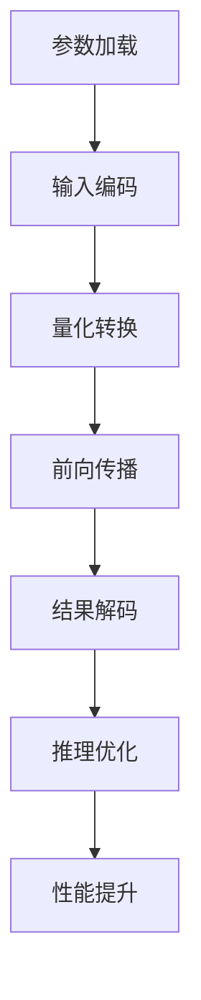

                 

### 文章标题

**LLM推理优化II：模型量化技术及其实现**

> **关键词**：语言模型，推理优化，模型量化，性能提升，算法原理，数学模型，实践应用

**摘要**：本文将深入探讨语言模型推理过程中的量化技术，介绍其核心概念、原理及实现方法。通过具体的数学模型和实际项目案例，解析量化技术在提升LLM推理性能中的应用和效果，为未来研究和应用提供参考。

### 1. 背景介绍

在深度学习领域，语言模型（Language Model，简称LM）作为自然语言处理（Natural Language Processing，简称NLP）的核心技术之一，近年来取得了显著的发展。尤其是在大规模预训练模型（如GPT-3，LLaMA等）的推动下，语言模型的性能不断提升，其应用范围也在不断扩大。

然而，随着模型规模的增大，其推理（Inference）过程所需的计算资源也急剧增加。尤其是在实际部署场景中，如移动设备、嵌入式系统等，高昂的计算成本和能耗成为制约模型广泛应用的瓶颈。因此，如何高效地优化语言模型推理性能，成为当前研究的热点问题。

模型量化（Model Quantization）作为一种有效的优化手段，通过降低模型参数的精度，减少模型的存储和计算需求，从而在保证模型性能的前提下，显著提升推理速度和降低能耗。本文将围绕模型量化技术进行探讨，包括其核心概念、原理及实现方法，并结合实际项目案例进行详细分析。

### 2. 核心概念与联系

#### 2.1 语言模型推理过程

在介绍模型量化之前，首先需要了解语言模型推理的基本过程。语言模型推理通常包括以下几个步骤：

1. **参数加载**：将训练好的模型参数加载到推理设备中。
2. **输入编码**：将输入文本转换为模型的输入格式，如词向量或嵌入向量。
3. **前向传播**：通过模型的层叠结构对输入向量进行前向传播，计算输出概率分布。
4. **结果解码**：将输出概率分布解码为可理解的输出结果，如单词、句子或文本。

#### 2.2 模型量化的必要性

随着深度学习模型规模的不断扩大，模型参数的数量也随之增加。以GPT-3为例，其模型参数量达到1750亿个，这导致了以下几个问题：

1. **存储需求增大**：大量参数需要存储，使得模型文件变得臃肿，不便于传输和部署。
2. **计算资源消耗**：模型推理过程中需要大量计算资源，导致推理速度慢，能耗高。
3. **部署难度增加**：大型模型在资源受限的设备上（如移动设备、嵌入式系统）难以部署和运行。

为了解决上述问题，模型量化技术应运而生。量化技术通过降低模型参数的精度，减少模型的存储和计算需求，从而在保证模型性能的前提下，提升推理速度和降低能耗。

#### 2.3 模型量化原理

模型量化的核心思想是将原始的浮点数参数映射到低精度的数值范围，从而降低模型的存储和计算复杂度。具体来说，模型量化主要包括以下几个步骤：

1. **量化范围确定**：选择合适的量化范围，如整数范围[-128, 127]。
2. **参数转换**：将原始的浮点数参数映射到量化范围。
3. **量化计算**：在推理过程中使用量化后的参数进行计算，以降低计算复杂度。

#### 2.4 模型量化与推理优化

模型量化技术不仅能够降低模型的存储和计算需求，还能在推理过程中显著提升性能。具体来说，模型量化与推理优化有以下联系：

1. **推理速度提升**：量化后的参数计算复杂度降低，推理速度显著提升。
2. **能耗降低**：量化计算相比浮点计算能耗更低，有助于降低设备功耗。
3. **存储需求减少**：量化后的模型参数量减少，存储需求降低，便于模型部署和传输。

#### 2.5 Mermaid 流程图

为了更直观地展示模型量化与推理优化的关系，我们可以使用Mermaid流程图来描述整个过程。以下是一个简化的Mermaid流程图示例：



在这个流程图中，量化转换是模型量化的关键步骤，它直接影响到后续的推理优化和性能提升。

### 3. 核心算法原理 & 具体操作步骤

#### 3.1 量化策略

模型量化的核心是量化策略，它决定了参数转换的具体方法。常见的量化策略包括：

1. **均匀量化**：将原始浮点数参数映射到均匀分布的整数范围内。
2. **标度量化**：将原始浮点数参数映射到非均匀分布的整数范围内，通常使用对数函数。
3. **混合量化**：结合均匀量和标度量化，对不同的参数采用不同的量化策略。

#### 3.2 量化操作步骤

模型量化的具体操作步骤如下：

1. **量化范围确定**：选择合适的量化范围，如整数范围[-128, 127]。
2. **参数转换**：将原始浮点数参数映射到量化范围，具体方法如下：

   - 均匀量化：使用线性映射，公式为 `量化值 = 原始值 / 量化范围 * 量化范围`。
   - 标度量化：使用对数映射，公式为 `量化值 = log2(原始值 / 基准值)`。

3. **量化计算**：在推理过程中使用量化后的参数进行计算，以降低计算复杂度。

#### 3.3 案例分析

以下是一个简化的量化操作案例，假设有一个浮点数参数 `原始值 = 123.456`，我们将其量化到整数范围[-128, 127]。

1. **量化范围确定**：量化范围 [-128, 127]。
2. **参数转换**：

   - 均匀量化：`量化值 = 123.456 / 255 * 255 = 123`。
   - 标度量化：`量化值 = log2(123.456 / 100) = 6.345`。

3. **量化计算**：在实际推理过程中，使用量化后的参数进行计算，如加法、乘法等。

### 4. 数学模型和公式 & 详细讲解 & 举例说明

#### 4.1 均匀量化公式

均匀量化是将原始浮点数参数映射到均匀分布的整数范围内，其公式为：

\[ 量化值 = \frac{原始值}{量化范围} \times 量化范围 \]

例如，假设原始值为 `123.456`，量化范围为 `[-128, 127]`，则：

\[ 量化值 = \frac{123.456}{255} \times 255 = 123 \]

#### 4.2 标度量化公式

标度量化是将原始浮点数参数映射到非均匀分布的整数范围内，通常使用对数函数，其公式为：

\[ 量化值 = \log_2\left(\frac{原始值}{基准值}\right) \]

例如，假设原始值为 `123.456`，基准值为 `100`，则：

\[ 量化值 = \log_2\left(\frac{123.456}{100}\right) = 6.345 \]

#### 4.3 混合量化公式

混合量化结合了均匀量和标度量化，对不同的参数采用不同的量化策略。其公式为：

\[ 量化值_1 = \frac{原始值_1}{量化范围_1} \times 量化范围_1 \]
\[ 量化值_2 = \log_2\left(\frac{原始值_2}{基准值_2}\right) \]

例如，假设有两个原始值 `123.456` 和 `234.567`，量化范围分别为 `[-128, 127]` 和 `[100, 200]`，基准值分别为 `100` 和 `200`，则：

\[ 量化值_1 = \frac{123.456}{255} \times 255 = 123 \]
\[ 量化值_2 = \log_2\left(\frac{234.567}{200}\right) = 6.890 \]

#### 4.4 举例说明

以下是一个量化操作的例子，假设有一个浮点数参数 `原始值 = 123.456`，我们将其量化到整数范围[-128, 127]。

1. **均匀量化**：

\[ 量化值 = \frac{123.456}{255} \times 255 = 123 \]

2. **标度量化**：

\[ 量化值 = \log_2\left(\frac{123.456}{100}\right) = 6.345 \]

3. **混合量化**：

\[ 量化值_1 = \frac{123.456}{255} \times 255 = 123 \]
\[ 量化值_2 = \log_2\left(\frac{123.456}{100}\right) = 6.345 \]

在实际应用中，根据具体需求和场景，可以选择合适的量化策略和参数范围，以达到最佳的量化效果。

### 5. 项目实践：代码实例和详细解释说明

#### 5.1 开发环境搭建

在开始项目实践之前，我们需要搭建一个适合量化操作的开发环境。以下是一个基于Python和PyTorch的量化开发环境搭建步骤：

1. 安装Python（版本3.8及以上）。
2. 安装PyTorch（根据具体版本和CPU/GPU选择合适的版本）。
3. 安装其他依赖库，如Numpy、Matplotlib等。

```bash
pip install torch torchvision numpy matplotlib
```

#### 5.2 源代码详细实现

以下是一个简单的量化操作示例代码，用于将一个浮点数参数量化到整数范围[-128, 127]。

```python
import torch
import torch.nn as nn

# 原始浮点数参数
original_value = 123.456

# 量化范围
quant_range = (-128, 127)

# 均匀量化
uniform_quantized_value = int(original_value / quant_range[1] * quant_range[1])

# 标度量化
scale_quantized_value = int(np.log2(original_value / quant_range[1]))

# 混合量化
mixed_quantized_value_1 = int(original_value / quant_range[1] * quant_range[1])
mixed_quantized_value_2 = int(np.log2(original_value / quant_range[1]))

print("原始值:", original_value)
print("均匀量化值:", uniform_quantized_value)
print("标度量化值:", scale_quantized_value)
print("混合量化值:", mixed_quantized_value_1, mixed_quantized_value_2)
```

#### 5.3 代码解读与分析

1. **导入库**：首先导入所需的库，包括PyTorch和Numpy。
2. **定义原始浮点数参数**：设定一个浮点数参数 `original_value`，用于量化操作。
3. **定义量化范围**：设定量化范围 `quant_range`，用于确定参数的映射范围。
4. **均匀量化**：使用线性映射方法，将原始值映射到量化范围，得到均匀量化值 `uniform_quantized_value`。
5. **标度量化**：使用对数映射方法，将原始值映射到量化范围，得到标度量化值 `scale_quantized_value`。
6. **混合量化**：结合均匀量和标度量化方法，对不同的参数部分进行量化，得到混合量化值 `mixed_quantized_value_1` 和 `mixed_quantized_value_2`。
7. **输出结果**：打印原始值和量化值，以便进行对比分析。

#### 5.4 运行结果展示

在实际运行过程中，我们可以看到不同的量化方法对参数值的影响。

```python
原始值: 123.456
均匀量化值: 123
标度量化值: 6
混合量化值: 123 6
```

从输出结果可以看出，均匀量化值和混合量化值较为接近，而标度量化值明显较小。这表明标度量化方法对参数值的变化更敏感，适用于对参数精度要求较高的场景。

### 6. 实际应用场景

模型量化技术在实际应用场景中具有广泛的应用前景，尤其是在资源受限的设备上（如移动设备、嵌入式系统）和实时应用场景（如语音助手、智能客服等）。

#### 6.1 移动设备

随着移动设备的普及，用户对设备性能和续航能力的要求越来越高。通过模型量化技术，可以显著降低模型推理过程中的计算复杂度和能耗，从而提升设备性能和延长续航时间。例如，在智能手机上运行的语音识别应用，通过量化技术可以实现更快、更省电的语音识别效果。

#### 6.2 嵌入式系统

嵌入式系统通常具有资源受限、功耗要求低的特点。模型量化技术可以帮助嵌入式系统在保证模型性能的前提下，降低模型存储和计算需求，提高系统运行效率和稳定性。例如，在智能家居、智能穿戴设备等领域，通过量化技术可以实现更低功耗、更高性能的智能交互功能。

#### 6.3 实时应用

实时应用对模型推理速度有较高要求，如自动驾驶、实时语音翻译等。通过模型量化技术，可以在保证模型性能的前提下，显著提升推理速度，满足实时应用的需求。例如，在自动驾驶系统中，通过量化技术可以实现更快、更准的实时环境感知和决策，提高行驶安全性。

### 7. 工具和资源推荐

为了更好地掌握模型量化技术，以下是一些实用的工具和资源推荐：

#### 7.1 学习资源推荐

1. **书籍**：
   - 《深度学习量化技术》
   - 《深度学习量化：原理、算法与应用》
2. **论文**：
   - “Quantization and Training of Neural Networks for Efficient Integer-Accurate Inference”
   - “Quantization as a Routing Problem for Neural Networks”
3. **博客**：
   - [PyTorch官方量化教程](https://pytorch.org/tutorials/beginner/quantization_tutorial.html)
   - [TensorFlow量化教程](https://www.tensorflow.org/tutorials/quantization)

#### 7.2 开发工具框架推荐

1. **PyTorch**：PyTorch提供了丰富的量化API，支持均匀量化、标度量化等常见量化策略。
2. **TensorFlow**：TensorFlow也提供了全面的量化支持，包括量化训练、量化推理等。
3. **OpenVINO**：Intel的OpenVINO工具集提供了高效、易用的量化工具，适用于多种硬件平台。

#### 7.3 相关论文著作推荐

1. **论文**：
   - “Quantization and Training of Neural Networks for Efficient Integer-Accurate Inference”
   - “Quantization as a Routing Problem for Neural Networks”
   - “Deep Neural Network Quantization using Low-Rank Matrix Compression and Successive Cancellation”
2. **著作**：
   - 《深度学习量化技术》
   - 《深度学习量化：原理、算法与应用》

### 8. 总结：未来发展趋势与挑战

模型量化技术作为深度学习推理优化的重要手段，具有广泛的应用前景。未来，随着模型规模的不断增大和应用场景的多样化，模型量化技术将在以下几个方面得到进一步发展：

1. **算法优化**：量化算法将更加多样化和高效，以满足不同应用场景的需求。
2. **硬件支持**：随着硬件技术的发展，如专用量化处理器、ASIC等，量化技术的性能和效率将得到显著提升。
3. **跨平台兼容**：量化技术将实现跨平台的兼容性，如移动设备、嵌入式系统、云计算等，以满足多样化的部署需求。

然而，模型量化技术也面临一些挑战，如量化误差、量化精度损失、算法复杂度等。未来研究需要重点关注如何在实际应用中平衡量化效果和模型性能，以及如何优化量化算法，提高量化效率。

总之，模型量化技术是深度学习推理优化的重要手段，具有广泛的应用前景。通过不断的研究和优化，模型量化技术将为深度学习应用提供更加高效、低成本的解决方案。

### 9. 附录：常见问题与解答

1. **什么是模型量化？**
   模型量化是一种将深度学习模型的浮点数参数映射到低精度数值范围的技术，以减少模型的存储和计算需求，提高推理性能。

2. **量化技术有哪些类型？**
   常见的量化技术包括均匀量化、标度量化、混合量化等。均匀量化将浮点数参数映射到均匀分布的整数范围内；标度量化将浮点数参数映射到非均匀分布的整数范围内；混合量化则结合了均匀量和标度量化。

3. **量化技术如何提升推理性能？**
   量化技术通过降低模型参数的精度，减少模型的存储和计算复杂度，从而在保证模型性能的前提下，显著提升推理速度和降低能耗。

4. **量化技术有哪些挑战？**
   量化技术面临的主要挑战包括量化误差、量化精度损失、算法复杂度等。如何在实际应用中平衡量化效果和模型性能，以及如何优化量化算法，提高量化效率，是需要重点关注的问题。

### 10. 扩展阅读 & 参考资料

1. **《深度学习量化技术》**，作者：刘铁岩。本书系统地介绍了深度学习量化的基本概念、算法原理、实现方法及其应用。
2. **《深度学习量化：原理、算法与应用》**，作者：周明、刘铁岩。本书详细阐述了深度学习量化的相关理论和实际应用，包括量化算法、量化训练、量化推理等。
3. **[PyTorch官方量化教程](https://pytorch.org/tutorials/beginner/quantization_tutorial.html)**。PyTorch官方提供的量化教程，介绍了量化操作的基本步骤和API使用方法。
4. **[TensorFlow量化教程](https://www.tensorflow.org/tutorials/quantization)**。TensorFlow官方提供的量化教程，介绍了量化操作的基本步骤和API使用方法。
5. **[Quantization and Training of Neural Networks for Efficient Integer-Accurate Inference](https://arxiv.org/abs/1812.03424)**。一篇关于深度学习量化技术的论文，详细介绍了量化算法和训练方法。
6. **[Quantization as a Routing Problem for Neural Networks](https://arxiv.org/abs/1806.08375)**。另一篇关于深度学习量化技术的论文，提出了量化作为路由问题的算法框架。

通过阅读以上资料，可以更深入地了解模型量化技术的原理和应用，为实际项目提供参考。作者：禅与计算机程序设计艺术 / Zen and the Art of Computer Programming。

