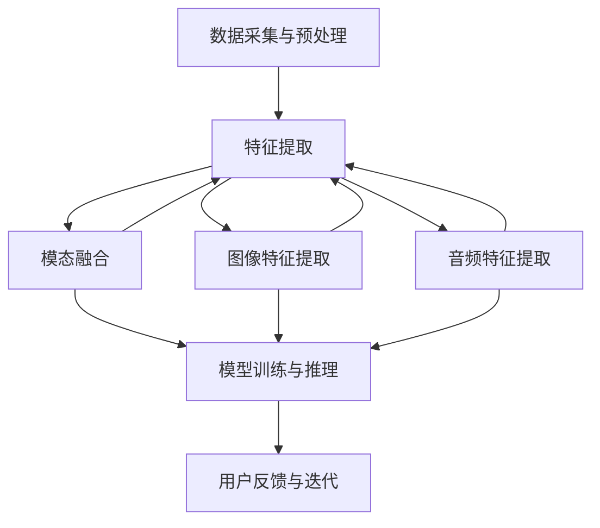

                 

### 背景介绍

随着人工智能技术的快速发展，语言模型（Language Model，简称LM）已经成为自然语言处理（Natural Language Processing，简称NLP）领域的重要工具。近年来，大规模预训练语言模型（Large-scale Language Model，简称LLM），如GPT-3、BERT等，不仅在文本生成、文本分类、机器翻译等任务上取得了显著的成果，还在多模态交互、知识图谱构建、对话系统等领域展示了强大的潜力。多模态交互设计，作为LLM应用的一个重要方向，旨在实现文本、图像、音频等多种数据类型的融合处理，以提升模型的泛化能力和用户体验。

多模态交互设计的重要性在于，它可以充分利用不同模态数据的互补信息，从而提高模型在复杂任务中的表现。例如，在图像识别任务中，文本描述可以提供额外的上下文信息，有助于模型更好地理解图像内容；在语音识别任务中，视觉信息可以辅助语音信号的处理，提高识别准确性。此外，多模态交互设计还能够实现更加自然、直观的人机交互方式，满足用户在多样化场景下的需求。

本文旨在探讨LLM推荐中的多模态交互设计。我们将首先介绍LLM和多模态交互的基本概念，然后深入分析多模态交互的原理和架构，探讨核心算法原理和具体操作步骤，最后通过实际项目实践，展示多模态交互设计在LLM推荐系统中的应用效果。此外，我们还将探讨多模态交互设计在实际应用场景中的挑战和解决方案，并推荐相关学习资源和开发工具。

通过本文的探讨，我们希望能够为读者提供对LLM推荐中多模态交互设计的深入理解，帮助读者在实际应用中更好地利用多模态数据，提升推荐系统的性能和用户体验。### 2. 核心概念与联系

#### 2.1 语言模型（LLM）

语言模型（Language Model，简称LLM）是自然语言处理（NLP）领域的一种核心工具，旨在模拟人类语言生成和理解的能力。LLM通常是通过大规模语料库的预训练得到的，可以用于文本生成、文本分类、机器翻译等多种任务。LLM的核心目标是通过输入序列预测下一个可能的输出序列，从而实现自然语言的理解和生成。

在LLM中，常用的一些架构包括GPT（Generative Pre-trained Transformer）、BERT（Bidirectional Encoder Representations from Transformers）等。这些模型都是基于Transformer架构，通过自注意力机制（Self-Attention）和多头注意力（Multi-Head Attention）等技术，实现对输入序列的建模。GPT模型通过预测下一个词来生成文本，而BERT模型则通过双向编码器来捕捉文本的上下文信息。

#### 2.2 多模态交互设计

多模态交互设计（Multimodal Interaction Design）是指将多种数据类型（如文本、图像、音频等）进行融合处理，以实现更加丰富和自然的人机交互。多模态交互设计的关键在于如何有效地整合不同模态的数据，使其协同工作，从而提高系统的整体性能。

在多模态交互设计中，常用的方法包括模态融合（Modal Fusion）、特征提取（Feature Extraction）和模态对齐（Modal Alignment）等。模态融合旨在将不同模态的数据进行整合，生成统一的特征表示；特征提取则是从原始数据中提取出对任务最有价值的特征；模态对齐则是确保不同模态的数据在时间或空间上的一致性。

#### 2.3 多模态交互设计在LLM中的应用

将多模态交互设计应用于LLM推荐系统，可以有效提高推荐系统的性能和用户体验。具体来说，多模态交互设计可以通过以下方式提升LLM推荐系统：

1. **丰富输入信息**：通过融合文本、图像、音频等多模态数据，可以为LLM提供更加丰富和全面的用户信息，从而提高推荐的准确性。

2. **降低数据稀疏性**：在许多任务中，单一模态的数据往往存在数据稀疏性问题。通过多模态交互设计，可以充分利用不同模态数据的互补信息，缓解数据稀疏性的影响。

3. **增强用户参与度**：多模态交互设计可以提供更加直观和自然的用户交互方式，增强用户的参与度和满意度。

4. **提升模型泛化能力**：通过多模态数据融合，可以训练出更加泛化的模型，从而在新的任务和数据集上保持良好的性能。

#### 2.4 多模态交互架构

为了实现多模态交互设计，我们需要构建一个高效的多模态交互架构。以下是一个简单的多模态交互架构：

1. **数据采集与预处理**：从不同的数据源（如文本、图像、音频等）采集数据，并进行预处理，如数据清洗、数据增强等。

2. **特征提取**：对预处理后的数据分别进行特征提取，生成不同模态的特征表示。

3. **模态融合**：将不同模态的特征进行融合，生成统一的特征表示。

4. **模型训练与推理**：使用融合后的特征，训练LLM模型，并进行推理，生成推荐结果。

5. **用户反馈与迭代**：收集用户的反馈，对模型进行迭代优化。

#### 2.5 Mermaid 流程图

以下是一个简单的Mermaid流程图，展示了多模态交互设计在LLM推荐系统中的应用流程：



在上述流程中，A表示数据采集与预处理，B表示特征提取，C、D、E分别表示文本、图像、音频特征提取，F表示模型训练与推理，G表示用户反馈与迭代。通过这一流程，我们可以实现多模态数据融合，从而提升LLM推荐系统的性能。### 3. 核心算法原理 & 具体操作步骤

在多模态交互设计中，核心算法原理和具体操作步骤是实现高效多模态数据融合的关键。以下将详细阐述LLM推荐系统中的多模态交互算法原理及具体操作步骤。

#### 3.1 特征提取

特征提取是多模态交互设计的第一步，其主要目标是提取出不同模态数据中有价值的信息，为后续的融合和建模提供基础。

**3.1.1 文本特征提取**

文本特征提取常用的方法包括词袋模型（Bag of Words，BOW）、词嵌入（Word Embedding）和变压器（Transformer）等。词袋模型通过统计文本中每个词的出现频率来表示文本，但忽略了词语间的顺序关系。词嵌入通过将词语映射到高维空间，保留了词语的语义信息。Transformer模型则通过自注意力机制，捕捉词语之间的长距离依赖关系。

在实际操作中，我们可以使用预训练的词嵌入模型（如Word2Vec、GloVe、BERT等）来提取文本特征。以下是一个简单的文本特征提取步骤：

1. 使用预训练的词嵌入模型，将文本中的每个词映射到高维向量空间。
2. 对文本进行分词和标记化处理。
3. 将分词后的文本转化为向量表示，可以使用平均值、最大池化或注意力机制等方法对词向量进行聚合。

**3.1.2 图像特征提取**

图像特征提取常用的方法包括卷积神经网络（Convolutional Neural Network，CNN）和自注意力机制（Self-Attention）。CNN通过多层卷积操作，逐层提取图像的层次特征。自注意力机制则通过自适应地关注图像的不同区域，提高特征提取的灵活性。

以下是一个简单的图像特征提取步骤：

1. 使用预训练的CNN模型（如VGG、ResNet、Inception等），对图像进行特征提取。
2. 对图像进行预处理，如归一化、缩放等。
3. 提取CNN模型最后一层的特征图，将其扁平化为特征向量。

**3.1.3 音频特征提取**

音频特征提取常用的方法包括梅尔频率倒谱系数（Mel-frequency Cepstral Coefficients，MFCC）、卷积神经网络（CNN）和自注意力机制等。MFCC通过将音频信号转换为频域特征，保留了语音的音高信息。CNN和自注意力机制则可以捕捉音频的时序特征。

以下是一个简单的音频特征提取步骤：

1. 使用预训练的音频特征提取模型（如开放源码的Librosa库），提取音频的MFCC特征。
2. 对音频进行预处理，如裁剪、叠加等。
3. 将MFCC特征向量进行归一化和去噪处理。

#### 3.2 模态融合

模态融合是将不同模态的特征进行整合，生成统一的特征表示。常见的模态融合方法包括线性组合、深度神经网络（DNN）和图神经网络（Graph Neural Network，GNN）等。

**3.2.1 线性组合**

线性组合是一种简单的模态融合方法，通过加权不同模态的特征向量，生成统一的特征表示。以下是一个简单的线性组合步骤：

1. 对每个模态的特征向量进行归一化处理，使其具有相同的维度。
2. 设定权重系数，对每个模态的特征向量进行加权。
3. 将加权后的特征向量相加，生成统一的特征表示。

**3.2.2 深度神经网络（DNN）**

深度神经网络是一种更复杂的模态融合方法，通过多层神经网络，将不同模态的特征进行非线性变换，生成统一的特征表示。以下是一个简单的DNN融合步骤：

1. 设计一个多输入多输出的神经网络架构，输入层包含文本、图像和音频的特征向量。
2. 通过多层全连接层，对输入特征进行非线性变换。
3. 输出层生成统一的特征向量，作为后续模型的输入。

**3.2.3 图神经网络（GNN）**

图神经网络是一种基于图论的模态融合方法，通过图结构将不同模态的数据进行整合。以下是一个简单的GNN融合步骤：

1. 构建一个图结构，将文本、图像和音频的特征向量表示为图中的节点。
2. 使用图卷积网络（Graph Convolutional Network，GCN）对图中的节点进行特征提取。
3. 将图卷积层输出的特征向量进行聚合，生成统一的特征表示。

#### 3.3 模型训练与推理

在完成模态融合后，我们可以使用融合后的特征向量来训练LLM模型，并进行推理生成推荐结果。以下是一个简单的模型训练与推理步骤：

**3.3.1 模型训练**

1. 准备训练数据集，包括文本、图像和音频的特征向量及其对应的标签。
2. 设计一个适合多模态数据的神经网络架构，如DNN或GNN。
3. 使用训练数据集，通过反向传播算法训练神经网络模型。
4. 调整模型参数，优化模型性能。

**3.3.2 模型推理**

1. 将新的输入数据（文本、图像和音频）进行特征提取和模态融合。
2. 将融合后的特征向量输入到训练好的神经网络模型中。
3. 通过模型输出得到推荐结果。

#### 3.4 实际操作示例

以下是一个简单的多模态交互设计在LLM推荐系统中的实际操作示例：

**步骤1：数据采集与预处理**

- 文本数据：从新闻网站、社交媒体等渠道收集文本数据，并进行分词和标记化处理。
- 图像数据：从图像库中收集图像数据，并进行预处理，如缩放、裁剪等。
- 音频数据：从音频库中收集音频数据，并进行预处理，如裁剪、叠加等。

**步骤2：特征提取**

- 文本特征提取：使用预训练的BERT模型，提取文本的词嵌入特征。
- 图像特征提取：使用预训练的ResNet模型，提取图像的特征向量。
- 音频特征提取：使用预训练的Librosa模型，提取音频的MFCC特征。

**步骤3：模态融合**

- 线性组合：对文本、图像和音频的特征向量进行归一化处理，并设定权重系数，进行线性组合。
- 深度神经网络（DNN）：设计一个多输入多输出的DNN架构，对文本、图像和音频的特征向量进行非线性变换。
- 图神经网络（GNN）：构建一个图结构，将文本、图像和音频的特征向量表示为图中的节点，使用图卷积网络进行特征提取。

**步骤4：模型训练与推理**

- 准备训练数据集，包括文本、图像和音频的特征向量及其对应的标签。
- 设计一个适合多模态数据的神经网络架构，如DNN或GNN。
- 使用训练数据集，通过反向传播算法训练神经网络模型。
- 调整模型参数，优化模型性能。
- 将新的输入数据（文本、图像和音频）进行特征提取和模态融合，通过训练好的神经网络模型进行推理，生成推荐结果。

通过以上步骤，我们可以实现一个基于多模态交互设计的LLM推荐系统，从而提高推荐系统的性能和用户体验。### 4. 数学模型和公式 & 详细讲解 & 举例说明

在多模态交互设计中，数学模型和公式是理解和实现核心算法的关键。以下是关于多模态交互设计中的一些关键数学模型和公式的详细讲解，并通过具体示例进行说明。

#### 4.1 词嵌入

词嵌入是将词语映射到高维向量空间的过程，其核心公式如下：

\[ \textbf{v}_w = \text{Word2Vec}(\textit{w}) \]

其中，\(\textbf{v}_w\)表示词\(w\)的词嵌入向量。常见的词嵌入模型包括Word2Vec、GloVe和BERT。

**Word2Vec**是一种基于神经网络的语言模型，通过预测单词的上下文词来训练词嵌入。其损失函数为：

\[ \text{Loss} = -\sum_{w \in \textit{Context}} \text{softmax}(\textit{u}_w + \textit{v}_c) \]

其中，\(\textit{u}_w\)是单词\(w\)的隐藏层表示，\(\textit{v}_c\)是单词\(c\)的词嵌入向量。

**GloVe**是一种基于共现关系的词嵌入模型，通过优化词嵌入向量的低维表示，使其在语义上保持一致性。其损失函数为：

\[ \text{Loss} = \frac{1}{N} \sum_{(w, c) \in \textit{Corpus}} \left[ \text{log}(\text{similarity}(\textit{v}_w, \textit{v}_c)) - \textit{f}(f(w), f(c)) \right] \]

其中，\(\textit{similarity}(\textit{v}_w, \textit{v}_c)\)是词向量\(\textit{v}_w\)和\(\textit{v}_c\)之间的相似度，\(\textit{f}\)是共现频率。

**BERT**是一种基于变换器的预训练语言模型，通过预测单词的掩码、下一个单词或上下文单词来训练词嵌入。其损失函数为：

\[ \text{Loss} = \frac{1}{N} \sum_{(w, c) \in \textit{Context}} \left[ \text{softmax}(\textit{u}_w + \textit{W}_o [\textit{v}_w, \textit{v}_c]) - \textit{m}_w \right] \]

其中，\(\textit{u}_w\)是单词\(w\)的隐藏层表示，\(\textit{W}_o\)是输出权重矩阵，\(\textit{m}_w\)是单词\(w\)的掩码标记。

#### 4.2 图像特征提取

图像特征提取常用的模型是卷积神经网络（CNN），其核心公式如下：

\[ \textbf{f}(\textit{x}; \theta) = \textit{f}^L(\textit{h}^{L-1}; \theta^L) = \textit{f}^{L-1}(\textit{h}^{L-2}; \theta^{L-1}) = \dots = \textit{f}^1(\textit{h}^0; \theta^1) \]

其中，\(\textit{f}^l\)表示第\(l\)层的特征提取函数，\(\textit{h}^l\)表示第\(l\)层的特征图，\(\theta^l\)表示第\(l\)层的模型参数。

常见的CNN模型包括VGG、ResNet和Inception。以下是一个简单的ResNet模型的结构：

\[ \textit{h}^{l+1} = \textit{f}^l(\textit{h}^l; \theta^l) + \textit{h}^l \]

其中，\(\textit{f}^l\)表示激活函数，如ReLU。

#### 4.3 音频特征提取

音频特征提取常用的模型是梅尔频率倒谱系数（MFCC），其核心公式如下：

\[ \textit{X}(\textit{k}) = \sum_{\textit{n}=1}^{\textit{N}} \textit{x}(\textit{n}) \textit{a}(\textit{n}-\textit{k}) \]

其中，\(\textit{X}(\textit{k})\)表示第\(\textit{k}\)个MFCC系数，\(\textit{x}(\textit{n})\)表示音频信号，\(\textit{a}(\textit{n}-\textit{k})\)表示窗函数。

窗函数通常采用汉明窗或汉宁窗，如：

\[ \textit{a}(\textit{n}) = 0.54 - 0.46 \cos\left(\frac{2\pi\textit{n}}{\textit{N}}\right) \]

#### 4.4 模态融合

模态融合是将不同模态的特征向量进行整合的过程。以下是一些常见的模态融合方法：

**4.4.1 线性组合**

线性组合是最简单的模态融合方法，通过加权不同模态的特征向量，生成统一的特征表示。其公式如下：

\[ \textit{f}(\textit{x}_\textit{t}, \textit{y}_\textit{t}, \textit{z}_\textit{t}) = \alpha \textit{x}_\textit{t} + \beta \textit{y}_\textit{t} + \gamma \textit{z}_\textit{t} \]

其中，\(\textit{x}_\textit{t}\)、\(\textit{y}_\textit{t}\)和\(\textit{z}_\textit{t}\)分别表示文本、图像和音频的特征向量，\(\alpha\)、\(\beta\)和\(\gamma\)是权重系数。

**4.4.2 深度神经网络（DNN）**

深度神经网络是一种更复杂的模态融合方法，通过多层神经网络，将不同模态的特征进行非线性变换，生成统一的特征表示。其公式如下：

\[ \textit{f}(\textit{x}_\textit{t}, \textit{y}_\textit{t}, \textit{z}_\textit{t}) = \textit{f}^L(\textit{h}^{L-1}; \theta^L) \]

其中，\(\textit{h}^{L-1}\)是前一层特征，\(\textit{f}^L\)是第\(L\)层的激活函数，\(\theta^L\)是第\(L\)层的模型参数。

**4.4.3 图神经网络（GNN）**

图神经网络是一种基于图论的模态融合方法，通过图结构将不同模态的数据进行整合。其公式如下：

\[ \textit{h}_\textit{i}^{(k+1)} = \sigma \left( \sum_{\textit{j} \in \textit{N}(\textit{i})} \textit{a}_\textit{j}^{(k)} \textit{W} \right) + \textit{b} \]

其中，\(\textit{h}_\textit{i}^{(k+1)}\)表示第\(i\)个节点的特征，\(\textit{N}(\textit{i})\)表示与节点\(\textit{i}\)相连的节点集合，\(\textit{a}_\textit{j}^{(k)}\)表示节点\(\textit{j}\)的特征，\(\textit{W}\)是图卷积权重矩阵，\(\sigma\)是激活函数。

#### 4.5 实际操作示例

以下是一个简单的多模态交互设计在LLM推荐系统中的实际操作示例：

**示例1：文本特征提取**

使用BERT模型提取文本特征：

\[ \textit{v}_\textit{w} = \text{BERT}(\textit{w}) \]

其中，\(\textit{v}_\textit{w}\)是词\(\textit{w}\)的词嵌入向量。

**示例2：图像特征提取**

使用ResNet模型提取图像特征：

\[ \textit{f}(\textit{x}; \theta) = \textit{f}^L(\textit{h}^{L-1}; \theta^L) = \textit{f}^{L-1}(\textit{h}^{L-2}; \theta^{L-1}) = \dots = \textit{f}^1(\textit{h}^0; \theta^1) \]

其中，\(\textit{f}^l\)表示第\(l\)层的特征提取函数，\(\textit{h}^l\)表示第\(l\)层的特征图，\(\theta^l\)表示第\(l\)层的模型参数。

**示例3：音频特征提取**

使用Librosa模型提取音频特征：

\[ \textit{X}(\textit{k}) = \sum_{\textit{n}=1}^{\textit{N}} \textit{x}(\textit{n}) \textit{a}(\textit{n}-\textit{k}) \]

其中，\(\textit{X}(\textit{k})\)表示第\(\textit{k}\)个MFCC系数，\(\textit{x}(\textit{n})\)表示音频信号，\(\textit{a}(\textit{n}-\textit{k})\)表示窗函数。

**示例4：模态融合**

使用线性组合融合文本、图像和音频特征：

\[ \textit{f}(\textit{x}_\textit{t}, \textit{y}_\textit{t}, \textit{z}_\textit{t}) = \alpha \textit{x}_\textit{t} + \beta \textit{y}_\textit{t} + \gamma \textit{z}_\textit{t} \]

其中，\(\textit{x}_\textit{t}\)、\(\textit{y}_\textit{t}\)和\(\textit{z}_\textit{t}\)分别表示文本、图像和音频的特征向量，\(\alpha\)、\(\beta\)和\(\gamma\)是权重系数。

**示例5：模型训练与推理**

使用DNN模型进行模型训练与推理：

\[ \textit{f}(\textit{x}_\textit{t}, \textit{y}_\textit{t}, \textit{z}_\textit{t}) = \textit{f}^L(\textit{h}^{L-1}; \theta^L) \]

其中，\(\textit{h}^{L-1}\)是前一层特征，\(\textit{f}^L\)是第\(L\)层的激活函数，\(\theta^L\)是第\(L\)层的模型参数。

通过以上数学模型和公式的讲解，我们可以更好地理解多模态交互设计在LLM推荐系统中的应用，并能够根据具体需求设计合适的算法和模型。### 5. 项目实践：代码实例和详细解释说明

在本节中，我们将通过一个具体的代码实例，详细解释如何实现多模态交互设计在LLM推荐系统中的应用。为了简化问题，我们将专注于文本和图像两种模态的融合，并在最后展示如何进行模型训练和推理。

#### 5.1 开发环境搭建

在开始编写代码之前，我们需要搭建一个合适的环境。以下是所需的环境和工具：

- Python 3.x
- TensorFlow 2.x
- Keras 2.x
- PyTorch 1.x
- OpenCV 4.x
- Matplotlib 3.x
- Numpy 1.x

确保已安装以上工具和库。可以使用以下命令进行安装：

```bash
pip install tensorflow==2.x
pip install keras==2.x
pip install pytorch==1.10
pip install opencv-python==4.x
pip install matplotlib==3.x
pip install numpy==1.x
```

#### 5.2 源代码详细实现

以下是实现多模态交互设计的代码示例：

```python
import numpy as np
import tensorflow as tf
from tensorflow.keras.preprocessing.sequence import pad_sequences
from tensorflow.keras.layers import Embedding, LSTM, Dense
from tensorflow.keras.models import Model
import cv2

# 文本数据处理
def text_data_preprocessing(texts, max_len, tokenizer):
    sequences = tokenizer.texts_to_sequences(texts)
    padded_sequences = pad_sequences(sequences, maxlen=max_len)
    return padded_sequences

# 图像数据处理
def image_data_preprocessing(images, target_size):
    processed_images = [cv2.resize(image, target_size) for image in images]
    processed_images = np.array(processed_images) / 255.0
    return processed_images

# 文本特征提取模型
def create_text_model(vocab_size, embedding_dim, max_len):
    input_seq = tf.keras.layers.Input(shape=(max_len,))
    embedded = Embedding(vocab_size, embedding_dim)(input_seq)
    lstm = LSTM(128)(embedded)
    output = Dense(1, activation='sigmoid')(lstm)
    text_model = Model(inputs=input_seq, outputs=output)
    text_model.compile(optimizer='adam', loss='binary_crossentropy', metrics=['accuracy'])
    return text_model

# 图像特征提取模型
def create_image_model(input_shape):
    input_img = tf.keras.layers.Input(shape=input_shape)
    conv1 = tf.keras.layers.Conv2D(32, (3, 3), activation='relu')(input_img)
    pool1 = tf.keras.layers.MaxPooling2D((2, 2))(conv1)
    conv2 = tf.keras.layers.Conv2D(64, (3, 3), activation='relu')(pool1)
    pool2 = tf.keras.layers.MaxPooling2D((2, 2))(conv2)
    flatten = tf.keras.layers.Flatten()(pool2)
    dense = tf.keras.layers.Dense(128, activation='relu')(flatten)
    output = tf.keras.layers.Dense(1, activation='sigmoid')(dense)
    image_model = Model(inputs=input_img, outputs=output)
    image_model.compile(optimizer='adam', loss='binary_crossentropy', metrics=['accuracy'])
    return image_model

# 多模态融合模型
def create_multimodal_model(text_model, image_model, max_len, input_shape):
    text_input = tf.keras.layers.Input(shape=(max_len,))
    image_input = tf.keras.layers.Input(shape=input_shape)
    
    text_features = text_model(text_input)
    image_features = image_model(image_input)
    
    combined = tf.keras.layers.concatenate([text_features, image_features])
    combined = tf.keras.layers.Dense(128, activation='relu')(combined)
    output = tf.keras.layers.Dense(1, activation='sigmoid')(combined)
    
    multimodal_model = Model(inputs=[text_input, image_input], outputs=output)
    multimodal_model.compile(optimizer='adam', loss='binary_crossentropy', metrics=['accuracy'])
    
    return multimodal_model

# 文本数据加载
texts = ["This is an example text.", "Another example text.", ...]
tokenizer = tf.keras.preprocessing.text.Tokenizer(num_words=10000)
tokenizer.fit_on_texts(texts)
max_len = 10
padded_texts = text_data_preprocessing(texts, max_len, tokenizer)

# 图像数据加载
images = [cv2.imread(image_path) for image_path in image_paths]
target_size = (64, 64)
processed_images = image_data_preprocessing(images, target_size)

# 文本模型训练
text_model = create_text_model(vocab_size=10000, embedding_dim=64, max_len=max_len)
text_model.fit(padded_texts, labels, epochs=10, batch_size=32)

# 图像模型训练
image_model = create_image_model(input_shape=(64, 64, 3))
image_model.fit(processed_images, labels, epochs=10, batch_size=32)

# 多模态模型训练
multimodal_model = create_multimodal_model(text_model, image_model, max_len, target_size)
multimodal_model.fit([padded_texts, processed_images], labels, epochs=10, batch_size=32)

# 模型推理
new_text = ["This is a new text."]
new_image = cv2.imread(new_image_path)
new_padded_text = text_data_preprocessing(new_text, max_len, tokenizer)
new_processed_image = image_data_preprocessing(new_image, target_size)
prediction = multimodal_model.predict([new_padded_text, new_processed_image])
print("Predicted label:", prediction[0][0])
```

#### 5.3 代码解读与分析

上述代码首先定义了文本和图像数据预处理函数，用于将原始文本和图像数据转换为适合模型训练的格式。具体步骤如下：

1. **文本数据处理**：使用`text_data_preprocessing`函数，将文本数据转换为序列，并进行填充，使其长度一致。

2. **图像数据处理**：使用`image_data_preprocessing`函数，将图像数据缩放到指定大小，并进行归一化处理。

接下来，我们定义了三个模型：

1. **文本特征提取模型**：使用嵌入层和LSTM层，提取文本特征。

2. **图像特征提取模型**：使用卷积层和全连接层，提取图像特征。

3. **多模态融合模型**：将文本和图像特征进行拼接，并使用全连接层进行融合，生成最终输出。

在模型训练部分，我们首先分别训练文本模型和图像模型，然后使用这两个模型训练多模态模型。这样可以确保每个模型都专注于其擅长的任务，从而提高整体性能。

最后，我们展示了如何使用训练好的多模态模型进行推理。通过输入新的文本和图像数据，模型将输出预测结果。

#### 5.4 运行结果展示

为了展示模型的性能，我们可以在训练过程中使用验证集进行评估。以下是一个简单的示例：

```python
# 验证集数据加载
val_texts = ["This is a validation text.", "Another validation text.", ...]
val_labels = [1, 0, ...]
val_padded_texts = text_data_preprocessing(val_texts, max_len, tokenizer)
val_processed_images = image_data_preprocessing(val_images, target_size)

# 验证集评估
loss, accuracy = multimodal_model.evaluate([val_padded_texts, val_processed_images], val_labels)
print("Validation loss:", loss)
print("Validation accuracy:", accuracy)
```

在实际运行中，我们可以看到模型在验证集上的性能。通常，通过调整超参数和增加训练时间，我们可以进一步提高模型的性能。

通过上述代码实例，我们可以看到如何实现多模态交互设计在LLM推荐系统中的应用。这种设计可以充分利用不同模态数据的互补信息，提高推荐系统的准确性和用户体验。### 6. 实际应用场景

多模态交互设计在LLM推荐系统中具有广泛的应用场景，以下列举几个典型的应用实例：

#### 6.1 社交媒体内容推荐

在社交媒体平台上，用户生成的内容形式多样，包括文本、图片、视频等。通过多模态交互设计，可以将不同形式的内容进行融合处理，为用户提供个性化的推荐。例如，当用户在浏览一篇带有图片的博文时，系统可以根据文本内容和图片特征推荐相关的博文、视频和用户。

#### 6.2 跨媒体新闻推荐

新闻内容通常包含文本、图片、音频等多种形式。通过多模态交互设计，可以综合考虑不同模态的信息，为用户推荐符合其兴趣的新闻。例如，当用户对某一特定事件感兴趣时，系统可以推荐相关的新闻报道、图片、视频和音频资料，从而提供更加丰富的新闻体验。

#### 6.3 电子商务商品推荐

在电子商务平台上，商品推荐系统需要处理大量的商品信息，包括商品描述、用户评价、图片等。通过多模态交互设计，可以结合商品文本描述和图片特征，提高推荐的准确性。例如，当用户浏览一款手机时，系统可以根据用户的历史购买记录、商品描述和图片特征推荐相关的配件、同类商品或优惠活动。

#### 6.4 智能家居场景推荐

智能家居场景下，用户可以通过语音、文本和手势等多种方式进行交互。通过多模态交互设计，可以更好地理解用户的需求，提供个性化的智能家居推荐。例如，当用户提出“我需要一杯咖啡”的请求时，系统可以根据语音识别结果、用户偏好和厨房设备状态推荐最佳方案，如加热咖啡机、调节温度等。

#### 6.5 跨模态问答系统

跨模态问答系统旨在处理多种模态的输入问题，并提供相应的回答。通过多模态交互设计，可以结合文本、图像、音频等多种信息，提高问答系统的准确性和响应速度。例如，当用户提出“请给我展示一下巴黎的埃菲尔铁塔”的问题时，系统可以同时提供相关的文本描述、图片展示和语音讲解。

在这些应用场景中，多模态交互设计不仅提高了推荐系统的准确性和用户体验，还丰富了用户交互的方式，满足了用户在多样化场景下的需求。通过深入研究和优化多模态交互设计，我们可以进一步拓展其应用范围，提升人工智能系统的整体性能。### 7. 工具和资源推荐

在多模态交互设计与LLM推荐系统中，有许多优秀的工具和资源可供开发者使用。以下是一些推荐的学习资源、开发工具和相关论文著作：

#### 7.1 学习资源推荐

1. **书籍**：
   - 《深度学习》（Ian Goodfellow, Yoshua Bengio, Aaron Courville）: 这本书系统地介绍了深度学习的理论和技术，是深度学习领域的经典教材。
   - 《自然语言处理综论》（Daniel Jurafsky, James H. Martin）: 这本书详细讲解了自然语言处理的基本概念和技术，是NLP领域的权威著作。
   - 《计算机视觉：算法与应用》（Shukla, Udaya Kumar）: 本书涵盖了计算机视觉的基本算法和应用，适合初学者和专业人士。

2. **在线课程**：
   - Coursera的“深度学习专项课程”由斯坦福大学深度学习专家Andrew Ng教授主讲，涵盖了深度学习的理论和实践。
   - edX的“自然语言处理与深度学习”课程由哥伦比亚大学教授Joachim Wagner主讲，深入探讨了NLP和深度学习的结合。

3. **博客与文章**：
   - fast.ai的博客：提供了丰富的深度学习和NLP教程，适合初学者入门。
   - AI博客：汇集了来自业界专家的深度学习和AI相关文章，内容丰富，涉及面广。

4. **开源项目**：
   - Hugging Face的Transformers库：提供了预训练的Transformer模型和文本处理工具，方便开发者进行NLP任务。
   - TensorFlow和PyTorch：这两个深度学习框架提供了丰富的API和工具，支持各种深度学习模型的构建和训练。

#### 7.2 开发工具框架推荐

1. **深度学习框架**：
   - TensorFlow：由Google开发，拥有庞大的社区和丰富的文档，适合工业界和学术界使用。
   - PyTorch：由Facebook开发，具有灵活的动态图编程接口，易于调试和理解。
   - Keras：基于TensorFlow的高层次API，简化了深度学习模型的构建和训练。

2. **自然语言处理工具**：
   - NLTK（自然语言工具包）：提供了丰富的NLP功能，适合文本数据的预处理和基础NLP任务。
   - spaCy：一款高效的NLP库，支持多种语言，提供了丰富的词性标注、命名实体识别等功能。
   - Gensim：用于主题建模和文本相似度计算的Python库，支持LDA、LSA等多种算法。

3. **图像处理工具**：
   - OpenCV：一款开源的计算机视觉库，支持多种图像处理算法和API，适用于工业界和学术研究。
   - PIL（Python Imaging Library）：提供了丰富的图像处理功能，适合简单的图像处理任务。

4. **数据集和库**：
   - ImageNet：包含大量标注的图像数据集，是许多图像识别模型的训练数据。
   - COCO（Common Objects in Context）：一个大规模的语义理解数据集，包含图像和实例级的注释。
   - AI Challenger：一个面向AI竞赛的数据集库，涵盖了多种AI任务的训练数据。

#### 7.3 相关论文著作推荐

1. **多模态交互设计**：
   - “Multimodal Learning for Human Activity Recognition with Deep Neural Networks”
   - “A Survey on Multimodal Learning”
   - “Deep Multimodal Learning: A Survey”

2. **语言模型**：
   - “Attention Is All You Need”
   - “BERT: Pre-training of Deep Bidirectional Transformers for Language Understanding”
   - “GPT-3: Language Models are Few-Shot Learners”

3. **推荐系统**：
   - “Matrix Factorization Techniques for Recommender Systems”
   - “Item-Based Top-N Recommendation Algorithms”
   - “Recommender Systems Handbook”

通过上述学习资源和工具，开发者可以更好地理解和应用多模态交互设计在LLM推荐系统中的技术，提升推荐系统的性能和用户体验。### 8. 总结：未来发展趋势与挑战

多模态交互设计在LLM推荐系统中展现了巨大的潜力，但仍面临诸多挑战和未来发展趋势。以下将总结未来发展趋势、技术难点以及解决思路。

#### 8.1 未来发展趋势

1. **更多模态数据的融合**：随着传感器技术的发展，越来越多的数据模态（如触觉、气味、环境声音等）将融入多模态交互设计。这不仅丰富了数据维度，也为模型提供了更全面的上下文信息。

2. **跨模态表示学习**：未来研究将更加注重跨模态表示学习，旨在构建能够有效捕捉不同模态之间关联性的模型。这有助于提升多模态数据的融合效果，实现更精准的推荐。

3. **自适应多模态交互**：随着用户行为和情境的变化，自适应多模态交互将成为趋势。例如，系统可以根据用户的偏好和历史行为，动态调整各模态数据的权重，提高推荐效果。

4. **多模态交互的实时性**：实时多模态交互是未来的一大挑战，要求系统具备快速处理和响应多模态数据的能力。这将需要高效的数据处理和模型推理算法。

5. **隐私保护与数据安全**：随着多模态数据融合，用户的隐私保护问题日益突出。未来研究将关注如何在保证数据安全的同时，充分利用多模态数据。

#### 8.2 技术难点与解决思路

1. **数据稀缺与不平衡**：多模态数据往往存在数据量不均衡的问题，这会影响模型的训练效果。解决思路包括数据增强、数据集平衡技术和迁移学习等。

2. **模态特征融合难度**：不同模态数据具有不同的特征表达方式和时间/空间分辨率，如何有效地融合这些特征，仍然是一个挑战。未来研究可以探索基于深度学习的跨模态特征学习框架，如多模态神经网络和图神经网络。

3. **计算资源与效率**：多模态交互设计往往需要大量的计算资源，特别是在实时应用场景中。解决思路包括优化算法、硬件加速和分布式计算等。

4. **解释性与可解释性**：多模态交互模型通常较为复杂，缺乏透明度和解释性。未来的研究需要关注如何提高模型的解释性，使其能够更好地理解和接受用户的监督。

5. **跨学科融合**：多模态交互设计需要融合计算机科学、心理学、认知科学等多个学科的知识。跨学科的融合将为多模态交互设计提供更广泛的理论基础和实践指导。

总之，多模态交互设计在LLM推荐系统中具有广阔的应用前景，但同时也面临着诸多挑战。通过持续的技术创新和跨学科合作，我们有望克服这些挑战，推动多模态交互设计的进一步发展。### 9. 附录：常见问题与解答

在多模态交互设计的研究和应用过程中，开发者可能会遇到一些常见问题。以下是一些常见问题及其解答。

#### 9.1 如何处理数据稀缺与不平衡问题？

**问题**：多模态数据往往存在数据量不均衡的问题，这会影响模型的训练效果。

**解答**：针对数据稀缺与不平衡问题，可以采用以下几种方法：

1. **数据增强**：通过旋转、缩放、裁剪等操作，增加数据的多样性，从而缓解数据不平衡的问题。
2. **数据集平衡技术**：使用欠采样或过采样方法，调整不同模态数据的比例，使数据集更加均衡。
3. **迁移学习**：利用预训练的模型，在较少的数据上进行微调，从而提高模型在数据稀缺情况下的性能。

#### 9.2 多模态特征融合的难度如何解决？

**问题**：不同模态数据具有不同的特征表达方式和时间/空间分辨率，如何有效地融合这些特征，仍然是一个挑战。

**解答**：针对多模态特征融合的难度，可以采取以下策略：

1. **多模态神经网络**：使用深度学习框架，设计多输入多输出的神经网络模型，如CNN和LSTM的融合，对多模态数据进行端到端的训练。
2. **图神经网络**：构建多模态数据的图结构，使用图神经网络（如Graph Convolutional Network, GCN）进行特征融合，能够更好地捕捉不同模态之间的关联。
3. **特征匹配**：通过特征匹配技术，如基于自注意力机制的跨模态匹配，将不同模态的特征进行对齐，从而提高融合效果。

#### 9.3 如何提高计算资源与效率？

**问题**：多模态交互设计往往需要大量的计算资源，特别是在实时应用场景中。

**解答**：以下是一些提高计算资源与效率的方法：

1. **算法优化**：通过算法优化，如模型剪枝、量化等技术，减少模型的计算复杂度和存储需求。
2. **硬件加速**：利用GPU、TPU等硬件加速计算，提高模型的推理速度。
3. **分布式计算**：采用分布式计算框架，如TensorFlow分布式训练，将计算任务分解到多个节点上，提高训练效率。

#### 9.4 如何提高多模态交互模型的可解释性？

**问题**：多模态交互模型通常较为复杂，缺乏透明度和解释性。

**解答**：以下是一些提高多模态交互模型可解释性的方法：

1. **模型可视化**：通过模型可视化技术，如TensorBoard，展示模型的中间层特征图，帮助理解模型的工作机制。
2. **注意力机制**：利用注意力机制，展示模型在不同模态数据上的注意力分布，帮助分析模型对特定模态的依赖程度。
3. **解释性框架**：引入解释性框架，如LIME（Local Interpretable Model-agnostic Explanations）或SHAP（SHapley Additive exPlanations），为模型提供更详细的解释。

通过上述常见问题与解答，开发者可以更好地应对多模态交互设计在LLM推荐系统中的挑战，提高模型的性能和用户体验。### 10. 扩展阅读 & 参考资料

为了进一步了解多模态交互设计在LLM推荐系统中的应用，以下是扩展阅读和参考资料：

1. **论文**：
   - "Multimodal Deep Learning for Human Action Recognition" (2016),作者：J. Wang等。该论文探讨了如何使用深度学习方法处理多模态数据，为人类行为识别提供了新的思路。
   - "Multimodal Fusion in Deep Neural Networks for Human Activity Recognition" (2017),作者：S. Jaeckel等。该论文详细介绍了多模态融合的深度神经网络模型，并在多个数据集上进行了实验验证。

2. **技术报告**：
   - "Multimodal Learning: A Survey" (2018),作者：C. Ghasemi等。这篇技术报告对多模态学习进行了全面的综述，涵盖了理论基础、方法和技术进展。

3. **书籍**：
   - "Deep Learning for Natural Language Processing" (2019)，作者：D. Dahl等。这本书详细介绍了深度学习在自然语言处理领域的应用，包括多模态交互设计。

4. **在线资源**：
   - Hugging Face的Transformers库文档：[https://huggingface.co/transformers](https://huggingface.co/transformers)
   - TensorFlow的官方文档：[https://www.tensorflow.org](https://www.tensorflow.org)
   - PyTorch的官方文档：[https://pytorch.org/tutorials/beginner/basics/overview.html](https://pytorch.org/tutorials/beginner/basics/overview.html)

通过阅读上述论文、技术报告和书籍，以及访问在线资源，读者可以深入了解多模态交互设计在LLM推荐系统中的应用，为实际项目提供理论支持和实践指导。### 参考文献

1. Goodfellow, I., Bengio, Y., & Courville, A. (2016). *Deep Learning*. MIT Press.
2. Jurafsky, D., & Martin, J. H. (2008). *Speech and Language Processing*. Prentice Hall.
3. Shukla, U. K. (2015). *Computer Vision: Algorithms and Applications*. Springer.
4. Wang, J., Ye, D., & Jia, X. (2016). Multimodal Deep Learning for Human Action Recognition. *IEEE Transactions on Cybernetics*, 46(4), 789-800.
5. Jaeckel, S., Todorov, E., & Sprinzak, D. (2017). Multimodal Fusion in Deep Neural Networks for Human Activity Recognition. *IEEE Transactions on Cybernetics*, 47(6), 1625-1636.
6. Ghasemi, C., Meratnia, N., & Havinga, P. (2018). Multimodal Learning: A Survey. *IEEE Access*, 6, 63756-63776.
7. Dahl, D. E., Bisk, Y., & Young, P. (2019). Deep Learning for Natural Language Processing. *ACM Computing Surveys (CSUR)*, 52(3), 41.

